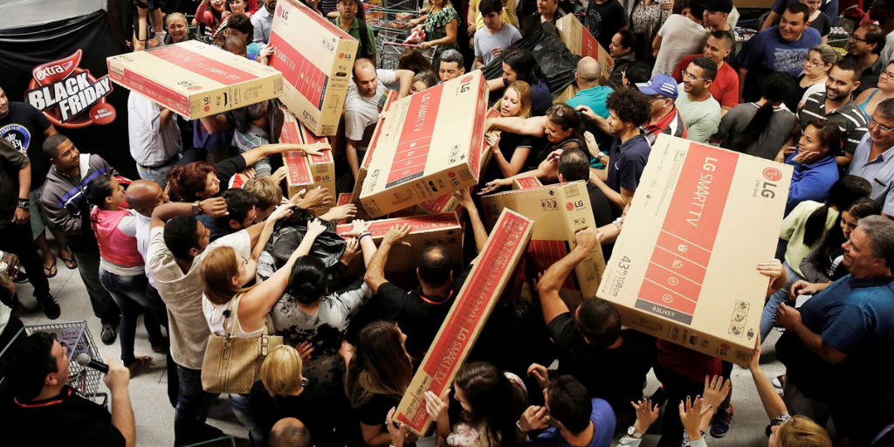

<html>
<head><meta charset="utf-8" />
<title>Black-Friday-Analysis</title>

<style type="text/css">
    /*!
*
* Twitter Bootstrap
*
*/
/*!
 * Bootstrap v3.3.7 (http://getbootstrap.com)
 * Copyright 2011-2016 Twitter, Inc.
 * Licensed under MIT (https://github.com/twbs/bootstrap/blob/master/LICENSE)
 */
/*! normalize.css v3.0.3 | MIT License | github.com/necolas/normalize.css */
html {
  font-family: sans-serif;
  -ms-text-size-adjust: 100%;
  -webkit-text-size-adjust: 100%;
}
body {
  margin: 0;
}
article,
aside,
details,
figcaption,
figure,
footer,
header,
hgroup,
main,
menu,
nav,
section,
summary {
  display: block;
}
audio,
canvas,
progress,
video {
  display: inline-block;
  vertical-align: baseline;
}
audio:not([controls]) {
  display: none;
  height: 0;
}
[hidden],
template {
  display: none;
}
a {
  background-color: transparent;
}
a:active,
a:hover {
  outline: 0;
}
abbr[title] {
  border-bottom: 1px dotted;
}
b,
strong {
  font-weight: bold;
}
dfn {
  font-style: italic;
}
h1 {
  font-size: 2em;
  margin: 0.67em 0;
}
mark {
  background: #ff0;
  color: #000;
}
small {
  font-size: 80%;
}
sub,
sup {
  font-size: 75%;
  line-height: 0;
  position: relative;
  vertical-align: baseline;
}
sup {
  top: -0.5em;
}
sub {
  bottom: -0.25em;
}
img {
  border: 0;
}
svg:not(:root) {
  overflow: hidden;
}
figure {
  margin: 1em 40px;
}
hr {
  box-sizing: content-box;
  height: 0;
}
pre {
  overflow: auto;
}
code,
kbd,
pre,
samp {
  font-family: monospace, monospace;
  font-size: 1em;
}
button,
input,
optgroup,
select,
textarea {
  color: inherit;
  font: inherit;
  margin: 0;
}
button {
  overflow: visible;
}
button,
select {
  text-transform: none;
}
button,
html input[type="button"],
input[type="reset"],
input[type="submit"] {
  -webkit-appearance: button;
  cursor: pointer;
}
button[disabled],
html input[disabled] {
  cursor: default;
}
button::-moz-focus-inner,
input::-moz-focus-inner {
  border: 0;
  padding: 0;
}
input {
  line-height: normal;
}
input[type="checkbox"],
input[type="radio"] {
  box-sizing: border-box;
  padding: 0;
}
input[type="number"]::-webkit-inner-spin-button,
input[type="number"]::-webkit-outer-spin-button {
  height: auto;
}
input[type="search"] {
  -webkit-appearance: textfield;
  box-sizing: content-box;
}
input[type="search"]::-webkit-search-cancel-button,
input[type="search"]::-webkit-search-decoration {
  -webkit-appearance: none;
}
fieldset {
  border: 1px solid #c0c0c0;
  margin: 0 2px;
  padding: 0.35em 0.625em 0.75em;
}
legend {
  border: 0;
  padding: 0;
}
textarea {
  overflow: auto;
}
optgroup {
  font-weight: bold;
}
table {
  border-collapse: collapse;
  border-spacing: 0;
}
td,
th {
  padding: 0;
}
/*! Source: https://github.com/h5bp/html5-boilerplate/blob/master/src/css/main.css */
@media print {
  *,
  *:before,
  *:after {
    background: transparent !important;
    color: #000 !important;
    box-shadow: none !important;
    text-shadow: none !important;
  }
  a,
  a:visited {
    text-decoration: underline;
  }
  a[href]:after {
    content: " (" attr(href) ")";
  }
  abbr[title]:after {
    content: " (" attr(title) ")";
  }
  a[href^="#"]:after,
  a[href^="javascript:"]:after {
    content: "";
  }
  pre,
  blockquote {
    border: 1px solid #999;
    page-break-inside: avoid;
  }
  thead {
    display: table-header-group;
  }
  tr,
  img {
    page-break-inside: avoid;
  }
  img {
    max-width: 100% !important;
  }
  p,
  h2,
  h3 {
    orphans: 3;
    widows: 3;
  }
  h2,
  h3 {
    page-break-after: avoid;
  }
  .navbar {
    display: none;
  }
  .btn > .caret,
  .dropup > .btn > .caret {
    border-top-color: #000 !important;
  }
  .label {
    border: 1px solid #000;
  }
  .table {
    border-collapse: collapse !important;
  }
  .table td,
  .table th {
    background-color: #fff !important;
  }
  .table-bordered th,
  .table-bordered td {
    border: 1px solid #ddd !important;
  }
}
@font-face {
  font-family: 'Glyphicons Halflings';
  src: url('../components/bootstrap/fonts/glyphicons-halflings-regular.eot');
  src: url('../components/bootstrap/fonts/glyphicons-halflings-regular.eot?#iefix') format('embedded-opentype'), url('../components/bootstrap/fonts/glyphicons-halflings-regular.woff2') format('woff2'), url('../components/bootstrap/fonts/glyphicons-halflings-regular.woff') format('woff'), url('../components/bootstrap/fonts/glyphicons-halflings-regular.ttf') format('truetype'), url('../components/bootstrap/fonts/glyphicons-halflings-regular.svg#glyphicons_halflingsregular') format('svg');
}
.glyphicon {
  position: relative;
  top: 1px;
  display: inline-block;
  font-family: 'Glyphicons Halflings';
  font-style: normal;
  font-weight: normal;
  line-height: 1;
  -webkit-font-smoothing: antialiased;
  -moz-osx-font-smoothing: grayscale;
}
.glyphicon-asterisk:before {
  content: "\002a";
}
.glyphicon-plus:before {
  content: "\002b";
}
.glyphicon-euro:before,
.glyphicon-eur:before {
  content: "\20ac";
}
.glyphicon-minus:before {
  content: "\2212";
}
.glyphicon-cloud:before {
  content: "\2601";
}
.glyphicon-envelope:before {
  content: "\2709";
}
.glyphicon-pencil:before {
  content: "\270f";
}
.glyphicon-glass:before {
  content: "\e001";
}
.glyphicon-music:before {
  content: "\e002";
}
.glyphicon-search:before {
  content: "\e003";
}
.glyphicon-heart:before {
  content: "\e005";
}
.glyphicon-star:before {
  content: "\e006";
}
.glyphicon-star-empty:before {
  content: "\e007";
}
.glyphicon-user:before {
  content: "\e008";
}
.glyphicon-film:before {
  content: "\e009";
}
.glyphicon-th-large:before {
  content: "\e010";
}
.glyphicon-th:before {
  content: "\e011";
}
.glyphicon-th-list:before {
  content: "\e012";
}
.glyphicon-ok:before {
  content: "\e013";
}
.glyphicon-remove:before {
  content: "\e014";
}
.glyphicon-zoom-in:before {
  content: "\e015";
}
.glyphicon-zoom-out:before {
  content: "\e016";
}
.glyphicon-off:before {
  content: "\e017";
}
.glyphicon-signal:before {
  content: "\e018";
}
.glyphicon-cog:before {
  content: "\e019";
}
.glyphicon-trash:before {
  content: "\e020";
}
.glyphicon-home:before {
  content: "\e021";
}
.glyphicon-file:before {
  content: "\e022";
}
.glyphicon-time:before {
  content: "\e023";
}
.glyphicon-road:before {
  content: "\e024";
}
.glyphicon-download-alt:before {
  content: "\e025";
}
.glyphicon-download:before {
  content: "\e026";
}
.glyphicon-upload:before {
  content: "\e027";
}
.glyphicon-inbox:before {
  content: "\e028";
}
.glyphicon-play-circle:before {
  content: "\e029";
}
.glyphicon-repeat:before {
  content: "\e030";
}
.glyphicon-refresh:before {
  content: "\e031";
}
.glyphicon-list-alt:before {
  content: "\e032";
}
.glyphicon-lock:before {
  content: "\e033";
}
.glyphicon-flag:before {
  content: "\e034";
}
.glyphicon-headphones:before {
  content: "\e035";
}
.glyphicon-volume-off:before {
  content: "\e036";
}
.glyphicon-volume-down:before {
  content: "\e037";
}
.glyphicon-volume-up:before {
  content: "\e038";
}
.glyphicon-qrcode:before {
  content: "\e039";
}
.glyphicon-barcode:before {
  content: "\e040";
}
.glyphicon-tag:before {
  content: "\e041";
}
.glyphicon-tags:before {
  content: "\e042";
}
.glyphicon-book:before {
  content: "\e043";
}
.glyphicon-bookmark:before {
  content: "\e044";
}
.glyphicon-print:before {
  content: "\e045";
}
.glyphicon-camera:before {
  content: "\e046";
}
.glyphicon-font:before {
  content: "\e047";
}
.glyphicon-bold:before {
  content: "\e048";
}
.glyphicon-italic:before {
  content: "\e049";
}
.glyphicon-text-height:before {
  content: "\e050";
}
.glyphicon-text-width:before {
  content: "\e051";
}
.glyphicon-align-left:before {
  content: "\e052";
}
.glyphicon-align-center:before {
  content: "\e053";
}
.glyphicon-align-right:before {
  content: "\e054";
}
.glyphicon-align-justify:before {
  content: "\e055";
}
.glyphicon-list:before {
  content: "\e056";
}
.glyphicon-indent-left:before {
  content: "\e057";
}
.glyphicon-indent-right:before {
  content: "\e058";
}
.glyphicon-facetime-video:before {
  content: "\e059";
}
.glyphicon-picture:before {
  content: "\e060";
}
.glyphicon-map-marker:before {
  content: "\e062";
}
.glyphicon-adjust:before {
  content: "\e063";
}
.glyphicon-tint:before {
  content: "\e064";
}
.glyphicon-edit:before {
  content: "\e065";
}
.glyphicon-share:before {
  content: "\e066";
}
.glyphicon-check:before {
  content: "\e067";
}
.glyphicon-move:before {
  content: "\e068";
}
.glyphicon-step-backward:before {
  content: "\e069";
}
.glyphicon-fast-backward:before {
  content: "\e070";
}
.glyphicon-backward:before {
  content: "\e071";
}
.glyphicon-play:before {
  content: "\e072";
}
.glyphicon-pause:before {
  content: "\e073";
}
.glyphicon-stop:before {
  content: "\e074";
}
.glyphicon-forward:before {
  content: "\e075";
}
.glyphicon-fast-forward:before {
  content: "\e076";
}
.glyphicon-step-forward:before {
  content: "\e077";
}
.glyphicon-eject:before {
  content: "\e078";
}
.glyphicon-chevron-left:before {
  content: "\e079";
}
.glyphicon-chevron-right:before {
  content: "\e080";
}
.glyphicon-plus-sign:before {
  content: "\e081";
}
.glyphicon-minus-sign:before {
  content: "\e082";
}
.glyphicon-remove-sign:before {
  content: "\e083";
}
.glyphicon-ok-sign:before {
  content: "\e084";
}
.glyphicon-question-sign:before {
  content: "\e085";
}
.glyphicon-info-sign:before {
  content: "\e086";
}
.glyphicon-screenshot:before {
  content: "\e087";
}
.glyphicon-remove-circle:before {
  content: "\e088";
}
.glyphicon-ok-circle:before {
  content: "\e089";
}
.glyphicon-ban-circle:before {
  content: "\e090";
}
.glyphicon-arrow-left:before {
  content: "\e091";
}
.glyphicon-arrow-right:before {
  content: "\e092";
}
.glyphicon-arrow-up:before {
  content: "\e093";
}
.glyphicon-arrow-down:before {
  content: "\e094";
}
.glyphicon-share-alt:before {
  content: "\e095";
}
.glyphicon-resize-full:before {
  content: "\e096";
}
.glyphicon-resize-small:before {
  content: "\e097";
}
.glyphicon-exclamation-sign:before {
  content: "\e101";
}
.glyphicon-gift:before {
  content: "\e102";
}
.glyphicon-leaf:before {
  content: "\e103";
}
.glyphicon-fire:before {
  content: "\e104";
}
.glyphicon-eye-open:before {
  content: "\e105";
}
.glyphicon-eye-close:before {
  content: "\e106";
}
.glyphicon-warning-sign:before {
  content: "\e107";
}
.glyphicon-plane:before {
  content: "\e108";
}
.glyphicon-calendar:before {
  content: "\e109";
}
.glyphicon-random:before {
  content: "\e110";
}
.glyphicon-comment:before {
  content: "\e111";
}
.glyphicon-magnet:before {
  content: "\e112";
}
.glyphicon-chevron-up:before {
  content: "\e113";
}
.glyphicon-chevron-down:before {
  content: "\e114";
}
.glyphicon-retweet:before {
  content: "\e115";
}
.glyphicon-shopping-cart:before {
  content: "\e116";
}
.glyphicon-folder-close:before {
  content: "\e117";
}
.glyphicon-folder-open:before {
  content: "\e118";
}
.glyphicon-resize-vertical:before {
  content: "\e119";
}
.glyphicon-resize-horizontal:before {
  content: "\e120";
}
.glyphicon-hdd:before {
  content: "\e121";
}
.glyphicon-bullhorn:before {
  content: "\e122";
}
.glyphicon-bell:before {
  content: "\e123";
}
.glyphicon-certificate:before {
  content: "\e124";
}
.glyphicon-thumbs-up:before {
  content: "\e125";
}
.glyphicon-thumbs-down:before {
  content: "\e126";
}
.glyphicon-hand-right:before {
  content: "\e127";
}
.glyphicon-hand-left:before {
  content: "\e128";
}
.glyphicon-hand-up:before {
  content: "\e129";
}
.glyphicon-hand-down:before {
  content: "\e130";
}
.glyphicon-circle-arrow-right:before {
  content: "\e131";
}
.glyphicon-circle-arrow-left:before {
  content: "\e132";
}
.glyphicon-circle-arrow-up:before {
  content: "\e133";
}
.glyphicon-circle-arrow-down:before {
  content: "\e134";
}
.glyphicon-globe:before {
  content: "\e135";
}
.glyphicon-wrench:before {
  content: "\e136";
}
.glyphicon-tasks:before {
  content: "\e137";
}
.glyphicon-filter:before {
  content: "\e138";
}
.glyphicon-briefcase:before {
  content: "\e139";
}
.glyphicon-fullscreen:before {
  content: "\e140";
}
.glyphicon-dashboard:before {
  content: "\e141";
}
.glyphicon-paperclip:before {
  content: "\e142";
}
.glyphicon-heart-empty:before {
  content: "\e143";
}
.glyphicon-link:before {
  content: "\e144";
}
.glyphicon-phone:before {
  content: "\e145";
}
.glyphicon-pushpin:before {
  content: "\e146";
}
.glyphicon-usd:before {
  content: "\e148";
}
.glyphicon-gbp:before {
  content: "\e149";
}
.glyphicon-sort:before {
  content: "\e150";
}
.glyphicon-sort-by-alphabet:before {
  content: "\e151";
}
.glyphicon-sort-by-alphabet-alt:before {
  content: "\e152";
}
.glyphicon-sort-by-order:before {
  content: "\e153";
}
.glyphicon-sort-by-order-alt:before {
  content: "\e154";
}
.glyphicon-sort-by-attributes:before {
  content: "\e155";
}
.glyphicon-sort-by-attributes-alt:before {
  content: "\e156";
}
.glyphicon-unchecked:before {
  content: "\e157";
}
.glyphicon-expand:before {
  content: "\e158";
}
.glyphicon-collapse-down:before {
  content: "\e159";
}
.glyphicon-collapse-up:before {
  content: "\e160";
}
.glyphicon-log-in:before {
  content: "\e161";
}
.glyphicon-flash:before {
  content: "\e162";
}
.glyphicon-log-out:before {
  content: "\e163";
}
.glyphicon-new-window:before {
  content: "\e164";
}
.glyphicon-record:before {
  content: "\e165";
}
.glyphicon-save:before {
  content: "\e166";
}
.glyphicon-open:before {
  content: "\e167";
}
.glyphicon-saved:before {
  content: "\e168";
}
.glyphicon-import:before {
  content: "\e169";
}
.glyphicon-export:before {
  content: "\e170";
}
.glyphicon-send:before {
  content: "\e171";
}
.glyphicon-floppy-disk:before {
  content: "\e172";
}
.glyphicon-floppy-saved:before {
  content: "\e173";
}
.glyphicon-floppy-remove:before {
  content: "\e174";
}
.glyphicon-floppy-save:before {
  content: "\e175";
}
.glyphicon-floppy-open:before {
  content: "\e176";
}
.glyphicon-credit-card:before {
  content: "\e177";
}
.glyphicon-transfer:before {
  content: "\e178";
}
.glyphicon-cutlery:before {
  content: "\e179";
}
.glyphicon-header:before {
  content: "\e180";
}
.glyphicon-compressed:before {
  content: "\e181";
}
.glyphicon-earphone:before {
  content: "\e182";
}
.glyphicon-phone-alt:before {
  content: "\e183";
}
.glyphicon-tower:before {
  content: "\e184";
}
.glyphicon-stats:before {
  content: "\e185";
}
.glyphicon-sd-video:before {
  content: "\e186";
}
.glyphicon-hd-video:before {
  content: "\e187";
}
.glyphicon-subtitles:before {
  content: "\e188";
}
.glyphicon-sound-stereo:before {
  content: "\e189";
}
.glyphicon-sound-dolby:before {
  content: "\e190";
}
.glyphicon-sound-5-1:before {
  content: "\e191";
}
.glyphicon-sound-6-1:before {
  content: "\e192";
}
.glyphicon-sound-7-1:before {
  content: "\e193";
}
.glyphicon-copyright-mark:before {
  content: "\e194";
}
.glyphicon-registration-mark:before {
  content: "\e195";
}
.glyphicon-cloud-download:before {
  content: "\e197";
}
.glyphicon-cloud-upload:before {
  content: "\e198";
}
.glyphicon-tree-conifer:before {
  content: "\e199";
}
.glyphicon-tree-deciduous:before {
  content: "\e200";
}
.glyphicon-cd:before {
  content: "\e201";
}
.glyphicon-save-file:before {
  content: "\e202";
}
.glyphicon-open-file:before {
  content: "\e203";
}
.glyphicon-level-up:before {
  content: "\e204";
}
.glyphicon-copy:before {
  content: "\e205";
}
.glyphicon-paste:before {
  content: "\e206";
}
.glyphicon-alert:before {
  content: "\e209";
}
.glyphicon-equalizer:before {
  content: "\e210";
}
.glyphicon-king:before {
  content: "\e211";
}
.glyphicon-queen:before {
  content: "\e212";
}
.glyphicon-pawn:before {
  content: "\e213";
}
.glyphicon-bishop:before {
  content: "\e214";
}
.glyphicon-knight:before {
  content: "\e215";
}
.glyphicon-baby-formula:before {
  content: "\e216";
}
.glyphicon-tent:before {
  content: "\26fa";
}
.glyphicon-blackboard:before {
  content: "\e218";
}
.glyphicon-bed:before {
  content: "\e219";
}
.glyphicon-apple:before {
  content: "\f8ff";
}
.glyphicon-erase:before {
  content: "\e221";
}
.glyphicon-hourglass:before {
  content: "\231b";
}
.glyphicon-lamp:before {
  content: "\e223";
}
.glyphicon-duplicate:before {
  content: "\e224";
}
.glyphicon-piggy-bank:before {
  content: "\e225";
}
.glyphicon-scissors:before {
  content: "\e226";
}
.glyphicon-bitcoin:before {
  content: "\e227";
}
.glyphicon-btc:before {
  content: "\e227";
}
.glyphicon-xbt:before {
  content: "\e227";
}
.glyphicon-yen:before {
  content: "\00a5";
}
.glyphicon-jpy:before {
  content: "\00a5";
}
.glyphicon-ruble:before {
  content: "\20bd";
}
.glyphicon-rub:before {
  content: "\20bd";
}
.glyphicon-scale:before {
  content: "\e230";
}
.glyphicon-ice-lolly:before {
  content: "\e231";
}
.glyphicon-ice-lolly-tasted:before {
  content: "\e232";
}
.glyphicon-education:before {
  content: "\e233";
}
.glyphicon-option-horizontal:before {
  content: "\e234";
}
.glyphicon-option-vertical:before {
  content: "\e235";
}
.glyphicon-menu-hamburger:before {
  content: "\e236";
}
.glyphicon-modal-window:before {
  content: "\e237";
}
.glyphicon-oil:before {
  content: "\e238";
}
.glyphicon-grain:before {
  content: "\e239";
}
.glyphicon-sunglasses:before {
  content: "\e240";
}
.glyphicon-text-size:before {
  content: "\e241";
}
.glyphicon-text-color:before {
  content: "\e242";
}
.glyphicon-text-background:before {
  content: "\e243";
}
.glyphicon-object-align-top:before {
  content: "\e244";
}
.glyphicon-object-align-bottom:before {
  content: "\e245";
}
.glyphicon-object-align-horizontal:before {
  content: "\e246";
}
.glyphicon-object-align-left:before {
  content: "\e247";
}
.glyphicon-object-align-vertical:before {
  content: "\e248";
}
.glyphicon-object-align-right:before {
  content: "\e249";
}
.glyphicon-triangle-right:before {
  content: "\e250";
}
.glyphicon-triangle-left:before {
  content: "\e251";
}
.glyphicon-triangle-bottom:before {
  content: "\e252";
}
.glyphicon-triangle-top:before {
  content: "\e253";
}
.glyphicon-console:before {
  content: "\e254";
}
.glyphicon-superscript:before {
  content: "\e255";
}
.glyphicon-subscript:before {
  content: "\e256";
}
.glyphicon-menu-left:before {
  content: "\e257";
}
.glyphicon-menu-right:before {
  content: "\e258";
}
.glyphicon-menu-down:before {
  content: "\e259";
}
.glyphicon-menu-up:before {
  content: "\e260";
}
* {
  -webkit-box-sizing: border-box;
  -moz-box-sizing: border-box;
  box-sizing: border-box;
}
*:before,
*:after {
  -webkit-box-sizing: border-box;
  -moz-box-sizing: border-box;
  box-sizing: border-box;
}
html {
  font-size: 10px;
  -webkit-tap-highlight-color: rgba(0, 0, 0, 0);
}
body {
  font-family: "Helvetica Neue", Helvetica, Arial, sans-serif;
  font-size: 13px;
  line-height: 1.42857143;
  color: #000;
  background-color: #fff;
}
input,
button,
select,
textarea {
  font-family: inherit;
  font-size: inherit;
  line-height: inherit;
}
a {
  color: #337ab7;
  text-decoration: none;
}
a:hover,
a:focus {
  color: #23527c;
  text-decoration: underline;
}
a:focus {
  outline: 5px auto -webkit-focus-ring-color;
  outline-offset: -2px;
}
figure {
  margin: 0;
}
img {
  vertical-align: middle;
}
.img-responsive,
.thumbnail > img,
.thumbnail a > img,
.carousel-inner > .item > img,
.carousel-inner > .item > a > img {
  display: block;
  max-width: 100%;
  height: auto;
}
.img-rounded {
  border-radius: 3px;
}
.img-thumbnail {
  padding: 4px;
  line-height: 1.42857143;
  background-color: #fff;
  border: 1px solid #ddd;
  border-radius: 2px;
  -webkit-transition: all 0.2s ease-in-out;
  -o-transition: all 0.2s ease-in-out;
  transition: all 0.2s ease-in-out;
  display: inline-block;
  max-width: 100%;
  height: auto;
}
.img-circle {
  border-radius: 50%;
}
hr {
  margin-top: 18px;
  margin-bottom: 18px;
  border: 0;
  border-top: 1px solid #eeeeee;
}
.sr-only {
  position: absolute;
  width: 1px;
  height: 1px;
  margin: -1px;
  padding: 0;
  overflow: hidden;
  clip: rect(0, 0, 0, 0);
  border: 0;
}
.sr-only-focusable:active,
.sr-only-focusable:focus {
  position: static;
  width: auto;
  height: auto;
  margin: 0;
  overflow: visible;
  clip: auto;
}
[role="button"] {
  cursor: pointer;
}
h1,
h2,
h3,
h4,
h5,
h6,
.h1,
.h2,
.h3,
.h4,
.h5,
.h6 {
  font-family: inherit;
  font-weight: 500;
  line-height: 1.1;
  color: inherit;
}
h1 small,
h2 small,
h3 small,
h4 small,
h5 small,
h6 small,
.h1 small,
.h2 small,
.h3 small,
.h4 small,
.h5 small,
.h6 small,
h1 .small,
h2 .small,
h3 .small,
h4 .small,
h5 .small,
h6 .small,
.h1 .small,
.h2 .small,
.h3 .small,
.h4 .small,
.h5 .small,
.h6 .small {
  font-weight: normal;
  line-height: 1;
  color: #777777;
}
h1,
.h1,
h2,
.h2,
h3,
.h3 {
  margin-top: 18px;
  margin-bottom: 9px;
}
h1 small,
.h1 small,
h2 small,
.h2 small,
h3 small,
.h3 small,
h1 .small,
.h1 .small,
h2 .small,
.h2 .small,
h3 .small,
.h3 .small {
  font-size: 65%;
}
h4,
.h4,
h5,
.h5,
h6,
.h6 {
  margin-top: 9px;
  margin-bottom: 9px;
}
h4 small,
.h4 small,
h5 small,
.h5 small,
h6 small,
.h6 small,
h4 .small,
.h4 .small,
h5 .small,
.h5 .small,
h6 .small,
.h6 .small {
  font-size: 75%;
}
h1,
.h1 {
  font-size: 33px;
}
h2,
.h2 {
  font-size: 27px;
}
h3,
.h3 {
  font-size: 23px;
}
h4,
.h4 {
  font-size: 17px;
}
h5,
.h5 {
  font-size: 13px;
}
h6,
.h6 {
  font-size: 12px;
}
p {
  margin: 0 0 9px;
}
.lead {
  margin-bottom: 18px;
  font-size: 14px;
  font-weight: 300;
  line-height: 1.4;
}
@media (min-width: 768px) {
  .lead {
    font-size: 19.5px;
  }
}
small,
.small {
  font-size: 92%;
}
mark,
.mark {
  background-color: #fcf8e3;
  padding: .2em;
}
.text-left {
  text-align: left;
}
.text-right {
  text-align: right;
}
.text-center {
  text-align: center;
}
.text-justify {
  text-align: justify;
}
.text-nowrap {
  white-space: nowrap;
}
.text-lowercase {
  text-transform: lowercase;
}
.text-uppercase {
  text-transform: uppercase;
}
.text-capitalize {
  text-transform: capitalize;
}
.text-muted {
  color: #777777;
}
.text-primary {
  color: #337ab7;
}
a.text-primary:hover,
a.text-primary:focus {
  color: #286090;
}
.text-success {
  color: #3c763d;
}
a.text-success:hover,
a.text-success:focus {
  color: #2b542c;
}
.text-info {
  color: #31708f;
}
a.text-info:hover,
a.text-info:focus {
  color: #245269;
}
.text-warning {
  color: #8a6d3b;
}
a.text-warning:hover,
a.text-warning:focus {
  color: #66512c;
}
.text-danger {
  color: #a94442;
}
a.text-danger:hover,
a.text-danger:focus {
  color: #843534;
}
.bg-primary {
  color: #fff;
  background-color: #337ab7;
}
a.bg-primary:hover,
a.bg-primary:focus {
  background-color: #286090;
}
.bg-success {
  background-color: #dff0d8;
}
a.bg-success:hover,
a.bg-success:focus {
  background-color: #c1e2b3;
}
.bg-info {
  background-color: #d9edf7;
}
a.bg-info:hover,
a.bg-info:focus {
  background-color: #afd9ee;
}
.bg-warning {
  background-color: #fcf8e3;
}
a.bg-warning:hover,
a.bg-warning:focus {
  background-color: #f7ecb5;
}
.bg-danger {
  background-color: #f2dede;
}
a.bg-danger:hover,
a.bg-danger:focus {
  background-color: #e4b9b9;
}
.page-header {
  padding-bottom: 8px;
  margin: 36px 0 18px;
  border-bottom: 1px solid #eeeeee;
}
ul,
ol {
  margin-top: 0;
  margin-bottom: 9px;
}
ul ul,
ol ul,
ul ol,
ol ol {
  margin-bottom: 0;
}
.list-unstyled {
  padding-left: 0;
  list-style: none;
}
.list-inline {
  padding-left: 0;
  list-style: none;
  margin-left: -5px;
}
.list-inline > li {
  display: inline-block;
  padding-left: 5px;
  padding-right: 5px;
}
dl {
  margin-top: 0;
  margin-bottom: 18px;
}
dt,
dd {
  line-height: 1.42857143;
}
dt {
  font-weight: bold;
}
dd {
  margin-left: 0;
}
@media (min-width: 541px) {
  .dl-horizontal dt {
    float: left;
    width: 160px;
    clear: left;
    text-align: right;
    overflow: hidden;
    text-overflow: ellipsis;
    white-space: nowrap;
  }
  .dl-horizontal dd {
    margin-left: 180px;
  }
}
abbr[title],
abbr[data-original-title] {
  cursor: help;
  border-bottom: 1px dotted #777777;
}
.initialism {
  font-size: 90%;
  text-transform: uppercase;
}
blockquote {
  padding: 9px 18px;
  margin: 0 0 18px;
  font-size: inherit;
  border-left: 5px solid #eeeeee;
}
blockquote p:last-child,
blockquote ul:last-child,
blockquote ol:last-child {
  margin-bottom: 0;
}
blockquote footer,
blockquote small,
blockquote .small {
  display: block;
  font-size: 80%;
  line-height: 1.42857143;
  color: #777777;
}
blockquote footer:before,
blockquote small:before,
blockquote .small:before {
  content: '\2014 \00A0';
}
.blockquote-reverse,
blockquote.pull-right {
  padding-right: 15px;
  padding-left: 0;
  border-right: 5px solid #eeeeee;
  border-left: 0;
  text-align: right;
}
.blockquote-reverse footer:before,
blockquote.pull-right footer:before,
.blockquote-reverse small:before,
blockquote.pull-right small:before,
.blockquote-reverse .small:before,
blockquote.pull-right .small:before {
  content: '';
}
.blockquote-reverse footer:after,
blockquote.pull-right footer:after,
.blockquote-reverse small:after,
blockquote.pull-right small:after,
.blockquote-reverse .small:after,
blockquote.pull-right .small:after {
  content: '\00A0 \2014';
}
address {
  margin-bottom: 18px;
  font-style: normal;
  line-height: 1.42857143;
}
code,
kbd,
pre,
samp {
  font-family: monospace;
}
code {
  padding: 2px 4px;
  font-size: 90%;
  color: #c7254e;
  background-color: #f9f2f4;
  border-radius: 2px;
}
kbd {
  padding: 2px 4px;
  font-size: 90%;
  color: #888;
  background-color: transparent;
  border-radius: 1px;
  box-shadow: inset 0 -1px 0 rgba(0, 0, 0, 0.25);
}
kbd kbd {
  padding: 0;
  font-size: 100%;
  font-weight: bold;
  box-shadow: none;
}
pre {
  display: block;
  padding: 8.5px;
  margin: 0 0 9px;
  font-size: 12px;
  line-height: 1.42857143;
  word-break: break-all;
  word-wrap: break-word;
  color: #333333;
  background-color: #f5f5f5;
  border: 1px solid #ccc;
  border-radius: 2px;
}
pre code {
  padding: 0;
  font-size: inherit;
  color: inherit;
  white-space: pre-wrap;
  background-color: transparent;
  border-radius: 0;
}
.pre-scrollable {
  max-height: 340px;
  overflow-y: scroll;
}
.container {
  margin-right: auto;
  margin-left: auto;
  padding-left: 0px;
  padding-right: 0px;
}
@media (min-width: 768px) {
  .container {
    width: 768px;
  }
}
@media (min-width: 992px) {
  .container {
    width: 940px;
  }
}
@media (min-width: 1200px) {
  .container {
    width: 1140px;
  }
}
.container-fluid {
  margin-right: auto;
  margin-left: auto;
  padding-left: 0px;
  padding-right: 0px;
}
.row {
  margin-left: 0px;
  margin-right: 0px;
}
.col-xs-1, .col-sm-1, .col-md-1, .col-lg-1, .col-xs-2, .col-sm-2, .col-md-2, .col-lg-2, .col-xs-3, .col-sm-3, .col-md-3, .col-lg-3, .col-xs-4, .col-sm-4, .col-md-4, .col-lg-4, .col-xs-5, .col-sm-5, .col-md-5, .col-lg-5, .col-xs-6, .col-sm-6, .col-md-6, .col-lg-6, .col-xs-7, .col-sm-7, .col-md-7, .col-lg-7, .col-xs-8, .col-sm-8, .col-md-8, .col-lg-8, .col-xs-9, .col-sm-9, .col-md-9, .col-lg-9, .col-xs-10, .col-sm-10, .col-md-10, .col-lg-10, .col-xs-11, .col-sm-11, .col-md-11, .col-lg-11, .col-xs-12, .col-sm-12, .col-md-12, .col-lg-12 {
  position: relative;
  min-height: 1px;
  padding-left: 0px;
  padding-right: 0px;
}
.col-xs-1, .col-xs-2, .col-xs-3, .col-xs-4, .col-xs-5, .col-xs-6, .col-xs-7, .col-xs-8, .col-xs-9, .col-xs-10, .col-xs-11, .col-xs-12 {
  float: left;
}
.col-xs-12 {
  width: 100%;
}
.col-xs-11 {
  width: 91.66666667%;
}
.col-xs-10 {
  width: 83.33333333%;
}
.col-xs-9 {
  width: 75%;
}
.col-xs-8 {
  width: 66.66666667%;
}
.col-xs-7 {
  width: 58.33333333%;
}
.col-xs-6 {
  width: 50%;
}
.col-xs-5 {
  width: 41.66666667%;
}
.col-xs-4 {
  width: 33.33333333%;
}
.col-xs-3 {
  width: 25%;
}
.col-xs-2 {
  width: 16.66666667%;
}
.col-xs-1 {
  width: 8.33333333%;
}
.col-xs-pull-12 {
  right: 100%;
}
.col-xs-pull-11 {
  right: 91.66666667%;
}
.col-xs-pull-10 {
  right: 83.33333333%;
}
.col-xs-pull-9 {
  right: 75%;
}
.col-xs-pull-8 {
  right: 66.66666667%;
}
.col-xs-pull-7 {
  right: 58.33333333%;
}
.col-xs-pull-6 {
  right: 50%;
}
.col-xs-pull-5 {
  right: 41.66666667%;
}
.col-xs-pull-4 {
  right: 33.33333333%;
}
.col-xs-pull-3 {
  right: 25%;
}
.col-xs-pull-2 {
  right: 16.66666667%;
}
.col-xs-pull-1 {
  right: 8.33333333%;
}
.col-xs-pull-0 {
  right: auto;
}
.col-xs-push-12 {
  left: 100%;
}
.col-xs-push-11 {
  left: 91.66666667%;
}
.col-xs-push-10 {
  left: 83.33333333%;
}
.col-xs-push-9 {
  left: 75%;
}
.col-xs-push-8 {
  left: 66.66666667%;
}
.col-xs-push-7 {
  left: 58.33333333%;
}
.col-xs-push-6 {
  left: 50%;
}
.col-xs-push-5 {
  left: 41.66666667%;
}
.col-xs-push-4 {
  left: 33.33333333%;
}
.col-xs-push-3 {
  left: 25%;
}
.col-xs-push-2 {
  left: 16.66666667%;
}
.col-xs-push-1 {
  left: 8.33333333%;
}
.col-xs-push-0 {
  left: auto;
}
.col-xs-offset-12 {
  margin-left: 100%;
}
.col-xs-offset-11 {
  margin-left: 91.66666667%;
}
.col-xs-offset-10 {
  margin-left: 83.33333333%;
}
.col-xs-offset-9 {
  margin-left: 75%;
}
.col-xs-offset-8 {
  margin-left: 66.66666667%;
}
.col-xs-offset-7 {
  margin-left: 58.33333333%;
}
.col-xs-offset-6 {
  margin-left: 50%;
}
.col-xs-offset-5 {
  margin-left: 41.66666667%;
}
.col-xs-offset-4 {
  margin-left: 33.33333333%;
}
.col-xs-offset-3 {
  margin-left: 25%;
}
.col-xs-offset-2 {
  margin-left: 16.66666667%;
}
.col-xs-offset-1 {
  margin-left: 8.33333333%;
}
.col-xs-offset-0 {
  margin-left: 0%;
}
@media (min-width: 768px) {
  .col-sm-1, .col-sm-2, .col-sm-3, .col-sm-4, .col-sm-5, .col-sm-6, .col-sm-7, .col-sm-8, .col-sm-9, .col-sm-10, .col-sm-11, .col-sm-12 {
    float: left;
  }
  .col-sm-12 {
    width: 100%;
  }
  .col-sm-11 {
    width: 91.66666667%;
  }
  .col-sm-10 {
    width: 83.33333333%;
  }
  .col-sm-9 {
    width: 75%;
  }
  .col-sm-8 {
    width: 66.66666667%;
  }
  .col-sm-7 {
    width: 58.33333333%;
  }
  .col-sm-6 {
    width: 50%;
  }
  .col-sm-5 {
    width: 41.66666667%;
  }
  .col-sm-4 {
    width: 33.33333333%;
  }
  .col-sm-3 {
    width: 25%;
  }
  .col-sm-2 {
    width: 16.66666667%;
  }
  .col-sm-1 {
    width: 8.33333333%;
  }
  .col-sm-pull-12 {
    right: 100%;
  }
  .col-sm-pull-11 {
    right: 91.66666667%;
  }
  .col-sm-pull-10 {
    right: 83.33333333%;
  }
  .col-sm-pull-9 {
    right: 75%;
  }
  .col-sm-pull-8 {
    right: 66.66666667%;
  }
  .col-sm-pull-7 {
    right: 58.33333333%;
  }
  .col-sm-pull-6 {
    right: 50%;
  }
  .col-sm-pull-5 {
    right: 41.66666667%;
  }
  .col-sm-pull-4 {
    right: 33.33333333%;
  }
  .col-sm-pull-3 {
    right: 25%;
  }
  .col-sm-pull-2 {
    right: 16.66666667%;
  }
  .col-sm-pull-1 {
    right: 8.33333333%;
  }
  .col-sm-pull-0 {
    right: auto;
  }
  .col-sm-push-12 {
    left: 100%;
  }
  .col-sm-push-11 {
    left: 91.66666667%;
  }
  .col-sm-push-10 {
    left: 83.33333333%;
  }
  .col-sm-push-9 {
    left: 75%;
  }
  .col-sm-push-8 {
    left: 66.66666667%;
  }
  .col-sm-push-7 {
    left: 58.33333333%;
  }
  .col-sm-push-6 {
    left: 50%;
  }
  .col-sm-push-5 {
    left: 41.66666667%;
  }
  .col-sm-push-4 {
    left: 33.33333333%;
  }
  .col-sm-push-3 {
    left: 25%;
  }
  .col-sm-push-2 {
    left: 16.66666667%;
  }
  .col-sm-push-1 {
    left: 8.33333333%;
  }
  .col-sm-push-0 {
    left: auto;
  }
  .col-sm-offset-12 {
    margin-left: 100%;
  }
  .col-sm-offset-11 {
    margin-left: 91.66666667%;
  }
  .col-sm-offset-10 {
    margin-left: 83.33333333%;
  }
  .col-sm-offset-9 {
    margin-left: 75%;
  }
  .col-sm-offset-8 {
    margin-left: 66.66666667%;
  }
  .col-sm-offset-7 {
    margin-left: 58.33333333%;
  }
  .col-sm-offset-6 {
    margin-left: 50%;
  }
  .col-sm-offset-5 {
    margin-left: 41.66666667%;
  }
  .col-sm-offset-4 {
    margin-left: 33.33333333%;
  }
  .col-sm-offset-3 {
    margin-left: 25%;
  }
  .col-sm-offset-2 {
    margin-left: 16.66666667%;
  }
  .col-sm-offset-1 {
    margin-left: 8.33333333%;
  }
  .col-sm-offset-0 {
    margin-left: 0%;
  }
}
@media (min-width: 992px) {
  .col-md-1, .col-md-2, .col-md-3, .col-md-4, .col-md-5, .col-md-6, .col-md-7, .col-md-8, .col-md-9, .col-md-10, .col-md-11, .col-md-12 {
    float: left;
  }
  .col-md-12 {
    width: 100%;
  }
  .col-md-11 {
    width: 91.66666667%;
  }
  .col-md-10 {
    width: 83.33333333%;
  }
  .col-md-9 {
    width: 75%;
  }
  .col-md-8 {
    width: 66.66666667%;
  }
  .col-md-7 {
    width: 58.33333333%;
  }
  .col-md-6 {
    width: 50%;
  }
  .col-md-5 {
    width: 41.66666667%;
  }
  .col-md-4 {
    width: 33.33333333%;
  }
  .col-md-3 {
    width: 25%;
  }
  .col-md-2 {
    width: 16.66666667%;
  }
  .col-md-1 {
    width: 8.33333333%;
  }
  .col-md-pull-12 {
    right: 100%;
  }
  .col-md-pull-11 {
    right: 91.66666667%;
  }
  .col-md-pull-10 {
    right: 83.33333333%;
  }
  .col-md-pull-9 {
    right: 75%;
  }
  .col-md-pull-8 {
    right: 66.66666667%;
  }
  .col-md-pull-7 {
    right: 58.33333333%;
  }
  .col-md-pull-6 {
    right: 50%;
  }
  .col-md-pull-5 {
    right: 41.66666667%;
  }
  .col-md-pull-4 {
    right: 33.33333333%;
  }
  .col-md-pull-3 {
    right: 25%;
  }
  .col-md-pull-2 {
    right: 16.66666667%;
  }
  .col-md-pull-1 {
    right: 8.33333333%;
  }
  .col-md-pull-0 {
    right: auto;
  }
  .col-md-push-12 {
    left: 100%;
  }
  .col-md-push-11 {
    left: 91.66666667%;
  }
  .col-md-push-10 {
    left: 83.33333333%;
  }
  .col-md-push-9 {
    left: 75%;
  }
  .col-md-push-8 {
    left: 66.66666667%;
  }
  .col-md-push-7 {
    left: 58.33333333%;
  }
  .col-md-push-6 {
    left: 50%;
  }
  .col-md-push-5 {
    left: 41.66666667%;
  }
  .col-md-push-4 {
    left: 33.33333333%;
  }
  .col-md-push-3 {
    left: 25%;
  }
  .col-md-push-2 {
    left: 16.66666667%;
  }
  .col-md-push-1 {
    left: 8.33333333%;
  }
  .col-md-push-0 {
    left: auto;
  }
  .col-md-offset-12 {
    margin-left: 100%;
  }
  .col-md-offset-11 {
    margin-left: 91.66666667%;
  }
  .col-md-offset-10 {
    margin-left: 83.33333333%;
  }
  .col-md-offset-9 {
    margin-left: 75%;
  }
  .col-md-offset-8 {
    margin-left: 66.66666667%;
  }
  .col-md-offset-7 {
    margin-left: 58.33333333%;
  }
  .col-md-offset-6 {
    margin-left: 50%;
  }
  .col-md-offset-5 {
    margin-left: 41.66666667%;
  }
  .col-md-offset-4 {
    margin-left: 33.33333333%;
  }
  .col-md-offset-3 {
    margin-left: 25%;
  }
  .col-md-offset-2 {
    margin-left: 16.66666667%;
  }
  .col-md-offset-1 {
    margin-left: 8.33333333%;
  }
  .col-md-offset-0 {
    margin-left: 0%;
  }
}
@media (min-width: 1200px) {
  .col-lg-1, .col-lg-2, .col-lg-3, .col-lg-4, .col-lg-5, .col-lg-6, .col-lg-7, .col-lg-8, .col-lg-9, .col-lg-10, .col-lg-11, .col-lg-12 {
    float: left;
  }
  .col-lg-12 {
    width: 100%;
  }
  .col-lg-11 {
    width: 91.66666667%;
  }
  .col-lg-10 {
    width: 83.33333333%;
  }
  .col-lg-9 {
    width: 75%;
  }
  .col-lg-8 {
    width: 66.66666667%;
  }
  .col-lg-7 {
    width: 58.33333333%;
  }
  .col-lg-6 {
    width: 50%;
  }
  .col-lg-5 {
    width: 41.66666667%;
  }
  .col-lg-4 {
    width: 33.33333333%;
  }
  .col-lg-3 {
    width: 25%;
  }
  .col-lg-2 {
    width: 16.66666667%;
  }
  .col-lg-1 {
    width: 8.33333333%;
  }
  .col-lg-pull-12 {
    right: 100%;
  }
  .col-lg-pull-11 {
    right: 91.66666667%;
  }
  .col-lg-pull-10 {
    right: 83.33333333%;
  }
  .col-lg-pull-9 {
    right: 75%;
  }
  .col-lg-pull-8 {
    right: 66.66666667%;
  }
  .col-lg-pull-7 {
    right: 58.33333333%;
  }
  .col-lg-pull-6 {
    right: 50%;
  }
  .col-lg-pull-5 {
    right: 41.66666667%;
  }
  .col-lg-pull-4 {
    right: 33.33333333%;
  }
  .col-lg-pull-3 {
    right: 25%;
  }
  .col-lg-pull-2 {
    right: 16.66666667%;
  }
  .col-lg-pull-1 {
    right: 8.33333333%;
  }
  .col-lg-pull-0 {
    right: auto;
  }
  .col-lg-push-12 {
    left: 100%;
  }
  .col-lg-push-11 {
    left: 91.66666667%;
  }
  .col-lg-push-10 {
    left: 83.33333333%;
  }
  .col-lg-push-9 {
    left: 75%;
  }
  .col-lg-push-8 {
    left: 66.66666667%;
  }
  .col-lg-push-7 {
    left: 58.33333333%;
  }
  .col-lg-push-6 {
    left: 50%;
  }
  .col-lg-push-5 {
    left: 41.66666667%;
  }
  .col-lg-push-4 {
    left: 33.33333333%;
  }
  .col-lg-push-3 {
    left: 25%;
  }
  .col-lg-push-2 {
    left: 16.66666667%;
  }
  .col-lg-push-1 {
    left: 8.33333333%;
  }
  .col-lg-push-0 {
    left: auto;
  }
  .col-lg-offset-12 {
    margin-left: 100%;
  }
  .col-lg-offset-11 {
    margin-left: 91.66666667%;
  }
  .col-lg-offset-10 {
    margin-left: 83.33333333%;
  }
  .col-lg-offset-9 {
    margin-left: 75%;
  }
  .col-lg-offset-8 {
    margin-left: 66.66666667%;
  }
  .col-lg-offset-7 {
    margin-left: 58.33333333%;
  }
  .col-lg-offset-6 {
    margin-left: 50%;
  }
  .col-lg-offset-5 {
    margin-left: 41.66666667%;
  }
  .col-lg-offset-4 {
    margin-left: 33.33333333%;
  }
  .col-lg-offset-3 {
    margin-left: 25%;
  }
  .col-lg-offset-2 {
    margin-left: 16.66666667%;
  }
  .col-lg-offset-1 {
    margin-left: 8.33333333%;
  }
  .col-lg-offset-0 {
    margin-left: 0%;
  }
}
table {
  background-color: transparent;
}
caption {
  padding-top: 8px;
  padding-bottom: 8px;
  color: #777777;
  text-align: left;
}
th {
  text-align: left;
}
.table {
  width: 100%;
  max-width: 100%;
  margin-bottom: 18px;
}
.table > thead > tr > th,
.table > tbody > tr > th,
.table > tfoot > tr > th,
.table > thead > tr > td,
.table > tbody > tr > td,
.table > tfoot > tr > td {
  padding: 8px;
  line-height: 1.42857143;
  vertical-align: top;
  border-top: 1px solid #ddd;
}
.table > thead > tr > th {
  vertical-align: bottom;
  border-bottom: 2px solid #ddd;
}
.table > caption + thead > tr:first-child > th,
.table > colgroup + thead > tr:first-child > th,
.table > thead:first-child > tr:first-child > th,
.table > caption + thead > tr:first-child > td,
.table > colgroup + thead > tr:first-child > td,
.table > thead:first-child > tr:first-child > td {
  border-top: 0;
}
.table > tbody + tbody {
  border-top: 2px solid #ddd;
}
.table .table {
  background-color: #fff;
}
.table-condensed > thead > tr > th,
.table-condensed > tbody > tr > th,
.table-condensed > tfoot > tr > th,
.table-condensed > thead > tr > td,
.table-condensed > tbody > tr > td,
.table-condensed > tfoot > tr > td {
  padding: 5px;
}
.table-bordered {
  border: 1px solid #ddd;
}
.table-bordered > thead > tr > th,
.table-bordered > tbody > tr > th,
.table-bordered > tfoot > tr > th,
.table-bordered > thead > tr > td,
.table-bordered > tbody > tr > td,
.table-bordered > tfoot > tr > td {
  border: 1px solid #ddd;
}
.table-bordered > thead > tr > th,
.table-bordered > thead > tr > td {
  border-bottom-width: 2px;
}
.table-striped > tbody > tr:nth-of-type(odd) {
  background-color: #f9f9f9;
}
.table-hover > tbody > tr:hover {
  background-color: #f5f5f5;
}
table col[class*="col-"] {
  position: static;
  float: none;
  display: table-column;
}
table td[class*="col-"],
table th[class*="col-"] {
  position: static;
  float: none;
  display: table-cell;
}
.table > thead > tr > td.active,
.table > tbody > tr > td.active,
.table > tfoot > tr > td.active,
.table > thead > tr > th.active,
.table > tbody > tr > th.active,
.table > tfoot > tr > th.active,
.table > thead > tr.active > td,
.table > tbody > tr.active > td,
.table > tfoot > tr.active > td,
.table > thead > tr.active > th,
.table > tbody > tr.active > th,
.table > tfoot > tr.active > th {
  background-color: #f5f5f5;
}
.table-hover > tbody > tr > td.active:hover,
.table-hover > tbody > tr > th.active:hover,
.table-hover > tbody > tr.active:hover > td,
.table-hover > tbody > tr:hover > .active,
.table-hover > tbody > tr.active:hover > th {
  background-color: #e8e8e8;
}
.table > thead > tr > td.success,
.table > tbody > tr > td.success,
.table > tfoot > tr > td.success,
.table > thead > tr > th.success,
.table > tbody > tr > th.success,
.table > tfoot > tr > th.success,
.table > thead > tr.success > td,
.table > tbody > tr.success > td,
.table > tfoot > tr.success > td,
.table > thead > tr.success > th,
.table > tbody > tr.success > th,
.table > tfoot > tr.success > th {
  background-color: #dff0d8;
}
.table-hover > tbody > tr > td.success:hover,
.table-hover > tbody > tr > th.success:hover,
.table-hover > tbody > tr.success:hover > td,
.table-hover > tbody > tr:hover > .success,
.table-hover > tbody > tr.success:hover > th {
  background-color: #d0e9c6;
}
.table > thead > tr > td.info,
.table > tbody > tr > td.info,
.table > tfoot > tr > td.info,
.table > thead > tr > th.info,
.table > tbody > tr > th.info,
.table > tfoot > tr > th.info,
.table > thead > tr.info > td,
.table > tbody > tr.info > td,
.table > tfoot > tr.info > td,
.table > thead > tr.info > th,
.table > tbody > tr.info > th,
.table > tfoot > tr.info > th {
  background-color: #d9edf7;
}
.table-hover > tbody > tr > td.info:hover,
.table-hover > tbody > tr > th.info:hover,
.table-hover > tbody > tr.info:hover > td,
.table-hover > tbody > tr:hover > .info,
.table-hover > tbody > tr.info:hover > th {
  background-color: #c4e3f3;
}
.table > thead > tr > td.warning,
.table > tbody > tr > td.warning,
.table > tfoot > tr > td.warning,
.table > thead > tr > th.warning,
.table > tbody > tr > th.warning,
.table > tfoot > tr > th.warning,
.table > thead > tr.warning > td,
.table > tbody > tr.warning > td,
.table > tfoot > tr.warning > td,
.table > thead > tr.warning > th,
.table > tbody > tr.warning > th,
.table > tfoot > tr.warning > th {
  background-color: #fcf8e3;
}
.table-hover > tbody > tr > td.warning:hover,
.table-hover > tbody > tr > th.warning:hover,
.table-hover > tbody > tr.warning:hover > td,
.table-hover > tbody > tr:hover > .warning,
.table-hover > tbody > tr.warning:hover > th {
  background-color: #faf2cc;
}
.table > thead > tr > td.danger,
.table > tbody > tr > td.danger,
.table > tfoot > tr > td.danger,
.table > thead > tr > th.danger,
.table > tbody > tr > th.danger,
.table > tfoot > tr > th.danger,
.table > thead > tr.danger > td,
.table > tbody > tr.danger > td,
.table > tfoot > tr.danger > td,
.table > thead > tr.danger > th,
.table > tbody > tr.danger > th,
.table > tfoot > tr.danger > th {
  background-color: #f2dede;
}
.table-hover > tbody > tr > td.danger:hover,
.table-hover > tbody > tr > th.danger:hover,
.table-hover > tbody > tr.danger:hover > td,
.table-hover > tbody > tr:hover > .danger,
.table-hover > tbody > tr.danger:hover > th {
  background-color: #ebcccc;
}
.table-responsive {
  overflow-x: auto;
  min-height: 0.01%;
}
@media screen and (max-width: 767px) {
  .table-responsive {
    width: 100%;
    margin-bottom: 13.5px;
    overflow-y: hidden;
    -ms-overflow-style: -ms-autohiding-scrollbar;
    border: 1px solid #ddd;
  }
  .table-responsive > .table {
    margin-bottom: 0;
  }
  .table-responsive > .table > thead > tr > th,
  .table-responsive > .table > tbody > tr > th,
  .table-responsive > .table > tfoot > tr > th,
  .table-responsive > .table > thead > tr > td,
  .table-responsive > .table > tbody > tr > td,
  .table-responsive > .table > tfoot > tr > td {
    white-space: nowrap;
  }
  .table-responsive > .table-bordered {
    border: 0;
  }
  .table-responsive > .table-bordered > thead > tr > th:first-child,
  .table-responsive > .table-bordered > tbody > tr > th:first-child,
  .table-responsive > .table-bordered > tfoot > tr > th:first-child,
  .table-responsive > .table-bordered > thead > tr > td:first-child,
  .table-responsive > .table-bordered > tbody > tr > td:first-child,
  .table-responsive > .table-bordered > tfoot > tr > td:first-child {
    border-left: 0;
  }
  .table-responsive > .table-bordered > thead > tr > th:last-child,
  .table-responsive > .table-bordered > tbody > tr > th:last-child,
  .table-responsive > .table-bordered > tfoot > tr > th:last-child,
  .table-responsive > .table-bordered > thead > tr > td:last-child,
  .table-responsive > .table-bordered > tbody > tr > td:last-child,
  .table-responsive > .table-bordered > tfoot > tr > td:last-child {
    border-right: 0;
  }
  .table-responsive > .table-bordered > tbody > tr:last-child > th,
  .table-responsive > .table-bordered > tfoot > tr:last-child > th,
  .table-responsive > .table-bordered > tbody > tr:last-child > td,
  .table-responsive > .table-bordered > tfoot > tr:last-child > td {
    border-bottom: 0;
  }
}
fieldset {
  padding: 0;
  margin: 0;
  border: 0;
  min-width: 0;
}
legend {
  display: block;
  width: 100%;
  padding: 0;
  margin-bottom: 18px;
  font-size: 19.5px;
  line-height: inherit;
  color: #333333;
  border: 0;
  border-bottom: 1px solid #e5e5e5;
}
label {
  display: inline-block;
  max-width: 100%;
  margin-bottom: 5px;
  font-weight: bold;
}
input[type="search"] {
  -webkit-box-sizing: border-box;
  -moz-box-sizing: border-box;
  box-sizing: border-box;
}
input[type="radio"],
input[type="checkbox"] {
  margin: 4px 0 0;
  margin-top: 1px \9;
  line-height: normal;
}
input[type="file"] {
  display: block;
}
input[type="range"] {
  display: block;
  width: 100%;
}
select[multiple],
select[size] {
  height: auto;
}
input[type="file"]:focus,
input[type="radio"]:focus,
input[type="checkbox"]:focus {
  outline: 5px auto -webkit-focus-ring-color;
  outline-offset: -2px;
}
output {
  display: block;
  padding-top: 7px;
  font-size: 13px;
  line-height: 1.42857143;
  color: #555555;
}
.form-control {
  display: block;
  width: 100%;
  height: 32px;
  padding: 6px 12px;
  font-size: 13px;
  line-height: 1.42857143;
  color: #555555;
  background-color: #fff;
  background-image: none;
  border: 1px solid #ccc;
  border-radius: 2px;
  -webkit-box-shadow: inset 0 1px 1px rgba(0, 0, 0, 0.075);
  box-shadow: inset 0 1px 1px rgba(0, 0, 0, 0.075);
  -webkit-transition: border-color ease-in-out .15s, box-shadow ease-in-out .15s;
  -o-transition: border-color ease-in-out .15s, box-shadow ease-in-out .15s;
  transition: border-color ease-in-out .15s, box-shadow ease-in-out .15s;
}
.form-control:focus {
  border-color: #66afe9;
  outline: 0;
  -webkit-box-shadow: inset 0 1px 1px rgba(0,0,0,.075), 0 0 8px rgba(102, 175, 233, 0.6);
  box-shadow: inset 0 1px 1px rgba(0,0,0,.075), 0 0 8px rgba(102, 175, 233, 0.6);
}
.form-control::-moz-placeholder {
  color: #999;
  opacity: 1;
}
.form-control:-ms-input-placeholder {
  color: #999;
}
.form-control::-webkit-input-placeholder {
  color: #999;
}
.form-control::-ms-expand {
  border: 0;
  background-color: transparent;
}
.form-control[disabled],
.form-control[readonly],
fieldset[disabled] .form-control {
  background-color: #eeeeee;
  opacity: 1;
}
.form-control[disabled],
fieldset[disabled] .form-control {
  cursor: not-allowed;
}
textarea.form-control {
  height: auto;
}
input[type="search"] {
  -webkit-appearance: none;
}
@media screen and (-webkit-min-device-pixel-ratio: 0) {
  input[type="date"].form-control,
  input[type="time"].form-control,
  input[type="datetime-local"].form-control,
  input[type="month"].form-control {
    line-height: 32px;
  }
  input[type="date"].input-sm,
  input[type="time"].input-sm,
  input[type="datetime-local"].input-sm,
  input[type="month"].input-sm,
  .input-group-sm input[type="date"],
  .input-group-sm input[type="time"],
  .input-group-sm input[type="datetime-local"],
  .input-group-sm input[type="month"] {
    line-height: 30px;
  }
  input[type="date"].input-lg,
  input[type="time"].input-lg,
  input[type="datetime-local"].input-lg,
  input[type="month"].input-lg,
  .input-group-lg input[type="date"],
  .input-group-lg input[type="time"],
  .input-group-lg input[type="datetime-local"],
  .input-group-lg input[type="month"] {
    line-height: 45px;
  }
}
.form-group {
  margin-bottom: 15px;
}
.radio,
.checkbox {
  position: relative;
  display: block;
  margin-top: 10px;
  margin-bottom: 10px;
}
.radio label,
.checkbox label {
  min-height: 18px;
  padding-left: 20px;
  margin-bottom: 0;
  font-weight: normal;
  cursor: pointer;
}
.radio input[type="radio"],
.radio-inline input[type="radio"],
.checkbox input[type="checkbox"],
.checkbox-inline input[type="checkbox"] {
  position: absolute;
  margin-left: -20px;
  margin-top: 4px \9;
}
.radio + .radio,
.checkbox + .checkbox {
  margin-top: -5px;
}
.radio-inline,
.checkbox-inline {
  position: relative;
  display: inline-block;
  padding-left: 20px;
  margin-bottom: 0;
  vertical-align: middle;
  font-weight: normal;
  cursor: pointer;
}
.radio-inline + .radio-inline,
.checkbox-inline + .checkbox-inline {
  margin-top: 0;
  margin-left: 10px;
}
input[type="radio"][disabled],
input[type="checkbox"][disabled],
input[type="radio"].disabled,
input[type="checkbox"].disabled,
fieldset[disabled] input[type="radio"],
fieldset[disabled] input[type="checkbox"] {
  cursor: not-allowed;
}
.radio-inline.disabled,
.checkbox-inline.disabled,
fieldset[disabled] .radio-inline,
fieldset[disabled] .checkbox-inline {
  cursor: not-allowed;
}
.radio.disabled label,
.checkbox.disabled label,
fieldset[disabled] .radio label,
fieldset[disabled] .checkbox label {
  cursor: not-allowed;
}
.form-control-static {
  padding-top: 7px;
  padding-bottom: 7px;
  margin-bottom: 0;
  min-height: 31px;
}
.form-control-static.input-lg,
.form-control-static.input-sm {
  padding-left: 0;
  padding-right: 0;
}
.input-sm {
  height: 30px;
  padding: 5px 10px;
  font-size: 12px;
  line-height: 1.5;
  border-radius: 1px;
}
select.input-sm {
  height: 30px;
  line-height: 30px;
}
textarea.input-sm,
select[multiple].input-sm {
  height: auto;
}
.form-group-sm .form-control {
  height: 30px;
  padding: 5px 10px;
  font-size: 12px;
  line-height: 1.5;
  border-radius: 1px;
}
.form-group-sm select.form-control {
  height: 30px;
  line-height: 30px;
}
.form-group-sm textarea.form-control,
.form-group-sm select[multiple].form-control {
  height: auto;
}
.form-group-sm .form-control-static {
  height: 30px;
  min-height: 30px;
  padding: 6px 10px;
  font-size: 12px;
  line-height: 1.5;
}
.input-lg {
  height: 45px;
  padding: 10px 16px;
  font-size: 17px;
  line-height: 1.3333333;
  border-radius: 3px;
}
select.input-lg {
  height: 45px;
  line-height: 45px;
}
textarea.input-lg,
select[multiple].input-lg {
  height: auto;
}
.form-group-lg .form-control {
  height: 45px;
  padding: 10px 16px;
  font-size: 17px;
  line-height: 1.3333333;
  border-radius: 3px;
}
.form-group-lg select.form-control {
  height: 45px;
  line-height: 45px;
}
.form-group-lg textarea.form-control,
.form-group-lg select[multiple].form-control {
  height: auto;
}
.form-group-lg .form-control-static {
  height: 45px;
  min-height: 35px;
  padding: 11px 16px;
  font-size: 17px;
  line-height: 1.3333333;
}
.has-feedback {
  position: relative;
}
.has-feedback .form-control {
  padding-right: 40px;
}
.form-control-feedback {
  position: absolute;
  top: 0;
  right: 0;
  z-index: 2;
  display: block;
  width: 32px;
  height: 32px;
  line-height: 32px;
  text-align: center;
  pointer-events: none;
}
.input-lg + .form-control-feedback,
.input-group-lg + .form-control-feedback,
.form-group-lg .form-control + .form-control-feedback {
  width: 45px;
  height: 45px;
  line-height: 45px;
}
.input-sm + .form-control-feedback,
.input-group-sm + .form-control-feedback,
.form-group-sm .form-control + .form-control-feedback {
  width: 30px;
  height: 30px;
  line-height: 30px;
}
.has-success .help-block,
.has-success .control-label,
.has-success .radio,
.has-success .checkbox,
.has-success .radio-inline,
.has-success .checkbox-inline,
.has-success.radio label,
.has-success.checkbox label,
.has-success.radio-inline label,
.has-success.checkbox-inline label {
  color: #3c763d;
}
.has-success .form-control {
  border-color: #3c763d;
  -webkit-box-shadow: inset 0 1px 1px rgba(0, 0, 0, 0.075);
  box-shadow: inset 0 1px 1px rgba(0, 0, 0, 0.075);
}
.has-success .form-control:focus {
  border-color: #2b542c;
  -webkit-box-shadow: inset 0 1px 1px rgba(0, 0, 0, 0.075), 0 0 6px #67b168;
  box-shadow: inset 0 1px 1px rgba(0, 0, 0, 0.075), 0 0 6px #67b168;
}
.has-success .input-group-addon {
  color: #3c763d;
  border-color: #3c763d;
  background-color: #dff0d8;
}
.has-success .form-control-feedback {
  color: #3c763d;
}
.has-warning .help-block,
.has-warning .control-label,
.has-warning .radio,
.has-warning .checkbox,
.has-warning .radio-inline,
.has-warning .checkbox-inline,
.has-warning.radio label,
.has-warning.checkbox label,
.has-warning.radio-inline label,
.has-warning.checkbox-inline label {
  color: #8a6d3b;
}
.has-warning .form-control {
  border-color: #8a6d3b;
  -webkit-box-shadow: inset 0 1px 1px rgba(0, 0, 0, 0.075);
  box-shadow: inset 0 1px 1px rgba(0, 0, 0, 0.075);
}
.has-warning .form-control:focus {
  border-color: #66512c;
  -webkit-box-shadow: inset 0 1px 1px rgba(0, 0, 0, 0.075), 0 0 6px #c0a16b;
  box-shadow: inset 0 1px 1px rgba(0, 0, 0, 0.075), 0 0 6px #c0a16b;
}
.has-warning .input-group-addon {
  color: #8a6d3b;
  border-color: #8a6d3b;
  background-color: #fcf8e3;
}
.has-warning .form-control-feedback {
  color: #8a6d3b;
}
.has-error .help-block,
.has-error .control-label,
.has-error .radio,
.has-error .checkbox,
.has-error .radio-inline,
.has-error .checkbox-inline,
.has-error.radio label,
.has-error.checkbox label,
.has-error.radio-inline label,
.has-error.checkbox-inline label {
  color: #a94442;
}
.has-error .form-control {
  border-color: #a94442;
  -webkit-box-shadow: inset 0 1px 1px rgba(0, 0, 0, 0.075);
  box-shadow: inset 0 1px 1px rgba(0, 0, 0, 0.075);
}
.has-error .form-control:focus {
  border-color: #843534;
  -webkit-box-shadow: inset 0 1px 1px rgba(0, 0, 0, 0.075), 0 0 6px #ce8483;
  box-shadow: inset 0 1px 1px rgba(0, 0, 0, 0.075), 0 0 6px #ce8483;
}
.has-error .input-group-addon {
  color: #a94442;
  border-color: #a94442;
  background-color: #f2dede;
}
.has-error .form-control-feedback {
  color: #a94442;
}
.has-feedback label ~ .form-control-feedback {
  top: 23px;
}
.has-feedback label.sr-only ~ .form-control-feedback {
  top: 0;
}
.help-block {
  display: block;
  margin-top: 5px;
  margin-bottom: 10px;
  color: #404040;
}
@media (min-width: 768px) {
  .form-inline .form-group {
    display: inline-block;
    margin-bottom: 0;
    vertical-align: middle;
  }
  .form-inline .form-control {
    display: inline-block;
    width: auto;
    vertical-align: middle;
  }
  .form-inline .form-control-static {
    display: inline-block;
  }
  .form-inline .input-group {
    display: inline-table;
    vertical-align: middle;
  }
  .form-inline .input-group .input-group-addon,
  .form-inline .input-group .input-group-btn,
  .form-inline .input-group .form-control {
    width: auto;
  }
  .form-inline .input-group > .form-control {
    width: 100%;
  }
  .form-inline .control-label {
    margin-bottom: 0;
    vertical-align: middle;
  }
  .form-inline .radio,
  .form-inline .checkbox {
    display: inline-block;
    margin-top: 0;
    margin-bottom: 0;
    vertical-align: middle;
  }
  .form-inline .radio label,
  .form-inline .checkbox label {
    padding-left: 0;
  }
  .form-inline .radio input[type="radio"],
  .form-inline .checkbox input[type="checkbox"] {
    position: relative;
    margin-left: 0;
  }
  .form-inline .has-feedback .form-control-feedback {
    top: 0;
  }
}
.form-horizontal .radio,
.form-horizontal .checkbox,
.form-horizontal .radio-inline,
.form-horizontal .checkbox-inline {
  margin-top: 0;
  margin-bottom: 0;
  padding-top: 7px;
}
.form-horizontal .radio,
.form-horizontal .checkbox {
  min-height: 25px;
}
.form-horizontal .form-group {
  margin-left: 0px;
  margin-right: 0px;
}
@media (min-width: 768px) {
  .form-horizontal .control-label {
    text-align: right;
    margin-bottom: 0;
    padding-top: 7px;
  }
}
.form-horizontal .has-feedback .form-control-feedback {
  right: 0px;
}
@media (min-width: 768px) {
  .form-horizontal .form-group-lg .control-label {
    padding-top: 11px;
    font-size: 17px;
  }
}
@media (min-width: 768px) {
  .form-horizontal .form-group-sm .control-label {
    padding-top: 6px;
    font-size: 12px;
  }
}
.btn {
  display: inline-block;
  margin-bottom: 0;
  font-weight: normal;
  text-align: center;
  vertical-align: middle;
  touch-action: manipulation;
  cursor: pointer;
  background-image: none;
  border: 1px solid transparent;
  white-space: nowrap;
  padding: 6px 12px;
  font-size: 13px;
  line-height: 1.42857143;
  border-radius: 2px;
  -webkit-user-select: none;
  -moz-user-select: none;
  -ms-user-select: none;
  user-select: none;
}
.btn:focus,
.btn:active:focus,
.btn.active:focus,
.btn.focus,
.btn:active.focus,
.btn.active.focus {
  outline: 5px auto -webkit-focus-ring-color;
  outline-offset: -2px;
}
.btn:hover,
.btn:focus,
.btn.focus {
  color: #333;
  text-decoration: none;
}
.btn:active,
.btn.active {
  outline: 0;
  background-image: none;
  -webkit-box-shadow: inset 0 3px 5px rgba(0, 0, 0, 0.125);
  box-shadow: inset 0 3px 5px rgba(0, 0, 0, 0.125);
}
.btn.disabled,
.btn[disabled],
fieldset[disabled] .btn {
  cursor: not-allowed;
  opacity: 0.65;
  filter: alpha(opacity=65);
  -webkit-box-shadow: none;
  box-shadow: none;
}
a.btn.disabled,
fieldset[disabled] a.btn {
  pointer-events: none;
}
.btn-default {
  color: #333;
  background-color: #fff;
  border-color: #ccc;
}
.btn-default:focus,
.btn-default.focus {
  color: #333;
  background-color: #e6e6e6;
  border-color: #8c8c8c;
}
.btn-default:hover {
  color: #333;
  background-color: #e6e6e6;
  border-color: #adadad;
}
.btn-default:active,
.btn-default.active,
.open > .dropdown-toggle.btn-default {
  color: #333;
  background-color: #e6e6e6;
  border-color: #adadad;
}
.btn-default:active:hover,
.btn-default.active:hover,
.open > .dropdown-toggle.btn-default:hover,
.btn-default:active:focus,
.btn-default.active:focus,
.open > .dropdown-toggle.btn-default:focus,
.btn-default:active.focus,
.btn-default.active.focus,
.open > .dropdown-toggle.btn-default.focus {
  color: #333;
  background-color: #d4d4d4;
  border-color: #8c8c8c;
}
.btn-default:active,
.btn-default.active,
.open > .dropdown-toggle.btn-default {
  background-image: none;
}
.btn-default.disabled:hover,
.btn-default[disabled]:hover,
fieldset[disabled] .btn-default:hover,
.btn-default.disabled:focus,
.btn-default[disabled]:focus,
fieldset[disabled] .btn-default:focus,
.btn-default.disabled.focus,
.btn-default[disabled].focus,
fieldset[disabled] .btn-default.focus {
  background-color: #fff;
  border-color: #ccc;
}
.btn-default .badge {
  color: #fff;
  background-color: #333;
}
.btn-primary {
  color: #fff;
  background-color: #337ab7;
  border-color: #2e6da4;
}
.btn-primary:focus,
.btn-primary.focus {
  color: #fff;
  background-color: #286090;
  border-color: #122b40;
}
.btn-primary:hover {
  color: #fff;
  background-color: #286090;
  border-color: #204d74;
}
.btn-primary:active,
.btn-primary.active,
.open > .dropdown-toggle.btn-primary {
  color: #fff;
  background-color: #286090;
  border-color: #204d74;
}
.btn-primary:active:hover,
.btn-primary.active:hover,
.open > .dropdown-toggle.btn-primary:hover,
.btn-primary:active:focus,
.btn-primary.active:focus,
.open > .dropdown-toggle.btn-primary:focus,
.btn-primary:active.focus,
.btn-primary.active.focus,
.open > .dropdown-toggle.btn-primary.focus {
  color: #fff;
  background-color: #204d74;
  border-color: #122b40;
}
.btn-primary:active,
.btn-primary.active,
.open > .dropdown-toggle.btn-primary {
  background-image: none;
}
.btn-primary.disabled:hover,
.btn-primary[disabled]:hover,
fieldset[disabled] .btn-primary:hover,
.btn-primary.disabled:focus,
.btn-primary[disabled]:focus,
fieldset[disabled] .btn-primary:focus,
.btn-primary.disabled.focus,
.btn-primary[disabled].focus,
fieldset[disabled] .btn-primary.focus {
  background-color: #337ab7;
  border-color: #2e6da4;
}
.btn-primary .badge {
  color: #337ab7;
  background-color: #fff;
}
.btn-success {
  color: #fff;
  background-color: #5cb85c;
  border-color: #4cae4c;
}
.btn-success:focus,
.btn-success.focus {
  color: #fff;
  background-color: #449d44;
  border-color: #255625;
}
.btn-success:hover {
  color: #fff;
  background-color: #449d44;
  border-color: #398439;
}
.btn-success:active,
.btn-success.active,
.open > .dropdown-toggle.btn-success {
  color: #fff;
  background-color: #449d44;
  border-color: #398439;
}
.btn-success:active:hover,
.btn-success.active:hover,
.open > .dropdown-toggle.btn-success:hover,
.btn-success:active:focus,
.btn-success.active:focus,
.open > .dropdown-toggle.btn-success:focus,
.btn-success:active.focus,
.btn-success.active.focus,
.open > .dropdown-toggle.btn-success.focus {
  color: #fff;
  background-color: #398439;
  border-color: #255625;
}
.btn-success:active,
.btn-success.active,
.open > .dropdown-toggle.btn-success {
  background-image: none;
}
.btn-success.disabled:hover,
.btn-success[disabled]:hover,
fieldset[disabled] .btn-success:hover,
.btn-success.disabled:focus,
.btn-success[disabled]:focus,
fieldset[disabled] .btn-success:focus,
.btn-success.disabled.focus,
.btn-success[disabled].focus,
fieldset[disabled] .btn-success.focus {
  background-color: #5cb85c;
  border-color: #4cae4c;
}
.btn-success .badge {
  color: #5cb85c;
  background-color: #fff;
}
.btn-info {
  color: #fff;
  background-color: #5bc0de;
  border-color: #46b8da;
}
.btn-info:focus,
.btn-info.focus {
  color: #fff;
  background-color: #31b0d5;
  border-color: #1b6d85;
}
.btn-info:hover {
  color: #fff;
  background-color: #31b0d5;
  border-color: #269abc;
}
.btn-info:active,
.btn-info.active,
.open > .dropdown-toggle.btn-info {
  color: #fff;
  background-color: #31b0d5;
  border-color: #269abc;
}
.btn-info:active:hover,
.btn-info.active:hover,
.open > .dropdown-toggle.btn-info:hover,
.btn-info:active:focus,
.btn-info.active:focus,
.open > .dropdown-toggle.btn-info:focus,
.btn-info:active.focus,
.btn-info.active.focus,
.open > .dropdown-toggle.btn-info.focus {
  color: #fff;
  background-color: #269abc;
  border-color: #1b6d85;
}
.btn-info:active,
.btn-info.active,
.open > .dropdown-toggle.btn-info {
  background-image: none;
}
.btn-info.disabled:hover,
.btn-info[disabled]:hover,
fieldset[disabled] .btn-info:hover,
.btn-info.disabled:focus,
.btn-info[disabled]:focus,
fieldset[disabled] .btn-info:focus,
.btn-info.disabled.focus,
.btn-info[disabled].focus,
fieldset[disabled] .btn-info.focus {
  background-color: #5bc0de;
  border-color: #46b8da;
}
.btn-info .badge {
  color: #5bc0de;
  background-color: #fff;
}
.btn-warning {
  color: #fff;
  background-color: #f0ad4e;
  border-color: #eea236;
}
.btn-warning:focus,
.btn-warning.focus {
  color: #fff;
  background-color: #ec971f;
  border-color: #985f0d;
}
.btn-warning:hover {
  color: #fff;
  background-color: #ec971f;
  border-color: #d58512;
}
.btn-warning:active,
.btn-warning.active,
.open > .dropdown-toggle.btn-warning {
  color: #fff;
  background-color: #ec971f;
  border-color: #d58512;
}
.btn-warning:active:hover,
.btn-warning.active:hover,
.open > .dropdown-toggle.btn-warning:hover,
.btn-warning:active:focus,
.btn-warning.active:focus,
.open > .dropdown-toggle.btn-warning:focus,
.btn-warning:active.focus,
.btn-warning.active.focus,
.open > .dropdown-toggle.btn-warning.focus {
  color: #fff;
  background-color: #d58512;
  border-color: #985f0d;
}
.btn-warning:active,
.btn-warning.active,
.open > .dropdown-toggle.btn-warning {
  background-image: none;
}
.btn-warning.disabled:hover,
.btn-warning[disabled]:hover,
fieldset[disabled] .btn-warning:hover,
.btn-warning.disabled:focus,
.btn-warning[disabled]:focus,
fieldset[disabled] .btn-warning:focus,
.btn-warning.disabled.focus,
.btn-warning[disabled].focus,
fieldset[disabled] .btn-warning.focus {
  background-color: #f0ad4e;
  border-color: #eea236;
}
.btn-warning .badge {
  color: #f0ad4e;
  background-color: #fff;
}
.btn-danger {
  color: #fff;
  background-color: #d9534f;
  border-color: #d43f3a;
}
.btn-danger:focus,
.btn-danger.focus {
  color: #fff;
  background-color: #c9302c;
  border-color: #761c19;
}
.btn-danger:hover {
  color: #fff;
  background-color: #c9302c;
  border-color: #ac2925;
}
.btn-danger:active,
.btn-danger.active,
.open > .dropdown-toggle.btn-danger {
  color: #fff;
  background-color: #c9302c;
  border-color: #ac2925;
}
.btn-danger:active:hover,
.btn-danger.active:hover,
.open > .dropdown-toggle.btn-danger:hover,
.btn-danger:active:focus,
.btn-danger.active:focus,
.open > .dropdown-toggle.btn-danger:focus,
.btn-danger:active.focus,
.btn-danger.active.focus,
.open > .dropdown-toggle.btn-danger.focus {
  color: #fff;
  background-color: #ac2925;
  border-color: #761c19;
}
.btn-danger:active,
.btn-danger.active,
.open > .dropdown-toggle.btn-danger {
  background-image: none;
}
.btn-danger.disabled:hover,
.btn-danger[disabled]:hover,
fieldset[disabled] .btn-danger:hover,
.btn-danger.disabled:focus,
.btn-danger[disabled]:focus,
fieldset[disabled] .btn-danger:focus,
.btn-danger.disabled.focus,
.btn-danger[disabled].focus,
fieldset[disabled] .btn-danger.focus {
  background-color: #d9534f;
  border-color: #d43f3a;
}
.btn-danger .badge {
  color: #d9534f;
  background-color: #fff;
}
.btn-link {
  color: #337ab7;
  font-weight: normal;
  border-radius: 0;
}
.btn-link,
.btn-link:active,
.btn-link.active,
.btn-link[disabled],
fieldset[disabled] .btn-link {
  background-color: transparent;
  -webkit-box-shadow: none;
  box-shadow: none;
}
.btn-link,
.btn-link:hover,
.btn-link:focus,
.btn-link:active {
  border-color: transparent;
}
.btn-link:hover,
.btn-link:focus {
  color: #23527c;
  text-decoration: underline;
  background-color: transparent;
}
.btn-link[disabled]:hover,
fieldset[disabled] .btn-link:hover,
.btn-link[disabled]:focus,
fieldset[disabled] .btn-link:focus {
  color: #777777;
  text-decoration: none;
}
.btn-lg,
.btn-group-lg > .btn {
  padding: 10px 16px;
  font-size: 17px;
  line-height: 1.3333333;
  border-radius: 3px;
}
.btn-sm,
.btn-group-sm > .btn {
  padding: 5px 10px;
  font-size: 12px;
  line-height: 1.5;
  border-radius: 1px;
}
.btn-xs,
.btn-group-xs > .btn {
  padding: 1px 5px;
  font-size: 12px;
  line-height: 1.5;
  border-radius: 1px;
}
.btn-block {
  display: block;
  width: 100%;
}
.btn-block + .btn-block {
  margin-top: 5px;
}
input[type="submit"].btn-block,
input[type="reset"].btn-block,
input[type="button"].btn-block {
  width: 100%;
}
.fade {
  opacity: 0;
  -webkit-transition: opacity 0.15s linear;
  -o-transition: opacity 0.15s linear;
  transition: opacity 0.15s linear;
}
.fade.in {
  opacity: 1;
}
.collapse {
  display: none;
}
.collapse.in {
  display: block;
}
tr.collapse.in {
  display: table-row;
}
tbody.collapse.in {
  display: table-row-group;
}
.collapsing {
  position: relative;
  height: 0;
  overflow: hidden;
  -webkit-transition-property: height, visibility;
  transition-property: height, visibility;
  -webkit-transition-duration: 0.35s;
  transition-duration: 0.35s;
  -webkit-transition-timing-function: ease;
  transition-timing-function: ease;
}
.caret {
  display: inline-block;
  width: 0;
  height: 0;
  margin-left: 2px;
  vertical-align: middle;
  border-top: 4px dashed;
  border-top: 4px solid \9;
  border-right: 4px solid transparent;
  border-left: 4px solid transparent;
}
.dropup,
.dropdown {
  position: relative;
}
.dropdown-toggle:focus {
  outline: 0;
}
.dropdown-menu {
  position: absolute;
  top: 100%;
  left: 0;
  z-index: 1000;
  display: none;
  float: left;
  min-width: 160px;
  padding: 5px 0;
  margin: 2px 0 0;
  list-style: none;
  font-size: 13px;
  text-align: left;
  background-color: #fff;
  border: 1px solid #ccc;
  border: 1px solid rgba(0, 0, 0, 0.15);
  border-radius: 2px;
  -webkit-box-shadow: 0 6px 12px rgba(0, 0, 0, 0.175);
  box-shadow: 0 6px 12px rgba(0, 0, 0, 0.175);
  background-clip: padding-box;
}
.dropdown-menu.pull-right {
  right: 0;
  left: auto;
}
.dropdown-menu .divider {
  height: 1px;
  margin: 8px 0;
  overflow: hidden;
  background-color: #e5e5e5;
}
.dropdown-menu > li > a {
  display: block;
  padding: 3px 20px;
  clear: both;
  font-weight: normal;
  line-height: 1.42857143;
  color: #333333;
  white-space: nowrap;
}
.dropdown-menu > li > a:hover,
.dropdown-menu > li > a:focus {
  text-decoration: none;
  color: #262626;
  background-color: #f5f5f5;
}
.dropdown-menu > .active > a,
.dropdown-menu > .active > a:hover,
.dropdown-menu > .active > a:focus {
  color: #fff;
  text-decoration: none;
  outline: 0;
  background-color: #337ab7;
}
.dropdown-menu > .disabled > a,
.dropdown-menu > .disabled > a:hover,
.dropdown-menu > .disabled > a:focus {
  color: #777777;
}
.dropdown-menu > .disabled > a:hover,
.dropdown-menu > .disabled > a:focus {
  text-decoration: none;
  background-color: transparent;
  background-image: none;
  filter: progid:DXImageTransform.Microsoft.gradient(enabled = false);
  cursor: not-allowed;
}
.open > .dropdown-menu {
  display: block;
}
.open > a {
  outline: 0;
}
.dropdown-menu-right {
  left: auto;
  right: 0;
}
.dropdown-menu-left {
  left: 0;
  right: auto;
}
.dropdown-header {
  display: block;
  padding: 3px 20px;
  font-size: 12px;
  line-height: 1.42857143;
  color: #777777;
  white-space: nowrap;
}
.dropdown-backdrop {
  position: fixed;
  left: 0;
  right: 0;
  bottom: 0;
  top: 0;
  z-index: 990;
}
.pull-right > .dropdown-menu {
  right: 0;
  left: auto;
}
.dropup .caret,
.navbar-fixed-bottom .dropdown .caret {
  border-top: 0;
  border-bottom: 4px dashed;
  border-bottom: 4px solid \9;
  content: "";
}
.dropup .dropdown-menu,
.navbar-fixed-bottom .dropdown .dropdown-menu {
  top: auto;
  bottom: 100%;
  margin-bottom: 2px;
}
@media (min-width: 541px) {
  .navbar-right .dropdown-menu {
    left: auto;
    right: 0;
  }
  .navbar-right .dropdown-menu-left {
    left: 0;
    right: auto;
  }
}
.btn-group,
.btn-group-vertical {
  position: relative;
  display: inline-block;
  vertical-align: middle;
}
.btn-group > .btn,
.btn-group-vertical > .btn {
  position: relative;
  float: left;
}
.btn-group > .btn:hover,
.btn-group-vertical > .btn:hover,
.btn-group > .btn:focus,
.btn-group-vertical > .btn:focus,
.btn-group > .btn:active,
.btn-group-vertical > .btn:active,
.btn-group > .btn.active,
.btn-group-vertical > .btn.active {
  z-index: 2;
}
.btn-group .btn + .btn,
.btn-group .btn + .btn-group,
.btn-group .btn-group + .btn,
.btn-group .btn-group + .btn-group {
  margin-left: -1px;
}
.btn-toolbar {
  margin-left: -5px;
}
.btn-toolbar .btn,
.btn-toolbar .btn-group,
.btn-toolbar .input-group {
  float: left;
}
.btn-toolbar > .btn,
.btn-toolbar > .btn-group,
.btn-toolbar > .input-group {
  margin-left: 5px;
}
.btn-group > .btn:not(:first-child):not(:last-child):not(.dropdown-toggle) {
  border-radius: 0;
}
.btn-group > .btn:first-child {
  margin-left: 0;
}
.btn-group > .btn:first-child:not(:last-child):not(.dropdown-toggle) {
  border-bottom-right-radius: 0;
  border-top-right-radius: 0;
}
.btn-group > .btn:last-child:not(:first-child),
.btn-group > .dropdown-toggle:not(:first-child) {
  border-bottom-left-radius: 0;
  border-top-left-radius: 0;
}
.btn-group > .btn-group {
  float: left;
}
.btn-group > .btn-group:not(:first-child):not(:last-child) > .btn {
  border-radius: 0;
}
.btn-group > .btn-group:first-child:not(:last-child) > .btn:last-child,
.btn-group > .btn-group:first-child:not(:last-child) > .dropdown-toggle {
  border-bottom-right-radius: 0;
  border-top-right-radius: 0;
}
.btn-group > .btn-group:last-child:not(:first-child) > .btn:first-child {
  border-bottom-left-radius: 0;
  border-top-left-radius: 0;
}
.btn-group .dropdown-toggle:active,
.btn-group.open .dropdown-toggle {
  outline: 0;
}
.btn-group > .btn + .dropdown-toggle {
  padding-left: 8px;
  padding-right: 8px;
}
.btn-group > .btn-lg + .dropdown-toggle {
  padding-left: 12px;
  padding-right: 12px;
}
.btn-group.open .dropdown-toggle {
  -webkit-box-shadow: inset 0 3px 5px rgba(0, 0, 0, 0.125);
  box-shadow: inset 0 3px 5px rgba(0, 0, 0, 0.125);
}
.btn-group.open .dropdown-toggle.btn-link {
  -webkit-box-shadow: none;
  box-shadow: none;
}
.btn .caret {
  margin-left: 0;
}
.btn-lg .caret {
  border-width: 5px 5px 0;
  border-bottom-width: 0;
}
.dropup .btn-lg .caret {
  border-width: 0 5px 5px;
}
.btn-group-vertical > .btn,
.btn-group-vertical > .btn-group,
.btn-group-vertical > .btn-group > .btn {
  display: block;
  float: none;
  width: 100%;
  max-width: 100%;
}
.btn-group-vertical > .btn-group > .btn {
  float: none;
}
.btn-group-vertical > .btn + .btn,
.btn-group-vertical > .btn + .btn-group,
.btn-group-vertical > .btn-group + .btn,
.btn-group-vertical > .btn-group + .btn-group {
  margin-top: -1px;
  margin-left: 0;
}
.btn-group-vertical > .btn:not(:first-child):not(:last-child) {
  border-radius: 0;
}
.btn-group-vertical > .btn:first-child:not(:last-child) {
  border-top-right-radius: 2px;
  border-top-left-radius: 2px;
  border-bottom-right-radius: 0;
  border-bottom-left-radius: 0;
}
.btn-group-vertical > .btn:last-child:not(:first-child) {
  border-top-right-radius: 0;
  border-top-left-radius: 0;
  border-bottom-right-radius: 2px;
  border-bottom-left-radius: 2px;
}
.btn-group-vertical > .btn-group:not(:first-child):not(:last-child) > .btn {
  border-radius: 0;
}
.btn-group-vertical > .btn-group:first-child:not(:last-child) > .btn:last-child,
.btn-group-vertical > .btn-group:first-child:not(:last-child) > .dropdown-toggle {
  border-bottom-right-radius: 0;
  border-bottom-left-radius: 0;
}
.btn-group-vertical > .btn-group:last-child:not(:first-child) > .btn:first-child {
  border-top-right-radius: 0;
  border-top-left-radius: 0;
}
.btn-group-justified {
  display: table;
  width: 100%;
  table-layout: fixed;
  border-collapse: separate;
}
.btn-group-justified > .btn,
.btn-group-justified > .btn-group {
  float: none;
  display: table-cell;
  width: 1%;
}
.btn-group-justified > .btn-group .btn {
  width: 100%;
}
.btn-group-justified > .btn-group .dropdown-menu {
  left: auto;
}
[data-toggle="buttons"] > .btn input[type="radio"],
[data-toggle="buttons"] > .btn-group > .btn input[type="radio"],
[data-toggle="buttons"] > .btn input[type="checkbox"],
[data-toggle="buttons"] > .btn-group > .btn input[type="checkbox"] {
  position: absolute;
  clip: rect(0, 0, 0, 0);
  pointer-events: none;
}
.input-group {
  position: relative;
  display: table;
  border-collapse: separate;
}
.input-group[class*="col-"] {
  float: none;
  padding-left: 0;
  padding-right: 0;
}
.input-group .form-control {
  position: relative;
  z-index: 2;
  float: left;
  width: 100%;
  margin-bottom: 0;
}
.input-group .form-control:focus {
  z-index: 3;
}
.input-group-lg > .form-control,
.input-group-lg > .input-group-addon,
.input-group-lg > .input-group-btn > .btn {
  height: 45px;
  padding: 10px 16px;
  font-size: 17px;
  line-height: 1.3333333;
  border-radius: 3px;
}
select.input-group-lg > .form-control,
select.input-group-lg > .input-group-addon,
select.input-group-lg > .input-group-btn > .btn {
  height: 45px;
  line-height: 45px;
}
textarea.input-group-lg > .form-control,
textarea.input-group-lg > .input-group-addon,
textarea.input-group-lg > .input-group-btn > .btn,
select[multiple].input-group-lg > .form-control,
select[multiple].input-group-lg > .input-group-addon,
select[multiple].input-group-lg > .input-group-btn > .btn {
  height: auto;
}
.input-group-sm > .form-control,
.input-group-sm > .input-group-addon,
.input-group-sm > .input-group-btn > .btn {
  height: 30px;
  padding: 5px 10px;
  font-size: 12px;
  line-height: 1.5;
  border-radius: 1px;
}
select.input-group-sm > .form-control,
select.input-group-sm > .input-group-addon,
select.input-group-sm > .input-group-btn > .btn {
  height: 30px;
  line-height: 30px;
}
textarea.input-group-sm > .form-control,
textarea.input-group-sm > .input-group-addon,
textarea.input-group-sm > .input-group-btn > .btn,
select[multiple].input-group-sm > .form-control,
select[multiple].input-group-sm > .input-group-addon,
select[multiple].input-group-sm > .input-group-btn > .btn {
  height: auto;
}
.input-group-addon,
.input-group-btn,
.input-group .form-control {
  display: table-cell;
}
.input-group-addon:not(:first-child):not(:last-child),
.input-group-btn:not(:first-child):not(:last-child),
.input-group .form-control:not(:first-child):not(:last-child) {
  border-radius: 0;
}
.input-group-addon,
.input-group-btn {
  width: 1%;
  white-space: nowrap;
  vertical-align: middle;
}
.input-group-addon {
  padding: 6px 12px;
  font-size: 13px;
  font-weight: normal;
  line-height: 1;
  color: #555555;
  text-align: center;
  background-color: #eeeeee;
  border: 1px solid #ccc;
  border-radius: 2px;
}
.input-group-addon.input-sm {
  padding: 5px 10px;
  font-size: 12px;
  border-radius: 1px;
}
.input-group-addon.input-lg {
  padding: 10px 16px;
  font-size: 17px;
  border-radius: 3px;
}
.input-group-addon input[type="radio"],
.input-group-addon input[type="checkbox"] {
  margin-top: 0;
}
.input-group .form-control:first-child,
.input-group-addon:first-child,
.input-group-btn:first-child > .btn,
.input-group-btn:first-child > .btn-group > .btn,
.input-group-btn:first-child > .dropdown-toggle,
.input-group-btn:last-child > .btn:not(:last-child):not(.dropdown-toggle),
.input-group-btn:last-child > .btn-group:not(:last-child) > .btn {
  border-bottom-right-radius: 0;
  border-top-right-radius: 0;
}
.input-group-addon:first-child {
  border-right: 0;
}
.input-group .form-control:last-child,
.input-group-addon:last-child,
.input-group-btn:last-child > .btn,
.input-group-btn:last-child > .btn-group > .btn,
.input-group-btn:last-child > .dropdown-toggle,
.input-group-btn:first-child > .btn:not(:first-child),
.input-group-btn:first-child > .btn-group:not(:first-child) > .btn {
  border-bottom-left-radius: 0;
  border-top-left-radius: 0;
}
.input-group-addon:last-child {
  border-left: 0;
}
.input-group-btn {
  position: relative;
  font-size: 0;
  white-space: nowrap;
}
.input-group-btn > .btn {
  position: relative;
}
.input-group-btn > .btn + .btn {
  margin-left: -1px;
}
.input-group-btn > .btn:hover,
.input-group-btn > .btn:focus,
.input-group-btn > .btn:active {
  z-index: 2;
}
.input-group-btn:first-child > .btn,
.input-group-btn:first-child > .btn-group {
  margin-right: -1px;
}
.input-group-btn:last-child > .btn,
.input-group-btn:last-child > .btn-group {
  z-index: 2;
  margin-left: -1px;
}
.nav {
  margin-bottom: 0;
  padding-left: 0;
  list-style: none;
}
.nav > li {
  position: relative;
  display: block;
}
.nav > li > a {
  position: relative;
  display: block;
  padding: 10px 15px;
}
.nav > li > a:hover,
.nav > li > a:focus {
  text-decoration: none;
  background-color: #eeeeee;
}
.nav > li.disabled > a {
  color: #777777;
}
.nav > li.disabled > a:hover,
.nav > li.disabled > a:focus {
  color: #777777;
  text-decoration: none;
  background-color: transparent;
  cursor: not-allowed;
}
.nav .open > a,
.nav .open > a:hover,
.nav .open > a:focus {
  background-color: #eeeeee;
  border-color: #337ab7;
}
.nav .nav-divider {
  height: 1px;
  margin: 8px 0;
  overflow: hidden;
  background-color: #e5e5e5;
}
.nav > li > a > img {
  max-width: none;
}
.nav-tabs {
  border-bottom: 1px solid #ddd;
}
.nav-tabs > li {
  float: left;
  margin-bottom: -1px;
}
.nav-tabs > li > a {
  margin-right: 2px;
  line-height: 1.42857143;
  border: 1px solid transparent;
  border-radius: 2px 2px 0 0;
}
.nav-tabs > li > a:hover {
  border-color: #eeeeee #eeeeee #ddd;
}
.nav-tabs > li.active > a,
.nav-tabs > li.active > a:hover,
.nav-tabs > li.active > a:focus {
  color: #555555;
  background-color: #fff;
  border: 1px solid #ddd;
  border-bottom-color: transparent;
  cursor: default;
}
.nav-tabs.nav-justified {
  width: 100%;
  border-bottom: 0;
}
.nav-tabs.nav-justified > li {
  float: none;
}
.nav-tabs.nav-justified > li > a {
  text-align: center;
  margin-bottom: 5px;
}
.nav-tabs.nav-justified > .dropdown .dropdown-menu {
  top: auto;
  left: auto;
}
@media (min-width: 768px) {
  .nav-tabs.nav-justified > li {
    display: table-cell;
    width: 1%;
  }
  .nav-tabs.nav-justified > li > a {
    margin-bottom: 0;
  }
}
.nav-tabs.nav-justified > li > a {
  margin-right: 0;
  border-radius: 2px;
}
.nav-tabs.nav-justified > .active > a,
.nav-tabs.nav-justified > .active > a:hover,
.nav-tabs.nav-justified > .active > a:focus {
  border: 1px solid #ddd;
}
@media (min-width: 768px) {
  .nav-tabs.nav-justified > li > a {
    border-bottom: 1px solid #ddd;
    border-radius: 2px 2px 0 0;
  }
  .nav-tabs.nav-justified > .active > a,
  .nav-tabs.nav-justified > .active > a:hover,
  .nav-tabs.nav-justified > .active > a:focus {
    border-bottom-color: #fff;
  }
}
.nav-pills > li {
  float: left;
}
.nav-pills > li > a {
  border-radius: 2px;
}
.nav-pills > li + li {
  margin-left: 2px;
}
.nav-pills > li.active > a,
.nav-pills > li.active > a:hover,
.nav-pills > li.active > a:focus {
  color: #fff;
  background-color: #337ab7;
}
.nav-stacked > li {
  float: none;
}
.nav-stacked > li + li {
  margin-top: 2px;
  margin-left: 0;
}
.nav-justified {
  width: 100%;
}
.nav-justified > li {
  float: none;
}
.nav-justified > li > a {
  text-align: center;
  margin-bottom: 5px;
}
.nav-justified > .dropdown .dropdown-menu {
  top: auto;
  left: auto;
}
@media (min-width: 768px) {
  .nav-justified > li {
    display: table-cell;
    width: 1%;
  }
  .nav-justified > li > a {
    margin-bottom: 0;
  }
}
.nav-tabs-justified {
  border-bottom: 0;
}
.nav-tabs-justified > li > a {
  margin-right: 0;
  border-radius: 2px;
}
.nav-tabs-justified > .active > a,
.nav-tabs-justified > .active > a:hover,
.nav-tabs-justified > .active > a:focus {
  border: 1px solid #ddd;
}
@media (min-width: 768px) {
  .nav-tabs-justified > li > a {
    border-bottom: 1px solid #ddd;
    border-radius: 2px 2px 0 0;
  }
  .nav-tabs-justified > .active > a,
  .nav-tabs-justified > .active > a:hover,
  .nav-tabs-justified > .active > a:focus {
    border-bottom-color: #fff;
  }
}
.tab-content > .tab-pane {
  display: none;
}
.tab-content > .active {
  display: block;
}
.nav-tabs .dropdown-menu {
  margin-top: -1px;
  border-top-right-radius: 0;
  border-top-left-radius: 0;
}
.navbar {
  position: relative;
  min-height: 30px;
  margin-bottom: 18px;
  border: 1px solid transparent;
}
@media (min-width: 541px) {
  .navbar {
    border-radius: 2px;
  }
}
@media (min-width: 541px) {
  .navbar-header {
    float: left;
  }
}
.navbar-collapse {
  overflow-x: visible;
  padding-right: 0px;
  padding-left: 0px;
  border-top: 1px solid transparent;
  box-shadow: inset 0 1px 0 rgba(255, 255, 255, 0.1);
  -webkit-overflow-scrolling: touch;
}
.navbar-collapse.in {
  overflow-y: auto;
}
@media (min-width: 541px) {
  .navbar-collapse {
    width: auto;
    border-top: 0;
    box-shadow: none;
  }
  .navbar-collapse.collapse {
    display: block !important;
    height: auto !important;
    padding-bottom: 0;
    overflow: visible !important;
  }
  .navbar-collapse.in {
    overflow-y: visible;
  }
  .navbar-fixed-top .navbar-collapse,
  .navbar-static-top .navbar-collapse,
  .navbar-fixed-bottom .navbar-collapse {
    padding-left: 0;
    padding-right: 0;
  }
}
.navbar-fixed-top .navbar-collapse,
.navbar-fixed-bottom .navbar-collapse {
  max-height: 340px;
}
@media (max-device-width: 540px) and (orientation: landscape) {
  .navbar-fixed-top .navbar-collapse,
  .navbar-fixed-bottom .navbar-collapse {
    max-height: 200px;
  }
}
.container > .navbar-header,
.container-fluid > .navbar-header,
.container > .navbar-collapse,
.container-fluid > .navbar-collapse {
  margin-right: 0px;
  margin-left: 0px;
}
@media (min-width: 541px) {
  .container > .navbar-header,
  .container-fluid > .navbar-header,
  .container > .navbar-collapse,
  .container-fluid > .navbar-collapse {
    margin-right: 0;
    margin-left: 0;
  }
}
.navbar-static-top {
  z-index: 1000;
  border-width: 0 0 1px;
}
@media (min-width: 541px) {
  .navbar-static-top {
    border-radius: 0;
  }
}
.navbar-fixed-top,
.navbar-fixed-bottom {
  position: fixed;
  right: 0;
  left: 0;
  z-index: 1030;
}
@media (min-width: 541px) {
  .navbar-fixed-top,
  .navbar-fixed-bottom {
    border-radius: 0;
  }
}
.navbar-fixed-top {
  top: 0;
  border-width: 0 0 1px;
}
.navbar-fixed-bottom {
  bottom: 0;
  margin-bottom: 0;
  border-width: 1px 0 0;
}
.navbar-brand {
  float: left;
  padding: 6px 0px;
  font-size: 17px;
  line-height: 18px;
  height: 30px;
}
.navbar-brand:hover,
.navbar-brand:focus {
  text-decoration: none;
}
.navbar-brand > img {
  display: block;
}
@media (min-width: 541px) {
  .navbar > .container .navbar-brand,
  .navbar > .container-fluid .navbar-brand {
    margin-left: 0px;
  }
}
.navbar-toggle {
  position: relative;
  float: right;
  margin-right: 0px;
  padding: 9px 10px;
  margin-top: -2px;
  margin-bottom: -2px;
  background-color: transparent;
  background-image: none;
  border: 1px solid transparent;
  border-radius: 2px;
}
.navbar-toggle:focus {
  outline: 0;
}
.navbar-toggle .icon-bar {
  display: block;
  width: 22px;
  height: 2px;
  border-radius: 1px;
}
.navbar-toggle .icon-bar + .icon-bar {
  margin-top: 4px;
}
@media (min-width: 541px) {
  .navbar-toggle {
    display: none;
  }
}
.navbar-nav {
  margin: 3px 0px;
}
.navbar-nav > li > a {
  padding-top: 10px;
  padding-bottom: 10px;
  line-height: 18px;
}
@media (max-width: 540px) {
  .navbar-nav .open .dropdown-menu {
    position: static;
    float: none;
    width: auto;
    margin-top: 0;
    background-color: transparent;
    border: 0;
    box-shadow: none;
  }
  .navbar-nav .open .dropdown-menu > li > a,
  .navbar-nav .open .dropdown-menu .dropdown-header {
    padding: 5px 15px 5px 25px;
  }
  .navbar-nav .open .dropdown-menu > li > a {
    line-height: 18px;
  }
  .navbar-nav .open .dropdown-menu > li > a:hover,
  .navbar-nav .open .dropdown-menu > li > a:focus {
    background-image: none;
  }
}
@media (min-width: 541px) {
  .navbar-nav {
    float: left;
    margin: 0;
  }
  .navbar-nav > li {
    float: left;
  }
  .navbar-nav > li > a {
    padding-top: 6px;
    padding-bottom: 6px;
  }
}
.navbar-form {
  margin-left: 0px;
  margin-right: 0px;
  padding: 10px 0px;
  border-top: 1px solid transparent;
  border-bottom: 1px solid transparent;
  -webkit-box-shadow: inset 0 1px 0 rgba(255, 255, 255, 0.1), 0 1px 0 rgba(255, 255, 255, 0.1);
  box-shadow: inset 0 1px 0 rgba(255, 255, 255, 0.1), 0 1px 0 rgba(255, 255, 255, 0.1);
  margin-top: -1px;
  margin-bottom: -1px;
}
@media (min-width: 768px) {
  .navbar-form .form-group {
    display: inline-block;
    margin-bottom: 0;
    vertical-align: middle;
  }
  .navbar-form .form-control {
    display: inline-block;
    width: auto;
    vertical-align: middle;
  }
  .navbar-form .form-control-static {
    display: inline-block;
  }
  .navbar-form .input-group {
    display: inline-table;
    vertical-align: middle;
  }
  .navbar-form .input-group .input-group-addon,
  .navbar-form .input-group .input-group-btn,
  .navbar-form .input-group .form-control {
    width: auto;
  }
  .navbar-form .input-group > .form-control {
    width: 100%;
  }
  .navbar-form .control-label {
    margin-bottom: 0;
    vertical-align: middle;
  }
  .navbar-form .radio,
  .navbar-form .checkbox {
    display: inline-block;
    margin-top: 0;
    margin-bottom: 0;
    vertical-align: middle;
  }
  .navbar-form .radio label,
  .navbar-form .checkbox label {
    padding-left: 0;
  }
  .navbar-form .radio input[type="radio"],
  .navbar-form .checkbox input[type="checkbox"] {
    position: relative;
    margin-left: 0;
  }
  .navbar-form .has-feedback .form-control-feedback {
    top: 0;
  }
}
@media (max-width: 540px) {
  .navbar-form .form-group {
    margin-bottom: 5px;
  }
  .navbar-form .form-group:last-child {
    margin-bottom: 0;
  }
}
@media (min-width: 541px) {
  .navbar-form {
    width: auto;
    border: 0;
    margin-left: 0;
    margin-right: 0;
    padding-top: 0;
    padding-bottom: 0;
    -webkit-box-shadow: none;
    box-shadow: none;
  }
}
.navbar-nav > li > .dropdown-menu {
  margin-top: 0;
  border-top-right-radius: 0;
  border-top-left-radius: 0;
}
.navbar-fixed-bottom .navbar-nav > li > .dropdown-menu {
  margin-bottom: 0;
  border-top-right-radius: 2px;
  border-top-left-radius: 2px;
  border-bottom-right-radius: 0;
  border-bottom-left-radius: 0;
}
.navbar-btn {
  margin-top: -1px;
  margin-bottom: -1px;
}
.navbar-btn.btn-sm {
  margin-top: 0px;
  margin-bottom: 0px;
}
.navbar-btn.btn-xs {
  margin-top: 4px;
  margin-bottom: 4px;
}
.navbar-text {
  margin-top: 6px;
  margin-bottom: 6px;
}
@media (min-width: 541px) {
  .navbar-text {
    float: left;
    margin-left: 0px;
    margin-right: 0px;
  }
}
@media (min-width: 541px) {
  .navbar-left {
    float: left !important;
    float: left;
  }
  .navbar-right {
    float: right !important;
    float: right;
    margin-right: 0px;
  }
  .navbar-right ~ .navbar-right {
    margin-right: 0;
  }
}
.navbar-default {
  background-color: #f8f8f8;
  border-color: #e7e7e7;
}
.navbar-default .navbar-brand {
  color: #777;
}
.navbar-default .navbar-brand:hover,
.navbar-default .navbar-brand:focus {
  color: #5e5e5e;
  background-color: transparent;
}
.navbar-default .navbar-text {
  color: #777;
}
.navbar-default .navbar-nav > li > a {
  color: #777;
}
.navbar-default .navbar-nav > li > a:hover,
.navbar-default .navbar-nav > li > a:focus {
  color: #333;
  background-color: transparent;
}
.navbar-default .navbar-nav > .active > a,
.navbar-default .navbar-nav > .active > a:hover,
.navbar-default .navbar-nav > .active > a:focus {
  color: #555;
  background-color: #e7e7e7;
}
.navbar-default .navbar-nav > .disabled > a,
.navbar-default .navbar-nav > .disabled > a:hover,
.navbar-default .navbar-nav > .disabled > a:focus {
  color: #ccc;
  background-color: transparent;
}
.navbar-default .navbar-toggle {
  border-color: #ddd;
}
.navbar-default .navbar-toggle:hover,
.navbar-default .navbar-toggle:focus {
  background-color: #ddd;
}
.navbar-default .navbar-toggle .icon-bar {
  background-color: #888;
}
.navbar-default .navbar-collapse,
.navbar-default .navbar-form {
  border-color: #e7e7e7;
}
.navbar-default .navbar-nav > .open > a,
.navbar-default .navbar-nav > .open > a:hover,
.navbar-default .navbar-nav > .open > a:focus {
  background-color: #e7e7e7;
  color: #555;
}
@media (max-width: 540px) {
  .navbar-default .navbar-nav .open .dropdown-menu > li > a {
    color: #777;
  }
  .navbar-default .navbar-nav .open .dropdown-menu > li > a:hover,
  .navbar-default .navbar-nav .open .dropdown-menu > li > a:focus {
    color: #333;
    background-color: transparent;
  }
  .navbar-default .navbar-nav .open .dropdown-menu > .active > a,
  .navbar-default .navbar-nav .open .dropdown-menu > .active > a:hover,
  .navbar-default .navbar-nav .open .dropdown-menu > .active > a:focus {
    color: #555;
    background-color: #e7e7e7;
  }
  .navbar-default .navbar-nav .open .dropdown-menu > .disabled > a,
  .navbar-default .navbar-nav .open .dropdown-menu > .disabled > a:hover,
  .navbar-default .navbar-nav .open .dropdown-menu > .disabled > a:focus {
    color: #ccc;
    background-color: transparent;
  }
}
.navbar-default .navbar-link {
  color: #777;
}
.navbar-default .navbar-link:hover {
  color: #333;
}
.navbar-default .btn-link {
  color: #777;
}
.navbar-default .btn-link:hover,
.navbar-default .btn-link:focus {
  color: #333;
}
.navbar-default .btn-link[disabled]:hover,
fieldset[disabled] .navbar-default .btn-link:hover,
.navbar-default .btn-link[disabled]:focus,
fieldset[disabled] .navbar-default .btn-link:focus {
  color: #ccc;
}
.navbar-inverse {
  background-color: #222;
  border-color: #080808;
}
.navbar-inverse .navbar-brand {
  color: #9d9d9d;
}
.navbar-inverse .navbar-brand:hover,
.navbar-inverse .navbar-brand:focus {
  color: #fff;
  background-color: transparent;
}
.navbar-inverse .navbar-text {
  color: #9d9d9d;
}
.navbar-inverse .navbar-nav > li > a {
  color: #9d9d9d;
}
.navbar-inverse .navbar-nav > li > a:hover,
.navbar-inverse .navbar-nav > li > a:focus {
  color: #fff;
  background-color: transparent;
}
.navbar-inverse .navbar-nav > .active > a,
.navbar-inverse .navbar-nav > .active > a:hover,
.navbar-inverse .navbar-nav > .active > a:focus {
  color: #fff;
  background-color: #080808;
}
.navbar-inverse .navbar-nav > .disabled > a,
.navbar-inverse .navbar-nav > .disabled > a:hover,
.navbar-inverse .navbar-nav > .disabled > a:focus {
  color: #444;
  background-color: transparent;
}
.navbar-inverse .navbar-toggle {
  border-color: #333;
}
.navbar-inverse .navbar-toggle:hover,
.navbar-inverse .navbar-toggle:focus {
  background-color: #333;
}
.navbar-inverse .navbar-toggle .icon-bar {
  background-color: #fff;
}
.navbar-inverse .navbar-collapse,
.navbar-inverse .navbar-form {
  border-color: #101010;
}
.navbar-inverse .navbar-nav > .open > a,
.navbar-inverse .navbar-nav > .open > a:hover,
.navbar-inverse .navbar-nav > .open > a:focus {
  background-color: #080808;
  color: #fff;
}
@media (max-width: 540px) {
  .navbar-inverse .navbar-nav .open .dropdown-menu > .dropdown-header {
    border-color: #080808;
  }
  .navbar-inverse .navbar-nav .open .dropdown-menu .divider {
    background-color: #080808;
  }
  .navbar-inverse .navbar-nav .open .dropdown-menu > li > a {
    color: #9d9d9d;
  }
  .navbar-inverse .navbar-nav .open .dropdown-menu > li > a:hover,
  .navbar-inverse .navbar-nav .open .dropdown-menu > li > a:focus {
    color: #fff;
    background-color: transparent;
  }
  .navbar-inverse .navbar-nav .open .dropdown-menu > .active > a,
  .navbar-inverse .navbar-nav .open .dropdown-menu > .active > a:hover,
  .navbar-inverse .navbar-nav .open .dropdown-menu > .active > a:focus {
    color: #fff;
    background-color: #080808;
  }
  .navbar-inverse .navbar-nav .open .dropdown-menu > .disabled > a,
  .navbar-inverse .navbar-nav .open .dropdown-menu > .disabled > a:hover,
  .navbar-inverse .navbar-nav .open .dropdown-menu > .disabled > a:focus {
    color: #444;
    background-color: transparent;
  }
}
.navbar-inverse .navbar-link {
  color: #9d9d9d;
}
.navbar-inverse .navbar-link:hover {
  color: #fff;
}
.navbar-inverse .btn-link {
  color: #9d9d9d;
}
.navbar-inverse .btn-link:hover,
.navbar-inverse .btn-link:focus {
  color: #fff;
}
.navbar-inverse .btn-link[disabled]:hover,
fieldset[disabled] .navbar-inverse .btn-link:hover,
.navbar-inverse .btn-link[disabled]:focus,
fieldset[disabled] .navbar-inverse .btn-link:focus {
  color: #444;
}
.breadcrumb {
  padding: 8px 15px;
  margin-bottom: 18px;
  list-style: none;
  background-color: #f5f5f5;
  border-radius: 2px;
}
.breadcrumb > li {
  display: inline-block;
}
.breadcrumb > li + li:before {
  content: "/\00a0";
  padding: 0 5px;
  color: #5e5e5e;
}
.breadcrumb > .active {
  color: #777777;
}
.pagination {
  display: inline-block;
  padding-left: 0;
  margin: 18px 0;
  border-radius: 2px;
}
.pagination > li {
  display: inline;
}
.pagination > li > a,
.pagination > li > span {
  position: relative;
  float: left;
  padding: 6px 12px;
  line-height: 1.42857143;
  text-decoration: none;
  color: #337ab7;
  background-color: #fff;
  border: 1px solid #ddd;
  margin-left: -1px;
}
.pagination > li:first-child > a,
.pagination > li:first-child > span {
  margin-left: 0;
  border-bottom-left-radius: 2px;
  border-top-left-radius: 2px;
}
.pagination > li:last-child > a,
.pagination > li:last-child > span {
  border-bottom-right-radius: 2px;
  border-top-right-radius: 2px;
}
.pagination > li > a:hover,
.pagination > li > span:hover,
.pagination > li > a:focus,
.pagination > li > span:focus {
  z-index: 2;
  color: #23527c;
  background-color: #eeeeee;
  border-color: #ddd;
}
.pagination > .active > a,
.pagination > .active > span,
.pagination > .active > a:hover,
.pagination > .active > span:hover,
.pagination > .active > a:focus,
.pagination > .active > span:focus {
  z-index: 3;
  color: #fff;
  background-color: #337ab7;
  border-color: #337ab7;
  cursor: default;
}
.pagination > .disabled > span,
.pagination > .disabled > span:hover,
.pagination > .disabled > span:focus,
.pagination > .disabled > a,
.pagination > .disabled > a:hover,
.pagination > .disabled > a:focus {
  color: #777777;
  background-color: #fff;
  border-color: #ddd;
  cursor: not-allowed;
}
.pagination-lg > li > a,
.pagination-lg > li > span {
  padding: 10px 16px;
  font-size: 17px;
  line-height: 1.3333333;
}
.pagination-lg > li:first-child > a,
.pagination-lg > li:first-child > span {
  border-bottom-left-radius: 3px;
  border-top-left-radius: 3px;
}
.pagination-lg > li:last-child > a,
.pagination-lg > li:last-child > span {
  border-bottom-right-radius: 3px;
  border-top-right-radius: 3px;
}
.pagination-sm > li > a,
.pagination-sm > li > span {
  padding: 5px 10px;
  font-size: 12px;
  line-height: 1.5;
}
.pagination-sm > li:first-child > a,
.pagination-sm > li:first-child > span {
  border-bottom-left-radius: 1px;
  border-top-left-radius: 1px;
}
.pagination-sm > li:last-child > a,
.pagination-sm > li:last-child > span {
  border-bottom-right-radius: 1px;
  border-top-right-radius: 1px;
}
.pager {
  padding-left: 0;
  margin: 18px 0;
  list-style: none;
  text-align: center;
}
.pager li {
  display: inline;
}
.pager li > a,
.pager li > span {
  display: inline-block;
  padding: 5px 14px;
  background-color: #fff;
  border: 1px solid #ddd;
  border-radius: 15px;
}
.pager li > a:hover,
.pager li > a:focus {
  text-decoration: none;
  background-color: #eeeeee;
}
.pager .next > a,
.pager .next > span {
  float: right;
}
.pager .previous > a,
.pager .previous > span {
  float: left;
}
.pager .disabled > a,
.pager .disabled > a:hover,
.pager .disabled > a:focus,
.pager .disabled > span {
  color: #777777;
  background-color: #fff;
  cursor: not-allowed;
}
.label {
  display: inline;
  padding: .2em .6em .3em;
  font-size: 75%;
  font-weight: bold;
  line-height: 1;
  color: #fff;
  text-align: center;
  white-space: nowrap;
  vertical-align: baseline;
  border-radius: .25em;
}
a.label:hover,
a.label:focus {
  color: #fff;
  text-decoration: none;
  cursor: pointer;
}
.label:empty {
  display: none;
}
.btn .label {
  position: relative;
  top: -1px;
}
.label-default {
  background-color: #777777;
}
.label-default[href]:hover,
.label-default[href]:focus {
  background-color: #5e5e5e;
}
.label-primary {
  background-color: #337ab7;
}
.label-primary[href]:hover,
.label-primary[href]:focus {
  background-color: #286090;
}
.label-success {
  background-color: #5cb85c;
}
.label-success[href]:hover,
.label-success[href]:focus {
  background-color: #449d44;
}
.label-info {
  background-color: #5bc0de;
}
.label-info[href]:hover,
.label-info[href]:focus {
  background-color: #31b0d5;
}
.label-warning {
  background-color: #f0ad4e;
}
.label-warning[href]:hover,
.label-warning[href]:focus {
  background-color: #ec971f;
}
.label-danger {
  background-color: #d9534f;
}
.label-danger[href]:hover,
.label-danger[href]:focus {
  background-color: #c9302c;
}
.badge {
  display: inline-block;
  min-width: 10px;
  padding: 3px 7px;
  font-size: 12px;
  font-weight: bold;
  color: #fff;
  line-height: 1;
  vertical-align: middle;
  white-space: nowrap;
  text-align: center;
  background-color: #777777;
  border-radius: 10px;
}
.badge:empty {
  display: none;
}
.btn .badge {
  position: relative;
  top: -1px;
}
.btn-xs .badge,
.btn-group-xs > .btn .badge {
  top: 0;
  padding: 1px 5px;
}
a.badge:hover,
a.badge:focus {
  color: #fff;
  text-decoration: none;
  cursor: pointer;
}
.list-group-item.active > .badge,
.nav-pills > .active > a > .badge {
  color: #337ab7;
  background-color: #fff;
}
.list-group-item > .badge {
  float: right;
}
.list-group-item > .badge + .badge {
  margin-right: 5px;
}
.nav-pills > li > a > .badge {
  margin-left: 3px;
}
.jumbotron {
  padding-top: 30px;
  padding-bottom: 30px;
  margin-bottom: 30px;
  color: inherit;
  background-color: #eeeeee;
}
.jumbotron h1,
.jumbotron .h1 {
  color: inherit;
}
.jumbotron p {
  margin-bottom: 15px;
  font-size: 20px;
  font-weight: 200;
}
.jumbotron > hr {
  border-top-color: #d5d5d5;
}
.container .jumbotron,
.container-fluid .jumbotron {
  border-radius: 3px;
  padding-left: 0px;
  padding-right: 0px;
}
.jumbotron .container {
  max-width: 100%;
}
@media screen and (min-width: 768px) {
  .jumbotron {
    padding-top: 48px;
    padding-bottom: 48px;
  }
  .container .jumbotron,
  .container-fluid .jumbotron {
    padding-left: 60px;
    padding-right: 60px;
  }
  .jumbotron h1,
  .jumbotron .h1 {
    font-size: 59px;
  }
}
.thumbnail {
  display: block;
  padding: 4px;
  margin-bottom: 18px;
  line-height: 1.42857143;
  background-color: #fff;
  border: 1px solid #ddd;
  border-radius: 2px;
  -webkit-transition: border 0.2s ease-in-out;
  -o-transition: border 0.2s ease-in-out;
  transition: border 0.2s ease-in-out;
}
.thumbnail > img,
.thumbnail a > img {
  margin-left: auto;
  margin-right: auto;
}
a.thumbnail:hover,
a.thumbnail:focus,
a.thumbnail.active {
  border-color: #337ab7;
}
.thumbnail .caption {
  padding: 9px;
  color: #000;
}
.alert {
  padding: 15px;
  margin-bottom: 18px;
  border: 1px solid transparent;
  border-radius: 2px;
}
.alert h4 {
  margin-top: 0;
  color: inherit;
}
.alert .alert-link {
  font-weight: bold;
}
.alert > p,
.alert > ul {
  margin-bottom: 0;
}
.alert > p + p {
  margin-top: 5px;
}
.alert-dismissable,
.alert-dismissible {
  padding-right: 35px;
}
.alert-dismissable .close,
.alert-dismissible .close {
  position: relative;
  top: -2px;
  right: -21px;
  color: inherit;
}
.alert-success {
  background-color: #dff0d8;
  border-color: #d6e9c6;
  color: #3c763d;
}
.alert-success hr {
  border-top-color: #c9e2b3;
}
.alert-success .alert-link {
  color: #2b542c;
}
.alert-info {
  background-color: #d9edf7;
  border-color: #bce8f1;
  color: #31708f;
}
.alert-info hr {
  border-top-color: #a6e1ec;
}
.alert-info .alert-link {
  color: #245269;
}
.alert-warning {
  background-color: #fcf8e3;
  border-color: #faebcc;
  color: #8a6d3b;
}
.alert-warning hr {
  border-top-color: #f7e1b5;
}
.alert-warning .alert-link {
  color: #66512c;
}
.alert-danger {
  background-color: #f2dede;
  border-color: #ebccd1;
  color: #a94442;
}
.alert-danger hr {
  border-top-color: #e4b9c0;
}
.alert-danger .alert-link {
  color: #843534;
}
@-webkit-keyframes progress-bar-stripes {
  from {
    background-position: 40px 0;
  }
  to {
    background-position: 0 0;
  }
}
@keyframes progress-bar-stripes {
  from {
    background-position: 40px 0;
  }
  to {
    background-position: 0 0;
  }
}
.progress {
  overflow: hidden;
  height: 18px;
  margin-bottom: 18px;
  background-color: #f5f5f5;
  border-radius: 2px;
  -webkit-box-shadow: inset 0 1px 2px rgba(0, 0, 0, 0.1);
  box-shadow: inset 0 1px 2px rgba(0, 0, 0, 0.1);
}
.progress-bar {
  float: left;
  width: 0%;
  height: 100%;
  font-size: 12px;
  line-height: 18px;
  color: #fff;
  text-align: center;
  background-color: #337ab7;
  -webkit-box-shadow: inset 0 -1px 0 rgba(0, 0, 0, 0.15);
  box-shadow: inset 0 -1px 0 rgba(0, 0, 0, 0.15);
  -webkit-transition: width 0.6s ease;
  -o-transition: width 0.6s ease;
  transition: width 0.6s ease;
}
.progress-striped .progress-bar,
.progress-bar-striped {
  background-image: -webkit-linear-gradient(45deg, rgba(255, 255, 255, 0.15) 25%, transparent 25%, transparent 50%, rgba(255, 255, 255, 0.15) 50%, rgba(255, 255, 255, 0.15) 75%, transparent 75%, transparent);
  background-image: -o-linear-gradient(45deg, rgba(255, 255, 255, 0.15) 25%, transparent 25%, transparent 50%, rgba(255, 255, 255, 0.15) 50%, rgba(255, 255, 255, 0.15) 75%, transparent 75%, transparent);
  background-image: linear-gradient(45deg, rgba(255, 255, 255, 0.15) 25%, transparent 25%, transparent 50%, rgba(255, 255, 255, 0.15) 50%, rgba(255, 255, 255, 0.15) 75%, transparent 75%, transparent);
  background-size: 40px 40px;
}
.progress.active .progress-bar,
.progress-bar.active {
  -webkit-animation: progress-bar-stripes 2s linear infinite;
  -o-animation: progress-bar-stripes 2s linear infinite;
  animation: progress-bar-stripes 2s linear infinite;
}
.progress-bar-success {
  background-color: #5cb85c;
}
.progress-striped .progress-bar-success {
  background-image: -webkit-linear-gradient(45deg, rgba(255, 255, 255, 0.15) 25%, transparent 25%, transparent 50%, rgba(255, 255, 255, 0.15) 50%, rgba(255, 255, 255, 0.15) 75%, transparent 75%, transparent);
  background-image: -o-linear-gradient(45deg, rgba(255, 255, 255, 0.15) 25%, transparent 25%, transparent 50%, rgba(255, 255, 255, 0.15) 50%, rgba(255, 255, 255, 0.15) 75%, transparent 75%, transparent);
  background-image: linear-gradient(45deg, rgba(255, 255, 255, 0.15) 25%, transparent 25%, transparent 50%, rgba(255, 255, 255, 0.15) 50%, rgba(255, 255, 255, 0.15) 75%, transparent 75%, transparent);
}
.progress-bar-info {
  background-color: #5bc0de;
}
.progress-striped .progress-bar-info {
  background-image: -webkit-linear-gradient(45deg, rgba(255, 255, 255, 0.15) 25%, transparent 25%, transparent 50%, rgba(255, 255, 255, 0.15) 50%, rgba(255, 255, 255, 0.15) 75%, transparent 75%, transparent);
  background-image: -o-linear-gradient(45deg, rgba(255, 255, 255, 0.15) 25%, transparent 25%, transparent 50%, rgba(255, 255, 255, 0.15) 50%, rgba(255, 255, 255, 0.15) 75%, transparent 75%, transparent);
  background-image: linear-gradient(45deg, rgba(255, 255, 255, 0.15) 25%, transparent 25%, transparent 50%, rgba(255, 255, 255, 0.15) 50%, rgba(255, 255, 255, 0.15) 75%, transparent 75%, transparent);
}
.progress-bar-warning {
  background-color: #f0ad4e;
}
.progress-striped .progress-bar-warning {
  background-image: -webkit-linear-gradient(45deg, rgba(255, 255, 255, 0.15) 25%, transparent 25%, transparent 50%, rgba(255, 255, 255, 0.15) 50%, rgba(255, 255, 255, 0.15) 75%, transparent 75%, transparent);
  background-image: -o-linear-gradient(45deg, rgba(255, 255, 255, 0.15) 25%, transparent 25%, transparent 50%, rgba(255, 255, 255, 0.15) 50%, rgba(255, 255, 255, 0.15) 75%, transparent 75%, transparent);
  background-image: linear-gradient(45deg, rgba(255, 255, 255, 0.15) 25%, transparent 25%, transparent 50%, rgba(255, 255, 255, 0.15) 50%, rgba(255, 255, 255, 0.15) 75%, transparent 75%, transparent);
}
.progress-bar-danger {
  background-color: #d9534f;
}
.progress-striped .progress-bar-danger {
  background-image: -webkit-linear-gradient(45deg, rgba(255, 255, 255, 0.15) 25%, transparent 25%, transparent 50%, rgba(255, 255, 255, 0.15) 50%, rgba(255, 255, 255, 0.15) 75%, transparent 75%, transparent);
  background-image: -o-linear-gradient(45deg, rgba(255, 255, 255, 0.15) 25%, transparent 25%, transparent 50%, rgba(255, 255, 255, 0.15) 50%, rgba(255, 255, 255, 0.15) 75%, transparent 75%, transparent);
  background-image: linear-gradient(45deg, rgba(255, 255, 255, 0.15) 25%, transparent 25%, transparent 50%, rgba(255, 255, 255, 0.15) 50%, rgba(255, 255, 255, 0.15) 75%, transparent 75%, transparent);
}
.media {
  margin-top: 15px;
}
.media:first-child {
  margin-top: 0;
}
.media,
.media-body {
  zoom: 1;
  overflow: hidden;
}
.media-body {
  width: 10000px;
}
.media-object {
  display: block;
}
.media-object.img-thumbnail {
  max-width: none;
}
.media-right,
.media > .pull-right {
  padding-left: 10px;
}
.media-left,
.media > .pull-left {
  padding-right: 10px;
}
.media-left,
.media-right,
.media-body {
  display: table-cell;
  vertical-align: top;
}
.media-middle {
  vertical-align: middle;
}
.media-bottom {
  vertical-align: bottom;
}
.media-heading {
  margin-top: 0;
  margin-bottom: 5px;
}
.media-list {
  padding-left: 0;
  list-style: none;
}
.list-group {
  margin-bottom: 20px;
  padding-left: 0;
}
.list-group-item {
  position: relative;
  display: block;
  padding: 10px 15px;
  margin-bottom: -1px;
  background-color: #fff;
  border: 1px solid #ddd;
}
.list-group-item:first-child {
  border-top-right-radius: 2px;
  border-top-left-radius: 2px;
}
.list-group-item:last-child {
  margin-bottom: 0;
  border-bottom-right-radius: 2px;
  border-bottom-left-radius: 2px;
}
a.list-group-item,
button.list-group-item {
  color: #555;
}
a.list-group-item .list-group-item-heading,
button.list-group-item .list-group-item-heading {
  color: #333;
}
a.list-group-item:hover,
button.list-group-item:hover,
a.list-group-item:focus,
button.list-group-item:focus {
  text-decoration: none;
  color: #555;
  background-color: #f5f5f5;
}
button.list-group-item {
  width: 100%;
  text-align: left;
}
.list-group-item.disabled,
.list-group-item.disabled:hover,
.list-group-item.disabled:focus {
  background-color: #eeeeee;
  color: #777777;
  cursor: not-allowed;
}
.list-group-item.disabled .list-group-item-heading,
.list-group-item.disabled:hover .list-group-item-heading,
.list-group-item.disabled:focus .list-group-item-heading {
  color: inherit;
}
.list-group-item.disabled .list-group-item-text,
.list-group-item.disabled:hover .list-group-item-text,
.list-group-item.disabled:focus .list-group-item-text {
  color: #777777;
}
.list-group-item.active,
.list-group-item.active:hover,
.list-group-item.active:focus {
  z-index: 2;
  color: #fff;
  background-color: #337ab7;
  border-color: #337ab7;
}
.list-group-item.active .list-group-item-heading,
.list-group-item.active:hover .list-group-item-heading,
.list-group-item.active:focus .list-group-item-heading,
.list-group-item.active .list-group-item-heading > small,
.list-group-item.active:hover .list-group-item-heading > small,
.list-group-item.active:focus .list-group-item-heading > small,
.list-group-item.active .list-group-item-heading > .small,
.list-group-item.active:hover .list-group-item-heading > .small,
.list-group-item.active:focus .list-group-item-heading > .small {
  color: inherit;
}
.list-group-item.active .list-group-item-text,
.list-group-item.active:hover .list-group-item-text,
.list-group-item.active:focus .list-group-item-text {
  color: #c7ddef;
}
.list-group-item-success {
  color: #3c763d;
  background-color: #dff0d8;
}
a.list-group-item-success,
button.list-group-item-success {
  color: #3c763d;
}
a.list-group-item-success .list-group-item-heading,
button.list-group-item-success .list-group-item-heading {
  color: inherit;
}
a.list-group-item-success:hover,
button.list-group-item-success:hover,
a.list-group-item-success:focus,
button.list-group-item-success:focus {
  color: #3c763d;
  background-color: #d0e9c6;
}
a.list-group-item-success.active,
button.list-group-item-success.active,
a.list-group-item-success.active:hover,
button.list-group-item-success.active:hover,
a.list-group-item-success.active:focus,
button.list-group-item-success.active:focus {
  color: #fff;
  background-color: #3c763d;
  border-color: #3c763d;
}
.list-group-item-info {
  color: #31708f;
  background-color: #d9edf7;
}
a.list-group-item-info,
button.list-group-item-info {
  color: #31708f;
}
a.list-group-item-info .list-group-item-heading,
button.list-group-item-info .list-group-item-heading {
  color: inherit;
}
a.list-group-item-info:hover,
button.list-group-item-info:hover,
a.list-group-item-info:focus,
button.list-group-item-info:focus {
  color: #31708f;
  background-color: #c4e3f3;
}
a.list-group-item-info.active,
button.list-group-item-info.active,
a.list-group-item-info.active:hover,
button.list-group-item-info.active:hover,
a.list-group-item-info.active:focus,
button.list-group-item-info.active:focus {
  color: #fff;
  background-color: #31708f;
  border-color: #31708f;
}
.list-group-item-warning {
  color: #8a6d3b;
  background-color: #fcf8e3;
}
a.list-group-item-warning,
button.list-group-item-warning {
  color: #8a6d3b;
}
a.list-group-item-warning .list-group-item-heading,
button.list-group-item-warning .list-group-item-heading {
  color: inherit;
}
a.list-group-item-warning:hover,
button.list-group-item-warning:hover,
a.list-group-item-warning:focus,
button.list-group-item-warning:focus {
  color: #8a6d3b;
  background-color: #faf2cc;
}
a.list-group-item-warning.active,
button.list-group-item-warning.active,
a.list-group-item-warning.active:hover,
button.list-group-item-warning.active:hover,
a.list-group-item-warning.active:focus,
button.list-group-item-warning.active:focus {
  color: #fff;
  background-color: #8a6d3b;
  border-color: #8a6d3b;
}
.list-group-item-danger {
  color: #a94442;
  background-color: #f2dede;
}
a.list-group-item-danger,
button.list-group-item-danger {
  color: #a94442;
}
a.list-group-item-danger .list-group-item-heading,
button.list-group-item-danger .list-group-item-heading {
  color: inherit;
}
a.list-group-item-danger:hover,
button.list-group-item-danger:hover,
a.list-group-item-danger:focus,
button.list-group-item-danger:focus {
  color: #a94442;
  background-color: #ebcccc;
}
a.list-group-item-danger.active,
button.list-group-item-danger.active,
a.list-group-item-danger.active:hover,
button.list-group-item-danger.active:hover,
a.list-group-item-danger.active:focus,
button.list-group-item-danger.active:focus {
  color: #fff;
  background-color: #a94442;
  border-color: #a94442;
}
.list-group-item-heading {
  margin-top: 0;
  margin-bottom: 5px;
}
.list-group-item-text {
  margin-bottom: 0;
  line-height: 1.3;
}
.panel {
  margin-bottom: 18px;
  background-color: #fff;
  border: 1px solid transparent;
  border-radius: 2px;
  -webkit-box-shadow: 0 1px 1px rgba(0, 0, 0, 0.05);
  box-shadow: 0 1px 1px rgba(0, 0, 0, 0.05);
}
.panel-body {
  padding: 15px;
}
.panel-heading {
  padding: 10px 15px;
  border-bottom: 1px solid transparent;
  border-top-right-radius: 1px;
  border-top-left-radius: 1px;
}
.panel-heading > .dropdown .dropdown-toggle {
  color: inherit;
}
.panel-title {
  margin-top: 0;
  margin-bottom: 0;
  font-size: 15px;
  color: inherit;
}
.panel-title > a,
.panel-title > small,
.panel-title > .small,
.panel-title > small > a,
.panel-title > .small > a {
  color: inherit;
}
.panel-footer {
  padding: 10px 15px;
  background-color: #f5f5f5;
  border-top: 1px solid #ddd;
  border-bottom-right-radius: 1px;
  border-bottom-left-radius: 1px;
}
.panel > .list-group,
.panel > .panel-collapse > .list-group {
  margin-bottom: 0;
}
.panel > .list-group .list-group-item,
.panel > .panel-collapse > .list-group .list-group-item {
  border-width: 1px 0;
  border-radius: 0;
}
.panel > .list-group:first-child .list-group-item:first-child,
.panel > .panel-collapse > .list-group:first-child .list-group-item:first-child {
  border-top: 0;
  border-top-right-radius: 1px;
  border-top-left-radius: 1px;
}
.panel > .list-group:last-child .list-group-item:last-child,
.panel > .panel-collapse > .list-group:last-child .list-group-item:last-child {
  border-bottom: 0;
  border-bottom-right-radius: 1px;
  border-bottom-left-radius: 1px;
}
.panel > .panel-heading + .panel-collapse > .list-group .list-group-item:first-child {
  border-top-right-radius: 0;
  border-top-left-radius: 0;
}
.panel-heading + .list-group .list-group-item:first-child {
  border-top-width: 0;
}
.list-group + .panel-footer {
  border-top-width: 0;
}
.panel > .table,
.panel > .table-responsive > .table,
.panel > .panel-collapse > .table {
  margin-bottom: 0;
}
.panel > .table caption,
.panel > .table-responsive > .table caption,
.panel > .panel-collapse > .table caption {
  padding-left: 15px;
  padding-right: 15px;
}
.panel > .table:first-child,
.panel > .table-responsive:first-child > .table:first-child {
  border-top-right-radius: 1px;
  border-top-left-radius: 1px;
}
.panel > .table:first-child > thead:first-child > tr:first-child,
.panel > .table-responsive:first-child > .table:first-child > thead:first-child > tr:first-child,
.panel > .table:first-child > tbody:first-child > tr:first-child,
.panel > .table-responsive:first-child > .table:first-child > tbody:first-child > tr:first-child {
  border-top-left-radius: 1px;
  border-top-right-radius: 1px;
}
.panel > .table:first-child > thead:first-child > tr:first-child td:first-child,
.panel > .table-responsive:first-child > .table:first-child > thead:first-child > tr:first-child td:first-child,
.panel > .table:first-child > tbody:first-child > tr:first-child td:first-child,
.panel > .table-responsive:first-child > .table:first-child > tbody:first-child > tr:first-child td:first-child,
.panel > .table:first-child > thead:first-child > tr:first-child th:first-child,
.panel > .table-responsive:first-child > .table:first-child > thead:first-child > tr:first-child th:first-child,
.panel > .table:first-child > tbody:first-child > tr:first-child th:first-child,
.panel > .table-responsive:first-child > .table:first-child > tbody:first-child > tr:first-child th:first-child {
  border-top-left-radius: 1px;
}
.panel > .table:first-child > thead:first-child > tr:first-child td:last-child,
.panel > .table-responsive:first-child > .table:first-child > thead:first-child > tr:first-child td:last-child,
.panel > .table:first-child > tbody:first-child > tr:first-child td:last-child,
.panel > .table-responsive:first-child > .table:first-child > tbody:first-child > tr:first-child td:last-child,
.panel > .table:first-child > thead:first-child > tr:first-child th:last-child,
.panel > .table-responsive:first-child > .table:first-child > thead:first-child > tr:first-child th:last-child,
.panel > .table:first-child > tbody:first-child > tr:first-child th:last-child,
.panel > .table-responsive:first-child > .table:first-child > tbody:first-child > tr:first-child th:last-child {
  border-top-right-radius: 1px;
}
.panel > .table:last-child,
.panel > .table-responsive:last-child > .table:last-child {
  border-bottom-right-radius: 1px;
  border-bottom-left-radius: 1px;
}
.panel > .table:last-child > tbody:last-child > tr:last-child,
.panel > .table-responsive:last-child > .table:last-child > tbody:last-child > tr:last-child,
.panel > .table:last-child > tfoot:last-child > tr:last-child,
.panel > .table-responsive:last-child > .table:last-child > tfoot:last-child > tr:last-child {
  border-bottom-left-radius: 1px;
  border-bottom-right-radius: 1px;
}
.panel > .table:last-child > tbody:last-child > tr:last-child td:first-child,
.panel > .table-responsive:last-child > .table:last-child > tbody:last-child > tr:last-child td:first-child,
.panel > .table:last-child > tfoot:last-child > tr:last-child td:first-child,
.panel > .table-responsive:last-child > .table:last-child > tfoot:last-child > tr:last-child td:first-child,
.panel > .table:last-child > tbody:last-child > tr:last-child th:first-child,
.panel > .table-responsive:last-child > .table:last-child > tbody:last-child > tr:last-child th:first-child,
.panel > .table:last-child > tfoot:last-child > tr:last-child th:first-child,
.panel > .table-responsive:last-child > .table:last-child > tfoot:last-child > tr:last-child th:first-child {
  border-bottom-left-radius: 1px;
}
.panel > .table:last-child > tbody:last-child > tr:last-child td:last-child,
.panel > .table-responsive:last-child > .table:last-child > tbody:last-child > tr:last-child td:last-child,
.panel > .table:last-child > tfoot:last-child > tr:last-child td:last-child,
.panel > .table-responsive:last-child > .table:last-child > tfoot:last-child > tr:last-child td:last-child,
.panel > .table:last-child > tbody:last-child > tr:last-child th:last-child,
.panel > .table-responsive:last-child > .table:last-child > tbody:last-child > tr:last-child th:last-child,
.panel > .table:last-child > tfoot:last-child > tr:last-child th:last-child,
.panel > .table-responsive:last-child > .table:last-child > tfoot:last-child > tr:last-child th:last-child {
  border-bottom-right-radius: 1px;
}
.panel > .panel-body + .table,
.panel > .panel-body + .table-responsive,
.panel > .table + .panel-body,
.panel > .table-responsive + .panel-body {
  border-top: 1px solid #ddd;
}
.panel > .table > tbody:first-child > tr:first-child th,
.panel > .table > tbody:first-child > tr:first-child td {
  border-top: 0;
}
.panel > .table-bordered,
.panel > .table-responsive > .table-bordered {
  border: 0;
}
.panel > .table-bordered > thead > tr > th:first-child,
.panel > .table-responsive > .table-bordered > thead > tr > th:first-child,
.panel > .table-bordered > tbody > tr > th:first-child,
.panel > .table-responsive > .table-bordered > tbody > tr > th:first-child,
.panel > .table-bordered > tfoot > tr > th:first-child,
.panel > .table-responsive > .table-bordered > tfoot > tr > th:first-child,
.panel > .table-bordered > thead > tr > td:first-child,
.panel > .table-responsive > .table-bordered > thead > tr > td:first-child,
.panel > .table-bordered > tbody > tr > td:first-child,
.panel > .table-responsive > .table-bordered > tbody > tr > td:first-child,
.panel > .table-bordered > tfoot > tr > td:first-child,
.panel > .table-responsive > .table-bordered > tfoot > tr > td:first-child {
  border-left: 0;
}
.panel > .table-bordered > thead > tr > th:last-child,
.panel > .table-responsive > .table-bordered > thead > tr > th:last-child,
.panel > .table-bordered > tbody > tr > th:last-child,
.panel > .table-responsive > .table-bordered > tbody > tr > th:last-child,
.panel > .table-bordered > tfoot > tr > th:last-child,
.panel > .table-responsive > .table-bordered > tfoot > tr > th:last-child,
.panel > .table-bordered > thead > tr > td:last-child,
.panel > .table-responsive > .table-bordered > thead > tr > td:last-child,
.panel > .table-bordered > tbody > tr > td:last-child,
.panel > .table-responsive > .table-bordered > tbody > tr > td:last-child,
.panel > .table-bordered > tfoot > tr > td:last-child,
.panel > .table-responsive > .table-bordered > tfoot > tr > td:last-child {
  border-right: 0;
}
.panel > .table-bordered > thead > tr:first-child > td,
.panel > .table-responsive > .table-bordered > thead > tr:first-child > td,
.panel > .table-bordered > tbody > tr:first-child > td,
.panel > .table-responsive > .table-bordered > tbody > tr:first-child > td,
.panel > .table-bordered > thead > tr:first-child > th,
.panel > .table-responsive > .table-bordered > thead > tr:first-child > th,
.panel > .table-bordered > tbody > tr:first-child > th,
.panel > .table-responsive > .table-bordered > tbody > tr:first-child > th {
  border-bottom: 0;
}
.panel > .table-bordered > tbody > tr:last-child > td,
.panel > .table-responsive > .table-bordered > tbody > tr:last-child > td,
.panel > .table-bordered > tfoot > tr:last-child > td,
.panel > .table-responsive > .table-bordered > tfoot > tr:last-child > td,
.panel > .table-bordered > tbody > tr:last-child > th,
.panel > .table-responsive > .table-bordered > tbody > tr:last-child > th,
.panel > .table-bordered > tfoot > tr:last-child > th,
.panel > .table-responsive > .table-bordered > tfoot > tr:last-child > th {
  border-bottom: 0;
}
.panel > .table-responsive {
  border: 0;
  margin-bottom: 0;
}
.panel-group {
  margin-bottom: 18px;
}
.panel-group .panel {
  margin-bottom: 0;
  border-radius: 2px;
}
.panel-group .panel + .panel {
  margin-top: 5px;
}
.panel-group .panel-heading {
  border-bottom: 0;
}
.panel-group .panel-heading + .panel-collapse > .panel-body,
.panel-group .panel-heading + .panel-collapse > .list-group {
  border-top: 1px solid #ddd;
}
.panel-group .panel-footer {
  border-top: 0;
}
.panel-group .panel-footer + .panel-collapse .panel-body {
  border-bottom: 1px solid #ddd;
}
.panel-default {
  border-color: #ddd;
}
.panel-default > .panel-heading {
  color: #333333;
  background-color: #f5f5f5;
  border-color: #ddd;
}
.panel-default > .panel-heading + .panel-collapse > .panel-body {
  border-top-color: #ddd;
}
.panel-default > .panel-heading .badge {
  color: #f5f5f5;
  background-color: #333333;
}
.panel-default > .panel-footer + .panel-collapse > .panel-body {
  border-bottom-color: #ddd;
}
.panel-primary {
  border-color: #337ab7;
}
.panel-primary > .panel-heading {
  color: #fff;
  background-color: #337ab7;
  border-color: #337ab7;
}
.panel-primary > .panel-heading + .panel-collapse > .panel-body {
  border-top-color: #337ab7;
}
.panel-primary > .panel-heading .badge {
  color: #337ab7;
  background-color: #fff;
}
.panel-primary > .panel-footer + .panel-collapse > .panel-body {
  border-bottom-color: #337ab7;
}
.panel-success {
  border-color: #d6e9c6;
}
.panel-success > .panel-heading {
  color: #3c763d;
  background-color: #dff0d8;
  border-color: #d6e9c6;
}
.panel-success > .panel-heading + .panel-collapse > .panel-body {
  border-top-color: #d6e9c6;
}
.panel-success > .panel-heading .badge {
  color: #dff0d8;
  background-color: #3c763d;
}
.panel-success > .panel-footer + .panel-collapse > .panel-body {
  border-bottom-color: #d6e9c6;
}
.panel-info {
  border-color: #bce8f1;
}
.panel-info > .panel-heading {
  color: #31708f;
  background-color: #d9edf7;
  border-color: #bce8f1;
}
.panel-info > .panel-heading + .panel-collapse > .panel-body {
  border-top-color: #bce8f1;
}
.panel-info > .panel-heading .badge {
  color: #d9edf7;
  background-color: #31708f;
}
.panel-info > .panel-footer + .panel-collapse > .panel-body {
  border-bottom-color: #bce8f1;
}
.panel-warning {
  border-color: #faebcc;
}
.panel-warning > .panel-heading {
  color: #8a6d3b;
  background-color: #fcf8e3;
  border-color: #faebcc;
}
.panel-warning > .panel-heading + .panel-collapse > .panel-body {
  border-top-color: #faebcc;
}
.panel-warning > .panel-heading .badge {
  color: #fcf8e3;
  background-color: #8a6d3b;
}
.panel-warning > .panel-footer + .panel-collapse > .panel-body {
  border-bottom-color: #faebcc;
}
.panel-danger {
  border-color: #ebccd1;
}
.panel-danger > .panel-heading {
  color: #a94442;
  background-color: #f2dede;
  border-color: #ebccd1;
}
.panel-danger > .panel-heading + .panel-collapse > .panel-body {
  border-top-color: #ebccd1;
}
.panel-danger > .panel-heading .badge {
  color: #f2dede;
  background-color: #a94442;
}
.panel-danger > .panel-footer + .panel-collapse > .panel-body {
  border-bottom-color: #ebccd1;
}
.embed-responsive {
  position: relative;
  display: block;
  height: 0;
  padding: 0;
  overflow: hidden;
}
.embed-responsive .embed-responsive-item,
.embed-responsive iframe,
.embed-responsive embed,
.embed-responsive object,
.embed-responsive video {
  position: absolute;
  top: 0;
  left: 0;
  bottom: 0;
  height: 100%;
  width: 100%;
  border: 0;
}
.embed-responsive-16by9 {
  padding-bottom: 56.25%;
}
.embed-responsive-4by3 {
  padding-bottom: 75%;
}
.well {
  min-height: 20px;
  padding: 19px;
  margin-bottom: 20px;
  background-color: #f5f5f5;
  border: 1px solid #e3e3e3;
  border-radius: 2px;
  -webkit-box-shadow: inset 0 1px 1px rgba(0, 0, 0, 0.05);
  box-shadow: inset 0 1px 1px rgba(0, 0, 0, 0.05);
}
.well blockquote {
  border-color: #ddd;
  border-color: rgba(0, 0, 0, 0.15);
}
.well-lg {
  padding: 24px;
  border-radius: 3px;
}
.well-sm {
  padding: 9px;
  border-radius: 1px;
}
.close {
  float: right;
  font-size: 19.5px;
  font-weight: bold;
  line-height: 1;
  color: #000;
  text-shadow: 0 1px 0 #fff;
  opacity: 0.2;
  filter: alpha(opacity=20);
}
.close:hover,
.close:focus {
  color: #000;
  text-decoration: none;
  cursor: pointer;
  opacity: 0.5;
  filter: alpha(opacity=50);
}
button.close {
  padding: 0;
  cursor: pointer;
  background: transparent;
  border: 0;
  -webkit-appearance: none;
}
.modal-open {
  overflow: hidden;
}
.modal {
  display: none;
  overflow: hidden;
  position: fixed;
  top: 0;
  right: 0;
  bottom: 0;
  left: 0;
  z-index: 1050;
  -webkit-overflow-scrolling: touch;
  outline: 0;
}
.modal.fade .modal-dialog {
  -webkit-transform: translate(0, -25%);
  -ms-transform: translate(0, -25%);
  -o-transform: translate(0, -25%);
  transform: translate(0, -25%);
  -webkit-transition: -webkit-transform 0.3s ease-out;
  -moz-transition: -moz-transform 0.3s ease-out;
  -o-transition: -o-transform 0.3s ease-out;
  transition: transform 0.3s ease-out;
}
.modal.in .modal-dialog {
  -webkit-transform: translate(0, 0);
  -ms-transform: translate(0, 0);
  -o-transform: translate(0, 0);
  transform: translate(0, 0);
}
.modal-open .modal {
  overflow-x: hidden;
  overflow-y: auto;
}
.modal-dialog {
  position: relative;
  width: auto;
  margin: 10px;
}
.modal-content {
  position: relative;
  background-color: #fff;
  border: 1px solid #999;
  border: 1px solid rgba(0, 0, 0, 0.2);
  border-radius: 3px;
  -webkit-box-shadow: 0 3px 9px rgba(0, 0, 0, 0.5);
  box-shadow: 0 3px 9px rgba(0, 0, 0, 0.5);
  background-clip: padding-box;
  outline: 0;
}
.modal-backdrop {
  position: fixed;
  top: 0;
  right: 0;
  bottom: 0;
  left: 0;
  z-index: 1040;
  background-color: #000;
}
.modal-backdrop.fade {
  opacity: 0;
  filter: alpha(opacity=0);
}
.modal-backdrop.in {
  opacity: 0.5;
  filter: alpha(opacity=50);
}
.modal-header {
  padding: 15px;
  border-bottom: 1px solid #e5e5e5;
}
.modal-header .close {
  margin-top: -2px;
}
.modal-title {
  margin: 0;
  line-height: 1.42857143;
}
.modal-body {
  position: relative;
  padding: 15px;
}
.modal-footer {
  padding: 15px;
  text-align: right;
  border-top: 1px solid #e5e5e5;
}
.modal-footer .btn + .btn {
  margin-left: 5px;
  margin-bottom: 0;
}
.modal-footer .btn-group .btn + .btn {
  margin-left: -1px;
}
.modal-footer .btn-block + .btn-block {
  margin-left: 0;
}
.modal-scrollbar-measure {
  position: absolute;
  top: -9999px;
  width: 50px;
  height: 50px;
  overflow: scroll;
}
@media (min-width: 768px) {
  .modal-dialog {
    width: 600px;
    margin: 30px auto;
  }
  .modal-content {
    -webkit-box-shadow: 0 5px 15px rgba(0, 0, 0, 0.5);
    box-shadow: 0 5px 15px rgba(0, 0, 0, 0.5);
  }
  .modal-sm {
    width: 300px;
  }
}
@media (min-width: 992px) {
  .modal-lg {
    width: 900px;
  }
}
.tooltip {
  position: absolute;
  z-index: 1070;
  display: block;
  font-family: "Helvetica Neue", Helvetica, Arial, sans-serif;
  font-style: normal;
  font-weight: normal;
  letter-spacing: normal;
  line-break: auto;
  line-height: 1.42857143;
  text-align: left;
  text-align: start;
  text-decoration: none;
  text-shadow: none;
  text-transform: none;
  white-space: normal;
  word-break: normal;
  word-spacing: normal;
  word-wrap: normal;
  font-size: 12px;
  opacity: 0;
  filter: alpha(opacity=0);
}
.tooltip.in {
  opacity: 0.9;
  filter: alpha(opacity=90);
}
.tooltip.top {
  margin-top: -3px;
  padding: 5px 0;
}
.tooltip.right {
  margin-left: 3px;
  padding: 0 5px;
}
.tooltip.bottom {
  margin-top: 3px;
  padding: 5px 0;
}
.tooltip.left {
  margin-left: -3px;
  padding: 0 5px;
}
.tooltip-inner {
  max-width: 200px;
  padding: 3px 8px;
  color: #fff;
  text-align: center;
  background-color: #000;
  border-radius: 2px;
}
.tooltip-arrow {
  position: absolute;
  width: 0;
  height: 0;
  border-color: transparent;
  border-style: solid;
}
.tooltip.top .tooltip-arrow {
  bottom: 0;
  left: 50%;
  margin-left: -5px;
  border-width: 5px 5px 0;
  border-top-color: #000;
}
.tooltip.top-left .tooltip-arrow {
  bottom: 0;
  right: 5px;
  margin-bottom: -5px;
  border-width: 5px 5px 0;
  border-top-color: #000;
}
.tooltip.top-right .tooltip-arrow {
  bottom: 0;
  left: 5px;
  margin-bottom: -5px;
  border-width: 5px 5px 0;
  border-top-color: #000;
}
.tooltip.right .tooltip-arrow {
  top: 50%;
  left: 0;
  margin-top: -5px;
  border-width: 5px 5px 5px 0;
  border-right-color: #000;
}
.tooltip.left .tooltip-arrow {
  top: 50%;
  right: 0;
  margin-top: -5px;
  border-width: 5px 0 5px 5px;
  border-left-color: #000;
}
.tooltip.bottom .tooltip-arrow {
  top: 0;
  left: 50%;
  margin-left: -5px;
  border-width: 0 5px 5px;
  border-bottom-color: #000;
}
.tooltip.bottom-left .tooltip-arrow {
  top: 0;
  right: 5px;
  margin-top: -5px;
  border-width: 0 5px 5px;
  border-bottom-color: #000;
}
.tooltip.bottom-right .tooltip-arrow {
  top: 0;
  left: 5px;
  margin-top: -5px;
  border-width: 0 5px 5px;
  border-bottom-color: #000;
}
.popover {
  position: absolute;
  top: 0;
  left: 0;
  z-index: 1060;
  display: none;
  max-width: 276px;
  padding: 1px;
  font-family: "Helvetica Neue", Helvetica, Arial, sans-serif;
  font-style: normal;
  font-weight: normal;
  letter-spacing: normal;
  line-break: auto;
  line-height: 1.42857143;
  text-align: left;
  text-align: start;
  text-decoration: none;
  text-shadow: none;
  text-transform: none;
  white-space: normal;
  word-break: normal;
  word-spacing: normal;
  word-wrap: normal;
  font-size: 13px;
  background-color: #fff;
  background-clip: padding-box;
  border: 1px solid #ccc;
  border: 1px solid rgba(0, 0, 0, 0.2);
  border-radius: 3px;
  -webkit-box-shadow: 0 5px 10px rgba(0, 0, 0, 0.2);
  box-shadow: 0 5px 10px rgba(0, 0, 0, 0.2);
}
.popover.top {
  margin-top: -10px;
}
.popover.right {
  margin-left: 10px;
}
.popover.bottom {
  margin-top: 10px;
}
.popover.left {
  margin-left: -10px;
}
.popover-title {
  margin: 0;
  padding: 8px 14px;
  font-size: 13px;
  background-color: #f7f7f7;
  border-bottom: 1px solid #ebebeb;
  border-radius: 2px 2px 0 0;
}
.popover-content {
  padding: 9px 14px;
}
.popover > .arrow,
.popover > .arrow:after {
  position: absolute;
  display: block;
  width: 0;
  height: 0;
  border-color: transparent;
  border-style: solid;
}
.popover > .arrow {
  border-width: 11px;
}
.popover > .arrow:after {
  border-width: 10px;
  content: "";
}
.popover.top > .arrow {
  left: 50%;
  margin-left: -11px;
  border-bottom-width: 0;
  border-top-color: #999999;
  border-top-color: rgba(0, 0, 0, 0.25);
  bottom: -11px;
}
.popover.top > .arrow:after {
  content: " ";
  bottom: 1px;
  margin-left: -10px;
  border-bottom-width: 0;
  border-top-color: #fff;
}
.popover.right > .arrow {
  top: 50%;
  left: -11px;
  margin-top: -11px;
  border-left-width: 0;
  border-right-color: #999999;
  border-right-color: rgba(0, 0, 0, 0.25);
}
.popover.right > .arrow:after {
  content: " ";
  left: 1px;
  bottom: -10px;
  border-left-width: 0;
  border-right-color: #fff;
}
.popover.bottom > .arrow {
  left: 50%;
  margin-left: -11px;
  border-top-width: 0;
  border-bottom-color: #999999;
  border-bottom-color: rgba(0, 0, 0, 0.25);
  top: -11px;
}
.popover.bottom > .arrow:after {
  content: " ";
  top: 1px;
  margin-left: -10px;
  border-top-width: 0;
  border-bottom-color: #fff;
}
.popover.left > .arrow {
  top: 50%;
  right: -11px;
  margin-top: -11px;
  border-right-width: 0;
  border-left-color: #999999;
  border-left-color: rgba(0, 0, 0, 0.25);
}
.popover.left > .arrow:after {
  content: " ";
  right: 1px;
  border-right-width: 0;
  border-left-color: #fff;
  bottom: -10px;
}
.carousel {
  position: relative;
}
.carousel-inner {
  position: relative;
  overflow: hidden;
  width: 100%;
}
.carousel-inner > .item {
  display: none;
  position: relative;
  -webkit-transition: 0.6s ease-in-out left;
  -o-transition: 0.6s ease-in-out left;
  transition: 0.6s ease-in-out left;
}
.carousel-inner > .item > img,
.carousel-inner > .item > a > img {
  line-height: 1;
}
@media all and (transform-3d), (-webkit-transform-3d) {
  .carousel-inner > .item {
    -webkit-transition: -webkit-transform 0.6s ease-in-out;
    -moz-transition: -moz-transform 0.6s ease-in-out;
    -o-transition: -o-transform 0.6s ease-in-out;
    transition: transform 0.6s ease-in-out;
    -webkit-backface-visibility: hidden;
    -moz-backface-visibility: hidden;
    backface-visibility: hidden;
    -webkit-perspective: 1000px;
    -moz-perspective: 1000px;
    perspective: 1000px;
  }
  .carousel-inner > .item.next,
  .carousel-inner > .item.active.right {
    -webkit-transform: translate3d(100%, 0, 0);
    transform: translate3d(100%, 0, 0);
    left: 0;
  }
  .carousel-inner > .item.prev,
  .carousel-inner > .item.active.left {
    -webkit-transform: translate3d(-100%, 0, 0);
    transform: translate3d(-100%, 0, 0);
    left: 0;
  }
  .carousel-inner > .item.next.left,
  .carousel-inner > .item.prev.right,
  .carousel-inner > .item.active {
    -webkit-transform: translate3d(0, 0, 0);
    transform: translate3d(0, 0, 0);
    left: 0;
  }
}
.carousel-inner > .active,
.carousel-inner > .next,
.carousel-inner > .prev {
  display: block;
}
.carousel-inner > .active {
  left: 0;
}
.carousel-inner > .next,
.carousel-inner > .prev {
  position: absolute;
  top: 0;
  width: 100%;
}
.carousel-inner > .next {
  left: 100%;
}
.carousel-inner > .prev {
  left: -100%;
}
.carousel-inner > .next.left,
.carousel-inner > .prev.right {
  left: 0;
}
.carousel-inner > .active.left {
  left: -100%;
}
.carousel-inner > .active.right {
  left: 100%;
}
.carousel-control {
  position: absolute;
  top: 0;
  left: 0;
  bottom: 0;
  width: 15%;
  opacity: 0.5;
  filter: alpha(opacity=50);
  font-size: 20px;
  color: #fff;
  text-align: center;
  text-shadow: 0 1px 2px rgba(0, 0, 0, 0.6);
  background-color: rgba(0, 0, 0, 0);
}
.carousel-control.left {
  background-image: -webkit-linear-gradient(left, rgba(0, 0, 0, 0.5) 0%, rgba(0, 0, 0, 0.0001) 100%);
  background-image: -o-linear-gradient(left, rgba(0, 0, 0, 0.5) 0%, rgba(0, 0, 0, 0.0001) 100%);
  background-image: linear-gradient(to right, rgba(0, 0, 0, 0.5) 0%, rgba(0, 0, 0, 0.0001) 100%);
  background-repeat: repeat-x;
  filter: progid:DXImageTransform.Microsoft.gradient(startColorstr='#80000000', endColorstr='#00000000', GradientType=1);
}
.carousel-control.right {
  left: auto;
  right: 0;
  background-image: -webkit-linear-gradient(left, rgba(0, 0, 0, 0.0001) 0%, rgba(0, 0, 0, 0.5) 100%);
  background-image: -o-linear-gradient(left, rgba(0, 0, 0, 0.0001) 0%, rgba(0, 0, 0, 0.5) 100%);
  background-image: linear-gradient(to right, rgba(0, 0, 0, 0.0001) 0%, rgba(0, 0, 0, 0.5) 100%);
  background-repeat: repeat-x;
  filter: progid:DXImageTransform.Microsoft.gradient(startColorstr='#00000000', endColorstr='#80000000', GradientType=1);
}
.carousel-control:hover,
.carousel-control:focus {
  outline: 0;
  color: #fff;
  text-decoration: none;
  opacity: 0.9;
  filter: alpha(opacity=90);
}
.carousel-control .icon-prev,
.carousel-control .icon-next,
.carousel-control .glyphicon-chevron-left,
.carousel-control .glyphicon-chevron-right {
  position: absolute;
  top: 50%;
  margin-top: -10px;
  z-index: 5;
  display: inline-block;
}
.carousel-control .icon-prev,
.carousel-control .glyphicon-chevron-left {
  left: 50%;
  margin-left: -10px;
}
.carousel-control .icon-next,
.carousel-control .glyphicon-chevron-right {
  right: 50%;
  margin-right: -10px;
}
.carousel-control .icon-prev,
.carousel-control .icon-next {
  width: 20px;
  height: 20px;
  line-height: 1;
  font-family: serif;
}
.carousel-control .icon-prev:before {
  content: '\2039';
}
.carousel-control .icon-next:before {
  content: '\203a';
}
.carousel-indicators {
  position: absolute;
  bottom: 10px;
  left: 50%;
  z-index: 15;
  width: 60%;
  margin-left: -30%;
  padding-left: 0;
  list-style: none;
  text-align: center;
}
.carousel-indicators li {
  display: inline-block;
  width: 10px;
  height: 10px;
  margin: 1px;
  text-indent: -999px;
  border: 1px solid #fff;
  border-radius: 10px;
  cursor: pointer;
  background-color: #000 \9;
  background-color: rgba(0, 0, 0, 0);
}
.carousel-indicators .active {
  margin: 0;
  width: 12px;
  height: 12px;
  background-color: #fff;
}
.carousel-caption {
  position: absolute;
  left: 15%;
  right: 15%;
  bottom: 20px;
  z-index: 10;
  padding-top: 20px;
  padding-bottom: 20px;
  color: #fff;
  text-align: center;
  text-shadow: 0 1px 2px rgba(0, 0, 0, 0.6);
}
.carousel-caption .btn {
  text-shadow: none;
}
@media screen and (min-width: 768px) {
  .carousel-control .glyphicon-chevron-left,
  .carousel-control .glyphicon-chevron-right,
  .carousel-control .icon-prev,
  .carousel-control .icon-next {
    width: 30px;
    height: 30px;
    margin-top: -10px;
    font-size: 30px;
  }
  .carousel-control .glyphicon-chevron-left,
  .carousel-control .icon-prev {
    margin-left: -10px;
  }
  .carousel-control .glyphicon-chevron-right,
  .carousel-control .icon-next {
    margin-right: -10px;
  }
  .carousel-caption {
    left: 20%;
    right: 20%;
    padding-bottom: 30px;
  }
  .carousel-indicators {
    bottom: 20px;
  }
}
.clearfix:before,
.clearfix:after,
.dl-horizontal dd:before,
.dl-horizontal dd:after,
.container:before,
.container:after,
.container-fluid:before,
.container-fluid:after,
.row:before,
.row:after,
.form-horizontal .form-group:before,
.form-horizontal .form-group:after,
.btn-toolbar:before,
.btn-toolbar:after,
.btn-group-vertical > .btn-group:before,
.btn-group-vertical > .btn-group:after,
.nav:before,
.nav:after,
.navbar:before,
.navbar:after,
.navbar-header:before,
.navbar-header:after,
.navbar-collapse:before,
.navbar-collapse:after,
.pager:before,
.pager:after,
.panel-body:before,
.panel-body:after,
.modal-header:before,
.modal-header:after,
.modal-footer:before,
.modal-footer:after,
.item_buttons:before,
.item_buttons:after {
  content: " ";
  display: table;
}
.clearfix:after,
.dl-horizontal dd:after,
.container:after,
.container-fluid:after,
.row:after,
.form-horizontal .form-group:after,
.btn-toolbar:after,
.btn-group-vertical > .btn-group:after,
.nav:after,
.navbar:after,
.navbar-header:after,
.navbar-collapse:after,
.pager:after,
.panel-body:after,
.modal-header:after,
.modal-footer:after,
.item_buttons:after {
  clear: both;
}
.center-block {
  display: block;
  margin-left: auto;
  margin-right: auto;
}
.pull-right {
  float: right !important;
}
.pull-left {
  float: left !important;
}
.hide {
  display: none !important;
}
.show {
  display: block !important;
}
.invisible {
  visibility: hidden;
}
.text-hide {
  font: 0/0 a;
  color: transparent;
  text-shadow: none;
  background-color: transparent;
  border: 0;
}
.hidden {
  display: none !important;
}
.affix {
  position: fixed;
}
@-ms-viewport {
  width: device-width;
}
.visible-xs,
.visible-sm,
.visible-md,
.visible-lg {
  display: none !important;
}
.visible-xs-block,
.visible-xs-inline,
.visible-xs-inline-block,
.visible-sm-block,
.visible-sm-inline,
.visible-sm-inline-block,
.visible-md-block,
.visible-md-inline,
.visible-md-inline-block,
.visible-lg-block,
.visible-lg-inline,
.visible-lg-inline-block {
  display: none !important;
}
@media (max-width: 767px) {
  .visible-xs {
    display: block !important;
  }
  table.visible-xs {
    display: table !important;
  }
  tr.visible-xs {
    display: table-row !important;
  }
  th.visible-xs,
  td.visible-xs {
    display: table-cell !important;
  }
}
@media (max-width: 767px) {
  .visible-xs-block {
    display: block !important;
  }
}
@media (max-width: 767px) {
  .visible-xs-inline {
    display: inline !important;
  }
}
@media (max-width: 767px) {
  .visible-xs-inline-block {
    display: inline-block !important;
  }
}
@media (min-width: 768px) and (max-width: 991px) {
  .visible-sm {
    display: block !important;
  }
  table.visible-sm {
    display: table !important;
  }
  tr.visible-sm {
    display: table-row !important;
  }
  th.visible-sm,
  td.visible-sm {
    display: table-cell !important;
  }
}
@media (min-width: 768px) and (max-width: 991px) {
  .visible-sm-block {
    display: block !important;
  }
}
@media (min-width: 768px) and (max-width: 991px) {
  .visible-sm-inline {
    display: inline !important;
  }
}
@media (min-width: 768px) and (max-width: 991px) {
  .visible-sm-inline-block {
    display: inline-block !important;
  }
}
@media (min-width: 992px) and (max-width: 1199px) {
  .visible-md {
    display: block !important;
  }
  table.visible-md {
    display: table !important;
  }
  tr.visible-md {
    display: table-row !important;
  }
  th.visible-md,
  td.visible-md {
    display: table-cell !important;
  }
}
@media (min-width: 992px) and (max-width: 1199px) {
  .visible-md-block {
    display: block !important;
  }
}
@media (min-width: 992px) and (max-width: 1199px) {
  .visible-md-inline {
    display: inline !important;
  }
}
@media (min-width: 992px) and (max-width: 1199px) {
  .visible-md-inline-block {
    display: inline-block !important;
  }
}
@media (min-width: 1200px) {
  .visible-lg {
    display: block !important;
  }
  table.visible-lg {
    display: table !important;
  }
  tr.visible-lg {
    display: table-row !important;
  }
  th.visible-lg,
  td.visible-lg {
    display: table-cell !important;
  }
}
@media (min-width: 1200px) {
  .visible-lg-block {
    display: block !important;
  }
}
@media (min-width: 1200px) {
  .visible-lg-inline {
    display: inline !important;
  }
}
@media (min-width: 1200px) {
  .visible-lg-inline-block {
    display: inline-block !important;
  }
}
@media (max-width: 767px) {
  .hidden-xs {
    display: none !important;
  }
}
@media (min-width: 768px) and (max-width: 991px) {
  .hidden-sm {
    display: none !important;
  }
}
@media (min-width: 992px) and (max-width: 1199px) {
  .hidden-md {
    display: none !important;
  }
}
@media (min-width: 1200px) {
  .hidden-lg {
    display: none !important;
  }
}
.visible-print {
  display: none !important;
}
@media print {
  .visible-print {
    display: block !important;
  }
  table.visible-print {
    display: table !important;
  }
  tr.visible-print {
    display: table-row !important;
  }
  th.visible-print,
  td.visible-print {
    display: table-cell !important;
  }
}
.visible-print-block {
  display: none !important;
}
@media print {
  .visible-print-block {
    display: block !important;
  }
}
.visible-print-inline {
  display: none !important;
}
@media print {
  .visible-print-inline {
    display: inline !important;
  }
}
.visible-print-inline-block {
  display: none !important;
}
@media print {
  .visible-print-inline-block {
    display: inline-block !important;
  }
}
@media print {
  .hidden-print {
    display: none !important;
  }
}
/*!
*
* Font Awesome
*
*/
/*!
 *  Font Awesome 4.2.0 by @davegandy - http://fontawesome.io - @fontawesome
 *  License - http://fontawesome.io/license (Font: SIL OFL 1.1, CSS: MIT License)
 */
/* FONT PATH
 * -------------------------- */
@font-face {
  font-family: 'FontAwesome';
  src: url('../components/font-awesome/fonts/fontawesome-webfont.eot?v=4.2.0');
  src: url('../components/font-awesome/fonts/fontawesome-webfont.eot?#iefix&v=4.2.0') format('embedded-opentype'), url('../components/font-awesome/fonts/fontawesome-webfont.woff?v=4.2.0') format('woff'), url('../components/font-awesome/fonts/fontawesome-webfont.ttf?v=4.2.0') format('truetype'), url('../components/font-awesome/fonts/fontawesome-webfont.svg?v=4.2.0#fontawesomeregular') format('svg');
  font-weight: normal;
  font-style: normal;
}
.fa {
  display: inline-block;
  font: normal normal normal 14px/1 FontAwesome;
  font-size: inherit;
  text-rendering: auto;
  -webkit-font-smoothing: antialiased;
  -moz-osx-font-smoothing: grayscale;
}
/* makes the font 33% larger relative to the icon container */
.fa-lg {
  font-size: 1.33333333em;
  line-height: 0.75em;
  vertical-align: -15%;
}
.fa-2x {
  font-size: 2em;
}
.fa-3x {
  font-size: 3em;
}
.fa-4x {
  font-size: 4em;
}
.fa-5x {
  font-size: 5em;
}
.fa-fw {
  width: 1.28571429em;
  text-align: center;
}
.fa-ul {
  padding-left: 0;
  margin-left: 2.14285714em;
  list-style-type: none;
}
.fa-ul > li {
  position: relative;
}
.fa-li {
  position: absolute;
  left: -2.14285714em;
  width: 2.14285714em;
  top: 0.14285714em;
  text-align: center;
}
.fa-li.fa-lg {
  left: -1.85714286em;
}
.fa-border {
  padding: .2em .25em .15em;
  border: solid 0.08em #eee;
  border-radius: .1em;
}
.pull-right {
  float: right;
}
.pull-left {
  float: left;
}
.fa.pull-left {
  margin-right: .3em;
}
.fa.pull-right {
  margin-left: .3em;
}
.fa-spin {
  -webkit-animation: fa-spin 2s infinite linear;
  animation: fa-spin 2s infinite linear;
}
@-webkit-keyframes fa-spin {
  0% {
    -webkit-transform: rotate(0deg);
    transform: rotate(0deg);
  }
  100% {
    -webkit-transform: rotate(359deg);
    transform: rotate(359deg);
  }
}
@keyframes fa-spin {
  0% {
    -webkit-transform: rotate(0deg);
    transform: rotate(0deg);
  }
  100% {
    -webkit-transform: rotate(359deg);
    transform: rotate(359deg);
  }
}
.fa-rotate-90 {
  filter: progid:DXImageTransform.Microsoft.BasicImage(rotation=1);
  -webkit-transform: rotate(90deg);
  -ms-transform: rotate(90deg);
  transform: rotate(90deg);
}
.fa-rotate-180 {
  filter: progid:DXImageTransform.Microsoft.BasicImage(rotation=2);
  -webkit-transform: rotate(180deg);
  -ms-transform: rotate(180deg);
  transform: rotate(180deg);
}
.fa-rotate-270 {
  filter: progid:DXImageTransform.Microsoft.BasicImage(rotation=3);
  -webkit-transform: rotate(270deg);
  -ms-transform: rotate(270deg);
  transform: rotate(270deg);
}
.fa-flip-horizontal {
  filter: progid:DXImageTransform.Microsoft.BasicImage(rotation=0, mirror=1);
  -webkit-transform: scale(-1, 1);
  -ms-transform: scale(-1, 1);
  transform: scale(-1, 1);
}
.fa-flip-vertical {
  filter: progid:DXImageTransform.Microsoft.BasicImage(rotation=2, mirror=1);
  -webkit-transform: scale(1, -1);
  -ms-transform: scale(1, -1);
  transform: scale(1, -1);
}
:root .fa-rotate-90,
:root .fa-rotate-180,
:root .fa-rotate-270,
:root .fa-flip-horizontal,
:root .fa-flip-vertical {
  filter: none;
}
.fa-stack {
  position: relative;
  display: inline-block;
  width: 2em;
  height: 2em;
  line-height: 2em;
  vertical-align: middle;
}
.fa-stack-1x,
.fa-stack-2x {
  position: absolute;
  left: 0;
  width: 100%;
  text-align: center;
}
.fa-stack-1x {
  line-height: inherit;
}
.fa-stack-2x {
  font-size: 2em;
}
.fa-inverse {
  color: #fff;
}
/* Font Awesome uses the Unicode Private Use Area (PUA) to ensure screen
   readers do not read off random characters that represent icons */
.fa-glass:before {
  content: "\f000";
}
.fa-music:before {
  content: "\f001";
}
.fa-search:before {
  content: "\f002";
}
.fa-envelope-o:before {
  content: "\f003";
}
.fa-heart:before {
  content: "\f004";
}
.fa-star:before {
  content: "\f005";
}
.fa-star-o:before {
  content: "\f006";
}
.fa-user:before {
  content: "\f007";
}
.fa-film:before {
  content: "\f008";
}
.fa-th-large:before {
  content: "\f009";
}
.fa-th:before {
  content: "\f00a";
}
.fa-th-list:before {
  content: "\f00b";
}
.fa-check:before {
  content: "\f00c";
}
.fa-remove:before,
.fa-close:before,
.fa-times:before {
  content: "\f00d";
}
.fa-search-plus:before {
  content: "\f00e";
}
.fa-search-minus:before {
  content: "\f010";
}
.fa-power-off:before {
  content: "\f011";
}
.fa-signal:before {
  content: "\f012";
}
.fa-gear:before,
.fa-cog:before {
  content: "\f013";
}
.fa-trash-o:before {
  content: "\f014";
}
.fa-home:before {
  content: "\f015";
}
.fa-file-o:before {
  content: "\f016";
}
.fa-clock-o:before {
  content: "\f017";
}
.fa-road:before {
  content: "\f018";
}
.fa-download:before {
  content: "\f019";
}
.fa-arrow-circle-o-down:before {
  content: "\f01a";
}
.fa-arrow-circle-o-up:before {
  content: "\f01b";
}
.fa-inbox:before {
  content: "\f01c";
}
.fa-play-circle-o:before {
  content: "\f01d";
}
.fa-rotate-right:before,
.fa-repeat:before {
  content: "\f01e";
}
.fa-refresh:before {
  content: "\f021";
}
.fa-list-alt:before {
  content: "\f022";
}
.fa-lock:before {
  content: "\f023";
}
.fa-flag:before {
  content: "\f024";
}
.fa-headphones:before {
  content: "\f025";
}
.fa-volume-off:before {
  content: "\f026";
}
.fa-volume-down:before {
  content: "\f027";
}
.fa-volume-up:before {
  content: "\f028";
}
.fa-qrcode:before {
  content: "\f029";
}
.fa-barcode:before {
  content: "\f02a";
}
.fa-tag:before {
  content: "\f02b";
}
.fa-tags:before {
  content: "\f02c";
}
.fa-book:before {
  content: "\f02d";
}
.fa-bookmark:before {
  content: "\f02e";
}
.fa-print:before {
  content: "\f02f";
}
.fa-camera:before {
  content: "\f030";
}
.fa-font:before {
  content: "\f031";
}
.fa-bold:before {
  content: "\f032";
}
.fa-italic:before {
  content: "\f033";
}
.fa-text-height:before {
  content: "\f034";
}
.fa-text-width:before {
  content: "\f035";
}
.fa-align-left:before {
  content: "\f036";
}
.fa-align-center:before {
  content: "\f037";
}
.fa-align-right:before {
  content: "\f038";
}
.fa-align-justify:before {
  content: "\f039";
}
.fa-list:before {
  content: "\f03a";
}
.fa-dedent:before,
.fa-outdent:before {
  content: "\f03b";
}
.fa-indent:before {
  content: "\f03c";
}
.fa-video-camera:before {
  content: "\f03d";
}
.fa-photo:before,
.fa-image:before,
.fa-picture-o:before {
  content: "\f03e";
}
.fa-pencil:before {
  content: "\f040";
}
.fa-map-marker:before {
  content: "\f041";
}
.fa-adjust:before {
  content: "\f042";
}
.fa-tint:before {
  content: "\f043";
}
.fa-edit:before,
.fa-pencil-square-o:before {
  content: "\f044";
}
.fa-share-square-o:before {
  content: "\f045";
}
.fa-check-square-o:before {
  content: "\f046";
}
.fa-arrows:before {
  content: "\f047";
}
.fa-step-backward:before {
  content: "\f048";
}
.fa-fast-backward:before {
  content: "\f049";
}
.fa-backward:before {
  content: "\f04a";
}
.fa-play:before {
  content: "\f04b";
}
.fa-pause:before {
  content: "\f04c";
}
.fa-stop:before {
  content: "\f04d";
}
.fa-forward:before {
  content: "\f04e";
}
.fa-fast-forward:before {
  content: "\f050";
}
.fa-step-forward:before {
  content: "\f051";
}
.fa-eject:before {
  content: "\f052";
}
.fa-chevron-left:before {
  content: "\f053";
}
.fa-chevron-right:before {
  content: "\f054";
}
.fa-plus-circle:before {
  content: "\f055";
}
.fa-minus-circle:before {
  content: "\f056";
}
.fa-times-circle:before {
  content: "\f057";
}
.fa-check-circle:before {
  content: "\f058";
}
.fa-question-circle:before {
  content: "\f059";
}
.fa-info-circle:before {
  content: "\f05a";
}
.fa-crosshairs:before {
  content: "\f05b";
}
.fa-times-circle-o:before {
  content: "\f05c";
}
.fa-check-circle-o:before {
  content: "\f05d";
}
.fa-ban:before {
  content: "\f05e";
}
.fa-arrow-left:before {
  content: "\f060";
}
.fa-arrow-right:before {
  content: "\f061";
}
.fa-arrow-up:before {
  content: "\f062";
}
.fa-arrow-down:before {
  content: "\f063";
}
.fa-mail-forward:before,
.fa-share:before {
  content: "\f064";
}
.fa-expand:before {
  content: "\f065";
}
.fa-compress:before {
  content: "\f066";
}
.fa-plus:before {
  content: "\f067";
}
.fa-minus:before {
  content: "\f068";
}
.fa-asterisk:before {
  content: "\f069";
}
.fa-exclamation-circle:before {
  content: "\f06a";
}
.fa-gift:before {
  content: "\f06b";
}
.fa-leaf:before {
  content: "\f06c";
}
.fa-fire:before {
  content: "\f06d";
}
.fa-eye:before {
  content: "\f06e";
}
.fa-eye-slash:before {
  content: "\f070";
}
.fa-warning:before,
.fa-exclamation-triangle:before {
  content: "\f071";
}
.fa-plane:before {
  content: "\f072";
}
.fa-calendar:before {
  content: "\f073";
}
.fa-random:before {
  content: "\f074";
}
.fa-comment:before {
  content: "\f075";
}
.fa-magnet:before {
  content: "\f076";
}
.fa-chevron-up:before {
  content: "\f077";
}
.fa-chevron-down:before {
  content: "\f078";
}
.fa-retweet:before {
  content: "\f079";
}
.fa-shopping-cart:before {
  content: "\f07a";
}
.fa-folder:before {
  content: "\f07b";
}
.fa-folder-open:before {
  content: "\f07c";
}
.fa-arrows-v:before {
  content: "\f07d";
}
.fa-arrows-h:before {
  content: "\f07e";
}
.fa-bar-chart-o:before,
.fa-bar-chart:before {
  content: "\f080";
}
.fa-twitter-square:before {
  content: "\f081";
}
.fa-facebook-square:before {
  content: "\f082";
}
.fa-camera-retro:before {
  content: "\f083";
}
.fa-key:before {
  content: "\f084";
}
.fa-gears:before,
.fa-cogs:before {
  content: "\f085";
}
.fa-comments:before {
  content: "\f086";
}
.fa-thumbs-o-up:before {
  content: "\f087";
}
.fa-thumbs-o-down:before {
  content: "\f088";
}
.fa-star-half:before {
  content: "\f089";
}
.fa-heart-o:before {
  content: "\f08a";
}
.fa-sign-out:before {
  content: "\f08b";
}
.fa-linkedin-square:before {
  content: "\f08c";
}
.fa-thumb-tack:before {
  content: "\f08d";
}
.fa-external-link:before {
  content: "\f08e";
}
.fa-sign-in:before {
  content: "\f090";
}
.fa-trophy:before {
  content: "\f091";
}
.fa-github-square:before {
  content: "\f092";
}
.fa-upload:before {
  content: "\f093";
}
.fa-lemon-o:before {
  content: "\f094";
}
.fa-phone:before {
  content: "\f095";
}
.fa-square-o:before {
  content: "\f096";
}
.fa-bookmark-o:before {
  content: "\f097";
}
.fa-phone-square:before {
  content: "\f098";
}
.fa-twitter:before {
  content: "\f099";
}
.fa-facebook:before {
  content: "\f09a";
}
.fa-github:before {
  content: "\f09b";
}
.fa-unlock:before {
  content: "\f09c";
}
.fa-credit-card:before {
  content: "\f09d";
}
.fa-rss:before {
  content: "\f09e";
}
.fa-hdd-o:before {
  content: "\f0a0";
}
.fa-bullhorn:before {
  content: "\f0a1";
}
.fa-bell:before {
  content: "\f0f3";
}
.fa-certificate:before {
  content: "\f0a3";
}
.fa-hand-o-right:before {
  content: "\f0a4";
}
.fa-hand-o-left:before {
  content: "\f0a5";
}
.fa-hand-o-up:before {
  content: "\f0a6";
}
.fa-hand-o-down:before {
  content: "\f0a7";
}
.fa-arrow-circle-left:before {
  content: "\f0a8";
}
.fa-arrow-circle-right:before {
  content: "\f0a9";
}
.fa-arrow-circle-up:before {
  content: "\f0aa";
}
.fa-arrow-circle-down:before {
  content: "\f0ab";
}
.fa-globe:before {
  content: "\f0ac";
}
.fa-wrench:before {
  content: "\f0ad";
}
.fa-tasks:before {
  content: "\f0ae";
}
.fa-filter:before {
  content: "\f0b0";
}
.fa-briefcase:before {
  content: "\f0b1";
}
.fa-arrows-alt:before {
  content: "\f0b2";
}
.fa-group:before,
.fa-users:before {
  content: "\f0c0";
}
.fa-chain:before,
.fa-link:before {
  content: "\f0c1";
}
.fa-cloud:before {
  content: "\f0c2";
}
.fa-flask:before {
  content: "\f0c3";
}
.fa-cut:before,
.fa-scissors:before {
  content: "\f0c4";
}
.fa-copy:before,
.fa-files-o:before {
  content: "\f0c5";
}
.fa-paperclip:before {
  content: "\f0c6";
}
.fa-save:before,
.fa-floppy-o:before {
  content: "\f0c7";
}
.fa-square:before {
  content: "\f0c8";
}
.fa-navicon:before,
.fa-reorder:before,
.fa-bars:before {
  content: "\f0c9";
}
.fa-list-ul:before {
  content: "\f0ca";
}
.fa-list-ol:before {
  content: "\f0cb";
}
.fa-strikethrough:before {
  content: "\f0cc";
}
.fa-underline:before {
  content: "\f0cd";
}
.fa-table:before {
  content: "\f0ce";
}
.fa-magic:before {
  content: "\f0d0";
}
.fa-truck:before {
  content: "\f0d1";
}
.fa-pinterest:before {
  content: "\f0d2";
}
.fa-pinterest-square:before {
  content: "\f0d3";
}
.fa-google-plus-square:before {
  content: "\f0d4";
}
.fa-google-plus:before {
  content: "\f0d5";
}
.fa-money:before {
  content: "\f0d6";
}
.fa-caret-down:before {
  content: "\f0d7";
}
.fa-caret-up:before {
  content: "\f0d8";
}
.fa-caret-left:before {
  content: "\f0d9";
}
.fa-caret-right:before {
  content: "\f0da";
}
.fa-columns:before {
  content: "\f0db";
}
.fa-unsorted:before,
.fa-sort:before {
  content: "\f0dc";
}
.fa-sort-down:before,
.fa-sort-desc:before {
  content: "\f0dd";
}
.fa-sort-up:before,
.fa-sort-asc:before {
  content: "\f0de";
}
.fa-envelope:before {
  content: "\f0e0";
}
.fa-linkedin:before {
  content: "\f0e1";
}
.fa-rotate-left:before,
.fa-undo:before {
  content: "\f0e2";
}
.fa-legal:before,
.fa-gavel:before {
  content: "\f0e3";
}
.fa-dashboard:before,
.fa-tachometer:before {
  content: "\f0e4";
}
.fa-comment-o:before {
  content: "\f0e5";
}
.fa-comments-o:before {
  content: "\f0e6";
}
.fa-flash:before,
.fa-bolt:before {
  content: "\f0e7";
}
.fa-sitemap:before {
  content: "\f0e8";
}
.fa-umbrella:before {
  content: "\f0e9";
}
.fa-paste:before,
.fa-clipboard:before {
  content: "\f0ea";
}
.fa-lightbulb-o:before {
  content: "\f0eb";
}
.fa-exchange:before {
  content: "\f0ec";
}
.fa-cloud-download:before {
  content: "\f0ed";
}
.fa-cloud-upload:before {
  content: "\f0ee";
}
.fa-user-md:before {
  content: "\f0f0";
}
.fa-stethoscope:before {
  content: "\f0f1";
}
.fa-suitcase:before {
  content: "\f0f2";
}
.fa-bell-o:before {
  content: "\f0a2";
}
.fa-coffee:before {
  content: "\f0f4";
}
.fa-cutlery:before {
  content: "\f0f5";
}
.fa-file-text-o:before {
  content: "\f0f6";
}
.fa-building-o:before {
  content: "\f0f7";
}
.fa-hospital-o:before {
  content: "\f0f8";
}
.fa-ambulance:before {
  content: "\f0f9";
}
.fa-medkit:before {
  content: "\f0fa";
}
.fa-fighter-jet:before {
  content: "\f0fb";
}
.fa-beer:before {
  content: "\f0fc";
}
.fa-h-square:before {
  content: "\f0fd";
}
.fa-plus-square:before {
  content: "\f0fe";
}
.fa-angle-double-left:before {
  content: "\f100";
}
.fa-angle-double-right:before {
  content: "\f101";
}
.fa-angle-double-up:before {
  content: "\f102";
}
.fa-angle-double-down:before {
  content: "\f103";
}
.fa-angle-left:before {
  content: "\f104";
}
.fa-angle-right:before {
  content: "\f105";
}
.fa-angle-up:before {
  content: "\f106";
}
.fa-angle-down:before {
  content: "\f107";
}
.fa-desktop:before {
  content: "\f108";
}
.fa-laptop:before {
  content: "\f109";
}
.fa-tablet:before {
  content: "\f10a";
}
.fa-mobile-phone:before,
.fa-mobile:before {
  content: "\f10b";
}
.fa-circle-o:before {
  content: "\f10c";
}
.fa-quote-left:before {
  content: "\f10d";
}
.fa-quote-right:before {
  content: "\f10e";
}
.fa-spinner:before {
  content: "\f110";
}
.fa-circle:before {
  content: "\f111";
}
.fa-mail-reply:before,
.fa-reply:before {
  content: "\f112";
}
.fa-github-alt:before {
  content: "\f113";
}
.fa-folder-o:before {
  content: "\f114";
}
.fa-folder-open-o:before {
  content: "\f115";
}
.fa-smile-o:before {
  content: "\f118";
}
.fa-frown-o:before {
  content: "\f119";
}
.fa-meh-o:before {
  content: "\f11a";
}
.fa-gamepad:before {
  content: "\f11b";
}
.fa-keyboard-o:before {
  content: "\f11c";
}
.fa-flag-o:before {
  content: "\f11d";
}
.fa-flag-checkered:before {
  content: "\f11e";
}
.fa-terminal:before {
  content: "\f120";
}
.fa-code:before {
  content: "\f121";
}
.fa-mail-reply-all:before,
.fa-reply-all:before {
  content: "\f122";
}
.fa-star-half-empty:before,
.fa-star-half-full:before,
.fa-star-half-o:before {
  content: "\f123";
}
.fa-location-arrow:before {
  content: "\f124";
}
.fa-crop:before {
  content: "\f125";
}
.fa-code-fork:before {
  content: "\f126";
}
.fa-unlink:before,
.fa-chain-broken:before {
  content: "\f127";
}
.fa-question:before {
  content: "\f128";
}
.fa-info:before {
  content: "\f129";
}
.fa-exclamation:before {
  content: "\f12a";
}
.fa-superscript:before {
  content: "\f12b";
}
.fa-subscript:before {
  content: "\f12c";
}
.fa-eraser:before {
  content: "\f12d";
}
.fa-puzzle-piece:before {
  content: "\f12e";
}
.fa-microphone:before {
  content: "\f130";
}
.fa-microphone-slash:before {
  content: "\f131";
}
.fa-shield:before {
  content: "\f132";
}
.fa-calendar-o:before {
  content: "\f133";
}
.fa-fire-extinguisher:before {
  content: "\f134";
}
.fa-rocket:before {
  content: "\f135";
}
.fa-maxcdn:before {
  content: "\f136";
}
.fa-chevron-circle-left:before {
  content: "\f137";
}
.fa-chevron-circle-right:before {
  content: "\f138";
}
.fa-chevron-circle-up:before {
  content: "\f139";
}
.fa-chevron-circle-down:before {
  content: "\f13a";
}
.fa-html5:before {
  content: "\f13b";
}
.fa-css3:before {
  content: "\f13c";
}
.fa-anchor:before {
  content: "\f13d";
}
.fa-unlock-alt:before {
  content: "\f13e";
}
.fa-bullseye:before {
  content: "\f140";
}
.fa-ellipsis-h:before {
  content: "\f141";
}
.fa-ellipsis-v:before {
  content: "\f142";
}
.fa-rss-square:before {
  content: "\f143";
}
.fa-play-circle:before {
  content: "\f144";
}
.fa-ticket:before {
  content: "\f145";
}
.fa-minus-square:before {
  content: "\f146";
}
.fa-minus-square-o:before {
  content: "\f147";
}
.fa-level-up:before {
  content: "\f148";
}
.fa-level-down:before {
  content: "\f149";
}
.fa-check-square:before {
  content: "\f14a";
}
.fa-pencil-square:before {
  content: "\f14b";
}
.fa-external-link-square:before {
  content: "\f14c";
}
.fa-share-square:before {
  content: "\f14d";
}
.fa-compass:before {
  content: "\f14e";
}
.fa-toggle-down:before,
.fa-caret-square-o-down:before {
  content: "\f150";
}
.fa-toggle-up:before,
.fa-caret-square-o-up:before {
  content: "\f151";
}
.fa-toggle-right:before,
.fa-caret-square-o-right:before {
  content: "\f152";
}
.fa-euro:before,
.fa-eur:before {
  content: "\f153";
}
.fa-gbp:before {
  content: "\f154";
}
.fa-dollar:before,
.fa-usd:before {
  content: "\f155";
}
.fa-rupee:before,
.fa-inr:before {
  content: "\f156";
}
.fa-cny:before,
.fa-rmb:before,
.fa-yen:before,
.fa-jpy:before {
  content: "\f157";
}
.fa-ruble:before,
.fa-rouble:before,
.fa-rub:before {
  content: "\f158";
}
.fa-won:before,
.fa-krw:before {
  content: "\f159";
}
.fa-bitcoin:before,
.fa-btc:before {
  content: "\f15a";
}
.fa-file:before {
  content: "\f15b";
}
.fa-file-text:before {
  content: "\f15c";
}
.fa-sort-alpha-asc:before {
  content: "\f15d";
}
.fa-sort-alpha-desc:before {
  content: "\f15e";
}
.fa-sort-amount-asc:before {
  content: "\f160";
}
.fa-sort-amount-desc:before {
  content: "\f161";
}
.fa-sort-numeric-asc:before {
  content: "\f162";
}
.fa-sort-numeric-desc:before {
  content: "\f163";
}
.fa-thumbs-up:before {
  content: "\f164";
}
.fa-thumbs-down:before {
  content: "\f165";
}
.fa-youtube-square:before {
  content: "\f166";
}
.fa-youtube:before {
  content: "\f167";
}
.fa-xing:before {
  content: "\f168";
}
.fa-xing-square:before {
  content: "\f169";
}
.fa-youtube-play:before {
  content: "\f16a";
}
.fa-dropbox:before {
  content: "\f16b";
}
.fa-stack-overflow:before {
  content: "\f16c";
}
.fa-instagram:before {
  content: "\f16d";
}
.fa-flickr:before {
  content: "\f16e";
}
.fa-adn:before {
  content: "\f170";
}
.fa-bitbucket:before {
  content: "\f171";
}
.fa-bitbucket-square:before {
  content: "\f172";
}
.fa-tumblr:before {
  content: "\f173";
}
.fa-tumblr-square:before {
  content: "\f174";
}
.fa-long-arrow-down:before {
  content: "\f175";
}
.fa-long-arrow-up:before {
  content: "\f176";
}
.fa-long-arrow-left:before {
  content: "\f177";
}
.fa-long-arrow-right:before {
  content: "\f178";
}
.fa-apple:before {
  content: "\f179";
}
.fa-windows:before {
  content: "\f17a";
}
.fa-android:before {
  content: "\f17b";
}
.fa-linux:before {
  content: "\f17c";
}
.fa-dribbble:before {
  content: "\f17d";
}
.fa-skype:before {
  content: "\f17e";
}
.fa-foursquare:before {
  content: "\f180";
}
.fa-trello:before {
  content: "\f181";
}
.fa-female:before {
  content: "\f182";
}
.fa-male:before {
  content: "\f183";
}
.fa-gittip:before {
  content: "\f184";
}
.fa-sun-o:before {
  content: "\f185";
}
.fa-moon-o:before {
  content: "\f186";
}
.fa-archive:before {
  content: "\f187";
}
.fa-bug:before {
  content: "\f188";
}
.fa-vk:before {
  content: "\f189";
}
.fa-weibo:before {
  content: "\f18a";
}
.fa-renren:before {
  content: "\f18b";
}
.fa-pagelines:before {
  content: "\f18c";
}
.fa-stack-exchange:before {
  content: "\f18d";
}
.fa-arrow-circle-o-right:before {
  content: "\f18e";
}
.fa-arrow-circle-o-left:before {
  content: "\f190";
}
.fa-toggle-left:before,
.fa-caret-square-o-left:before {
  content: "\f191";
}
.fa-dot-circle-o:before {
  content: "\f192";
}
.fa-wheelchair:before {
  content: "\f193";
}
.fa-vimeo-square:before {
  content: "\f194";
}
.fa-turkish-lira:before,
.fa-try:before {
  content: "\f195";
}
.fa-plus-square-o:before {
  content: "\f196";
}
.fa-space-shuttle:before {
  content: "\f197";
}
.fa-slack:before {
  content: "\f198";
}
.fa-envelope-square:before {
  content: "\f199";
}
.fa-wordpress:before {
  content: "\f19a";
}
.fa-openid:before {
  content: "\f19b";
}
.fa-institution:before,
.fa-bank:before,
.fa-university:before {
  content: "\f19c";
}
.fa-mortar-board:before,
.fa-graduation-cap:before {
  content: "\f19d";
}
.fa-yahoo:before {
  content: "\f19e";
}
.fa-google:before {
  content: "\f1a0";
}
.fa-reddit:before {
  content: "\f1a1";
}
.fa-reddit-square:before {
  content: "\f1a2";
}
.fa-stumbleupon-circle:before {
  content: "\f1a3";
}
.fa-stumbleupon:before {
  content: "\f1a4";
}
.fa-delicious:before {
  content: "\f1a5";
}
.fa-digg:before {
  content: "\f1a6";
}
.fa-pied-piper:before {
  content: "\f1a7";
}
.fa-pied-piper-alt:before {
  content: "\f1a8";
}
.fa-drupal:before {
  content: "\f1a9";
}
.fa-joomla:before {
  content: "\f1aa";
}
.fa-language:before {
  content: "\f1ab";
}
.fa-fax:before {
  content: "\f1ac";
}
.fa-building:before {
  content: "\f1ad";
}
.fa-child:before {
  content: "\f1ae";
}
.fa-paw:before {
  content: "\f1b0";
}
.fa-spoon:before {
  content: "\f1b1";
}
.fa-cube:before {
  content: "\f1b2";
}
.fa-cubes:before {
  content: "\f1b3";
}
.fa-behance:before {
  content: "\f1b4";
}
.fa-behance-square:before {
  content: "\f1b5";
}
.fa-steam:before {
  content: "\f1b6";
}
.fa-steam-square:before {
  content: "\f1b7";
}
.fa-recycle:before {
  content: "\f1b8";
}
.fa-automobile:before,
.fa-car:before {
  content: "\f1b9";
}
.fa-cab:before,
.fa-taxi:before {
  content: "\f1ba";
}
.fa-tree:before {
  content: "\f1bb";
}
.fa-spotify:before {
  content: "\f1bc";
}
.fa-deviantart:before {
  content: "\f1bd";
}
.fa-soundcloud:before {
  content: "\f1be";
}
.fa-database:before {
  content: "\f1c0";
}
.fa-file-pdf-o:before {
  content: "\f1c1";
}
.fa-file-word-o:before {
  content: "\f1c2";
}
.fa-file-excel-o:before {
  content: "\f1c3";
}
.fa-file-powerpoint-o:before {
  content: "\f1c4";
}
.fa-file-photo-o:before,
.fa-file-picture-o:before,
.fa-file-image-o:before {
  content: "\f1c5";
}
.fa-file-zip-o:before,
.fa-file-archive-o:before {
  content: "\f1c6";
}
.fa-file-sound-o:before,
.fa-file-audio-o:before {
  content: "\f1c7";
}
.fa-file-movie-o:before,
.fa-file-video-o:before {
  content: "\f1c8";
}
.fa-file-code-o:before {
  content: "\f1c9";
}
.fa-vine:before {
  content: "\f1ca";
}
.fa-codepen:before {
  content: "\f1cb";
}
.fa-jsfiddle:before {
  content: "\f1cc";
}
.fa-life-bouy:before,
.fa-life-buoy:before,
.fa-life-saver:before,
.fa-support:before,
.fa-life-ring:before {
  content: "\f1cd";
}
.fa-circle-o-notch:before {
  content: "\f1ce";
}
.fa-ra:before,
.fa-rebel:before {
  content: "\f1d0";
}
.fa-ge:before,
.fa-empire:before {
  content: "\f1d1";
}
.fa-git-square:before {
  content: "\f1d2";
}
.fa-git:before {
  content: "\f1d3";
}
.fa-hacker-news:before {
  content: "\f1d4";
}
.fa-tencent-weibo:before {
  content: "\f1d5";
}
.fa-qq:before {
  content: "\f1d6";
}
.fa-wechat:before,
.fa-weixin:before {
  content: "\f1d7";
}
.fa-send:before,
.fa-paper-plane:before {
  content: "\f1d8";
}
.fa-send-o:before,
.fa-paper-plane-o:before {
  content: "\f1d9";
}
.fa-history:before {
  content: "\f1da";
}
.fa-circle-thin:before {
  content: "\f1db";
}
.fa-header:before {
  content: "\f1dc";
}
.fa-paragraph:before {
  content: "\f1dd";
}
.fa-sliders:before {
  content: "\f1de";
}
.fa-share-alt:before {
  content: "\f1e0";
}
.fa-share-alt-square:before {
  content: "\f1e1";
}
.fa-bomb:before {
  content: "\f1e2";
}
.fa-soccer-ball-o:before,
.fa-futbol-o:before {
  content: "\f1e3";
}
.fa-tty:before {
  content: "\f1e4";
}
.fa-binoculars:before {
  content: "\f1e5";
}
.fa-plug:before {
  content: "\f1e6";
}
.fa-slideshare:before {
  content: "\f1e7";
}
.fa-twitch:before {
  content: "\f1e8";
}
.fa-yelp:before {
  content: "\f1e9";
}
.fa-newspaper-o:before {
  content: "\f1ea";
}
.fa-wifi:before {
  content: "\f1eb";
}
.fa-calculator:before {
  content: "\f1ec";
}
.fa-paypal:before {
  content: "\f1ed";
}
.fa-google-wallet:before {
  content: "\f1ee";
}
.fa-cc-visa:before {
  content: "\f1f0";
}
.fa-cc-mastercard:before {
  content: "\f1f1";
}
.fa-cc-discover:before {
  content: "\f1f2";
}
.fa-cc-amex:before {
  content: "\f1f3";
}
.fa-cc-paypal:before {
  content: "\f1f4";
}
.fa-cc-stripe:before {
  content: "\f1f5";
}
.fa-bell-slash:before {
  content: "\f1f6";
}
.fa-bell-slash-o:before {
  content: "\f1f7";
}
.fa-trash:before {
  content: "\f1f8";
}
.fa-copyright:before {
  content: "\f1f9";
}
.fa-at:before {
  content: "\f1fa";
}
.fa-eyedropper:before {
  content: "\f1fb";
}
.fa-paint-brush:before {
  content: "\f1fc";
}
.fa-birthday-cake:before {
  content: "\f1fd";
}
.fa-area-chart:before {
  content: "\f1fe";
}
.fa-pie-chart:before {
  content: "\f200";
}
.fa-line-chart:before {
  content: "\f201";
}
.fa-lastfm:before {
  content: "\f202";
}
.fa-lastfm-square:before {
  content: "\f203";
}
.fa-toggle-off:before {
  content: "\f204";
}
.fa-toggle-on:before {
  content: "\f205";
}
.fa-bicycle:before {
  content: "\f206";
}
.fa-bus:before {
  content: "\f207";
}
.fa-ioxhost:before {
  content: "\f208";
}
.fa-angellist:before {
  content: "\f209";
}
.fa-cc:before {
  content: "\f20a";
}
.fa-shekel:before,
.fa-sheqel:before,
.fa-ils:before {
  content: "\f20b";
}
.fa-meanpath:before {
  content: "\f20c";
}
/*!
*
* IPython base
*
*/
.modal.fade .modal-dialog {
  -webkit-transform: translate(0, 0);
  -ms-transform: translate(0, 0);
  -o-transform: translate(0, 0);
  transform: translate(0, 0);
}
code {
  color: #000;
}
pre {
  font-size: inherit;
  line-height: inherit;
}
label {
  font-weight: normal;
}
/* Make the page background atleast 100% the height of the view port */
/* Make the page itself atleast 70% the height of the view port */
.border-box-sizing {
  box-sizing: border-box;
  -moz-box-sizing: border-box;
  -webkit-box-sizing: border-box;
}
.corner-all {
  border-radius: 2px;
}
.no-padding {
  padding: 0px;
}
/* Flexible box model classes */
/* Taken from Alex Russell http://infrequently.org/2009/08/css-3-progress/ */
/* This file is a compatability layer.  It allows the usage of flexible box 
model layouts accross multiple browsers, including older browsers.  The newest,
universal implementation of the flexible box model is used when available (see
`Modern browsers` comments below).  Browsers that are known to implement this 
new spec completely include:

    Firefox 28.0+
    Chrome 29.0+
    Internet Explorer 11+ 
    Opera 17.0+

Browsers not listed, including Safari, are supported via the styling under the
`Old browsers` comments below.
*/
.hbox {
  /* Old browsers */
  display: -webkit-box;
  -webkit-box-orient: horizontal;
  -webkit-box-align: stretch;
  display: -moz-box;
  -moz-box-orient: horizontal;
  -moz-box-align: stretch;
  display: box;
  box-orient: horizontal;
  box-align: stretch;
  /* Modern browsers */
  display: flex;
  flex-direction: row;
  align-items: stretch;
}
.hbox > * {
  /* Old browsers */
  -webkit-box-flex: 0;
  -moz-box-flex: 0;
  box-flex: 0;
  /* Modern browsers */
  flex: none;
}
.vbox {
  /* Old browsers */
  display: -webkit-box;
  -webkit-box-orient: vertical;
  -webkit-box-align: stretch;
  display: -moz-box;
  -moz-box-orient: vertical;
  -moz-box-align: stretch;
  display: box;
  box-orient: vertical;
  box-align: stretch;
  /* Modern browsers */
  display: flex;
  flex-direction: column;
  align-items: stretch;
}
.vbox > * {
  /* Old browsers */
  -webkit-box-flex: 0;
  -moz-box-flex: 0;
  box-flex: 0;
  /* Modern browsers */
  flex: none;
}
.hbox.reverse,
.vbox.reverse,
.reverse {
  /* Old browsers */
  -webkit-box-direction: reverse;
  -moz-box-direction: reverse;
  box-direction: reverse;
  /* Modern browsers */
  flex-direction: row-reverse;
}
.hbox.box-flex0,
.vbox.box-flex0,
.box-flex0 {
  /* Old browsers */
  -webkit-box-flex: 0;
  -moz-box-flex: 0;
  box-flex: 0;
  /* Modern browsers */
  flex: none;
  width: auto;
}
.hbox.box-flex1,
.vbox.box-flex1,
.box-flex1 {
  /* Old browsers */
  -webkit-box-flex: 1;
  -moz-box-flex: 1;
  box-flex: 1;
  /* Modern browsers */
  flex: 1;
}
.hbox.box-flex,
.vbox.box-flex,
.box-flex {
  /* Old browsers */
  /* Old browsers */
  -webkit-box-flex: 1;
  -moz-box-flex: 1;
  box-flex: 1;
  /* Modern browsers */
  flex: 1;
}
.hbox.box-flex2,
.vbox.box-flex2,
.box-flex2 {
  /* Old browsers */
  -webkit-box-flex: 2;
  -moz-box-flex: 2;
  box-flex: 2;
  /* Modern browsers */
  flex: 2;
}
.box-group1 {
  /*  Deprecated */
  -webkit-box-flex-group: 1;
  -moz-box-flex-group: 1;
  box-flex-group: 1;
}
.box-group2 {
  /* Deprecated */
  -webkit-box-flex-group: 2;
  -moz-box-flex-group: 2;
  box-flex-group: 2;
}
.hbox.start,
.vbox.start,
.start {
  /* Old browsers */
  -webkit-box-pack: start;
  -moz-box-pack: start;
  box-pack: start;
  /* Modern browsers */
  justify-content: flex-start;
}
.hbox.end,
.vbox.end,
.end {
  /* Old browsers */
  -webkit-box-pack: end;
  -moz-box-pack: end;
  box-pack: end;
  /* Modern browsers */
  justify-content: flex-end;
}
.hbox.center,
.vbox.center,
.center {
  /* Old browsers */
  -webkit-box-pack: center;
  -moz-box-pack: center;
  box-pack: center;
  /* Modern browsers */
  justify-content: center;
}
.hbox.baseline,
.vbox.baseline,
.baseline {
  /* Old browsers */
  -webkit-box-pack: baseline;
  -moz-box-pack: baseline;
  box-pack: baseline;
  /* Modern browsers */
  justify-content: baseline;
}
.hbox.stretch,
.vbox.stretch,
.stretch {
  /* Old browsers */
  -webkit-box-pack: stretch;
  -moz-box-pack: stretch;
  box-pack: stretch;
  /* Modern browsers */
  justify-content: stretch;
}
.hbox.align-start,
.vbox.align-start,
.align-start {
  /* Old browsers */
  -webkit-box-align: start;
  -moz-box-align: start;
  box-align: start;
  /* Modern browsers */
  align-items: flex-start;
}
.hbox.align-end,
.vbox.align-end,
.align-end {
  /* Old browsers */
  -webkit-box-align: end;
  -moz-box-align: end;
  box-align: end;
  /* Modern browsers */
  align-items: flex-end;
}
.hbox.align-center,
.vbox.align-center,
.align-center {
  /* Old browsers */
  -webkit-box-align: center;
  -moz-box-align: center;
  box-align: center;
  /* Modern browsers */
  align-items: center;
}
.hbox.align-baseline,
.vbox.align-baseline,
.align-baseline {
  /* Old browsers */
  -webkit-box-align: baseline;
  -moz-box-align: baseline;
  box-align: baseline;
  /* Modern browsers */
  align-items: baseline;
}
.hbox.align-stretch,
.vbox.align-stretch,
.align-stretch {
  /* Old browsers */
  -webkit-box-align: stretch;
  -moz-box-align: stretch;
  box-align: stretch;
  /* Modern browsers */
  align-items: stretch;
}
div.error {
  margin: 2em;
  text-align: center;
}
div.error > h1 {
  font-size: 500%;
  line-height: normal;
}
div.error > p {
  font-size: 200%;
  line-height: normal;
}
div.traceback-wrapper {
  text-align: left;
  max-width: 800px;
  margin: auto;
}
/**
 * Primary styles
 *
 * Author: Jupyter Development Team
 */
body {
  background-color: #fff;
  /* This makes sure that the body covers the entire window and needs to
       be in a different element than the display: box in wrapper below */
  position: absolute;
  left: 0px;
  right: 0px;
  top: 0px;
  bottom: 0px;
  overflow: visible;
}
body > #header {
  /* Initially hidden to prevent FLOUC */
  display: none;
  background-color: #fff;
  /* Display over codemirror */
  position: relative;
  z-index: 100;
}
body > #header #header-container {
  padding-bottom: 5px;
  padding-top: 5px;
  box-sizing: border-box;
  -moz-box-sizing: border-box;
  -webkit-box-sizing: border-box;
}
body > #header .header-bar {
  width: 100%;
  height: 1px;
  background: #e7e7e7;
  margin-bottom: -1px;
}
@media print {
  body > #header {
    display: none !important;
  }
}
#header-spacer {
  width: 100%;
  visibility: hidden;
}
@media print {
  #header-spacer {
    display: none;
  }
}
#ipython_notebook {
  padding-left: 0px;
  padding-top: 1px;
  padding-bottom: 1px;
}
@media (max-width: 991px) {
  #ipython_notebook {
    margin-left: 10px;
  }
}
[dir="rtl"] #ipython_notebook {
  float: right !important;
}
#noscript {
  width: auto;
  padding-top: 16px;
  padding-bottom: 16px;
  text-align: center;
  font-size: 22px;
  color: red;
  font-weight: bold;
}
#ipython_notebook img {
  height: 28px;
}
#site {
  width: 100%;
  display: none;
  box-sizing: border-box;
  -moz-box-sizing: border-box;
  -webkit-box-sizing: border-box;
  overflow: auto;
}
@media print {
  #site {
    height: auto !important;
  }
}
/* Smaller buttons */
.ui-button .ui-button-text {
  padding: 0.2em 0.8em;
  font-size: 77%;
}
input.ui-button {
  padding: 0.3em 0.9em;
}
span#login_widget {
  float: right;
}
span#login_widget > .button,
#logout {
  color: #333;
  background-color: #fff;
  border-color: #ccc;
}
span#login_widget > .button:focus,
#logout:focus,
span#login_widget > .button.focus,
#logout.focus {
  color: #333;
  background-color: #e6e6e6;
  border-color: #8c8c8c;
}
span#login_widget > .button:hover,
#logout:hover {
  color: #333;
  background-color: #e6e6e6;
  border-color: #adadad;
}
span#login_widget > .button:active,
#logout:active,
span#login_widget > .button.active,
#logout.active,
.open > .dropdown-togglespan#login_widget > .button,
.open > .dropdown-toggle#logout {
  color: #333;
  background-color: #e6e6e6;
  border-color: #adadad;
}
span#login_widget > .button:active:hover,
#logout:active:hover,
span#login_widget > .button.active:hover,
#logout.active:hover,
.open > .dropdown-togglespan#login_widget > .button:hover,
.open > .dropdown-toggle#logout:hover,
span#login_widget > .button:active:focus,
#logout:active:focus,
span#login_widget > .button.active:focus,
#logout.active:focus,
.open > .dropdown-togglespan#login_widget > .button:focus,
.open > .dropdown-toggle#logout:focus,
span#login_widget > .button:active.focus,
#logout:active.focus,
span#login_widget > .button.active.focus,
#logout.active.focus,
.open > .dropdown-togglespan#login_widget > .button.focus,
.open > .dropdown-toggle#logout.focus {
  color: #333;
  background-color: #d4d4d4;
  border-color: #8c8c8c;
}
span#login_widget > .button:active,
#logout:active,
span#login_widget > .button.active,
#logout.active,
.open > .dropdown-togglespan#login_widget > .button,
.open > .dropdown-toggle#logout {
  background-image: none;
}
span#login_widget > .button.disabled:hover,
#logout.disabled:hover,
span#login_widget > .button[disabled]:hover,
#logout[disabled]:hover,
fieldset[disabled] span#login_widget > .button:hover,
fieldset[disabled] #logout:hover,
span#login_widget > .button.disabled:focus,
#logout.disabled:focus,
span#login_widget > .button[disabled]:focus,
#logout[disabled]:focus,
fieldset[disabled] span#login_widget > .button:focus,
fieldset[disabled] #logout:focus,
span#login_widget > .button.disabled.focus,
#logout.disabled.focus,
span#login_widget > .button[disabled].focus,
#logout[disabled].focus,
fieldset[disabled] span#login_widget > .button.focus,
fieldset[disabled] #logout.focus {
  background-color: #fff;
  border-color: #ccc;
}
span#login_widget > .button .badge,
#logout .badge {
  color: #fff;
  background-color: #333;
}
.nav-header {
  text-transform: none;
}
#header > span {
  margin-top: 10px;
}
.modal_stretch .modal-dialog {
  /* Old browsers */
  display: -webkit-box;
  -webkit-box-orient: vertical;
  -webkit-box-align: stretch;
  display: -moz-box;
  -moz-box-orient: vertical;
  -moz-box-align: stretch;
  display: box;
  box-orient: vertical;
  box-align: stretch;
  /* Modern browsers */
  display: flex;
  flex-direction: column;
  align-items: stretch;
  min-height: 80vh;
}
.modal_stretch .modal-dialog .modal-body {
  max-height: calc(100vh - 200px);
  overflow: auto;
  flex: 1;
}
@media (min-width: 768px) {
  .modal .modal-dialog {
    width: 700px;
  }
}
@media (min-width: 768px) {
  select.form-control {
    margin-left: 12px;
    margin-right: 12px;
  }
}
/*!
*
* IPython auth
*
*/
.center-nav {
  display: inline-block;
  margin-bottom: -4px;
}
/*!
*
* IPython tree view
*
*/
/* We need an invisible input field on top of the sentense*/
/* "Drag file onto the list ..." */
.alternate_upload {
  background-color: none;
  display: inline;
}
.alternate_upload.form {
  padding: 0;
  margin: 0;
}
.alternate_upload input.fileinput {
  text-align: center;
  vertical-align: middle;
  display: inline;
  opacity: 0;
  z-index: 2;
  width: 12ex;
  margin-right: -12ex;
}
.alternate_upload .btn-upload {
  height: 22px;
}
/**
 * Primary styles
 *
 * Author: Jupyter Development Team
 */
[dir="rtl"] #tabs li {
  float: right;
}
ul#tabs {
  margin-bottom: 4px;
}
[dir="rtl"] ul#tabs {
  margin-right: 0px;
}
ul#tabs a {
  padding-top: 6px;
  padding-bottom: 4px;
}
ul.breadcrumb a:focus,
ul.breadcrumb a:hover {
  text-decoration: none;
}
ul.breadcrumb i.icon-home {
  font-size: 16px;
  margin-right: 4px;
}
ul.breadcrumb span {
  color: #5e5e5e;
}
.list_toolbar {
  padding: 4px 0 4px 0;
  vertical-align: middle;
}
.list_toolbar .tree-buttons {
  padding-top: 1px;
}
[dir="rtl"] .list_toolbar .tree-buttons {
  float: left !important;
}
[dir="rtl"] .list_toolbar .pull-right {
  padding-top: 1px;
  float: left !important;
}
[dir="rtl"] .list_toolbar .pull-left {
  float: right !important;
}
.dynamic-buttons {
  padding-top: 3px;
  display: inline-block;
}
.list_toolbar [class*="span"] {
  min-height: 24px;
}
.list_header {
  font-weight: bold;
  background-color: #EEE;
}
.list_placeholder {
  font-weight: bold;
  padding-top: 4px;
  padding-bottom: 4px;
  padding-left: 7px;
  padding-right: 7px;
}
.list_container {
  margin-top: 4px;
  margin-bottom: 20px;
  border: 1px solid #ddd;
  border-radius: 2px;
}
.list_container > div {
  border-bottom: 1px solid #ddd;
}
.list_container > div:hover .list-item {
  background-color: red;
}
.list_container > div:last-child {
  border: none;
}
.list_item:hover .list_item {
  background-color: #ddd;
}
.list_item a {
  text-decoration: none;
}
.list_item:hover {
  background-color: #fafafa;
}
.list_header > div,
.list_item > div {
  padding-top: 4px;
  padding-bottom: 4px;
  padding-left: 7px;
  padding-right: 7px;
  line-height: 22px;
}
.list_header > div input,
.list_item > div input {
  margin-right: 7px;
  margin-left: 14px;
  vertical-align: baseline;
  line-height: 22px;
  position: relative;
  top: -1px;
}
.list_header > div .item_link,
.list_item > div .item_link {
  margin-left: -1px;
  vertical-align: baseline;
  line-height: 22px;
}
.new-file input[type=checkbox] {
  visibility: hidden;
}
.item_name {
  line-height: 22px;
  height: 24px;
}
.item_icon {
  font-size: 14px;
  color: #5e5e5e;
  margin-right: 7px;
  margin-left: 7px;
  line-height: 22px;
  vertical-align: baseline;
}
.item_buttons {
  line-height: 1em;
  margin-left: -5px;
}
.item_buttons .btn,
.item_buttons .btn-group,
.item_buttons .input-group {
  float: left;
}
.item_buttons > .btn,
.item_buttons > .btn-group,
.item_buttons > .input-group {
  margin-left: 5px;
}
.item_buttons .btn {
  min-width: 13ex;
}
.item_buttons .running-indicator {
  padding-top: 4px;
  color: #5cb85c;
}
.item_buttons .kernel-name {
  padding-top: 4px;
  color: #5bc0de;
  margin-right: 7px;
  float: left;
}
.toolbar_info {
  height: 24px;
  line-height: 24px;
}
.list_item input:not([type=checkbox]) {
  padding-top: 3px;
  padding-bottom: 3px;
  height: 22px;
  line-height: 14px;
  margin: 0px;
}
.highlight_text {
  color: blue;
}
#project_name {
  display: inline-block;
  padding-left: 7px;
  margin-left: -2px;
}
#project_name > .breadcrumb {
  padding: 0px;
  margin-bottom: 0px;
  background-color: transparent;
  font-weight: bold;
}
#tree-selector {
  padding-right: 0px;
}
[dir="rtl"] #tree-selector a {
  float: right;
}
#button-select-all {
  min-width: 50px;
}
#select-all {
  margin-left: 7px;
  margin-right: 2px;
}
.menu_icon {
  margin-right: 2px;
}
.tab-content .row {
  margin-left: 0px;
  margin-right: 0px;
}
.folder_icon:before {
  display: inline-block;
  font: normal normal normal 14px/1 FontAwesome;
  font-size: inherit;
  text-rendering: auto;
  -webkit-font-smoothing: antialiased;
  -moz-osx-font-smoothing: grayscale;
  content: "\f114";
}
.folder_icon:before.pull-left {
  margin-right: .3em;
}
.folder_icon:before.pull-right {
  margin-left: .3em;
}
.notebook_icon:before {
  display: inline-block;
  font: normal normal normal 14px/1 FontAwesome;
  font-size: inherit;
  text-rendering: auto;
  -webkit-font-smoothing: antialiased;
  -moz-osx-font-smoothing: grayscale;
  content: "\f02d";
  position: relative;
  top: -1px;
}
.notebook_icon:before.pull-left {
  margin-right: .3em;
}
.notebook_icon:before.pull-right {
  margin-left: .3em;
}
.running_notebook_icon:before {
  display: inline-block;
  font: normal normal normal 14px/1 FontAwesome;
  font-size: inherit;
  text-rendering: auto;
  -webkit-font-smoothing: antialiased;
  -moz-osx-font-smoothing: grayscale;
  content: "\f02d";
  position: relative;
  top: -1px;
  color: #5cb85c;
}
.running_notebook_icon:before.pull-left {
  margin-right: .3em;
}
.running_notebook_icon:before.pull-right {
  margin-left: .3em;
}
.file_icon:before {
  display: inline-block;
  font: normal normal normal 14px/1 FontAwesome;
  font-size: inherit;
  text-rendering: auto;
  -webkit-font-smoothing: antialiased;
  -moz-osx-font-smoothing: grayscale;
  content: "\f016";
  position: relative;
  top: -2px;
}
.file_icon:before.pull-left {
  margin-right: .3em;
}
.file_icon:before.pull-right {
  margin-left: .3em;
}
#notebook_toolbar .pull-right {
  padding-top: 0px;
  margin-right: -1px;
}
ul#new-menu {
  left: auto;
  right: 0;
}
[dir="rtl"] #new-menu {
  text-align: right;
}
.kernel-menu-icon {
  padding-right: 12px;
  width: 24px;
  content: "\f096";
}
.kernel-menu-icon:before {
  content: "\f096";
}
.kernel-menu-icon-current:before {
  content: "\f00c";
}
#tab_content {
  padding-top: 20px;
}
#running .panel-group .panel {
  margin-top: 3px;
  margin-bottom: 1em;
}
#running .panel-group .panel .panel-heading {
  background-color: #EEE;
  padding-top: 4px;
  padding-bottom: 4px;
  padding-left: 7px;
  padding-right: 7px;
  line-height: 22px;
}
#running .panel-group .panel .panel-heading a:focus,
#running .panel-group .panel .panel-heading a:hover {
  text-decoration: none;
}
#running .panel-group .panel .panel-body {
  padding: 0px;
}
#running .panel-group .panel .panel-body .list_container {
  margin-top: 0px;
  margin-bottom: 0px;
  border: 0px;
  border-radius: 0px;
}
#running .panel-group .panel .panel-body .list_container .list_item {
  border-bottom: 1px solid #ddd;
}
#running .panel-group .panel .panel-body .list_container .list_item:last-child {
  border-bottom: 0px;
}
[dir="rtl"] #running .col-sm-8 {
  float: right !important;
}
.delete-button {
  display: none;
}
.duplicate-button {
  display: none;
}
.rename-button {
  display: none;
}
.shutdown-button {
  display: none;
}
.dynamic-instructions {
  display: inline-block;
  padding-top: 4px;
}
/*!
*
* IPython text editor webapp
*
*/
.selected-keymap i.fa {
  padding: 0px 5px;
}
.selected-keymap i.fa:before {
  content: "\f00c";
}
#mode-menu {
  overflow: auto;
  max-height: 20em;
}
.edit_app #header {
  -webkit-box-shadow: 0px 0px 12px 1px rgba(87, 87, 87, 0.2);
  box-shadow: 0px 0px 12px 1px rgba(87, 87, 87, 0.2);
}
.edit_app #menubar .navbar {
  /* Use a negative 1 bottom margin, so the border overlaps the border of the
    header */
  margin-bottom: -1px;
}
.dirty-indicator {
  display: inline-block;
  font: normal normal normal 14px/1 FontAwesome;
  font-size: inherit;
  text-rendering: auto;
  -webkit-font-smoothing: antialiased;
  -moz-osx-font-smoothing: grayscale;
  width: 20px;
}
.dirty-indicator.pull-left {
  margin-right: .3em;
}
.dirty-indicator.pull-right {
  margin-left: .3em;
}
.dirty-indicator-dirty {
  display: inline-block;
  font: normal normal normal 14px/1 FontAwesome;
  font-size: inherit;
  text-rendering: auto;
  -webkit-font-smoothing: antialiased;
  -moz-osx-font-smoothing: grayscale;
  width: 20px;
}
.dirty-indicator-dirty.pull-left {
  margin-right: .3em;
}
.dirty-indicator-dirty.pull-right {
  margin-left: .3em;
}
.dirty-indicator-clean {
  display: inline-block;
  font: normal normal normal 14px/1 FontAwesome;
  font-size: inherit;
  text-rendering: auto;
  -webkit-font-smoothing: antialiased;
  -moz-osx-font-smoothing: grayscale;
  width: 20px;
}
.dirty-indicator-clean.pull-left {
  margin-right: .3em;
}
.dirty-indicator-clean.pull-right {
  margin-left: .3em;
}
.dirty-indicator-clean:before {
  display: inline-block;
  font: normal normal normal 14px/1 FontAwesome;
  font-size: inherit;
  text-rendering: auto;
  -webkit-font-smoothing: antialiased;
  -moz-osx-font-smoothing: grayscale;
  content: "\f00c";
}
.dirty-indicator-clean:before.pull-left {
  margin-right: .3em;
}
.dirty-indicator-clean:before.pull-right {
  margin-left: .3em;
}
#filename {
  font-size: 16pt;
  display: table;
  padding: 0px 5px;
}
#current-mode {
  padding-left: 5px;
  padding-right: 5px;
}
#texteditor-backdrop {
  padding-top: 20px;
  padding-bottom: 20px;
}
@media not print {
  #texteditor-backdrop {
    background-color: #EEE;
  }
}
@media print {
  #texteditor-backdrop #texteditor-container .CodeMirror-gutter,
  #texteditor-backdrop #texteditor-container .CodeMirror-gutters {
    background-color: #fff;
  }
}
@media not print {
  #texteditor-backdrop #texteditor-container .CodeMirror-gutter,
  #texteditor-backdrop #texteditor-container .CodeMirror-gutters {
    background-color: #fff;
  }
}
@media not print {
  #texteditor-backdrop #texteditor-container {
    padding: 0px;
    background-color: #fff;
    -webkit-box-shadow: 0px 0px 12px 1px rgba(87, 87, 87, 0.2);
    box-shadow: 0px 0px 12px 1px rgba(87, 87, 87, 0.2);
  }
}
/*!
*
* IPython notebook
*
*/
/* CSS font colors for translated ANSI colors. */
.ansibold {
  font-weight: bold;
}
/* use dark versions for foreground, to improve visibility */
.ansiblack {
  color: black;
}
.ansired {
  color: darkred;
}
.ansigreen {
  color: darkgreen;
}
.ansiyellow {
  color: #c4a000;
}
.ansiblue {
  color: darkblue;
}
.ansipurple {
  color: darkviolet;
}
.ansicyan {
  color: steelblue;
}
.ansigray {
  color: gray;
}
/* and light for background, for the same reason */
.ansibgblack {
  background-color: black;
}
.ansibgred {
  background-color: red;
}
.ansibggreen {
  background-color: green;
}
.ansibgyellow {
  background-color: yellow;
}
.ansibgblue {
  background-color: blue;
}
.ansibgpurple {
  background-color: magenta;
}
.ansibgcyan {
  background-color: cyan;
}
.ansibggray {
  background-color: gray;
}
div.cell {
  /* Old browsers */
  display: -webkit-box;
  -webkit-box-orient: vertical;
  -webkit-box-align: stretch;
  display: -moz-box;
  -moz-box-orient: vertical;
  -moz-box-align: stretch;
  display: box;
  box-orient: vertical;
  box-align: stretch;
  /* Modern browsers */
  display: flex;
  flex-direction: column;
  align-items: stretch;
  border-radius: 2px;
  box-sizing: border-box;
  -moz-box-sizing: border-box;
  -webkit-box-sizing: border-box;
  border-width: 1px;
  border-style: solid;
  border-color: transparent;
  width: 100%;
  padding: 5px;
  /* This acts as a spacer between cells, that is outside the border */
  margin: 0px;
  outline: none;
  border-left-width: 1px;
  padding-left: 5px;
  background: linear-gradient(to right, transparent -40px, transparent 1px, transparent 1px, transparent 100%);
}
div.cell.jupyter-soft-selected {
  border-left-color: #90CAF9;
  border-left-color: #E3F2FD;
  border-left-width: 1px;
  padding-left: 5px;
  border-right-color: #E3F2FD;
  border-right-width: 1px;
  background: #E3F2FD;
}
@media print {
  div.cell.jupyter-soft-selected {
    border-color: transparent;
  }
}
div.cell.selected {
  border-color: #ababab;
  border-left-width: 0px;
  padding-left: 6px;
  background: linear-gradient(to right, #42A5F5 -40px, #42A5F5 5px, transparent 5px, transparent 100%);
}
@media print {
  div.cell.selected {
    border-color: transparent;
  }
}
div.cell.selected.jupyter-soft-selected {
  border-left-width: 0;
  padding-left: 6px;
  background: linear-gradient(to right, #42A5F5 -40px, #42A5F5 7px, #E3F2FD 7px, #E3F2FD 100%);
}
.edit_mode div.cell.selected {
  border-color: #66BB6A;
  border-left-width: 0px;
  padding-left: 6px;
  background: linear-gradient(to right, #66BB6A -40px, #66BB6A 5px, transparent 5px, transparent 100%);
}
@media print {
  .edit_mode div.cell.selected {
    border-color: transparent;
  }
}
.prompt {
  /* This needs to be wide enough for 3 digit prompt numbers: In[100]: */
  min-width: 14ex;
  /* This padding is tuned to match the padding on the CodeMirror editor. */
  padding: 0.4em;
  margin: 0px;
  font-family: monospace;
  text-align: right;
  /* This has to match that of the the CodeMirror class line-height below */
  line-height: 1.21429em;
  /* Don't highlight prompt number selection */
  -webkit-touch-callout: none;
  -webkit-user-select: none;
  -khtml-user-select: none;
  -moz-user-select: none;
  -ms-user-select: none;
  user-select: none;
  /* Use default cursor */
  cursor: default;
}
@media (max-width: 540px) {
  .prompt {
    text-align: left;
  }
}
div.inner_cell {
  min-width: 0;
  /* Old browsers */
  display: -webkit-box;
  -webkit-box-orient: vertical;
  -webkit-box-align: stretch;
  display: -moz-box;
  -moz-box-orient: vertical;
  -moz-box-align: stretch;
  display: box;
  box-orient: vertical;
  box-align: stretch;
  /* Modern browsers */
  display: flex;
  flex-direction: column;
  align-items: stretch;
  /* Old browsers */
  -webkit-box-flex: 1;
  -moz-box-flex: 1;
  box-flex: 1;
  /* Modern browsers */
  flex: 1;
}
/* input_area and input_prompt must match in top border and margin for alignment */
div.input_area {
  border: 1px solid #cfcfcf;
  border-radius: 2px;
  background: #f7f7f7;
  line-height: 1.21429em;
}
/* This is needed so that empty prompt areas can collapse to zero height when there
   is no content in the output_subarea and the prompt. The main purpose of this is
   to make sure that empty JavaScript output_subareas have no height. */
div.prompt:empty {
  padding-top: 0;
  padding-bottom: 0;
}
div.unrecognized_cell {
  padding: 5px 5px 5px 0px;
  /* Old browsers */
  display: -webkit-box;
  -webkit-box-orient: horizontal;
  -webkit-box-align: stretch;
  display: -moz-box;
  -moz-box-orient: horizontal;
  -moz-box-align: stretch;
  display: box;
  box-orient: horizontal;
  box-align: stretch;
  /* Modern browsers */
  display: flex;
  flex-direction: row;
  align-items: stretch;
}
div.unrecognized_cell .inner_cell {
  border-radius: 2px;
  padding: 5px;
  font-weight: bold;
  color: red;
  border: 1px solid #cfcfcf;
  background: #eaeaea;
}
div.unrecognized_cell .inner_cell a {
  color: inherit;
  text-decoration: none;
}
div.unrecognized_cell .inner_cell a:hover {
  color: inherit;
  text-decoration: none;
}
@media (max-width: 540px) {
  div.unrecognized_cell > div.prompt {
    display: none;
  }
}
div.code_cell {
  /* avoid page breaking on code cells when printing */
}
@media print {
  div.code_cell {
    page-break-inside: avoid;
  }
}
/* any special styling for code cells that are currently running goes here */
div.input {
  page-break-inside: avoid;
  /* Old browsers */
  display: -webkit-box;
  -webkit-box-orient: horizontal;
  -webkit-box-align: stretch;
  display: -moz-box;
  -moz-box-orient: horizontal;
  -moz-box-align: stretch;
  display: box;
  box-orient: horizontal;
  box-align: stretch;
  /* Modern browsers */
  display: flex;
  flex-direction: row;
  align-items: stretch;
}
@media (max-width: 540px) {
  div.input {
    /* Old browsers */
    display: -webkit-box;
    -webkit-box-orient: vertical;
    -webkit-box-align: stretch;
    display: -moz-box;
    -moz-box-orient: vertical;
    -moz-box-align: stretch;
    display: box;
    box-orient: vertical;
    box-align: stretch;
    /* Modern browsers */
    display: flex;
    flex-direction: column;
    align-items: stretch;
  }
}
/* input_area and input_prompt must match in top border and margin for alignment */
div.input_prompt {
  color: #303F9F;
  border-top: 1px solid transparent;
}
div.input_area > div.highlight {
  margin: 0.4em;
  border: none;
  padding: 0px;
  background-color: transparent;
}
div.input_area > div.highlight > pre {
  margin: 0px;
  border: none;
  padding: 0px;
  background-color: transparent;
}
/* The following gets added to the <head> if it is detected that the user has a
 * monospace font with inconsistent normal/bold/italic height.  See
 * notebookmain.js.  Such fonts will have keywords vertically offset with
 * respect to the rest of the text.  The user should select a better font.
 * See: https://github.com/ipython/ipython/issues/1503
 *
 * .CodeMirror span {
 *      vertical-align: bottom;
 * }
 */
.CodeMirror {
  line-height: 1.21429em;
  /* Changed from 1em to our global default */
  font-size: 14px;
  height: auto;
  /* Changed to auto to autogrow */
  background: none;
  /* Changed from white to allow our bg to show through */
}
.CodeMirror-scroll {
  /*  The CodeMirror docs are a bit fuzzy on if overflow-y should be hidden or visible.*/
  /*  We have found that if it is visible, vertical scrollbars appear with font size changes.*/
  overflow-y: hidden;
  overflow-x: auto;
}
.CodeMirror-lines {
  /* In CM2, this used to be 0.4em, but in CM3 it went to 4px. We need the em value because */
  /* we have set a different line-height and want this to scale with that. */
  padding: 0.4em;
}
.CodeMirror-linenumber {
  padding: 0 8px 0 4px;
}
.CodeMirror-gutters {
  border-bottom-left-radius: 2px;
  border-top-left-radius: 2px;
}
.CodeMirror pre {
  /* In CM3 this went to 4px from 0 in CM2. We need the 0 value because of how we size */
  /* .CodeMirror-lines */
  padding: 0;
  border: 0;
  border-radius: 0;
}
/*

Original style from softwaremaniacs.org (c) Ivan Sagalaev <Maniac@SoftwareManiacs.Org>
Adapted from GitHub theme

*/
.highlight-base {
  color: #000;
}
.highlight-variable {
  color: #000;
}
.highlight-variable-2 {
  color: #1a1a1a;
}
.highlight-variable-3 {
  color: #333333;
}
.highlight-string {
  color: #BA2121;
}
.highlight-comment {
  color: #408080;
  font-style: italic;
}
.highlight-number {
  color: #080;
}
.highlight-atom {
  color: #88F;
}
.highlight-keyword {
  color: #008000;
  font-weight: bold;
}
.highlight-builtin {
  color: #008000;
}
.highlight-error {
  color: #f00;
}
.highlight-operator {
  color: #AA22FF;
  font-weight: bold;
}
.highlight-meta {
  color: #AA22FF;
}
/* previously not defined, copying from default codemirror */
.highlight-def {
  color: #00f;
}
.highlight-string-2 {
  color: #f50;
}
.highlight-qualifier {
  color: #555;
}
.highlight-bracket {
  color: #997;
}
.highlight-tag {
  color: #170;
}
.highlight-attribute {
  color: #00c;
}
.highlight-header {
  color: blue;
}
.highlight-quote {
  color: #090;
}
.highlight-link {
  color: #00c;
}
/* apply the same style to codemirror */
.cm-s-ipython span.cm-keyword {
  color: #008000;
  font-weight: bold;
}
.cm-s-ipython span.cm-atom {
  color: #88F;
}
.cm-s-ipython span.cm-number {
  color: #080;
}
.cm-s-ipython span.cm-def {
  color: #00f;
}
.cm-s-ipython span.cm-variable {
  color: #000;
}
.cm-s-ipython span.cm-operator {
  color: #AA22FF;
  font-weight: bold;
}
.cm-s-ipython span.cm-variable-2 {
  color: #1a1a1a;
}
.cm-s-ipython span.cm-variable-3 {
  color: #333333;
}
.cm-s-ipython span.cm-comment {
  color: #408080;
  font-style: italic;
}
.cm-s-ipython span.cm-string {
  color: #BA2121;
}
.cm-s-ipython span.cm-string-2 {
  color: #f50;
}
.cm-s-ipython span.cm-meta {
  color: #AA22FF;
}
.cm-s-ipython span.cm-qualifier {
  color: #555;
}
.cm-s-ipython span.cm-builtin {
  color: #008000;
}
.cm-s-ipython span.cm-bracket {
  color: #997;
}
.cm-s-ipython span.cm-tag {
  color: #170;
}
.cm-s-ipython span.cm-attribute {
  color: #00c;
}
.cm-s-ipython span.cm-header {
  color: blue;
}
.cm-s-ipython span.cm-quote {
  color: #090;
}
.cm-s-ipython span.cm-link {
  color: #00c;
}
.cm-s-ipython span.cm-error {
  color: #f00;
}
.cm-s-ipython span.cm-tab {
  background: url(data:image/png;base64,iVBORw0KGgoAAAANSUhEUgAAADAAAAAMCAYAAAAkuj5RAAAAAXNSR0IArs4c6QAAAGFJREFUSMft1LsRQFAQheHPowAKoACx3IgEKtaEHujDjORSgWTH/ZOdnZOcM/sgk/kFFWY0qV8foQwS4MKBCS3qR6ixBJvElOobYAtivseIE120FaowJPN75GMu8j/LfMwNjh4HUpwg4LUAAAAASUVORK5CYII=);
  background-position: right;
  background-repeat: no-repeat;
}
div.output_wrapper {
  /* this position must be relative to enable descendents to be absolute within it */
  position: relative;
  /* Old browsers */
  display: -webkit-box;
  -webkit-box-orient: vertical;
  -webkit-box-align: stretch;
  display: -moz-box;
  -moz-box-orient: vertical;
  -moz-box-align: stretch;
  display: box;
  box-orient: vertical;
  box-align: stretch;
  /* Modern browsers */
  display: flex;
  flex-direction: column;
  align-items: stretch;
  z-index: 1;
}
/* class for the output area when it should be height-limited */
div.output_scroll {
  /* ideally, this would be max-height, but FF barfs all over that */
  height: 24em;
  /* FF needs this *and the wrapper* to specify full width, or it will shrinkwrap */
  width: 100%;
  overflow: auto;
  border-radius: 2px;
  -webkit-box-shadow: inset 0 2px 8px rgba(0, 0, 0, 0.8);
  box-shadow: inset 0 2px 8px rgba(0, 0, 0, 0.8);
  display: block;
}
/* output div while it is collapsed */
div.output_collapsed {
  margin: 0px;
  padding: 0px;
  /* Old browsers */
  display: -webkit-box;
  -webkit-box-orient: vertical;
  -webkit-box-align: stretch;
  display: -moz-box;
  -moz-box-orient: vertical;
  -moz-box-align: stretch;
  display: box;
  box-orient: vertical;
  box-align: stretch;
  /* Modern browsers */
  display: flex;
  flex-direction: column;
  align-items: stretch;
}
div.out_prompt_overlay {
  height: 100%;
  padding: 0px 0.4em;
  position: absolute;
  border-radius: 2px;
}
div.out_prompt_overlay:hover {
  /* use inner shadow to get border that is computed the same on WebKit/FF */
  -webkit-box-shadow: inset 0 0 1px #000;
  box-shadow: inset 0 0 1px #000;
  background: rgba(240, 240, 240, 0.5);
}
div.output_prompt {
  color: #D84315;
}
/* This class is the outer container of all output sections. */
div.output_area {
  padding: 0px;
  page-break-inside: avoid;
  /* Old browsers */
  display: -webkit-box;
  -webkit-box-orient: horizontal;
  -webkit-box-align: stretch;
  display: -moz-box;
  -moz-box-orient: horizontal;
  -moz-box-align: stretch;
  display: box;
  box-orient: horizontal;
  box-align: stretch;
  /* Modern browsers */
  display: flex;
  flex-direction: row;
  align-items: stretch;
}
div.output_area .MathJax_Display {
  text-align: left !important;
}
div.output_area .rendered_html table {
  margin-left: 0;
  margin-right: 0;
}
div.output_area .rendered_html img {
  margin-left: 0;
  margin-right: 0;
}
div.output_area img,
div.output_area svg {
  max-width: 100%;
  height: auto;
}
div.output_area img.unconfined,
div.output_area svg.unconfined {
  max-width: none;
}
/* This is needed to protect the pre formating from global settings such
   as that of bootstrap */
.output {
  /* Old browsers */
  display: -webkit-box;
  -webkit-box-orient: vertical;
  -webkit-box-align: stretch;
  display: -moz-box;
  -moz-box-orient: vertical;
  -moz-box-align: stretch;
  display: box;
  box-orient: vertical;
  box-align: stretch;
  /* Modern browsers */
  display: flex;
  flex-direction: column;
  align-items: stretch;
}
@media (max-width: 540px) {
  div.output_area {
    /* Old browsers */
    display: -webkit-box;
    -webkit-box-orient: vertical;
    -webkit-box-align: stretch;
    display: -moz-box;
    -moz-box-orient: vertical;
    -moz-box-align: stretch;
    display: box;
    box-orient: vertical;
    box-align: stretch;
    /* Modern browsers */
    display: flex;
    flex-direction: column;
    align-items: stretch;
  }
}
div.output_area pre {
  margin: 0;
  padding: 0;
  border: 0;
  vertical-align: baseline;
  color: black;
  background-color: transparent;
  border-radius: 0;
}
/* This class is for the output subarea inside the output_area and after
   the prompt div. */
div.output_subarea {
  overflow-x: auto;
  padding: 0.4em;
  /* Old browsers */
  -webkit-box-flex: 1;
  -moz-box-flex: 1;
  box-flex: 1;
  /* Modern browsers */
  flex: 1;
  max-width: calc(100% - 14ex);
}
div.output_scroll div.output_subarea {
  overflow-x: visible;
}
/* The rest of the output_* classes are for special styling of the different
   output types */
/* all text output has this class: */
div.output_text {
  text-align: left;
  color: #000;
  /* This has to match that of the the CodeMirror class line-height below */
  line-height: 1.21429em;
}
/* stdout/stderr are 'text' as well as 'stream', but execute_result/error are *not* streams */
div.output_stderr {
  background: #fdd;
  /* very light red background for stderr */
}
div.output_latex {
  text-align: left;
}
/* Empty output_javascript divs should have no height */
div.output_javascript:empty {
  padding: 0;
}
.js-error {
  color: darkred;
}
/* raw_input styles */
div.raw_input_container {
  line-height: 1.21429em;
  padding-top: 5px;
}
pre.raw_input_prompt {
  /* nothing needed here. */
}
input.raw_input {
  font-family: monospace;
  font-size: inherit;
  color: inherit;
  width: auto;
  /* make sure input baseline aligns with prompt */
  vertical-align: baseline;
  /* padding + margin = 0.5em between prompt and cursor */
  padding: 0em 0.25em;
  margin: 0em 0.25em;
}
input.raw_input:focus {
  box-shadow: none;
}
p.p-space {
  margin-bottom: 10px;
}
div.output_unrecognized {
  padding: 5px;
  font-weight: bold;
  color: red;
}
div.output_unrecognized a {
  color: inherit;
  text-decoration: none;
}
div.output_unrecognized a:hover {
  color: inherit;
  text-decoration: none;
}
.rendered_html {
  color: #000;
  /* any extras will just be numbers: */
}
.rendered_html em {
  font-style: italic;
}
.rendered_html strong {
  font-weight: bold;
}
.rendered_html u {
  text-decoration: underline;
}
.rendered_html :link {
  text-decoration: underline;
}
.rendered_html :visited {
  text-decoration: underline;
}
.rendered_html h1 {
  font-size: 185.7%;
  margin: 1.08em 0 0 0;
  font-weight: bold;
  line-height: 1.0;
}
.rendered_html h2 {
  font-size: 157.1%;
  margin: 1.27em 0 0 0;
  font-weight: bold;
  line-height: 1.0;
}
.rendered_html h3 {
  font-size: 128.6%;
  margin: 1.55em 0 0 0;
  font-weight: bold;
  line-height: 1.0;
}
.rendered_html h4 {
  font-size: 100%;
  margin: 2em 0 0 0;
  font-weight: bold;
  line-height: 1.0;
}
.rendered_html h5 {
  font-size: 100%;
  margin: 2em 0 0 0;
  font-weight: bold;
  line-height: 1.0;
  font-style: italic;
}
.rendered_html h6 {
  font-size: 100%;
  margin: 2em 0 0 0;
  font-weight: bold;
  line-height: 1.0;
  font-style: italic;
}
.rendered_html h1:first-child {
  margin-top: 0.538em;
}
.rendered_html h2:first-child {
  margin-top: 0.636em;
}
.rendered_html h3:first-child {
  margin-top: 0.777em;
}
.rendered_html h4:first-child {
  margin-top: 1em;
}
.rendered_html h5:first-child {
  margin-top: 1em;
}
.rendered_html h6:first-child {
  margin-top: 1em;
}
.rendered_html ul {
  list-style: disc;
  margin: 0em 2em;
  padding-left: 0px;
}
.rendered_html ul ul {
  list-style: square;
  margin: 0em 2em;
}
.rendered_html ul ul ul {
  list-style: circle;
  margin: 0em 2em;
}
.rendered_html ol {
  list-style: decimal;
  margin: 0em 2em;
  padding-left: 0px;
}
.rendered_html ol ol {
  list-style: upper-alpha;
  margin: 0em 2em;
}
.rendered_html ol ol ol {
  list-style: lower-alpha;
  margin: 0em 2em;
}
.rendered_html ol ol ol ol {
  list-style: lower-roman;
  margin: 0em 2em;
}
.rendered_html ol ol ol ol ol {
  list-style: decimal;
  margin: 0em 2em;
}
.rendered_html * + ul {
  margin-top: 1em;
}
.rendered_html * + ol {
  margin-top: 1em;
}
.rendered_html hr {
  color: black;
  background-color: black;
}
.rendered_html pre {
  margin: 1em 2em;
}
.rendered_html pre,
.rendered_html code {
  border: 0;
  background-color: #fff;
  color: #000;
  font-size: 100%;
  padding: 0px;
}
.rendered_html blockquote {
  margin: 1em 2em;
}
.rendered_html table {
  margin-left: auto;
  margin-right: auto;
  border: 1px solid black;
  border-collapse: collapse;
}
.rendered_html tr,
.rendered_html th,
.rendered_html td {
  border: 1px solid black;
  border-collapse: collapse;
  margin: 1em 2em;
}
.rendered_html td,
.rendered_html th {
  text-align: left;
  vertical-align: middle;
  padding: 4px;
}
.rendered_html th {
  font-weight: bold;
}
.rendered_html * + table {
  margin-top: 1em;
}
.rendered_html p {
  text-align: left;
}
.rendered_html * + p {
  margin-top: 1em;
}
.rendered_html img {
  display: block;
  margin-left: auto;
  margin-right: auto;
}
.rendered_html * + img {
  margin-top: 1em;
}
.rendered_html img,
.rendered_html svg {
  max-width: 100%;
  height: auto;
}
.rendered_html img.unconfined,
.rendered_html svg.unconfined {
  max-width: none;
}
div.text_cell {
  /* Old browsers */
  display: -webkit-box;
  -webkit-box-orient: horizontal;
  -webkit-box-align: stretch;
  display: -moz-box;
  -moz-box-orient: horizontal;
  -moz-box-align: stretch;
  display: box;
  box-orient: horizontal;
  box-align: stretch;
  /* Modern browsers */
  display: flex;
  flex-direction: row;
  align-items: stretch;
}
@media (max-width: 540px) {
  div.text_cell > div.prompt {
    display: none;
  }
}
div.text_cell_render {
  /*font-family: "Helvetica Neue", Arial, Helvetica, Geneva, sans-serif;*/
  outline: none;
  resize: none;
  width: inherit;
  border-style: none;
  padding: 0.5em 0.5em 0.5em 0.4em;
  color: #000;
  box-sizing: border-box;
  -moz-box-sizing: border-box;
  -webkit-box-sizing: border-box;
}
a.anchor-link:link {
  text-decoration: none;
  padding: 0px 20px;
  visibility: hidden;
}
h1:hover .anchor-link,
h2:hover .anchor-link,
h3:hover .anchor-link,
h4:hover .anchor-link,
h5:hover .anchor-link,
h6:hover .anchor-link {
  visibility: visible;
}
.text_cell.rendered .input_area {
  display: none;
}
.text_cell.rendered .rendered_html {
  overflow-x: auto;
  overflow-y: hidden;
}
.text_cell.unrendered .text_cell_render {
  display: none;
}
.cm-header-1,
.cm-header-2,
.cm-header-3,
.cm-header-4,
.cm-header-5,
.cm-header-6 {
  font-weight: bold;
  font-family: "Helvetica Neue", Helvetica, Arial, sans-serif;
}
.cm-header-1 {
  font-size: 185.7%;
}
.cm-header-2 {
  font-size: 157.1%;
}
.cm-header-3 {
  font-size: 128.6%;
}
.cm-header-4 {
  font-size: 110%;
}
.cm-header-5 {
  font-size: 100%;
  font-style: italic;
}
.cm-header-6 {
  font-size: 100%;
  font-style: italic;
}
/*!
*
* IPython notebook webapp
*
*/
@media (max-width: 767px) {
  .notebook_app {
    padding-left: 0px;
    padding-right: 0px;
  }
}
#ipython-main-app {
  box-sizing: border-box;
  -moz-box-sizing: border-box;
  -webkit-box-sizing: border-box;
  height: 100%;
}
div#notebook_panel {
  margin: 0px;
  padding: 0px;
  box-sizing: border-box;
  -moz-box-sizing: border-box;
  -webkit-box-sizing: border-box;
  height: 100%;
}
div#notebook {
  font-size: 14px;
  line-height: 20px;
  overflow-y: hidden;
  overflow-x: auto;
  width: 100%;
  /* This spaces the page away from the edge of the notebook area */
  padding-top: 20px;
  margin: 0px;
  outline: none;
  box-sizing: border-box;
  -moz-box-sizing: border-box;
  -webkit-box-sizing: border-box;
  min-height: 100%;
}
@media not print {
  #notebook-container {
    padding: 15px;
    background-color: #fff;
    min-height: 0;
    -webkit-box-shadow: 0px 0px 12px 1px rgba(87, 87, 87, 0.2);
    box-shadow: 0px 0px 12px 1px rgba(87, 87, 87, 0.2);
  }
}
@media print {
  #notebook-container {
    width: 100%;
  }
}
div.ui-widget-content {
  border: 1px solid #ababab;
  outline: none;
}
pre.dialog {
  background-color: #f7f7f7;
  border: 1px solid #ddd;
  border-radius: 2px;
  padding: 0.4em;
  padding-left: 2em;
}
p.dialog {
  padding: 0.2em;
}
/* Word-wrap output correctly.  This is the CSS3 spelling, though Firefox seems
   to not honor it correctly.  Webkit browsers (Chrome, rekonq, Safari) do.
 */
pre,
code,
kbd,
samp {
  white-space: pre-wrap;
}
#fonttest {
  font-family: monospace;
}
p {
  margin-bottom: 0;
}
.end_space {
  min-height: 100px;
  transition: height .2s ease;
}
.notebook_app > #header {
  -webkit-box-shadow: 0px 0px 12px 1px rgba(87, 87, 87, 0.2);
  box-shadow: 0px 0px 12px 1px rgba(87, 87, 87, 0.2);
}
@media not print {
  .notebook_app {
    background-color: #EEE;
  }
}
kbd {
  border-style: solid;
  border-width: 1px;
  box-shadow: none;
  margin: 2px;
  padding-left: 2px;
  padding-right: 2px;
  padding-top: 1px;
  padding-bottom: 1px;
}
/* CSS for the cell toolbar */
.celltoolbar {
  border: thin solid #CFCFCF;
  border-bottom: none;
  background: #EEE;
  border-radius: 2px 2px 0px 0px;
  width: 100%;
  height: 29px;
  padding-right: 4px;
  /* Old browsers */
  display: -webkit-box;
  -webkit-box-orient: horizontal;
  -webkit-box-align: stretch;
  display: -moz-box;
  -moz-box-orient: horizontal;
  -moz-box-align: stretch;
  display: box;
  box-orient: horizontal;
  box-align: stretch;
  /* Modern browsers */
  display: flex;
  flex-direction: row;
  align-items: stretch;
  /* Old browsers */
  -webkit-box-pack: end;
  -moz-box-pack: end;
  box-pack: end;
  /* Modern browsers */
  justify-content: flex-end;
  display: -webkit-flex;
}
@media print {
  .celltoolbar {
    display: none;
  }
}
.ctb_hideshow {
  display: none;
  vertical-align: bottom;
}
/* ctb_show is added to the ctb_hideshow div to show the cell toolbar.
   Cell toolbars are only shown when the ctb_global_show class is also set.
*/
.ctb_global_show .ctb_show.ctb_hideshow {
  display: block;
}
.ctb_global_show .ctb_show + .input_area,
.ctb_global_show .ctb_show + div.text_cell_input,
.ctb_global_show .ctb_show ~ div.text_cell_render {
  border-top-right-radius: 0px;
  border-top-left-radius: 0px;
}
.ctb_global_show .ctb_show ~ div.text_cell_render {
  border: 1px solid #cfcfcf;
}
.celltoolbar {
  font-size: 87%;
  padding-top: 3px;
}
.celltoolbar select {
  display: block;
  width: 100%;
  height: 32px;
  padding: 6px 12px;
  font-size: 13px;
  line-height: 1.42857143;
  color: #555555;
  background-color: #fff;
  background-image: none;
  border: 1px solid #ccc;
  border-radius: 2px;
  -webkit-box-shadow: inset 0 1px 1px rgba(0, 0, 0, 0.075);
  box-shadow: inset 0 1px 1px rgba(0, 0, 0, 0.075);
  -webkit-transition: border-color ease-in-out .15s, box-shadow ease-in-out .15s;
  -o-transition: border-color ease-in-out .15s, box-shadow ease-in-out .15s;
  transition: border-color ease-in-out .15s, box-shadow ease-in-out .15s;
  height: 30px;
  padding: 5px 10px;
  font-size: 12px;
  line-height: 1.5;
  border-radius: 1px;
  width: inherit;
  font-size: inherit;
  height: 22px;
  padding: 0px;
  display: inline-block;
}
.celltoolbar select:focus {
  border-color: #66afe9;
  outline: 0;
  -webkit-box-shadow: inset 0 1px 1px rgba(0,0,0,.075), 0 0 8px rgba(102, 175, 233, 0.6);
  box-shadow: inset 0 1px 1px rgba(0,0,0,.075), 0 0 8px rgba(102, 175, 233, 0.6);
}
.celltoolbar select::-moz-placeholder {
  color: #999;
  opacity: 1;
}
.celltoolbar select:-ms-input-placeholder {
  color: #999;
}
.celltoolbar select::-webkit-input-placeholder {
  color: #999;
}
.celltoolbar select::-ms-expand {
  border: 0;
  background-color: transparent;
}
.celltoolbar select[disabled],
.celltoolbar select[readonly],
fieldset[disabled] .celltoolbar select {
  background-color: #eeeeee;
  opacity: 1;
}
.celltoolbar select[disabled],
fieldset[disabled] .celltoolbar select {
  cursor: not-allowed;
}
textarea.celltoolbar select {
  height: auto;
}
select.celltoolbar select {
  height: 30px;
  line-height: 30px;
}
textarea.celltoolbar select,
select[multiple].celltoolbar select {
  height: auto;
}
.celltoolbar label {
  margin-left: 5px;
  margin-right: 5px;
}
.completions {
  position: absolute;
  z-index: 110;
  overflow: hidden;
  border: 1px solid #ababab;
  border-radius: 2px;
  -webkit-box-shadow: 0px 6px 10px -1px #adadad;
  box-shadow: 0px 6px 10px -1px #adadad;
  line-height: 1;
}
.completions select {
  background: white;
  outline: none;
  border: none;
  padding: 0px;
  margin: 0px;
  overflow: auto;
  font-family: monospace;
  font-size: 110%;
  color: #000;
  width: auto;
}
.completions select option.context {
  color: #286090;
}
#kernel_logo_widget {
  float: right !important;
  float: right;
}
#kernel_logo_widget .current_kernel_logo {
  display: none;
  margin-top: -1px;
  margin-bottom: -1px;
  width: 32px;
  height: 32px;
}
#menubar {
  box-sizing: border-box;
  -moz-box-sizing: border-box;
  -webkit-box-sizing: border-box;
  margin-top: 1px;
}
#menubar .navbar {
  border-top: 1px;
  border-radius: 0px 0px 2px 2px;
  margin-bottom: 0px;
}
#menubar .navbar-toggle {
  float: left;
  padding-top: 7px;
  padding-bottom: 7px;
  border: none;
}
#menubar .navbar-collapse {
  clear: left;
}
.nav-wrapper {
  border-bottom: 1px solid #e7e7e7;
}
i.menu-icon {
  padding-top: 4px;
}
ul#help_menu li a {
  overflow: hidden;
  padding-right: 2.2em;
}
ul#help_menu li a i {
  margin-right: -1.2em;
}
.dropdown-submenu {
  position: relative;
}
.dropdown-submenu > .dropdown-menu {
  top: 0;
  left: 100%;
  margin-top: -6px;
  margin-left: -1px;
}
.dropdown-submenu:hover > .dropdown-menu {
  display: block;
}
.dropdown-submenu > a:after {
  display: inline-block;
  font: normal normal normal 14px/1 FontAwesome;
  font-size: inherit;
  text-rendering: auto;
  -webkit-font-smoothing: antialiased;
  -moz-osx-font-smoothing: grayscale;
  display: block;
  content: "\f0da";
  float: right;
  color: #333333;
  margin-top: 2px;
  margin-right: -10px;
}
.dropdown-submenu > a:after.pull-left {
  margin-right: .3em;
}
.dropdown-submenu > a:after.pull-right {
  margin-left: .3em;
}
.dropdown-submenu:hover > a:after {
  color: #262626;
}
.dropdown-submenu.pull-left {
  float: none;
}
.dropdown-submenu.pull-left > .dropdown-menu {
  left: -100%;
  margin-left: 10px;
}
#notification_area {
  float: right !important;
  float: right;
  z-index: 10;
}
.indicator_area {
  float: right !important;
  float: right;
  color: #777;
  margin-left: 5px;
  margin-right: 5px;
  width: 11px;
  z-index: 10;
  text-align: center;
  width: auto;
}
#kernel_indicator {
  float: right !important;
  float: right;
  color: #777;
  margin-left: 5px;
  margin-right: 5px;
  width: 11px;
  z-index: 10;
  text-align: center;
  width: auto;
  border-left: 1px solid;
}
#kernel_indicator .kernel_indicator_name {
  padding-left: 5px;
  padding-right: 5px;
}
#modal_indicator {
  float: right !important;
  float: right;
  color: #777;
  margin-left: 5px;
  margin-right: 5px;
  width: 11px;
  z-index: 10;
  text-align: center;
  width: auto;
}
#readonly-indicator {
  float: right !important;
  float: right;
  color: #777;
  margin-left: 5px;
  margin-right: 5px;
  width: 11px;
  z-index: 10;
  text-align: center;
  width: auto;
  margin-top: 2px;
  margin-bottom: 0px;
  margin-left: 0px;
  margin-right: 0px;
  display: none;
}
.modal_indicator:before {
  width: 1.28571429em;
  text-align: center;
}
.edit_mode .modal_indicator:before {
  display: inline-block;
  font: normal normal normal 14px/1 FontAwesome;
  font-size: inherit;
  text-rendering: auto;
  -webkit-font-smoothing: antialiased;
  -moz-osx-font-smoothing: grayscale;
  content: "\f040";
}
.edit_mode .modal_indicator:before.pull-left {
  margin-right: .3em;
}
.edit_mode .modal_indicator:before.pull-right {
  margin-left: .3em;
}
.command_mode .modal_indicator:before {
  display: inline-block;
  font: normal normal normal 14px/1 FontAwesome;
  font-size: inherit;
  text-rendering: auto;
  -webkit-font-smoothing: antialiased;
  -moz-osx-font-smoothing: grayscale;
  content: ' ';
}
.command_mode .modal_indicator:before.pull-left {
  margin-right: .3em;
}
.command_mode .modal_indicator:before.pull-right {
  margin-left: .3em;
}
.kernel_idle_icon:before {
  display: inline-block;
  font: normal normal normal 14px/1 FontAwesome;
  font-size: inherit;
  text-rendering: auto;
  -webkit-font-smoothing: antialiased;
  -moz-osx-font-smoothing: grayscale;
  content: "\f10c";
}
.kernel_idle_icon:before.pull-left {
  margin-right: .3em;
}
.kernel_idle_icon:before.pull-right {
  margin-left: .3em;
}
.kernel_busy_icon:before {
  display: inline-block;
  font: normal normal normal 14px/1 FontAwesome;
  font-size: inherit;
  text-rendering: auto;
  -webkit-font-smoothing: antialiased;
  -moz-osx-font-smoothing: grayscale;
  content: "\f111";
}
.kernel_busy_icon:before.pull-left {
  margin-right: .3em;
}
.kernel_busy_icon:before.pull-right {
  margin-left: .3em;
}
.kernel_dead_icon:before {
  display: inline-block;
  font: normal normal normal 14px/1 FontAwesome;
  font-size: inherit;
  text-rendering: auto;
  -webkit-font-smoothing: antialiased;
  -moz-osx-font-smoothing: grayscale;
  content: "\f1e2";
}
.kernel_dead_icon:before.pull-left {
  margin-right: .3em;
}
.kernel_dead_icon:before.pull-right {
  margin-left: .3em;
}
.kernel_disconnected_icon:before {
  display: inline-block;
  font: normal normal normal 14px/1 FontAwesome;
  font-size: inherit;
  text-rendering: auto;
  -webkit-font-smoothing: antialiased;
  -moz-osx-font-smoothing: grayscale;
  content: "\f127";
}
.kernel_disconnected_icon:before.pull-left {
  margin-right: .3em;
}
.kernel_disconnected_icon:before.pull-right {
  margin-left: .3em;
}
.notification_widget {
  color: #777;
  z-index: 10;
  background: rgba(240, 240, 240, 0.5);
  margin-right: 4px;
  color: #333;
  background-color: #fff;
  border-color: #ccc;
}
.notification_widget:focus,
.notification_widget.focus {
  color: #333;
  background-color: #e6e6e6;
  border-color: #8c8c8c;
}
.notification_widget:hover {
  color: #333;
  background-color: #e6e6e6;
  border-color: #adadad;
}
.notification_widget:active,
.notification_widget.active,
.open > .dropdown-toggle.notification_widget {
  color: #333;
  background-color: #e6e6e6;
  border-color: #adadad;
}
.notification_widget:active:hover,
.notification_widget.active:hover,
.open > .dropdown-toggle.notification_widget:hover,
.notification_widget:active:focus,
.notification_widget.active:focus,
.open > .dropdown-toggle.notification_widget:focus,
.notification_widget:active.focus,
.notification_widget.active.focus,
.open > .dropdown-toggle.notification_widget.focus {
  color: #333;
  background-color: #d4d4d4;
  border-color: #8c8c8c;
}
.notification_widget:active,
.notification_widget.active,
.open > .dropdown-toggle.notification_widget {
  background-image: none;
}
.notification_widget.disabled:hover,
.notification_widget[disabled]:hover,
fieldset[disabled] .notification_widget:hover,
.notification_widget.disabled:focus,
.notification_widget[disabled]:focus,
fieldset[disabled] .notification_widget:focus,
.notification_widget.disabled.focus,
.notification_widget[disabled].focus,
fieldset[disabled] .notification_widget.focus {
  background-color: #fff;
  border-color: #ccc;
}
.notification_widget .badge {
  color: #fff;
  background-color: #333;
}
.notification_widget.warning {
  color: #fff;
  background-color: #f0ad4e;
  border-color: #eea236;
}
.notification_widget.warning:focus,
.notification_widget.warning.focus {
  color: #fff;
  background-color: #ec971f;
  border-color: #985f0d;
}
.notification_widget.warning:hover {
  color: #fff;
  background-color: #ec971f;
  border-color: #d58512;
}
.notification_widget.warning:active,
.notification_widget.warning.active,
.open > .dropdown-toggle.notification_widget.warning {
  color: #fff;
  background-color: #ec971f;
  border-color: #d58512;
}
.notification_widget.warning:active:hover,
.notification_widget.warning.active:hover,
.open > .dropdown-toggle.notification_widget.warning:hover,
.notification_widget.warning:active:focus,
.notification_widget.warning.active:focus,
.open > .dropdown-toggle.notification_widget.warning:focus,
.notification_widget.warning:active.focus,
.notification_widget.warning.active.focus,
.open > .dropdown-toggle.notification_widget.warning.focus {
  color: #fff;
  background-color: #d58512;
  border-color: #985f0d;
}
.notification_widget.warning:active,
.notification_widget.warning.active,
.open > .dropdown-toggle.notification_widget.warning {
  background-image: none;
}
.notification_widget.warning.disabled:hover,
.notification_widget.warning[disabled]:hover,
fieldset[disabled] .notification_widget.warning:hover,
.notification_widget.warning.disabled:focus,
.notification_widget.warning[disabled]:focus,
fieldset[disabled] .notification_widget.warning:focus,
.notification_widget.warning.disabled.focus,
.notification_widget.warning[disabled].focus,
fieldset[disabled] .notification_widget.warning.focus {
  background-color: #f0ad4e;
  border-color: #eea236;
}
.notification_widget.warning .badge {
  color: #f0ad4e;
  background-color: #fff;
}
.notification_widget.success {
  color: #fff;
  background-color: #5cb85c;
  border-color: #4cae4c;
}
.notification_widget.success:focus,
.notification_widget.success.focus {
  color: #fff;
  background-color: #449d44;
  border-color: #255625;
}
.notification_widget.success:hover {
  color: #fff;
  background-color: #449d44;
  border-color: #398439;
}
.notification_widget.success:active,
.notification_widget.success.active,
.open > .dropdown-toggle.notification_widget.success {
  color: #fff;
  background-color: #449d44;
  border-color: #398439;
}
.notification_widget.success:active:hover,
.notification_widget.success.active:hover,
.open > .dropdown-toggle.notification_widget.success:hover,
.notification_widget.success:active:focus,
.notification_widget.success.active:focus,
.open > .dropdown-toggle.notification_widget.success:focus,
.notification_widget.success:active.focus,
.notification_widget.success.active.focus,
.open > .dropdown-toggle.notification_widget.success.focus {
  color: #fff;
  background-color: #398439;
  border-color: #255625;
}
.notification_widget.success:active,
.notification_widget.success.active,
.open > .dropdown-toggle.notification_widget.success {
  background-image: none;
}
.notification_widget.success.disabled:hover,
.notification_widget.success[disabled]:hover,
fieldset[disabled] .notification_widget.success:hover,
.notification_widget.success.disabled:focus,
.notification_widget.success[disabled]:focus,
fieldset[disabled] .notification_widget.success:focus,
.notification_widget.success.disabled.focus,
.notification_widget.success[disabled].focus,
fieldset[disabled] .notification_widget.success.focus {
  background-color: #5cb85c;
  border-color: #4cae4c;
}
.notification_widget.success .badge {
  color: #5cb85c;
  background-color: #fff;
}
.notification_widget.info {
  color: #fff;
  background-color: #5bc0de;
  border-color: #46b8da;
}
.notification_widget.info:focus,
.notification_widget.info.focus {
  color: #fff;
  background-color: #31b0d5;
  border-color: #1b6d85;
}
.notification_widget.info:hover {
  color: #fff;
  background-color: #31b0d5;
  border-color: #269abc;
}
.notification_widget.info:active,
.notification_widget.info.active,
.open > .dropdown-toggle.notification_widget.info {
  color: #fff;
  background-color: #31b0d5;
  border-color: #269abc;
}
.notification_widget.info:active:hover,
.notification_widget.info.active:hover,
.open > .dropdown-toggle.notification_widget.info:hover,
.notification_widget.info:active:focus,
.notification_widget.info.active:focus,
.open > .dropdown-toggle.notification_widget.info:focus,
.notification_widget.info:active.focus,
.notification_widget.info.active.focus,
.open > .dropdown-toggle.notification_widget.info.focus {
  color: #fff;
  background-color: #269abc;
  border-color: #1b6d85;
}
.notification_widget.info:active,
.notification_widget.info.active,
.open > .dropdown-toggle.notification_widget.info {
  background-image: none;
}
.notification_widget.info.disabled:hover,
.notification_widget.info[disabled]:hover,
fieldset[disabled] .notification_widget.info:hover,
.notification_widget.info.disabled:focus,
.notification_widget.info[disabled]:focus,
fieldset[disabled] .notification_widget.info:focus,
.notification_widget.info.disabled.focus,
.notification_widget.info[disabled].focus,
fieldset[disabled] .notification_widget.info.focus {
  background-color: #5bc0de;
  border-color: #46b8da;
}
.notification_widget.info .badge {
  color: #5bc0de;
  background-color: #fff;
}
.notification_widget.danger {
  color: #fff;
  background-color: #d9534f;
  border-color: #d43f3a;
}
.notification_widget.danger:focus,
.notification_widget.danger.focus {
  color: #fff;
  background-color: #c9302c;
  border-color: #761c19;
}
.notification_widget.danger:hover {
  color: #fff;
  background-color: #c9302c;
  border-color: #ac2925;
}
.notification_widget.danger:active,
.notification_widget.danger.active,
.open > .dropdown-toggle.notification_widget.danger {
  color: #fff;
  background-color: #c9302c;
  border-color: #ac2925;
}
.notification_widget.danger:active:hover,
.notification_widget.danger.active:hover,
.open > .dropdown-toggle.notification_widget.danger:hover,
.notification_widget.danger:active:focus,
.notification_widget.danger.active:focus,
.open > .dropdown-toggle.notification_widget.danger:focus,
.notification_widget.danger:active.focus,
.notification_widget.danger.active.focus,
.open > .dropdown-toggle.notification_widget.danger.focus {
  color: #fff;
  background-color: #ac2925;
  border-color: #761c19;
}
.notification_widget.danger:active,
.notification_widget.danger.active,
.open > .dropdown-toggle.notification_widget.danger {
  background-image: none;
}
.notification_widget.danger.disabled:hover,
.notification_widget.danger[disabled]:hover,
fieldset[disabled] .notification_widget.danger:hover,
.notification_widget.danger.disabled:focus,
.notification_widget.danger[disabled]:focus,
fieldset[disabled] .notification_widget.danger:focus,
.notification_widget.danger.disabled.focus,
.notification_widget.danger[disabled].focus,
fieldset[disabled] .notification_widget.danger.focus {
  background-color: #d9534f;
  border-color: #d43f3a;
}
.notification_widget.danger .badge {
  color: #d9534f;
  background-color: #fff;
}
div#pager {
  background-color: #fff;
  font-size: 14px;
  line-height: 20px;
  overflow: hidden;
  display: none;
  position: fixed;
  bottom: 0px;
  width: 100%;
  max-height: 50%;
  padding-top: 8px;
  -webkit-box-shadow: 0px 0px 12px 1px rgba(87, 87, 87, 0.2);
  box-shadow: 0px 0px 12px 1px rgba(87, 87, 87, 0.2);
  /* Display over codemirror */
  z-index: 100;
  /* Hack which prevents jquery ui resizable from changing top. */
  top: auto !important;
}
div#pager pre {
  line-height: 1.21429em;
  color: #000;
  background-color: #f7f7f7;
  padding: 0.4em;
}
div#pager #pager-button-area {
  position: absolute;
  top: 8px;
  right: 20px;
}
div#pager #pager-contents {
  position: relative;
  overflow: auto;
  width: 100%;
  height: 100%;
}
div#pager #pager-contents #pager-container {
  position: relative;
  padding: 15px 0px;
  box-sizing: border-box;
  -moz-box-sizing: border-box;
  -webkit-box-sizing: border-box;
}
div#pager .ui-resizable-handle {
  top: 0px;
  height: 8px;
  background: #f7f7f7;
  border-top: 1px solid #cfcfcf;
  border-bottom: 1px solid #cfcfcf;
  /* This injects handle bars (a short, wide = symbol) for 
        the resize handle. */
}
div#pager .ui-resizable-handle::after {
  content: '';
  top: 2px;
  left: 50%;
  height: 3px;
  width: 30px;
  margin-left: -15px;
  position: absolute;
  border-top: 1px solid #cfcfcf;
}
.quickhelp {
  /* Old browsers */
  display: -webkit-box;
  -webkit-box-orient: horizontal;
  -webkit-box-align: stretch;
  display: -moz-box;
  -moz-box-orient: horizontal;
  -moz-box-align: stretch;
  display: box;
  box-orient: horizontal;
  box-align: stretch;
  /* Modern browsers */
  display: flex;
  flex-direction: row;
  align-items: stretch;
  line-height: 1.8em;
}
.shortcut_key {
  display: inline-block;
  width: 21ex;
  text-align: right;
  font-family: monospace;
}
.shortcut_descr {
  display: inline-block;
  /* Old browsers */
  -webkit-box-flex: 1;
  -moz-box-flex: 1;
  box-flex: 1;
  /* Modern browsers */
  flex: 1;
}
span.save_widget {
  margin-top: 6px;
}
span.save_widget span.filename {
  height: 1em;
  line-height: 1em;
  padding: 3px;
  margin-left: 16px;
  border: none;
  font-size: 146.5%;
  border-radius: 2px;
}
span.save_widget span.filename:hover {
  background-color: #e6e6e6;
}
span.checkpoint_status,
span.autosave_status {
  font-size: small;
}
@media (max-width: 767px) {
  span.save_widget {
    font-size: small;
  }
  span.checkpoint_status,
  span.autosave_status {
    display: none;
  }
}
@media (min-width: 768px) and (max-width: 991px) {
  span.checkpoint_status {
    display: none;
  }
  span.autosave_status {
    font-size: x-small;
  }
}
.toolbar {
  padding: 0px;
  margin-left: -5px;
  margin-top: 2px;
  margin-bottom: 5px;
  box-sizing: border-box;
  -moz-box-sizing: border-box;
  -webkit-box-sizing: border-box;
}
.toolbar select,
.toolbar label {
  width: auto;
  vertical-align: middle;
  margin-right: 2px;
  margin-bottom: 0px;
  display: inline;
  font-size: 92%;
  margin-left: 0.3em;
  margin-right: 0.3em;
  padding: 0px;
  padding-top: 3px;
}
.toolbar .btn {
  padding: 2px 8px;
}
.toolbar .btn-group {
  margin-top: 0px;
  margin-left: 5px;
}
#maintoolbar {
  margin-bottom: -3px;
  margin-top: -8px;
  border: 0px;
  min-height: 27px;
  margin-left: 0px;
  padding-top: 11px;
  padding-bottom: 3px;
}
#maintoolbar .navbar-text {
  float: none;
  vertical-align: middle;
  text-align: right;
  margin-left: 5px;
  margin-right: 0px;
  margin-top: 0px;
}
.select-xs {
  height: 24px;
}
.pulse,
.dropdown-menu > li > a.pulse,
li.pulse > a.dropdown-toggle,
li.pulse.open > a.dropdown-toggle {
  background-color: #F37626;
  color: white;
}
/**
 * Primary styles
 *
 * Author: Jupyter Development Team
 */
/** WARNING IF YOU ARE EDITTING THIS FILE, if this is a .css file, It has a lot
 * of chance of beeing generated from the ../less/[samename].less file, you can
 * try to get back the less file by reverting somme commit in history
 **/
/*
 * We'll try to get something pretty, so we
 * have some strange css to have the scroll bar on
 * the left with fix button on the top right of the tooltip
 */
@-moz-keyframes fadeOut {
  from {
    opacity: 1;
  }
  to {
    opacity: 0;
  }
}
@-webkit-keyframes fadeOut {
  from {
    opacity: 1;
  }
  to {
    opacity: 0;
  }
}
@-moz-keyframes fadeIn {
  from {
    opacity: 0;
  }
  to {
    opacity: 1;
  }
}
@-webkit-keyframes fadeIn {
  from {
    opacity: 0;
  }
  to {
    opacity: 1;
  }
}
/*properties of tooltip after "expand"*/
.bigtooltip {
  overflow: auto;
  height: 200px;
  -webkit-transition-property: height;
  -webkit-transition-duration: 500ms;
  -moz-transition-property: height;
  -moz-transition-duration: 500ms;
  transition-property: height;
  transition-duration: 500ms;
}
/*properties of tooltip before "expand"*/
.smalltooltip {
  -webkit-transition-property: height;
  -webkit-transition-duration: 500ms;
  -moz-transition-property: height;
  -moz-transition-duration: 500ms;
  transition-property: height;
  transition-duration: 500ms;
  text-overflow: ellipsis;
  overflow: hidden;
  height: 80px;
}
.tooltipbuttons {
  position: absolute;
  padding-right: 15px;
  top: 0px;
  right: 0px;
}
.tooltiptext {
  /*avoid the button to overlap on some docstring*/
  padding-right: 30px;
}
.ipython_tooltip {
  max-width: 700px;
  /*fade-in animation when inserted*/
  -webkit-animation: fadeOut 400ms;
  -moz-animation: fadeOut 400ms;
  animation: fadeOut 400ms;
  -webkit-animation: fadeIn 400ms;
  -moz-animation: fadeIn 400ms;
  animation: fadeIn 400ms;
  vertical-align: middle;
  background-color: #f7f7f7;
  overflow: visible;
  border: #ababab 1px solid;
  outline: none;
  padding: 3px;
  margin: 0px;
  padding-left: 7px;
  font-family: monospace;
  min-height: 50px;
  -moz-box-shadow: 0px 6px 10px -1px #adadad;
  -webkit-box-shadow: 0px 6px 10px -1px #adadad;
  box-shadow: 0px 6px 10px -1px #adadad;
  border-radius: 2px;
  position: absolute;
  z-index: 1000;
}
.ipython_tooltip a {
  float: right;
}
.ipython_tooltip .tooltiptext pre {
  border: 0;
  border-radius: 0;
  font-size: 100%;
  background-color: #f7f7f7;
}
.pretooltiparrow {
  left: 0px;
  margin: 0px;
  top: -16px;
  width: 40px;
  height: 16px;
  overflow: hidden;
  position: absolute;
}
.pretooltiparrow:before {
  background-color: #f7f7f7;
  border: 1px #ababab solid;
  z-index: 11;
  content: "";
  position: absolute;
  left: 15px;
  top: 10px;
  width: 25px;
  height: 25px;
  -webkit-transform: rotate(45deg);
  -moz-transform: rotate(45deg);
  -ms-transform: rotate(45deg);
  -o-transform: rotate(45deg);
}
ul.typeahead-list i {
  margin-left: -10px;
  width: 18px;
}
ul.typeahead-list {
  max-height: 80vh;
  overflow: auto;
}
ul.typeahead-list > li > a {
  /** Firefox bug **/
  /* see https://github.com/jupyter/notebook/issues/559 */
  white-space: normal;
}
.cmd-palette .modal-body {
  padding: 7px;
}
.cmd-palette form {
  background: white;
}
.cmd-palette input {
  outline: none;
}
.no-shortcut {
  display: none;
}
.command-shortcut:before {
  content: "(command)";
  padding-right: 3px;
  color: #777777;
}
.edit-shortcut:before {
  content: "(edit)";
  padding-right: 3px;
  color: #777777;
}
#find-and-replace #replace-preview .match,
#find-and-replace #replace-preview .insert {
  background-color: #BBDEFB;
  border-color: #90CAF9;
  border-style: solid;
  border-width: 1px;
  border-radius: 0px;
}
#find-and-replace #replace-preview .replace .match {
  background-color: #FFCDD2;
  border-color: #EF9A9A;
  border-radius: 0px;
}
#find-and-replace #replace-preview .replace .insert {
  background-color: #C8E6C9;
  border-color: #A5D6A7;
  border-radius: 0px;
}
#find-and-replace #replace-preview {
  max-height: 60vh;
  overflow: auto;
}
#find-and-replace #replace-preview pre {
  padding: 5px 10px;
}
.terminal-app {
  background: #EEE;
}
.terminal-app #header {
  background: #fff;
  -webkit-box-shadow: 0px 0px 12px 1px rgba(87, 87, 87, 0.2);
  box-shadow: 0px 0px 12px 1px rgba(87, 87, 87, 0.2);
}
.terminal-app .terminal {
  width: 100%;
  float: left;
  font-family: monospace;
  color: white;
  background: black;
  padding: 0.4em;
  border-radius: 2px;
  -webkit-box-shadow: 0px 0px 12px 1px rgba(87, 87, 87, 0.4);
  box-shadow: 0px 0px 12px 1px rgba(87, 87, 87, 0.4);
}
.terminal-app .terminal,
.terminal-app .terminal dummy-screen {
  line-height: 1em;
  font-size: 14px;
}
.terminal-app .terminal .xterm-rows {
  padding: 10px;
}
.terminal-app .terminal-cursor {
  color: black;
  background: white;
}
.terminal-app #terminado-container {
  margin-top: 20px;
}
/*# sourceMappingURL=style.min.css.map */
    </style>

<!-- Custom stylesheet, it must be in the same directory as the html file -->
<link rel="stylesheet" href="custom.css">

<!-- Loading mathjax macro -->
<!-- Load mathjax -->
    
    <!-- MathJax configuration -->
    
    <!-- End of mathjax configuration --></head>
<body>
  

    

<h1 id="Advertisements-On-Black-Friday">Advertisements On Black Friday<a class="anchor-link" href="#Advertisements-On-Black-Friday">&#182;</a></h1><h5 id="Minh-Truong,-Yunhan-Bai,-David-Hood">Minh Truong, Yunhan Bai, David Hood<a class="anchor-link" href="#Minh-Truong,-Yunhan-Bai,-David-Hood">&#182;</a></h5><h3 id="-----------------------------------------------------------------------------------------------------------------------------------------------------------------">-----------------------------------------------------------------------------------------------------------------------------------------------------------------<a class="anchor-link" href="#-----------------------------------------------------------------------------------------------------------------------------------------------------------------">&#182;</a></h3>

<h1 id="Table-Of-Contents:">Table Of Contents:<a class="anchor-link" href="#Table-Of-Contents:">&#182;</a></h1><ul>
    <li><a href="#intro">Introduction</a></li>
    <li><a href="#1">Get Started With Data</a></li>
    <li><a href="#2">Tidying and Modifying Data</a></li>
    <li><a href="#3">Exploratory Data Analysis (EDA)</a>
        <ul>
            <li><a href="#4">Gender</a></li>
            <li><a href="#5">Age</a></li>
            <li><a href="#sum">Sum Purchases</a></li>
            <li><a href="#6">Frequency Purchase</a></li>
            <li><a href="#7">Top 5 Selling</a></li>
            <li><a href="#8">Product Category</a></li>
        </ul>
    </li>
    <li><a href="#hypothesis">Hypothesis Testing</a></li>
    <li><a href="#ANOVA">Analysis of Variance</a></li>
    <li><a href="#9">Linear Regression</a></li>
    <li><a href="#10">Logistic Regression</a></li>
    <li><a href="#conclusion">Conclusion</a></li>
</ul>

<h1 id="Introduction"><section id="intro">Introduction</section><a class="anchor-link" href="#Introduction">&#182;</a></h1>
 
The <mark>first recorded use</mark> of the term Black Friday was applied not to holiday shopping but to <a href="https://www.history.com/news/whats-the-real-history-of-black-friday">financial crisis</a>: specifically, the crash of the U.S. gold market on September 24, 1869. Two notoriously ruthless Wall Street financiers, Jay Gould and Jim Fisk, worked together to buy up as much as they could of the nations gold, hoping to drive the price sky-high and sell it for astonishing profits. On that Friday in September, the conspiracy finally unraveled, sending the stock market into free-fall and bankrupting everyone from Wall Street barons to farmers.
  
<mark>In recent years</mark>, another myth has surfaced that gives a particularly ugly twist to the tradition, claiming that back in the 1800s Southern plantation owners could buy slaves at a discount on the day after Thanksgiving. Though this version of Black Fridays roots has understandably led some to call for a boycott of the retail holiday, it has no basis in fact.
  
The <strong>"Black Friday"</strong> we know today is a much happier occasion then the two above...  

 though, maybe just as violent. After the pumpkin pie, families all over America make there way to their local retailers to spend absurd amounts of money for the upcoming holiday season.
  
In this tutorial, our <mark>goal</mark> is to advertise the right products to the right people. As an advertising agency, our strategy is to learn different behaviors of customers on Black Friday to see what they really like and what they would like to buy on Black Friday. Also, we want to learn from the past purchases to recognize the pattern and likelihood in a certain group of people in order to increase the profit on Black Friday. Moreover, we would like to know which product categories are purchased the most and by which groups of people has bought the most for that particular product category.

<h1 id="-Getting-Started-with-the-Data"><section id="1"> Getting Started with the Data</section><a class="anchor-link" href="#-Getting-Started-with-the-Data">&#182;</a></h1>
 We make use of Python 3 along with a few imported libraries: <a href="http://pandas.pydata.org/pandas-docs/stable/">pandas</a>, <a href="http://www.numpy.org/">numpy</a>, <a href="https://matplotlib.org/tutorials/index.html">matplotlib</a>, <a href="https://scikit-learn.org/stable/">scikit-learn</a>, <a href="https://seaborn.pydata.org/">seaborn</a>, and more.

In&nbsp;[1]:

    

<pre># Suppress FutureWarning
import warnings
warnings.simplefilter(action=&#39;ignore&#39;, category=FutureWarning)
# Necessary libraries and imports to complete this tutorial
import re
import pandas as pd
import numpy as np
import matplotlib.pyplot as plt
import seaborn as sns
import statsmodels.api as sm
from scipy import stats
from scipy.stats import f
from statsmodels.formula.api import ols
from sklearn import linear_model, preprocessing, model_selection
from sklearn.cross_validation import train_test_split
from sklearn.metrics import classification_report, accuracy_score, mean_squared_error, r2_score
from sklearn.model_selection import KFold
from mpl_toolkits.mplot3d import Axes3D
</pre>

<pre>D:\Anaconda3\lib\site-packages\sklearn\cross_validation.py:41: DeprecationWarning: This module was deprecated in version 0.18 in favor of the model_selection module into which all the refactored classes and functions are moved. Also note that the interface of the new CV iterators are different from that of this module. This module will be removed in 0.20.
  &#34;This module will be removed in 0.20.&#34;, DeprecationWarning)
</pre>

<h1 id="Reading-the-data">Reading the data<a class="anchor-link" href="#Reading-the-data">&#182;</a></h1>

In&nbsp;[2]:

    

<pre>blackfriday = pd.read_csv(&quot;blackfriday.csv&quot;)
#Making Mean_age so for graphing in later sections
blackfriday[&#39;Mean_age&#39;] = blackfriday[&#39;Age&#39;].map({&#39;0-17&#39;: 8.5, &#39;18-25&#39;: 21.5,&#39;26-35&#39;: 30.5, &#39;36-45&#39;: 40.5,&#39;46-50&#39;: 48, &#39;51-55&#39;: 53, &#39;55+&#39;: 67.5})
#Modify the &quot;Stay_In_Current_City_Years&quot; column, so assume that anyone that live more than 4 years is just 4 years.
blackfriday[&#39;Stay_In_Current_City_Years&#39;] = blackfriday[&#39;Stay_In_Current_City_Years&#39;].map({&#39;0&#39;: 0, &#39;1&#39;: 1, &#39;2&#39;: 2, &#39;3&#39;: 3,&#39;4+&#39;: 4})
blackfriday.head()
</pre>

Out[2]:

<table border="1" class="dataframe">
  <thead>
    <tr style="text-align: right;">
      <th></th>
      <th>User_ID</th>
      <th>Product_ID</th>
      <th>Gender</th>
      <th>Age</th>
      <th>Occupation</th>
      <th>City_Category</th>
      <th>Stay_In_Current_City_Years</th>
      <th>Marital_Status</th>
      <th>Product_Category_1</th>
      <th>Product_Category_2</th>
      <th>Product_Category_3</th>
      <th>Purchase</th>
      <th>Mean_age</th>
    </tr>
  </thead>
  <tbody>
    <tr>
      <th>0</th>
      <td>1000001</td>
      <td>P00069042</td>
      <td>F</td>
      <td>0-17</td>
      <td>10</td>
      <td>A</td>
      <td>2</td>
      <td>0</td>
      <td>3</td>
      <td>NaN</td>
      <td>NaN</td>
      <td>8370</td>
      <td>8.5</td>
    </tr>
    <tr>
      <th>1</th>
      <td>1000001</td>
      <td>P00248942</td>
      <td>F</td>
      <td>0-17</td>
      <td>10</td>
      <td>A</td>
      <td>2</td>
      <td>0</td>
      <td>1</td>
      <td>6.0</td>
      <td>14.0</td>
      <td>15200</td>
      <td>8.5</td>
    </tr>
    <tr>
      <th>2</th>
      <td>1000001</td>
      <td>P00087842</td>
      <td>F</td>
      <td>0-17</td>
      <td>10</td>
      <td>A</td>
      <td>2</td>
      <td>0</td>
      <td>12</td>
      <td>NaN</td>
      <td>NaN</td>
      <td>1422</td>
      <td>8.5</td>
    </tr>
    <tr>
      <th>3</th>
      <td>1000001</td>
      <td>P00085442</td>
      <td>F</td>
      <td>0-17</td>
      <td>10</td>
      <td>A</td>
      <td>2</td>
      <td>0</td>
      <td>12</td>
      <td>14.0</td>
      <td>NaN</td>
      <td>1057</td>
      <td>8.5</td>
    </tr>
    <tr>
      <th>4</th>
      <td>1000002</td>
      <td>P00285442</td>
      <td>M</td>
      <td>55+</td>
      <td>16</td>
      <td>C</td>
      <td>4</td>
      <td>0</td>
      <td>8</td>
      <td>NaN</td>
      <td>NaN</td>
      <td>7969</td>
      <td>67.5</td>
    </tr>
  </tbody>
</table>

In the above dataset, there are 12 columns in total. We have:  
Column 1: User_ID  
Column 2: Product_ID   
Column 3: Gender (Male and Female)  
Column 4: Age (Age in bins)  
Column 5: Occupation  
Column 6: City_Category (A, B, C)  
Column 7: Stay_In_Current_City_Years (Number of years stay in current city)  
Column 8: Marital_Status (0 for single, 1 for married)  
Column 9: Product_Category_1  
Column 10: Product_Category_2  
Column 11: Product_Category_3  
Column 12: Purchase (Purchase amount in Dollars)  
Column 13: Mean_Age (mean of the age bins) 
 
A product can belong to many different categories. 

<h1 id="Tidying-and-modifying-the-data"><section id="2">Tidying and modifying the data</section><a class="anchor-link" href="#Tidying-and-modifying-the-data">&#182;</a></h1>

<b> In tidy data: </b>
  1. Each variable forms a column.
  2. Each observation forms a row.
  3. Each type of observational unit forms a table.

<b>Handling missing data</b>  
In our dataset the three columns Product_Category_1,Product_Category_2, and Product_Category_3 represent all the  categories that the puchesed product belongs to. Most products belong to three categories, but some belong to two or less. These columns will have NaN as the value. This will make things difficult when we try to make a category table in the next step. Therefore, we are going to replace NaN with 0 to let to convey that product does not belong to any more categories.

In&nbsp;[3]:

    

<pre>blackfriday = blackfriday.fillna(0)
blackfriday.head()
</pre>

Out[3]:

<table border="1" class="dataframe">
  <thead>
    <tr style="text-align: right;">
      <th></th>
      <th>User_ID</th>
      <th>Product_ID</th>
      <th>Gender</th>
      <th>Age</th>
      <th>Occupation</th>
      <th>City_Category</th>
      <th>Stay_In_Current_City_Years</th>
      <th>Marital_Status</th>
      <th>Product_Category_1</th>
      <th>Product_Category_2</th>
      <th>Product_Category_3</th>
      <th>Purchase</th>
      <th>Mean_age</th>
    </tr>
  </thead>
  <tbody>
    <tr>
      <th>0</th>
      <td>1000001</td>
      <td>P00069042</td>
      <td>F</td>
      <td>0-17</td>
      <td>10</td>
      <td>A</td>
      <td>2</td>
      <td>0</td>
      <td>3</td>
      <td>0.0</td>
      <td>0.0</td>
      <td>8370</td>
      <td>8.5</td>
    </tr>
    <tr>
      <th>1</th>
      <td>1000001</td>
      <td>P00248942</td>
      <td>F</td>
      <td>0-17</td>
      <td>10</td>
      <td>A</td>
      <td>2</td>
      <td>0</td>
      <td>1</td>
      <td>6.0</td>
      <td>14.0</td>
      <td>15200</td>
      <td>8.5</td>
    </tr>
    <tr>
      <th>2</th>
      <td>1000001</td>
      <td>P00087842</td>
      <td>F</td>
      <td>0-17</td>
      <td>10</td>
      <td>A</td>
      <td>2</td>
      <td>0</td>
      <td>12</td>
      <td>0.0</td>
      <td>0.0</td>
      <td>1422</td>
      <td>8.5</td>
    </tr>
    <tr>
      <th>3</th>
      <td>1000001</td>
      <td>P00085442</td>
      <td>F</td>
      <td>0-17</td>
      <td>10</td>
      <td>A</td>
      <td>2</td>
      <td>0</td>
      <td>12</td>
      <td>14.0</td>
      <td>0.0</td>
      <td>1057</td>
      <td>8.5</td>
    </tr>
    <tr>
      <th>4</th>
      <td>1000002</td>
      <td>P00285442</td>
      <td>M</td>
      <td>55+</td>
      <td>16</td>
      <td>C</td>
      <td>4</td>
      <td>0</td>
      <td>8</td>
      <td>0.0</td>
      <td>0.0</td>
      <td>7969</td>
      <td>67.5</td>
    </tr>
  </tbody>
</table>

<b>Making Product Category Table</b>  
Another step in tidying data is to remove variables from column names.  For our dataframe, Product_Category_1, Product_Category_2, and Product_Category_3 should be melted into one column. To keep the original dataframe clear and have fewer repeated information, we will create a new dataframe to store Product_Category seperately.  The Category of a product can be looked up with its Product_ID in the new dataframe.   Several columns are retained for lookups in future analysis.

In&nbsp;[4]:

    

<pre># Create a seperate dataframe to store category infomation
category_table = blackfriday[[&#39;Product_ID&#39;, &#39;Age&#39;, &#39;Product_Category_1&#39;, &#39;Product_Category_2&#39;, &#39;Product_Category_3&#39;]]
# Drop Product_Category columns from the original dataframe for neatness
blackfriday = blackfriday.drop([&#39;Product_Category_1&#39;,&#39;Product_Category_2&#39;, &#39;Product_Category_3&#39;], axis=1)

# Melt Product_Category columns in to one
category_table = pd.melt(category_table, id_vars=[&#39;Product_ID&#39;, &#39;Age&#39;], value_vars=[&#39;Product_Category_1&#39;, &#39;Product_Category_2&#39;, &#39;Product_Category_3&#39;])
# Drop any row with value equals to 0 (no category)
category_table = category_table[category_table.value != 0]   
# Drop variable column
category_table = category_table.drop([&#39;variable&#39;], axis=1)
# Rename value column to Product_Category
category_table = category_table.rename(index=str, columns={&quot;value&quot;: &quot;Product_Category&quot;})
category_table.head()
</pre>

Out[4]:

<table border="1" class="dataframe">
  <thead>
    <tr style="text-align: right;">
      <th></th>
      <th>Product_ID</th>
      <th>Age</th>
      <th>Product_Category</th>
    </tr>
  </thead>
  <tbody>
    <tr>
      <th>0</th>
      <td>P00069042</td>
      <td>0-17</td>
      <td>3.0</td>
    </tr>
    <tr>
      <th>1</th>
      <td>P00248942</td>
      <td>0-17</td>
      <td>1.0</td>
    </tr>
    <tr>
      <th>2</th>
      <td>P00087842</td>
      <td>0-17</td>
      <td>12.0</td>
    </tr>
    <tr>
      <th>3</th>
      <td>P00085442</td>
      <td>0-17</td>
      <td>12.0</td>
    </tr>
    <tr>
      <th>4</th>
      <td>P00285442</td>
      <td>55+</td>
      <td>8.0</td>
    </tr>
  </tbody>
</table>

For More information about tidying data, you can click this &lt;a href=\"<a href="http://vita.had.co.nz/papers/tidy-data.html\&quot;&gt;link">http://vita.had.co.nz/papers/tidy-data.html\&quot;&gt;link</a>&lt;/a&gt;

<h1 id="Exploratory-Data-Analysis-(EDA)"><section id="3">Exploratory Data Analysis (EDA)</section><a class="anchor-link" href="#Exploratory-Data-Analysis-(EDA)">&#182;</a></h1>

<h4 id="Four-types-of-EDA">Four types of EDA<a class="anchor-link" href="#Four-types-of-EDA">&#182;</a></h4><ul>
<li>Univariate non-graphical</li>
<li>Multivariate non-graphical</li>
<li>Univariate graphical</li>
<li>Multivariate graphical</li>
</ul>

<h4 id="Advantages-of-EDA:">Advantages of EDA:<a class="anchor-link" href="#Advantages-of-EDA:">&#182;</a></h4><ul>
<li>Detection of mistakes</li>
<li>Checking of assumptions</li>
<li>Preliminary selection of appropriate models</li>
<li>Determining relationships among the explanatory variables</li>
<li>Assessing the direction and rough size of relationships between explanatory and outcome variables</li>
</ul>

<h1 id="Gender"><section id="4">Gender</section><a class="anchor-link" href="#Gender">&#182;</a></h1>

In&nbsp;[5]:

    

<pre>purchase_by_user = blackfriday.groupby([&#39;User_ID&#39;, &#39;Gender&#39;]).agg({&#39;Purchase&#39;: np.sum})
purchase_by_user.reset_index(inplace=True)
purchase_by_user.head()
</pre>

Out[5]:

<table border="1" class="dataframe">
  <thead>
    <tr style="text-align: right;">
      <th></th>
      <th>User_ID</th>
      <th>Gender</th>
      <th>Purchase</th>
    </tr>
  </thead>
  <tbody>
    <tr>
      <th>0</th>
      <td>1000001</td>
      <td>F</td>
      <td>333481</td>
    </tr>
    <tr>
      <th>1</th>
      <td>1000002</td>
      <td>M</td>
      <td>810353</td>
    </tr>
    <tr>
      <th>2</th>
      <td>1000003</td>
      <td>M</td>
      <td>341635</td>
    </tr>
    <tr>
      <th>3</th>
      <td>1000004</td>
      <td>M</td>
      <td>205987</td>
    </tr>
    <tr>
      <th>4</th>
      <td>1000005</td>
      <td>M</td>
      <td>821001</td>
    </tr>
  </tbody>
</table>

It is often believed that women spend more than men on Black Friday. To test this myth we made the graph below to observe the total spending of both genders. As the following graph shows, we can see a large difference between male and female spending. However the results are the opposite of what we were lead to expect. The graph below shows that women spend about a third of the amount men do on Black Friday. Myth busted!

In&nbsp;[6]:

    

<pre>ax = sns.countplot(purchase_by_user[&#39;Gender&#39;])
</pre>

<img src="data:image/png;base64,iVBORw0KGgoAAAANSUhEUgAAAY4AAAEKCAYAAAAFJbKyAAAABHNCSVQICAgIfAhkiAAAAAlwSFlzAAALEgAACxIB0t1+/AAAADl0RVh0U29mdHdhcmUAbWF0cGxvdGxpYiB2ZXJzaW9uIDIuMS4yLCBodHRwOi8vbWF0cGxvdGxpYi5vcmcvNQv5yAAAFS5JREFUeJzt3X+w5XV93/Hny+WXNVZArpTsbrrUbKaB1CzmBmjpTCkksJDWRSOdZZqwNcyszYCjM2kqpDPFQJhJGg1RR2nXsLpY40o1hg3dlGxA6phU4KKbhQUZbkHhuhSuWUSJEWfJu3+cz5UDe+/d88V77tnrfT5mzpzv9/39fL/nfWaW++L743y/qSokSRrUK0bdgCRpaTE4JEmdGBySpE4MDklSJwaHJKkTg0OS1InBIUnqxOCQJHVicEiSOjli1A0MwwknnFBr1qwZdRuStKTce++936iqsUON+6EMjjVr1jAxMTHqNiRpSUnytUHGeahKktSJwSFJ6sTgkCR1YnBIkjoxOCRJnRgckqRODA5JUicGhySpE4NDktTJD+Uvx6Ufdo9d809G3YIOQz/2n+9blM9xj0OS1InBIUnqxOCQJHVicEiSOjE4JEmdGBySpE6GHhxJViT5cpJb2/zJSe5K8nCSTyU5qtWPbvOTbfmavm1c1eoPJTl/2D1Lkua2GHsc7wQe7Jv/HeD6qloLPA1c1uqXAU9X1Y8D17dxJDkF2AicCqwHPpxkxSL0LUmaxVCDI8kq4BeAP2jzAc4BPt2GbAMuatMb2jxt+blt/AZge1U9V1WPApPA6cPsW5I0t2Hvcfw+8B+Bv2vzrwW+WVUH2vwUsLJNrwQeB2jLn2njv1+fZR1J0iIbWnAk+VfAU1V1b395lqF1iGXzrdP/eZuTTCSZmJ6e7tyvJGkww9zjOAt4U5KvAtvpHaL6feDYJDP3yFoF7GvTU8BqgLb8NcD+/vos63xfVW2pqvGqGh8bG1v4byNJAoYYHFV1VVWtqqo19E5u31FV/xb4HPDWNmwTcEub3tHmacvvqKpq9Y3tqquTgbXA3cPqW5I0v1HcHffdwPYkvwV8Gbix1W8EPp5kkt6exkaAqtqb5GbgAeAAcHlVPb/4bUuSYJGCo6ruBO5s048wy1VRVfVd4OI51r8OuG54HUqSBuUvxyVJnRgckqRODA5JUicGhySpE4NDktSJwSFJ6sTgkCR1YnBIkjoxOCRJnRgckqRODA5JUicGhySpE4NDktSJwSFJ6sTgkCR1YnBIkjoZWnAkOSbJ3Un+KsneJL/Z6h9L8miS3e21rtWT5ANJJpPsSfLGvm1tSvJwe22a6zMlScM3zCcAPgecU1XPJjkS+EKSP23Lfr2qPv2S8RfQe574WuAM4AbgjCTHA1cD40AB9ybZUVVPD7F3SdIchrbHUT3Pttkj26vmWWUDcFNb74vAsUlOAs4HdlXV/hYWu4D1w+pbkjS/oZ7jSLIiyW7gKXp//O9qi65rh6OuT3J0q60EHu9bfarV5qq/9LM2J5lIMjE9Pb3g30WS1DPU4Kiq56tqHbAKOD3JTwFXAf8Y+FngeODdbXhm28Q89Zd+1paqGq+q8bGxsQXpX5J0sEW5qqqqvgncCayvqifa4ajngI8Cp7dhU8DqvtVWAfvmqUuSRmCYV1WNJTm2Tb8S+DngK+28BUkCXATc31bZAVzarq46E3imqp4AbgPOS3JckuOA81pNkjQCw7yq6iRgW5IV9ALq5qq6NckdScboHYLaDfz7Nn4ncCEwCXwHeBtAVe1Pci1wTxt3TVXtH2LfkqR5DC04qmoPcNos9XPmGF/A5XMs2wpsXdAGJUkvi78clyR1YnBIkjoxOCRJnRgckqRODA5JUicGhySpE4NDktSJwSFJ6sTgkCR1YnBIkjoxOCRJnRgckqRODA5JUicGhySpE4NDktTJMJ8AeEySu5P8VZK9SX6z1U9OcleSh5N8KslRrX50m59sy9f0beuqVn8oyfnD6lmSdGjD3ON4Djinqn4aWAesb4+E/R3g+qpaCzwNXNbGXwY8XVU/DlzfxpHkFGAjcCqwHvhwe6qgJGkEhhYc1fNsmz2yvQo4B/h0q2+j99xxgA1tnrb83PZc8g3A9qp6rqoepfdo2dOH1bckaX5DPceRZEWS3cBTwC7g/wLfrKoDbcgUsLJNrwQeB2jLnwFe21+fZR1J0iIbanBU1fNVtQ5YRW8v4SdnG9beM8eyueovkmRzkokkE9PT0y+3ZUnSISzKVVVV9U3gTuBM4NgkR7RFq4B9bXoKWA3Qlr8G2N9fn2Wd/s/YUlXjVTU+NjY2jK8hSWK4V1WNJTm2Tb8S+DngQeBzwFvbsE3ALW16R5unLb+jqqrVN7arrk4G1gJ3D6tvSdL8jjj0kJftJGBbuwLqFcDNVXVrkgeA7Ul+C/gycGMbfyPw8SST9PY0NgJU1d4kNwMPAAeAy6vq+SH2LUmax9CCo6r2AKfNUn+EWa6KqqrvAhfPsa3rgOsWukdJUnf+clyS1InBIUnqxOCQJHVicEiSOjE4JEmdGBySpE4MDklSJwaHJKkTg0OS1InBIUnqxOCQJHVicEiSOjE4JEmdGBySpE4MDklSJwaHJKmTYT46dnWSzyV5MMneJO9s9fck+XqS3e11Yd86VyWZTPJQkvP76utbbTLJlcPqWZJ0aMN8dOwB4Neq6ktJXg3cm2RXW3Z9Vb23f3CSU+g9LvZU4EeBP0/yE23xh4CfB6aAe5LsqKoHhti7JGkOw3x07BPAE23620keBFbOs8oGYHtVPQc82p49PvOI2cn2yFmSbG9jDQ5JGoFFOceRZA2954/f1UpXJNmTZGuS41ptJfB432pTrTZX/aWfsTnJRJKJ6enpBf4GkqQZQw+OJD8CfAZ4V1V9C7gBeD2wjt4eyftmhs6yes1Tf3GhaktVjVfV+NjY2IL0Lkk62EDBkeT2QWqzjDmSXmh8oqr+CKCqnqyq56vq74CP8MLhqClgdd/qq4B989QlSSMwb3AkOSbJ8cAJSY5Lcnx7raF3Anu+dQPcCDxYVb/XVz+pb9ibgfvb9A5gY5Kjk5wMrAXuBu4B1iY5OclR9E6g7+jyJSVJC+dQJ8ffDryLXkjcywuHjb5F70qn+ZwF/DJwX5LdrfYbwCVJ1tE73PTV9hlU1d4kN9M76X0AuLyqngdIcgVwG7AC2FpVewf9gpKkhTVvcFTV+4H3J3lHVX2wy4ar6gvMfn5i5zzrXAdcN0t953zrSZIWz0CX41bVB5P8M2BN/zpVddOQ+pIkHaYGCo4kH6d3JdRu4PlWLsDgkKRlZtAfAI4Dp1TVQZfBSpKWl0F/x3E/8A+G2YgkaWkYdI/jBOCBJHcDz80Uq+pNQ+lKknTYGjQ43jPMJiRJS8egV1X972E3IklaGga9qurbvHB/qKOAI4G/qaq/P6zGJEmHp0H3OF7dP5/kIl64x5QkaRl5WXfHrao/Bs5Z4F4kSUvAoIeq3tI3+wp6v+vwNx2StAwNelXVv+6bPkDv5oQbFrwbSdJhb9BzHG8bdiOSpKVh0Ac5rUry2SRPJXkyyWeSrBp2c5Kkw8+gJ8c/Su/hST9K73nff9JqkqRlZtDgGKuqj1bVgfb6GDDvg72TrE7yuSQPJtmb5J2tfnySXUkebu/HtXqSfCDJZJI9Sd7Yt61NbfzDSTa9zO8qSVoAgwbHN5L8UpIV7fVLwF8fYp0DwK9V1U8CZwKXJzkFuBK4varWAre3eYAL6D0udi2wGbgBekEDXA2cQe+3I1fPhI0kafENGhy/Avwb4P8BTwBvBeY9YV5VT1TVl9r0t4EH6R3m2gBsa8O2ARe16Q3ATdXzReDY9nzy84FdVbW/qp4GdgHrB+xbkrTABr0c91pgU/vDPbMX8F56gXJISdYApwF3ASdW1RPQC5ckr2vDVgKP96021Wpz1SVJIzDoHscbZkIDoKr20wuCQ0ryI8BngHdV1bfmGzpLreapv/RzNieZSDIxPT09SGuSpJdh0OB4Rf95hbbHcci9lSRH0guNT1TVH7Xyk+0QFO39qVafAlb3rb4K2DdP/UWqaktVjVfV+NjYvOftJUk/gEGD433AXya5Nsk1wF8C/2W+FZIEuBF4sKp+r2/RDmDmyqhNwC199Uvb1VVnAs+0Q1q3AeclOa6F13mtJkkagUF/OX5Tkgl6NzYM8JaqeuAQq50F/DJwX5LdrfYbwG8DNye5DHgMuLgt2wlcCEwC36GdfK+q/UmuBe5p465ph8okSSMw6MlxWlAcKiz6x3+B2c9PAJw7y/gCLp9jW1uBrYN+tiRpeF7WbdUlScuXwSFJ6sTgkCR1YnBIkjoxOCRJnRgckqRODA5JUicGhySpE4NDktSJwSFJ6sTgkCR1MvC9qpabn/n1m0bdgg5D9/7upaNuQRo59zgkSZ0YHJKkTgwOSVInBockqZOhBUeSrUmeSnJ/X+09Sb6eZHd7Xdi37Kokk0keSnJ+X319q00muXJY/UqSBjPMPY6PAetnqV9fVevaaydAklOAjcCpbZ0PJ1mRZAXwIeAC4BTgkjZWkjQiQ7sct6o+n2TNgMM3ANur6jng0SSTwOlt2WRVPQKQZHsbO/AjbCVJC2sU5ziuSLKnHco6rtVWAo/3jZlqtbnqB0myOclEkonp6elh9C1JYvGD4wbg9cA64Angfa2eWcbWPPWDi1Vbqmq8qsbHxsYWoldJ0iwW9ZfjVfXkzHSSjwC3ttkpYHXf0FXAvjY9V12SNAKLuseR5KS+2TcDM1dc7QA2Jjk6ycnAWuBu4B5gbZKTkxxF7wT6jsXsWZL0YkPb40jySeBs4IQkU8DVwNlJ1tE73PRV4O0AVbU3yc30TnofAC6vqufbdq4AbgNWAFurau+wepYkHdowr6q6ZJbyjfOMvw64bpb6TmDnArYmSfoB+MtxSVInBockqRODQ5LUicEhSerE4JAkdWJwSJI6MTgkSZ0YHJKkTgwOSVInBockqRODQ5LUicEhSerE4JAkdWJwSJI6MTgkSZ0MLTiSbE3yVJL7+2rHJ9mV5OH2flyrJ8kHkkwm2ZPkjX3rbGrjH06yaVj9SpIGM8w9jo8B619SuxK4varWAre3eYAL6D0udi2wGbgBekFD78mBZwCnA1fPhI0kaTSGFhxV9Xlg/0vKG4BtbXobcFFf/abq+SJwbHs++fnArqraX1VPA7s4OIwkSYtosc9xnFhVTwC099e1+krg8b5xU602V12SNCKHy8nxzFKreeoHbyDZnGQiycT09PSCNidJesFiB8eT7RAU7f2pVp8CVveNWwXsm6d+kKraUlXjVTU+Nja24I1LknoWOzh2ADNXRm0CbumrX9qurjoTeKYdyroNOC/Jce2k+HmtJkkakSOGteEknwTOBk5IMkXv6qjfBm5OchnwGHBxG74TuBCYBL4DvA2gqvYnuRa4p427pqpeesJdkrSIhhYcVXXJHIvOnWVsAZfPsZ2twNYFbE2S9AM4XE6OS5KWCINDktSJwSFJ6sTgkCR1YnBIkjoxOCRJnRgckqRODA5JUicGhySpE4NDktSJwSFJ6sTgkCR1YnBIkjoxOCRJnRgckqRODA5JUicjCY4kX01yX5LdSSZa7fgku5I83N6Pa/Uk+UCSySR7krxxFD1LknpGucfxL6tqXVWNt/krgdurai1we5sHuABY216bgRsWvVNJ0vcdToeqNgDb2vQ24KK++k3V80Xg2CQnjaJBSdLogqOAP0tyb5LNrXZiVT0B0N5f1+orgcf71p1qtRdJsjnJRJKJ6enpIbYuScvbESP63LOqal+S1wG7knxlnrGZpVYHFaq2AFsAxsfHD1ouSVoYI9njqKp97f0p4LPA6cCTM4eg2vtTbfgUsLpv9VXAvsXrVpLUb9GDI8mrkrx6Zho4D7gf2AFsasM2Abe06R3Ape3qqjOBZ2YOaUmSFt8oDlWdCHw2yczn/2FV/a8k9wA3J7kMeAy4uI3fCVwITALfAd62+C1LkmYsenBU1SPAT89S/2vg3FnqBVy+CK1JkgZwOF2OK0laAgwOSVInBockqRODQ5LUicEhSerE4JAkdWJwSJI6MTgkSZ0YHJKkTgwOSVInBockqRODQ5LUicEhSerE4JAkdWJwSJI6WTLBkWR9koeSTCa5ctT9SNJytSSCI8kK4EPABcApwCVJThltV5K0PC2J4ABOByar6pGq+h6wHdgw4p4kaVlaKsGxEni8b36q1SRJi2zRnzn+MmWWWr1oQLIZ2Nxmn03y0NC7Wj5OAL4x6iYOB3nvplG3oIP573PG1bP9qezkHw4yaKkExxSwum9+FbCvf0BVbQG2LGZTy0WSiaoaH3Uf0mz897n4lsqhqnuAtUlOTnIUsBHYMeKeJGlZWhJ7HFV1IMkVwG3ACmBrVe0dcVuStCwtieAAqKqdwM5R97FMeQhQhzP/fS6yVNWhR0mS1CyVcxySpMOEwaE5JXk+ye6+15pR9yQlqSQf75s/Isl0kltH2ddysmTOcWgk/raq1o26Cekl/gb4qSSvrKq/BX4e+PqIe1pW3OOQtBT9KfALbfoS4JMj7GXZMTg0n1f2Hab67KibkfpsBzYmOQZ4A3DXiPtZVjxUpfl4qEqHpara0865XYKX6S86g0PSUrUDeC9wNvDa0bayvBgckpaqrcAzVXVfkrNH3cxyYnBIWpKqagp4/6j7WI785bgkqROvqpIkdWJwSJI6MTgkSZ0YHJKkTgwOSVInBofUQZITk/xhkkeS3Jvk/yR58wJs92zv7qqlwuCQBpQkwB8Dn6+qf1RVPwNsBFaNoBd/g6WRMTikwZ0DfK+q/utMoaq+VlUfTLIiye8muSfJniRvh+/vSdyZ5NNJvpLkEy2ASLK+1b4AvGVmm0lelWRr29aXk2xo9X+X5H8k+RPgzxb1m0t9/L8WaXCnAl+aY9ll9G5/8bNJjgb+IsnMH/fT2rr7gL8AzkoyAXyEXhhNAp/q29Z/Au6oql9Jcixwd5I/b8v+KfCGqtq/kF9M6sLgkF6mJB8C/jnwPeBrwBuSvLUtfg2wti27u90egyS7gTXAs8CjVfVwq/93YHNb9zzgTUn+Q5s/BvixNr3L0NCoGRzS4PYCvzgzU1WXJzkBmAAeA95RVbf1r9BuvvdcX+l5Xvjvbq77/QT4xap66CXbOoPe0++kkfIchzS4O4BjkvxqX+3vtffbgF9NciRAkp9I8qp5tvUV4OQkr2/zl/Qtuw14R9+5kNMWpHtpgRgc0oCqd0fQi4B/keTRJHcD24B3A38APAB8Kcn9wH9jnj36qvouvUNT/7OdHP9a3+JrgSOBPW1b1w7j+0gvl3fHlSR14h6HJKkTg0OS1InBIUnqxOCQJHVicEiSOjE4JEmdGBySpE4MDklSJ/8fPpTVJv+yEd8AAAAASUVORK5CYII=
"
>

This gender split is really helpful for retailers and advertising agencies. With this information, retailers could modify their store layout, and product selection to appeal to their larger male consumer base. Advertising agency might want to choose different strategies to advertise products and the whole Black Friday shopping experience based on the gender proportion of their shoppers. They could further appeal to men bye marketing the Black Friday experience in ways that solicit to them. For example, Walmart could hire &lt;a href=\"<a href="https://en.wikipedia.org/wiki/Shaquille_O%27Neal\&quot;&gt;">https://en.wikipedia.org/wiki/Shaquille_O%27Neal\&quot;&gt;</a> Shaquille O'Neal&lt;/a&gt; to appear in an ad, boxing out other customers while he gets the products he wants.
  
However this is just the count of shoppers based on gender. For further investigation, we should look at the average amount, in dollars, spent by each gender.

In&nbsp;[7]:

    

<pre>male_spending = purchase_by_user[purchase_by_user.Gender==&#39;M&#39;].mean()

female_spending = purchase_by_user[purchase_by_user.Gender==&#39;F&#39;].mean()

print(&quot;The average of spending money by male on Black Friday is $&quot; + str(male_spending.Purchase))

print(&quot;The average of spending money by female on Black Friday is $&quot; + str(female_spending.Purchase))
</pre>

<pre>The average of spending money by male on Black Friday is $911963.1614201183
The average of spending money by female on Black Friday is $699054.0342136854
</pre>

Now, let's visualize the result:

In&nbsp;[8]:

    

<pre>data = {&#39;Gender&#39;:[&quot;Male&quot;, &quot;Female&quot;], &#39;Purchase&#39;: [male_spending.Purchase, female_spending.Purchase]}
avg_spend_by_gender = pd.DataFrame(data=data)
ax = avg_spend_by_gender.plot.bar(x=&#39;Gender&#39;, y=&#39;Purchase&#39;, rot=0)
ax.figure.set_size_inches(15, 8)
plt.title(&quot;The Amount of Purchase By Different Gender&quot;)
plt.xlabel(&quot;Gender&quot;)
plt.ylabel(&quot;The Amount of Purchase in U.S Dollar&quot;)
plt.show()
</pre>

<img src="data:image/png;base64,iVBORw0KGgoAAAANSUhEUgAAA5EAAAHwCAYAAAA/5etpAAAABHNCSVQICAgIfAhkiAAAAAlwSFlzAAALEgAACxIB0t1+/AAAADl0RVh0U29mdHdhcmUAbWF0cGxvdGxpYiB2ZXJzaW9uIDIuMS4yLCBodHRwOi8vbWF0cGxvdGxpYi5vcmcvNQv5yAAAIABJREFUeJzs3Xm0ZVV5L+zfS4GCSqOIXhUFkmBUWhUEY2wiuYBGxfaK10RQE9TPqImJicZ8ipjcmNxEoyZBRVA0KnYJwRaNXT6bKIVig6ggoJSgFq3EBkHe74+9jh4qp1lVxT61i3qeMfY4e80111rv3uecUedXc665q7sDAAAAY2y1qQsAAABg8yFEAgAAMJoQCQAAwGhCJAAAAKMJkQAAAIwmRAIAADCaEAkwI6rq2Kr6501dx+amqp5RVd+rqv+qqp03YR0XVtVvbqrrbwpV9Zqq+n/nbd/ge1FV96uqc4ftR27KWmdBVT2oqtZs6joANpYQCbBChj+k5x7XV9WP520/cUrXPLaquqruM43zb6yq2n2ob+sNPH6bJC9Pcmh336q7L1vk/HPv84VV9fwbo/ZZs8Br/V5V/dPwHm3I+S4cfkavrqorq+rTVfX0qvr53w7d/fTufunQf6HvxXFJ/mHYPvXGeJ3rUf/RVfXJEf3+Z1V9bHidl1XVWVX1p1W17UrUCbA5EiIBVsjwh/StuvtWSb6d5OHz2t5yY1+vqirJ7yS5PMlRN/b5Z8Ttk2yb5Oxl+u00vO9PSPKiqjp8fS+0oUF3E5h7rfskuW+SZ27EuR7e3dsn2S3Jy5L8aZITF+m70Pdityz/vVnQSrzfVfW4JO9K8tYku3X3zkken2TXJHee9vXXx2b08wdsAYRIgNlys6p60zAqcnZVHTC3o6ruWFXvrqq1VXVBVT17mXPdP8kdkzwnyZFVdbN55zq6qj5VVa8YRpnOr6pfG9ovqqrvV9VR8/rvONS1tqq+VVV/Pjcite403HVHF6vq41X10uF6V1fVh6rqtkP3/xi+XjmMnt133RdRVTevqr+vqouHx98PbXdN8vV5x390uTe3uz+TSajZe6FR0KHW313gPbo8ybFD++9V1TnDa/lqVd1r3iX2r6ovVdVVVfX2udGsqrp1Vb13eP+uGJ7vus734/zhnBfMH5muqqcM17uiqk6vqt2We53Da/1+kg8nucdwnudV1bvXeW9fXVV/P+JcV3X3aZkErKOqau/h+DdW1V8s9L2oqm8m+aUk7xm+tzcffo5OrKpLquo7w7Grlnm/F339w/fv6TWZMntFVf1jTdw9yWuS3He49pXrvqbhP1lenuS47j6huy8fXuvXu/tZ3X3u0G+rqnp+VX2zJiOV76iq2wz75n6Gjqqqb1fVpVX1wnnX2G54j66oqq8mOXCdGhb9nR5+r95VVf9cVT9IcvRy3yeAlSJEAsyWRyQ5JclOSU5L8g/J5A/ZJO9J8sUkd0pySJI/qKrDljjXUcMxbx+2H7bO/oOSfCnJzpmMxJySyR+5v5Lkt5P8Q1Xdauj76iQ7ZhIKHpjkSUmevB6v638P/W+X5GZJ/nhof8DwdadhRPYzCxz7wiQHJ9k/yX5J7pPkz7v7G0n2mnf8g5cqYAgX9xuO+cLIug9Kcv5Q91/WZOTq2Exe/w6ZfL/mT6H9X0kOT7JHkn3ziz/8t0ryhkxG5u6S5Mf5xff2lkleleQhw6jfryU5a9j3yCR/luTRSXZJ8v8leduYwqvqjkkOS/KfQ9M/Jzm8qnYa9m+dSSh887i3IunuzyVZk8l/UMxv/2/fi+7+5dxwxP2aJCcnuS6Tn7F7Jjk0ye/OO9W67/eY1/+wTH5u98vk/T+su89J8vQknxmuvdMCL+dXMxlxfPcC++Z7dpJHZvJzf8ckVyT5x3X6/PpwvkMyGem++9D+4iS/PDwOy7wZASN/p4/IZKR0pyQ3+mwFgA0lRALMlk929/u7+2eZ/HG/39B+YJJduvu47v5pd5+f5IQkRy50kqq6RZLHJXlrd1+byR+i605pvaC73zBc6+2ZTN87rruv6e4PJflpkl8ZRooen+QF3X11d1+Y5O8ymSo71hu6+xvd/eMk78gkEI71xKGu73f32iQvWc9rJ8mlmUzrfX2S53f3R0Yed3F3v7q7rxtq/90kf9PdZ/TEed39rXn9X9XdFw+jWu/J8Dq7+7Lufnd3/6i7r07yl5mEkjnXZzI6ul13X9Ldc1NAn5bkr7r7nO6+Lsn/yWS0c6nRyEuHkbfvJPlhJt/7dPclmYz8Pm7od3iSS7v7zJHvxc/fkyS3Wc9jUlW3T/KQJH/Q3T8cRkpfkRv+DK/7fo95/S/r7iu7+9tJPpbxP1tzo+HfnVfjKTUZmf9RVc39jD0tyQu7e80QhI9N8ti64fTSl3T3j7v7i5mEwrnf2/+V5C+7+/LuviiT/yyYM+Z3+jPdfWp3Xz+8HwAzQYgEmC3fnff8R0m2Hf5Y3S3JHYc/cK8cQsKfZXIf2kIelcmIz/uH7bckeUhV7TKvz/fmPf9xknT3um23yuSP7ZslmR+WvpXJ6MmGvq5bLdZxAXdc4Np3XI/jk+S23X3r7r57d79q+e4/d9E623dO8s0l+i/4OqvqFlX12ppMBf5BJmFup6pa1d0/zCSkPz3JJVX1vqq623CO3ZK8ct73/PIklaXf+9sOI2+3SPKpJB+ct+/kTEaZM3wdPQo5z52GOtbXbkm2yeQ1zr2e12Yy6jhn3fd7zOvf0J+tuRHkO8w1dPeRw3v3+SSr5tXwr/NqOCfJz3LD373FarjjOq9p/s/xmN/pdd8PgJkgRAJsHi7KZORwp3mP7bv7oYv0PyqTP2S/XVXfTfLOTP6Af8IGXPvSJNdm8kfvnLtkMtKVTEa7bjFv3/9Yj3P3iD4XL3Dti9fjGov54fB1qdrXre+iTKYmrq8/ymS640HdvUN+MY23kqS7T+/u/5lJoPlaJiNSc9d72jrf9+26+9PLXXAYuXpjJvcFzo26nZpk3+GexodlPadIVtWBmQS4ZVc9XcBFSa7JEHKHxw7dvde8Pgu93xv0+hc417q+lsnP8KNH1P2QdWrYtru/s8xxSXJJbrhAz13WOe9yv9Njfj8AVpwQCbB5+FySH9Tkowe2q6pVVbX38Ef9DVTV3P1VD8tkat/cvYR/nQ1YpXWY7vqOTO5R236YSvjcTO6xSyb37z2gqu5SVTsmecF6nH5tJlM5f2mJPm9L8udVtcsQhl4079obbJga+50kvz28n0/J8gHx9Un+uKruPdxj+SvLTC2ds30mI7tXDouyvHhuR1XdvqoeMdwbeU2S/8pkpCuZLA7zgqraa+i743Bf5rKq6uaZTPv9boZRt+7+SX6xGunnhimgY861Q1U9LJP7Zv+5u7885rj5hum0H0ryd8P5tqqqX66qBy5x2Aa//kxG2neteQtKrVNPZxLuX1yTxZJuPXxP98wNRwNfk8nP/m5DDbtU1REja3jHUP+ta7KQ0rPm7Rv9Ow0wa4RIgM3AEOQenkkgvCCT0cHXZ7LYzbp+J8lZ3f2h7v7u3COT+7HmRqHW17MyGbk7P5NRqLcmOWmo7cOZ3FP5pSRnJnnveryuH2Vyf+Cnhil9By/Q7S+SrB7O/+VMphr+xQa8hoX8XpLnZRKy9kqy5AhXd79zqPetSa7OZGRvzP2Bf59ku0y+b/+ZG04x3SqTMHNxJtM1H5jk/xmu96+ZhP9ThmmwX8nkvsKlXFlV/5VJiLpvkkcMgWnOyZl8/MeYqazvqaqrMxk1e2Emq5muz4JK63pSJlOjv5rJAjXvyrzppOvawNc/56OZrMT73aq6dJHzvz2T+xZ/O5PXeGkmwe91mYzeJ8krM1nk6kPDe/GfmSwANMZLMpnCekEmAfrn7/l6/k4DzJS64b8rAMBNWVXdJZOpnP+ju3+wqesBYPNjJBIAthDDx0o8N8kpAiQAG2rr5bsAAJu74Z7L72UyvfLwTVwOAJsx01kBAAAYzXRWAAAARhMiAQAAGM09kYPb3va2vfvuu2/qMgAAADaJM88889Lu3mW5fkLkYPfdd8/q1as3dRkAAACbRFV9a0w/01kBAAAYTYgEAABgNCESAACA0dwTCQAAbDauvfbarFmzJj/5yU82dSmbrW233Ta77rprttlmmw06XogEAAA2G2vWrMn222+f3XffPVW1qcvZ7HR3LrvssqxZsyZ77LHHBp3DdFYAAGCz8ZOf/CQ777yzALmBqio777zzRo3kCpEAAMBmRYDcOBv7/gmRAAAA62HVqlXZf//9s/fee+dxj3tcfvSjH230OS+88MLsvffeN0J10+eeSAAAYLO1+/Pfd6Oe78KX/dayfbbbbrucddZZSZInPvGJec1rXpPnPve5o85/3XXXZeutN+8YZiQSAABgA93//vfPeeed999GEv/2b/82xx57bJLkQQ96UP7sz/4sD3zgA/PKV74y3/ve9/KoRz0q++23X/bbb798+tOfTpL87Gc/y+/93u9lr732yqGHHpof//jHSZITTjghBx54YPbbb7885jGP+fnI5zvf+c7svffe2W+//fKABzzg5+d43vOelwMPPDD77rtvXvva197or1mIBAAA2ADXXXddPvCBD2SfffZZtu+VV16ZT3ziE/mjP/qjPPvZz84DH/jAfPGLX8znP//57LXXXkmSc889N8985jNz9tlnZ6eddsq73/3uJMmjH/3onHHGGfniF7+Yu9/97jnxxBOTJMcdd1xOP/30fPGLX8xpp52WJDnxxBOz44475owzzsgZZ5yRE044IRdccMGN+rqFSAAAgPXw4x//OPvvv38OOOCA3OUud8lTn/rUZY95/OMf//PnH/3oR/OMZzwjyeT+yh133DFJsscee2T//fdPktz73vfOhRdemCT5yle+kvvf//7ZZ5998pa3vCVnn312kuR+97tfjj766Jxwwgn52c9+liT50Ic+lDe96U3Zf//9c9BBB+Wyyy7Lueeee6O99sQ9kQAAAOtl/j2Rc7beeutcf/31P99e9yM0bnnLWy573pvf/OY/f75q1aqfT2c9+uijc+qpp2a//fbLG9/4xnz84x9PkrzmNa/JZz/72bzvfe/L/vvvn7POOivdnVe/+tU57LDDNvTlLctIJAAAwEa6/e1vn+9///u57LLLcs011+S9733von0POeSQHH/88Ukm9zD+4Ac/WPLcV199de5whzvk2muvzVve8paft3/zm9/MQQcdlOOOOy63ve1tc9FFF+Wwww7L8ccfn2uvvTZJ8o1vfCM//OEPb4RX+AtGIgEAADbSNttskxe96EU56KCDsscee+Rud7vbon1f+cpX5phjjsmJJ56YVatW5fjjj88d7nCHRfu/9KUvzUEHHZTddtst++yzT66++uokyfOe97yce+656e4ccsgh2W+//bLvvvvmwgsvzL3uda90d3bZZZeceuqpN+prre6+UU+4uTrggAN69erVm7oMAABgCeecc07ufve7b+oyNnsLvY9VdWZ3H7DcsaazAgAAMJoQCQAAwGhCJAAAAKNZWIfNwu7Pf9+mLgE2exe+7Lc2dQkAcKPo7lTVpi5js7Wx6+IYiQQAADYb2267bS677LKNDkJbqu7OZZddlm233XaDz2EkEgAA2GzsuuuuWbNmTdauXbupS9lsbbvtttl11103+HghEgAA2Gxss8022WOPPTZ1GVs001kBAAAYTYgEAABgNCESAACA0YRIAAAARhMiAQAAGE2IBAAAYDQhEgAAgNGESAAAAEYTIgEAABhNiAQAAGA0IRIAAIDRhEgAAABGEyIBAAAYTYgEAABgNCESAACA0YRIAAAARhMiAQAAGE2IBAAAYDQhEgAAgNGESAAAAEYTIgEAABhNiAQAAGA0IRIAAIDRhEgAAABGEyIBAAAYTYgEAABgNCESAACA0YRIAAAARhMiAQAAGE2IBAAAYDQhEgAAgNGESAAAAEYTIgEAABhNiAQAAGA0IRIAAIDRhEgAAABGEyIBAAAYTYgEAABgNCESAACA0YRIAAAARhMiAQAAGE2IBAAAYDQhEgAAgNGmGiKr6g+r6uyq+kpVva2qtq2qParqs1V1blW9vapuNvS9+bB93rB/93nnecHQ/vWqOmxe++FD23lV9fx57QteAwAAgI0ztRBZVXdK8uwkB3T33klWJTkyyV8neUV375nkiiRPHQ55apIruvtXkrxi6Jequsdw3F5JDk/yT1W1qqpWJfnHJA9Jco8kTxj6ZolrAAAAsBGmPZ116yTbVdXWSW6R5JIkD07yrmH/yUkeOTw/YtjOsP+Qqqqh/ZTuvqa7L0hyXpL7DI/zuvv87v5pklOSHDEcs9g1AAAA2AhTC5Hd/Z0kf5vk25mEx6uSnJnkyu6+bui2Jsmdhud3SnLRcOx1Q/+d57evc8xi7TsvcY0bqKpjqmp1Va1eu3bthr9YAACALcQ0p7PeOpNRxD2S3DHJLTOZerqunjtkkX03Vvt/b+x+XXcf0N0H7LLLLgt1AQAAYJ5pTmf9zSQXdPfa7r42yb8k+bUkOw3TW5Nk1yQXD8/XJLlzkgz7d0xy+fz2dY5ZrP3SJa4BAADARphmiPx2koOr6hbDfYqHJPlqko8leezQ56gk/zY8P23YzrD/o93dQ/uRw+qteyTZM8nnkpyRZM9hJdabZbL4zmnDMYtdAwAAgI0wzXsiP5vJ4jafT/Ll4VqvS/KnSZ5bVedlcv/iicMhJybZeWh/bpLnD+c5O8k7MgmgH0zyzO7+2XDP4+8nOT3JOUneMfTNEtcAAABgI9Rk4I4DDjigV69evanLYBG7P/99m7oE2Oxd+LLf2tQlAAAzrKrO7O4Dlus37Y/4AAAA4CZEiAQAAGA0IRIAAIDRhEgAAABGEyIBAAAYTYgEAABgNCESAACA0YRIAAAARhMiAQAAGE2IBAAAYDQhEgAAgNGESAAAAEYTIgEAABhNiAQAAGA0IRIAAIDRhEgAAABGEyIBAAAYTYgEAABgNCESAACA0YRIAAAARhMiAQAAGE2IBAAAYDQhEgAAgNGESAAAAEYTIgEAABhNiAQAAGA0IRIAAIDRhEgAAABGEyIBAAAYTYgEAABgNCESAACA0YRIAAAARhMiAQAAGE2IBAAAYDQhEgAAgNGESAAAAEYTIgEAABhNiAQAAGA0IRIAAIDRhEgAAABG23pTFwAAsFk4dsdNXQFs3o69alNXwI3ESCQAAACjCZEAAACMJkQCAAAwmhAJAADAaEIkAAAAowmRAAAAjCZEAgAAMNqSIbKqVlXVP69UMQAAAMy2JUNkd/8syS5VdbMVqgcAAIAZtvWIPhcm+VRVnZbkh3ON3f3yaRUFAADAbBoTIi8eHlsl2X665QAAADDLlg2R3f2SlSgEAACA2bdsiKyqXZL8SZK9kmw7197dD55iXQAAAMygMR/x8ZYkX0uyR5KXZHKP5BlTrAkAAIAZNSZE7tzdJya5trs/0d1PSXLwlOsCAABgBo1ZWOfa4eslVfVbmSyys+v0SgIAAGBWjQmRf1FVOyb5oySvTrJDkj+calUAAADMpDGrs753eHpVkt+YbjkAAADMskVDZFW9Okkvtr+7nz2VigAAAJhZS41Erl6xKgAAANgsLBoiu/vklSwEAACA2bfUdNb3ZOnprI+YSkUAAADMrKWms/7tilUBAADAZmGp6ayfmHteVTdLctdh8+vdfe3CRwEAAHBTtuxHfFTVg5KcnOTCJJXkzlV1VHf/x3RLAwAAYNYsGyKT/F2SQ7v760lSVXdN8rYk955mYQAAAMyerUb02WYuQCZJd38jyTbTKwkAAIBZNWYkcnVVnZjkzcP2E5OcOb2SAAAAmFVjQuQzkjwzybMzuSfyP5L80zSLAgAAYDYtGyK7+5qqenOSN3f32hWoCQAAgBm16D2RNXFsVV2a5GtJvl5Va6vqRStXHgAAALNkqYV1/iDJ/ZIc2N07d/dtkhyU5H5V9YcrUh0AAAAzZakQ+aQkT+juC+Yauvv8JL897AMAAGALs1SI3Ka7L123cbgv0kd8AAAAbIGWCpE/3cB9AAAA3EQttTrrflX1gwXaK8m2U6oHAACAGbZoiOzuVStZCAAAALNvqemsAAAAcANCJAAAAKMJkQAAAIw2OkRW1c5V9aiquvc0CwIAAGB2LRoiq+q9VbX38PwOSb6S5ClJ3lxVfzDm5FW1U1W9q6q+VlXnVNV9q+o2VfXhqjp3+HrroW9V1auq6ryq+lJV3WveeY4a+p9bVUfNa793VX15OOZVVVVD+4LXAAAAYOMsNRK5R3d/ZXj+5CQf7u6HJzkokzA5xiuTfLC775ZkvyTnJHl+ko90955JPjJsJ8lDkuw5PI5JcnwyCYRJXjxc9z5JXjwvFB4/9J077vChfbFrAAAAsBGWCpHXznt+SJL3J0l3X53k+uVOXFU7JHlAkhOH437a3VcmOSLJyUO3k5M8cnh+RJI39cR/JtlpGAE9LJMAe3l3X5Hkw0kOH/bt0N2f6e5O8qZ1zrXQNQAAANgIS4XIi6rqWVX1qCT3SvLBJKmq7ZJsM+Lcv5RkbZI3VNUXqur1VXXLJLfv7kuSZPh6u6H/nZJcNO/4NUPbUu1rFmjPEte4gao6pqpWV9XqtWvXjnhJAAAAW7alQuRTk+yV5Ogkjx9GEZPk4CRvGHHurTMJn8d39z2T/DBLTyutBdp6A9pH6+7XdfcB3X3ALrvssj6HAgAAbJG2XmxHd38/ydMXaP9Yko+NOPeaJGu6+7PD9rsyCZHfq6o7dPclw5TU78/rf+d5x++a5OKh/UHrtH98aN91gf5Z4hoAAABshA36nMiqOma5Pt393UymxP7q0HRIkq8mOS3J3AqrRyX5t+H5aUmeNKzSenCSq4apqKcnObSqbj0sqHNoktOHfVdX1cHDqqxPWudcC10DAACAjbDoSOQyFppKupBnJXlLVd0syfmZrPK6VZJ3VNVTk3w7yeOGvu9P8tAk5yX50dA33X15Vb00yRlDv+O6+/Lh+TOSvDHJdkk+MDyS5GWLXAMAAICNsEEhsrtfO7LfWUkOWGDXIQv07STPXOQ8JyU5aYH21Un2XqD9soWuAQAAwMZZNERW1XPXaeoklyb5ZHdfMNWqAAAAmElL3RO5/TqPHTIZVfxAVR25ArUBAAAwY5ZanfUlC7VX1W2S/HuSU6ZVFAAAALNpvVdnHRa1GbuwDgAAADch6x0iq+rBSa6YQi0AAADMuKUW1vlyJovpzHebJBdn8pmMAAAAbGGW+oiPh62z3Uku6+4fTrEeAAAAZthSC+t8ayULAQAAYPat9z2RAAAAbLmESAAAAEYTIgEAABht2RBZVY+uqnOr6qqq+kFVXV1VP1iJ4gAAAJgtS63OOudvkjy8u8+ZdjEAAADMtjHTWb8nQAIAAJCMG4lcXVVvT3JqkmvmGrv7X6ZWFQAAADNpTIjcIcmPkhw6r62TCJEAAABbmGVDZHc/eSUKAQAAYPYtGiKr6k+6+2+q6tWZjDzeQHc/e6qVAQAAMHOWGomcW0xn9UoUAgAAwOxbNER293uGryevXDkAAADMsjEf8QEAAABJhEgAAADWgxAJAADAaMuGyKq6a1V9pKq+MmzvW1V/Pv3SAAAAmDVjRiJPSPKCJNcmSXd/KcmR0ywKAACA2TQmRN6iuz+3Ttt10ygGAACA2TYmRF5aVb+cpJOkqh6b5JKpVgUAAMBMWvRzIud5ZpLXJblbVX0nyQVJfnuqVQEAADCTlg2R3X1+kt+sqlsm2aq7r55+WQAAAMyiMauzPqeqdkjyoySvqKrPV9Wh0y8NAACAWTPmnsindPcPkhya5HZJnpzkZVOtCgAAgJk0JkTW8PWhSd7Q3V+c1wYAAMAWZEyIPLOqPpRJiDy9qrZPcv10ywIAAGAWjVmd9alJ9k9yfnf/qKp2zmRKKwAAAFuYMauzXl9VFyS5a1VtuwI1AQAAMKOWDZFV9btJnpNk1yRnJTk4yWeSPHi6pQEAADBrxtwT+ZwkByb5Vnf/RpJ7Jlk71aoAAACYSWNC5E+6+ydJUlU37+6vJfnV6ZYFAADALBqzsM6aqtopyalJPlxVVyS5eLplAQAAMIvGLKzzqOHpsVX1sSQ7JvngVKsCAABgJo0ZiUxVrUpy+yQXDE3/I8m3p1UUAAAAs2nM6qzPSvLiJN9Lcv3Q3En2nWJdAAAAzKAxI5HPSfKr3X3ZtIsBAABgto1ZnfWiJFdNuxAAAABm36IjkVX13OHp+Uk+XlXvS3LN3P7ufvmUawMAAGDGLDWddfvh67eHx82GBwAAAFuoRUNkd79kJQsBAABg9i17T2RVfbiqdpq3feuqOn26ZQEAADCLxiyss0t3Xzm30d1XJLnd9EoCAABgVo0JkT+rqrvMbVTVbpl8TiQAAABbmDGfE/nCJJ+sqk8M2w9Icsz0SgIAAGBWLRkiq6qSnJ3kXkkOTlJJ/rC7L12B2gAAAJgxS4bI7u6qOrW7753kvStUEwAAADNqzD2R/1lVB069EgAAAGbemHsifyPJ06rqW0l+mMmU1u7ufadaGQAAADNnTIh8yNSrAAAAYLMwJkT6OA8AAACSjAuR78skSFaSbZPskeTrSfaaYl0AAADMoGVDZHfvM3+7qu6V5GlTqwgAAICZNWZ11hvo7s8nsVorAADAFmjZkciqeu68za2S3CvJ2qlVBAAAwMwac0/k9vOeX5fJPZLvnk45AAAAzLIlQ2RV7ZJJaDyvu69cmZIAAACYVYveE1lVv5vk7CSvTvK1qnrEilUFAADATFpqJPIPkuzV3Wur6peSvCXJaStTFgAAALNoqdVZf9rda5Oku89PcvOVKQkAAIBZtdRI5K5V9arFtrv72dMrCwAAgFm0VIh83jrbZ06zEAAAAGbfoiGyu09eyUIAAACYfUvdEwkAAAA3IEQCAAAw2lKfE/nXw9fHrVw5AAAAzLKlRiIfWlXbJHnBShUDAADAbFtqddYPJrk0yS2r6gdJKknPfe3uHVagPgAAAGbIoiOR3f287t4xyfu6e4fu3n7+1xWsEQAAgBmx1EhkkqS7j6iq2yc5cGj6bHevnW5ZAAAAzKJlV2cdFtY0YTZUAAASe0lEQVT5XJLHJflfST5XVY+ddmEAAADMnmVHIpP8eZIDu/v7SVJVuyT59yTvmmZhAAAAzJ4xnxO51VyAHFw28jgAAABuYsaMRH6wqk5P8rZh+/FJ3j+9kgAAAJhVYxbWeV5VPTrJr2fy8R6v6+5/nXplAAAAzJxR01K7+1+6+7nd/YfrGyCralVVfaGq3jts71FVn62qc6vq7VV1s6H95sP2ecP+3eed4wVD+9er6rB57YcPbedV1fPntS94DQAAADbOStzb+Jwk58zb/uskr+juPZNckeSpQ/tTk1zR3b+S5BVDv1TVPZIcmWSvJIcn+achmK5K8o9JHpLkHkmeMPRd6hoAAABshKmGyKraNclvJXn9sF1JHpxfrOx6cpJHDs+PGLYz7D9k6H9EklO6+5ruviDJeUnuMzzO6+7zu/unSU5JcsQy1wAAAGAjjPmcyOeMaVvE3yf5kyTXD9s7J7myu68bttckudPw/E5JLkqSYf9VQ/+ft69zzGLtS10DAACAjTBmJPKoBdqOXu6gqnpYku9395nzmxfo2svsu7HaF6rxmKpaXVWr165du1AXAAAA5ll0ddaqekKS/51kj6o6bd6u7TP5rMjl3C/JI6rqoUm2TbJDJiOTO1XV1sNI4a5JLh76r0ly5yRrqmrrJDsmuXxe+5z5xyzUfukS17iB7n5dktclyQEHHLBg0AQAAOAXlvqIj08nuSTJbZP83bz2q5N8abkTd/cLkrwgSarqQUn+uLufWFXvTPLYTO5hPCrJvw2HnDZsf2bY/9Hu7iHAvrWqXp7kjkn2TPK5TEYc96yqPZJ8J5PFd/73cMzHFrkGAAAAG2HRENnd30ryrST3vZGv+adJTqmqv0jyhSQnDu0nJnlzVZ2XyQjkkUMdZ1fVO5J8Ncl1SZ7Z3T9Lkqr6/SSnJ1mV5KTuPnuZawAAALARlhqJTJJU1aMz+ciM22Uy+ldJurt3GHuR7v54ko8Pz8/PZGXVdfv8JMnjFjn+L5P85QLt70/y/gXaF7wGAAAAG2fZEJnkb5I8vLvPWbYnAAAAN2ljVmf9ngAJAABAMm4kcnVVvT3JqUmumWvs7n+ZWlUAAADMpDEhcockP0py6Ly2TiJEAgAAbGGWDZHd/eSVKAQAAIDZN2Z11jdkMvJ4A939lKlUBAAAwMwaM531vfOeb5vkUUkunk45AAAAzLIx01nfPX+7qt6W5N+nVhEAAAAza8xHfKxrzyR3ubELAQAAYPaNuSfy6kzuiazh63eT/OmU6wIAAGAGjZnOuv1KFAIAAMDsG7OwTqrqEUkeMGx+vLvfu1R/AAAAbpqWvSeyql6W5DlJvjo8nlNVfzXtwgAAAJg9Y0YiH5pk/+6+Pkmq6uQkX0jygmkWBgAAwOwZuzrrTvOe7ziNQgAAAJh9Y0Yi/yrJF6rqY5ms0PqAGIUEAADYIo1ZnfVtVfXxJAdmEiL/tLu/O+3CAAAAmD1jp7PuMnxdleTXqurRU6oHAACAGbbsSGRVnZRk3yRnJ7l+aO4k/zLFugAAAJhBY+6JPLi77zH1SgAAAJh5Y6azfqaqhEgAAABGjUSenEmQ/G6SazJZXKe7e9+pVgYAAMDMGRMiT0ryO0m+nF/cEwkAAMAWaEyI/HZ3nzb1SgAAAJh5Y0Lk16rqrUnek8l01iRJd1udFQAAYAszJkRul0l4PHRem4/4AAAA2AItGyK7+8nrtlXVgdMpBwAAgFk2ZiQySTJ8zMeRSZ6Q5KokB0yrKAAAAGbTkiGyqnbLJDQ+Icl1SXZLckB3Xzj90gAAAJg1Wy22o6o+neT9SbZJ8tjuvneSqwVIAACALdeiITLJ2iTbJ7l9kl2Gtp56RQAAAMysRUNkdx+RZJ8kn0/ykqq6IMmtq+o+K1UcAAAAs2XJeyK7+6okJyU5qapul+TxSf6+qu7c3XdeiQIBAACYHUtNZ72B7v5+d7+6u38tya9PsSYAAABm1OgQOV93f+vGLgQAAIDZt0EhEgAAgC2TEAkAAMBoy4bIqrprVX2kqr4ybO9bVX8+/dIAAACYNWNGIk9I8oIk1yZJd38pyZHTLAoAAIDZNCZE3qK7P7dO23XTKAYAAIDZNiZEXlpVv5ykk6SqHpvkkqlWBQAAwEzaekSfZyZ5XZK7VdV3klyQ5LenWhUAAAAzadkQ2d3nJ/nNqrplkq26++rplwUAAMAsWjZEVtXNkzwmye5Jtq6qJEl3HzfVygAAAJg5Y6az/luSq5KcmeSa6ZYDAADALBsTInft7sOnXgkAAAAzb8zqrJ+uqn2mXgkAAAAzb9GRyKr6SpLrhz5PrqrzM5nOWkm6u/ddmRIBAACYFUtNZ71Tkv1XqhAAAABm31Ih8oLu/taKVQIAAMDMWypE3q6qnrvYzu5++RTqAQAAYIYtFSJXJblVJvdAAgAAwJIh8pLuPm7FKgEAAGDmLfURH0YgAQAAuIGlQuQhK1YFAAAAm4VFQ2R3X76ShQAAADD7lhqJBAAAgBsQIgEAABhNiAQAAGA0IRIAAIDRhEgAAABGEyIBAAAYTYgEAABgNCESAACA0YRIAAAARhMiAQAAGE2IBAAAYDQhEgAAgNGESAAAAEYTIgEAABhNiAQAAGA0IRIAAIDRhEgAAABGEyIBAAAYTYgEAABgNCESAACA0YRIAAAARhMiAQAAGE2IBAAAYDQhEgAAgNGESAAAAEYTIgEAABhtaiGyqu5cVR+rqnOq6uyqes7Qfpuq+nBVnTt8vfXQXlX1qqo6r6q+VFX3mneuo4b+51bVUfPa711VXx6OeVVV1VLXAAAAYONMcyTyuiR/1N13T3JwkmdW1T2SPD/JR7p7zyQfGbaT5CFJ9hwexyQ5PpkEwiQvTnJQkvskefG8UHj80HfuuMOH9sWuAQAAwEaYWojs7ku6+/PD86uTnJPkTkmOSHLy0O3kJI8cnh+R5E098Z9JdqqqOyQ5LMmHu/vy7r4iyYeTHD7s26G7P9PdneRN65xroWsAAACwEVbknsiq2j3JPZN8Nsntu/uSZBI0k9xu6HanJBfNO2zN0LZU+5oF2rPENQAAANgIUw+RVXWrJO9O8gfd/YOlui7Q1hvQvj61HVNVq6tq9dq1a9fnUAAAgC3SVENkVW2TSYB8S3f/y9D8vWEqaoav3x/a1yS587zDd01y8TLtuy7QvtQ1bqC7X9fdB3T3AbvsssuGvUgAAIAtyDRXZ60kJyY5p7tfPm/XaUnmVlg9Ksm/zWt/0rBK68FJrhqmop6e5NCquvWwoM6hSU4f9l1dVQcP13rSOuda6BoAAABshK2neO77JfmdJF+uqrOGtj9L8rIk76iqpyb5dpLHDfven+ShSc5L8qMkT06S7r68ql6a5Iyh33Hdffnw/BlJ3phkuyQfGB5Z4hoAAABshKmFyO7+ZBa+bzFJDlmgfyd55iLnOinJSQu0r06y9wLtly10DQAAADbOiqzOCgAAwE2DEAkAAMBoQiQAAACjCZEAAACMJkQCAAAwmhAJAADAaEIkAAAAowmRAAAAjCZEAgAAMJoQCQAAwGhCJAAAAKMJkQAAAIwmRAIAADCaEAkAAMBoQiQAAACjCZEAAACMJkQCAAAwmhAJAADAaEIkAAAAowmRAAAAjCZEAgAAMJoQCQAAwGhCJAAAAKMJkQAAAIwmRAIAADCaEAkAAMBoQiQAAACjCZEAAACMJkQCAAAwmhAJAADAaEIkAAAAowmRAAAAjCZEAgAAMJoQCQAAwGhCJAAAAKMJkQAAAIwmRAIAADCaEAkAAMBoQiQAAACjCZEAAACMJkQCAAAwmhAJAADAaEIkAAAAowmRAAAAjCZEAgAAMJoQCQAAwGhCJAAAAKMJkQAAAIwmRAIAADCaEAkAAMBoQiQAAACjCZEAAACMJkQCAAAwmhAJAADAaEIkAAAAowmRAAAAjCZEAgAAMJoQCQAAwGhCJAAAAKMJkQAAAIwmRAIAADCaEAkAAMBoQiQAAACjCZEAAACMJkQCAAAwmhAJAADAaEIkAAAAowmRAAAAjCZEAgAAMJoQCQAAwGhCJAAAAKMJkQAAAIwmRAIAADCaEAkAAMBoQiQAAACjCZEAAACMJkQCAAAwmhAJAADAaEIkAAAAowmRAAAAjCZEAgAAMJoQCQAAwGg32RBZVYdX1der6ryqev6mrgcAAOCm4CYZIqtqVZJ/TPKQJPdI8oSqusemrQoAAGDzd5MMkUnuk+S87j6/u3+a5JQkR2zimgAAADZ7N9UQeackF83bXjO0AQAAsBG23tQFTEkt0Nb/rVPVMUmOGTb/q6q+PtWq4Kbttkku3dRFsLj6601dAcDU+bdolr1koT/RmTG7jel0Uw2Ra5Lced72rkkuXrdTd78uyetWqii4Kauq1d19wKauA4Atl3+LYGXcVKeznpFkz6rao6puluTIJKdt4poAAAA2ezfJkcjuvq6qfj/J6UlWJTmpu8/exGUBAABs9m6SITJJuvv9Sd6/qeuALYip4QBsav4tghVQ3f9tvRkAAABY0E31nkgAAACmQIgEFlVVXVVvnre9dVWtrar3LnPcg5brAwBzqupnVXXWvMfuU7zW0VX1D9M6P2wJbrL3RAI3ih8m2buqtuvuHyf5n0m+s4lrAuCm58fdvf+mLgIYx0gksJwPJPmt4fkTkrxtbkdV3aeqPl1VXxi+/uq6B1fVLavqpKo6Y+h3xArVDcBmrKpWVdX/Hf79+FJVPW1of1BVfaKq3lFV36iql1XVE6vqc1X15ar65aHfw6vqs8O/Pf9eVbdf4Bq7VNW7h2ucUVX3W+nXCZsjIRJYzilJjqyqbZPsm+Sz8/Z9LckDuvueSV6U5P8scPwLk3y0uw9M8htJ/m9V3XLKNQOwedlu3lTWfx3anprkquHfjwOT/F5V7THs2y/Jc5Lsk+R3kty1u++T5PVJnjX0+WSSg4d/o05J8icLXPeVSV4xXOMxw/HAMkxnBZbU3V8a7k15Qv77x+bsmOTkqtozSSfZZoFTHJrkEVX1x8P2tknukuScqRQMwOZooemshybZt6oeO2zvmGTPJD9NckZ3X5IkVfXNJB8a+nw5k/+wTJJdk7y9qu6Q5GZJLljgur+Z5B5VNbe9Q1Vt391X3wivCW6yhEhgjNOS/G2SByXZeV77S5N8rLsfNQTNjy9wbCV5THd/fbolAnATU0me1d2n36Cx6kFJrpnXdP287evzi79vX53k5d192nDMsQtcY6sk9x3u+wdGMp0VGOOkJMd195fXad8xv1ho5+hFjj09ybNq+G/eqrrnVCoE4Kbm9CTPqKptkqSq7rqet0PM/zfqqEX6fCjJ789tVJXFfWAEIRJYVnev6e5XLrDrb5L8VVV9KsmqRQ5/aSbTXL9UVV8ZtgFgOa9P8tUknx/+/Xht1m8W3bFJ3llV/1+SSxfp8+wkBwwL93w1ydM3ol7YYlR3b+oaAAAA2EwYiQQAAGA0IRIAAIDRhEgAAABGEyIBAAAYTYgEAABgNCESADZSVd2+qt5aVedX1ZlV9ZmqetSNcN4HVdV7b4waAeDGIkQCwEaoqkpyapL/6O5f6u57Jzkyya6boJb1+Qw9ANggQiQAbJwHJ/lpd79mrqG7v9Xdr66qVVX1f6vqjOHDzJ+W/HyE8eNV9a6q+lpVvWUIo6mqw4e2TyZ59Nw5q+qWVXXScK4vVNURQ/vRVfXOqnpPkg+t6CsHYIvkfywBYOPsleTzi+x7apKruvvAqrp5kk9V1VzQu+dw7MVJPpXkflW1OskJmQTT85K8fd65Xpjko939lKraKcnnqurfh333TbJvd19+Y74wAFiIEAkAN6Kq+sckv57kp0m+lWTfqnrssHvHJHsO+z7X3WuGY85KsnuS/0pyQXefO7T/c5JjhmMPTfKIqvrjYXvbJHcZnn9YgARgpQiRALBxzk7ymLmN7n5mVd02yeok307yrO4+ff4BVfWgJNfMa/pZfvFvci9ynUry/7dzxygNBFEYgP9XBERPIUJ6K0uvIFh5hBTWHiCnEGw8hEUaD2BhISJaiYcQ7CZFtlgskgmr3fc1y87AY181/MzMXrbWPn7VOkvyPaUBANiHO5EAMM1jkoOqWozGDofnKsmiqmZJUlXzqjraUus9yXFVnQzvV6O5VZLr0d3J0z/5egDYkxAJABO01lqSiyTnVfVZVU9J7pPcJLlL8pbkuapek9xmyymg1tpPNsdXH4Yf63yNppdJZklehlrL/+gHAHapzdoHAAAAu9mJBAAAoJsQCQAAQDchEgAAgG5CJAAAAN2ESAAAALoJkQAAAHQTIgEAAOgmRAIAANBtDQgjQE39zhfRAAAAAElFTkSuQmCC
"
>

This is a very interesting observation. It seems women are spending almost as much, on average, as male shoppers even though there are far less of them making purchases. From this observation, we note that the number of males and females play an important role here. Women are only spending about $250,000 less than men even though there are far less of them shopping. From these two graphs we can conclude there are much more men buying on Black Friday than women. However on average women spend much more.

<h1 id="Age"><section id="5">Age</section><a class="anchor-link" href="#Age">&#182;</a></h1>

Creating an ad to appeal to a certain age group is very important. One reason is that different age groups consume different media. If I had a product that sold well to people over 55 but not well at all to younger ages, it would be a very bad idea to create ads on &lt;a href=\"<a href="https://help.instagram.com/424737657584573Instagram\&quot;&gt;Instagram">https://help.instagram.com/424737657584573Instagram\&quot;&gt;Instagram</a>&lt;/a&gt; for it. We don't want customers to see ads for a product that they are not interested in. If we advertise the wrong products to a group, it could also be other problems. There might be a critic from people who are not supposed to see it. Retailers could also be upset that they spent money on a non profitable group. In conclusion, it is very important that we analyze the data by age group.

Now, let's view how a customer in different groups of age spend money on Black Friday.

In&nbsp;[9]:

    

<pre>groups = blackfriday.groupby([&#39;User_ID&#39;, &#39;Age&#39;, &#39;Mean_age&#39;]).agg({&#39;Purchase&#39;: np.sum}).reset_index()
#0-17
print(&#39;group 0-17 total purchase&#39;)
display(groups[groups.Mean_age == 8.5].head())
#18-25
print(&#39;group 18-25 total purchase&#39;)
display(groups[groups.Mean_age == 21.5].head())
#26-35
print(&#39;group 26-35 total purchase&#39;)
display(groups[groups.Mean_age == 30.5].head())
#36-45
print(&#39;group 36-45 total purchase&#39;)
display(groups[groups.Mean_age == 40.5].head())
#46-50
print(&#39;group 46-50 total purchase&#39;)
display(groups[groups.Mean_age == 48].head())
#51-55
print(&#39;group 51-55 total purchase&#39;)
display(groups[groups.Mean_age == 53].head())
#55+
print(&#39;group 55+ total purchase&#39;)
display(groups[groups.Mean_age == 67.5].head())
</pre>

<pre>group 0-17 total purchase
</pre>

<table border="1" class="dataframe">
  <thead>
    <tr style="text-align: right;">
      <th></th>
      <th>User_ID</th>
      <th>Age</th>
      <th>Mean_age</th>
      <th>Purchase</th>
    </tr>
  </thead>
  <tbody>
    <tr>
      <th>0</th>
      <td>1000001</td>
      <td>0-17</td>
      <td>8.5</td>
      <td>333481</td>
    </tr>
    <tr>
      <th>18</th>
      <td>1000019</td>
      <td>0-17</td>
      <td>8.5</td>
      <td>1457938</td>
    </tr>
    <tr>
      <th>48</th>
      <td>1000051</td>
      <td>0-17</td>
      <td>8.5</td>
      <td>200772</td>
    </tr>
    <tr>
      <th>72</th>
      <td>1000075</td>
      <td>0-17</td>
      <td>8.5</td>
      <td>1035228</td>
    </tr>
    <tr>
      <th>83</th>
      <td>1000086</td>
      <td>0-17</td>
      <td>8.5</td>
      <td>294050</td>
    </tr>
  </tbody>
</table>

<pre>group 18-25 total purchase
</pre>

<table border="1" class="dataframe">
  <thead>
    <tr style="text-align: right;">
      <th></th>
      <th>User_ID</th>
      <th>Age</th>
      <th>Mean_age</th>
      <th>Purchase</th>
    </tr>
  </thead>
  <tbody>
    <tr>
      <th>17</th>
      <td>1000018</td>
      <td>18-25</td>
      <td>21.5</td>
      <td>1978675</td>
    </tr>
    <tr>
      <th>20</th>
      <td>1000021</td>
      <td>18-25</td>
      <td>21.5</td>
      <td>126744</td>
    </tr>
    <tr>
      <th>21</th>
      <td>1000022</td>
      <td>18-25</td>
      <td>21.5</td>
      <td>1279678</td>
    </tr>
    <tr>
      <th>24</th>
      <td>1000025</td>
      <td>18-25</td>
      <td>21.5</td>
      <td>534215</td>
    </tr>
    <tr>
      <th>33</th>
      <td>1000034</td>
      <td>18-25</td>
      <td>21.5</td>
      <td>807747</td>
    </tr>
  </tbody>
</table>

<pre>group 26-35 total purchase
</pre>

<table border="1" class="dataframe">
  <thead>
    <tr style="text-align: right;">
      <th></th>
      <th>User_ID</th>
      <th>Age</th>
      <th>Mean_age</th>
      <th>Purchase</th>
    </tr>
  </thead>
  <tbody>
    <tr>
      <th>2</th>
      <td>1000003</td>
      <td>26-35</td>
      <td>30.5</td>
      <td>341635</td>
    </tr>
    <tr>
      <th>4</th>
      <td>1000005</td>
      <td>26-35</td>
      <td>30.5</td>
      <td>821001</td>
    </tr>
    <tr>
      <th>7</th>
      <td>1000008</td>
      <td>26-35</td>
      <td>30.5</td>
      <td>796545</td>
    </tr>
    <tr>
      <th>8</th>
      <td>1000009</td>
      <td>26-35</td>
      <td>30.5</td>
      <td>593960</td>
    </tr>
    <tr>
      <th>10</th>
      <td>1000011</td>
      <td>26-35</td>
      <td>30.5</td>
      <td>556902</td>
    </tr>
  </tbody>
</table>

<pre>group 36-45 total purchase
</pre>

<table border="1" class="dataframe">
  <thead>
    <tr style="text-align: right;">
      <th></th>
      <th>User_ID</th>
      <th>Age</th>
      <th>Mean_age</th>
      <th>Purchase</th>
    </tr>
  </thead>
  <tbody>
    <tr>
      <th>6</th>
      <td>1000007</td>
      <td>36-45</td>
      <td>40.5</td>
      <td>234427</td>
    </tr>
    <tr>
      <th>9</th>
      <td>1000010</td>
      <td>36-45</td>
      <td>40.5</td>
      <td>2169486</td>
    </tr>
    <tr>
      <th>13</th>
      <td>1000014</td>
      <td>36-45</td>
      <td>40.5</td>
      <td>127629</td>
    </tr>
    <tr>
      <th>15</th>
      <td>1000016</td>
      <td>36-45</td>
      <td>40.5</td>
      <td>150428</td>
    </tr>
    <tr>
      <th>22</th>
      <td>1000023</td>
      <td>36-45</td>
      <td>40.5</td>
      <td>1670998</td>
    </tr>
  </tbody>
</table>

<pre>group 46-50 total purchase
</pre>

<table border="1" class="dataframe">
  <thead>
    <tr style="text-align: right;">
      <th></th>
      <th>User_ID</th>
      <th>Age</th>
      <th>Mean_age</th>
      <th>Purchase</th>
    </tr>
  </thead>
  <tbody>
    <tr>
      <th>3</th>
      <td>1000004</td>
      <td>46-50</td>
      <td>48.0</td>
      <td>205987</td>
    </tr>
    <tr>
      <th>12</th>
      <td>1000013</td>
      <td>46-50</td>
      <td>48.0</td>
      <td>713927</td>
    </tr>
    <tr>
      <th>32</th>
      <td>1000033</td>
      <td>46-50</td>
      <td>48.0</td>
      <td>1940043</td>
    </tr>
    <tr>
      <th>34</th>
      <td>1000035</td>
      <td>46-50</td>
      <td>48.0</td>
      <td>821303</td>
    </tr>
    <tr>
      <th>41</th>
      <td>1000044</td>
      <td>46-50</td>
      <td>48.0</td>
      <td>1180380</td>
    </tr>
  </tbody>
</table>

<pre>group 51-55 total purchase
</pre>

<table border="1" class="dataframe">
  <thead>
    <tr style="text-align: right;">
      <th></th>
      <th>User_ID</th>
      <th>Age</th>
      <th>Mean_age</th>
      <th>Purchase</th>
    </tr>
  </thead>
  <tbody>
    <tr>
      <th>5</th>
      <td>1000006</td>
      <td>51-55</td>
      <td>53.0</td>
      <td>379450</td>
    </tr>
    <tr>
      <th>16</th>
      <td>1000017</td>
      <td>51-55</td>
      <td>53.0</td>
      <td>1425501</td>
    </tr>
    <tr>
      <th>51</th>
      <td>1000054</td>
      <td>51-55</td>
      <td>53.0</td>
      <td>187201</td>
    </tr>
    <tr>
      <th>56</th>
      <td>1000059</td>
      <td>51-55</td>
      <td>53.0</td>
      <td>980068</td>
    </tr>
    <tr>
      <th>57</th>
      <td>1000060</td>
      <td>51-55</td>
      <td>53.0</td>
      <td>279980</td>
    </tr>
  </tbody>
</table>

<pre>group 55+ total purchase
</pre>

<table border="1" class="dataframe">
  <thead>
    <tr style="text-align: right;">
      <th></th>
      <th>User_ID</th>
      <th>Age</th>
      <th>Mean_age</th>
      <th>Purchase</th>
    </tr>
  </thead>
  <tbody>
    <tr>
      <th>1</th>
      <td>1000002</td>
      <td>55+</td>
      <td>67.5</td>
      <td>810353</td>
    </tr>
    <tr>
      <th>30</th>
      <td>1000031</td>
      <td>55+</td>
      <td>67.5</td>
      <td>496154</td>
    </tr>
    <tr>
      <th>77</th>
      <td>1000080</td>
      <td>55+</td>
      <td>67.5</td>
      <td>339119</td>
    </tr>
    <tr>
      <th>86</th>
      <td>1000089</td>
      <td>55+</td>
      <td>67.5</td>
      <td>112226</td>
    </tr>
    <tr>
      <th>87</th>
      <td>1000090</td>
      <td>55+</td>
      <td>67.5</td>
      <td>1310621</td>
    </tr>
  </tbody>
</table>

<h3 id="Graphing-the-amount-of-purchase-by-different-groups-of-age">Graphing the amount of purchase by different groups of age<a class="anchor-link" href="#Graphing-the-amount-of-purchase-by-different-groups-of-age">&#182;</a></h3>

In&nbsp;[10]:

    

<pre>groups = blackfriday.groupby([&#39;Age&#39;]).agg({&#39;Purchase&#39;: np.sum}).reset_index()
ax = groups.plot.bar(x=&#39;Age&#39;, y=&#39;Purchase&#39;, rot=0)
ax.figure.set_size_inches(15, 8)
plt.title(&quot;The Amount of Purchase By Different Groups of Age&quot;)
plt.xlabel(&quot;Groups of Age&quot;)
plt.ylabel(&quot;The Amount of Purchase in U.S Dollar&quot;)
</pre>

Out[10]:

<pre>Text(0,0.5,&#39;The Amount of Purchase in U.S Dollar&#39;)</pre>

<img src="data:image/png;base64,iVBORw0KGgoAAAANSUhEUgAAA4IAAAHwCAYAAADzfNGCAAAABHNCSVQICAgIfAhkiAAAAAlwSFlzAAALEgAACxIB0t1+/AAAADl0RVh0U29mdHdhcmUAbWF0cGxvdGxpYiB2ZXJzaW9uIDIuMS4yLCBodHRwOi8vbWF0cGxvdGxpYi5vcmcvNQv5yAAAIABJREFUeJzs3Xm4XWV99//3xxCNA5MQLRICaYsVGRI1GC0qWiugVanTA9QBnKj+cKqWVtQHETtYH6t1qggSQYtgnWhEFGidanEgWEYRQQaJQQlhVAYJfH9/rHVwczzDTjjrHHLW+3Vd+zp7zd+19z7J/pz7XvdKVSFJkiRJ6o/7zXQBkiRJkqTpZRCUJEmSpJ4xCEqSJElSzxgEJUmSJKlnDIKSJEmS1DMGQUmSJEnqGYOgpN5KckSSf5vpOjY2SV6b5JdJfpVkqxms44okfzpTx58JSY5K8n8Hpu/xXiTZI8kl7fSfz2StfZLGJ5Ncn+QHM12PJA3DIChp1mq/DI887kpy68D0izs65hFJKsnju9j/vZVkh7a+TTZw+7nA+4G9quohVbV2nP2PvM5XJHnrVNR+XzPGuf4yyb+2r9GG7O+K9jN6c5IbkpyZ5DVJ7v6/uqpeU1Xvbtcf6704EvhIO33yVJznetR/UJLvDLHeM5J8oz3PtUnOSfK3SeZNR50deRLwDGBBVY37u5/kqe1n5m+mrzRJGptBUNKs1X4ZfkhVPQT4GfCcgXknTPXxkgR4KXAdcOBU7/8+4uHAPODCSdbbon3dDwAOT7LP+h5oQ8PqDBg5112BJwKH3It9PaeqNgW2B94D/C1w7DjrjvVebM/k782YpuP1TvIi4PPAZ4Dtq2orYD9gAbDdTNU1BbYHrqiqX0+y3oHM7n8fJG1EDIKS+u7+ST7Vtk5cmGTpyIIkj0jyhSRrklye5A2T7OvJwCOANwL7J7n/wL4OSvI/ST7QtvZcluSP2/lXJbkmyYED62/e1rUmyZVJ3jHSMjS6S+voVr4k30zy7vZ4Nyc5PcnW7erfbn/e0LZiPXH0SSR5QJJ/SbK6ffxLO++RwMUD2399she3qr5LE0x2Gas1sq31VWO8RtcBR7TzX53kovZcfpTksQOHWJLkvCQ3JvnsSKtSki2TnNK+fte3zxeMej8ua/d5+WALcZJXtMe7PslpSbaf7Dzbc70GOAN4dLufQ5N8YdRr++Ek/zLEvm6sqhU0IenAJLu02x+X5O/Gei+S/BT4feDL7Xv7gPZzdGySq5P8vN12ziSv97jn375/r0nT/fT6JB9NYyfgKOCJ7bFvGH1O7R9K3g8cWVXHVNV17bleXFWvr6pL2vWOSPL5JP+W5CbgoPE+kwPn8Z1Rx6okfzjwmh2V5Iz2/f7WyDm1tX8gze/fje1naZex3pM0/x6sSHJdkkuTvLqd/0rgEwPn/q5xtn8Q8EKaPxTsmIF/a9rlL0vzu742yf/NQNfnJPdL8tYkP22X/3uSh451HEkalkFQUt89FzgJ2AJYAXwEmi9ewJeBc4FtgacDb0qy9wT7OrDd5rPt9LNHLV8GnAdsRdMichKwO/CHwEuAjyR5SLvuh4HNab7Y7wm8DHj5epzXX7TrPwy4P/DX7fyntD+3aFtGvzvGtm8HngAsARYDjwfeUVU/AXYe2P5PJiqg/ZK9R7vN/w5Z9zLgsrbuv0/TgnQEzflvRvN+DXZH/T/APsAiYDfgoHb+/YBP0rTULARu5bfv7YOBDwHPbFvf/hg4p13258DbgOcD84H/Bk4cpvAkjwD2Br7Xzvo3YJ8kW7TLN6EJdp8e7qWAqvoBsIrmjwyD83/nvaiqP+CeLd+3A8cD62g+Y48B9gJeNbCr0a/3MOf/bJrP7WKa13/vqroIeA3w3fbYW4xxOn9E0/L3hTGWjbYvTcvhFsAJjPOZHGI/I14MvBvYmua9HukRsBfN78Qj22Ptxz0/X4NOpHkvHkET6P4hydOr6ljuee7vHGf7FwC/Aj4HnEbzmQYgyaOBf23r3Ibmd3/bgW3fAPw5zb8FjwCuBz465LlL0phmXRBMsrz9y94FQ6y7fZL/av8C+M0M/LVYUm98p6pOrao7ab6gL27n7w7Mr6ojq+o3VXUZcAyw/1g7af/a/yLgM1V1B82X2NHdvy6vqk+2x/osTVe4I6vq9qo6HfgN8Idti81+wGFVdXNVXQH8M02302F9sqp+UlW3Av9O8wV6WC9u67qmqtYA71rPYwNcS9MF7hPAW6vqv4bcbnVVfbiq1rW1vwp4b1WdVY1Lq+rKgfU/VFWr29alL9OeZ1WtraovVNUtVXUz8Pc0X6JH3EXTSvnAqrq6qka6U/4l8I9VdVFVrQP+gabVcaJWwWvbFrCfA7+mee+pqqtpWmBf1K63D3BtVZ095Gtx92sCrHfrT5KHA88E3lRVv25bLD/APT/Do1/vYc7/PVV1Q1X9DPgGw3+2RlqlfzFQ40lpWshvSTL4GftuVZ1cVXe1dd3bz+RXqurbbTh+O03r3XbAHcCmwKOAtOd99eiN23WfBPxtVd1WVefQfLbXp4YDgc+2v/+fAQ7Ib68nfSHw5ar6TlX9BjgcqIFt/xJ4e1Wtas/hCOCF2Ti6zUq6j5p1QRA4juY/22G8D/hUVe1Gc4H9P3ZVlKT7rF8MPL8FmNd+udoeeET7JfWG9ov+22iuyxrL82haXk5tp08Anplk/sA6vxx4fitAVY2e9xCaL8z3BwYDz5Xcs4Vgfc/rIeOtOIZHjHHsR6zH9gBbV9WWVbVTVX1oPba7atT0dsBPJ1h/zPNM8qAkH2+72t1EE8i2SDKnvY5rP5pWnKuTfCXJo9p9bA98cOA9vw4IE7/2W7ctYA8C/gf42sCy42lae2l/Dt0aOGDbto71tT0wl+YcR87n4zStfyNGv97DnP+GfrZGWtq2GZlRVfu3r90PgTkT1HVvP5N376+qfkVzXo+oqq/TtBR/FPhlkqOTbDbG9o8Armv/qDBYw1C/k22QfBq/bYn8D5rrO/9sYP+DNd7CPVsmtwe+NPC+XATcyfj/HknSpGZdEKyqbzPqP8wkf5Dka0nOTvLfA//hPxoY+Sv1N2i6okgSNF/KLq+qLQYem1bVs8ZZ/0CaL8Q/S/ILmu5fc2kGS1lf19K0VAy2wiykaXGCptXpQQPLfm899l2Tr8LqMY69ej2OMZ6RgTQmqn10fVcBf7ABx3oLTVfEZVW1Gb/tEhuAqjqtqp5BE0p+TNPaO3K8vxz1vj+wqs6c7IBty9VxNK1NI61fJwO7tdedPZvfBoGhJNmdJmxMOhrnGK4CbqcNqu1js6raeWCdsV7vDTr/MfY12o9pPsPP34B9TfSZvMfvQ5Kxfh+2G1j+EJoW1tUAVfWhqnocTVfbRwKHjrH9auChSTYdVcPPx1h3LC+l+c715fbfh8toguBI99CrabrNjtT4QJou5COuounKPPi+zKuqYY8vSb9j1gXBcRwNvL79h/6vafrhQ3Ptzwva588DNs0M3hNL0n3KD4Cb0gxr/8Akc5Ls0n4xv4ckI9cQPpumm9zIdUz/xAaMDth2Hft3mmu2Nm275b2Z5pozaK5xekqShUk2Bw5bj92voekW+fsTrHMi8I4k89tAc/jAsTdY26Xv58BL2tfzFUwe8j4B/HWSx7XXHP7hJN00R2xK08J6Qzuoxt3XbSV5eJLnttcK3k5z3dad7eKjgMOS7Nyuu3l7neKk0gxe8lKaFrO17Tnfxm9HyfxB251ymH1tluTZNNeR/ltVnT/MdoPaLo6nA//c7u9+7R9G95xgsw0+f5oW7wUZGCRpVD1FE9DfmWYAoC3b93RHJm/ZmugzeS6wc5IlaQYLOmKM7Z+V5Eltbe8Gvl9VVyXZPcmytovmr4Hb+O1nYbD2q4AzgX9MMi/JbsArGT7Yv4ymO+uSgccLgD9rv3d8HnhOmgGk7t+um4Htj6L592BkkJv5SfzjtaR7ZdYHwfYvf38MfC7JOTTdYka6pfw1sGeS/6W5duTnNF27JPVcG8aeQ/OF7XKaVrpP0AziMNpLgXOq6vSq+sXIg2ZAkpHWoPX1epovppfRtAZ9Blje1nYGzTWG5wFnA6esx3ndQnO93P+03cyeMMZqfwesbPd/Pk23vb/bgHMYy6tpWlzW0rTATNjSVFWfa+v9DHAzTQvbMNfL/QvwQJr37Xvcs7vm/WgCyWqaHiR7Av9fe7wv0QT4k9oupRfQXGc3kRuS/IomCD0ReG4bekYcT3NriWG6hX45yc00LUBvpxllc30GCRrtZTTdjH9EM8DI5xnomjnaBp7/iK/TjBD7iyTXjrP/z9IMMPMSmnO8luaPHkfTtKKPZ9zPZDUD5xwJ/CdwCWO3nn6G5o8B1wGPo7nmEJoBiI6heW2upPlcvm+cGg4AdqD53HwJeGf7uzih9ndsB+Cjg/8+VDMq7KXAAe01qq+nCf5X03zWr6H5QwXAB2kGszq9/Xx8j2agH0naYLnn/1WzQ5IdgFOqape2r//FVTXuf3ztNg8BflxVDhgjSZoySRbSdIv8vaq6aabr6ZskxwGrqmp9RhmdUe13khuAHavq8pmuR9LsNOtbBNv/dC8f6drSdkNZ3D7fOu19uWi6Vi2foTIlSbNQ+3/Mm4GTDIGaSJLntIMcPZimVfJ84IqZrUrSbDbrgmCSE4HvAn+UZFWaG72+GHhlknNpuq2M9Kt/KnBxkp/QXJ/w9zNQsiRpFmq/0N8EPIOBaxSlcexL0+10NbAjsH/Nxm5bku4zZmXXUEmSJEnS+GZdi6AkSZIkaWIGQUmSJEnqmU1muoCptPXWW9cOO+ww02VIkiRJ0ow4++yzr62q+ZOtN6uC4A477MDKlStnugxJkiRJmhFJrhxmPbuGSpIkSVLPGAQlSZIkqWcMgpIkSZLUM7PqGkFJkiRJ93133HEHq1at4rbbbpvpUjZa8+bNY8GCBcydO3eDtjcISpIkSZpWq1atYtNNN2WHHXYgyUyXs9GpKtauXcuqVatYtGjRBu3DrqGSJEmSptVtt93GVlttZQjcQEnYaqut7lWLqkFQkiRJ0rQzBN479/b1MwhKkiRJ6p05c+awZMkSdtllF170ohdxyy233Ot9XnHFFeyyyy5TUF33vEZQkiRJ0oza4a1fmdL9XfGeP5t0nQc+8IGcc845ALz4xS/mqKOO4s1vfvNQ+1+3bh2bbLJxRylbBCVJkiT12pOf/GQuvfTS32nRe9/73scRRxwBwFOf+lTe9ra3seeee/LBD36QX/7ylzzvec9j8eLFLF68mDPPPBOAO++8k1e/+tXsvPPO7LXXXtx6660AHHPMMey+++4sXryYF7zgBXe3QH7uc59jl112YfHixTzlKU+5ex+HHnoou+++O7vtthsf//jHp/ycDYKSJEmSemvdunV89atfZdddd5103RtuuIFvfetbvOUtb+ENb3gDe+65J+eeey4//OEP2XnnnQG45JJLOOSQQ7jwwgvZYost+MIXvgDA85//fM466yzOPfdcdtppJ4499lgAjjzySE477TTOPfdcVqxYAcCxxx7L5ptvzllnncVZZ53FMcccw+WXXz6l520QlCRJktQ7t956K0uWLGHp0qUsXLiQV77ylZNus99++939/Otf/zqvfe1rgeZ6w8033xyARYsWsWTJEgAe97jHccUVVwBwwQUX8OQnP5ldd92VE044gQsvvBCAPfbYg4MOOohjjjmGO++8E4DTTz+dT33qUyxZsoRly5axdu1aLrnkkik7d/AaQUmSJEk9NHiN4IhNNtmEu+666+7p0bdnePCDHzzpfh/wgAfc/XzOnDl3dw096KCDOPnkk1m8eDHHHXcc3/zmNwE46qij+P73v89XvvIVlixZwjnnnENV8eEPf5i99957Q09vUrYISpIkSRLw8Ic/nGuuuYa1a9dy++23c8opp4y77tOf/nQ+9rGPAc01fTfddNOE+7755pvZZpttuOOOOzjhhBPunv/Tn/6UZcuWceSRR7L11ltz1VVXsffee/Oxj32MO+64A4Cf/OQn/PrXv56CM/wtWwQlSZIkCZg7dy6HH344y5YtY9GiRTzqUY8ad90PfvCDHHzwwRx77LHMmTOHj33sY2yzzTbjrv/ud7+bZcuWsf3227Prrrty8803A3DooYdyySWXUFU8/elPZ/Hixey2225cccUVPPaxj6WqmD9/PieffPKUnmuqakp3ePeOk+2ATwG/B9wFHF1VHxy1ToAPAs8CbgEOqqoftssOBN7Rrvp3VXX8ZMdcunRprVy5cupOQpIkSdKUu+iii9hpp51muoyN3livY5Kzq2rpZNt22SK4DnhLVf0wyabA2UnOqKofDazzTGDH9rEM+BiwLMlDgXcCS4Fqt11RVdd3WK8kSZIk9UJn1whW1dUjrXtVdTNwEbDtqNX2BT5Vje8BWyTZBtgbOKOqrmvD3xnAPl3VKkmSJEl9Mi2DxSTZAXgM8P1Ri7YFrhqYXtXOG2++JEmSJOle6nywmCQPAb4AvKmqRg+lkzE2qQnmj7X/g4GDARYuXHgvKpXUN7seP/mNY2eL8w88f6ZLkCTpHqqKZsgQbYh7O9ZLpy2CSebShMATquqLY6yyCthuYHoBsHqC+b+jqo6uqqVVtXT+/PlTU7gkSZKkzsybN4+1a9fe6zDTV1XF2rVrmTdv3gbvo7MWwXZE0GOBi6rq/eOstgJ4XZKTaAaLubGqrk5yGvAPSbZs19sLOKyrWiVJkiRNnwULFrBq1SrWrFkz06VstObNm8eCBQs2ePsuu4buAbwUOD/JOe28twELAarqKOBUmltHXEpz+4iXt8uuS/Ju4Kx2uyOr6roOa5UkSZI0TebOncuiRYtmuoxe6ywIVtV3GPtav8F1CjhknGXLgeUdlCZJkiRJvTYto4ZKkiRJku47DIKSJEmS1DMGQUmSJEnqGYOgJEmSJPWMQVCSJEmSesYgKEmSJEk9YxCUJEmSpJ4xCEqSJElSzxgEJUmSJKlnDIKSJEmS1DMGQUmSJEnqGYOgJEmSJPWMQVCSJEmSesYgKEmSJEk9YxCUJEmSpJ4xCEqSJElSzxgEJUmSJKlnDIKSJEmS1DMGQUmSJEnqGYOgJEmSJPWMQVCSJEmSesYgKEmSJEk9YxCUJEmSpJ4xCEqSJElSzxgEJUmSJKlnDIKSJEmS1DMGQUmSJEnqGYOgJEmSJPWMQVCSJEmSesYgKEmSJEk9YxCUJEmSpJ4xCEqSJElSzxgEJUmSJKlnDIKSJEmS1DMGQUmSJEnqGYOgJEmSJPWMQVCSJEmSesYgKEmSJEk9YxCUJEmSpJ4xCEqSJElSzxgEJUmSJKlnDIKSJEmS1DMGQUmSJEnqmU262nGS5cCzgWuqapcxlh8KvHigjp2A+VV1XZIrgJuBO4F1VbW0qzolSZIkqW+6bBE8DthnvIVV9f+qaklVLQEOA75VVdcNrPK0drkhUJIkSZKmUGdBsKq+DVw36YqNA4ATu6pFkiRJkvRbM36NYJIH0bQcfmFgdgGnJzk7ycGTbH9wkpVJVq5Zs6bLUiVJkiRpVpjxIAg8B/ifUd1C96iqxwLPBA5J8pTxNq6qo6tqaVUtnT9/fte1SpIkSdJG774QBPdnVLfQqlrd/rwG+BLw+BmoS5IkSZJmpRkNgkk2B/YE/mNg3oOTbDryHNgLuGBmKpQkSZKk2afL20ecCDwV2DrJKuCdwFyAqjqqXe15wOlV9euBTR8OfCnJSH2fqaqvdVWnJEmSJPVNZ0Gwqg4YYp3jaG4zMTjvMmBxN1VJkiRJku4L1whKkiRJkqaRQVCSJEmSesYgKEmSJEk9YxCUJEmSpJ4xCEqSJElSzxgEJUmSJKlnDIKSJEmS1DMGQUmSJEnqGYOgJEmSJPWMQVCSJEmSesYgKEmSJEk9YxCUJEmSpJ4xCEqSJElSzxgEJUmSJKlnDIKSJEmS1DMGQUmSJEnqGYOgJEmSJPWMQVCSJEmSesYgKEmSJEk9YxCUJEmSpJ4xCEqSJElSzxgEJUmSJKlnDIKSJEmS1DMGQUmSJEnqGYOgJEmSJPWMQVCSJEmSesYgKEmSJEk9YxCUJEmSpJ4xCEqSJElSzxgEJUmSJKlnDIKSJEmS1DMGQUmSJEnqGYOgJEmSJPWMQVCSJEmSesYgKEmSJEk9YxCUJEmSpJ4xCEqSJElSzxgEJUmSJKlnDIKSJEmS1DMGQUmSJEnqGYOgJEmSJPWMQVCSJEmSeqazIJhkeZJrklwwzvKnJrkxyTnt4/CBZfskuTjJpUne2lWNkiRJktRHXbYIHgfsM8k6/11VS9rHkQBJ5gAfBZ4JPBo4IMmjO6xTkiRJknqlsyBYVd8GrtuATR8PXFpVl1XVb4CTgH2ntDhJkiRJ6rGZvkbwiUnOTfLVJDu387YFrhpYZ1U7T5IkSZI0BTaZwWP/ENi+qn6V5FnAycCOQMZYt8bbSZKDgYMBFi5c2EWdkiRJkjSrTNgimGROkn/r4sBVdVNV/ap9fiowN8nWNC2A2w2sugBYPcF+jq6qpVW1dP78+V2UKkmSJEmzyoRBsKruBOYnuf9UHzjJ7yVJ+/zxbS1rgbOAHZMsao+7P7Biqo8vSZIkSX01TNfQK4D/SbIC+PXIzKp6/0QbJTkReCqwdZJVwDuBue22RwEvBF6bZB1wK7B/VRWwLsnrgNOAOcDyqrpwPc9LkiRJkjSOYYLg6vZxP2DTYXdcVQdMsvwjwEfGWXYqcOqwx5IkSZIkDW/SIFhV75qOQiRJkiRJ02PSIJhkPvA3wM7AvJH5VfUnHdYlSZIkSerIMPcRPAH4MbAIeBfNNYNndViTJEmSJKlDwwTBrarqWOCOqvpWVb0CeELHdUmSJEmSOjLMYDF3tD+vTvJnNAPHLOiuJEmSJElSl4YJgn+XZHPgLcCHgc2Av+q0KkmSJElSZ4YZNfSU9umNwNO6LUeSJEmS1LVxg2CSDwM13vKqekMnFUmSJEmSOjVRi+DKaatCkiRJkjRtxg2CVXX8dBYiSZIkSZoeE3UN/TITdw19bicVSZIkSZI6NVHX0PdNWxWSJEmSpGkzUdfQb408T3J/4JHt5MVVdcfYW0mSJEmS7usmvX1EkqcCxwNXAAG2S3JgVX2729IkSZIkSV0Y5oby/wzsVVUXAyR5JHAi8LguC5MkSZIkdeN+Q6wzdyQEAlTVT4C53ZUkSZIkSerSMC2CK5McC3y6nX4xcHZ3JUmSJEmSujRMEHwtcAjwBpprBL8N/GuXRUmSJEmSujNpEKyq25N8Gvh0Va2ZhpokSZIkSR0a9xrBNI5Ici3wY+DiJGuSHD595UmSJEmSptpEg8W8CdgD2L2qtqqqhwLLgD2S/NW0VCdJkiRJmnITBcGXAQdU1eUjM6rqMuAl7TJJkiRJ0kZooiA4t6quHT2zvU7Q20dIkiRJ0kZqoiD4mw1cJkmSJEm6D5to1NDFSW4aY36AeR3VI0mSJEnq2LhBsKrmTGchkiRJkqTpMVHXUEmSJEnSLGQQlCRJkqSeMQhKkiRJUs8MHQSTbJXkeUke12VBkiRJkqRujRsEk5ySZJf2+TbABcArgE8nedM01SdJkiRJmmITtQguqqoL2ucvB86oqucAy2gCoSRJkiRpIzRRELxj4PnTgVMBqupm4K4ui5IkSZIkdWeiG8pfleT1wCrgscDXAJI8EJg7DbVJkiRJkjowUYvgK4GdgYOA/arqhnb+E4BPdlyXJEmSJKkj47YIVtU1wGvGmP8N4BtdFiVJkiRJ6s4G3UcwycFTXYgkSZIkaXps6A3lM6VVSJIkSZKmzQYFwar6+FQXIkmSJEmaHuNeI5jkzaNmFXAt8J2qurzTqiRJkiRJnZmoRXDTUY/NgKXAV5PsPw21SZIkSZI6MNGooe8aa36ShwL/CZzUVVGSJEmSpO6s9zWCVXUdDhYjSZIkSRut9Q6CSf4EuH6I9ZYnuSbJBeMsf3GS89rHmUkWDyy7Isn5Sc5JsnJ9a5QkSZIkjW+iwWLOpxkgZtBDgdXAy4bY93HAR4BPjbP8cmDPqro+yTOBo4FlA8ufVlXXDnEcSZIkSdJ6GDcIAs8eNV3A2qr69TA7rqpvJ9lhguVnDkx+D1gwzH4lSZIkSffORIPFXDmNdbwS+Org4YHTkxTw8ao6ehprkSRJkqRZbaIWwWmR5Gk0QfBJA7P3qKrVSR4GnJHkx1X17XG2Pxg4GGDhwoWd1ytJkiRJG7v1HixmKiXZDfgEsG9VrR2ZX1Wr25/XAF8CHj/ePqrq6KpaWlVL58+f33XJkiRJkrTRm7EgmGQh8EXgpVX1k4H5D06y6chzYC9gzJFHJUmSJEnrb9KuoUmeD/wT8DCa+wcGqKrabJLtTgSeCmydZBXwTmAuzcZHAYcDWwH/mgRgXVUtBR4OfKmdtwnwmar62oacnCRJkiTpdw1zjeB7gedU1UXrs+OqOmCS5a8CXjXG/MuAxb+7hSRJkiRpKgzTNfSX6xsCJUmSJEn3XcO0CK5M8lngZOD2kZlV9cXOqpIkSZIkdWaYILgZcAvNoC0jimagF0mSJEnSRmbSIFhVL5+OQiRJkiRJ02PcIJjkb6rqvUk+TNMCeA9V9YZOK5MkSZIkdWKiFsGRAWJWTkchkiRJkqTpMW4QrKovtz+Pn75yJEmSJEldG+b2EZIkSZKkWcQgKEmSJEk9YxCUJEmSpJ6ZNAgmeWSS/0pyQTu9W5J3dF+aJEmSJKkLw7QIHgMcBtwBUFXnAft3WZQkSZIkqTvDBMEHVdUPRs1b10UxkiRJkqTuDRMEr03yB7Q3lU/yQuDqTquSJEmSJHVmohvKjzgEOBp4VJKfA5cDL+m0KkmSJElSZyYNglV1GfCnSR4M3K+qbu6+LEmSJElSV4YZNfSNSTYDbgE+kOSHSfbqvjRJkiRJUheGuUbwFVV1E7AX8DDg5cB7Oq1KkiRJktSZYYJg2p/PAj5ZVecOzJMkSZIkbWSGCYJnJzmdJgielmRT4K5uy5IkSZIkdWWYUUNfCSwBLquqW5JsRdM9VJIkSZK0ERpm1NC7klwOPDLJvGmoSZIkSZLUoUmDYJJXAW8EFgDnAE8Avgv8SbelSZIkSZK6MMw1gm9uKg46AAAen0lEQVQEdgeurKqnAY8B1nRalSRJkiSpM8MEwduq6jaAJA+oqh8Df9RtWZIkSZKkrgwzWMyqJFsAJwNnJLkeWN1tWZIkSZKkrgwzWMzz2qdHJPkGsDnwtU6rkiRJkiR1ZpgWQZLMAR4OXN7O+j3gZ10VJUmSJEnqzjCjhr4eeCfwS357I/kCduuwLkmSJElSR4ZpEXwj8EdVtbbrYiRJkiRJ3Rtm1NCrgBu7LkSSJEmSND3GbRFM8ub26WXAN5N8Bbh9ZHlVvb/j2iRJkiRJHZioa+im7c+ftY/7tw9JkiRJ0kZs3CBYVe+azkIkSZIkSdNj0msEk5zR3lB+ZHrLJKd1W5YkSZIkqSvDDBYzv6puGJmoquuBh3VXkiRJkiSpS8MEwTuTLByZSLI9zX0EJUmSJEkboWHuI/h24DtJvtVOPwU4uLuSJEmSJEldmjAIJglwIfBY4AlAgL+qqmunoTZJkiRJUgcmDIJVVUlOrqrHAadMU02SJEmSpA4Nc43g95Ls3nklkiRJkqRpMcw1gk8D/jLJlcCvabqHVlXt1mllkiRJkqRODBMEn9l5FZIkSZKkaTNM19Aa5zGpJMuTXJPkgnGWJ8mHklya5Lwkjx1YdmCSS9rHgcMcT5IkSZI0uWFaBL9CE/wCzAMWARcDOw+x7XHAR4BPjbP8mcCO7WMZ8DFgWZKHAu8ElrbHPjvJivZm9pIkTeiiR+000yVMq51+fNFMlyBJ2shMGgSratfB6bbV7i+H2XlVfTvJDhOssi/wqaoqmkFptkiyDfBU4Iyquq495hnAPsCJwxxXkiRJkjS+YbqG3kNV/RCYqlFEtwWuGphe1c4bb74kSZIk6V6atEUwyZsHJu9Hc3P5NVN0/IwxryaY/7s7SA4GDgZYuHDhFJUlSZIkSbPXMC2Cmw48HkBzzeC+U3T8VcB2A9MLgNUTzP8dVXV0VS2tqqXz58+forIkSZIkafaasEUwyXya4HdpVd3QwfFXAK9LchLNYDE3VtXVSU4D/iHJlu16ewGHdXB8SZIkSeqdcYNgklcB/wD8FFiU5OCqWrE+O09yIs3AL1snWUUzEuhcgKo6CjgVeBZwKXAL8PJ22XVJ3g2c1e7qyJGBYyRJkiRJ985ELYJvAnauqjVJfh84gaYFb2hVdcAkyws4ZJxly4Hl63M8SZIkSdLkJrpG8DdVtQagqi6juT5QkiRJkrSRm6hFcEGSD403XVVv6K4sSZIkSVJXJgqCh46aPrvLQiRJkiRJ02PcIFhVx09nIZIkSZKk6THMfQQlSZIkSbOIQVCSJEmSembcIJjkn9qfL5q+ciRJkiRJXZuoRfBZSeYCh01XMZIkSZKk7k00aujXgGuBBye5CQhQIz+rarNpqE+SJEmSNMXGbRGsqkOranPgK1W1WVVtOvhzGmuUJEmSJE2hiVoEAaiqfZM8HNi9nfX9qlrTbVmSJEmSpK5MOmpoO1jMD4AXAf8H+EGSF3ZdmCRJkiSpG5O2CALvAHavqmsAkswH/hP4fJeFSZIkSZK6Mcx9BO83EgJba4fcTpIkSZJ0HzRMi+DXkpwGnNhO7wec2l1JkiRJkqQuDTNYzKFJng88iebWEUdX1Zc6r0y6Lzhi85muYHodceNMVyBJkqRpMEyLIFX1ReCLHdciSZIkSZoGXusnSZIkST1jEJQkSZKknhnmPoJvHGaeJEmSJGnjMEyL4IFjzDtoiuuQJEmSJE2TcQeLSXIA8BfAoiQrBhZtSnMvQUmSJEnSRmiiUUPPBK4Gtgb+eWD+zcB5XRYlSZIkSerOuEGwqq4ErgSeOH3lSJIkSZK6NsxgMc9PckmSG5PclOTmJDdNR3GSJEmSpKk3zA3l3ws8p6ou6roYSZIkSVL3hhk19JeGQEmSJEmaPYZpEVyZ5LPAycDtIzOr6oudVSVJkiRJ6swwQXAz4BZgr4F5BRgEJUmSJGkjNGkQrKqXT0chkiRJkqTpMWkQTPJJmhbAe6iqV3RSkSRJkiSpU8N0DT1l4Pk84HnA6m7KkSRJkiR1bZiuoV8YnE5yIvCfnVUkSZIkSerUMLePGG1HYOFUFyJJkiRJmh7DXCN4M801gml//gL4247rkiRJkiR1ZJiuoZtORyGSJEmSpOkxzGAxJHku8JR28ptVdcpE60uSJEmS7rsmvUYwyXuANwI/ah9vTPKPXRcmSZIkSerGMC2CzwKWVNVdAEmOB/4XOKzLwiRJkiRJ3Rh21NAtBp5v3kUhkiRJkqTpMUyL4D8C/5vkGzQjhz4FWwMlSZIkaaM1zKihJyb5JrA7TRD826r6RdeFSZIkSZK6MWzX0PntzznAHyd5fkf1SJIkSZI6NswN5ZcDuwEXAne1swv44hDb7gN8kCZAfqKq3jNq+QeAp7WTDwIeVlVbtMvuBM5vl/2sqp476dlIkiRJkiY1zDWCT6iqR6/vjpPMAT4KPANYBZyVZEVV/Whknar6q4H1Xw88ZmAXt1bVkvU9riRJkiRpYsN0Df1ukvUOgsDjgUur6rKq+g1wErDvBOsfAJy4AceRJEmSJK2HYYLg8TRh8OIk5yU5P8l5Q2y3LXDVwPSqdt7vSLI9sAj4+sDseUlWJvlekj8f7yBJDm7XW7lmzZohypIkSZKkfhuma+hy4KU01+vdNcm6gzLGvBpn3f2Bz1fVnQPzFlbV6iS/D3w9yflV9dPf2WHV0cDRAEuXLh1v/5IkSZKk1jBB8GdVtWID9r0K2G5gegGwepx19wcOGZxRVavbn5e1t694DPA7QVCSJEmStH6GCYI/TvIZ4MvA7SMzq2qyUUPPAnZMsgj4OU3Y+4vRKyX5I2BL4LsD87YEbqmq25NsDewBvHeIWiVJkiRJkxgmCD6QJgDuNTBv0ttHVNW6JK8DTqO5fcTyqrowyZHAyoFWxgOAk6pqsFvnTsDHk9xFcx3jewZHG5UkSZIkbbhJg2BVvXz0vCS7D7PzqjoVOHXUvMNHTR8xxnZnArsOcwxJkiRJ0voZpkUQgPYWEvvTtODdCCztqihJkiRJUncmDILtbR0OaB/rgO2BpVV1RfelSZIkSZK6MO59BJOcSdOtcy7wwqp6HHCzIVCSJEmSNm4T3VB+DbAp8HBgfjvP+/RJkiRJ0kZu3CBYVfvSDNjyQ+BdSS4Htkzy+OkqTpIkSZI09Sa8RrCqbgSWA8uTPAzYD/iXJNtV1XYTbStJkiRJum+aqGvoPVTVNVX14ar6Y+BJHdYkSZIkSerQ0EFwUFVdOdWFSJIkSZKmxwYFQUmSJEnSxssgKEmSJEk9M2kQTPLIJP+V5IJ2erck7+i+NEmSJElSF4ZpETwGOAy4A6CqzgP277IoSZIkSVJ3hgmCD6qqH4yat66LYiRJkiRJ3RsmCF6b5A+AAkjyQuDqTquSJEmSJHVmwhvKtw4BjgYeleTnwOXASzqtSpIkSZLUmUmDYFVdBvxpkgcD96uqm7svS5IkSZLUlUmDYJIHAC8AdgA2SQJAVR3ZaWWSJEmSpE4M0zX0P4AbgbOB27stR5IkSZLUtWGC4IKq2qfzSiRJkiRJ02KYUUPPTLJr55VIkiRJkqbFuC2CSS4A7mrXeXmSy2i6hgaoqtptekqUJEmSJE2libqGbgssma5CJEmSJEnTY6IgeHlVXTltlUiSJEmSpsVEQfBhSd483sKqen8H9UiSJEmSOjZREJwDPITmmkBJkiRJ0iwxURC82pvGS5IkSdLsM9HtI2wJlCRJkqRZaKIg+PRpq0KSJEmSNG3GDYJVdd10FiJJkiRJmh4TtQhKkiRJkmYhg6AkSZIk9YxBUJIkSZJ6xiAoSZIkST1jEJQkSZKknjEISpIkSVLPGAQlSZIkqWcMgpIkSZLUMwZBSZIkSeoZg6AkSZIk9YxBUJIkSZJ6xiAoSZIkST1jEJQkSZKknjEISpIkSVLPdBoEk+yT5OIklyZ56xjLD0qyJsk57eNVA8sOTHJJ+ziwyzolSZIkqU826WrHSeYAHwWeAawCzkqyoqp+NGrVz1bV60Zt+1DgncBSoICz222v76peSZIkSeqLLlsEHw9cWlWXVdVvgJOAfYfcdm/gjKq6rg1/ZwD7dFSnJEmSJPVKl0FwW+CqgelV7bzRXpDkvCSfT7Ldem5LkoOTrEyycs2aNVNRtyRJkiTNal0GwYwxr0ZNfxnYoap2A/4TOH49tm1mVh1dVUuraun8+fM3uFhJkiRJ6osug+AqYLuB6QXA6sEVqmptVd3eTh4DPG7YbSVJkiRJG6bLIHgWsGOSRUnuD+wPrBhcIck2A5PPBS5qn58G7JVkyyRbAnu18yRJkiRJ91Jno4ZW1bokr6MJcHOA5VV1YZIjgZVVtQJ4Q5LnAuuA64CD2m2vS/JumjAJcGRVXddVrZIkSZLUJ50FQYCqOhU4ddS8wweeHwYcNs62y4HlXdYnSZIkSX3U6Q3lJUmSJEn3PQZBSZIkSeoZg6AkSZIk9YxBUJIkSZJ6xiAoSZIkST1jEJQkSZKknjEISpIkSVLPGAQlSZIkqWcMgpIkSZLUMwZBSZIkSeoZg6AkSZIk9YxBUJIkSZJ6ZpOZLkCSJGl9fPQ1X5/pEqbVIUf9yUyXIGkWskVQkiRJknrGIChJkiRJPWMQlCRJkqSeMQhKkiRJUs8YBCVJkiSpZwyCkiRJktQzBkFJkiRJ6hmDoCRJkiT1jEFQkiRJknrGIChJkiRJPbPJTBcgSZIkAfzzfs+e6RKm1Vs+e8pMl6Aes0VQkiRJknrGIChJkiRJPWMQlCRJkqSeMQhKkiRJUs8YBCVJkiSpZwyCkiRJktQzBkFJkiRJ6hmDoCRJkiT1jEFQkiRJknrGIChJkiRJPWMQlCRJkqSeMQhKkiRJUs8YBCVJkiSpZwyCkiRJktQzBkFJkiRJ6hmDoCRJkiT1jEFQkiRJknrGIChJkiRJPdNpEEyyT5KLk1ya5K1jLH9zkh8lOS/JfyXZfmDZnUnOaR8ruqxTkiRJkvpkk652nGQO8FHgGcAq4KwkK6rqRwOr/S+wtKpuSfJa4L3Afu2yW6tqSVf1SZIkSVJfddki+Hjg0qq6rKp+A5wE7Du4QlV9o6puaSe/ByzosB5JkiRJEt0GwW2BqwamV7XzxvNK4KsD0/OSrEzyvSR/3kWBkiRJktRHnXUNBTLGvBpzxeQlwFJgz4HZC6tqdZLfB76e5Pyq+ukY2x4MHAywcOHCe1+1JEmSJM1yXbYIrgK2G5heAKwevVKSPwXeDjy3qm4fmV9Vq9uflwHfBB4z1kGq6uiqWlpVS+fPnz911UuSJEnSLNVlEDwL2DHJoiT3B/YH7jH6Z5LHAB+nCYHXDMzfMskD2udbA3sAg4PMSJIkSZI2UGddQ6tqXZLXAacBc4DlVXVhkiOBlVW1Avh/wEOAzyUB+FlVPRfYCfh4krtowup7Ro02KkmSJEnaQF1eI0hVnQqcOmre4QPP/3Sc7c4Edu2yNkmSJEnqq05vKC9JkiRJuu8xCEqSJElSzxgEJUmSJKlnDIKSJEmS1DMGQUmSJEnqGYOgJEmSJPVMp7ePkCRJkiSAVW/975kuYVoteM+TZ7qECdkiKEmSJEk9YxCUJEmSpJ4xCEqSJElSzxgEJUmSJKlnDIKSJEmS1DMGQUmSJEnqGYOgJEmSJPWMQVCSJEmSesYgKEmSJEk9YxCUJEmSpJ4xCEqSJElSzxgEJUmSJKlnNpnpAjZ2O7z1KzNdwrS64j1/NtMlSJIkSbqXbBGUJEmSpJ4xCEqSJElSzxgEJUmSJKlnDIKSJEmS1DMGQUmSJEnqGYOgJEmSJPWMQVCSJEmSesYgKEmSJEk9YxCUJEmSpJ4xCEqSJElSzxgEJUmSJKlnDIKSJEmS1DMGQUmSJEnqGYOgJEmSJPWMQVCSJEmSesYgKEmSJEk9YxCUJEmSpJ4xCEqSJElSzxgEJUmSJKlnDIKSJEmS1DMGQUmSJEnqGYOgJEmSJPWMQVCSJEmSeqbTIJhknyQXJ7k0yVvHWP6AJJ9tl38/yQ4Dyw5r51+cZO8u65QkSZKkPuksCCaZA3wUeCbwaOCAJI8etdorgeur6g+BDwD/1G77aGB/YGdgH+Bf2/1JkiRJku6lLlsEHw9cWlWXVdVvgJOAfUetsy9wfPv888DTk6Sdf1JV3V5VlwOXtvuTJEmSJN1LXQbBbYGrBqZXtfPGXKeq1gE3AlsNua0kSZIkaQNs0uG+M8a8GnKdYbZtdpAcDBzcTv4qycVDV7hx2xq4droPmn+a7iP21oy8v7xrrF89dWDa398c5Hs7TWbmdze+v9NkRt7f1318uo/YSzPy3v71v/u7O01m5t/mmfvevP0wK3UZBFcB2w1MLwBWj7POqiSbAJsD1w25LQBVdTRw9BTVvNFIsrKqls50HeqG7+/s5vs7e/nezm6+v7OX7+3s5vs7ti67hp4F7JhkUZL70wz+smLUOiuAA9vnLwS+XlXVzt+/HVV0EbAj8IMOa5UkSZKk3uisRbCq1iV5HXAaMAdYXlUXJjkSWFlVK4BjgU8nuZSmJXD/dtsLk/w78CNgHXBIVd3ZVa2SJEmS1Cdddg2lqk4FTh017/CB57cBLxpn278H/r7L+jZyvesO2zO+v7Ob7+/s5Xs7u/n+zl6+t7Ob7+8Y0vTElCRJkiT1RZfXCEqSJEmS7oMMgvdBSfZJcnGSS5O8dZx1vpbkhiSnjJr/30nOaR+rk5w8PVVrPEmWJ7kmyQUD85b8/+3dffBcVX3H8ffHgFCgCDURlaBBiWK1GECCDEIxKvjABBGZJC3VaLHCiAo64NDWKHQYkaiIoOLYIliTII8angSKLQ+dEGKQp4giQhhRJIIjGIUwIR//OGfNzbr7y+Zhfw/u5zXzm9w9955zz+Z77+49e849V9KtNU4/kDS1S9559Vi4p5azZU0/SNITjVjP6ZQ/+kvSLpL+V9K9kpZJ+mhj3Ydr7JZJOqNL/v+QdFeN4XWSXlzTE98RJmlrSbdJurPG8JSaLkmnSbqvxv0j6ynnbEkrG69nS/p1I7ZH9/u9RHeSxkn6Yeu7tNf4Sjpf0oONOE5p5P9S/f6+S9Jew/l+opC0XNLdre/YmnZkPZfXSOo6e6SkT0v6RSO2b6/pkyQ91Ug/d7jeTwytS7w7xjHW1dd7BGPDSRoHfBl4C+UxGkskLbT9o7ZN5wLbAB9sJto+oFHWpcB3+1vj6MH5wDnANxtpZwCn2L6mfjidARzUIe884Ki6PB84GvhqfX2z7UP7UeHo2Wrg47Zvl/TXwFJJ1wM7AYcBe9heJekFXfLPtf1JgHrBOQc4pq5LfEfWKmCa7ZX1B5hbJF0DvIryeKPdba8ZIrbUi80dOqz6tu3j+lLr2FAfBe4Ftq+vZ9NjfIETbV/SlvY2ykznk4F9KZ/X+27WGkev3mi7+dy4e4B3Ab08lfFM25/rkP4z21M2S+1ic2uPN3SPI1Aai8By2+f3s2KjWXoER5+pwP22H7D9DHAh5YJyHbZvAH7XrZB6UToNSI/gCLN9E2VW3HWSWXvh8Ty6PyfzaleUR6hM7FtFY4PZfsT27XX5d5QLyp2BY4HTba+q61Z0yf9k4+W2lOMiRoF62rV68rasf6bE9lTba+p2HWNbf9SbC5w0DNWNjSBpIvAO4D8byT3FdwiHAd+sx8+twA6SXrRZKhybxPa9tn8y0vWIGE3SEBx9dgZ+3nj9cE3bUIcDN7RdaMbocTwwV9LPgc8BJw+1ce2R+Cfge43k/eqwtWskvbp/VY1eSJoE7AksBl4BHCBpsaQbJe0zRL7T6nHwj5QewZbEd4TVYYN3ACuA620vBl4OzFAZ0n2NpMldsh8HLLT9SId1R9Rhg5dI2qVP1Y/1+yKlob6mkdZrfAFOq3E8U9JWNW1zfYfHpjFwnaSlkv5lI/IfV2N7nqQdG+m71qHEN0o6oGvuGG7d4t0tjlGlITj6qEPaxvQSzAIWbGJdon+OBU6wvQtwAuWZmkP5CnCT7Zvr69uBl9p+LXA26fkdUZK2Ay4Fjq8/vmwB7Ai8HjgRuEhSp3Mb2/9Wj4N5lMYDJL6jgu1n6zCwicBUSa8BtgKetv064OvAee35VO71PJISu3ZXAJNs7wH8D3BBv+of3Uk6FFhhe2nbqvXGtzoZ2B3YB/gb4BOtojtsm57+4be/7b0oQ3U/JOnADcj7VcoPAlOAR4DP1/RHgJfY3hP4GDBf0vadi4hh1ineHeMo6e9a9w1SbsU4tXEf4fNHqP4jJg3B0edhyv0JLROBxxoH6fT1FVAP5KnAVX2qY2y69wKX1eWLKfFC0rU1zn8aqiTpU8AEyhcPUIYUtoat1ed1bilp/HBVPtaqvbWXAvNst2L6MHBZHR52G6XHYbykb9T4Xt2hqPnAEZD4jja2fwv8H/BWSmwvrasuB/aAPzt39wR2A+6XtBzYRtL9tazHW0OGKQ2NvYfrfcQ69gem1/hcCEyT9C16i29rWLhrLL9B/Qyn83d4x6H/0T+2f1n/XUGJY8cJ2QDaP5dtP1p/BFpDOUen1vRVth+vy0uBn1FGf8QI6xTvIeJ4t+0p9Ue+c4E5rdet+A6SNARHnyXAZEm7SnouMBO4pHGQLuyhjCOBK20/3deaxqb4JfD3dXka8FMA24fUOB8NoDKj4CHArNY9KzX9ha0eJpUZR58DDNwH2EirMfgv4F7bX2is+g4lrkh6BfBc4DHb76vxbc1C1xx2Nh34cU1PfEeYpAmSdqjLfwW8mRKfP8WWcg7fB+ueu7avsv1C25NsTwL+YHu3WlbzfrHplPtKY5jZPtn2xBqfmcD3bR9FD/GFtXGs5+k7KRORACwE3qPi9cATXYYHR59I2rbOk4CkbYGDWRufP9Phc7l5jh7eyls/E8bV5ZdRJgR6oD/vInrVLd7d4hjryqyho4zt1ZKOA64FxgHn2V7Wvp2kmynDUraT9DDwz7avratnAqcPV51jaJIWUGYEHV9j9SngA8BZkrYAnga63cNwLvAQsKi2Cy6zfSrwbuBYSauBp4CZdUKZGF77U+7dvLsOMwH4V8pwsvNUHhnyDPDeLvE5XdIrKT2GD7F2xtDEd+S9CLigXvg9B7jI9pWSbgHmSToBWEmZyXdDfKSO7FhNmURq9masc2y60+ktvvMkTaAMBW0NMQO4Gng7cD/wB+B9/a1udLATcHn9ztwCmG/7e5IOpwzXngBcJekO24d0yH+GyuNADCxn7ezsB1KGEa4GngWOsd0+EVwMv27x/u8ucYwG5doiIiIiIiJisGRoaERERERExIBJQzAiIiIiImLApCEYERERERExYNIQjIiIiIiIGDBpCEZERERERAyYNAQjImLMk7STpPmSHpC0VNKiOl38qCVprqRlkuZ2Wf9dSYuGu14RETEY8hzBiIgY0+pDvb8DXGD7H2raSykPbG/fdgvbq4e5it18EJhge1X7ivow+72AlZJ2tf3gsNcuIiL+oqVHMCIixrppwDO2z20l2H7I9tkAkmZLuljSFcB1KuZKukfS3ZJm1O0OknRlqwxJ50iaXZeXS/qspNvq3241/chazp2Sbmqv2BD7WghsCyxupbU5ArgCuBCY2Sjv5ZJulbRE0qmSVjbWnVjT75J0ykb/b0ZExEBIj2BERIx1rwZuX882+wF72P6NpCOAKcBrgfHAkk6NuA6etD1V0nuALwKHAnOAQ2z/ovbitXtXp33Zni5ppe0pXfY1CzgFeBS4BPhMTT8LOMv2AknHtDaWdDAwGZgKCFgo6UDbvbyviIgYQOkRjIiIvyiSvlx76JY0kq+3/Zu6/AZgge1nbT8K3Ajs00PRCxr/7leX/x84X9IHgHEd8mzwviTtBOwG3GL7PmC1pNfU1fsBF9fl+Y1sB9e/H1IaxbtTGoYREREdpUcwIiLGumWUoZQA2P6QpPHADxrb/L6xrC7lrGbdH0i3blvv9mXbx0jaF3gHcIekKbYf72FfQ5kB7Ag8WG5/ZHvK8NB/HyKPgM/Y/tpG7C8iIgZQegQjImKs+z6wtaRjG2nbDLH9TcAMSeMkTQAOBG4DHgL+VtJWkp4HvKkt34zGv4ug3LNne7HtOcBjwC497msos4C32p5kexKwN2vvE7yVtY3emY081wLvl7RdrdfOkl6wnv1ERMQAS49gRESMabYt6Z3AmZJOAn5N6QH8RJcsl1OGWN5J6dk7yfavACRdBNwF/JQyzLJpK0mLKT+izqppcyVNpvTI3VDL7GlfnUiaBLyE0uBrvb8HJT1Zex6PB74l6ePAVcATdZvrJL0KWFR7EVcCRwEruu0rIiIGm2yvf6uIiIgBJmk58Drbj41wPbYBnqqN35nALNuHjWSdIiJibEqPYERExNixN3BOfXbib4H3j3B9IiJijEqPYERERERExIDJZDEREREREREDJg3BiIiIiIiIAZOGYERERERExIBJQzAiIiIiImLApCEYERERERExYNIQjIiIiIiIGDB/BBE2TYl9i9QoAAAAAElFTkSuQmCC
"
>

As we see above, customers with age between 26 and 35 spend the most on Black Friday. This is useful information if we want to target this group to advertise new products, and blast them with ads reminding them when Black Friday is approaching. It's also apparent that we should not focus on the elderly. Putting commercials television stations frequently viewed by the elderly would not be a good idea. This is because they are highly likely to spend more money than the other groups to buy new products. And people from group of age 0-17 or 55+ spend less money than other. We should limit the ads over these groups because it will cost money if this group is not active shoppers.  For a more in depth read about age groups and how to maket to them please click the following &lt;a href=\"<a href="https://martech.zone/what-is-generational-marketing/to\&quot;&gt;link">https://martech.zone/what-is-generational-marketing/to\&quot;&gt;link</a>&lt;/a&gt; to an artical on generational marketing

<h1 id="Sum-of-purchases-for-each-product"><section id="sum">Sum of purchases for each product</section><a class="anchor-link" href="#Sum-of-purchases-for-each-product">&#182;</a></h1>

At the end of the day, a retailer would like to know which product has been purchased the most and which product has been purchased the least. It would help a retailer know which items to stock up on, and which items to have less of when Black Friday rolls around. Since we have so many products in our table, we won't be able to graph them all. So we will graph the top 100 purchased products and the bottom 100 purchased product. Then, we can visualize the sum of purchase for the top and bottom 100 products.

First, let's compute the sum of a purchase for a product

In&nbsp;[11]:

    

<pre>total_purchase_of_a_product = blackfriday.groupby(&#39;Product_ID&#39;).agg({&#39;Purchase&#39;: np.sum})
total_purchase_of_a_product.reset_index(inplace=True)
total_purchase_of_a_product[&#39;Product_ID&#39;] = total_purchase_of_a_product[&#39;Product_ID&#39;].str.replace(&#39;P&#39;, &#39;&#39;).astype(int)
total_purchase_of_a_product.sort_values(by=[&#39;Purchase&#39;], ascending=False, inplace=True)
total_purchase_of_a_product.head()
</pre>

Out[11]:

<table border="1" class="dataframe">
  <thead>
    <tr style="text-align: right;">
      <th></th>
      <th>Product_ID</th>
      <th>Purchase</th>
    </tr>
  </thead>
  <tbody>
    <tr>
      <th>249</th>
      <td>25442</td>
      <td>27532426</td>
    </tr>
    <tr>
      <th>1014</th>
      <td>110742</td>
      <td>26382569</td>
    </tr>
    <tr>
      <th>2441</th>
      <td>255842</td>
      <td>24652442</td>
    </tr>
    <tr>
      <th>1743</th>
      <td>184942</td>
      <td>24060871</td>
    </tr>
    <tr>
      <th>581</th>
      <td>59442</td>
      <td>23948299</td>
    </tr>
  </tbody>
</table>

Now, let's visualize our data:

In&nbsp;[12]:

    

<pre>top_100 = total_purchase_of_a_product.head(100)
ax = sns.regplot(x=&#39;Product_ID&#39;, y=&#39;Purchase&#39;, data=top_100)

ax.figure.set_size_inches(12, 6)
title = &quot;Top 100 products that are purchased the most&quot;
plt.title(title, fontsize=15)
plt.xlabel(&#39;Product ID&#39;, fontsize=15)
plt.ylabel(&#39;Purchase in Dollars&#39;, fontsize=15)
plt.show()
</pre>

<img src="data:image/png;base64,iVBORw0KGgoAAAANSUhEUgAAAt8AAAGKCAYAAADUoS0dAAAABHNCSVQICAgIfAhkiAAAAAlwSFlzAAALEgAACxIB0t1+/AAAADl0RVh0U29mdHdhcmUAbWF0cGxvdGxpYiB2ZXJzaW9uIDIuMS4yLCBodHRwOi8vbWF0cGxvdGxpYi5vcmcvNQv5yAAAIABJREFUeJzs3XucXHV9//HXZ2Zns7tJICHJApIgRsEIWpRGvNDGYL0AWqy2KlattliC1Rar9VobNNrWy69UvJVQtRarYn8/QaJFhIoxYkVJECuBKLKAiQQ2lyXZZG9z+fz++J7ZPTM7Mzu7O7edfT8fj8nMnHPmzHdnZjef853P+XzM3RERERERkfpLNHsAIiIiIiLzhYJvEREREZEGUfAtIiIiItIgCr5FRERERBpEwbeIiIiISIMo+BYRERERaRAF3yJ1YGZexWV9A8bxbDO7xsx+GT3nVWW26zazT5rZPjM7YmY3mNmqEtutN7PtZjZiZveb2aX1/hlmI/pZ3lPjffaY2QfM7Kk12NcFZvbWEsuvNbPbZrv/aF9/YWYvrcW+2pWZdUW/H29q9lgqMbNPm9muKbb5YzN7XYnlt5vZf9RvdM1jZs81s/c3exwi1VLwLVIfz4ldnh8t+3DR8jsbMI7nAc8Gbgf2VdjuKuAi4G3Aq4FVwHfMrDO/gZmdDtwI3AucD/wb8JlS/9G3uR7gcmDWwTdwATAp+K6xvwAUfM8ffwzMt9/J5wIKvmXO6Gj2AETakbvfnr9tZouim/fHlzfIx939o9E47i61gZk9EXg9cJG7/2e07B7gV8CrgPxs2buB+4E3uHsO+J6ZrQY+ENumZsys292Ha71fqa1Wfp/MzIBOdx9t9lhERPI08y3SZGa21sy2mtmQmR0ws383s+Wx9Wuir8RfGaUjHDGzR8zsvVPtOwqSp/JiIA3cEHvcA8CPCTPceecDXy/a57XAE83s1Ao/30fMbE+UsnJXlLKyw8yeXbTdI2b2D2a2ycweBvpj615rZjvNbNTMfh2lfSSLHv97ZvbzaP93mNkzS4zlETP7cNGyS6PXtyO2rNfMPh9tP2Jm90bpG11MfIPw1VgK0QkWbDSzvugxj5jZjWa2rNzrArwFeHJsP1cVbXNB9HMfMbPvm9mTi9a/J3otD0fP9w0ze0Js/e3AGcCG2HNcVGY8Zmb/ZGZ3m9lRM9sdfRZXlHgNy71P55rZbWY2bGb7zexfzKyn1PPFHnNt9JhXWkiPGol+1tNi2+R/B15Q6rHx1zT6rJ1rZncCo8CF0bqS72nRcDrM7GPR7+GjZnalmaVi+18VvSYPRD/jL8zs8qJtpvwcmNmKaCz90X5+YGa/XfSzLTOz/4zei4fN7J2VXsf86wG8BHhx7P1+T9E2b4jGdtjMvmlmJxSt7zGzK8zsNxZ+3+40sxdO8bz59+cPzew/zGzQwu/pq6P1f2tme6Of90NmZkWPf5GF39n86/VJM+uOre8ys09En8nRaGxfN7OEhdS3jwMLYj/zTVO9ViLNpJlvkSYysxOB7wF3EdI+lgIfBc4ws2e7eya2+SeA64E/JKSy/IOZ9bv752c5jDXAAyVmB+8Fnh6N8zhgBVCcb3pvbB/3VXiOYwhpKh8mBGvvAW4ysye6+4HYdn9KeC0uIfr7ZGa/T5hZ/zzwduC3gQ8CSwhpMpjZ44FvAT+I9v14woFBimkys4XAtmjMl0c/12mEVJxR4DzgJuDvgP+OHnYA+HPgHcC7CK/LCuAFQDelfQZ4IvBMwnsP8Ghs/ZMIr9cHCAdHVwBfBc6KbXMScCXwa+BYQjB/m5md5u5HgYuBLcDPgI9Fjyn3PiWA46Ln3AscD7wTuNnMznJ3j21b6n16PvAd4GvA30eP/wiwmKnTIE4F/oHwmqajMdxkZk929/QUjy12LPA54B+BPuDXU7ynce+LfobXED5nf0/4tueT0fpe4BHC5+4x4CmE9+c44LJom4qfgyio/B6wgPB5PgD8JfBdM3uSu++P9vMfhM/GXwL7CZ/rk4EjFX729wMrgSTw19GyX8fWr4v28bbotfgE8FngFdHYjHAQ/jRgI/Ag4b37LzM7093vpbJ/Av492t+lwH+Y2bOAE4E3EtLtLgd2AN+InvMZwH9Fl8uBJxA+NycDfxDtdyPh7977gIei/b0UMOA64HRgAyHNDsJ7I9K63F0XXXSp4wVYBDjwxhLrPkH4j3VhbNm6aPuXR/fXRPe3FD32S4Sgudpx3A1cVWL5l4DbSyz/P0BfdPuJ0RjOK/Oz/UmF5/1ItM0rYsuWAIPAB2LLHiEECqmix98FfLto2UZCkNYb3f9k9PgFsW0ujp73PUXP8eGifV0abdcR3b8MyABPKfPzLI+2v6ho+eeAL0/zs/FpYFeJ5dcCY8DjY8suip73lDL7Skbvxwjwqqne9yrGloy972dX8T7dUeJ9ugDIAqdWeJ5ro+f47diyU6PHvbHod+AFJR57W4nP2ouLtpvqPe2KHndz0fKbgK1lHmOEA48/iz7LyWo+B4QDpOH4+0gIxHcDH4runxWN52UlfmcmfV6K9v8t4KYSy28nBPqLY8veE70u+c/+S6LnfVbRY38MfKnCc+bfn3+JLVsG5KLPn8WW/y/w77H73wB2AonYsj+J9veM6P5/A39f4fn/BhiZ7mdcF12adVHaiUhznQ3c6GGWEgB330YIcH6naNvri+5fB5xiZr01GIeXWGYllhfftzLLi2UJM7BhY/fHgFsJP3/czR6b6TSzBcBvAf+3aLuvEQKfZ0X3zyYEHPHZ++umGFM5zwd+7FPP8hW7C/iDKOVgrZnN9u/rL939odj9e6LrlfkFZvY7ZnarmR0kBFGDhEDuNGbAzC60UBXjULS/X0WrivdX/D4tIcwU/6eZdeQvwPejTc6isl+7+478HXe/jxC0FX8+qpEGbilaVu17enPR/XsofL0TZvZOCxVHhqPn+jzhoOfEaLOpPgcvIASze2KvU5bwrc3aaJuzo2X/lX9Q7HdmNn7k7oNFP18SyKeevIAw272j6H38bmxslXw3Nt4DhBnore4e//vwK8I3NnlnMzmd7T8Jf1PyfwPvAv7czN5hNagyJNJs8yL4NrMvRLlmJU84K9r2ny3kpd5lIf9QX19JPZ1IYapB3qOEr7Lj+svcP5HZGSDMqhVbwsTXtwOxZcXbwNRf8w54YQoNhPEXj734tTiBEOAXL8/fPy62XcHr4+4DhOBoupYR0i6m618I6TCvJcwCPxLlA8/072zxazoWXXfB+Imy3yGkwrwJOIeQpnAov810mNk5hAO8+wmpBs8hfAsz/pwxxe/HMsL79AXCa56/HCH8PzOpbGWR4s92ftlMPtv7fPK5DtW+p6Ve8/jP/m5CeszXgN8nBI759I78dlN9DpYT0iPSRZfXMPE6nQAcLPM7MxsVP1PR2E4pMbb3MvV7WG7/ZV/TKM3leIo+T+4+Ahxm4vd7I+EbhcuAn0f55G+uYjwiLWm+5Hx/kfD17jVTbeju+T+kmNlfAs+o37BE2EvIIy12PHCwaFnxdvn7MwkU43YBl5hZp7uPxZavidbh7gfNrD9aRtE2+X1UstTMOoqCiV4mj714Bv2RaFnxz358dH0wtl3BNma2lMk53yNAZ9Gy4oOcA8wg6HP3LCGv+mNRDvqfEIKwhwh/g2rtJYRZyz/Iz/hH+cTHzHB/f0iYgX5tfoEVneAZU/w+5Q/O3stEHnzcnimeu9TvQC8T+ekj0fVU712pscEM39MSXklIKbk8v8DMCmb1q/gcHAR+SHS+QpF81ZhHgOPK/M7U00HgAUKVo2LVnLw9Le7uZvYok393uwif44PRdkOEfO/3RZ/JtwKfNbN73X1rrcclUm/zYuY7+hq/IJAxsyea2U0WKgX8wMyKgwoIMxFfbcggZb76MXCBxSpCmNnvEma+ipusvLzo/iuAh9x9trNh3yEENRfGxvB4QkrHt2Pb3QT8YdFM7qsJJRQrnWwJIUiM7/9YQirATyo9KAoqf0YIeuJeRUiL+HF0/w7gvChNJe8VJXa5h3CSXFxxJYfvAs8q8zcBJs8Wlhr3Q+7+IUIe7+nltmPyzOp0dBNSE7KxZa9hIhVous/RzcTPlvfaUhsWc/eDwE8Jud3bS1wemWIXJ1us2oeF6jlPZeLz8TAhqH5KbJtjCTP91ZjqPa1WN+Gbhriyr1GZz8F3gScTzqcofp12Rtv8hPA785L8vmK/M1OZzWfqu4Q0m4ESY6tXX4IfE/6uxD+3ryR8jic1mnL3XxC+bcgx8ZqOAakapHqJNMR8mfku5WrgUne/Lzob+7PE/rBFwccTmH2OnUglHyekDHzbzP4PodrJRwjVAL5ZtO1vm9mnouW/R0gNuKTSzs3seOB3o7vHAKvN7I+ArLtfD+Du95vZlwgNczoJXxNvAn5J+Ho976PAduDfzOyLhMYWfwq8oYqfcxC4IpqNzlc7yRG+kZrKRmCLmV0N/D9C/vDfAZ+JHXhcQagy8U0zu5JQKeGdTA4mrwc+ambvIuSRvopwUmHc5wknYf63mW0izL4+kXCC3Pvd/bCZ7QUuMrP7CMHYXcC/Ar8hBE6HgRcRvqr/XoWfbRewysxeC/wC6Hf3X1fYPu67hIoenzeza4Azgb9icjWMXcC5FsrFDRAOlgaY7BbgUjP7OOFAax0TVViq8U7C5zhByLc/SkhheCnw10X568X6gWvNLF7t5NfAVwDcfczM/gt4l4Xyhkej56tU+SOu4ns6jZ/xFuBiC2UMHyJ89lfGNzCzf6Py5+BzhM/qVjO7gjDTvJyQ5vOAu3/G3e80s5sJ7+0yQnnL9xJSiqayC3irmV1IOGjZU8XBT963CFVhvmtmHyVUa1lClLPv7hur3M90bCIcPH/dzP6ViWonN7j7TwGi9/6HhN+zUcLnMp8nD+FnTgCXWSg9+VgVEwIizdPsMz4bdSH8J3B3dHsR4eu9u2KXe4u2fzfwqWaPW5e5f6FCtZNo/TMJJ6YNE76huQZYHlufryTwSsKJh0cIOZLvr+K5z4seW3wZKdqum1AxZD8hsNkCrCqxv3MJAfgIoYzbpVWM4SOEGefnAz8n/Of5U+C5RdtNqkQSW/c6wslhY4RZxA8QVZeIbfNCwkl6o4SDl2dFr1W82kkn8ClCsHeAUNHlrcSqnUTb9RJKI+6L3pd74z8rYUby7uh1cMI3FX8O/IgQ4B6N/q6UrQIT7WchodrMvmg/V0XLC6p4FH0OXhBbdjEheBsmBCdnFb+OhJMlv0cIBCdVaSl6jvcTArajhAD89Ogxb6ryfTqHEKAejl77ndFrvKjCc15LmOF8NeFkvFFCALimaLvHEU5APBz9zG8sfp3yn7Uyz1P2PWWi2smbih5TsD/CAeyXovf4AKEz7Cuixz4p2mbKzwEhXeYzhCA9/5n+vxRWlVlOONgcIqRnvYcy1XGK9n084fd3gFi1H0K1k/8o8/fhSbFlXYS89r5obHsJnW1fXOE5y1WjKVVdqNRn+8WEvyujhL9tnwR6YuvfR+gIfDi6/Ai4ILY+Qagc9QjhoH5StRdddGmli7lPVaSgPZjZKcC33P2pZnYM8At3L5sDaGY/Bd7i7v/ToCGKlBR9VX4v8EJ3L5VP29IsNJN5nbuvnHJjmXcsNIZZ6e7F1X1ERNrSvMyPcvfDwANm9koY70h2Zn59dELHUsLRtYiIiIhITcyL4NvMvkoIpJ9sofXwxYSTZC42s58Rvhp9WewhrwGu9fnytYCIiIiINMS8STsREREREWm2eTHzLSIiIiLSChR8i4iIiIg0SNvX+V6+fLmfcsopzR6GiIiIiLSxHTt27Hf3FVNt1/bB9ymnnML27dubPQwRERERaWNmVqmZ2DilnYiIiIiINIiCbxERERGRBlHwLSIiIiLSIAq+RUREREQaRMG3iIiIiEiDKPgWEREREWkQBd8iIiIiIg2i4FtEREREpEEUfIuIiIiINIiCbxERERGRBmloe3kzWwVcA5wA5ICr3f3Kom3eCbw2Nr6nACvc/aCZPQgMAlkg4+5rGzX2drV1Vz+bt/Wxe2CIVUt72LBuNevX9DZ7WCIiIiJtqdEz3xngHe7+FODZwFvM7PT4Bu7+cXd/urs/HXgv8H13Pxjb5NxovQLvWdq6q5+NW3bSPzjCku4U/YMjbNyyk627+ps9NBEREZG21NDg2933uvud0e1B4F7gpAoPeQ3w1UaMbT7avK2PVNLo6ezALFynksbmbX3NHpqIiIhIW2pazreZnQI8A/hxmfU9wHnA12OLHbjZzHaY2SUV9n2JmW03s+379u2r3aDbzO6BIbpTyYJl3akkewaGmjQiERERkfbWlODbzBYRguq3ufvhMpv9PvDDopSTc9z9LOB8QsrKulIPdPer3X2tu69dsWJFTcfeTlYt7WE4nS1YNpzOsnJpT5NGJCIiItLeGh58m1mKEHh/2d2vq7DpRRSlnLj7w9F1P3A9cHa9xjkfbFi3mnTWGRrL4B6u01lnw7rVzR6aiIiISFtqaPBtZgZ8HrjX3a+osN2xwPOAG2LLFprZ4vxt4EXA3fUdcXtbv6aXTReeQe/iLg4Np+ld3MWmC89QtRMRERGROmloqUHgHOD1wM/N7K5o2fuAkwHc/apo2cuBm939aOyxxwPXh/idDuAr7n5TQ0bdxtav6VWwLSIiItIgDQ2+3f02wKrY7ovAF4uW9QFn1mVgIiIiIiINoA6XIiIiIiINouBbRERERKRBFHyLiIiIiDSIgm8RERERkQZR8C0iIiIi0iAKvkVEREREGkTBt4iIiIhIgyj4FhERERFpkEZ3uBSRNrR1Vz+bt/Wxe2CIVUt72LButTqnioiIlKCZbxGZla27+tm4ZSf9gyMs6U7RPzjCxi072bqrv9lDExERaTkKvkVkVjZv6yOVNHo6OzAL16mksXlbX7OHJiIi0nIUfIvIrOweGKI7lSxY1p1KsmdgqEkjEhERaV0KvkVkVlYt7WE4nS1YNpzOsnJpT5NGJCIi0roUfIvIrGxYt5p01hkay+AertNZZ8O61c0emoiISMtR8C0is7J+TS+bLjyD3sVdHBpO07u4i00XnqFqJyIiIiWo1KCIzNr6Nb0KtkVERKqgmW8RERERkQZR8C0iIiIi0iAKvkVEREREGkTBt4iIiIhIgyj4FhERERFpEAXfIiIiIiINouBbRERERKRBFHyLiIiIiDSIgm8RERERkQZR8C0iIiIi0iAKvkVEREREGkTBt4iIiIhIgyj4FhERERFpkIYG32a2ysy+Z2b3mtlOM7usxDbrzeyQmd0VXTbG1p1nZr8ws1+Z2XsaOXYRERERkdnqaPDzZYB3uPudZrYY2GFmt7j7PUXb/cDdXxpfYGZJ4DPAC4E9wB1mtqXEY0VEREREWlJDZ77dfa+73xndHgTuBU6q8uFnA79y9z53HwOuBV5Wn5GKiIiIiNRe03K+zewU4BnAj0usfo6Z/czMvm1mZ0TLTgJ2x7bZQ5nA3cwuMbPtZrZ93759NRy1iIiIiMjMNSX4NrNFwNeBt7n74aLVdwKPd/czgU8B38g/rMSuvNT+3f1qd1/r7mtXrFhRq2GLiIiIiMxKw4NvM0sRAu8vu/t1xevd/bC7H4lu3wikzGw5YaZ7VWzTlcDDDRiyiIiIiEhNNPSESzMz4PPAve5+RZltTgAedXc3s7MJBwgHgMeAU83sCcBvgIuAP27MyEVEROanrbv62bytj90DQ6xa2sOGdatZv6a32cMSmbMaXe3kHOD1wM/N7K5o2fuAkwHc/Srgj4A3m1kGGAYucncHMmb2VuA7QBL4grvvbPD4RURE5o2tu/rZuGUnqaSxpDtF/+AIG7fsZBMoABeZoYYG3+5+G6Vzt+PbfBr4dJl1NwI31mFoIiIiUmTztj5SSaOnM4QLPZ0dDI1l2LytT8G3yAypw6WIiIiUtHtgiO5UsmBZdyrJnoGhJo1IZO5T8C0iIiIlrVraw3A6W7BsOJ1l5dKeJo1IZO5T8C0iIiIlbVi3mnTWGRrL4B6u01lnw7rVzR6ayJyl4FtERERKWr+ml00XnkHv4i4ODafpXdzFpgvPUL63yCw0utqJiIiIzCHr1/Qq2BapIc18i4iIiIg0iGa+RURkxtSARURkehR8y7ygAEGk9tSARURk+hR8S9tTgNA4OsiZX9SARURk+pTzLW0vHiCYhetU0ti8ra/ZQ2sr+YOc/sGRgoOcrbv6mz00qRM1YBERmT4F39L2FCA0hg5y5h81YBERmT4F39L2FCA0hg5y5h81YBERmT4F39L2FCA0hg5y5h81YBERmT6dcCltb/2aXjYR0iL2DAyxUicC1sWGdavZuGUnQ2MZulNJhtNZHeTMA2rAIiIyPQq+ZV5QgFB/OsgRERGZmoJvEakZHeSIiIhUppxvEREREZEGUfAtIiIiItIgSjsRkVlTZ0sREZHqaOZbRGZFnS1FRESqp5lvEZmVeGdLgJ7ODobGMmze1qfZb5Ea0bdLIu1DM98iMivqbClSX/p2SaS9KPgWkVlRZ0uR+op/u2QWrlNJY/O2vmYPTURmQMG3iMzKhnWrSWedobEM7uFanS1FakffLom0FwXfIjIr69f0sunCM+hd3MWh4TS9i7vYdOEZykcVqRF9uyTSXnTCpYjMmjpbitTPhnWr2bhlJ0NjGbpTSYbTWX27JDKHaeZbRESkhenbJZH2oplvERGRFqdvl0Tah2a+RUREREQapKEz32a2CrgGOAHIAVe7+5VF27wWeHd09wjwZnf/WbTuQWAQyAIZd1/boKHLHKSmFCIiItJqGp12kgHe4e53mtliYIeZ3eLu98S2eQB4nrsPmNn5wNXAs2Lrz3X3/Q0cs8xB+aYUqaQVNKXYBArARUREpGkamnbi7nvd/c7o9iBwL3BS0Tb/4+4D0d3bgZWNHKO0BzWlEBERkVbUtJxvMzsFeAbw4wqbXQx8O3bfgZvNbIeZXVJh35eY2XYz275v375aDFfmGDWlEBERkVY04+DbzJaa2dPNbMEMHrsI+DrwNnc/XGabcwnB97tji89x97OA84G3mNm6Uo9196vdfa27r12xYsV0hydtQE0pREREpBVVFXyb2QfN7COx+88Hfg3sAO43szOqfUIzSxEC7y+7+3Vltvkt4HPAy9z9QH65uz8cXfcD1wNnV/u8Mr+o5bmIiIi0ompnvl8L7Ird/yfgNuAc4BfAP1azEzMz4PPAve5+RZltTgauA17v7r+MLV8YnaSJmS0EXgTcXeX4ZZ5RUwoRERFpRdVWO3kc0Afj5QLPBDa4+0/M7Arg36rczznA64Gfm9ld0bL3AScDuPtVwEZgGfDZEKuPlxQ8Hrg+WtYBfMXdb6ryeWUeUlMKERERaTXVBt+DwLHR7ecDA+7+k+j+CFBVIq273wbYFNu8CXhTieV9hKBfRERERGROqjb4/j7wHjPLAX8D3BBbdxqwu9YDExERERFpN9UG338NfAm4FrgL+NvYuj8BttV4XPOeujOKiIiItJ8pg28zy5+U+bKoMU6xFxNST6RG1J1RREREpD1VU+0kATxIOFlyEnc/7O5jtRzUfKfujCIiIiLtacrg290zwENUeVKlzJ66M4qIiIi0p2rrfH8U+FszU7vIBlB3RhEREZH2VO0Jly8CTgQeNLMdwKOAx9a7u7+61oObrzasW83GLTsZGsvQnUoynM6qO6OIiIhIG6g2+F5O6GQZvy91sn5NL5sIud97BoZYqWonIiIiIm2hquDb3c+t90CkkLozioiIiLSfanO+RURERERklqpNO8HMFgMvI3S07Cpe7+7vquG4RERERETaTlXBt5k9EfghodzgQmAfcFz0+AHgEKDgW0RERESkgmrTTv4Z2A4cDxhwAdANvA44AqjSiYiIiIjIFKpNOzkbeBMwGt3vdPcs8BUzWw5cCTy3DuMTEREREWkb1QbfXcBhd8+Z2UHgcbF1dwNn1nxkIjJnbN3Vz+ZtfeweGGKVSmOKiIiUVW3ayS+Bx0e3fwpcamZdZpYCLgYersfgRKT1bd3Vz8YtO+kfHGFJd4r+wRE2btnJ1l39zR6aiIhIy6l25vta4OnAl4C/A74DHAZy0T7eWI/ByfyjGdS5Z/O2PlJJo6cz/Dnp6exgaCzD5m19eu9ERESKVNtk54rY7dvN7KnA+YR0lFvd/e46jU/mkfwMaippBTOom6Dtgrh2OsjYPTDEku5UwbLuVJI9A0NNGpGIiEjrmlGTHXff7e5Xu/snFXhLrcRnUM3CdSppbN7W1+yh1VS7pWmsWtrDcDpbsGw4nWXl0p4mjUhERKR1lZ35NrPTp7Mjd79n9sOR+Wy+zKC2W5rGhnWr2bhlJ0NjGbpTSYbTWdJZZ8O61c0emoiISMuplHZyN+BV7MOi7ZI1GZE0XbNSIlYt7aF/cGQ8KIX2nEFtt4OM9Wt62UQ4qNgzMMTKOZ5GIyIiUk+Vgu9zGzYKaRnNzLueLzOo7XiQsX5Nr4JtERGRKpQNvt39+40ciLSGZqZEzJcZ1PlykCEiIiKTVVtqUOaJZqdEzIcZ1PlykCEiIiKTVTrhch/V5XwD4O6KHNpAO6ZEtKL5cJAx37RT+UgREamfSjPfn2Eawbe0B6VEiEzffKpRLyIis1Mp5/sDDRyHtAilRIhMX7uVjxQRkfqZVs63mXUCTwOOAw4CP3f3sXoMTJpHKREi09PscyVERGTuqDr4NrN3Ae8FjiHU9gY4ZGb/4O4fr8fgRERaTancbp0rISIi1aqqvbyZvQ34R+ArhPrfTwHWR/f/0cz+qsr9rDKz75nZvWa208wuK7GNmdknzexXZva/ZnZWbN0bzOy+6PKGap5TRKRW8rnd/YMjBbndz1l9HOmsMzSWwT1c61wJEREppdqZ77cAH3H3v40t+wWwzcweA/4K+GQV+8kA73D3O81sMbDDzG4pak1/PnBqdHkW8C/As8zsOOByYC3hRNAdZrbF3Qeq/BlERGalXG73j/oOsunCM3SuhIiITKna4HsV8L0y67YC76hmJ+6+F9gb3R40s3uBk4B48P0y4Bp3d+B2M1tiZicSZtpvcfeDAGZ2C3Ae8NUqfwYRkVmplNutcyVMceJpAAAgAElEQVRERKQaVaWdAL8GXlRm3Quj9dNiZqcAzwB+XLTqJGB37P6eaFm55aX2fYmZbTez7fv27Zvu0ERESlq1tIfhdLZgmXK7RURkOqoNvj8J/I2Zfc7MzjOzZ5jZi83sc8DbgU9M50nNbBHwdeBt7n64eHWJh3iF5ZMXul/t7mvdfe2KFSumMzQRkbI2rFut3G4REZmVqtJO3P3TZjZKyLn+MyaC4YeBS939c9U+oZmlCIH3l939uhKb7CGkueStjJ5nDyH1JL58a7XPKyIyW6qDLyIis2UhtbrKjc2MEBifQMjd3uPT2EH0+H8HDrr728ps8xLgrcAFhBMuP+nuZ0cnXO4A8tVP7gR+O58DXs7atWt9+/bt1Q5RRERERGTazGyHu6+dartpNdmJAu1fM4Mc78g5wOuBn5vZXdGy9wEnR/u/CriREHj/ChgC/jRad9DMPgTcET1u01SBt4iIiIhIK5ky+DazdcClwLOB46PFjwL/A1zl7rdV+2TRtqVyt+PbOKG0Yal1XwC+UO3zSXsr1exEX/+LiIhIK6t4wqWZ/R0hr3odcBtwJeHky9sI+dffN7P313eIIpOVa3aydVd/s4cmIiIiUlbZmW8z+x3gg8CHgA+6e65ofZJwAuYHzexWd/+fuo5UJKZcs5PN2/o0+y0iIiItq9LM96XATe5+eXHgDeDuWXffCHwHeHO9BihSyu6BIbpTyYJl+WYnIiIiIq2qUvD9bODaKvZxLfCc2gxHpDpqdiIiIiJzUaXg+wTggSr28QBwYm2GI1IdNTsRERGRuahS8N0DjFaxjzGgqzbDEanO+jW9bLrwDHoXd3FoOE3v4i42XXiG8r1FRESkpU1VavC5ZrZ8im3W1GowItOxfk2vgm0RERGZU6YKvq+ocj/Vt8kUkXlF9dhFREQmVAq+n9CwUYhIW8rXY08lraAe+yZQAC4iIvNS2eDb3R9q5EBEpP2oHruIiEihih0uRURmQ/XYRURECin4FpG6UT12ERGRQgq+RaRuVI9dRESkkIJvEakb1WMXEREpNFWpQRGRWVE9dhERkQnTCr7N7DRgJSU6Wrr7jbUalIiIiIhIO6oq+Daz04GvAacDVmITB5IllouIiIiISKTame/NQCfwCuAeYKxuIxIRERERaVPVBt/PAC5y92/VczAiIiIiIu2s2mon91Miz1tERERERKpXbfD9DuB9ZqbivCIiIiIiM1Rt2sk/AicBu8zsQeCx4g3c/ewajktEREREpO1UG3zfHV1ERERERGSGqgq+3f1P6z0QEREREZF2pw6XIlJTW3f1s3lbH7sHhli1tIcN61arw6WIiEikbPBtZh8DPunue6LbFbn7u2o6MhGZc7bu6mfjlp2kksaS7hT9gyNs3LKTTaAAXEREhMoz368EvgzsiW5X4oCCb5F5bvO2PlJJo6cz/Gnp6exgaCzD5m19Cr5FRESoEHy7+xNK3RYRKWf3wBBLulMFy7pTSfYMDDVpRCIiIq2l2jrfIiJTWrW0h+F0tmDZcDrLyqU9TRqRiIhIa2lo8G1mXzCzfjMrWbbQzN5pZndFl7vNLGtmx0XrHjSzn0frtjdy3CJSnQ3rVpPOOkNjGdzDdTrrbFin/lwiIiLQ+GonXwQ+DVxTaqW7fxz4OICZ/T7w1+5+MLbJue6+v96DrDdVg5ig16K9rF/TyyZC7veegSFW6j0VEREp0NDg2923mdkpVW7+GuCr9RtNc6gaxAS9Fu1p/ZpevX8iIiJltGTOt5n1AOcBX48tduBmM9thZpdM8fhLzGy7mW3ft29fPYc6bfFqEGbhOpU0Nm/ra/bQGk6vhYiIiMw30wq+LVhlZs81s4X1GhTw+8APi1JOznH3s4DzgbeY2bpyD3b3q919rbuvXbFiRR2HOX27B4boTiULls3XahB6LURERGS+qTr4NrO/AH4DPAT8AHhytPw6M3tbjcd1EUUpJ+7+cHTdD1wPnF3j52wIVYOYoNdCRERk7tq6q5/XXH07v/PRW3nN1bezdVd/s4c0J1QVfJvZO4ErgH8Fng9YbPVW4NW1GpCZHQs8D7ghtmyhmS3O3wZeBJSsmNLqVA1igl4LERGRuSl/3lb/4EjBeVsKwKdW7QmXbwE2uvvHzCxZtO4XwGnV7MTMvgqsB5ab2R7gciAF4O5XRZu9HLjZ3Y/GHno8cL2Z5cf8FXe/qcqxtxRVg5ig10JERGRuUkfjmas2+D4B2FFmXQ7oqmYn7v6aKrb5IqEkYXxZH3BmNc9RLJtzjo5mSCUTdHa0xvmlqgYxQa+FiIjI3KOOxjNXbfD9K0IqyHdLrFsH3FOzEdVYJuc8engEADOjsyNBZzK6dIRLMmFT7EVERERE8lYt7aF/cGR85ht03la1qg2+PwF81szGgP8XLes1s4uBtwN/Xo/B1Zq7M5rOMlp0kl9HYiIQHw/OW2SWXERERKTVbFi3mo1bdjI0lqE7lWQ4ndV5W1WqKvh298+Z2VJgI/DBaPGNwBDwAXf/Sp3G1xCZXI7MWI6hsYll+VnyVNJYkExqllxEREQkovO2Zs7cvfqNQ8WR5wDLgYPAj9z9UJ3GVhNPe/pZfsMt22q2P82Si4iIiEgxM9vh7mun2m5a7eXdfRC4ecajagOlZskT+VzyeECeTJDQLLmIiIiIxFQVfJvZHwJL3P3z0f0nAF8GTiechHmxuz9Wt1G2uJw7I+ksI0W55KlkggVRQJ6vtpJKapZcREREZL6qdub7/cA1sfufIqSefATYAPw9oRa4xKSzOdLZHIxOLEuYkYqlqyyIAnLlkouIiIi0v2qD79XAz2G8A+WLgJe7+3+Z2a8JQbiC7yrkylRcSSZsfGZ8fMZcqSsiIiIibWU6Od/5MzOfB2SB/47u7wFW1HJQ81E25wyPZRmmdOrKgo4kC1IKyEVERETmsmqD758BrzWz24E3Ad9z93wyxclAfz0GJxOpK0dGM+PL4rnk+RM8O5RLLiIic9jWXf1s3tbH7oEhVqlsnbSxaoPv9wHfBN4AHCGkneT9AfDjGo9LKiiVS55PW4l37uxMJjDTLLmIiLS2rbv62bhlJ6mksaQ7Rf/gCBu37GQTKACXtlNtk53bzOxk4DTg/qLKJl8gtJ+XJiqVtmJmdCSsYJY8n1MuIiLSKjZv6yOVtPFW5T2dHQyNZdi8rU/Bt7SdqnO+oxrfO0osv7GmI5KacXfSWZ80S25mpJKFM+UKymU29HWxiMzG7oEhlnSnCpZ1p5LsGRhq0ohE6qfq4Dvqbvkywux3V/F6d39XDccldeTujGWcsUyuYLlSV2Qm9HWxSGuYywfBq5b20D84Mj7zDTCczrJyaU8TRyVSH9U22Xki8EOgB1gI7AOOix4/ABwCFHzPceVSV1JJozOaGU91JMbvKygX0NfFIq1grh8Eb1i3mo1bdjI0lqE7lWQ4nSWddTasW93soYnUXLV5Bv8MbAeOBwy4AOgGXkc4AfPVdRmdNF2YJQ/VVgaGxug/PMJvBoZ5YP9Rdh8c4tHDIxw8OsbgSJqRdJZczqfeqbSV3QNDdKeSBcv0dbFIY8UPgs3CdSppbN7W1+yhVWX9ml42XXgGvYu7ODScpndxF5suPGNOHDiITFe1aSdnE0oM5jOHO909C3zFzJYDVwLPrcP4pIWNV10p0pFIkOowUvl88kS4VhfP9qSvi0Warx1yptev6VWwLfNCtTPfXcBhd88BB4HHxdbdDZxZ64HJ3JXJ5Rgey3J4OM3+wVH2HhrmoQNHeejAUR5+bJj9R0YZHElPyjmXuWnDutWks87QWAb3cK2vi0Uaa9XSHoaLOifrIFikNVUbfP8SeHx0+6fApWbWZWYp4GLg4XoMTtpLNueMpENQvm9wlD0DQzy4/yh7Dw1z8OgYR0czJWfSpbXp62KR5tNBsMjcUW3aybXA04EvAX8HfAc4DOSifbyxHoOT9pfz6CTPsYkZm4TZRLWVqOLKgg6d4NnK9HWxSHOtX9PLJkLu956BIVbOsWonIvOJuU//BDkzWwWcT0hHudXd7671wGrlaU8/y2+4ZVuzhyE1kIqC8FSsNnlnh2qTt5q5XO5MRERkpsxsh7uvnWq7qut8x7n7buDqmTxWZKZKneCZL4W4oCNJZ0cIzjuTCRI6ubMp5nq5MxERkXqbVvBtZqcBKyndZEedLqXhyjUMys+Sx1NXOtTBs+7y5c4yWeeBQ0cZy+ZIJoyPfPteBd8iIiJU32TndOBrwOmEOt/FHEiWWC7SFOOz5KMTy+K55KlkImocZArKa2j3wBBJg4cPjZDASJqRyzn37TvC1l39CsBFRGTeq3bmezPQCbwCuAcYq9uIROok56HaykhROa6EGR1R186OKCBPRR09VZt8elYt7eGnuwdIYOOpPwakzNTxUkREhOqD72cAF7n7t+o5GJFmyJVJXQFIJmw8IO+MAnKd6FnehnWrufia7SQtfB3mHi4nHLtgTjX7EBERqZdqg+/7KZHnLdLusjknm8symi5cnjAjlS+DmFI5xLz1a3o5rXcRD+w/SjbndCYTrFi8gGTC6F2sPyEiIiLVBt/vAD5mZne6e189ByQyF+TcGU1nGU1nGRwJyyzKKV/QkaArlaSrY36e5Pnu89aMVzzpTiUZTmfV7ENERCRSNvg2szsI3xznnQTsMrMHgceKt3f3s2s+OpE5xGMB+eHhMFXekUjQlUoUnOiZavOAXM0+REREyqs0872TwuB752yfzMy+ALwU6Hf3p5ZYvx64AXggWnSdu2+K1p0HXEmoqvI5d//IbMcjUm+ZXI4jo5OrrqQ6JvLIkwkjYUYyYZhB0sL9uVyrXB0vRURESisbfLv7G+vwfF8EPg1cU2GbH7j7S+MLzCwJfAZ4IbAHuMPMtrj7PXUYo0hdTaSsVN7OzOhI5CuvTJz42ZEI1/M9v1xERGQuqrbO92JgkbvvLbHuRGDQ3Y9MtR9332Zmp0x3kMDZwK/y+eZmdi3wMkLZw4p2Hxzig9+8h2WLOlm+sJPlixewbGEnyxYtYPmiTno6Z9TkU6Tu3J101id19YSJzp6dyVjd8o72T2kRERGZ66qNPD8PHAL+vMS6DwDHAhfVaEzPMbOfAQ8Df+PuOwn55rtj2+wBnlVuB2Z2CXAJQOcJT+L7v9xX9sl6OpMFwfjE7ej+ok6WLVyg0nLSUgo6e5ZpJLRg/Fr9r0RERFpFtcH3OuDSMutuBP6lNsPhTuDx7n7EzC4AvgGcSvmumiW5+9XA1QCPe9IZ/tLfOpH9R0Y5cGSM/UdGeWwoPf7gobEsQ2PD7B4YrjiwY7o6WLYoP2veORGcL1wwfv+4hZ1qyiJNVaqRkJmNB+KdHYnxeuX6rIqIiDRetcH3sUC5DhkjwNJaDMbdD8du32hmnzWz5YSZ7lWxTVcSZsantGzRAt7+wtMKlmWyOQ4eHePA0bHxgPzA0XC9/8gYB6PbgyOZ8cccHslweCTDA/uPln0uA5Yu7KwYoC9b1Mmx3SkSyteVBvEynT2TiYlOnqG7Z+j0mUok5vTJniIiIq2s2uD7PuAlwM0l1l1AaMIza2Z2AvCou7uZnQ0kgAOE0oanmtkTgN8QUlz+eKbP05FM0HtMF73HVG76MZrOjgfoB46Osu/IGAejAP3A0XC9/8goI+mQk+vAwaMheL+vv8LzJ4zjFnZGaS1hNn0izSUK1BcuYOGCpE6qk7rJNxAqDsoh1tkzus7PmCv9SkREZHaqDb4/BVxlZmOEiiV7gROBNwBvAd5czU7M7KvAemC5me0BLgdSAO5+FfBHwJvNLAMME1raO5Axs7cC3yGUGvxClAteVwtSSR63pJvHLemuuN3R0cz47PmBI2McODLK/mj2PD+zfvDoGOlsSHbJ5Jz+wVH6B0eBwbL77epIjAfj+QA9PoO+PJpR70opp1dqa7yzZ9Hy4s6eqUQimkFvXvWVrbv62bytj90DQ6xSTXEREWlxFmLbKjY0ez/wXgrbzI8AH2rlmttPe/pZfsMt25o9DNydwyOZEJjnA/Qj+dSXaBb96CgDR8fIVfeWjFu4IDkeiC+LpbqMnzAaza6rEobUUzIRapV3JBLj6SsdyYlSifUIzrfu6i/ZTXPThWcoABcRkYYysx3uvnaq7aqus+fuHzazTwHPAZYR0kF+5O6HZj7M+cPMOLY7xbHdKVavKL9dNuc8NjQ2ntKSD84PHBkbn03fPzjK4Vg++tHRLEdHh3joYLm0/GBJd2oiQI/NpI/Ppi/sZEmPThqVmQmz5c4Yk0sjQuj2meqYqFOezzkPAfvMgvPN2/pIJW28ZGhPZwdDYxk2b+tT8C0iIi1pyuDbzLqALcA/uPtW4KZ6D2o+SyYsSjVZwJNZXHa7sUyOg0OxwDyWhz4RrI9ydHQin/ex4TSPDae5f1/5k0YTBsctnAjQl8VSXeKlGI/p6lA+ukxLJpcjMwYwOcccGJ8x74jql+ebClU6AXT3wBBLulMFy7pTSfYMVD4QFRERaZYpg293HzGzZxJyraVFdHYkOOGYLk6Y4qTR4bFsLCjPz6ZPDtjHMmG2MudEs+5j/KLCflNJi6W25HPQJwframIk1crkcmRyQInOn8UngHYkw2z5SUu62Tc4wsIFEwH4cDrLyqU9jRu4iIjINFQbGW0B/gD4bh3HInXQ3ZlkZWdPxWDE3Tk6mmXfkdEwax4rwZgP0A9E+enZKCE9nXUeOTzCI4dHKj9/KhkF450FwXq8BOOyhZ0s0EmjdfeTvoNce8du9h4e5sRjurnomas4e/VxzR4WMPXYyp0A+vKnn8SVt95HJjdGV0eS0UyWTA5e96yTOTKaoSOW2iIiItIKqjrh0sz+GPg48CNCU51HKWpy4+431mOAs9UqJ1y2g5w7h4bThYF5rEZ6PkAfODpWvgNSGaWaGBVXeFnak6JDJ43OyE/6DnLlrffRkTC6UglG0jkyOeey55/a9AB8tmPLB+6PHB7mhDIHFWZhpjzMmE/OOdfJyCIiMlvVnnBZbfBd+gyqCe7uLTl1qeC78YqbGMVrouebGB04UnjSaDUMWNKTKiy5uHBiJl1NjMp7+9d+xoGjo3THvmEYTmdZtnABV7z6zCaOrHXGFs85j1dsaXYpRRERmRtqXe3kCbMcj8wj1TYxGsvkQmA+WNjEKMyk54P1wiZGA0NpBobSM2piNF4vffGCedfEaO/hYY7pKvx170oleOTwcJNGNKFVxlYp5xxCcJ5MhkA833AolUzww/v2q864iIhUrarg290fqvdAZP7p7Ehw4rHdnHhs5SZGQ2OZ8QD9wNEx9g+GJkYHCuqlj067idGCjkQUkBfOnC9buIDli9uridGJx3RPml0eSec44ZjKr30jtPLY4vLB+WgsOM+nzKSSxsLOJHsPDfP+G+5mY+Z0nv+UXqVJiaBGWCLFqgq+zez0qbZx93tmPxyRyXo6Ozh5WQcnL6t80mi+iVF85ry442i8idFoJsfDj43w8GOVTxrNNzGKV3aJNzFavmgBx7V4E6OLnrmKK2+9j+F0tiCv+qJnrmr20Fp6bFO59o7dIVe9I4k7dCYTZHNZPrv1fp50/KKCXPN4A6KOWEMinQwq7SzeCGtJd4r+wRE2btnJJlAALvNWtWknd8OU59DN/elBmbPUxKiys1cfx2WcOuWJic3QymObylQpM+5OOuukS5c2ByZOBu3sSITqLB0JUrGTQudLapS0JzXCEpms2uD73BLLjgNeFF0uq9mIROpo5k2MJk4aPZgvxVjLJkZRLno9mxidvfq4lg1oW3lsldQiZWYiQC99XnvCQhCeSBgJg6SF28Wz5x3RNiKtRI2wRCarNuf7+2VWXW9mHwZeBXyrZqMSabKpmhjly9v95tAQy3sW8LunLWfF4gUla6TPponRslguemGwHvLS1cSouRqRMpNzJ5f1co1BC+QD9YkSipPTXTSTLo20amkP/YMjBX+r1AhL5rta/M/9PeC6GuxHZE6I16Ve0p3iyFiGb/7vXi57/qn83lOOn7R9vonR/qMhpaU4QD+Y70BagyZG8e6iamJUf62WMpMP1MvNokOsakvULTQfpOfrnys4l1rasG41G7fsZGgsQ3cqyXA6SzrrbFi3utlDE2maWgTfLwEeq8F+ROaE/El2+VSD/H8o196xu2TQZWYs6upgUVcHpyxbWHa/M2liNJzOsmdgmD0DlcvyqYlR/cy1lJnxqi1l1qeSiegSgvPOKEBPJowf/HKfqlbItKxf08smQu73noEhVupzI1J1tZP/LLG4E1gDnAq8r5aDEmll9apLnTBjaU8nS3s6eVLvorLbZbI5BobSsYA8H6gXnkQaP2n08EiGwyMZHthfPh+9VBOjUjPqx6iJUVtLZ3MlZ87jZRV7UkkefmyIv/3G3bz3vDU8b82K8VQXpbZIsfVrehVsi8RUO/Pdy+RqJyPAD4C3t2preZF6aHZd6o5kghWLF7Bi8YKK2+WbGOWD8no3MYqXYpxvTYzmg3hZRYAFHUly6Syfu+0BTj/pmIJt86ktHQkbz0Mfv5iRSISDzYQZBjpRVETmlWpPuFxf53GIzBlzpS71TJoY7S+qi34gVuFluk2MujoSsbro7d3EaD6Yzjc+U6W2lJIwwyxcdyStoKpLIh+0x7ZJ5K8VuIvIHFMx+DazbuAC4BRgL/Bdd3+0AeMSaVmtdpLdbFXdxGg4w/6jo0WdRWNB+tHCJkYjmRy/eWyY3zxWOR0n38RoWXGX0ahGen52vZWbGM0H9f7GJ+cODlkq10UvJRELzJPRbHvCwvkW+SDdovvx4D3Mu0P8C5r87aSpzrqI1EfZ4NvMVgP/TQi88w6b2avc/eZ6D0yklc21k+xmy8w4tifFsT0pnjiLJkb5oP3Q8ESP9pk2MSoow9jkJkbzQSt/45NzD8E7TDtwn0q8znpxykw8wDez8YA9fxERKaXSzPfHgBzwu8AO4AnAZ4HN0W0RkQIzb2I0kYNeryZGy2J56fVoYtTu2u0bn2pNp8563HgwPl5fvShox7BEYQpNfBsF7yLty9xLd403s98A73D3a2PLTgPuBVa6+97GDHF2nvb0s/yGW7Y1exgiMgPD6exEiktU2aVSE6NqxZsYjVdyURMjaTHxgLw4eKc4mC+TajN+Uqvy40Xqzsx2uPvaqbar9D/LiUBf0bL7CRXJTiDkgItIneS7aO49PMyJ82SWsVh3KsnKpT0Vu+HFmxiNl1tUEyNpA/E8+FqxWDCe//LH4sE7hcF9PHBPxHLq49ciMj1TTevU7je+SToSoXayE/6QuYf/rOP3J5aD4+SibUSaJd5F85iuDg4cHeXKW+/jMk5taABe6wOAehxQzKaJUT4wn20To8VdHeN55/Ec9Hyqi5oYSauI//9XK6Vm20ud9JqwwlQbo9TMPkoJk7ZXKe0kR+hcmSlatbzUcndvyQr6a9eu9e3bt8/osbnc5CCdovsOeK4waM9FQXw8oC9+mUu96sXvRf458rN1Mn+8/Ws/m1RZYjidZdnCBVzx6jMbMob4AUD8BLvLnj+zA4Ba769esjnnYEFX0ambGFWjmiZGyxZ1cqyaGImMz9BbLEgvF9gnExYq11h++9KPBwpScUzBvtRYLdJOPljD8cxJ+fy4JM3/xczlnGwUiMcDemciaA+3Yw+aFPBH28UeN+kxFJXdAnI+UU0g52Es+dv6hqA+6tVFczryTVXyBwDdqSTD6SzX3rF7RsHy1dvu58DRUXI5J5VMsLSnk46EzXh/9ZJMWE2aGOVz1Yej8htqYiRSvfz/T7F/6iperrJ4Nj4fwMdn8ENazhTbKSVHyigbfLv7vA++W0kiYSQwWi21NJtzMrkcuRwF11l3crmJmXsF69PT7C6aUNsDgJ/0HeTBg0Mko/+UMlmnf3CE3sULGnpAUUst3cQoNpOuJkYiU4uXq6yleNpNuD85UKd4dp7CmftErHZ9fOZfAf7cpVP5ZVZCPdv8f+5T/ycfnzWPp+/Eg/OCmfbcxO2Jbds/iG+Fmsq1PADIz6I7E41OcjnYf3SM0084toajbj1VNzEayUykusSaGOVvq4mRyNzj7mRrfNJssfisff7E2OIAP55iE8+vzx8UjFfRYSINZzxtR9+w1ZyCb2mo/Az+bPn4jPrkID6fh1+QKhPdzqfttHoufSvUVK7lAcDew8MsX9TJvsExcng0w+NksrREk5ZmMzOO7U5xbHf1TYziM+lqYiQyfxXM2te4yVRecZWc+Ax+0qww/77oBFwo3U225P2i+GDy+snjyptL+fsKvmts665+Nm/rY/fAEKuW9rBh3WrWr2nJc1HnNDOjIzn7X7KKM/FlAvhGVchpdhfNWh4A5GfRe49ZEKVY5EiYccpxPS2V793q4k2MaFITo6ULS9VFVxMjkXZWjyo59VLuQCGZmDhYyB8kJBOF6TyN6k5bttpJXZ7M7AvAS4F+d39qifWvBd4d3T0CvNndfxate5CQAJkFMtWcTQqzq3YyXVt39bNxy05SSRs/OS2ddTZdeIYC8Hlg665+rvr+/eweGOKkJT382Tmn8NxTl0cBfvn0mXiQ367mSqWT+aaZTYyWLepk4QLN/4hI6ykI1hM2Prs/HqyXyMNPJoyOZKKqaieNDr7XEYLqa8oE388F7nX3ATM7H/iAuz8rWvcgsNbd90/nORsZfL/m6tvpHxwp6Io3NJahd3EXX73k2Q0ZgzRHLQ688vnu+RNUS+XDxwP3gpNZc5B1b+lc+HyN7/nUmrwdzKSJUbVKNTFatmgBK9TESETmoCf2Lp51qcGac/dtZnZKhfX/E7t7O7Cy3mOqpd0DQyzpThUs604l2TNQOddS5r7N2/pIJW38wKuns4OhsQybt/VVHXybGcnoKHum8rXpi+vNw+QUmZwDsXr1parW1FKz02hkZlqliVG8oouaGInIXNbK3/ldDHw7dt+Bm83Mgc3ufnVzhlXeqvdfChcAACAASURBVKU9k2a+h9PZiq2xpT20yoHXRNmp2uSsZbK58frymZyTi67j9yGWA8/sct/r0QFTGiNhoZvw0p5OntS7qOx2mWyOgaH0tJoYDY5kGBzJ8OCB8r9PamIkInNFSwbfZnYuIfj+ndjic9z9YTPrBW4xs13uvq3M4y8BLgE4+eST6z7evA3rVrNxy06GxjIFqQcb1q1u2BikOdr1wKsjmZjRH4mpAvBs1DQqPtO+7Zf9fOp7v6IjAcd2pThwdJQrb72Py1BeeDvpSCZm0MQoP3uuJkYiMve1XPBtZr8FfA44390P5Je7+8PRdb+ZXQ+cDZQMvqNZ8ash5HzXfdCR9Wt62URIQdgzMMRKVTuZN3TgVWiqoKUjabE/PiGf9ys/2U1XKjF+ANPZkWBoLMN1P/0N5//WiWSy4STNsUy4buX8dpm92TYxOlCQ7jI67SZGCzoSBSkuamIkIrXSUsG3mZ0MXAe83t1/GVu+EEi4+2B0+0XApiYNs6L1a3oVbM9DOvCaveLUHbOQQ7/30DDHFqX0AOPBeDqbCzPp+Ys7mexEXXdpb/VqYjSayfHwYyM8/NhIxeePNzFaFkt1URMjESmnocG3mX0VWA8sN7M9wOVACsDdrwI2AsuAz0YzZ/mSgscD10fLOoCvuPtNjRy7yFR04DU7003d6Ugm6EhSceaxuILMRLrLxO1sLgTr+W2k/bRqE6P4CaNqYiQyfzS01GAzNLLUoLQWNTyaW1qhTn7+hNJygXq+pGM26y1f2lHqp1QTo8nBemETo2qMNzFaWJyDriZGIlNphRP2qy01qOBbaqaVgt1WCORk+vKfobmSuhMP1jOx1JdMLjc+o670l/lrOJ3lYFHTonhVl3wazKiaGInMSqs0clPwHVHw3RitFuyq4ZG0EvcSs+exYN19IgVmLjRMktopbmI0noOuJkYiVXv7137GgaOjdMc+y8PpLMsWLuCKV5/ZsHG0ZJMdaV+1aDJTS61Sd1sEQs5xYYWXqeViOen5uurZErPrmlWf22bbxOjAkTH2qYlRw7VCioNM2Ht4mGO6Cv/CdqUSPHK48me/WRR8S020WrDbrnW3W1krpR21g0TCSGBMNSnpsZSXcpVfdDLp3FerJkYHo3SXWjQxmhSwz5MmRvEUh2O6OtSToAWceEz3pJnvkXSOE46pXKq0WRR8S020WrCrutuNFU87WtKdon9whI1bdrIJFIDXmZmRSoYgfarKL5koDz2dy5HJ+ni5xkw2zKTL3FebJkYTqS8j6fC5mG0To3iAPtebGF17x246EjYe6OX/j7n2jt0Kvpvkomeu4spb72M4nS3I+b7omauaPbSSFHxLTbRasKu6243VamlHMlk8SO9mcpCez0svOIE0O1HxJT+7rhNI28N0mxgV5KTnA/TBMQ4enV0To+KmRfH7xy3qLJjJLNas1I//3979B7lx3vcdf3+Bwx2Oxzvyjj9EhaRMXcqUsT2tpFC01Diq6tqS7LaWO9VMqE7HquOWbhx31GY8I3kyaRy56diesRN54sZiWkVx44iK5bbRtHYV1TRre8aSSMeSLVk/SFFySJMUJVIiafJ4hx9P/9gHxz0cgAMOi8Xu4vOawQC3WAKLh3uL7z3P9/k+aUtxGAQ7pqe4k63s2X+EE2dn2JDwVCAF3xKJJAa7qrsdn6SlHUnn5vPS25x7V5/eUgvUy9Uq1SrKSc+IThYxml+8qH4RIx+sR7GIUa0n/Y3zc/yfZ08wnDfGR/Kxpn6kLcVhUOyYnkpssF1PwbdERsHu4Epa2pH0Xj5nbS0IE85Jr/Wml2qlGP3PSnlJt/AiRtMdLGI0X3YxgkWM8mbkcvB733iOX/lbaxcE6+vGo13EKG0pDpI8Cr5FpGtJSzuS5AinuzRTP2m0lpde8nnp6j3PhnzOfC3yEWC86X6lSnW+13xBTnpo29+cvkD4rAhGX6BUKfP1Z040fN2lFjGq5aUvtYhR2lIcJHlU51skgdJYOSS8QM7YcDCZ6txsOTXHL8lVrYYniV56XPITRrP+PSaL/eZDT/Pazy5SyOWCScPVKjOlCsP5PG/fOBHtIkaLgnUtYiSNaZEdT8G3tJLEIDdpCxZ1Ku3HL+kT7i2vBeW1bSqxmE3trmjYj0WM1o6FJ5BqEaNBouDbU/AtzSQ1SEz76pxxHX8S/3CS5KmlsjQK0JXOkm61aidRpH4sZxGjdjVbxCj889RYNPno0l9a4VJkCUktj5f2yiFxHL/qiku7gomh+YY10JXOkm5RVrdodxGjStXNl1d8/Vy0ixhNjg37lUWDgDzcoz5IixgNAgXfMrCSGuSmvXJIHMffyz+c1KM+OHI5YySXp1nqrtJZpF4+Z5cWMdrQfL/lLGJ0+nxQN73VIkb5nPle8+wuYjQIFHxLqkQZGCU1yE175ZA4jr9XfzipR13CCvlc00WJlM4irXS7iFG4DGN4EaNKRIsY1fLTWy1iJL2j4FtSo9PAaKlAPalBbhIXLOpEHMffqz+ckpqKJMnTaTpLLUhXOouERbWI0Smf8hLVIkbhAH3N2DCFfC7Kjz3wNOFSUqOTiXztTqYMl8dLW5A7yHo1Wfadn9nL6tHCguFa5ydifeeud0Vx6DLgajXN54PycpBfrnQW6VajRYzmJ5A2WcSoXatGC/OpLmvHFgbmUS9ilGaacCmZ00mqQbs9mFqVM5161bue1FQkyY7wokNtpbNUqswpMJc2dLuI0enz4RVHZzk/W5n/N2dmSpyZKfHSa+ebvm54EaOFOegLa6RPjLZexGgQKPiW1OgkMErqZEqJTi/+cEpqKpIMjlbpLOVKsOpnrce8UnWUqloFVBaqlWA8fnaGyxuUYCzkc2yYKLJhotjydWZKFU6HSi9emkBaW200eFxbxKjqmO9t59Xmr9toEaP6CaNrVg6zYji7k0YVfEtqdBIYqQezv9JaMSTt+faSbUP5HENNesydc5QqwUqPpbJjtlxhthz0oMvgCC8+NFEc4tT5We7de5A72dpxWcbRQp6Nk6NsnGw+aXQ5ixiVKo4TZy9y4mzrfPRiIbeo5GJWFjFSzrekSrs52r3KCU5rUNmOqD5bUhcvEolSWq4FlaoPxEtVZstVZssV9ZJn2G8+9DSnzs8uqGIyU6qwZmyEz//q3+3bcVWd4+xMKVR2cW5xKcYuFzFaszJU2aVPixhphUtPwXf3OvmSSdIXUtSTKbMcVEb52dK+QqfIUtJ+LZjzQXgQjFeZK1dVgSUjbv/jx5koDmGEJo3jOHexzJ//6+Rff8OLGIVXG221iFE7Gi1i1KhGereLGGnCpUSik/J+SauRHHVOcJbL0EX52ZRvL1mX9mvB8FCO4aHc/JQ859x8ikqpNsmzrFU+0+jyidFFPd8XS1U2TLSuN54UCxYxaqH1Ika1oD3aRYzWjA2zdnwkkkWMFHxLS518yaT9C2kpWQ4qo/xsyreXrMvatcDMKBYWT/KszyOfq1TnK7EodSWZdl67mXv3HmSmVKFYyHGxFPwRtfPazf0+tEglbRGj2uN2KfiWljr5ksnaF1K9LAeVUX62XlYMSVJakwyuLF8LwsyM4SFjmBwML3yuVhJxrhJUXgnug0Bd+mfH9BR3spU9+49w4uwMGxpUOxkknS5idOr8HK+fi24Ro2YUfPdY2oOFTr5kkvaFFHXbZ7kMXZSfrVcVQ5KW1iSDK8vXgnY1K4lYrQY95ArK+2fH9NTABtvLYWasGi2warTA9Lrm+zVdxCiUn/6Tdt8z6/lc/ZxwmfZJOdDZZ0jS5+11tZMslqFL+mfTRE5JkqT/viSNgnIZBKp24vUz+M5KsNDJl0xSvpCy0vZyiZZ+F8meWlCuyZ6SBap2kgBZyYHupGpIUpZrz0rbyyVJS2sSke7lckaxyYqepUqVciUIzsuh4FyBuaRdLu43NLP7zeykmT3T5Hkzsy+Y2SEz+6GZXRN67g4zO+hvd8R31MuzeXIFM6XKgm0KFuKhts+ej9wwTaniuDBXxrngftDybEUGSSGfY3Q4z6rRAmtWjrBhVZHNUyvYsmYFmyZXsGFVkTVjI4wXCxQL+VgWURGJQuzBN/AAcEuL598LbPW3XcAfAZjZFPA7wDuAHcDvmNlkT4+0SwoW+kdtnz03blvPPe9/G+vHi5yZKbF+vJiq+RMiEo2gCkuOFcNDrFpRYN34CD+3epS3rBnjLWvG+LnVo6xZOcLEaIHRYQXlkjx9yfk2sy3A/3LOvb3Bc/cB+5xzD/qfXwBurN2ccx9ptF8z/V7hsj4H+vrpKb53+HRqq5+kSVLyz0VEpL9qpRFriwnNlVWvvB1PHj7Nnv1HOH52hssHvGxhO9Kc870ROBL6+ajf1mx7ooVzoFUqLV5JyT8XEZH+alYasZZLPhcKyOfKVarKKefJw6e5d+9BhnLGRHGIU+dnuXfvQe5kqwLwLiUx+G40PuRabF/8Ama7CFJWuOKKK6I7si5lfQVIkaxLe91+EVloKJ9jKA+jNA/Kw5M9S5XBKY24Z/8RhnI2v1R9rWzvnv1HFHx3KYnB91EgvA7qJuCY335j3fZ9jV7AObcb2A1B2kkvDnI5VIFDJL00ciUyOJoF5c7VSiM6yrW65RVHKYO95cfPzjBRXBgmFgs5Tpyd6dMRZUcSg+9HgI+Z2R6CyZVnnHPHzexR4D+FJlneBHyiXwe5HCqVJpJeGrkaLBrlkEbMjJGhPCMNoqdaXnmpLjgvV1wqA/PLJ0Y5dX52vucb4GKpyoaJ0T4eVTbEHnyb2YMEPdhrzewoQQWTAoBz7kvA14H3AYeAC8CH/HOnzexTwH7/Uvc4507He/Td0ZLEIumlkavBoVEOWY5meeUQpLGUfXBerjhK1eC+XEnuKp87r93MvXsPMlOqUCzkuFgKPsPOazcv/Y+lpdiDb+fc7Us874DfaPLc/cD9vTiuONy4bT33gCpwiKSQRq4Gh0Y5BlevRjxqaSyNAvNaKksw4TM5q3zumJ7iTrayZ/8RTpydYYOqnUQmiWknmaYKHCLppJGrwaFRjsHUrxGPS6ksi/PLwxM9w7nmcZVI3DE9pWC7BxR8i0hPNepJAlKXT6uRq8GhUY7BlLQRj2AxoWBBoXr1+eVJ6S2X9ij4FpGeadST9PGHn8aAidFC6vJpNXI1GAZhlEMTShdL04hHq/zy+aC87JitVDJbjSXNFHyLpFjSv0Ab9ST99M0ZcLBh1ej8NuXTSpKkfZRjqeuCJpQ2lpURj0I+RyGfg2Hw9SwALpVGLNfKJaZzlc8srLqp4FskpdLwBdqoJ6nSYFg0qb1LMrjSOsrRznWh9kdxueJ4+cx55ipV8jnj0994LpWfOSpZH/EIJn3WgvJLaiksc5Uqs6Xq/OTPJKavZGXVzcWJRCKSCuFeZbPgvpA37vv24X4f2rzNkyuYKVUWbMvnjKHcwktPGnuXRJKonevCkTcuUK5UOXZmhnLFkTejWnUcfO1n7Hv+ZB+Pvr9u3Laee97/NtaPFzkzU2L9eJF73v+2zP9Bks8ZxUKeiWKBdeMjbFw9ypY1K9g4Ocra8RHGiwVGCnly1mih8XiFV900gvuhnLFn/5F+H1pH1PMtklJpyE9s1JO0cmQIg8z2Lkn2JTndq53rwubJFfzgyBvkMHK5IKAyoGA28OlfaR3xiNqCCizFS9trEzvnypd6yOOc5JmVVTcVfIukVBryExvlzv72P3orEG0+bZKDoTRJQzv2+xiTnu7VznXhIzdM8+EvHyBv4ADngtuGVSOJ+uNdkqeWTz42cmmbc45y1c0vHlQqL1xQKMqJnllZdVPBt0hKRZGfGEcg06wnKar3SXowlBZpaMckHGMvy9FF8fvYznXhxm3r+YX1K3n59fNUqo7hfI514yPkc8b68WKLVxdZzMwo5I1CHkZZXH2lllNergZVV0rV6rIrsGRl1U0F3yIp1W1FhjgCmTiC+6TV5u1Wv3p209COSTjGXqV7RfX72O514a5bts2/n9K/pBfauZaVfZ3yWhpLLa2lWVCelVU3FXyLpFg3+Ym9DmTi6qVMQ+57u/rZs5uGdkzCMfYq3SvK38d2rgtZKad48OQ55spVCnnjFy6bSNVnyLJ2r2VBBRYYHV7YY94ot7xUqQLZWHVTwbfIgOp1IBNXL2Uact/b1c+e3TS0YxKOsVfl6Prxh0VaJxfWArtSpcKZCyUwmCnBy6//LHGpUoOq22tZo9zyajVcn9xdqlteSd+qnio1KDKgGpUBXG4gs+/5k9y++3He+Zm93L77cfY9f5Ijb1xYMCkGehNMfOSGaUoVx4W5Ms4F92kdPo+rzRrpRzs2Om+Sdoz1elWOLsrfx6yrBXZnZ8rkfOnSHMa5i+XElVsdVL24luV8ScTxYoGpsWHWTxTZNLmCK9eOsXlqBRtWFVkzNsLK4lBiSiM2o55v6Uq/Kw/I8kXVg9dseHHlcPCave6lTPvweVg/e3bjbsflpNh0eoy9uj71osc46wu8RKk2SlBbHAjADOYq1cSlSg2quK9lS63qWUthmQ2lr/STgm9ZtiRUHpDliyrYaja8aGaUKtVFwcT101PcvvvxrgOiLP7h1+8ALM40hOUOS7d7jGm7PmXpj8heqwV2w/kc5arDLCiVOJzPabQgIfp9Laupreq5IrSqp3OO2fLCoLzVJM+eHFds7ySZk4TKA9KdKIKtZrmqZ2ZKfOrWty8IJq6fnuLhv/5p1wFR2gKrdg1SAJaVOQdRSmsOdtxqgd3E6BCvn5ujakHQNF4sJHq0IIsdBs0k+VpmFqSvFAvtT/KMmoJvWbYkVB6Q/ms1vFgfTNy++/FIAqI0BlbtGpQArNfD0ro+ZVc4sCtVgmonw3njyrUrExPg1ctqh0ErabuWtZrkOVsXlHc7wVPBtyxbEioPSP91MrwYVUCkwCr9ej0sretTtqUtsMtyh0GUkjY6kMsZxdziXvL5uuTL7CVX8C3Lsu/5k7x5YY5XTl2gkDcuGx9hKJ9L9JCf9M7YcJ7Dr58H4Mo1wRLyjS6YUQVEcQVWSfsiyJJeD0snJedUBNRh0I40jQ4MD+UYHspBXS95u1RqUDpW+wWZq1TZtLoIDo6+OUMhZ5GU3JL0CJ8LW9evZNPkKBdKzf/6j6pUXBwl52qf7eS5iwu+CJYqhyftu3Hbeh7cdR3fuetdPLjrukivHb0qCSiyHColubTw6IBZcJ+m0pG5XPulDdXzLYss1dtXP3w2MTrMhbkyk2Mj+mIbMJ0OpUbV2xnHZB4NE6df2lITJLs0ErO0QRodUPAtC7Qz7DNIvyDS2nLOhSgCojjSQXSei0hUklz9IykGaZ6Ggm9ZoJ3evkH6BZHW+nEuxJUXqPNcRKKkkZjWBml0QDnfskA7S8ImYYlnSYZ+nAtx5QXqPBcRic8gzdNQz7cs0E5vn4bPpKYf50Jc6SA6z0VE4jUoowMKvmWBdod9BuUXRJYW97kQZzqIznMREYma0k5kgUEa9pF0UjqIiIikmXq+ZRH19kmSKR1ERETSTMG3iKSO/kAUEZG0ij3txMxuMbMXzOyQmd3d4PnfN7On/O1FM3sz9Fwl9Nwj8R65iIiIiEh3Yu35NrM88EXgPcBRYL+ZPeKc+3FtH+fcvw/t/2+Bq0MvMeOcuyqu4xURERERiVLcPd87gEPOucPOuTlgD3Bri/1vBx6M5chERERERHos7uB7I3Ak9PNRv20RM3sLcCWwN7S5aGYHzOxxM/tA7w5TRERERCR6cU+4tAbbXJN9dwIPO+cqoW1XOOeOmdk0sNfMfuSce2nRm5jtAnYBXHHFFd0es4iIiIhIJOLu+T4KbA79vAk41mTfndSlnDjnjvn7w8A+FuaDh/fb7Zzb7pzbvm7dum6PWUREREQkEnEH3/uBrWZ2pZkNEwTYi6qWmNnfBiaB74W2TZrZiH+8Fvhl4Mf1/1ZEREREJKliTTtxzpXN7GPAo0AeuN8596yZ3QMccM7VAvHbgT3OuXBKyi8C95lZleCPhk+Hq6SIiIiIiCSdLYxvs2f79u3uwIED/T4MEREREckwM/u+c277UvvFvsiOiIiIiMigynzPt5m9BvykD2+9Fni9D++bdWrX6KlNe0Pt2htq1+ipTXtD7dobSW7Xtzjnlqz0kfngu1/M7EA7Qw/SGbVr9NSmvaF27Q21a/TUpr2hdu2NLLSr0k5ERERERGKi4FtEREREJCYKvntnd78PIKPUrtFTm/aG2rU31K7RU5v2htq1N1Lfrsr5FhERERGJiXq+RURERERiouC7B8zsFjN7wcwOmdnd/T6eJDKzV8zsR2b2lJkd8NumzOwxMzvo7yf9djOzL/j2/KGZXRN6nTv8/gfN7I7Q9l/yr3/I/1uL/1P2npndb2YnzeyZ0Laet2Oz98iCJm36STP7qT9fnzKz94We+4RvnxfM7ObQ9obXATO70sye8G33kJkN++0j/udD/vkt8XzieJjZZjP7lpk9Z2bPmtmdfrvO12Vq0aY6X7tgZkUze9LMnvbt+rt+e8dtEVV7Z0GLdn3AzF4Ona9X+e3ZvQY453SL8AbkgZeAaWAYeBp4a7+PK2k34BVgbd22zwJ3+8d3A5/xj98HfAMw4DrgCb99Cjjs7yf940n/3JPA9f7ffAN4b78/c4/a8QbgGuCZONux2Xtk4dakTT8JfLzBvm/1v+MjwJX+dz/f6joA/AWw0z/+EvDr/vFHgS/5xzuBh/rdFhG36+XANf7xOPCibz+dr9G3qc7X7trVgJX+cQF4wp+DHbVFlO2dhVuLdn0AuK3B/pm9BqjnO3o7gEPOucPOuTlgD3Brn48pLW4F/tQ//lPgA6HtX3aBx4HVZnY5cDPwmHPutHPuDeAx4Bb/3IRz7nsu+E37cui1MsU5923gdN3mONqx2XukXpM2beZWYI9zbtY59zJwiOAa0PA64Hth3gU87P99/f9PrU0fBv5hrdcmC5xzx51zf+0fnwOeAzai83XZWrRpMzpf2+DPuZ/5Hwv+5ui8LaJs79Rr0a7NZPYaoOA7ehuBI6Gfj9L6YjioHPBXZvZ9M9vlt13mnDsOwZcKsN5vb9amrbYfbbB9UMTRjs3eI8s+5oc+7w8NWXbapmuAN51z5brtC17LP3/G7585flj+aoKeL52vEahrU9D52hUzy5vZU8BJguDuJTpviyjbOxPq29U5Vztff8+fr79vZiN+W2avAQq+o9foL3+VlFnsl51z1wDvBX7DzG5osW+zNu10+6BTOy7fHwE/D1wFHAc+57dH2aYD0d5mthL4GvDvnHNnW+3aYJvO1wYatKnO1y455yrOuauATQQ91b/YaDd/H1W7ZrpNYXG7mtnbgU8A24BrCVJJ7vK7Z7b9FHxH7yiwOfTzJuBYn44lsZxzx/z9SeB/EFzcXvXDRvj7k373Zm3aavumBtsHRRzt2Ow9Msk596r/0qgCf0xwvkLnbfo6wdDpUN32Ba/ln19F++kvqWBmBYIg8SvOuf/uN+t87UKjNtX5Gh3n3JvAPoKc407bIsr2zpRQu97i06ecc24W+BOWf76m5hqg4Dt6+4GtfsbyMMHki0f6fEyJYmZjZjZeewzcBDxD0E61Wct3AH/pHz8CfNDPfL4OOOOHjR4FbjKzST+sehPwqH/unJld53PoPhh6rUEQRzs2e49Mql20vX9KcL5C0A47Lah2cCWwlWDCT8PrgM9D/BZwm//39f8/tTa9Ddjr988Efw79V+A559znQ0/pfF2mZm2q87U7ZrbOzFb7x6PAuwny6TttiyjbO/WatOvzoaDYCHKxw+drNq8BLgEzYLN2I5ih+yJBjthv9ft4knYjmOH9tL89W2sjgny3bwIH/f2U327AF317/gjYHnqtXyOYxHII+FBo+3aCX+CXgD/ELyiVtRvwIMGwcongr/4Px9GOzd4jC7cmbfrffJv9kOAifnlo/9/y7fMCoao6za4D/vx/0rf1V4ERv73ofz7kn5/ud1tE3K7vJBgC/iHwlL+9T+drT9pU52t37fp3gB/49nsG+A/LbYuo2jsLtxbtutefr88Af8aliiiZvQZohUsRERERkZgo7UREREREJCYKvkVEREREYqLgW0REREQkJgq+RURERERiouBbRERERCQmCr5FRPrEzD5pZi50O2ZmXzOzn+/x+z5sZvt68Lq7zOwDbe7rzOxjoZ8fCLVD2cxOmdl3zexuM1sV9bGKiPSLgm8Rkf46A1zvbx8nWBL8m34BqrTZRbBIxnI9T9AOv0KwQMa3CNrkB2a2pduDExFJgqGldxERkR4qO+ce948fN7O/Ab5DsAjHV+t3NrM8kHfOzcV4jHE5H2oLgP9tZvcRLDryJ8A/6M9hiYhERz3fIiLJ8n1/vwXm0zEOmNkHzOxZ4CLwDv/cVWb2TTO7YGZvmNlXzOyy8IuZ2WYz+7qZzZjZK2b2r+rfsPYeddu2+BSQfxzaljezT5jZi2Y2a2ZHzewB/9w+4JeAO0LpI/+y28Zwzh0F7gFuNLNt3b6eiEi/qedbRCRZtvj7E3XbPksQhL4KvGxm64B9wHPAPwdWAp8GHjOz7c65OTMz4C+BtcCHCQL33wWmCJZZ7tR9BOkgnwX+n3+d2/xzHwW+BhwGPuW3vbSM92jkMX9/HUFqiohIain4FhHpMzOrXYungf8MnAP+b2iXNcC7nXNPhf7Np/3Dm51zZ/22F4EngH8GPAi8F7gauM4594Tf5/sEQXFHwbfvdf4wcKdz7guhpx4CcM792MzOA6/VpY5E4ai/v6zlXiIiKaC0ExGR/loDlPztBYIA/Fedc8dD+/w0HHh7O4C/qgXeAM65J4FXgHeG9nm1Fnj7fX7CpdSWTtTyrR9Yxr/tlvXhPUVEekI93yIi/XUGeDfgCFJNjjnnXN0+rzb4d5cDzzbY/ipBOgjABuBkg31OAuMdHucaggmRZ5fcM3ob/X2jdhARSRUF3yIi/VV2CdFzkgAAAblJREFUzh1YYp/6YBzgOLC+wfbLuNSzfaLJPuuBmdDPF4Hhun2m6n4+BYyZ2UQfAvCb/P33Yn5fEZHIKe1ERCSdngBuNrP5Hmwzu5ZgcuZ3/ab9wGVm9o7QPlcA19S91lFgi5kVQ9veU7fPXn//wRbHNAcUWzzfMTPbBPw28C3n3AtRvraISD+o51tEJJ0+D/w68KiZfYZL1U5+RFB1BODrwNPAV83sLoIe7ntYnIryP/32/+JLB14NfCi8g3PuBTPbDXzOzNYD3wZWA7c553b63Z4n+IPgZoKe8pedc6c6+ExjZnYdQY73auDvAf+GYALqh1r9QxGRtFDPt4hICjnnXiOYBHmRoLLJFwkW53lPbQEenzv+fuDHwP3AHwB/SF36hnPuGeDXCFaXfAT4+/7neh8lKFX4LwgC+z9gYfrKfyQoffgXBL3u/6TDj7XNH9t3ga8A7wI+B1ztJ4qKiKSeLZ7XIyIiIiIivaCebxERERGRmCj4FhERERGJiYJvEREREZGYKPgWEREREYmJgm8RERERkZgo+BYRERERiYmCbxERERGRmCj4FhERERGJiYJvEREREZGY/H85NvVLF0M0jQAAAABJRU5ErkJggg==
"
>

In&nbsp;[13]:

    

<pre>bot_100 = total_purchase_of_a_product.tail(100)
ax = sns.regplot(x=&#39;Product_ID&#39;, y=&#39;Purchase&#39;, data=bot_100)

ax.figure.set_size_inches(12, 6)
title = &quot;Bottom 100 products that are purchased the least&quot;
plt.title(title, fontsize=15)
plt.xlabel(&#39;Product ID&#39;, fontsize=15)
plt.ylabel(&#39;Purchase in Dollars&#39;, fontsize=15)
plt.show()
</pre>

<img src="data:image/png;base64,iVBORw0KGgoAAAANSUhEUgAAAuIAAAGKCAYAAABJrCSVAAAABHNCSVQICAgIfAhkiAAAAAlwSFlzAAALEgAACxIB0t1+/AAAADl0RVh0U29mdHdhcmUAbWF0cGxvdGxpYiB2ZXJzaW9uIDIuMS4yLCBodHRwOi8vbWF0cGxvdGxpYi5vcmcvNQv5yAAAIABJREFUeJzs3Xt8XHWd//HXZyZJk/RCW2gAaRGqsBXc9VYQL9vN4sp6W3B3vYA+VtjVpe7qT111VbwUqDdwXe+rtusNdRWRlbUqyiJQqy4VWhSlUAQDksglhYY2JUmTzHx+f3zPpCeTyeQkmfu8n31MZ+Z7LvOdS2Y+53M+53vM3RERERERkcpKVbsDIiIiIiLNSIG4iIiIiEgVKBAXEREREakCBeIiIiIiIlWgQFxEREREpAoUiIuIiIiIVIECcZFZMrOLzMxjlyEz+42ZnT+HdbVF63tqXntX1H5cqfo9V2b2RDPbZGa3mlnGzLZOM5+Z2bvNrNfMhs1sW/7ziuY7ycyui163+81so5mly/5E5sjMdpjZV8qw3neYWXcJ1nOqmV1UoP0iM3t4vuuP1vUKMzuvFOtqZGZ2r5l9tNr9KMbM3mhmRcctNrMzzOwtBdq/YmY7ytg3N7M3lmv9RR634N+QSCUoEBeZm33As6LLXwHXAZvM7FWzXE8bcCGQH7B2Re3Hza+bJXEy8CLgt9FlOu8C3gdcSnhNDgA/NrOjcjOY2TLgx4ADZwEbgbcBF5el57XtHUB3CdZzKuGzUk6vAM4r82NI7TgDmBKIN7BK/A2JFNRS7Q6I1Klxd98eu3+dmT0beCnwjSr1qVy+5+7fBTCzK4Ej8mcws3ZCIP5hd/9M1HYjcC/wRuC90ayvBzqAv3H3/cC1ZrYEuMjMPhK1lYyZtQJZd8+Ucr1SWrX+PplZu7uPVLsfItJ4lBEXKZ1BoDXeYGbHm9n/mNl+Mxs0s++Z2RPzlgH4cqzU5TjgN1H7Dbn2Wawzt4v3X8zs383sETN72MzeHk0718x6zOxRM/tSFERPy92zCZ77s4ElwBWx5R4Dvge8MDbfC4Fr8gLuywnB+Z9Nt3IzOy96TqeY2U+j0pffmtlf58231cyuNLPzzex3wAjwuGja6Wb2CzMbMbOHzOyzZrYob/knm9nPo3nuMLMzC/Rla7RBEm/rjvr35Fhbh5l9xMx+b2YHzeweM/twNO1e4HDgwtj73h1Ne62Z7Yqe48Nm9hMzO3m61wX4dHQ7t56tefM8zcy2R6VAvzSzP82b/hoz+5mZ7TWzATO7wczWxqZ/Bfhb4M9ij3FRof5E87/NzG42s33R61zo81nsfXqymf0g+mwPmtm343tVpnnMi6LX6jlmdkv0/v3KzJ6bN9+U0gfLK+GJfdZOjfo5DPxrNG3a9zRvnf9iZn3R63m5mS2NTVtoZp8xszuj9+QeM/sPCxuk8XUU/RyYWXvUl96oL7ea2Yvy1rEgeqxHo/f34+R9RxV6LQl7qR4fe7+/kjfP883s12b2WPTZOTlvesrM3mVmd0d9+62ZnVvscYv05ywL5WEjZvZg9JxbY9PXRK9xb/R67jKzt5hZKjZPq5l91Mzui/pzv5ldZaE08Dxm+BsSKSdlxEXmyMxyfz+dwJmEQPIfYtMXEEpWxoB/BMYJJRg/MbM/dve9wOnA9cAHgB9Eiz4AvBr4L+ANwC2zXGfO26J1ngO8BPg3M+sCTgHeBBwLfJxQbnLJPF+ONUAGuCuv/Q7glXnzXR+fwd3vM7OhaNr3ZnicbwGfBT4EvA74tpk9w91vjc3zHOAJwDuBIWCfmZ0E/Ai4lhBUriI859XACyAEWcA1wMPAqwgbB58AFgG3zdCvSczMgO8SSpfeD+wEjgFyQfBfAzcAVwJfiNpuN7N1wOeBDcCNhI2bZwGHTfNQPwD+nfBePytqi2/kdAKXEd7nBwm7368ys2PdfSia5zjgq8DvCKVSrwK2mdmT3b0n6v+xwFLgn6Nl+oo8/ZXAZ4DfR/1/PfBzMzvR3ffF5iv0Pj0R+DmwA/g7IB09/vfM7FR3L1bb3Al8Hfgw4W/obcAPzewEd3+wyHLT+SbwOcLf16MJ3tOcVwC/Bs6PXouPET6vudeuM3pe7wH2ED6L7wG+DfwlQMLPwZUcKqn4XfS4W8xsrbv/KprnEsLfyXuA2wnfGS+f4Xl/ATiB8N2U29DdE5t+LPBvwAeBYeCjwBXR5yX3/nwaOJdQenYL8HzgS2b2iLt/f4bHn2BmryC8D5uAdxM+Lx8mJBHfHs12DHAn4ftykFDmdzHh7ze3kXQB4Tv1XcA9wFGEcrs0M/8NiZSXu+uiiy6zuAAXEWqc8y+fzJvv9YRAeXWsbSUwClwQ3V8ULXte3rJPjtq7Z7vOqM2BG2L3U4TgZABYEmu/AvjFLJ77lcDWAu3vAR4t0P66qC9t0f0x4C0F5usDPlTkcc+L1vPuvOe0G7g81raVEBwclbf85YSNhHSs7RXROp8V3f/nqH8rY/M8J5rnK3mPcWXe+ruj+Z4c3f/L6P6ZRZ7Tw8BFeW1vB3bO8vP4xvBVPu3n9PRY21OjthdMs64UIUGzG9gw0/ueoG9pQkA0CLwmwfv0NUJQ1RZrO4GwkffiBH+Tr4q1LQL2Apfk/V28scCyDxf4rL05b74k7+m9hKC4Jdb2CeDBIsu0xD5nxyb5HADPi+b/s7z2bcC3o9uHR6/xOwv8zUz5vOSt56PAvQXav0L4/jkh1vbSqC9rovtPBLLAuXnLfhW4eYbHnXh/ACNszH05b55/iJ7X4QWWt+j1fDfQE2v/PvDvs/0b0kWXSlxUmiIyN/sImeVTgOcCbwbONbP4AT+nArd4yCoC4O59hIzfpF3mszCbdV4XmydLyATt9MllIXcTMkqlUChbaQWmTTdf0ZEcIldNrCQ8p+8SXpO4nT41A3oqcJVPrkH+b0JQ8dzYPDuj1zP3GD8H+hP0K9/pwF533zLL5X4FPM3MPm5m68ysbQ6PHTdGCHpzbo+uV+YazOxJ0W76hwgB7xjwR8CJc3lAMzvNzK41s0cIr+8QISjOX1+h9+kvCO9x1sxaor1O9xAC3LXMLP75OEDYA5L/+UjqB3n3k76nN7j7eOz+7UBX/L00s7+zUCZ0gPB6/yyalHuNZvoc/AVhD8fPc69T9Fpdx6HX6Y+BdsLfCDDpb2Y+7nX3+J6v/M/U8wiB+FUF+vZUSz5C0omE7PsVeeu5nvC8ngwTJToXm9ndwEHC6/lB4PjYXstfAedZGKnoT6K9GyI1QYG4yNyMu/uO6PJzd/8UYXf1u81seTTP0cBDBZZ9CFheoD2J2azz0bz7o9O0Fa0RT2gAWFzgR3YpMOTuY7H5ljLVYQX6Vkh+UNxPeE3iCr0+U163KCh/hEOv21EF1l/oMZM4nLAHYlbc/cfA3wPrCAH0wxZq2RfOoQ8A+z1W4+/uo9HNdgAzWwz8L6E84q2EMotTgFuZw+fCzI6N1mfAekKm9xTCa5i/vkLv0xGEUpWxvMvqqI/FHHD34by2Qp+PpPL7l/Q9LfQ3ZoSyHywc1/BVQsnJy4HTOFQC0g6JPgdHED6v+a/TRRx6nXJ19YX+Zuaj0POb6HvUtzQhWRHv21cI2eqk70fuoPCr89ZzT9See56XEvYgbCaUm5xCKPWL9+kDwH8Q9nrdCvSa2ZsT9kOkrFQjLlI6txN+bJ9A2CX+AGHov3xHRtPnohzrLIXdhB/fJxJKC3LWRNPi862JL2hmq4CFefNNp4sQPMfv5wdHhTLrD0Tzxh83TQiucq/bg/l9iz1G3AhRUBWTvxH0CHMMAN39MuAyM1sB/A2hvns/ob611J5FyGQ+390nXn8zm64mfSYvINRAn+XhYN3csRSFNjwLvU97CVntLxSYNtOY6IvMrCMvGM//fBxk5vduuv7N+T3N83JCOViuZhwzm3Kg8gyfg73AHwhlIdPJ7W3oYvJ3Q/7nudT2EvaEPIeQGc+XdEMg1+fzgV8WmJ4LyF8OfNrdP5KbYGYvjs/oYcSbDcAGMzuBUOL3CTO7091/lLA/ImWhjLhI6eRGzOiNrn8BPMPMjs/NYGbHEEYYye2Kzs8mMUN7knVWw/8RgoSJA8HMrJMwnvgPY/P9EPjLKBOb80pCzedPEjzOxCgp0agIZwE3JVjuF8Bf52Xs/4aQjMi9bjcTXtt42cZzmBq49DE1YH9+3v3rgOVm9pIifSq6N8Ld97j7JuCnwEkzrCc3hORsdUTXB3MNFobhPG42fc1bX5YQiOW8guRJn+sIf0c7Y3uccpd7Eywf/3wsIrwv8c9HH/Ck2DwpQslJ0r7N9J4m0UHs9Y68erqZp/kcXEfIeB8o8DrlTrjzG8JG41m5dcX+ZmYynz1l1xM2yg8r1LfYXpmZ3EnY2DhumvXkNsgnvZ7R3/jZ0600Kqt5e7RM7vWcz9+QyLwoIy4yNy1mdlp0uw14BmGs7O/G6l6/QtjN/kMz20Cov72IkNnbBKFUwMzuAV5hZrcRfjh/DdxHCE7PNbN9wFj0AzvjOkstCqhzw6IdAywxs5dF96929yF3HzGzS4D3mdkAIbv9VsLG/qdjq/s8YcSW75jZpYSSg4uAj3myMcRfZ2ajhFFM/pGQgT8nwXIfIGTV/sfMPkfIAl9KGErxxmieLxPewx9YGMKtg1BulJ+JvQp4rYWh4H4A/DnRaBcx1xJGYPmGmeVGjjgaWOfu66N5dgMvNrMfEU5+dCchQFhOVI4API0wGk+xbHguk/1mM7ueUI5yZ5H547ZHj/2fZvYRwutyESEAyn+Ms8zspYRg9n53v7/A+nJB2JfN7IuEvTdvJ1nZEdFj30R4D75EeA2OIQTUX3H3rUWWHQY+GAXg90eP2wZ8MjbPVcAbzOyXQA/hYOIl+SuaRpL3NOl6/sPM3kPYQHwRoa56gpldTPHPQa4v10Z/R7ui5/FUoN3dL3D3R8xsM3CxmY1H8/wjoV5/JruBIy0M7Xcb4WDWe5M8OXe/08w+D1wefaZ2EIL6k4ET3f11CdeTNbO3AV+zMLTjDwkB82rCnoCXeRj551rCe3o3IYv+BmBBfF1mdhVhlJtfEj4nLyPEP9tizxfm9jckMj/VPlpUF13q7cLUUVNGCSNyXAoszpt3NfA/hFEjDhCO3j8hb54zCMH3SLS+46L2VxOGFhwldkR/wnUWGh1iK1NH+7iI2IgR0zzf4/Keb/xyXGw+I4ye0kf4sfsp8LQC6zuJELANE8oG3k9sNJNp+nBe9HinEg5MHSEcaPq3Mz3H2LTnEQKfEcLu8c8Ci/Lm+RNCdv8gITB+KSGQ+ErefBcQ9nwMEobMO5PYqCnRPB2E0Sf6ovXdA3wwNv0ZhED4sWjZbsIwk9cRhosbifrwLsCKvDYGfIQQfGaJRjeZ7r3N/2wQyklui96PXxMCw0mvI6Fe9ypCoOPkjfaSt/7XEEYOGY6e3zMJB1t+NOH7tIYwSsveaB13EzYyVxZ5zIsIAeufEg7MO0ioBV6XN98iwnCOewmlG+/Nf51in7VFBR5npvd00vMstD7ChspHCZ/B/YSDhp8ZzfOSaJ4ZPweEYPPi6PUZjZ7Pj4iNLhPN81lCvfYAYaP4rcw8ako7YcO0n9ioQYREwI5pvh9ekveZfAsh+D8YPY+fEBs5Z5rHLfS99ULCd8lj0ev1K8KGdUs0/UjCZ3M/oa7/I4QNjvhr/q+Ev+N9hL/ZXxDKp4r+DemiSyUu5p5koAIRkeqJMnNfJmzoHKhyd6TGRHsw3ujuU876KiJSy1QjLiIiIiJSBQrERURERESqQKUpIiIiIiJVoIy4iIiIiEgVKBAXEREREamCphlH/IgjjvDjjjuu2t0QERERkQa3c+fOh919xUzzNU0gftxxx7Fjx46ZZxQRERERmQcz+32S+VSaIiIiIiJSBQrERURERESqQIG4iIiIiEgVKBAXEREREamCigbiZvZHZvar2GW/mb3FzJab2bVmdld0vSya38zsU2Z2t5n92syeHlvXudH8d5nZuZV8HiIiIiIi81XRQNzd73T3p7r7U4FnAEPAVcC7gOvc/QTguug+wAuBE6LL+cDnAMxsOXAh8EzgVODCXPAuIiIiIlIPqlma8jzgd+7+e+As4LKo/TLgpdHts4CverAdWGpmRwN/CVzr7nvdfQC4FnhBZbsvIiIiIjJ31QzEzwa+Gd0+0t0fAIiuu6L2Y4De2DJ9Udt07ZOY2flmtsPMduzZs6fE3RcRERERmbuqBOJm1gacCXx7plkLtHmR9skN7pvdfa27r12xYsaTG4mIiIiIVEy1MuIvBG5x94ei+w9FJSdE1/1Rex+wKrbcSuD+Iu0iIiIiInWhWoH4ORwqSwHYAuRGPjkX+G6s/TXR6CmnAfui0pVrgDPMbFl0kOYZUZuIiIiIzMLW3f2cs3k7z730es7ZvJ2tu/tnXkhKouKBuJl1As8HvhNrvgR4vpndFU27JGq/GugB7gb+E/hnAHffC7wfuDm6bIzaRERERCShrbv72bBlF/2DIyztaKV/cIQNW3YpGK+Qlko/oLsPAYfntT1CGEUlf14H3jDNer4EfKkcfRQRERFpBpu29dCaNjrbQkjY2dbC0Og4m7b10L2ma4alZb50Zk0RERGRJtU7MERHa3pSW0drmr6BoSr1qLkoEBcRERFpUquWdTI8lpnUNjyWYeWyzir1qLkoEBcRERFpUuvXrWYs4wyNjuMerscyzvp1q6vdtaagQFxERESkSXWv6WLjmSfTtbidfcNjdC1uZ+OZJ6s+vEIqfrCmiIiIiNSO7jVdCryrRBlxEREREZEqUCAuIiIiIlIFCsRFRERERKpAgbiIiIiISBUoEBcRERERqQIF4iIiIiIiVaBAXERERESkChSIi4iIiIhUgU7oIyIiUmZbd/ezaVsPvQNDrFrWyfp1q3UCFRFRRlxERKSctu7uZ8OWXfQPjrC0o5X+wRE2bNnF1t391e6aiFSZMuIiDUaZN5HasmlbD61po7Mt/OR2trUwNDrOpm09+tsUaXIKxEUaSC7z1pq2SZm3jaAffJEq6R0YYmlH66S2jtY0fQNDVepRbVMyQZqJSlNEGkg882YWrlvTxqZtPdXumkjTWrWsk+GxzKS24bEMK5d1VqlHlbV1dz/nbN7Ocy+9nnM2by9akqMyHmk2CsRFGkjvwBAdrelJbcq8iVTX+nWrGcs4Q6PjuIfrsYyzft3qanet7GYbWCuZIM1GgbhIA2n2zJtILepe08XGM0+ma3E7+4bH6FrczsYzT26KcovZBtZKJkizUY24SANZv241G7bsYmh0nI7WNMNjmabJvInUsu41XU0ReOebbX38qmWd9A+OTBzYCkomSGNTRlykgTRz5k1Eas9s99I1cxmPNCdlxEUaTLNm3kSk9sx2L133mi42Ekpa+gaGWKlRU6TBKRAXERGRsphLYK1kgjQTBeIiNUpj6YpII1BgLTI91YiL1CCNpSsiItL4FIiL1CCNpSsiItL4FIiL1CCNpSsiItL4FIiL1CCdmEdERKTxKRAXqUEaS1dERKTxKRAXqUE6MY+IiEjj0/CFInNQiaEFNeSXiIhIY1MgLjJLuaEFW9M2aWjBjVC2wFljiouIiDQeBeIisxQfWhCgs62FodFxNm3rKUtwXI3AX0RESic/mfKs1cu5sWdv3SVXlBQqPdWIi8xSpYcW1JjiIiL1K/8Ebfc+coBPXn839zx8oK5O2KYTzZWHMuIis7RqWSf9gyMTGXEo79CCvQNDLO1ondSmMcVFREqvHBnf/L2o+4fHSRkMjoyzYnF72faqlvq5VHpvcLNQRlwksnV3P+ds3s5zL72eczZvn3Yrv9JDC2pMcRGR8itXxjd/L+poJkvKwnVOqZMr5Xgu8eexf3iMnj0HuG/vELfcN6Cs+DxUPBA3s6VmdqWZ7TazO8zsWWa23MyuNbO7outl0bxmZp8ys7vN7Ndm9vTYes6N5r/LzM6t9POQ6ksaOCddV9IvrUoPLagxxUVEym+uZYAz/RblJ1Pa0imyHq5zSp1cKUdJY+557B8e4/59w4xnHAMMVKIyD9XIiH8S+JG7rwGeAtwBvAu4zt1PAK6L7gO8EDghupwPfA7AzJYDFwLPBE4FLswF79IcSr21P9svre41XXzz/NP46TtP55vnn1bW3XIaU1xEpPzmcvxPkt+i/GTKko4Wsg6L21vKllwpx7FMuefx0OAIBuT+O+qwdh23NA8VrRE3syXAOuA8AHcfBUbN7CygO5rtMmAr8E7gLOCr7u7A9iibfnQ077Xuvjda77XAC4BvVuq5SHWVulat1uuwNaa4iEh5rVrWyT0PH2BwZJzRTJa2dIrF7S0cf8SiaZdJ8lvUvaaLjdG8fQNDHHf4Is45JYya0jcwxMoyjD5SjmOZcs9j/dd3knVnQTrFisULWNzeirvXzO9lvan0wZqrgT3Al83sKcBO4M3Ake7+AIC7P2BmuU/jMUBvbPm+qG269knM7HxCJp1jjz22tM9EqqrUgXOlD8AUkUDDoUmteNbq5dx0715SxkQN954Do7zq1OXTLpP0t6hQMuVNpev6FOvXrWbDll0MjY7T0ZpmeCxTkqx795ounn7sMv1ellClS1NagKcDn3P3pwGPcagMpRAr0OZF2ic3uG9297XuvnbFihVz6a/UqFIfwKg67MZXymMKpDQ0HFqgz2ZtuLFnL12L2ybVcHctbuPGnr3TLlOrB9OXs6RRv5elVelAvA/oc/dfRPevJATmD0UlJ0TX/bH5V8WWXwncX6RdmkT8i2D/8Ch39Q9y7yNDPDo0OqcfMdVhNzYFfLVJY+Trs1lLegeGOHzhAlavWMSao5awesUiDl+4oOie1loOSst1LJN+L0uroqUp7v6gmfWa2R+5+53A84Dbo8u5wCXR9XejRbYAbzSzywkHZu6LSleuAT4UO0DzDOCCSj4Xqa5crdolP7yDex8ZpjWVYuXSdkYz2TmfdVJ12I1L49/Wplo/NqMS9NmsHXMpUcyv/y5HvXct0u9l6VTjhD7/D/gvM2sDeoC/J2TmrzCz1wL3AS+P5r0aeBFwNzAUzYu77zWz9wM3R/NtzB24KbWr1LWg3Wu62LSth+OyPumLUz9ikk8BX23SsRn6bNaSudZVKyiV+ah4IO7uvwLWFpj0vALzOvCGadbzJeBLpe2dlEtu92tr2ibtfp1L5jpOP2KShAK+2lSuA8rqiT6btaNZs9tSXTrFvVREuXa/6kdMklDAV5sU+OizWWuU3ZZKUyAuFVGuzLV+xCQJBXy1q9kDH302RZqbAnGpiHJlrvUjJkk1e8AntUufTZHmpUBcKqKcmWv9iImIiEg9qvQ44tKkNO6oiIiIyGTKiEvFKHMtIiIicogy4iIiIiIiVaBAXERERESkChSIi4iIiIhUgQJxEREREZEqUCAuIiIiIlIFCsRFRERERKpAgbiIiIiISBUoEBcRERERqQIF4iIiIiIiVaBAXERERESkChSIi4iIiIhUQUu1OyAyW1t397NpWw+9A0OsWtbJ+nWr6V7TVe1uiYhIjSjF74R+a6QSlBGXurJ1dz8btuyif3CEpR2t9A+OsGHLLrbu7q9210REpAaU4ndCvzVSKQrEpa5s2tZDa9robGvBLFy3po1N23qq3TURkUS27u7nnM3bee6l13PO5u0K7kqsFL8T+q2RSlEgLnWld2CIjtb0pLaO1jR9A0NV6pGISHLKtJZfKX4n9FsjlaJAXOrKqmWdDI9lJrUNj2VYuayzov1QRktE5kKZ1vIrxe9ErfzWSONTIC51Zf261YxlnKHRcdzD9VjGWb9udcX6oIyWiMyVMq3lV4rfiVr4rZHmoEBc6kr3mi42nnkyXYvb2Tc8RtfidjaeeXJFj2RXRktE5kqZ1vIrxe9ELfzW1ALt/S0/DV8odad7TVdVvwx7B4ZY2tE6qU0ZLZG5abYh4tavW82GLbsYGh2nozXN8FhGmdYyKMXvRLV/a6ott/e3NW2T9v5uhKZ+XUpNGXGRWVJGS6Q0mrHMS5lWqRfa+1sZyoiLzJIyWiKlEf+hB+hsa2FodJxN23oaOjBt9kyr1Aft/a0MBeJSt6q1S7t7TRcbCUFE38AQK5tgd7pIOeiHXqR2rVrWSf/gyMSGMmjvbzkoEJe6VO3aNWW0ROZPP/RS7xr5GAft/a0M1YhLzZjN0dmqXZNappEGktEQcVLPGv0YBx3PUBnKiEtNmG2GW7u0pVZVe29NPWnGMq9GzqA2m2Y4xkF7f8tvzoG4mS0DHg/c4e4HS9claUaz/ULTLm2pVc3w41xKzfRDr420xqKEkJRCotIUM7vYzC6J3T8duA/YCfzOzE4uU/+kScz2bHPapS21SmdOlOmopK6xaChbKYWkNeKvBnbH7v878DPgOcCdwIdL3C9pMrP9QlPtmtQq/TjLdLSR1liUEJJSSFqa8jigB8DMVgFPAda7+01m9jHgy2XqnzSJuRyd3Uy7tKV+aKQBmY5K6hpLMx7jIKWXNBAfBA6Lbp8ODLj7TdH9EUDfIjIv+kKTRqHPskxHG2nJ1NMBrUoIyXyZu888k9kVwDHAh4BLgJvd/R+iaf8EvMndn5ToAc3uJQT2GWDc3dea2XLgW8BxwL3AK9x9wMwM+CTwImAIOM/db4nWcy7w3mi1H3D3y4o97tq1a33Hjh1JuigiIlIWuSBTG2mFxQ9ojW+sqPRQ6o2Z7XT3tTPNlzQj/i/A14DLgV8B74lNew2wbZb9+3N3fzh2/13Ade5+iZm9K7r/TuCFwAnR5ZnA54BnRoH7hcBawIGdZrbF3Qdm2Q8REZGKUQa1OI06JM1mxkDczHIHdJ7l7oMFZvlLQnnKfJwFdEe3LwO2EgLxs4CvekjbbzezpWZ2dDTvte6+N+rjtcALgG/Osx8iIiJSJRoSUJpNklFTUoRykecUmuju+919dBaP6cD/mtlOMzs/ajvS3R+I1vcAkNvsPQbojS3bF7VN1y4iIiJ1SqMOSbOZMRB393Hg95TugMznuPvTCWUnbzCzdUXmtUJdKtI+eWGz881sh5nt2LNnz9x6KyIiIhWhIQGlnrg7o+NZhkcz7B8ZY+9jo/QPjvDQ/uSFIklrxC8gkykRAAAgAElEQVQF3mNmP3X3eUW07n5/dN1vZlcBpwIPmdnR7v5AVHrSH83eB6yKLb4SuD9q785r31rgsTYDmyEcrDmffouIiEh5adQhqSXZrDOWzTKeccazzngmG66j25ls4dAynSqULy4saSB+BnA0cK+Z7QQeYnIG2t39lTOtxMwWAil3H4xunwFsBLYA5xJGZDkX+G60yBbgjWZ2OeFgzX1RsH4N8CEzWxbr3wUJn4uIiIjUKB3QKpXiHoLqTNYZy2QZy4QAe2yGQLuUkgbiRxDOoBm/PxdHAleFUQlpAb7h7j8ys5uBK8zstcB9wMuj+a8mDF14N2H4wr8HcPe9ZvZ+4OZovo25AzdFRERERLK57HU2ymRnotuZQ7erLdE44o1A44iLiIiINIZckJ2JykcymcnZ7UzWyVYpxk2njOOOWFTSccRFRERERMrO3RnLhKB6PFajnbufiW43gsSBuJktJozrfSLQnj/d3d9Rwn6JiIiISINppiA7iUSBuJk9Afg5YQjDhcAeYHm0/ACwD1AgLiIlkTsNeO/AEKs0aoKISF3IHfyYq7/OZKfeb6YgO4mkGfGPAzsIB1E+RjiA8lbglcCHo2sRkXnburufDVt20Zo2lna00j84woYtu9gICsZFRKokPsJIfCi/+H0F2bOXNBA/FXgdcDC63+buGeAbZnYE8Eng2WXon4g0mU3bemhNG51t4eups62FodFxNm3rUSAuIlIm0wXWY1mPDoSs/ggjjShpIN4O7Hf3rJntBR4Xm3Yb8JSS90xEmlLvwBBLO1ontXW0pukbGKpSj0RE6tukILtA2UjGnWYZRa/WJA3Efws8Prr9S+D1ZnY1kAFeSzjbpYjIvK1a1kn/4MhERhxgeCzDymWdVeyViEhtig/XF89kx7PbCrJrV9JA/HLgqcDXgPcB1wD7gWy0jvPK0TkRaT7r161mw5ZdDI2O09GaZngsw1jGWb9udbW7JiJSUflBdqZAbbaC7PqWKBB394/Fbm83sycDLySUrFzv7reVqX8i0mS613SxkVAr3jcwxEqNmiIiDSg+XF/+cH4KspvHnE7o4+69wOYS90VEBAjBuAJvEalX2dzZHgsM35cbN1tBtkCRQNzMTprNitz99vl3R0RERKS25U5KM57NhuuoXGQsEzLa1Tq1utSfYhnx24AknySL5kuXpEciIiIiVRTPaOcC7dxQfhovW0qpWCD+5xXrhYiIiEiF5B/wmDsIUoG2VNq0gbi7/6SSHRERERGZj/FMlozHAuyoHjvr8fs6MY3UjjkdrCkiIiJSCbl67PgoIxMX94mabGWxpR4VO1hzD8lqxAFwdw1xICIiIom4+5QTz+SC7WyWSUG3SKMqlhH/D2YRiIuIiIjk5EYQGctmJ0pE8rPaIs2uWI34RRXsh4iIiNSRSQc8RgH3eCYawk/jZIskMqsacTNrA/4YWA7sBX7j7qPl6JiIiIhUR/6oIuP5p1lXoC1SEokDcTN7B3ABsIQwdjjAPjP7kLv/Wzk6JyIiIqXh7mQ9nFo964WD7PFMOABSQbZIZSQKxM3sLcCHgc8D3wIeAo4EXgl82MwOuvunytZLERERAZhyQGM2SwisPQTYHgu23cO0rKPgWqQGJc2IvwG4xN3fE2u7E9hmZo8CbwIUiIuIiMySxwLl/DGv42NiZ1USItJwkgbiq4Abppm2FXhbSXojIiJSx4oNyZcbKSSbBedQtlpEmlfSQPw+4AzgxwWmPT+aLiIi0pBy2epMNowKkp+lngiyFViLyCwkDcQ/BXzKzJYDVxJqxLuAlwPnEUpTRERE6kauJCR34GImL6g+dObGrMa8FpGySBSIu/tnzOwgcCHwD4QT/RhwP/B6d/9C+booIiIys3jWerqgOpuNDmbUyCAiUgMSD1/o7v9pZl8g1IsfBTwA9HmdfJO5w9DoOACGYXZo2qTb2JT22GQsNrPlzxdfkYiIlEy2QL11fqmIstZSSjf17OXym3t5YP8wRy/p4OxTVnHq6uXV7pY0mFmd0CcKuu+jDmvCx7POg/tGKvJYZiGcN4NUFJznbpuFYD9lQOx2fBnDsBTR/bz2iaD/0H2LPS4wMX+8TURq19bd/Wza1kPvwBCrlnWyft1qutd0VbtbFTGeyU6MDBLPZE8OvJW9lsq6qWcvn7z+LlpSxpL2Fh557CCfvP4u3swJCsabRCbrDI9lGJm4ZBkZyzAcXXL349Nz8x8czyZ+nBkDcTNbB7weOI0wdjiEGvH/Az7v7j+bw/NraO6OAzhkqP6PR36Ansv6F9orkAv8KTBvopB+Yi/C5D0LhfYqTNmjcGjhibYpv71+aHp8QyW3kZO/vvwNlYnXQBsoTaEeAtytu/vZsGUXrWljaUcr/YMjbNiyi41Qc32dSW7EkFACwkSAnQuq47XYudsitejym3tpSRkdrWkAOlrTDI9luPzmXgXiNSQ/WB4ejQLk8SLB8mhmmumHbg+PZRjLVOb7qWggbmbvAy4m1IJfD/QR4ppjgNOBc8zsQnf/QLk7KnOXyyT55P+aXtG9DbFpkDd94r+pGypTNnrMJk1Lxfdk5O3VmNhjoo2EkqiXAHfTth5a00ZnW/g67mxrYWh0nE3besrez/yDFQ+d/OXQuNbZWBtOaOfQdHcmLSfSCB7YP8yS9skhUntrigf3D5dk/c1U9pLJ+kRwmzizXGPBclw6ZbS3pmhvTdPRmo6uw/32iftpPp1wfdMG4mb2XEIQ/n7gYnfP5k1PEw7evNjMrnf3/5vrkxKZr7l8qcX3XNTaxkmxjYT86VB8QyHeXrB8qcCeiOm4EwVj0Vn7YCJAO9T5Av2ZxfOOrebQXhmLlXcx9XVJFdjgKWWAOxFwMnnDNknc6dN8tnKv+317H2NpR+uk9S5oSdG79zFGxjITZ0cs+Nh+6DHi8+Smx8eqjl/rYEWR4o5e0sEjjx2cyIgDjIxlOWpJx7zXXYtlL/HMcsgqJ8gsxwLimg+WW9K0t6boaEvHAubURCA9NZjOD7QPtbWmU4kef96BOKEc5UfufmGhie6eATaY2VrgnwilKiIVV4tfavNVyxsJ9aLn4QMsaW/h4HhmIuhNm3Hvwwfo3Ts0ZaMjF5PGA9h48FsuKxa1T/nBHx7LcMSidu5/tDTZNxGZnbNPWcUnr7+L4bEM7a0pRsayjGeds09ZNe91z7XspVDN8vSZ4zoMlqfJLLfH2koZLNeKYoH4acDGBOu4HNhQmu6IzJ5q+aSQeEYrl5UeHstw5JIOxjLJD6Qpt3L+4IvI3Jy6ejlv5gQuv7mXB/cPc1TCPa25Moz84DdehvG7hw+woCXF0Ghmogws607/4EHe9Z3f1Haw3JKmo21ysFzOzHIzKBaIHwXck2Ad9wBHl6Y7IrMXr+U7cHCcgaFRxjJZHtw/wk09exWMN6l6CXDn+oMvInMzm8zyU489jJGxxQyPZbjht/1cveuBkmSWB6dpv+mevbN+PiljouQiXoYxERi3Rfdb0rH5FCzXimKBeCdwMME6RoH20nRHZPZymc9M1ukfHAm1w4R64fmUqDTTwTSNqJ4C3FNXL6/JfolUS5LM8nRlGJNv115m2RweHR4jlTJaUjZR/vYnK5fy+MM7Z84st8SCawXLdW+m4QufbWZHzDDPmlJ1RmQucpnPRx47eOhARTdWLF5AymxOJSqNWHfejBTg1p/5bABr47my4sHydPXIUzLPdRIs52eWDx3klzCzPEOwnPus1nqSQMpvpkD8YwnXo6PJpGpymc/3bbmNrENb2li+sI2FbS04PqfhplR3LlJ589kA1sZzYXMaOq6eguUCB/glrlnOG0mjkpllJQkkp1ggfny5HjQa+nAH8Ad3f4mZHU846HM5cAvwd+4+amYLgK8CzwAeAV7p7vdG67gAeC2QAd7k7teUq79S+05dvZyTjz6sZMNNlXsMWREJ4lnsAyPjdLSmWLxwATC7DeB63nieKbM8ORieGiwXCrRrKliez9BxVQyWRSph2kDc3X9fxsd9M3AHsCS6fynwcXe/3Mw+TwiwPxddD7j7E83s7Gi+V5rZScDZwMnA44Afm9mJ0ZCK0qSKHZw3213W5RxDVkSC/Cz2nsGDHBzP0NaSZtGC8POUdAO43BvP880s11qwPKsD/FrTtLfNHCznllOwLJLcjKe4LzUzWwm8GPgg8FYLZ/A4HXhVNMtlwEWEQPys6DbAlcBnovnPAi5394PAPWZ2N3AqcGOFnobUoOkOzgNmvcu6XkbckOmpXrj25WexF7SkGMtkGRganQjEk24AH72kg4cPjLCgJT1xRtDhsQyL21u5+d69iTPLhcZcrvXMctKaZQXLIrWn4oE48AngHcDi6P7hwKPuPh7d7wOOiW4fA/QCuPu4me2L5j8G2B5bZ3yZCWZ2PnA+wMpVCqBqxXwDpGLLF6q7e+u3bp31Lut6GnFDpqrVemFtHEwuw+h9dIiFrSmGo/GUO1rTHBzLMpLNsndolNHxLJmss3JZB5f+aHfRYHloNMN4dmqw/NDgQd75378p2/MpdoBfwcxyoUBawbJI06poIG5mLwH63X2nmXXnmgvM6jNMK7bMoQb3zcBmgKc87Rk6oLQGzDdAmsvyc91lrYNp6lct1gvX6sZBIfMdOq5we+HM8iPT9OHhA6MTt2/smf3YynEpI1ZeMTVYngiOY8HylJEypgm0W9OG5Z+mVUQkoUpnxJ8DnGlmLyKMPb6EkCFfamYtUVZ8JXB/NH8fsAroM7MW4DBgb6w9J76M1LD5BkhzWV713s2nFg+2LfXGQf4BfoUC5WJDx80mWK4Us5BlWd7ZxtLONsYyWR7YP0LaoCWdIhtlvE9bfThP6FqUqAxDwbKI1LKKBuLufgFwAUCUEX+7u7/azL4NvIwwcsq5wHejRbZE92+Mpl/v7m5mW4BvmNnHCAdrngDcVMnnInMz3wBpLsur3rv51MrGV/wAv96Bx1jYlp4ow8gC2WyWnocPcMWO3hmD5XhgXasH+BXKLBcrw9j9wH6+eXMvf3h0CIBjl3Vy/ronTGyYvPVbt06UrOQMj2V45MAo73mx/n5FpP7NKhA3sxMJ2ecpZ9J096vn0Y93Apeb2QeAXwJfjNq/CHwtOhhzL2GkFNx9l5ldAdwOjANv0Igp9WG+AdJclle9d/OZzcbXfE9KMptg+ZHHxgr29/M/6SnZcy9WhjHlpCSzqFkudWb5pp69XLb997SkjOOPWBhe1/HspHlqcc+GiEgpWe7UqkVnCsMFfgs4iWnqs909XaC9Zjzlac/wq/73J9XuRtOL18m2t6YYeGyUfSPjLFrQwuOXL5wxQM5fPhdgvfn02quzldJJUoaRPzzc7x95jDsfPMDQ6DhtLSkOX7SAtnSqJjLLEL5IzQ6VYcx0gF+j1Sy/9Vu3TtmoHh7LcPjCBXzslU9JPI+ISK1Jp4zjjli0093XzjRv0oz4JqAN+BtCFnq0+OwihcWz079/5AAHRjMs7WhhaWdbooPXlN2uXUkyy/nBcqXKMEbGs+wfGZ95xpiJzHIuAC5UhjFxMpL8aWk62qYGy7ffv5//+dX9PLR/mKMP62zqz26SbLfKykSk0SUNxJ8GnO3u3y9nZ6Q55EYjyc92JT14TaOZzN1cMss1X7NcJFiutcxy15J2utd0lXSd9SpJmZk2vEWk0SUNxH9HgbpwkflQ/WdhxYaOyx82buopsGs7WC6cPZ4+szwRSNd5GUatq8b45kmz3drwFpHZqLfzNSQNxN8GfMTMbnH30h1VJE2tVka2mIukmeVGCJanO8BPwXJjqNb45sp2S7nUWyAmpVNP52vISRqIf5hw5srdZnYv8Gj+DO5+agn7JU2g3PWf0wXL4brwCUnqNVgudlKSYjXLCpalmic/UrZbSq0eAzEpnVo8mdtMkgbit0UXkZI5dfVy/p8/kW/eFDJiRyxawPNPOpLOBWluvnfvlMzybILlkfEso3lDoVVCfrAcL7uI3x8YGuNXvQOkU0ZbOkUmG8aV/uunHMOfHHuYgmWpGJWISSOpx0BMSqcev88SBeLu/vfl7ojUrnJllvOD5T0HRrnjwcGyP59EwXKRzHJu+nyC5bd+61aWdbZNGZbtl72P8nfPfnw5n77IJPVcIiaSrx4DMSmdevw+q/Qp7qVMkg4dV8+Z5UPlGDMPHVeKYLmc9GMhtUJDBEojqcdALEe17fNXj99n0wbiZvYR4FPu3hfdLsrd31HSnjWgTNY5OJ5heHTmA/waoWZ5uqHj8jPRhYadq4VguZzq+cdCGosOmpRGUo+BGKi2vVTq8fts2jNrmtk9wEvd/dbodjHu7qtL3rsSSnpmzemC5aljKs+Uea7tzHI8cJ4xs9ykwXI56QyhIiLlkcss10sgBjqLbKMpyZk13f34Qrfr1UP7R7j0R7vrPlieMhJGkZINBcu1qx632huddguDmZGKvi4Mi9ry5zk0r+W3YVPmC+3hP8MwC/enPJbF13PoMQr2M/YYuXUWetxC8nNP8fv564k/HwBnauJqmlzWpPb4cpPb4/MfulfsO9s9rM09bwUw8cLkv47F5FYx8fDT9Ds3z8TrYkx6L43p34/4Zyn+3uZuZ6PnlHXHPTxO1j1csuF2xp1sNrp2yGZ90nxx9Tgaj8oVm1fT1IgPDI1yza6H5rx80tEwZsosF5quYLn8ajHIqscfi0ZV77uFzYy0GakUtKRSpFKQNiOdCt8t+cFvLlhK2aHrlBUPAEXKJZVok6E4zwXoUTAPhzYkptv4mm4DadK8CR97pmXzN3TifXNg1bJO9hw4SEdramKZ4dEMj1vaQUdbemK+3ONNPAefuq5ifZLa0zSB+OIFLfzFk7oSB8v5BwcqWK5f9R5kSflVa8izQpnEdCoE0LngOJ0yUrH7hYLodErfTdLcwsYopEsQ1FfDG//8iWzYsouxTHbi+8cx3nT6CRx92NyPHcoF7c6hjRWneCCfv9clf/rEnoswcWKdWZ+8kZDNe2wprGkC8WOWdfLuFz2p2t2QKtC4sjKTuewWzgXAqZRNZJ/TudvpEGDnguVcoJ3LOiv7LCJx3Wu62Ahs2tZD38AQK5d1sn7darrXdM1rvbk9YtG9+XZzXiY2BGKBfqGNgvx5iM2Xv0HBRNvUeQqtN9ePWtI0gbg0L9XeCUwu35gIoqOgeNWyTh4+cJDOtviBUuMcu3whj1vaoRIOEUls6+5+Nm3roXdgiFWzCKi713TNO/CuZbm9FtXeIMjJBeSHSpUKTIvuZ4tk+gseZzGLp6hAXBqehgqsX7nsccpy5RmHssxps0ntucDa8ss3gNQMpRu53cIHxzMTe0wyWfjn7ifQHvvciIgUs3V3Pxu27KI1bSztaKV/cIQNW3axERo6yK5HuYRK4bxK5TYWZhWIW+j1SmAVcKu7P1aWXomUUL2OK9uI8ss5cgcX5h9o2JJKVTTzXK7dwiLSXDZt66E1bXS2hfCqs62FodFxNm3r0feJFJQ4EDezfwbeCxxFSLyfAtxiZt8Btrn7J8rTRZH50VCBpZcLqOMHC+ay1PGDC3MBdnwEj0pLupu40XcLi0j59Q4MsbSjdVJbR2uavoGhKvWouuZaptNMEgXiZvavwPuBS4EbgOtjk7cC5wAKxKVmaajA4lpSKdLpqQcdplKHSj7i1/VCu4lFpJJWLeukf3BkIiMO4cQ8K5d1VrFX1aHv32SSZsTfAGxw94+YWX7B5J3AiaXtloiUQi6obkmlDgXYKaMldt2STs28ojql3cQiUknr161mw5ZdDI2OTxxvMpZx1q+r6ZOPl4W+f5NJGogfBeycZloWaC9Nd0RkJmYhgE7lBdS5+yk71N7so3toN7GIVJKONzlE37/JJA3E7wb+DLiuwLR1wO0l65FIE7JY8BwvAYmXh8Qz25KMdhOLSKXpeJNA37/JJA3EPwF81sxGgSujti4zey3wVuAfy9E5kUYQD6xbYgF1Szrcbk0ruC4X7SYWEakOff8mkygQd/cvmNkyYANwcdR8NTAEXOTu3yhT/0RqUspsIpCedIBjLKOt8pDq025iEZHq0PdvMjabU32a2WLgWcARwF7gRnffV6a+ldRTnvYMv+p/f1LtbkgdmDjjYiyD3RplsFvS4fZMJ4gRERGR5mVmO9197UzzzeqEPu4+CPzvnHslUiUTpSGxIfpyQ/a1xGuyFWCLiIhIhSQdR/xvgaXu/sXo/vHAfwEnEQ7gfK27P1q2Xook0JKXtW5Jh/pr1WCLiIhILUqaEX8v8NXY/U8TylMuAdYDHySMNS5ScvERReIHO+ay2Y0+FraIiIg0pqSB+GrgNwBmdhhwBvDX7v4DM7uPEJArEJdZsegU6LmAOj/QTqXQcH0iIiLSsGZTI547qvPPgAzw4+h+H7CilJ2S+hXPVMdPNJO23AGQxG4rwBYREZHmlTQQvxV4tZltB14H3ODuB6NpxwL95eic1J7p6rBVHiIiItK4tu7uZ9O2HnoHhliloQhLJmkg/m7ge8C5wAFCaUrOS4FflLhfUgW5WuyJE81E2e2Jofs0JraIiEjT2bq7nw1bdtGaNpZ2tNI/OMKGLbvYCArG5ynpCX1+ZmbHAicCv8sbIeVLwN3l6JyUTu4ENBPZ6yjITtvkEhIRERGRuE3bemhN28Tp6jvbWhgaHWfTth4F4vOUuEY8GkN8Z4H2q0vaI5mTQoG2TkAjIiIi89U7MMTSjtZJbR2tafoGhqrUo8aROBCPzqp5FiEr3p4/3d3fUcJ+SR4F2iIiIlINq5Z10j84MpERBxgey7ByWWcVe9UYkp7Q5wnAz4FOYCGwB1geLT8A7AMUiM9DPNDWKdVFRESkVqxft5oNW3YxNDpOR2ua4bEMYxln/brV1e5a3UuaEf84sAN4OfAY8CLCSCqvBD4cXUsRudOnFwq0NVa2iIiI1KruNV1sJNSK9w0MsXKeo6ZoBJZDkgbipxKGLcwNWdjm7hngG2Z2BPBJ4NkzrcTM2oFtwILosa909wvN7HjgckKW/Rbg79x91MwWEM7o+QzgEeCV7n5vtK4LgNcSxjR/k7tfk/C5lFQqOtgxN1Z2LuBumTjrY0oHQoqIiEhd617TVZJgWSOwTJY0EG8H9rt71sz2Ao+LTbsNeErC9RwETnf3A2bWCvzMzH4IvBX4uLtfbmafJwTYn4uuB9z9iWZ2NnAp8EozOwk4Gzg56suPzezEaONgznJnesyd0TF38plcoJ2KTc+1azg/ERERkWQ0AstkSQPx3wKPj27/Eni9mV1NyEa/Frg/yUrc3QnjkAO0RhcHTgdeFbVfBlxECMTPim4DXAl8xkLkexZweXRSoXvM7G5C1v7GYo+fGye7NZ2iNR1OQNMWlYrkLiIiIiJSHhqBZbKkgfjlwFOBrwHvA64B9gPZaB3nJX1AM0sThkF8IvAfwO+AR919PJqlDzgmun0M0Avg7uNmtg84PGrfHlttfJn4Y50PnA9w7LHHcvwRC5N2U0RERERKTCOwTJbonOTu/jF3f1t0ezvwZOCNhJFSnuruX0/6gO6ecfenAisJWewnFZotui6UovYi7fmPtdnd17r72hUrViTtooiIiIiUwfp1qxnLOEOj47iH62YegSXxOOJx7t4LbJ7PA7v7o2a2FTgNWGpmLVFWfCWHSl36gFVAn5m1AIcBe2PtOfFlRERERKQGlXoElno3q0DczE4kBL2FTugz4xk2zWwFMBYF4R3AXxAOwLwBeBmhBOZc4LvRIlui+zdG0693dzezLYQRWz5GOFjzBOCm2TwXEREREam8Uo3A0giSntDnJOBbwElMXxaSTrCqo4HLojrxFHCFu3/fzG4HLjezDxAOBv1iNP8Xga9FB2PuJYyUgrvvMrMrgNuBceAN8x0xRURERESkkiwMZDLDTGY/BboINeG3A6P587j770veuxJau3at79ixo9rdEBERaXg6YYs0OzPb6e5rZ5ovaWnK04Cz3f378+uWiIiINDKdsEUkuUSjphCGGJxSFy4iIiISFz9hi1m4bk0bm7b1VLtrIjUnaSD+NuDdZtacY8uIiIhIIr0DQ3S0Tj5srJlP2CJSzLSlKWZ2M5PH5j4G2G1m9wKP5s/v7qeWvHciIiJSV3TCFpHkitWI72JyIL6rzH0RERGROrd+3Wo2bNnF0Og4Ha1phscyTX3CFpFipg3E3f28CvZDREREGoBO2CKSXNJxxBcDi9z9gQLTjgYG3f1AqTsnIiIi9UcnbBFJJunwhV8E9gH/WGDaRYRTz59doj6JiIiIiDS8pKOmrAN+MM20q6PpIiIiIiKSUNJA/DBgunGHRoBlpemOiIiIiEhzSBqI3wW8eJppLyKc8EdERERERBJKWiP+aeDzZjYKfAV4ADgaOBd4A/BPZemdiIiIiEiDShSIu/t/mtmRwAXAW2OTRoD3uvt/lqNzIiIiIiKNKmlGHHf/gJl9GngWcDjwCHCju+8rV+dERERERBrVjIG4mbUDW4APuftW4Efl7pRIElt397NpWw+9A0Os0gkjREREpM7MeLCmu48ApwDp8ndHJJmtu/vZsGUX/YMjLO1opX9whA1bdrF1d3+1uyYiIiKSSNJRU7YALy1nR0RmY9O2HlrTRmdbC2bhujVtbNrWU+2uiYiIiCSStEb8GuDfotPZXw08BHh8Bne/usR9E5lW78AQSztaJ7V1tKbpG5huuHsRERGR2pI0EP96dP030SWfo9IVqaBVyzrpHxyhs+3QR3h4LMPKZZ1V7JWIiIhIckkD8ePL2guRWVq/bjUbtuxiaHScjtY0w2MZxjLO+nWrq901ERERkUSSjiP++3J3RGQ2utd0sZFQK943MMRKjZoiIiIidSZRIG5mJ800j7vfPv/uiCTXvaZLgbeIiIjUraSlKbeRd3BmAaoRFxERERFJKGkg/ucF2pYDZ0SXN5esRyIiIiIiTSBpjfhPppl0lZl9AHgF8FLL/IAAABeRSURBVP2S9arB6AyQIiIiIpIvaUa8mBuA75RgPQ0pdwbI1rRNOgPkRlAwnkC9bMTUSz9FRESkdpQiEH8x8GgJ1tOQ4meABOhsa2FodJxN23oUqM2gXjZiar2f2kgQESlO35NSLUlHTbmiQHMbsAY4AXh3KTvVSHQGyLmrl42YWu5nrW8kSGEKCkQqR9+TUk2phPN1ASvyLguAnwJ/5e6Xlqd79W/Vsk6GxzKT2nQGyGR6B4boaJ08GE8tbsTUcj/jGwlm4bo1bWza1lPtrsk0ckFB/+DIpKBg6+7+andNpCHlvifHM849Dz/GfXuH6B8c4ZIf3lHtrkkTSHqwZneZ+9GwdAbIuauX09jXcj/je2T2D4/x8IGDjGay9A0Ms3V3v7I9NaiW97CINKLegSHSBvfvGyGFkTYjm3Xu2nNA35N1qp72KhbNiJtZh5n9rZm9zcxeZWZHVqpjjaJ7TRcbzzyZrsXt7Bseo2txOxvPPLlmPxC1ZP261YxlnKHRcdzDdbGNmK27+zln83aee+n1nLN5e8UyiLPtZyXl9sjsHx7j/n3DjGccAwyUZa1RtbyHRaQRrVrWyUODB0lhpFKGWbi0plLae1iH6m2v4rSBuJmtBnYB3wb+Dfg6cKeZnVGhvtW9XGD43u/eBsD7z3oy3zz/NAXhCc1mI6aaf3i1vLGV20h4aHAEA3L/HXVYu0pUapTK2UQqK/c9mfuXdccdjlyyoKk3gKuV3JqveivJLFaa8hEgC/wpsBM4HvgssCm6LUXo4I/SSHoa+3Lszp/Nrq2k/ay07jVdbATWf30nWXcWpFOsWLyAxe2tuHtT/8jUqmYqZ6un3cfSuLrXdHFi1yLuefgxMlmnLfqeTKeMrsXt1e5eVdRzDFNvg2QUK015FvBed/+5u4+4+x3AeuBYMzu6Mt2rX/W2RVbvSr07v952bRXTvaaLpx+7jMcfvpDVKxaxuD18QSnLWptqeQ9LKTXS35jUv3e+YA1dS9o5dnknxx+xkHTKGnYDOIl6jmHqba9isYz40UD+K/47ws7to4AHytWpRlBvW2T1rtQHTDbaAXPNlGVtBIX2sDRa9rjR/sakvuX2Hm7a1kPfwBArG+BvbD7qOYapt9+7mUZN8Yr0ogHV8kgajajUf3j1/CVUSPeaLl7W9yhf+Nk9PDaaYWFbmtc99/im/ZGpN/W8m3g6jfY3JvWvVksMq6GeY5h626iaaRzxa8ysP3fhUBb8unh7NG1GZrbKzG4wszvMbJeZvTlqX25m15rZXdH1sqjdzOxTZna3mf3azJ4eW9e50fx3mdm5c3juZZU/ksaewRH6Boa5q3+wrg56qBel3p1fb7u2ZrJ1dz9X3vIHVixewJOOWsyKxQu48pY/6HNYJ+p5N/F0FrWluXvPAXY/uJ+ePQfYPzxW139jIo2klkcDS6J7TRffPP80fvrO02t+kIxiGfGLy/B448Db3P0WM1sM7DSza4HzgOvc/RIzexfwLuCdwAsJZ+48AXgm8DngmWa2HLgQWEvI2u80sy3uPlCGPs9JfIvsrof2M3gww/KFrRy+cEFDZLNqUSmzGfW2a2smKgOob42WPd66u59HHhtlPOOkDMYyWf7w6DBLO1t534tPqnb3RJpevWWV69m0gbi7lzwQd/cHiLLq7j5oZncAxwBnAd3RbJcBWwmB+FnAV93dge1mtjQ6ULQbuNbd9wJEwfwLgG+Wus/zkQsMz9m8fdIuHgVBlTfb+tpG+xJqtECu2dTzbuJCNm3rYUlHKwsXtLBnMJxkqiVlrFi0oG7/xkQajUp1KiPRmTXLwcyOA54G/AI4MgrScfcHzCz3zh8D9MYW64vapmuvSQqCqmuu9bWN9CXUaIFcs2m0PTS570QzmxjFx93ZNzxW5Z6JBI12cLTUrplqxMvCzBYB/w28xd33F5u1QJsXac9/nPPNbIeZ7dizZ8/cOlsCjVZvXG8asb52ttavW82+4THu6h9k94P7uat/kH3DY3UbyDWbRhvSUN+JUss0tKZUUsUz4mbWSgjC/8vdvxM1P2RmR0fZ8KOB3Ke9D1gVW3wlcH/U3p3XvjX/sdx9M7AZYO3atVUbAabRsln1RnskAgPwkHnEreDWrNSuRtpDo+9EqaTZZrd1TI1UUkUz4mZmwBeBO9z9Y7FJW4DcyCfnAt+Ntb8mGj3lNGBfVMJyDXCGmS2LRlg5I2qrSY2Wzfr/7d1rjB1necDx/6PNJrbBYOeybhS7TYwiGVJVSTBgCnVdLrmpTVI1qKFq44ZUcblI9AMSoagBTCsFJChCUHBoQ0KLgABtsdSg4CZx3Ujk4pRcbOIkjhOISfAGYoyLbXzp0w/zLjle71nv5Zwz5/L/SaOZ88575sw+np19/Jx3ZnqN1bcXx+SevWg+rzz95Zy9aD4vmzs8UN8KqHt4TlSnzKS63eoHxEmT6XRF/A3AnwGPRMSDpe2vgRuAWyPiGuCHwNvKutuAS4DtwD7gaoDMfCEiPgrcX/qtHbtws1v1UzWrW0y1ymH1zW8F1H08J6oTZlLd9poadVJHE/HMvJuJx3cDvHmC/gm8u8m2bgJuat3eqZdM5wLMfrsDykz4h0XSIJpJEcLijTqptrumSLMx3SrHoFff/MMiaRDNpAhh8UadZCKunuRQi+nxD4ukQTTTIsSgF2+6xSDcRtJEXD3JoRbT5x8WSYPGIkTvmukzQHqNibh6kkMtmhuECoIkTZVFiN40KLeRNBFXT7LKMbFBqSBIGmwWHPrfoAxBNRFvM08W7WOV41iDUkGQNLgsOAyGQRmCWssj7geFj8lVp/kgCkn9rrHgEFHNh4fCB5T1mTUrl3LoSLLv4GEyq3k/DkE1EW8jTxbqNJ8iKqnfWXAYDIPyBF6HprTRoIxvUvfwIlZJ/W5QhixMRb8Pfx2EIahWxNvI6qQ6bVAqCJIG16AMWTgeh7/2ByvibWR1UnUYhAqCpMHlXbMqXpzfH0zE28iThSRJrWfBweGv/cJEvM08WUiSpFZzrHx/cIy4JElSj+mHsfIbt43y9hvv4Y0fu5O333jPQI5vNxGXJEnqMb1+cb4Xm1YcmiJJktSDenn4qxebVqyIS5IkqaN8MFPFRFySJEkd5bNWKibikiRJ6qh+uNi0FUzEJUmS1FG9frFpq3ixpiRJkjquly82bRUr4pIkSVINTMQlSZKkGpiIS5IkSTUwEZckSZJqYCIuSZIk1cBEXJIkSaqBibgkSZJUAxNxSZIkqQYm4pIkSVINTMQlSZKkGpiIS5IkSTUwEZckSZJqYCIuSZIk1cBEXJIkSaqBibgkSZJUAxNxSZIkqQYdTcQj4qaIGI2ILQ1tJ0fEhoh4oswXlvaIiE9HxPaIeDgizm94z+rS/4mIWN3Jn0GSJElqhU5XxG8GLhrXdh1wR2aeDdxRXgNcDJxdpmuBz0GVuAMfAl4HvBb40FjyLkmSJPWKjibimbkJeGFc82XALWX5FuDyhvYvZeUeYEFEnA5cCGzIzBcyczewgWOTe0mSJKmrdcMY8UWZ+RxAmY+U9jOAZxr67SxtzdolSZKkntENiXgzMUFbTtJ+7AYiro2IzRGx+fnnn2/pzkmSJEmz0Q2J+K4y5IQyHy3tO4ElDf0WA89O0n6MzLwxM5dn5vLTTjut5TsuSZIkzVQ3JOLrgbE7n6wGvtXQflW5e8oKYE8ZunI7cEFELCwXaV5Q2iRJkqSecUInPywivgKsAk6NiJ1Udz+5Abg1Iq4Bfgi8rXS/DbgE2A7sA64GyMwXIuKjwP2l39rMHH8BqCRJktTVInPC4dV9Z/ny5bl58+a6d0OSJEl9LiIeyMzlx+vXDUNTJEmSpIFjIi5JkiTVwERckiRJqoGJuCRJklSDjt41RZIkqV9t3DbKuk07eGb3PpYsnMealUtZtWzk+G/UwLIiLkmSNEsbt41y/fqtjO49wIK5w4zuPcD167eycdvo8d+sgWUiLkmSNEvrNu1geCiYd+IJRFTz4aFg3aYdde+aupiJuCRJ0iw9s3sfc4eHjmqbOzzEzt37atoj9QITcUmSpFlasnAe+w8dOapt/6EjLF44r6Y9Ui8wEZckSZqlNSuXcuhIsu/gYTKr+aEjyZqVS+veNXUxE3FJkqRZWrVshLWXnsPI/Dns2X+IkflzWHvpOd41RZPy9oWSJEktsGrZiIm3psWKuCRJklQDE3FJkiSpBibikiRJUg1MxCVJkqQamIhLkiRJNTARlyRJkmpgIi5JkiTVwPuISzXauG2UdZt28MzufSxZOI81K5d6D1pJkgaEFXGpJhu3jXL9+q2M7j3AgrnDjO49wPXrt7Jx22jduyZJkjrARFyqybpNOxgeCuadeAIR1Xx4KFi3aUfduyZJkjrARFyqyTO79zF3eOiotrnDQ+zcva+mPZIkSZ1kIi7VZMnCeew/dOSotv2HjrB44bya9kiSJHWSibhUkzUrl3LoSLLv4GEyq/mhI8malUvr3jVJktQBJuJSTVYtG2HtpecwMn8Oe/YfYmT+HNZeeo53TZEkaUB4+0KpRquWjZh4S5I0oKyIS5IkSTUwEZckSZJqYCIuSZIk1cBEXJIkSaqBibgkSZJUAxNxSZIkqQYm4pIkSVINTMQlSZKkGpiIS5IkSTUwEZckSZJqEJlZ9z50REQ8D/xgCl1PBX7S5t0ZRMa1PYxrexjX9jCu7WFc28O4tsegxPU3MvO043UamER8qiJic2Yur3s/+o1xbQ/j2h7GtT2Ma3sY1/Ywru1hXI/m0BRJkiSpBibikiRJUg1MxI91Y9070KeMa3sY1/Ywru1hXNvDuLaHcW0P49rAMeKSJElSDayIS5IkSTUwES8i4qKIeCwitkfEdXXvT7eKiKcj4pGIeDAiNpe2kyNiQ0Q8UeYLS3tExKdLTB+OiPMbtrO69H8iIlY3tL+6bH97eW90/qdsv4i4KSJGI2JLQ1vb49jsM/pFk7h+OCJ+VI7ZByPikoZ1HygxeiwiLmxon/B8EBFnRcS9JX5fi4gTS/tJ5fX2sv7MzvzEnRERSyLiroh4NCK2RsR7S7vH7CxMEleP2VmIiDkRcV9EPFTi+pHSPu1YtCre/WCSuN4cEU81HK/nlnbPA1ORmQM/AUPAk8BS4ETgIeBVde9XN07A08Cp49o+DlxXlq8DPlaWLwG+DQSwAri3tJ8M7CjzhWV5YVl3H/D68p5vAxfX/TO3KY4rgfOBLZ2MY7PP6JepSVw/DLxvgr6vKr/rJwFnlXPA0GTnA+BW4Mqy/HngnWX5XcDny/KVwNfqjkWL43o6cH5Zng88XuLnMdueuHrMzi6uAby0LA8D95bjcFqxaGW8+2GaJK43A1dM0N/zwBQmK+KV1wLbM3NHZh4EvgpcVvM+9ZLLgFvK8i3A5Q3tX8rKPcCCiDgduBDYkJkvZOZuYANwUVn3ssz8bla/bV9q2FZfycxNwAvjmjsRx2af0ReaxLWZy4CvZuYvM/MpYDvVuWDC80GpzLwJ+EZ5//h/o7G4fgN481glpx9k5nOZ+T9leS/wKHAGHrOzMklcm/GYnYJy3P1veTlcpmT6sWhlvHveJHFtxvPAFJiIV84Anml4vZPJT4aDLIHvRMQDEXFtaVuUmc9B9YcFGCntzeI6WfvOCdoHRSfi2Owz+t17ylejNzV8pTnduJ4C/CwzD49rP2pbZf2e0r/vlK/tz6OqhnnMtsi4uILH7KxExFBEPAiMUiV6TzL9WLQy3n1hfFwzc+x4/btyvP59RJxU2jwPTIGJeGWiKoC3k5nYGzLzfOBi4N0RsXKSvs3iOt32QWccZ+dzwCuAc4HngE+U9lbGdSBiHhEvBb4J/FVm/nyyrhO0ecw2MUFcPWZnKTOPZOa5wGKqCvYrJ+pW5q2Ka1/HFI6Na0T8JvABYBnwGqrhJu8v3Y3fFJiIV3YCSxpeLwaerWlfulpmPlvmo8C/UZ3gdpWvlCjz0dK9WVwna188Qfug6EQcm31G38rMXeWPx/8BX6A6ZmH6cf0J1VerJ4xrP2pbZf3LmfoQmZ4QEcNUyeKXM/NfS7PH7CxNFFeP2dbJzJ8BG6nGKE83Fq2Md19piOtFZYhVZuYvgS8y8+N1IM8DJuKV+4Gzy9XOJ1JdrLG+5n3qOhHxkoiYP7YMXABsoYrV2FXPq4FvleX1wFXlyukVwJ7yldLtwAURsbB85XoBcHtZtzciVpSxdlc1bGsQdCKOzT6jb42dvIs/pDpmoYrFlVHdMeEs4GyqC4UmPB+UMYt3AVeU94//NxqL6xXAnaV/XyjH0T8Bj2bmJxtWeczOQrO4eszOTkScFhELyvJc4C1U4++nG4tWxrvnNYnrtoYEOajGbjcer54Hjie74IrRbpioru59nGoc2Qfr3p9unKiuEH+oTFvH4kQ1Lu4O4IkyP7m0B/DZEtNHgOUN23oH1YUv24GrG9qXU/0SPwl8hvLQqX6bgK9QfeV8iKoKcE0n4tjsM/plahLXfy5xe5jqZH56Q/8Plhg9RsMdepqdD8rvwH0l3l8HTirtc8rr7WX90rpj0eK4vpHqK+KHgQfLdInHbNvi6jE7u7j+FvC9Er8twPUzjUWr4t0P0yRxvbMcr1uAf+HFO6t4HpjC5JM1JUmSpBo4NEWSJEmqgYm4JEmSVAMTcUmSJKkGJuKSJElSDUzEJUmSpBqYiEtSF4iID0dENkzPRsQ3I+IVbf7cb0TExjZs99qIuHyKfTMi3tPw+uaGOByOiJ9GxN0RcV1EvLzV+ypJdTERl6TusQd4fZneR/WI8zvKA7R6zbVUD/eYqW1Ucfgdqgd73EUVk+9FxJmz3TlJ6gYnHL+LJKlDDmfmPWX5noj4IfDfVA8P+fr4zhExBAxl5sEO7mOn/KIhFgD/ERHrqB6W8kXg9+rZLUlqHSviktS9HijzM+FXQzY2R8TlEbEVOAC8rqw7NyLuiIh9EbE7Ir4cEYsaNxYRSyLitojYHxFPR8RfjP/Asc8Y13ZmGSby+w1tQxHxgYh4PCJ+GRE7I+Lmsm4j8GpgdcMQkz+fbTAycyewFlgVEctmuz1JqpsVcUnqXmeW+Y/HtX2cKiHdBTwVEacBG4FHgT8BXgrcAGyIiOWZeTAiAvgWcCpwDVUS/xHgZKrHRk/XOqohIx8H/qts54qy7l3AN4EdwEdL25Mz+IyJbCjzFVTDVySpZ5mIS1IXiYix8/JS4B+AvcB/NnQ5BXhLZj7Y8J4byuKFmfnz0vY4cC/wR8BXgIuB84AVmXlv6fMAVYI8rUS8VKOvAd6bmZ9uWPU1gMz8fkT8Anh+3PCSVthZ5osm7SVJPcChKZLUPU4BDpXpMapk/I8z87mGPj9qTMKL1wLfGUvCATLzPuBp4I0NfXaNJeGlzw94cfjLdIyNz755Bu+drajhMyWpLayIS1L32AO8BUiq4SjPZmaO67NrgvedDmydoH0X1ZARgF8DRifoMwrMn+Z+nkJ1MeXPj9uz9c4o84niIEk9xURckrrH4czcfJw+4xNzgOeAkQnaF/FixfvHTfqMAPsbXh8AThzX5+Rxr38KvCQiXlZDMn5BmX+3w58rSS3n0BRJ6n33AhdGxK8q2xHxGqoLO+8uTfcDiyLidQ19fh04f9y2dgJnRsSchra3jutzZ5lfNck+HQTmTLJ+2iJiMfA3wF2Z+Vgrty1JdbAiLkm975PAO4HbI+JjvHjXlEeo7l4CcBvwEPD1iHg/VeV7LccOV/n30v6P5XaE5wFXN3bIzMci4kbgExExAmwCFgBXZOaVpds2qv8cXEhVQX8qM386jZ/pJRGxgmpM+ALgt4G/pLp49erJ3ihJvcKKuCT1uMx8nuoCygNUd0j5LNWDgN469rCfMtb8UuD7wE3Ap4DPMG6IR2ZuAd5B9VTL9cDvltfjvYvq9od/SpXkf4qjh7j8LdXtFG+lqsb/wTR/rGVl3+4Gvgy8CfgEcF65yFSSel4cex2QJEmSpHazIi5JkiTVwERckiRJqoGJuCRJklQDE3FJkiSpBibikiRJUg1MxCVJkqQamIhLkiRJNTARlyRJkmpgIi5JkiTV4P8Bl0eBF8VNog4AAAAASUVORK5CYII=
"
>

This information is highly valuable especially around this time of year. The best selling Black Friday product are most likely intended to be presents for the holiday season. Retailers should stock up on the top items so they can sell to the holiday buyers.

<h1 id="-Frequency-Purchase-"><section id="6"> Frequency Purchase </section><a class="anchor-link" href="#-Frequency-Purchase-">&#182;</a></h1>

There are several ways to measure purchase frequency on its own. However, we need to measure whether purchase frequency has increased as a result of the community. For this, we can reuse much of the same process to measure changes in spending.

Frequency of purchase is the number of orders placed by a customer over a defined period of time (typically one month or one year). Greater purchase frequently typically implies higher profitability. An online community might encourage people to use the product more and thus purchase more frequently, or use the product more often and have to replace it most often.

Same as the sum of products, we want to know the top and bottom 100 products.

First, compute the frequency of a product that is purchased within a group

In&nbsp;[14]:

    

<pre>freq_purchase =  blackfriday.groupby([&#39;Product_ID&#39;]).Product_ID.count().to_frame() # counting the frequency for each product
freq_purchase[&#39;Freq&#39;] = freq_purchase.Product_ID #create a new column named &quot;Freq&quot;
freq_purchase = freq_purchase.drop(columns=[&#39;Product_ID&#39;], axis=1) 
freq_purchase.reset_index(level=0, inplace=True)
freq_purchase[&#39;Product_ID&#39;] = freq_purchase[&#39;Product_ID&#39;].str.replace(&#39;P&#39;, &#39;&#39;).astype(int)
freq_purchase.sort_values(by=[&#39;Freq&#39;], ascending=False, inplace=True)
freq_purchase.head()
</pre>

Out[14]:

<table border="1" class="dataframe">
  <thead>
    <tr style="text-align: right;">
      <th></th>
      <th>Product_ID</th>
      <th>Freq</th>
    </tr>
  </thead>
  <tbody>
    <tr>
      <th>2534</th>
      <td>265242</td>
      <td>1858</td>
    </tr>
    <tr>
      <th>1014</th>
      <td>110742</td>
      <td>1591</td>
    </tr>
    <tr>
      <th>249</th>
      <td>25442</td>
      <td>1586</td>
    </tr>
    <tr>
      <th>1028</th>
      <td>112142</td>
      <td>1539</td>
    </tr>
    <tr>
      <th>565</th>
      <td>57642</td>
      <td>1430</td>
    </tr>
  </tbody>
</table>

Then, merge the two tables: freq_purchase and total_purchase_of_a_product

In&nbsp;[15]:

    

<pre>#Using outer join to merge the two tables together.
freq_purchase = freq_purchase.merge(total_purchase_of_a_product, left_on=&#39;Product_ID&#39;, right_on=&#39;Product_ID&#39;, how=&#39;outer&#39;)
freq_purchase.head()
</pre>

Out[15]:

<table border="1" class="dataframe">
  <thead>
    <tr style="text-align: right;">
      <th></th>
      <th>Product_ID</th>
      <th>Freq</th>
      <th>Purchase</th>
    </tr>
  </thead>
  <tbody>
    <tr>
      <th>0</th>
      <td>265242</td>
      <td>1858</td>
      <td>13983325</td>
    </tr>
    <tr>
      <th>1</th>
      <td>110742</td>
      <td>1591</td>
      <td>26382569</td>
    </tr>
    <tr>
      <th>2</th>
      <td>25442</td>
      <td>1586</td>
      <td>27532426</td>
    </tr>
    <tr>
      <th>3</th>
      <td>112142</td>
      <td>1539</td>
      <td>23882624</td>
    </tr>
    <tr>
      <th>4</th>
      <td>57642</td>
      <td>1430</td>
      <td>22493690</td>
    </tr>
  </tbody>
</table>

<h3 id="Graphing-Frequency-Distribution-of-Top-and-Bottom-100-Purchased-Products">Graphing Frequency Distribution of Top and Bottom 100 Purchased Products<a class="anchor-link" href="#Graphing-Frequency-Distribution-of-Top-and-Bottom-100-Purchased-Products">&#182;</a></h3>

In&nbsp;[16]:

    

<pre>top_100 = freq_purchase.head(100)

#Using bar plot to describe the frequency of a product is purchased.
ax = top_100.plot.bar(x=&#39;Product_ID&#39;, y=&#39;Freq&#39;, figsize=(25, 10))
ax.set_xlabel(&quot;Product ID&quot;) #Label the x-axis
ax.set_ylabel(&quot;Frequency Purchased&quot;) #label the y-axis
ax.get_legend().remove()
</pre>

<img src="data:image/png;base64,iVBORw0KGgoAAAANSUhEUgAABbMAAAJsCAYAAADHtD5iAAAABHNCSVQICAgIfAhkiAAAAAlwSFlzAAALEgAACxIB0t1+/AAAADl0RVh0U29mdHdhcmUAbWF0cGxvdGxpYiB2ZXJzaW9uIDIuMS4yLCBodHRwOi8vbWF0cGxvdGxpYi5vcmcvNQv5yAAAIABJREFUeJzs3X/QpeVZH/DvBSQm0UASWSVCcBOGhI1u3SRrqrakYfFHEtBorZJMrTRaEcXRjkynG+uYd+pkZmultqk0lLQ0xDZIbExFIEbCUkM7xrhEzBIXJxCpWYEETUs0P1Dw6h971rzAe973sOw5597dz2fmzPs89/Wc837//s4991PdHQAAAAAAGNlxyw4AAAAAAAAbUWYDAAAAADA8ZTYAAAAAAMNTZgMAAAAAMDxlNgAAAAAAw1NmAwAAAAAwPGU2AAAAAADDU2YDAAAAADA8ZTYAAAAAAMM7YdkB5uXkk0/uzZs3LzsGAAAAAADruO222/60uzdt9NxRW2Zv3rw5e/bsWXYMAAAAAADWUVX/Z5bnHDMCAAAAAMDwlNkAAAAAAAxPmQ0AAAAAwPCU2QAAAAAADE+ZDQAAAADA8JTZAAAAAAAMT5kNAAAAAMDwlNkAAAAAAAxPmQ0AAAAAwPCU2QAAAAAADE+ZDQAAAADA8JTZAAAAAAAMT5kNAAAAAMDwlNkAAAAAAAxPmQ0AAAAAwPCU2QAAAAAADE+ZDQAAAADA8JTZAAAAAAAMT5kNAAAAAMDwlNkAAAAAAAxPmQ0AAAAAwPCU2QAAAAAADE+ZDQAAAADA8JTZAAAAAAAM74RlB1iEzTtvmDq7Z9d5C0wCAAAAAMChsDMbAAAAAIDhKbMBAAAAABieMhsAAAAAgOEpswEAAAAAGJ4yGwAAAACA4SmzAQAAAAAYnjIbAAAAAIDhKbMBAAAAABieMhsAAAAAgOEpswEAAAAAGJ4yGwAAAACA4SmzAQAAAAAYnjIbAAAAAIDhKbMBAAAAABieMhsAAAAAgOEpswEAAAAAGJ4yGwAAAACA4SmzAQAAAAAYnjIbAAAAAIDhKbMBAAAAABieMhsAAAAAgOEpswEAAAAAGJ4yGwAAAACA4SmzAQAAAAAYnjIbAAAAAIDhKbMBAAAAABje3Mrsqrqqqj5VVXesWru2qm6ffO6pqtsn65ur6vOrZles+s7LqmpvVd1VVW+pqppXZgAAAAAAxnTCHH/77Ul+Mck7Di509wUHr6vqsiQPrnr+7u7etsbvvDXJRUk+mOTGJK9K8t455AUAAAAAYFBz25nd3R9I8um1ZpPd1d+b5Jr1fqOqnpvkxO7+7e7uHCjGv/NwZwUAAAAAYGzLOjP77CSf7O6PrVp7flX9XlX9VlWdPVk7Ncn+Vc/sn6ytqaouqqo9VbXngQceOPypAQAAAABYimWV2a/Po3dl35fk9O5+SZKfTPLOqjoxyVrnY/e0H+3uK7t7e3dv37Rp02ENDAAAAADA8szzzOw1VdUJSf5+kpcdXOvuh5I8NLm+raruTvLCHNiJfdqqr5+W5N7FpQUAAAAAYATL2Jn9zUnu7O6/OT6kqjZV1fGT6xckOTPJx7v7viR/XlXfMDln+/uT/NoSMgMAAAAAsERzK7Or6pokv53kRVW1v6p+cDJ6XR7/4sdXJPlIVf1+kv+e5OLuPvjyyB9J8p+S3JXk7iTvnVdmAAAAAADGNLdjRrr79VPW//Eaa+9O8u4pz+9J8rWHNRwAAAAAAEeUZb0AEgAAAAAAZqbMBgAAAABgeMpsAAAAAACGp8wGAAAAAGB4ymwAAAAAAIanzAYAAAAAYHjKbAAAAAAAhqfMBgAAAABgeMpsAAAAAACGp8wGAAAAAGB4ymwAAAAAAIanzAYAAAAAYHjKbAAAAAAAhqfMBgAAAABgeMpsAAAAAACGp8wGAAAAAGB4ymwAAAAAAIanzAYAAAAAYHjKbAAAAAAAhqfMBgAAAABgeMpsAAAAAACGp8wGAAAAAGB4ymwAAAAAAIanzAYAAAAAYHjKbAAAAAAAhqfMBgAAAABgeMpsAAAAAACGp8wGAAAAAGB4ymwAAAAAAIanzAYAAAAAYHjKbAAAAAAAhqfMBgAAAABgeMpsAAAAAACGp8wGAAAAAGB4ymwAAAAAAIanzAYAAAAAYHjKbAAAAAAAhqfMBgAAAABgeCcsO8DQVk5aZ/bg4nIAAAAAABzj7MwGAAAAAGB4dmbPwdart06d7b1w7wKTAAAAAAAcHezMBgAAAABgeMpsAAAAAACGp8wGAAAAAGB4ymwAAAAAAIanzAYAAAAAYHjKbAAAAAAAhqfMBgAAAABgeMpsAAAAAACGp8wGAAAAAGB4ymwAAAAAAIanzAYAAAAAYHjKbAAAAAAAhnfCsgPwRfvO2jJ1tuXOfQtMAgAAAAAwFjuzAQAAAAAYnjIbAAAAAIDhKbMBAAAAABieMhsAAAAAgOEpswEAAAAAGJ4yGwAAAACA4c2tzK6qq6rqU1V1x6q1lar6k6q6ffJ5zarZG6vqrqr6w6r6tlXrr5qs3VVVO+eVFwAAAACAcc1zZ/bbk7xqjfVf6O5tk8+NSVJVL07yuiRfM/nOf6iq46vq+CSXJ3l1khcnef3kWQAAAAAAjiEnzOuHu/sDVbV5xsdfm+SXu/uhJH9UVXcleflkdld3fzxJquqXJ8/+wWGOCwAAAADAwJZxZvaPVdVHJseQPHuydmqST6x6Zv9kbdo6AAAAAADHkEWX2W9NckaSbUnuS3LZZL3WeLbXWV9TVV1UVXuqas8DDzzwZLMCAAAAADCIhZbZ3f3J7n6ku/86ydvyxaNE9id53qpHT0ty7zrr037/yu7e3t3bN23adHjDAwAAAACwNAsts6vquatuvyvJHZPr65K8rqq+pKqen+TMJB9K8rtJzqyq51fVU3PgJZHXLTIzAAAAAADLN7cXQFbVNUlemeTkqtqf5E1JXllV23LgqJB7kvxwknT3R6vqXTnwYseHk1zS3Y9MfufHkrwvyfFJruruj84rMwAAAAAAY5pbmd3dr19j+T+v8/ybk7x5jfUbk9x4GKMBAAAAAHCEWfQLIAEAAAAA4AlTZgMAAAAAMDxlNgAAAAAAw1NmAwAAAAAwPGU2AAAAAADDU2YDAAAAADA8ZTYAAAAAAMNTZgMAAAAAMDxlNgAAAAAAw1NmAwAAAAAwPGU2AAAAAADDU2YDAAAAADA8ZTYAAAAAAMNTZgMAAAAAMLwTlh2AJ+/yi3dPnV1yxY4FJgEAAAAAmA87swEAAAAAGJ6d2cewyy44f+rs0muvX2ASAAAAAID12ZkNAAAAAMDw7MzmCdu/89aps9N2nb3AJAAAAADAscLObAAAAAAAhqfMBgAAAABgeMpsAAAAAACGp8wGAAAAAGB4ymwAAAAAAIZ3wrIDcOxYWVk5pBkAAAAAgJ3ZAAAAAAAMT5kNAAAAAMDwHDPC8G7efcbU2bk77p46O+WW26fO7j9n25PKBAAAAAAslp3ZAAAAAAAMT5kNAAAAAMDwHDMCj7F55w1TZ/fsOm+BSQAAAACAg+zMBgAAAABgeMpsAAAAAACGp8wGAAAAAGB4ymwAAAAAAIbnBZBwmEx7caSXRgIAAADAk2dnNgAAAAAAw1NmAwAAAAAwPMeMwDKtnLTO7MHF5QAAAACAwdmZDQAAAADA8OzMhiPQ1qu3Tp3tvXDvApMAAAAAwGLYmQ0AAAAAwPDszIZjyL6ztkydbblz3wKTAAAAAMATY2c2AAAAAADDU2YDAAAAADA8ZTYAAAAAAMNTZgMAAAAAMDxlNgAAAAAAw1NmAwAAAAAwPGU2AAAAAADDU2YDAAAAADA8ZTYAAAAAAMNTZgMAAAAAMDxlNgAAAAAAw1NmAwAAAAAwPGU2AAAAAADDU2YDAAAAADA8ZTYAAAAAAMNTZgMAAAAAMDxlNgAAAAAAw1NmAwAAAAAwvLmV2VV1VVV9qqruWLX2r6vqzqr6SFW9p6qeNVnfXFWfr6rbJ58rVn3nZVW1t6ruqqq3VFXNKzMAAAAAAGM6YY6//fYkv5jkHavWbkryxu5+uKr+VZI3Jvnnk9nd3b1tjd95a5KLknwwyY1JXpXkvfMKDTze5Rfvnjq75IodC0wCAAAAwLFqbjuzu/sDST79mLXf7O6HJ7cfTHLaer9RVc9NcmJ3/3Z3dw4U4985j7wAAAAAAIxrnjuzN/IDSa5ddf/8qvq9JJ9J8tPdfWuSU5PsX/XM/snamqrqohzYxZ3TTz/9sAcGnpjLLjh/6uzSa69fYBIAAAAAjnRLeQFkVf2LJA8n+W+TpfuSnN7dL0nyk0neWVUnJlnrfOye9rvdfWV3b+/u7Zs2bTrcsQEAAAAAWJKF78yuqguTnJ/k3MnRIenuh5I8NLm+raruTvLCHNiJvfooktOS3LvYxAAAAAAALNtCd2ZX1aty4IWP39Hdn1u1vqmqjp9cvyDJmUk+3t33JfnzqvqGqqok35/k1xaZGQAAAACA5ZvbzuyquibJK5OcXFX7k7wpyRuTfEmSmw500/lgd1+c5BVJ/mVVPZzkkSQXd/fBl0f+SJK3J3l6kvdOPgAAAAAAHEPmVmZ39+vXWP7PU559d5J3T5ntSfK1hzEaMLj9O2+dOjtt19kLTAIAAADAKJbyAkgAAAAAAHgiFv4CSIB5WVlZOaTZzbvPmDo7d8fdTyIRAAAAAIeLndkAAAAAAAxPmQ0AAAAAwPCU2QAAAAAADM+Z2QCH6JRbbp86u/+cbQtMAgAAAHD0szMbAAAAAIDhKbMBAAAAABieMhsAAAAAgOEpswEAAAAAGJ4XQAIs2OadN0yd3bPrvAUmAQAAADhy2JkNAAAAAMDw7MwGOEIc8o7ulZPWmT34JBIBAAAALI6d2QAAAAAADM/ObADWtPXqrVNney/cu8AkAAAAAHZmAwAAAABwBLAzG4DDat9ZW6bOtty5b4FJAAAAgKOJMhuAIVx+8e6ps0uu2LHAJAAAAMCIppbZVfWc9b7Y3Z8+/HEA4Im57ILzp84uvfb6BSYBAAAA5mm9ndm3JekkleT0JP93cv2sJH+c5PlzTwcAc7J/561TZ6ftOnuBSQAAAIBZTH0BZHc/v7tfkOR9Sb69u0/u7i9Pcn6SX11UQAAAAAAAmFpmr/L13X3jwZvufm+Svze/SAAAAAAA8GizvADyT6vqp5P81xw4duT7kvzZXFMBAAAAAMAqs+zMfn2STUneM/lsmqwBAAAAAMBCbLgzu7s/neQnqurLuvsvFpAJAAAAAAAeZcMyu6q+Kcl/SvJlSU6vqq9L8sPd/aPzDgcAo1lZWTmkGQAAAPDkzHLMyC8k+bZMzsnu7t9P8op5hgIAAAAAgNVmKbPT3Z94zNIjc8gCAAAAAABr2vCYkSSfmBw10lX11CQ/nmTffGMBwNHl5t1nTJ2du+PuBSYBAACAI9MsO7MvTnJJklOT7E+ybXIPAAAAAAALseHO7O7+0yT/cAFZAAAAAABgTRvuzK6qn6uqE6vqKVV1c1X9aVV93yLCAQAAAABAMtsxI9/a3Z9Jcn4OHDPywiT/bK6pAAAAAABglVleAPmUyd/XJLmmuz9dVXOMBAAcdMott6+5fv852xacBAAAAJZrljL716vqziSfT/KjVbUpyRfmGwsAAAAAAL5ow2NGuntnkm9Msr27/yrJZ5O8dt7BAAAAAADgoFl2ZifJqUm+paqetmrtHXPIAwA8SZt33jB1ds+u8xaYBAAAAA6fDcvsqnpTklcmeXGSG5O8Osn/ijIbAAAAAIAF2fCYkST/IMm5Se7v7jck+bokXzLXVAAAAAAAsMosZfbnu/uvkzxcVScm+VSSF8w3FgAAAAAAfNEsZ2bvqapnJXlbktuS/EWSD801FQAAAAAArLJhmd3dPzq5vKKqfiPJid39kfnGAgAWzYsjAQAAGNksO7NTVacm+eqDz1fVK7r7A/MMBgAAAAAAB21YZlfVv0pyQZI/SPLIZLmTKLMBAAAAAFiIWXZmf2eSF3X3Q/MOAwAAAAAAazluhmc+nuQp8w4CAAAAAADTTN2ZXVX/PgeOE/lcktur6uYkf7M7u7t/fP7xAAAAAABg/WNG9kz+3pbkugVkAQAAAACANU0ts7v76iSpqi9N8oXufmRyf3ySL1lMPAAAAAAAmO3M7JuTPH3V/dOTvH8+cQAAAAAA4PFmKbOf1t1/cfBmcv2M+UUCAAAAAIBHm6XM/mxVvfTgTVW9LMnn5xcJAAAAAAAebb0XQB70E0l+parundw/N8kF84sEAAAAAACPtm6ZXVXHJXlqkrOSvChJJbmzu/9qAdkAAAAAACDJBmV2d/91VV3W3d+Y5I4FZQIAAAAAgEeZ5czs36yq766qmnsaAAAAAABYwyxnZv9kki9N8nBVfSEHjhrp7j5xrskAAAAAAGBiwzK7u5+5iCAAAAAAADDNhmV2Vb1irfXu/sDhjwMAAAAAAI83yzEj/2zV9dOSvDzJbUl2zCURAAAAAAA8xizHjHz76vuqel6Sn5tbIgAAAAAAeIzjDuE7+5N87SwPVtVVVfWpqrpj1dpzquqmqvrY5O+zJ+tVVW+pqruq6iNV9dJV37lw8vzHqurCQ8gMAAAAAMARbJYzs/99kp7cHpdkW5Lfn/H3357kF5O8Y9XaziQ3d/euqto5uf/nSV6d5MzJ528neWuSv11Vz0nypiTbJzluq6rruvv/zpgBAAAAAIAj3CxnZu9Zdf1wkmu6+3/P8uPd/YGq2vyY5dcmeeXk+uok/zMHyuzXJnlHd3eSD1bVs6rquZNnb+ruTydJVd2U5FVJrpklAwAwZysnrTN7cHE5AAAAOKqtW2ZX1UuSfDbJR7t732H6n1/Z3fclSXffV1VfMVk/NcknVj23f7I2bX2tvBcluShJTj/99MMUFwAAAACAZZt6ZnZV/UySa5N8d5IbquqH5pyl1ljrddYfv9h9ZXdv7+7tmzZtOqzhAAAAAABYnvVeAHlBkm3d/fokX5/JjufD4JOT40My+fupyfr+JM9b9dxpSe5dZx0AAAAAgGPEemX2F7r7c0nS3X+2wbNPxHVJLpxcX5jk11atf38d8A1JHpwcR/K+JN9aVc+uqmcn+dbJGgAAAAAAx4j1zsw+o6qum1zXY+7T3d+x0Y9X1TU58ALHk6tqf5I3JdmV5F1V9YNJ/jjJ90wevzHJa5LcleRzSd4w+T+frqqfTfK7k+f+5cGXQQIAAAAAcGxYr8x+7WPuf/6J/vjkiJK1nLvGs53kkim/c1WSq57o/wcAAAAA4Ogwtczu7t9aZBAAAAAAAJjmcJ2DDQAAAAAAc6PMBgAAAABgeOudmZ0kqaqv7e47FhEGADh2bL1669TZ3gv3Tp3tO2vL1NmWO/c9qUwAAACMa8MyO8kVVfXUJG9P8s7u/n/zjQQAcPhdfvHuqbNLrtixwCQAAAAcig3L7O7+u1V1ZpIfSLKnqj6U5L90901zTwcAsGSXXXD+1Nml116/wCQAAADHtll2Zqe7P1ZVP51kT5K3JHlJVVWSn+ruX51nQACAI9H+nbdOnZ226+wFJgEAADg6zHJm9t9K8oYk5yW5Kcm3d/eHq+qrkvx2EmU2AMBhsrKyckizm3efMXV27o67n0QiAACAMcyyM/sXk7wtB3Zhf/7gYnffO9mtDQDAEeqUW26fOrv/nG0LTAIAALC+Wcrs1yT5fHc/kiRVdVySp3X357r7l+aaDgCAIW3eecPU2T27zltgEgAA4FgxS5n9/iTfnOQvJvfPSPKbSb5pXqEAADg6KcEBAIBDddwMzzytuw8W2ZlcP2N+kQAAAAAA4NFmKbM/W1UvPXhTVS9L8vl1ngcAAAAAgMNqlmNG/mmSX6mqeyf3z01ywfwiAQAAAADAo21YZnf371bVWUlelKSS3NndfzX3ZAAAAAAAMDHLzuwk+fokmyfPv6Sq0t3vmFsqAABYbeWkdWYPTh1tvXrr1NneC/c+mUQAAMCCbVhmV9UvJTkjye1JHpksdxJlNgAAR6V9Z22ZOtty576ps8sv3j11dskVO55UJgAAONbNsjN7e5IXd3fPOwwAAAAAAKzluBmeuSPJKfMOAgAAAAAA08yyM/vkJH9QVR9K8tDBxe7+jrmlAgAAAACAVWYps1fmHQIAAI5ll11w/tTZpddev8AkAAAwrg3L7O7+rar66iRndvf7q+oZSY6ffzQAAGA9+3feOnV22q6zF5gEAADmb8Mzs6vqh5L89yT/cbJ0apL/Mc9QAAAAAACw2izHjFyS5OVJfidJuvtjVfUVc00FAADMzcrKyhNaBwCAEcxSZj/U3X9ZVUmSqjohSc81FQAAMJSbd58xdXbujrunzk655faps/vP2TZ1tnnnDVNn9+w677B/LysnrTN7cPoMAICF2fCYkSS/VVU/leTpVfUtSX4lya/PNxYAAAAAAHzRLGX2ziQPJNmb5IeT3Jjkp+cZCgAAAAAAVtvwmJHu/uskb5t8AAAAAABg4TYss6vqj7LGGdnd/YK5JAIAAAAAgMeY5QWQ21ddPy3J9yR5znziAAAAAADA4214ZnZ3/9mqz590979NsmMB2QAAAAAAIMlsx4y8dNXtcTmwU/uZc0sEAAAAAACPMcsxI5etun44yT1JvncuaQAAAI4gW6/eOnW298K9C0wCAHD027DM7u5zFhEEAAAAAACmmeWYkZ9cb97d/+bwxQEAAAAAgMeb5ZiR7Um+Psl1k/tvT/KBJJ+YVygAAAAAAFhtljL75CQv7e4/T5KqWknyK939T+YZDAAAAAAADjpuhmdOT/KXq+7/MsnmuaQBAAAAAIA1zLIz+5eSfKiq3pOkk3xXknfMNRUAAMBRbN9ZW6bOtty5b4FJAACOHBuW2d395qp6b5KzJ0tv6O7fm28sAAAAHuvyi3dPnV1yxY4FJgEAWLxZjhlJkmck+Ux3/7sk+6vq+XPMBAAAAAAAj7LhzuyqelOS7UlelOS/JHlKkv+a5O/MNxoAAACHw2UXnD91dum11y8wCQDAoZvlzOzvSvKSJB9Oku6+t6qeOddUAAAALN3+nbdOnZ226+ypMwCAeZilzP7L7u6q6iSpqi+dcyYAAACOYCsrK4c0u3n3GVNn5+64+0kkAgCOBrOU2e+qqv+Y5FlV9UNJfiDJ2+YbCwAAAGZzyi23T53df862BSYBAOZpwzK7u3++qr4lyWdy4Nzsn+num+aeDAAAAAAAJtYts6vq+CTv6+5vTqLABgAA4KixeecNU2f37DpvgUkAgFmsW2Z39yNV9bmqOqm7H1xUKAAAABiVEhwAlmOWM7O/kGRvVd2U5LMHF7v7x+eWCgAAAI42KyetM7N/DAA2MkuZfcPkAwAAACzY1qu3Tp3tvXDv1Nm+s7ZMnW25c9+TygQAyzC1zK6q07v7j7v76kUGAgAAAACAxzpundn/OHhRVe9eQBYAAAAAAFjTeseM1KrrF8w7CAAAALB8l1+8e+rskit2LDAJADzaejuze8o1AAAAAAAs1Ho7s7+uqj6TAzu0nz65zuS+u/vEuacDAAAAjgiXXXD+muuXXnv9gpMAcLSaWmZ39/GLDAIAAAAcW/bvvHXq7LRdZ0+draysHNLs5t1nTJ2du+PuqTMAxrDezmwAAACAY94pt9w+dXb/OdumzjbvvGHq7J5d5z2pTADHImU2AAAAwEAOuQRfOWmd2YNTR1uv3jp1tvfCvdN/E2DB1nsBJAAAAAAADEGZDQAAAADA8BZ+zEhVvSjJtauWXpDkZ5I8K8kPJXlgsv5T3X3j5DtvTPKDSR5J8uPd/b7FJQYAAADgsfadtWXqbMud+6bOLr9499TZJVfseFKZgKPbwsvs7v7DJNuSpKqOT/InSd6T5A1JfqG7f37181X14iSvS/I1Sb4qyfur6oXd/chCgwMAAACwNJddcP7U2aXXXr/AJMCyLPuYkXOT3N3d/2edZ16b5Je7+6Hu/qMkdyV5+ULSAQAAAAAwhGWX2a9Lcs2q+x+rqo9U1VVV9ezJ2qlJPrHqmf2TNQAAAAAAjhELP2bkoKp6apLvSPLGydJbk/xskp78vSzJDySpNb7eU37zoiQXJcnpp59+mBMDAAAAcKTZv/PWqbPTdp09dbaysnJIM2B+llZmJ3l1kg939yeT5ODfJKmqtyU5eNjR/iTPW/W905Lcu9YPdveVSa5Mku3bt69ZeAMAAADAvNy8+4yps3N33D11dsott0+d3X/OtqmzzTtvmDq7Z9d5h/17sEzLLLNfn1VHjFTVc7v7vsntdyW5Y3J9XZJ3VtW/yYEXQJ6Z5EOLDAoAAAAAJFk5aZ3Zg4vLwTFpKWV2VT0jybck+eFVyz9XVdty4AiRew7OuvujVfWuJH+Q5OEkl3T3I4tNDAAAAAAcqq1Xb50623vh3gUm4Ui2lDK7uz+X5Msfs/aP1nn+zUnePO9cAAAAAMA49p21Zc31LXfuW3ASRrDMY0YAAAAAAA6ryy/ePXV2yRU7ps4uu+D8qbNLr71+6sxLRhdHmQ0AAAAAcIQ4ll8yetwhfQsAAAAAABZImQ0AAAAAwPCU2QAAAAAADE+ZDQAAAADA8JTZAAAAAAAMT5kNAAAAAMDwlNkAAAAAAAxPmQ0AAAAAwPCU2QAAAAAADE+ZDQAAAADA8JTZAAAAAAAMT5kNAAAAAMDwlNkAAAAAAAxPmQ0AAAAAwPCU2QAAAAAADE+ZDQAAAADA8JTZAAAAAAAMT5kNAAAAAMDwlNkAAAAAAAxPmQ0AAAAAwPCU2QAAAAAADE+ZDQAAAADA8JTZAAAAAAAMT5kNAAAAAMDwlNkAAAAAAAxPmQ0AAAAAwPCU2QAAAAAADE+ZDQAAAADA8JTZAAAAAAAMT5kNAAAAAMDwlNkAAAAAAAxPmQ0AAAAAwPCU2QAAAAAADE+ZDQAAAADA8JTZAAAAAAAMT5kNAAAAAMDwlNkAAAAAAAxPmQ0AAAAAwPCU2QAAAAAADE+ZDQAAAADA8JTZAAAAAAAMT5kNAAAAAMDwlNkAAAAAAAxPmQ0AAAAAwPCU2QAAAAAADE+ZDQAAAADA8JTZAAAAAAAMT5kNAAAAAMDwlNkAAAAAAAxPmQ0AAAAAwPAs85V2AAAgAElEQVSU2QAAAAAADE+ZDQAAAADA8JTZAAAAAAAMT5kNAAAAAMDwlNkAAAAAAAxPmQ0AAAAAwPCU2QAAAAAADE+ZDQAAAADA8JTZAAAAAAAMb2lldlXdU1V7q+r2qtozWXtOVd1UVR+b/H32ZL2q6i1VdVdVfaSqXrqs3AAAAAAALN6yd2af093bunv75H5nkpu7+8wkN0/uk+TVSc6cfC5K8taFJwUAAAAAYGmWXWY/1muTXD25vjrJd65af0cf8MEkz6qq5y4jIAAAAAAAi7fMMruT/GZV3VZVF03WvrK770uSyd+vmKyfmuQTq767f7L2KFV1UVXtqao9DzzwwByjAwAAAACwSCcs8X//ne6+t6q+IslNVXXnOs/WGmv9uIXuK5NcmSTbt29/3BwAAAAAgCPT0nZmd/e9k7+fSvKeJC9P8smDx4dM/n5q8vj+JM9b9fXTkty7uLQAAAAAACzTUsrsqvrSqnrmwesk35rkjiTXJblw8tiFSX5tcn1dku+vA74hyYMHjyMBAAAAAODot6xjRr4yyXuq6mCGd3b3b1TV7yZ5V1X9YJI/TvI9k+dvTPKaJHcl+VySNyw+MgAAAAAAy7KUMru7P57k69ZY/7Mk566x3kkuWUA0AAAAAAAGtLQzswEAAAAAYFbKbAAAAAAAhqfMBgAAAABgeMpsAAAAAACGp8wGAAAAAGB4ymwAAAAAAIanzAYAAAAAYHjKbAAAAAAAhqfMBgAAAABgeMpsAAAAAACGp8wGAAAAAGB4ymwAAAAAAIanzAYAAAAAYHjKbAAAAAAAhqfMBgAAAABgeMpsAAAAAACGp8wGAAAAAGB4ymwAAAAAAIanzAYAAAAAYHjKbAAAAAAAhqfMBgAAAABgeMpsAAAAAACGp8wGAAAAAGB4ymwAAAAAAIanzAYAAAAAYHjKbAAAAAAAhqfMBgAAAABgeMpsAAAAAACGp8wGAAAAAGB4ymwAAAAAAIanzAYAAAAAYHjKbAAAAAAAhqfMBgAAAABgeMpsAAAAAACGp8wGAAAAAGB4ymwAAAAAAIanzAYAAAAAYHjKbAAAAAAAhqfMBgAAAABgeMpsAAAAAACGp8wGAAAAAGB4ymwAAAAAAIanzAYAAAAAYHjKbAAAAAAAhqfMBgAAAABgeMpsAAAAAACGp8wGAAAAAGB4ymwAAAAAAIanzAYAAAAAYHjKbAAAAAAAhqfMBgAAAABgeMpsAAAAAACGp8wGAAAAAGB4ymwAAAAAAIanzAYAAAAAYHjKbAAAAAAAhqfMBgAAAABgeMpsAAAAAACGp8wGAAAAAGB4ymwAAAAAAIanzAYAAAAAYHgLL7Or6nlVdUtV7auqj1bVT0zWV6rqT6rq9snnNau+88aququq/rCqvm3RmQEAAAAAWK4TlvA/H05yaXd/uKqemeS2qrppMvuF7v751Q9X1YuTvC7J1yT5qiTvr6oXdvcjC00NAAAAAMDSLHxndnff190fnlz/eZJ9SU5d5yuvTfLL3f1Qd/9RkruSvHz+SQEAAAAAGMVSz8yuqs1JXpLkdyZLP1ZVH6mqq6rq2ZO1U5N8YtXX9mdK+V1VF1XVnqra88ADD8wpNQAAAAAAi7a0MruqvizJu5P80+7+TJK3JjkjybYk9yW57OCja3y91/rN7r6yu7d39/ZNmzbNITUAAAAAAMuwlDK7qp6SA0X2f+vuX02S7v5kdz/S3f+/vfMOt6Wo8va7uBeQIFEEFRHHETOiIsYREAPoh6BigBkVHdOHI44Z0zg6BnAQdVQ+x5wTGEAkSjAjIDkpigioKCgoIiphfX+sOt6+m929u1fv3Wef6+99nn7OPt29utKqVVWrq6tuBj7EiqVELgfuWBHfHPjlkPEVQgghhBBCCCGEEEIIsbgM7sw2MwM+Alzg7gdVzt+uctsTgXPL78OBp5vZmmZ2Z+CuwClDxVcIIYQQQgghhBBCCCHE4rN8EcJ8GPAM4BwzO7Ocey2wp5ltQywhcgnwAgB3P8/MvgicD9wIvMjdbxo81kIIIYQQQgghhBBCCCEWjcGd2e7+Hcavg31kg8xbgbfOLFJCCCGEEEIIIYQQQggh5ppF2wBSCCGEEEIIIYQQQgghhGiLnNlCCCGEEEIIIYQQQggh5h45s4UQQgghhBBCCCGEEELMPXJmCyGEEEIIIYQQQgghhJh75MwWQgghhBBCCCGEEEIIMffImS2EEEIIIYQQQgghhBBi7pEzWwghhBBCCCGEEEIIIcTcI2e2EEIIIYQQQgghhBBCiLlHzmwhhBBCCCGEEEIIIYQQc4+c2UIIIYQQQgghhBBCCCHmHjmzhRBCCCGEEEIIIYQQQsw9cmYLIYQQQgghhBBCCCGEmHvkzBZCCCGEEEIIIYQQQggx98iZLYQQQgghhBBCCCGEEGLukTNbCCGEEEIIIYQQQgghxNwjZ7YQQgghhBBCCCGEEEKIuUfObCGEEEIIIYQQQgghhBBzj5zZQgghhBBCCCGEEEIIIeYeObOFEEIIIYQQQgghhBBCzD1yZgshhBBCCCGEEEIIIYSYe+TMFkIIIYQQQgghhBBCCDH3yJkthBBCCCGEEEIIIYQQYu6RM1sIIYQQQgghhBBCCCHE3CNnthBCCCGEEEIIIYQQQoi5R85sIYQQQgghhBBCCCGEEHOPnNlCCCGEEEIIIYQQQggh5h45s4UQQgghhBBCCCGEEELMPXJmCyGEEEIIIYQQQgghhJh75MwWQgghhBBCCCGEEEIIMffImS2EEEIIIYQQQgghhBBi7pEzWwghhBBCCCGEEEIIIcTcI2e2EEIIIYQQQgghhBBCiLlHzmwhhBBCCCGEEEIIIYQQc4+c2UIIIYQQQgghhBBCCCHmHjmzhRBCCCGEEEIIIYQQQsw9cmYLIYQQQgghhBBCCCGEmHvkzBZCCCGEEEIIIYQQQggx98iZLYQQQgghhBBCCCGEEGLukTNbCCGEEEIIIYQQQgghxNwjZ7YQQgghhBBCCCGEEEKIuUfObCGEEEIIIYQQQgghhBBzj5zZQgghhBBCCCGEEEIIIeYeObOFEEIIIYQQQgghhBBCzD1yZgshhBBCCCGEEEIIIYSYe+TMFkIIIYQQQgghhBBCCDH3yJkthBBCCCGEEEIIIYQQYu6RM1sIIYQQQgghhBBCCCHE3CNnthBCCCGEEEIIIYQQQoi5R85sIYQQQgghhBBCCCGEEHOPnNlCCCGEEEIIIYQQQggh5h45s4UQQgghhBBCCCGEEELMPXJmCyGEEEIIIYQQQgghhJh75MwWQgghhBBCCCGEEEIIMffImS2EEEIIIYQQQgghhBBi7pEzWwghhBBCCCGEEEIIIcTcI2e2EEIIIYQQQgghhBBCiLlHzmwhhBBCCCGEEEIIIYQQc4+c2UIIIYQQQgghhBBCCCHmHjmzhRBCCCGEEEIIIYQQQsw9cmYLIYQQQgghhBBCCCGEmHuWjDPbzHY2sx+Z2U/MbL/Fjo8QQgghhBBCCCGEEEKI4VgSzmwzWwa8H9gFuCewp5ndc3FjJYQQQgghhBBCCCGEEGIoloQzG9gO+Im7X+zufwU+D+y2yHESQgghhBBCCCGEEEIIMRBLxZl9B+Cyyv+Xl3NCCCGEEEIIIYQQQggh/g4wd1/sOEzEzJ4CPNbdn1v+fwawnbu/eOS+5wPPL//eDfhRzSNvA1yViEpGbsiwJCc5yf39yC2FOEpOcpJbenJLIY6Sk5zklp7cUoij5CQnuaUntxTiKDnJSa693J3cfZOJT3D3uT+AhwDHVP5/DfCaHs87bSi5IcOSnOQk9/cjtxTiKDnJSW7pyS2FOEpOcpJbenJLIY6Sk5zklp7cUoij5CQnuenIVY+lsszIqcBdzezOZrYG8HTg8EWOkxBCCCGEEEIIIYQQQoiBWL7YEWiDu99oZv8GHAMsAz7q7uctcrSEEEIIIYQQQgghhBBCDMSScGYDuPuRwJFTetwHB5QbMizJSU5yfz9ySyGOkpOc5Jae3FKIo+QkJ7mlJ7cU4ig5yUlu6ckthThKTnKSm47c31gSG0AKIYQQQgghhBBCCCGE+PtmqayZLYQQQgghhBBCCCGEEOLvGDmzhRBCCCGEEEIIIYQQQsw9cmYLIYQQQgghhBBCCCGEmHv+LpzZZrb6mHO3WYy4CCGEmC6y8X+fDFnuq7qOrerpE0IIseqiNkwIIf7+WKWd2Wa2o5ldDvzSzI41sy0rl4+dQXjLzOwFZvZfZvawkWuvb/mM1o2xma1nZm83s0+Z2V4j1w7uEveWcUunz8wea2b/OlIGmNlz5iWeZnYfMzvZzC4zsw+a2YaVa6dMW65yzyrZATOzO5rZ583s22b22mo6zeyrDXK969GsWQxdydYhM7u7me1kZuuOnN+5SS5Lj3h2llsEG9+rrvcIt5ONyJZ53zYlEc+srR6s3PuEldTpPjZiPTO7y5jzWzfIpNK3FOw0LE6dzdrAIelb1xPhLQl9ydK3zLvYzj55mbQRi9LulefPvH+cTZ/l+7jZ8FJ1NhvPyj1d2/Wh82Ww/kCWRdCxrFzvdqGjLcvq9KD52Zch7Fh55qDj7lU9P8tz574fn8XyY8XOcjPVFXdfZQ/gVOBe5fcewEXAg8v/Z0yQvQ9wMnAZ8EFgw8q1U2pkPgx8Fvh34IfAQZVrp08Ib0fgcuBKovHdcpIs8CVgf2B34PDy/5qTwgPuCHwe+DbwWmD1yrWvNsil0ge8DfgW8G7gp8CLW8oNHc/vADsDGwCvAM4D7jJJX3rIdS7zrG6Wa8uAFwD/BTxs5NrrZ1AOxwEvBLYB3gt8D9i4Rb5kyy+bL5m6PrSuZOvQvsCPgK8ClwC7zbjuZeOZlUvZ+B66ki2/bHiZdiFV5uV6tk3J2rJsXR+s3HuEldXprI49FfglcGaReeCM83Lu7XTP/MyGly33ofMlW9ez4WX1JdsWZeUyNiJV5uV6xsZn8zJrI1J1qKe+ZPJlaBuR7eNmw8vW2Ww8s+360PmSbcOGtBFD61hWLqVjPepsVqeHzs/B7FjP8IYed2fDy9a9bH4OPaYduh+fsUlZ/0BWLqUrbY604FI4gLNG/r9XKYAnNmV4VhGBsyu/lxeF+jKw5qSCItEYA2eO/P864LvAxrNQqGz6gHOA5eX3BsCRwLtahDd0PEfzc8eFcpiQn1m5bAcsaySHbqxG8+VfFuI6Ibxs+Q3mYF4EXcnWoXOAdcvvLYHTgJfMsO71iWdGLmXje+hKtvwGG6Rly7wmfW3blKwty9b1wcq9R1hZnU7bFuB25fd2wIXAk2ZYh+beTvfMz2x42XJf7HxpW9ez4WX1ZWhnTsZGpMq8XM/Y+HQfl5yNSNWhnvqSyZehbUS2jzut8NrW2Ww8s+360PmSbcOGtBGLrWNZuVY6ltWXKer0rPNz6Bct07Jlsx53Z8PL1r1sfg49ph26H5/tt2T8A1m5lK60OdKCS+EoGbzZyLnNi7JcO0G2syICF4459x+EYb5oQnidG2PgAmC1kXPPKsrx82krVDZ9wAUj/y8DPgIcApw3R/E8C1h/5NzWpdx/Owu5rmWe1c1y39CN1XnArUbOPQr4CfCrGZTfYA7mRdCVbB06f+T/dYGjgYNG0z2lMs/GMyuXsvE9dCVbfoMN0rJlvlAO5NqUrC3L1vXByr1HWFmdzurYOSP/3454abnvhDLIpm/u7XTP/MyGN63+zqzzZVr9x7bhTUtfhnbmtLERqTJf0M+R/9vY+GxeZm1Eqg711JdMvgxtI7J93HQ/MFln0/HsWgaLlC/T6g/M0kYMrWNZuZSOZfWlh04PnZ9Dv2jJhjf0uHta+dm27k0rP2c9ph26H5+xSVn/QFYupSttjrTgUjhKJt13zPkNgNdNkO2siMCngZ3HnH8ucMOE8Do3xsA7gEeNOb/zjIxPKn3AEcD2Y86/Bbh5juK5F+UN38j5LYAPzUAu2wHLGsmhG6uX1pT7/YDjZlB+gzmYF0FXsnXoBGCbkXPLgU8CN82gzLPxzMqlbHwPXcmW32CDtGyZl/uybUrWlmXr+mDl3iOsrE5ndex7lJkYlXPrAccDf5lBXs69ne6Zn9nwsuU+dL5k63o2vKy+DO3MydiIVJmXezI2PpuXWRuRqkM99SWTL0PbiGwfNxtets5m45lt14fOl2wbNqSNGFrHsnIpHcvqSw+dHjo/h37Rkg1v6HF3Nrxs3cvm59Bj2qH78RmblPUPZOVSutLmSAsu1QO4f8v70p23ZLzSjvdEWDNTqJrw1gLWqrl2h3mJZ00cbjsruWyZ9zCSgzZWQx898mUqdX3GupKtQ5sz0vBXrj2sQS7bQcnGMyVXc/9EGz9N+96y/AYbpGXLvM8xZPs1D+XeMqxp6nQbHbsvcNcx51cH/nnaedmjnBbVTnfIz2w8szZw0fNlluXXI7yhnTmd09enrg9pO6dsI1r1dwZu+wa1EVMum0HDaxmneWjXs/3qNm30oE73pVDmS1lfZpmfQ9qxPuEtlaNH3cvm56Bj2pr7Z9aPT/Zbsv6BwceYE/NtMQIdLHFw/5HjAcTC8fdr09CNeV5nQwl8sk/8EzInDJzHqfQBb5u3eAIbjRwbE4vbbwhsNG25aZV5kVsSnSLgx7Mqv2nmyyS5OdGVVB0C9hm4zLPxnCg3TRvfsqMxzfKb2SBtmmWebVN62LI2tnqwcp9yWG10epo69oSB83Ku7PQM8jMbz6wNnFm+1Mhl63o2vHT/eMgjk75smRfZjI3P1r02NmJqdainvsxk3DZlGzGxjzvl8LJ1NtsXz7brM8uXabZh2WOSng2tY1OWS/sVknV2Ynhzkp+D2bGe4Q097k6Flz2GquOV8OauHz8tfSE5VuwhNxVdWc6qzWnE7p5/qZzbmFjXxYFH1gma2Uajp4BTzOx+gLn778bIHD5GZkcz2wDA3Z/QEN79x8geZma7lvBOHyNz9hiZrRbOu/vWdeGNedaP3X2rCfek0mdm/zNG7hlmtm6R23ce4glcBfx85NwdgNMJffmHacplyrzIddbNOszsk+7+zLb3V+TalMO1RPoX4giw9sJ5d1+vRi6rZ6l8ScoNrSupOmRmLxsj9xozu1WRO6gmnuOe1abMs/HM2oiUje9Rh7Lll9XNTLuQLvNsm9LDlmVt9ZDlng0rq9NZHXvSmPDeb2bLS3hfrgkvm76lYKdh+DqbtYGD5kuPup4NL90/HvOsiW1RVi7Z90/3cZM2Plv3sjYi298Zuu0b2kak+rg9wsvW2WxfPNuuD5ov9Bjrj4n7TGwEA+tYD7m0X2FgP8bQ+TmYHesZ3tDj7mxdH/esNnUvlZ89wlsS/fhkvyU1VuwhNzVdGWVVd2Y/FXgx8N/ufiSAmf3M3XdsIZtRxM2B84EPl3sM2BZ4Z4vwMo3xJcAfiLV7ri/hfRvYtSmgHgqVTd+TgJOAYyvhPZ1Y1H6e4vkq4hOWV7r7OSUOP3P3O89ILtsByxrJoRurjwPrE/ny6/KsNvmSLb8hHcxD60qqDgFvInZfPq8itwy4dZNQjzLPxjMrl7XxWV3Jlt+Qg7RUmRcuIdGmJOMJ+bo+ZLlnw8rqdFbHvkhswvKbSnjrEGXnxGa/48imbynYaRi+zmbLfeh8uYRcXc+Gl9KXoZ055NKXLXPI2c5s3cvaiGwdgmHbvqFtxMfJ9XGz4V1Crs5m45lt17PhZfMl1YYNbCOG1rGs3CXkdAwG9GMwfH4O/aIlG97HGXbcnQqvR93LTr4Yekw7dD8+oy/ZsWJW7uPkdHMyPuDU/MU4iF0230XsPLoFcHFLuVcQCnWfyrmfTZBZjViX5zjK4ugdwtsD+CbwuLbhlXueCHyL8hlCm/CA9xILtW/aMaxU+ggFfzfwWcoaQ/MYz3Lf5kVXDirxnplcjzLvrJvlntOJdbN3ALYvf39Vfm8/7XIo9z2A2Cxg31IubfIlq2fZfMnKDakr2Tq0BXAocACwdge5bN3LxjMlV+7rbOOzZd6j/LI61tlGZMu8Ip9pU7K2rI+tHqzck2H10emMjj2Q2CTm/xIzMbrodCZ9S8JO98jPbDyzNnAx8iVT17PxzOpLti3KymX6/n3qesbGZ/Oyj43I9neGbPsGtRFFrnMft2d4netsNp6ZMljEfMm0YYPZiEXSsaxcVscG82MMnZ89ynzQcX6P9PXpi2fCy9a9bH4OOqbN6ifJNjqjL+T9A+kxZkZXWj13Gg9ZCgewDXAi8JsOMn2dVe8DLu0QXtbxvk6J4+HA5bNWqB7pe0Apg1cAl8xrPIvsrsTbvytmKdejzDNGctDGaiTcfYm37b+cZflNoc52khtSVyrl0KkOFbndgO8SHYEhyjwbz5Rcke1k4/uUeab8euhm1kZ0LvOKbKZNScVzJG8ytnqh3K+cdbkTa3C2DmsKOt1Vx1YDXlLC2y5R7p3yMlt2PerCkqiz2XJfjHxJ1vU+4WX0ZWhnTh8nSabd69sP7JKXfW1Ept8ypINyUBtRydPOfdwe4XWus9l4ZnVzMfKlyHXtBw5qI4bWsR5yWR0bzI8xdH4OacemoGODjbt75Ge27mXzc/AxbUY/SbbRPfQzNVbsIZduF2qfOY2HLJWDmA6/XkIu26g+nsQmMCQc70XuvsALO9zfS6Ey6Stl8CLg0/MczyK3FnDvIeRIOEmKXJ+BxcwbqxH521F5mzpjPRvMwbwIutK5DhW5tYH/Br41RJn3iGdKriLbycZny7xH+fUdpHVxNHYu8xH5Tm3KSDw7tV9FNmurDbj1QOWQ0bE+Op3RsTsQnyt2nvWQSV+27Ia20z3ys4+uZGzgYuRLpq73Ca+TvmTbop5tWKZ/1aeud7bxmbwsMn1sRLa/M2TbN6iNKHLZPm42vM51NhtPkmOURcqXTm3Y0DZikXQsK5fVsawty4Y3WH4Oacf6hNez3LN98U7h9ax7mXZh8DFtkR2sH5/RF5JjxaxcRleajoUp7KssZvZYwnl3vLtfUjn/HHf/aIfnrAXcxd3P7Rj+Pu5+cBeZIrcwOP9Dwz1rADf4Qi0z25HYyfl8dz+qQ1i3A+7nZa2xhvs2cPdr2j53jPymROV0woj8uqN8q3jWyHYuBzN7OPFW7Fx3P7bhvo2AfwN+CXwEeA3wUOACojG4umV4E8u8Ri6rm48HHubur+0o16ccshtOZsovmy8T5czsQcAF7v6Hcv9+lLpHlPnva+T2Bb7i7pd1idNi06XMzWy5u99Yfq8L3J1ojG+xAcUY2c42Yho2vouumNldiM8i7wjcCFwEfK6uzCeFZ2bPdvePtZTL2oj7e7eNUVZ39xtGzt3G3a+adjzNbAvgD+5+jZltSazTd+GE+vdE4Jvu/jsz2wQ4kBX17+XufnnLeLYq99K2PpmVy/zD7v6TNuFUnvMEdx/du2D0nkW3EW02xqncuwlR/24kPmv8Y8ewZmany30GPIWwKYcSayruBlwIfMDdb552PPvYwEx4feSmUNdT8cyS7X/0kGurZ73LvMgasK67Xzvhvs52sw/TaPfKc7J63bntG9pGjDzz0e5+XEKutj9gZlu7++iGeb3oEs+O7fq6wM6srC/HTsrLaelZ5Xn/4e5vbnnvTG3EiEyr8WW5N5uXdyf0+G99auBwd7+gRfy2rYbn7hdOTNQtnzHRlvXR6ZK+OwA/qPY7zGxndz+6RuYJRN79ORNm5Tl97NhE+54Nr/iFnk6Mn75hZnuxwh/xwdG2vmXY6zb16/roWeUZ2bqXHRN1Cq+v/6o84wR3b70ZbR966Gfrvl+GrC2b+NxV2ZltZm8DHk6sFbwr8G53f2+5drq7j+6KWpXtPKC0W+7wCfBa4G1Qv8Nni+eObYzN7CxgB3e/2sxeSXQAjiTWQD7N3V/T8MzOCmVmNxIL4X8O+FJbx7aZbQN8gFj4/Rfl9ObANcA+TU6WjJHMloOZneLu25XfzyPewH0FeAzwNXffv0buSOAcYD3gHuX3F4FHA/d1990a4ppykmQ6fNmXEdnG0Wo2nCQ+88HrN5zMll/KwVzzrMZGx8zOI8r2RjP7IPAnYhC0Uzk/uiPxgtzvgeuAnxL16BB3v7JFfH5HbPzwOeAEb2m4S/15F3Az8Tb6DUR9ugh4Vl09KgPl37j7n0tnYW9W5OWHFgbtY+T2JjYM+S3xmdT7gZ8BWwGvcvfP1cilbERPG5+pQ/uWcL4JPA44E7i6PGcfdz+pTrbhmZe6+xY111bqWJjZv1AGQEQ53EIP7Ja7fUN8ujlxt+9ijz4FrAmcATx/4QXBpPxseGbtYNLM9gNeQGzmciDxCd93gQcDH2mo6+e7+z3L7y8QsxAOITZc+Wd3f3SNXOcXj2a2P7ApsY7d7oQ+/xjYp8gcUhPWOBtwcJHD63clz9qI9Ut6dgc2Kad/AxwG7F9n+61mYxzCprnXb7B3T+B/gC2JTz3PKOF+C3hJW3vbcVCfqbMHA7cF1iA2mloT+BpRf3/t7i9pkM0MlvcmYQNrntVr8DPBMZau68lyuA/wISI/jwJevVDfqn2vGtnUYHkag+yR543Nzz5lbokXcz3s5jLguUTberS7f7dy7fXu/pYauV7tXlJfOrd9Nc+ZWIf62IiGZ9a261k5M7uJ0KvPEfl3ftfndwmvXO88RjGzpwKvBM4i+vzfI2ZE3odon8+pkRu6fzUVx2Z51qQxQ3Z8mc3LVwN7Ap8HFmzI5sRY7vMN4W1P2LJriKUVvgtsCNwAPKPJJ5K0ZSmdLrryIqLvtg3R5zisXKttv8zseqJ/dVQJ8xh3v6lFeKkXXpk8aRGXpnb9M8Byog93DbEkx5eJsam5+7MS4TXVoZSe1Txr4mS3bLvQY0ybHZuOvqAx4K7E2AF337pGbrUStyezYpLIRYSOnTROpsh19n+Y2S7EmOQXxAa6nybavlsR/oHj68JriMdR7r5LzbWULWuFT2F697wehFNxefm9AeHofVf5/4wJsjjIR2AAACAASURBVL8nOr7fJgafm7QI71rgC8B/AG8sx9ULv3ukY+xSEMTgb+H3acBa5fdy4OyG5z0VOJXYtfanxIDmM8DZVBaPr8nP/1Pu/S0xSH76QrgNcmcCDxpz/sHAWQ1yry6y+wH/Uo79Fs5NuxyqOlHyZ5Pyex3gnKb0lb8G/GLctRq5/YGPlXQdSnyq8TxiYPmUBrl9iXWvX08Yg4OBtxJGa4cGuRuBbwD/CmzQQf8+U/Lza0VXvgI8g9iZ9hMNctkNJ7Pldx4r6vsHiU0bHl7kvtwgd/bIcQ7w54X/a2QuqKazQ5mfQRjvxxDOtCuJTRueRcMyCcCPCCfcd4mG5z3Ag1uU3beIwcGexE7HTy96uisxk7lO7lxWbOxwQNHPfwE+Cny0Qe4c4DbAnYlB4V3K+U3r8nIhz8jZiJSN71GHzgGWld9rAyeV31tMCG9Ux6q69pemOlT5/XrgmKIrhyykc4zMzSVNJ1aO68vfEyboy6nAvcrvPYhO1IMn5eeEZ9YuZUTU2bWI3civZWWbe26D3I8qv3/Yof4dWfT5/xEvZt8L/BPwZuCwujKv/F4OfLf83nBCHG8Ejih15mPluLb8bapDWRtxDNFmblY5t1k5d1yDXHZjnJOBu5Xf21HaAqINO7RB7pTK7+cRdf+NhG1ratfTdbb8XZ3ot6xRKcumdn1fwu5+FbgE2K1y7fSm8MjZwM7tUM+6l6rrPcrhO8QEig0I5+t5lbxpCi/bD0zJZfIzW+blnvMrv79A7GuyOTGgHVtvydvNDxMbWf078EPgoA463bnd66kvmbYvVYfI24jDa46vAdc1yGX7A2cA9y759xPCKbAfsOWEMsjGMztGOZsV/cfbEA5DgK2B701bz4g6N+64FrixQe564CpiXPO4hbAnHRk9Iz++zOblj4HVx5xfg5hp3aRjC3G7MzGpD2Jy1rET8iVjy7I6fQ4xwxnihfpphEN7pbyuCW/DosfHA78mnJXbTwjv4FIHDifGtYcAzyScuO+ZZp600L+mdv3s8nd5SdtCfbI63SzXX1ZzvBz43Qz0bJwt+uPC/w1ynduFcm92TJsdmy7oyd2BOxUdvaz8vlOD3MeA/yR8F+8mxiaPJnw3L26Q6+z/KGm7B/AQot1b6P/dg+b+wP1rjgcAv2rSTRK2rFWd6CM87wcVh1P5fxkxODwEOG+CbOcBJf12+OzcGBMdw3uX30cDG5bft6K5Q5ttHKtGZC3CKf7lUgk+2yDXZNB+0nAtaySzO7SeRTRyGxMz21fShwn5uWEJ9/eURrg85/wGuayTJNvhy76MyDaOqQ0ne5Rf1sHcudEhbMizy++PAduW31sBpzaENRqv1YEnEDMEatf9Gql7WwCvIl4WXEzDumas3IH+SVNcRq5VO2A/BFar1pMGuTMrv385cq1JV7I2ImXje9ahNcvvDak4UifU2V8Ts0fuNHJsOZpPDeV3OrBORW/GDoBI7vY9rmyBexEOvSdO0JfsYHLBtiwjZhFX9awpP/+X6OStRcwi2r2c35GYBdOon3R48Ui0CxtV9OPkyrUmHcvuSp61ET/KXCvXM7vRj+pK1UY1tXvZQX22zlbDO7pNmVfCywyWszYwO/jJOsaydT1bDmeO/L8jxYE+IbxsPzAr1zk/s2Vernd+MUfebp5d+b2cGPR+mTI7f0KZd273eupLpu3L1qGsjbiaWFt2+5FjB2JGd51ctj8w2jZsR2z2dRnNY7dsPPuMURbavLVG8neSXKZ/dSmVl7Ej1y5rKndyjs3MmCE7vszm5YXj4lLi2NRXqNqIZazcrk/ym2RsWVanzx/5f13CD3JQXVg14W1G9Hu+P0FXsi+8shMvsu36uUQbtyHR/17ou96KkfHSiNyfgf9ixQSy6nHNDPQsO9mtc7swqi90G9Omxqbl+hOJCWVPKP+36VefPfL/yeXvmhPKr7P/Y6RuX9ZGply7iRgvnDjmuL5BLmXL2hzLWbX5qZlt7+7fBPD4lORfzewtxBT+Jtzjs5FjgWPNbHVgF2KG44Gs+Iy3KnApsIeZ7QYcZ2bv6hDXa4AH+ph1eMys7rOeFwKfKcuN/AY4zcy+STil39YQlhFvpCE+t7ltif/ZZjb2k+KKHOXe64mlNL5YPm/evUHuKDP7OjH7ayEtdyTeao79VLdwM3B7YkZplduVa2PpUQ7rE0bOADezzdz9CoslWaxB7u2EQQd4DvBhM3PgnsCbGuRuNrONPNZUvD3RccBj2Zim8CAa0JsIA3frIndp0dM6bnD3I4AjymcouxLO7Peb2THuvleN3GoWS42sQwxG1gd+V8KuDa/Un3eZ2SHl729KvBvpUX7V9YfPMrNt3f00M9uK+ESuLrwnlE/BPggc6O6Hm9kN7j6qd1WeC7zHzF5PzOz4fqmnl5VrdaxUrh5LtBwOHF7KZKJcyZ93AO8ws7sRZVjHssrv0U+P12iQu8zMHunuJxCzEu8I/NzMNm6QAbjUzN5O6OSFZvZOYrD8KKKjUkfWRvSx8Zk69GHgVDM7GXgE8cKF8vlg09qoRxCOsTNHL5jZSQ1ya5nZ/QgH4zJ3v67E84byeeYtcPdDzexo4L/M7NnEzApvCKPKDQt2rzzrPDPbqcT/Lg1ymfYL4HQz+yxhW44HPlHi/khi5l4d/wa8jnC+AbzUzK4jZnc8o0FuNTPbkCjvdc1sS3e/pOh1XX14G3CGmf2IGLz+35KuTYgB6ljc/VQzezTx+d4J5XPMNuWQtRE/N7NXETOkf13iuCkxA6hxuTR3/6GZPYrI128SA59J/NTM3kCU25OIWR6U+tNk5xfKYDWiY3tlicN1FkuZNZGps1dYWfPR3XdeOGlmmwF/bZBb5mVpkaIjOwCHmtmdaO4PpGxgsh2CmP37WMJhVcWICQ91ZOs65MrBzGx9L5+7uvuJZvZk4EvARg1yqX5gD7lMfmbbPYCTzOzNRD/yJDPb3d2/arG8Q90yHFm7+Tcb5/FZ9fPN7I3EwHTdBrlsu7dARl8ybV+2DmVtxMnAnxb6H1VKe1FHtj8w2jacApxiZi8nymXa8cyOUY4Eji7j0V2IyQULy3w1yWX17JOE82zcOrafbZBzj6WOPgR8qJT3U4H9zWxzd79jjVBGz7Ljy2xe/jtwvJldxIr2fwvgH4l2vo7TzOwjhF3ZjfiCDTNbm5XHE+PI2LKsTl9hZtss1CF3/6OZ/R9ipu19GuRGw7uCWC7tf0rbXseN5f4bzOxUd/9r+f/GOntUyOQJ5Nv1jxD+iGVEH/kQM7uYeGn8+Qa504GvuvsPRy+YWdOYNqtn2xJLcr0OeKW7n2lm14+zUSN0bhcK2TFtdmyKu3/FzI4lxmLPpXnMvcANZnYXd/+pxZKRC3r2Fwu/Uh0Z/8c1ZvYCYoncq83spYRf71HELPk6LgBe4O4XjV6YMN7L2rLJ9PGEz/tBeP7HzjoF7jBBtulNaeNM1nJPpx0+gbcA29VcO6BBbllRipcQTounMWEJCaKDcAyxDvG3gdeW8xvRPNPsFT3K4nHEG++vER25DzBhF1Pik9SfEGtbfbAcR5dzO7cMd50u5dBQlneecM8yVnzisZww1LebIPM0YqB1LDGz4PHl/CY0z3R/CfGG9oNEo/XsilxtOut0muhkPatB7qXEDOCfE2+wjyc6f+fQYfkcErsjd6lHJR0fJ5bO+QFhwC8mnDP3bakrBxGOo8tbxu/WxO7bD6BmZsjI/VsldfCgpNwLKLMLR87/I7G+dJ3cHYm3rN8qdfZqYsB7BrBTg9x6xLq9+xGD4z1KfT+4RX3YJWEjUjY+W4fKPfcq6bp7pkw6lt/oW+/blfO3mN1TI99pt2+iE3OLukIsDfC6Brls+7WceEH89PL7ocD7iC8P1mkZ5/WBjVveuycx4P018bLjG+X4BbFmcJ3cRoRNb70806gu0nJX8h42YkOibb+w1NffEZ3OAyizcxpktyNeRkAsu/IfLereBsRLtSOIT4RvXSmP2iWQiIHExcQ6mRdTlkUp9qJpNki6ztY8bx3gtg3XT6B8UTSir58EbmqQG7WBT6alDazEq3U7RAxeH15zrakfUVfX159Q17P9j73G6QUx8P1Qg1yqH9hDrnN+jinzLu3e6sRnxZeW42ZiRt1ngS1qZFJ2k5gJd4u0Ey/gb5gQz1S710NfTiLZ9nWtQxOeU2sjhj6AvQYOLzVGKfc8jlhO6NGVc6tRZl5PW8+S6Wsa59+ppX700jPajS+zebka4cR8csnTBzNhKZVij/Yp9uR5rPiqYq1JeZK0ZSmdJpbq2Kzm2sMa5HZIhncU48dSm1FZOm0aeVLkUu16uX574Pbl9wal7Mf2zysyd6NmOV0mjG0zejZSjocUfatdPqVyf2pMRHJMW2Q7j03HPOO+wAtb3PfIoic/JvrIDyrnNwHe0SDX2f9R8uR/iWUXNyN8PecCXwfu0RDWHpQlBsdc231C+lK2bNKxSm8AOUp5A7oVMaBs3AjPzLZy9x8PE7PhMbPHETOHz/Kyk7XFwvOru/tfFjVyFUqctiOcAUZsMHCqt9iwIRFWaoPEMc/pomcbAf9AfK7SOmwzuxexrtG53nKXaTN7hbsf2DaMEdnbA7j7L81sA2IgfKnHW/QmOWNF+TmxDv0pPkPDY2a3JvJ0OdHB7LTrsJndF3iIu39gwn1bAH9w92vMbEvC2XWhd9w9eJ4xs3sQurycFXWv167DQ2Fmd2+qG5k6VOQG1+kxcVhGNP5/anFvarfvivz9vWHTyMXAzLZ297OTssuIGcE3mtlywuH/C3efNINyQb61fc8yDdtiZv9E6Ok53rCxYpmZuQtRx48rMt8kbPwx7v7WbDq6UGZ+beruP2u4J9PurUE46rz8vyNlYxx3P6pBbnNiiZwrxlx7mFc2z5sFbduhxSBrO3uEl+oHDtl/nAYWXzkud/ffzjCM7YgZqadabOK6M2FbjmwhuwkrNqX6mVc2RZ0gNzV96dj2dapDZrYtlY0O28TVzJZ72TystA13J9qGNjPWq8/ZqKtMVyy+1Plbv6VN3zg7Rhn3nEz6zGwfdz+4R7i1/UAz28ETm0qOeU5rPcvWoZFnPMHdD29x36L1VQeyZan0TavOFvl1iBeIv2lx7xB5MhU/Rscwe+tZmVX/UHd/bTIOrdqFeRjTthibPoToe2ba6F7+j7ZYYnP0yj2d26GJ9PGEz/sBHFz5/XDibceJxKcCE9+qEJ3fBxGf0D6x/LaG+3eu/N6A+GTqbOIN3MRZm0Vu3Bp/t6m593RiAfy7TCGvntDinn9biAsxs/NbxOflP6B548gHlnz/NNFRPK7InQrcr2M8G2eYlXvWJdZTPY/4jOdK4jO7vSfIZTdITOkZsHWP8uqkm1PQj87hEevNL8yM+nA5FmZGPSYZj6NmkLbO5UDMwPoZMdPoueXvR4rOvaxB7j5FFy8jZiptWLlW+3a/5lk/bnHPcmJ29tHFFp1VyuOF42zNqGzl97qEQ23SDM9tp1XXK8/8YFJu4lv+kfv3aXHP1HW6ZdxatwtZXSn3jdvQ43LgfsD9k3GvnWFFzGh8O7EB014j1w5ukLup5Pl/AffsEJc1qnaLWLf35cAuDTJZ+z6uvbyaye1l1rZUN1Z8LjHj5I1M3ljxHOLLorWJdc7XK+fXonmN560rv1cn+iKHE8uyrD2hHFLtFzGLd4Pye0tihsi9J8icxYr9RF5JfKL7+mKb3j5BdjXK2opFd+7PZBu4GTEj9/3EbKH/JGzvF2k3M7tXXS/3t+knpfqP5L9OSOvLyHP+kZgBNrHeZ/UskbZUXW/x3LG2k7zdfCPR/zityJ9AfIXxLZpn49+T6Bv/hPjs+QeEjfo4sH6LdGTqbaZf1tm+l/u2L3nyjVJuRxB28yTgjg1yexPr5/6YeCF4MfHl4mXAng1yrx/J24VZeJcwZrOxyr3ZOnu/Uu4XsOJrpAvLuVm06w8rYZ1X6txxJW8uI5y+dXLjNp+7auH/ZDzbzPbclLDt96PlWL3IbVvsyq5N+VEp5851iLBd1ePJwBUL/zfIpfqqFR37h0x+d82XCc+pHe/1SF+qzvaoC33G+Zn+R9aP8WViQ8RbzD6fIDe1MdGktE1bx2jn91qf2Aj3gqI3vy2/9++SvyPPbNrAc7SNPp4WbXRWX8Y8o41fIbs5+jZMuR3627P7CM/7wcqLm5+4kFnEW4tJn6l1rqAj4X2Y+PT6TsTU/a9OCG9HwmlwJfFJ15aTlINoCA8kBtenlHBu3yJfso3jeZXfXweeWH7vQNkYpEbuFFasN34ZsEc5vxPw/Qa5bIfvMKLB2pzoBL0BuCvwCZo3y8tukJjSM/IOmWwjvmCUL6SDUe4R3gVVPa6cvzPNGxlkd8rdmoSjOFMORCd9LcJZcS0rb2LWtCnLd4i3rBsQn9qcRxmY0PzJ47WsvKnetSXe1xIzOOvkPkd8QvTgUh82L7//H/CFBrm9yQ3SsnV9o5pjYxo+36SsdTfmeO+EfEkNmrI6nT3ItQspXSmyNxPOvhMrx/Xl7wnJNDR13L5E2J/dCcfWl1ixAVRTp+gM4N7E8hY/IRyW+40rmxG5zo5N8vY9215mbUt2Y8Uzxv0u/7faSInYhPPjhFPoXcAnG+Sy7UnWyX9u5fdplPaceNHX5KzfnViO5lfE2qE/IJx/lwO7NsgdTayTvh/hxH414cx7MXBYg1znul6uZftJ2f5jdrCc1ZcTWeEofkZJ34eJ/tqLZ6BnnfsRJOt6izwbazvJ283si6uTKZ8VEzPwPlF+Pw84dEIasvU20y9Lvbgi2pMFe3ln4Cvl96OBYyfk522KzB9Y0ZfbdEJ+VuvC1ynO9pK3TZveZevsmYyxBURfsHbzs4xuLtQTYuLGQ4h+1cPL+fs31QeivfsC4bx5YzmuXvjdIJftB6acKyRefmTrEGFvjyA2ml84ri1/P9oglx1/pXSsR75kx3vZ9KXqbI+6kB3nZ/sfWT/GL4BDieXpvkg4itdoEc9sOYzrt1zM5H5LZx0rcqN+ryfRzu91DNGH26xybjOiXTuuQS5rk7JtdGd9YcVY8Vq6+RXSm6OPK1t6tEN/e0Yf4Xk/WLnDMLqLbG2Gl+udK+hIeKM7t9cOCsv1U4F7ld97UHZ5b4rrSHj/RMwGuoLo/Det/5ltHKu78p46cq2pklUHy5fWXZuQvi4dvrNG/j+1/F2N+FSjTXhrERuBfJloEJrWnkzpGXmHTLbxqDPKr6bZKGfDu4jK7N7K+TVo2AWY/E65WUdx53JY0Hei0fkNK++M3ORwGrULO5Z8ejDNg9D3Emu1blo597MmPSn3NO0mXfsGlvwgLVvXb2LFOroLx8L/f22QuxZ4PvCsMcdVE+Qyg6aUTmcPcu1CSlcqYXyTyozjlnqW7biN1ofXER3TjSfUh9Hdurcj1q68jOa2obNjk7x9z7aXWdtyFrFu9i3WDpwQzx9QZsaOhLX+hDKo1vUzKTOKidmwTenLtidZJ//3KLNACWfmgrPrVhPkziDaxwUbuOCIuNNo/jbky6gNbHo50Lmuj9HPLv2kbP8xO1jO6ku1zp5KWR+fGOzNQs869yNI1vVyvbPtHNUj2tvN7Iur0T51VXfOn5C+9Ms5uvfLsi+uzq78XjaSvqZ9hM6s/P5l23Ifef5oObSt613q7EUN15r64tl2vapnF9SlYYzcFoRD7QBWtElt9pnI9gNTzhUSLz+ydYj4svl4YuPphaVhf9YiT7Ljr5SO9ciX7Hgvm75snU3XBXLj/Gz/I+vHOKP8vTXx0vhI4sX6x2h++TsNPevSb8m+eFzwe32UpN+r47WsTcq20Z31hbxf4fyR/9cl+tYHTYhjqh1qczTtOL8qcHczO5voLG9pZht67MK8GvGZYxML6+mM8osG2dua2ctKeOuZmXkpJcKR2sQa7n4egLsfamYXAF82s/2IdWUacfdvA982sxcTlfppxKyScTyEmNVxCvABd/eydtizJwRzqJl9nFjC4ytm9u+EkdyJeItbx5/N7DHE4Ngru/luTzRkbbi9l/Ut3f0UM1ur4d7rzOzh7v4dM9uVsgu2u99c1naq42/X3P164u3kF8s6V7s3yGX1zD3WQH0d8LqyluHTiXK8zN0fWiOX0U2IxvOAkQhcARxgZs9pkMuG91FiZ/LPs/IuwE8nZubUkd0pd11fsVbTgWb2Q2Ln3GfQXIcy5XC6mX2WGJAdD3zCzI4mNm84vyEsM7P13f33JeATzezJxMyqjRoi+GIzewDwOTP7KrFZxkS7QOxQ/BTgS17WBSt6+RRuuUt2lZvc/SrgKjP7o7v/tMTj181VKF3XLyY24biFHZlQ5qcSA9hb7O5tZv/ZIHcvouFdB3iTu//JzJ7l7m9qkIG8Tmfp3C700JWFMI4mdt9+NjFjvY3swr3j9lvYs0FuTTNbbUE33f2tZnY58Undug1yozvSnwKcYmYvBx7RIPcHM7t3qe9XEQ7N6wkbV9dGZ+17tr3M2pb1gR+WeLqZbebuV5Q1IZsq7SO87JPhK68duDrR8a4Nz8yeVJ69prvfUJ7h1rzrerY9ucndrzezvxJl9tsS3nUTbNILgc+Y2VnEy4HTLHZT35pY4qKW0j5iZpe6+4/KuZ+Xsq+jeu2TDddG6dUHLHTpJ/2Njv3HG9z9COCI8vxdCfv3fjM7xt33qpHL6ssNZnYHd/8F8EfgunL+L4TjsY6snmX6Edm6DjnbmbWbfzWztT3WFX3AwsnSx21aN/SnZvYGwh49iXACYmarw8RxZLbeZvplGfsOYRM+UtK3GzHLb2Ed/yYdu9TM3k44gC40s3cS5f4oYoZcHf9gZocTdWHzSpnA5LEp0LnOHmVmXyfsUbXf8kzCCVFHtl2v5vVrRq6tUSdU+n97mNluwHFm9q6GMKpk+4HruPsPxsTjZIu1kOtY5u5Xlt+XEg4j3P04M3t3jUyqDnmsm/to4sueE8zs1bRrD3r3VTvqGOTyJTvey6YvW2ezdSE7zs/2P7J+DC8y1xLLV33KYr38pxLO97p9V8aVwxaErrQdE3Xpt2R0DFb4vU6lm9/r52b2KuJLil/D39Z83psV6R1H1iZl2+jO+tJjrHiFmW3j7meW5/zRYs3zjxJf5NSRbYcm08XzvdQOQsmrxxrl/G1o+Kyg3PMa4k3Hq4ld2Pcqv88AXlMj88aRY+Ht0WY0fEZZ7jmNkZ15iSUBzgSurZH5fI+8WY3YZfxE4k3YxLffRe7ZxEyuq4g3T+cTA8KmNb+2IWYFH0VstPAewpF2Hs27Dl9DfEL5NeIN4dqVa00zOu5LOOqvIWbZbFXObwLs2yD3iiH1jPpZPgZsP03dLHLHErvdV9/CbVpkvzHt8IrsPYmG8L2EodyPCZ9akdwpl3jjvf7Iua2JN8e/nWY5EJ3PPYlOyXLgoSV9ryI6yHVh7UWZbTdyfgvgQy10bTVivapvMzKroOb+LYkZyL8hPuP6cfn9BRp2UC/17u0lTScQn4U/jLBrxzTI3Zdb1vVriLr+0Aa5F1G/43LTp+Qb0WG91THyuxEz2vagvQ28R1ed7hG/zu1CVlfGyG9DtA9Xtrj3hLrypeFNP/AO4FFjzu9M81v8vSbFqUZu62InPlmOnxIdsNPqnkm/fsTedG8vU7al4XlrN9X1Hrr5MVae5bJpOb8ZcHyDXLb9+jix/8hhxPJJnwL+mRgwfXFCXJcRyx+9hBiQPo0JS2SU+CysP7jdyLOa+h9vZsy6k8Rayk2fk6fqOvl+Uqr/SH17uT7wrBnoyw5E+/HmUg++R3xRcxwNfbYeepbtR3Su60Wus+0kbzfXrDl/G5rX8d+ghHkEMcPw1pUyv0V/ZkQ2VW8b9KypX9bZvhe51YF9in49j3CYQMxsvFOD3HpFz/YjXiI8ueTR+2lYH5/4VL56LHyyvSnwoga5PmO+XYAPEHbiiPK7ce+ojG6Wa09gTL8MuAvwqpbxXRv4b+BbLe5N9QOJmbVfJ9qDh5bjaeXc+xrkPlr0dy+iL31QJc5jv/7tU4cqz7gD4ZycWV+1p45l8iU13uuRvmydzdaF7Dg/2//I+jEm1rMpl0O239JZxyqynf1exNeOBxDLD11NTI68oJyrXY+avE3KttEpfankSxe/wuaM9FUr12p9euV653aozbHwycrfDWa2sbfcSdZi19PdWHkn9MPdvXZ2lCV3+DSzRxFOg7NGzq8P/Ju7v7VFfB9OVNBz3b3uLdqozB2INQu3dfd/aCMzIv8pd39GR5l/KvE8pymeZTZnlR96vAHalFiL9/0tw+ucL0NgZnu5+2eTshnd3JBoZHYDbltO/5poUPZ399qZupnwpkXb8jOzvYjG6eSR81sAb3D359XJZcthGpjZbb3dTtjbEW/5Ty11aEfi86HaHY7NbA3CMfZLYmOXXYgO+3nExoo31MitRziYneicPJZ4kfVz4C3uXjuDoejK7eluA6vp67SDcx/K7Ks3EZ+bNs3qHZwptQu3I+rOxonwjRh0/WHCfRsBf/YJO4m3CG/mttpi1/PHsPKO5sf4lHeAL3Xv6UTn8Btm9s9E3Tufhrq3VDCzNYn0/aKkby8ifRcwIX3J9ms58UWJE5+ib0cMaC4F3u/u19XJZjCzBxJ9lD+PnN+SWAP20zVy+xKfvjbN2hknl6rrY/pJp7v7tW36SWZ2F2JtzDsSn+FeBHzOy5dDNTKvcPcDWyVqZbk++rI+UdbVOnuYu184Icx7Eo61LnqW7UdU2697Ee3XBZPar4ztNLMHEW3j78ssttcQm9edT+wLU1t+Q5Ott9l+2VD2vSH8Vv25KYWVbi/bxHNa7fo8Y2a7ML4taupXr0689Lgn8fLko+5+U6mLt3X3n7cMezBdydJFx7L5kvWbDEm2LvSwY6n+Rx+mNQZr42fL+nemUffM7PbAu2nh98r254Ymoy9jxijPIMbCBxKT65bMGGWVdmabccMPYwAAEwpJREFU2f7Age5+lZltS7zRvJl4C/9Md//mlMN7MbGr+QXErLaXuPth5drp7n7/KYd3irtvV34/j3A+fYXoyH3N3fefcniHjzn9SOKNJe7+hJbx3IfYBbVzPFt2wKrhPZcok4n5YmabETNPbyZm/ryYeGt7AVGWYx141QbXzDYgZrE+EDgXeKmXT1PmGTN7trt/bMrPXHgDvjlwpLt/rnLtYHffp0ZuUL3OYGanE5+mfc7LEhwt5UaXEjFiaYD7Efb4dzVybyQc0cuJGWnbEWsbP4oYqNU5Oj5TZNYCfk8sXfAV4vNnc/dndYh7m7q3L1G/L6SDDRyTvgcRn/pOSl+17q1PLB0ys7pXKffPuvvF03z2tMja6SK7NmEvnZhl8TTCBl4IvLk60JhSXFN1PVv/knFcl5gV/WTClv2VmPH3AXf/eIPcQt1bm5iF0qruLZX2ZEz61mXF0gq4+96LFrmWmNlR7r7LlJ/5e2IpjJ8SM1EP8RWfxc4NxVbvSlkjn5gBfjXh3N7H3U/q8Kw2bcOS15c6su1zj/DOI75kutHMPgj8iXAU71TOP2nK4W1LzJL9BdGn+yiRxh8T6+ieMc3whibbjxjTn4OYNDCpP7e1u59dfq9OfDGwXQnvLXUOsx7tZSqeNc9q46haRmz2uTlwtLt/t3Lt9e7+lhq5bL96av2BWTmYe/T9U3k5IS617d4i+BX2LWF08puMqbPvZEUdSvWTzOyD7v78XErmn6b09RiDVf1sDwAOIZaUXIOOfrahX+6Y2aaT9GSkP/dZoj93VYtnV/0fR1VfaDT5P4YkO0bpEV6q3WuF95zaPc8H8ZZi4feJwAPL761oWEC/xXOPqguPxA6fPcKrLhR/KitvrHJOw/O2LfnxaWJGznGEIp8K3K9B7vQiswPxadwOxBpT2zPhc5lkPDcac1xCfPbR9HlHNryjCQf2fsDZREXbopw7rClfKr8/DLyF+Bz9pcBXp1nmM5Sr3Y05Gx6xDvT+xDpdh5f/1xzNsymW3/olvAuJdRl/S3SQ9mfCJ+Vd00d+V/mbWXmTw58BN5S/tZ88kd/heGEzueXELPyFz2cnbbqVrXvZXY6z6Ru07mXLfRZHg26m7HSR/SIxKDiYWNvxfcQa1P8NfGoG+Zmt61Mvh4b8PIxYQmBz4GXAG4C7Ap8gZkFOu+5NXadnpH+p9PXQlfWIpY8+xciSAcDBDXL3rzkeAPxqFjpNfLb5GOJz2CuJvsWzKJ+WTzm8VLtHsbnl99rASeX3FjTb6tF2YWPatQ3Z+pBNX1Vf9uygL+P6x78n7NM2TXlJx/Yrq9dUNtXjlpvhNm42n9S/UwhHx57EWpd7lPM7Ad+fIHs68HrKJpodwtx5RAc+QvTLP0tlqby+MqN5SAebS74/Vw3vncRSLNsTX8nWLklJvr3MxnN/4DaVenExsYndz2ke83245Pm/Ew7bg+r0dUQu26/OymX7uesSyx6dS9iGK4GTgb1nUAbZvEy1e1kdK/dkbFl2zJCts+PKfKEdu3yaaesjNyGfm/oD2fRlx2ApP1uPupcth7Q/iUR/jqT/YxZHnb4wgz78hHik2r02x6q+AeTqZrbc3W8kdrU+FcDdf2zxyWMtZlY3i9qIt4fjWOZl5pq7X2JmOxAbw9ypyE07vNUslo5YjXiLcmUJ+zozu7EhuIOJGcgbEOsPvtTdH21mO5VrD6mR25ZYb+h1wCvd/Uwzu94nv3nLxvMqotNU5Q5E59iBus9DsuFt6u7vBTCzfXzFZonvNbN/bZCrsq27L5TXu8zsWXU3Jsu8j9zZDXKbTjs8YvDy5PL7q2b2OmIDk9qZoYVs+X2RmH26g6/YCGEzotE5hNjA5JaJyKXvand/BfAKiyU/9iQ2bruAmB1St0nKq4g33a9093NK+D9z9zs3pAvgRne/CfiTmf3Uy7IPHhsrNW0KsVr5lGgdopOyPrHm15o0bzSUrXtZG5hNX5WZ1z3y5Z4iGc+snYbYX+CpZmaEA/xR7u5m9m3ik75pxhPydT1VDsl4bukrZmAfZGanuvvCBpnnA69tSFum7lVprdOLQCp9PXTlY8QyGF8CnmOxce5eHptXPrhB7lRiluw4+7PBDOLpHhvzHQscW2agLDgCDyT27phmeKl2r7CcmEW1JrEhFu5+aYlzHX36ZZn6UJe+vWlO36i+7EE7fWnqH/8/xveP+7RfGb0+11Z8TXeWmW3r7qeZ2VaEg2zarO5lgy4zO8DdDwVw9+PNbNKSMxsSeXmimV1BfK3wBXf/5QS5t7FiU6h3Eu3RrsTmef/L+M3MMjKjdLG52f5c1RbtRDiAbjCzb9HQzpJvL7PxfLy771d+/zfwNI8lCLYiHKzb1sht5+5bl3DeBxxsZl8mbGBTPzDbv8rKZW3ZZ4gZjDsTG+StA3weeL2ZbeXu4/oE2TLI5mWq3SOvY5CzZWm/SYUudfZKosyrz/by/23HSgTZ/kdKrkd/IJu+bBuW9bNl6162HLLhpfpz5P0fKXr4EPuOUbqQbfcmsqo7s98PHFk+gzjaYqfThc8az5wgm2kIsjt8ZsNbn3hTa4Cb2WbufoXFZ9FNjUCqY1oq9LvM7JDy99e006FsPLONfza86o6vnxy51rSj+W3N7GXl2euZmbnHqyead1DPdjaycpsSax+Pro1txKBt2uGtaWarFb3B3d9qZpcD3yJmNtSRLb8tKy8gKGFeARxgZs9pkMumbyGM1jt+u/uBFrs+v8tip+430m734OwOxx8hZrQtI5ybh5jZxUSj//kGuWzdy9rAbPqGrnt/o0u596BzPHvY6eoz3MyOXMjL8n+TnmbzM1vXq3HtUg6ZeF5nZg939++Y2a5EZw93v7k4/evI1r2sTg9NNn1ZXckODi4AXuDuF41eKDZ42vFc6X6PdQcPBw63WNdx2uFl270PA6ea2cnE1xcHAJjZJhQdryHbNmT1pS59+5cXSnVk9SXTP862X9l4Phd4j5m9nhikf7/o8mXl2rT5s5k9hrDXbma7u/tXLdY9vWmC7DReAGde6nWRSdncHv259c3sSSW8NYuNaNPOptrLHvHMOqrWqIR9I/B8i2UMTqC571+Nc6p/1VEua8s6v+DuUQbZvMy2e336ZBlblh0zZPtJFwM7ufuloxcm5Eu2PcnKZfsD2fRl27Csny1b97L5OY0Xj136c1n/R5aMvmT7ZFmy7d5kfMCp7otxEJ9Yf4H4VOAc4Ejg+USHtUnuXOCuNdcuqznfZ4fPzuE1PGtt4M4N179PfDLxFOJN1e7l/PZ0WH4FeDwNn1n3jWclTw8h1rC7NS13cU7my5spnzuNnP9H4NAGuTeOHAufZW1G8yeDqTLvIfcRYiOAcdc+O4Pw3kHM7Bw9vzNw0QzK71iiwdq0cm5TYrmYb0wzffTY8bvyjF2JTxOvaHFvaofjcs/tKZ9cEo3aHlR2O26Q61z3sjYwm75FqHu9y72jjvRuF7rYacLBNc4G3gX4zizjOSIzqa6nyiFZ1+9LfLp8DfAd4G7l/CbAvhPC61z3sjq9GEcyfdm6dwFlt/bKuWcRm9n+vEFuj4UyG3Nt9xnEc6uhdLNcS7V75b57lfy5e8e4pvplSX3JtutZfencP6Zf+5yKZ7nv1sU+PYCGZTT6HiWMY4CjgLsD7yHs4XnAQyfI3uKTamLwvDPwsQa5y4llnV5OOGiscm3sJ9AZmXKtt82lW3/uYyPHppXwjk+Uz8SxVDKeLy7175HAfxKbpj2C2CSsdtkxYomencecfy5wQ4Nctl1P98vI9XO/RxlLlfw8pnLtR1Mug2xeptq9PjqWsWXkxwzZvv+LiH0Fxur7NNPWUy7bH8imr08btgM5P1um7vVpLzPhZftzU/V/tAgvqy8p/0AyjlNt91Z69iwiPE8H0fHaiZEBOmMah5HrU20IWsRzsPDo0TFdxHJs3fgvkr50lsuW+VLSzYZ82WUG8dyQmF12ITGz7Hel4TsA2HAG5dBbV4j1yO7dRm6xjqHqXo/4DVb3+pR7Mm2D1vXy3O1Yse7dPQnnwOOpOAbmJJ5D2tx7ELM6Zl7mQ+vY0EePMkgPDoa2EQPnS6rdm1KcZ942ZNOX1RcG7h/30eshj2IDM/2drIOys7MqI1ORHbQ/R2ywNtrOPm6G5ZeN5w6Md1QtnyA3rh8xMX3TKIcucpX7ujiYt2blF9xblfONL7h7lMGgedlDx4Z24GV1pXN+ZtPWQ67PGCWlL0OXQ+W+LnWvt451CW9G+TIL/8fgY7BkPGfS7i16wmacafsCPwK+Siz0vlvlWnoBduDZA6djsPCGTlvHuFUb/6nHk5iF0FlfsnKzKId50s1Z5Mss4pmR66ErM7FJA+TfTOtej3gNWvdWBZ2e8Mw3lk7eacQmKycA/0F8Gve6OYrnYOVe6uyFQ5X5POnY0Mcs2r1Z2Nx5amcXO56L2TYMnS9LJX0ziMdMbOCQ5TCLdj1rW8a0s8f3bWdblN+Q/aRUP6JHOUylzZyGLauTm6KutM3LuRprTNuW9dCVuenjzkJuFumbEJep6Nks696swpvw/Lnpx88ifcl4zKzdW/TEzTjjUrvktnjupQOnY7Dwhk7bPMUzqy+z0LNs+uZJN2dV/+YhP+dJV4Y+5slGDF335qn8ZmgDO+9ovkjxHKTchy7zedKxoY9ZtHvz1D7PU77MUzyXSr4slfTNIB5zNZbKyM3CRvSUm2o7O3T5tcjPzukbuhyG1M2hdWVWdbaHDk7Vls1T3Zu2rvSRW9VtyzzJDZ0vPeIyT/2Imejmqr4BZHqXXDM7u+4SsV7fVBkyvKHTlmUR4pnVl5RcNn1LSDensUt1awbOz0F1ZWiWio1g4LqXDS/LIpRDakfzpWKrB67rWZaEjciyCO3e0DYixd9Bf2DQ8JSfU2XwsVRGbhHa9axcqp3twdA2MJu+VXkMNrSuDN6PGNiWDZqfS6gdWqVty1Jp11n1x4oZZqabq7ozO7tLLkThPxa4euS8EZs/TJshwxs6bVmGjmdWX7Jy2fQtFd3sU/+GjGdGbmhdGZqlYiOGrntLRaezZHc0Xyq2esi6nmWp2IgsQ7d7Q9uILKt6f2Do8JSf02MxxlIZuaFtRFYu285mGdoGZtO3Ko/BhtaVxehHDGnLhs7PpdIOreq2Zam066v6WDHDzHRzVXdmPxO4sXrC3W8Enmlm/ztB9gjiE4EzRy+Y2UlTi+HihDd02rIMHc+svmTlsulbKrrZp/5lGDI/h9aVoVkqNmLourdUdDrLI9z9LwDuXu1crE7sGF7HUrHVQ9b1LEvFRmQZut0b2kZkWdX7A0OHp/ycHosxlsrIDW0jsnLZdjbL0DYwm75VeQw2tK4sRj9iSFs2dH4ulXZoVbctS6VdX9XHihlmppvmsV6JEEIIIYQQQgghhBBCCDG3rLbYERBCCCGEEEIIIYQQQgghJiFnthBCCCGEEEIIIYQQQoi5R85sIYQQQgghpoCZ3WRmZ5rZuWZ2iJmt3eNZe5vZ+3rI3r7m2sfNbI/y+yQz+5GZnW1mF5rZ+8xsg2ychRBCCCGEmDVyZgshhBBCCDEdrnf3bdz93sBfgRdWL1owRP97b2CsM3sM/+zuWwNbA38BDptVpIQQQgghhOiLnNlCCCGEEEJMn28D/2hmW5rZBWZ2MHA6cEcz29PMzikzuA9YEDCzZ5vZj83sm8DDKuf/Npu6/P/Hyu9XlWedZWb7l/u2BT5TZomv1Say7v5X4FXAFmZ2376JF0IIIYQQYhbImS2EEEIIIcQUMbPlwC7AOeXU3YBPuvv9gBuAA4BHAtsADzSz3c3sdsCbCCf2o4F7tghnF2B34EHufl/gHe5+KHAaMeN6G3e/vm283f0m4Czg7m1lhBBCCCGEGJLlix0BIYQQQgghVhHWMrMzy+9vAx8hlvv4ubufXM4/EDjJ3a8EMLPPAI8o16rnvwBsNSG8RwEfc/c/Abj776aQBpvCM4QQQgghhJgJcmYLIYQQQggxHa53922qJ8wM4LrqqQZ5rzl/I+WLSosHrlF5Vp1MZ8xsGXAf4IJpPVMIIYQQQohpomVGhBBCCCGEGI4fANub2W2K83hP4Jvl/A5mtrGZrQ48pSJzCfCA8ns3YPXy+1jgOWa2NoCZbVTOXwvcukukSphvBy5z97M7p0oIIYQQQogB0MxsIYQQQgghBsLdf2VmrwFOJGZWH+nuhwGY2X8C3wd+RWwWuayIfQg4zMxOAY6nzPR296PNbBvgNDP7K3Ak8Frg48AHzOx64CET1s3+jJn9BVgT+AbhLBdCCCGEEGIuMfepfZkohBBCCCGEEEIIIYQQQswELTMihBBCCCGEEEIIIYQQYu6RM1sIIYQQQgghhBBCCCHE3CNnthBCCCGEEEIIIYQQQoi5R85sIYQQQgghhBBCCCGEEHOPnNlCCCGEEEIIIYQQQggh5h45s4UQQgghhBBCCCGEEELMPXJmCyGEEEIIIYQQQgghhJh75MwWQgghhBBCCCGEEEIIMff8fwPXgke8WPJ0AAAAAElFTkSuQmCC
"
>

In&nbsp;[17]:

    

<pre>bot_100 = freq_purchase.tail(100)

#Using bar plot to describe the frequency of a product is purchased.
ax = bot_100.plot.bar(x=&#39;Product_ID&#39;, y=&#39;Freq&#39;, figsize=(25, 10))
ax.set_xlabel(&quot;Product ID&quot;) #Label the x-axis
ax.set_ylabel(&quot;Frequency Purchased&quot;) #label the y-axis
ax.get_legend().remove()
</pre>

<img src="data:image/png;base64,iVBORw0KGgoAAAANSUhEUgAABakAAAJsCAYAAAD3OC9DAAAABHNCSVQICAgIfAhkiAAAAAlwSFlzAAALEgAACxIB0t1+/AAAADl0RVh0U29mdHdhcmUAbWF0cGxvdGxpYiB2ZXJzaW9uIDIuMS4yLCBodHRwOi8vbWF0cGxvdGxpYi5vcmcvNQv5yAAAIABJREFUeJzs3X3M73dd3/HXuz3UAoJEe4ymN7S4ijTeAB470XnHjRYm7Zw30OjmjNIZQVwwxuIINixLFOfYdHUIixEwguCmO2q1CjrZzJCeRgTb0lirs2edodwEBgVK63t/nN8x1w7Xza/Q73lf1/k9HsmVfu8+v+vd5JfzxzPffK7q7gAAAAAAwISzpgcAAAAAAGBzidQAAAAAAIwRqQEAAAAAGCNSAwAAAAAwRqQGAAAAAGCMSA0AAAAAwBiRGgAAAACAMSI1AAAAAABjRGoAAAAAAMYcmh7gwTrvvPP64osvnh4DAAAAAIBd3Hzzze/t7sN7PXfgIvXFF1+cY8eOTY8BAAAAAMAuqup/rfOc7T4AAAAAABgjUgMAAAAAMEakBgAAAABgjEgNAAAAAMAYkRoAAAAAgDEiNQAAAAAAY0RqAAAAAADGiNQAAAAAAIwRqQEAAAAAGCNSAwAAAAAwRqQGAAAAAGCMSA0AAAAAwBiRGgAAAACAMSI1AAAAAABjRGoAAAAAAMaI1AAAAAAAjBGpAQAAAAAYI1IDAAAAADBGpAYAAAAAYIxIDQAAAADAGJEaAAAAAIAxi0XqqvqFqnpPVf3ZDverqn6mqu6oqndW1ZOXmgUAAAAAgP1pyTepfzHJFbvcf2aSS1c/1yT5jwvOAgAAAADAPrRYpO7utyZ5/y6PXJXktX3C25I8pqo+f6l5AAAAAADYfw4N/u7zk9y15fz46tr/OfXBqromJ962zkUXXfT/3bv42t/a8Rf81U/8w51/+3WftcP1D+645Ete8yU73nvXd79rx3u3fdETdrz3hHfftuO967//93e89/xXPnXHez/9nG/e8d4P/8pv7njv+LX/fcd7F/zE1+x477rrrvuU7r3l979gx3tPe+pf7Hjv8/7gHTve+5tveOKO9z7V78pD/h1LfM92cCZ/z3zHtuc7tj3/lm3P9+yT+Y5tz3fswd/zb9n2NvV75jv24Nf5jm3Pv2UP7bqD/j3zHdue79j2/Fu2vTPie7aDyT+cWNtc6+0e7O5XdfeR7j5y+PDhhccCAAAAAOB0mYzUx5NcuOX8giR3D80CAAAAAMCAyUh9NMk/rRO+MskHu/uTtvoAAAAAAODMtdie1FX1+iRfn+S8qjqe5MeTPCxJuvuVSW5I8qwkdyS5N8n3LDULAAAAAAD702KRuruv3uN+J3n+Ur8fAAAAAID9b3K7DwAAAAAANpxIDQAAAADAGJEaAAAAAIAxIjUAAAAAAGNEagAAAAAAxojUAAAAAACMEakBAAAAABgjUgMAAAAAMEakBgAAAABgjEgNAAAAAMAYkRoAAAAAgDEiNQAAAAAAY0RqAAAAAADGiNQAAAAAAIwRqQEAAAAAGCNSAwAAAAAwRqQGAAAAAGCMSA0AAAAAwBiRGgAAAACAMSI1AAAAAABjRGoAAAAAAMaI1AAAAAAAjBGpAQAAAAAYI1IDAAAAADBGpAYAAAAAYIxIDQAAAADAGJEaAAAAAIAxIjUAAAAAAGNEagAAAAAAxojUAAAAAACMEakBAAAAABgjUgMAAAAAMEakBgAAAABgjEgNAAAAAMAYkRoAAAAAgDEiNQAAAAAAY0RqAAAAAADGiNQAAAAAAIwRqQEAAAAAGCNSAwAAAAAwRqQGAAAAAGCMSA0AAAAAwBiRGgAAAACAMSI1AAAAAABjRGoAAAAAAMaI1AAAAAAAjBGpAQAAAAAYI1IDAAAAADBGpAYAAAAAYIxIDQAAAADAGJEaAAAAAIAxIjUAAAAAAGNEagAAAAAAxojUAAAAAACMEakBAAAAABgjUgMAAAAAMEakBgAAAABgjEgNAAAAAMAYkRoAAAAAgDEiNQAAAAAAY0RqAAAAAADGiNQAAAAAAIwRqQEAAAAAGCNSAwAAAAAwRqQGAAAAAGCMSA0AAAAAwBiRGgAAAACAMSI1AAAAAABjRGoAAAAAAMaI1AAAAAAAjBGpAQAAAAAYI1IDAAAAADBGpAYAAAAAYIxIDQAAAADAGJEaAAAAAIAxIjUAAAAAAGNEagAAAAAAxojUAAAAAACMEakBAAAAABgjUgMAAAAAMEakBgAAAABgjEgNAAAAAMAYkRoAAAAAgDEiNQAAAAAAY0RqAAAAAADGiNQAAAAAAIwRqQEAAAAAGCNSAwAAAAAwRqQGAAAAAGCMSA0AAAAAwBiRGgAAAACAMSI1AAAAAABjRGoAAAAAAMaI1AAAAAAAjFk0UlfVFVV1e1XdUVXXbnP/oqr6g6r6k6p6Z1U9a8l5AAAAAADYXxaL1FV1dpLrkzwzyWVJrq6qy0557CVJ3tjdT0ry3CQ/t9Q8AAAAAADsP0u+SX15kju6+87uvi/JG5JcdcozneTRq+PPSnL3gvMAAAAAALDPHFrws89PcteW8+NJ/v4pz1yX5Her6geTPDLJ0xecBwAAAACAfWbJN6lrm2t9yvnVSX6xuy9I8qwkr6uqT5qpqq6pqmNVdeyee+5ZYFQAAAAAACYsGamPJ7lwy/kF+eTtPL43yRuTpLv/Z5Jzk5x36gd196u6+0h3Hzl8+PBC4wIAAAAAcLotGalvSnJpVV1SVefkxB9GPHrKM3+d5GlJUlVPyIlI7VVpAAAAAIANsVik7u77k7wgyY1Jbkvyxu6+papeVlVXrh774STPq6o/TfL6JP+su0/dEgQAAAAAgDPUkn84Md19Q5IbTrn20i3Htyb56iVnAAAAAABg/1pyuw8AAAAAANiVSA0AAAAAwBiRGgAAAACAMSI1AAAAAABjRGoAAAAAAMaI1AAAAAAAjBGpAQAAAAAYI1IDAAAAADBGpAYAAAAAYIxIDQAAAADAGJEaAAAAAIAxIjUAAAAAAGNEagAAAAAAxojUAAAAAACMEakBAAAAABgjUgMAAAAAMEakBgAAAABgjEgNAAAAAMAYkRoAAAAAgDEiNQAAAAAAY0RqAAAAAADGiNQAAAAAAIwRqQEAAAAAGCNSAwAAAAAwRqQGAAAAAGCMSA0AAAAAwBiRGgAAAACAMSI1AAAAAABjRGoAAAAAAMaI1AAAAAAAjBGpAQAAAAAYI1IDAAAAADBGpAYAAAAAYIxIDQAAAADAGJEaAAAAAIAxIjUAAAAAAGNEagAAAAAAxojUAAAAAACMEakBAAAAABgjUgMAAAAAMEakBgAAAABgjEgNAAAAAMAYkRoAAAAAgDEiNQAAAAAAY0RqAAAAAADGiNQAAAAAAIwRqQEAAAAAGCNSAwAAAAAwRqQGAAAAAGCMSA0AAAAAwBiRGgAAAACAMSI1AAAAAABjRGoAAAAAAMaI1AAAAAAAjBGpAQAAAAAYI1IDAAAAADBGpAYAAAAAYIxIDQAAAADAGJEaAAAAAIAxIjUAAAAAAGNEagAAAAAAxojUAAAAAACMEakBAAAAABgjUgMAAAAAMEakBgAAAABgjEgNAAAAAMAYkRoAAAAAgDEiNQAAAAAAY0RqAAAAAADGiNQAAAAAAIwRqQEAAAAAGCNSAwAAAAAwRqQGAAAAAGCMSA0AAAAAwBiRGgAAAACAMSI1AAAAAABjRGoAAAAAAMaI1AAAAAAAjBGpAQAAAAAYI1IDAAAAADBGpAYAAAAAYIxIDQAAAADAGJEaAAAAAIAxIjUAAAAAAGMO7XSjqj57t4Xd/f6HfhwAAAAAADbJjpE6yc1JOkkluSjJB1bHj0ny10kuWXw6AAAAAADOaDtu99Hdl3T345LcmOTZ3X1ed39Okm9O8l9O14AAAAAAAJy51tmT+iu6+4aTJ93920m+brmRAAAAAADYFLtt93HSe6vqJUl+KSe2//iuJO9bdCoAAAAAADbCOm9SX53kcJJfW/0cXl0DAAAAAIBPy55vUnf3+5P8UFV9Znd/+DTMBAAAAADAhtjzTeqq+qqqujXJravzL6uqn1t8MgAAAAAAznjrbPfxiiTflNU+1N39p0m+dsmhAAAAAADYDOtE6nT3XadcemCBWQAAAAAA2DB77kmd5K6q+qokXVXnJHlhktuWHQsAAAAAgE2wzpvU35/k+UnOT3I8yRNX53uqqiuq6vaquqOqrt3hme+oqlur6paq+uV1BwcAAAAA4ODb803q7n5vku98sB9cVWcnuT7JM3Iibt9UVUe7+9Ytz1ya5MVJvrq7P1BVn/tgfw8AAAAAAAfXnm9SV9XLq+rRVfWwqnpLVb23qr5rjc++PMkd3X1nd9+X5A1Jrjrlmeclub67P5Ak3f2eB/s/AAAAAADAwbXOdh/f2N0fSvLNOfFG9Bcm+ZE11p2fZOsfXDy+urbVFyb5wqr6o6p6W1Vdsd0HVdU1VXWsqo7dc889a/xqAAAAAAAOgnUi9cNW/31Wktd39/vX/Oza5lqfcn4oyaVJvj7J1Un+U1U95pMWdb+qu49095HDhw+v+esBAAAAANjv1onUv1FV705yJMlbqupwko+tse54kgu3nF+Q5O5tnvmv3f2J7v7LJLfnRLQGAAAAAGAD7Bmpu/vaJE9JcqS7P5HkI/nkvaW3c1OSS6vqkqo6J8lzkxw95ZlfT/INSVJV5+XE9h93rj8+AAAAAAAH2aE1nzs/yTOq6twt116724Luvr+qXpDkxiRnJ/mF7r6lql6W5Fh3H13d+8aqujXJA0l+pLvf96D/LwAAAAAAOJD2jNRV9eM5sWf0ZUluSPLMJP8je0TqJOnuG1Zrtl576ZbjTvKi1Q8AAAAAABtmnT2pvy3J05L8TXd/T5IvS/IZi04FAAAAAMBGWCdSf7S7/zbJ/VX16CTvSfK4ZccCAAAAAGATrLMn9bGqekySVye5OcmHk7x90akAAAAAANgIe0bq7v6B1eErq+p3kjy6u9+57FgAAAAAAGyCdd6kTlWdn+SxJ5+vqq/t7rcuORgAAAAAAGe+PSN1Vf1kkuckuTXJA6vLnUSkBgAAAADg07LOm9T/KMnju/vjSw8DAAAAAMBmOWuNZ+5M8rClBwEAAAAAYPPs+CZ1Vf1sTmzrcW+Sd1TVW5L83dvU3f3C5ccDAAAAAOBMttt2H8dW/705ydHTMAsAAAAAABtmx0jd3a9Jkqp6ZJKPdfcDq/Ozk3zG6RkPAAAAAIAz2Tp7Ur8lycO3nD88yZuXGQcAAAAAgE2yTqQ+t7s/fPJkdfyI5UYCAAAAAGBTrBOpP1JVTz55UlVfnuSjy40EAAAAAMCm2O0PJ570Q0neVFV3r84/P8lzlhsJAAAAAIBNsWukrqqzkpyT5IuSPD5JJXl3d3/iNMwGAAAAAMAZbtdI3d1/W1U/3d1PSfJnp2kmAAAAAAA2xDp7Uv9uVX1rVdXi0wAAAAAAsFHW2ZP6RUkemeT+qvpYTmz50d396EUnAwAAAADgjLdnpO7uR52OQQAAAAAA2Dx7Ruqq+trtrnf3Wx/6cQAAAAAA2CTrbPfxI1uOz01yeZKbkzx1kYkAAAAAANgY62z38eyt51V1YZKXLzYRAAAAAAAb46xPYc3xJF/8UA8CAAAAAMDmWWdP6p9N0qvTs5I8McmfLjkUAAAAAACbYZ09qY9tOb4/yeu7+48WmgcAAAAAgA2ya6Suqicl+UiSW7r7ttMzEgAAAAAAm2LHPamr6qVJfiXJtyb5rap63mmbCgAAAACAjbDbm9TPSfLE7r63qj4nye8kefXpGQsAAAAAgE2w45vUST7W3fcmSXe/b49nAQAAAADgQdvtTeovqKqjq+M65TzdfeWikwEAAAAAcMbbLVJfdcr5v1lyEAAAAAAANs+Okbq7//B0DgIAAAAAwOaxzzQAAAAAAGNEagAAAAAAxuwZqavqi0/HIAAAAAAAbJ513qR+ZVW9vap+oKoes/hEAAAAAABsjD0jdXf/gyTfmeTCJMeq6per6hmLTwYAAAAAwBlvrT2pu/vPk7wkyY8m+bokP1NV766qf7zkcAAAAAAAnNnW2ZP6S6vqFUluS/LUJM/u7iesjl+x8HwAAAAAAJzBDq3xzH9I8uokP9bdHz15sbvvrqqXLDYZAAAAAABnvHUi9bOSfLS7H0iSqjorybndfW93v27R6QAAAAAAOKOtsyf1m5M8fMv5I1bXAAAAAADg07JOpD63uz988mR1/IjlRgIAAAAAYFOsE6k/UlVPPnlSVV+e5KO7PA8AAAAAAGtZZ0/qf5HkTVV19+r885M8Z7mRAAAAAADYFHtG6u6+qaq+KMnjk1SSd3f3JxafDAAAAACAM946b1InyVckuXj1/JOqKt392sWmAgAAAABgI+wZqavqdUm+IMk7kjywutxJRGoAAAAAAD4t67xJfSTJZd3dSw8DAAAAAMBmOWuNZ/4syectPQgAAAAAAJtnnTepz0tya1W9PcnHT17s7isXmwoAAAAAgI2wTqS+bukhAAAAAADYTHtG6u7+w6p6bJJLu/vNVfWIJGcvPxoAAAAAAGe6PfekrqrnJfnVJD+/unR+kl9fcigAAAAAADbDOn848flJvjrJh5Kku/88yecuORQAAAAAAJthnUj98e6+7+RJVR1K0suNBAAAAADAplgnUv9hVf1YkodX1TOSvCnJbyw7FgAAAAAAm2CdSH1tknuSvCvJP09yQ5KXLDkUAAAAAACb4dBeD3T33yZ59eoHAAAAAAAeMntG6qr6y2yzB3V3P26RiQAAAAAA2Bh7RuokR7Ycn5vk25N89jLjAAAAAACwSfbck7q737fl5393979L8tTTMBsAAAAAAGe4dbb7ePKW07Ny4s3qRy02EQAAAAAAG2Od7T5+esvx/Un+Ksl3LDINAAAAAAAbZc9I3d3fcDoGAQAAAABg86yz3ceLdrvf3f/2oRsHAAAAAIBNss52H0eSfEWSo6vzZyd5a5K7lhoKAAAAAIDNsE6kPi/Jk7v7/yZJVV2X5E3d/X1LDgYAAAAAwJnvrDWeuSjJfVvO70ty8SLTAAAAAACwUdZ5k/p1Sd5eVb+WpJN8S5LXLjoVAAAAAAAbYc9I3d3/uqp+O8nXrC59T3f/ybJjAQAAAACwCdbZ7iNJHpHkQ93975Mcr6pLFpwJAAAAAIANsWekrqofT/KjSV68uvSwJL+05FAAAAAAAGyGdd6k/pYkVyb5SJJ0991JHrXkUAAAAAAAbIZ1IvV93d058UcTU1WPXHYkAAAAAAA2xTqR+o1V9fNJHlNVz0vy5iSvXnYsAAAAAAA2waG9Hujuf1NVz0jyoSSPT/LS7v69xScDAAAAAOCMt2ukrqqzk9zY3U9PIkwDAAAAAPCQ2nW7j+5+IMm9VfVZp2keAAAAAAA2yJ7bfST5WJJ3VdXvJfnIyYvd/cLFpgIAAAAAYCOsE6l/a/UDAAAAAAAPqR0jdVVd1N1/3d2vOZ0DAQAAAACwOXbbk/rXTx5U1X8+DbMAAAAAALBhdovUteX4cUsPAgAAAADA5tktUvcOxwAAAAAA8JDY7Q8nfllVfSgn3qh++Oo4q/Pu7kcvPh0AAAAAAGe0HSN1d599OgcBAAAAAGDz7LbdBwAAAAAALEqkBgAAAABgjEgNAAAAAMAYkRoAAAAAgDEiNQAAAAAAY0RqAAAAAADGLBqpq+qKqrq9qu6oqmt3ee7bqqqr6siS8wAAAAAAsL8sFqmr6uwk1yd5ZpLLklxdVZdt89yjkrwwyR8vNQsAAAAAAPvTkm9SX57kju6+s7vvS/KGJFdt89y/SvLyJB9bcBYAAAAAAPahJSP1+Unu2nJ+fHXt71TVk5Jc2N2/ueAcAAAAAADsU0tG6trmWv/dzaqzkrwiyQ/v+UFV11TVsao6ds899zyEIwIAAAAAMGnJSH08yYVbzi9IcveW80cl+eIk/62q/irJVyY5ut0fT+zuV3X3ke4+cvjw4QVHBgAAAADgdFoyUt+U5NKquqSqzkny3CRHT97s7g9293ndfXF3X5zkbUmu7O5jC84EAAAAAMA+slik7u77k7wgyY1Jbkvyxu6+papeVlVXLvV7AQAAAAA4OA4t+eHdfUOSG0659tIdnv36JWcBAAAAAGD/WXK7DwAAAAAA2JVIDQAAAADAGJEaAAAAAIAxIjUAAAAAAGNEagAAAAAAxojUAAAAAACMEakBAAAAABgjUgMAAAAAMEakBgAAAABgjEgNAAAAAMAYkRoAAAAAgDEiNQAAAAAAY0RqAAAAAADGiNQAAAAAAIwRqQEAAAAAGCNSAwAAAAAwRqQGAAAAAGCMSA0AAAAAwBiRGgAAAACAMSI1AAAAAABjRGoAAAAAAMaI1AAAAAAAjBGpAQAAAAAYI1IDAAAAADBGpAYAAAAAYIxIDQAAAADAGJEaAAAAAIAxIjUAAAAAAGNEagAAAAAAxojUAAAAAACMEakBAAAAABgjUgMAAAAAMEakBgAAAABgjEgNAAAAAMAYkRoAAAAAgDEiNQAAAAAAY0RqAAAAAADGiNQAAAAAAIwRqQEAAAAAGCNSAwAAAAAwRqQGAAAAAGCMSA0AAAAAwBiRGgAAAACAMSI1AAAAAABjRGoAAAAAAMaI1AAAAAAAjBGpAQAAAAAYI1IDAAAAADBGpAYAAAAAYIxIDQAAAADAGJEaAAAAAIAxIjUAAAAAAGNEagAAAAAAxojUAAAAAACMEakBAAAAABgjUgMAAAAAMEakBgAAAABgjEgNAAAAAMAYkRoAAAAAgDEiNQAAAAAAY0RqAAAAAADGiNQAAAAAAIwRqQEAAAAAGCNSAwAAAAAwRqQGAAAAAGCMSA0AAAAAwBiRGgAAAACAMSI1AAAAAABjRGoAAAAAAMaI1AAAAAAAjBGpAQAAAAAYI1IDAAAAADBGpAYAAAAAYIxIDQAAAADAGJEaAAAAAIAxIjUAAAAAAGNEagAAAAAAxojUAAAAAACMEakBAAAAABgjUgMAAAAAMEakBgAAAABgjEgNAAAAAMAYkRoAAAAAgDEiNQAAAAAAY0RqAAAAAADGiNQAAAAAAIwRqQEAAAAAGCNSAwAAAAAwRqQGAAAAAGCMSA0AAAAAwBiRGgAAAACAMSI1AAAAAABjRGoAAAAAAMaI1AAAAAAAjBGpAQAAAAAYs2ikrqorqur2qrqjqq7d5v6LqurWqnpnVb2lqh675DwAAAAAAOwvi0Xqqjo7yfVJnpnksiRXV9Vlpzz2J0mOdPeXJvnVJC9fah4AAAAAAPafJd+kvjzJHd19Z3ffl+QNSa7a+kB3/0F337s6fVuSCxacBwAAAACAfWbJSH1+kru2nB9fXdvJ9yb57e1uVNU1VXWsqo7dc889D+GIAAAAAABMWjJS1zbXetsHq74ryZEkP7Xd/e5+VXcf6e4jhw8ffghHBAAAAABg0qEFP/t4kgu3nF+Q5O5TH6qqpyf5l0m+rrs/vuA8AAAAAADsM0u+SX1Tkkur6pKqOifJc5Mc3fpAVT0pyc8nubK737PgLAAAAAAA7EOLReruvj/JC5LcmOS2JG/s7luq6mVVdeXqsZ9K8plJ3lRV76iqozt8HAAAAAAAZ6Alt/tId9+Q5IZTrr10y/HTl/z9AAAAAADsb0tu9wEAAAAAALsSqQEAAAAAGCNSAwAAAAAwRqQGAAAAAGCMSA0AAAAAwBiRGgAAAACAMSI1AAAAAABjRGoAAAAAAMaI1AAAAAAAjBGpAQAAAAAYI1IDAAAAADBGpAYAAAAAYIxIDQAAAADAGJEaAAAAAIAxIjUAAAAAAGNEagAAAAAAxojUAAAAAACMEakBAAAAABgjUgMAAAAAMEakBgAAAABgjEgNAAAAAMAYkRoAAAAAgDEiNQAAAAAAY0RqAAAAAADGiNQAAAAAAIwRqQEAAAAAGCNSAwAAAAAwRqQGAAAAAGCMSA0AAAAAwBiRGgAAAACAMSI1AAAAAABjRGoAAAAAAMaI1AAAAAAAjBGpAQAAAAAYI1IDAAAAADBGpAYAAAAAYIxIDQAAAADAGJEaAAAAAIAxIjUAAAAAAGNEagAAAAAAxojUAAAAAACMEakBAAAAABgjUgMAAAAAMEakBgAAAABgjEgNAAAAAMAYkRoAAAAAgDEiNQAAAAAAY0RqAAAAAADGiNQAAAAAAIwRqQEAAAAAGCNSAwAAAAAwRqQGAAAAAGCMSA0AAAAAwBiRGgAAAACAMSI1AAAAAABjRGoAAAAAAMaI1AAAAAAAjBGpAQAAAAAYI1IDAAAAADBGpAYAAAAAYIxIDQAAAADAGJEaAAAAAIAxIjUAAAAAAGNEagAAAAAAxojUAAAAAACMEakBAAAAABgjUgMAAAAAMEakBgAAAABgjEgNAAAAAMAYkRoAAAAAgDEiNQAAAAAAY0RqAAAAAADGiNQAAAAAAIwRqQEAAAAAGCNSAwAAAAAwRqQGAAAAAGCMSA0AAAAAwBiRGgAAAACAMSI1AAAAAABjRGoAAAAAAMaI1AAAAAAAjBGpAQAAAAAYI1IDAAAAADBGpAYAAAAAYIxIDQAAAADAGJEaAAAAAIAxIjUAAAAAAGNEagAAAAAAxojUAAAAAACMEakBAAAAABgjUgMAAAAAMEakBgAAAABgjEgNAAAAAMAYkRoAAAAAgDGLRuqquqKqbq+qO6rq2m3uf0ZV/crq/h9X1cVLzgMAAAAAwP6yWKSuqrOTXJ/kmUkuS3J1VV12ymPfm+QD3f33krwiyU8uNQ8AAAAAAPvPkm9SX57kju6+s7vvS/KGJFed8sxVSV6zOv7VJE+rqlpwJgAAAAAA9pElI/X5Se7acn58dW3bZ7r7/iQfTPI5C84EAAAAAMA+Ut29zAdXfXuSb+ru71ud/5Mkl3f3D2555pbVM8dX53+xeuZ9p3zWNUmuWZ0+PsntO/za85K891MY1zrrll53EGa0zjrrDt66gzCjddZZd/DWHYQZrbPOuoO37iDMaJ111h28dQdhxk1f99juPrznJ3T3Ij9JnpLkxi3nL07y4lOeuTHJU1bHh1b/M/Vp/M5j1lm3H9cdhBmts866g7fuIMyMSH6yAAAgAElEQVRonXXWHbx1B2FG66yz7uCtOwgzWmeddQdv3UGY0br1fpbc7uOmJJdW1SVVdU6S5yY5esozR5N89+r425L8fv+/9s483JKiSPu/6G5AWqBZBbUFFEVAWVTEBRQQFJwZFhVH0U/BbVzBnUFxxBUVHdRB0UGBFnFFHEAFZFcQgWbtpmWT3QVEBUFF2eL7I/J4i+pTWVVR59a5p433eeq551bVW5kZkRkZmZWVkUoWCAQCgUAgEAgEAoFAIBAIBAKBZR9zpuvBqnq/iLwNWy09GzhSVZeIyEew2fUTgSOAr4vIL4E/YhPZgUAgEAgEAoFAIBAIBAKBQCAQ+CfBtE1SA6jqScBJpXMfLPz+G/DSESZ5ePCCN0N5k5DH4AUveJPHm4Q8Bi94wZs83iTkMXjBC97k8SYhj8ELXvAmjzcJeQxeA0xb4MRAIBAIBAKBQCAQCAQCgUAgEAgE6jCde1IHAoFAIBAIBAKBQCAQCAQCgUAgkEVMUgcCgUAgEAgEAoFAIBAIBAKBQGBsiEnqQCAQCAQCgUAgEAgEAoFAIBAIjA0xSR0I1EBElhtybs1x5OWfGX3rIfQeCAQC7bEs285luWyBQCAQCAQCgcC48U85SS0iO4nI60Rk/dL5146aJyKPEZFvi8g5IvL+4gBHRI7P8FYRkU+IyNdF5BWla4dVcGaLyBtF5KMisnXp2gdqytaaKyKbisj5InKLiBwuIqsVrl2YSas3mXSBiGwvIr8CfiMip5b0fmqG5ypfh3y65OKtL33rr4MevOVzpZe4Hhvhrtd92qR0fSMR2UFEViqd3znHmwTMdPuerrltvAdjSM8rl7714O37vDapb7l4eV5b3Zs8O6Tl7he6QpwT4215qZ5tMOT8ZhnORPhzXeGQZa+204sONsnL63vc0JrXRXfi8yO8MvH2C732J16MoY717Q9463Tf5fPmc5n2V9NzXfNJzrQ8/k7fvnHf6U2UDZSeFjmMQX/T0jdM7CR1B0EeBBwAbAqcISL7FC6/bdQ84EjgbGAf4JHAT0RkjXRtvQzvKECA44CXi8hxIrJCuvbMCs7/AtsCfwD+R0QOKVx7cSYtL/dLwIcwmVwDnCtTA5ylGmIBfcoEcHfqBwM7qepawOHAaSIySEcyyXnL5zUsXrl460vf+vPqwVs+V3odbIRLLn3bJBHZFzgh8a4Qkd0Klw/K8LwOdZ8TV5Ng36GDjXfaFld6Xt3hl0vfevD2fV799S0XL89rq/uUpzctb9l6nxj38ETk34GrgONEZImIPL1weUF16fptex1k2etLcnq2nR1srtcmeXl9jxs8PK/uvH6EVybefqHv/sRbP/uuY337A1559l0+bz67+KueyV9vu/W+DPG29z7L17dv3Hd6E2EDO/hykzKWcvcNWajqRB7AacCbgC2AQ4HzgDXStUszvMXAnPR7VeAk4LPTyLus9P//A5YAGwCXtOAdAPwMWKOKBywq/J6DDaS+D6yQy6OXOySP2wPXYg2gTdmmTSaFe88Fdk66e88gvZz+gMtL/z8JuBp40XSUL917HPBJYHfgxPT/Culald5dcvHWl77110EP3vJ50xuVjWgql75t0mJgpfR7feAi4O0N0mvd9jryvgp8E3gHcDFwSOFaVRua8fa9S51O93tsi7cNeXXnlUvfevD2faOyuX3LpSlvVH3mtMmzQ1qusnVsDwuBJ6XfewzyOR084DLgken3VtiE9YsbpNV32/PKsrX966iDvm2nl+fN56hsWd/jhlpeh7KNyo/wysTbL0xrf+KtnzOgjk23PzCqOt13+Zrm06u/g4CfAp8DrgP2KVybjvRajxnSNW977618I6xjk+KLz0gbiN+PmNSxVOO+IXe4SDPh6CDIK0v/zwaOAI4FlkwDbwnwsNK5HYFfAr/NpQfMKp3bKz3vpgrOVUPOfTBVzGtr5NmaC1wOzCud2yw1vj/MBJlk6kttp45Nwq1TOjcfG8zdPeryVeSzycsJl1y89aVv/XXQg7d83vTctsUpl75t0i9K/68EnAIcUq63NXXa61BP58TVjLfvXep0hTyb2BZvG/LqziuXvvXg7fu88uxbLl6e13b2Js8OabnK1rE9eCf9W/OAxaX/H4kN2PetSavvttf3BI1XB33bTi/Pm08vr+9xQ2teh7J5/QivTNy+o5M3yrFNkzFY33Wsb3/AW6f7Lp83n179eSd/vel5J7e97b238nXQ3aT44hNhA+l/AcdEjBnqDhdpJhwdBPlDYNsh5z8GPDgNvHdW8J4CnJbhHQzsOOT8zhljdAyw85Dzrwfuq5Fnay7wCtKboNL5dYGvzASZFO5p3amn+rT5kPOrAgeMunzpHs/LCZdcvPWlb/110IO3fN70vDbCK5e+bdKZwBalc3OAo4EHMjyvQ93nxNWMt+/aoU6nezy2xduGvLrzyqVvPXj7Pq88+5aLl+e1nb3Js0NarrKle3qdGPfwsK8RNyidWwU4A/j7NNQVb53ue4LGq4O+baeX582nl9f3uKE1r0PZvH6EVybeNtRrf+Ktn2OoY337A9463Xf5vPn06s87+etNzzu57W3vvZWvg+4mxRefCBtI/ws4JmLMUHe4SDPh6CDIFYEVK649etS8f7YDeMS481CRL1enPuT+p05zPt0T8f9Mx3TrwZNe3zZiDOnNL3eyhWtbZ3heh7rPiatl3r73aVtGZW8n6Zipfd+4D6+t7lOe3rSalq2DLfNO+rfmAZsDTxhyfjngleOuRyOQZa8vycdQvom1ucuK7RylH7GsyKRQnrHWz77luaynN81lcU3+dkjPO7ntnU/qtXxxjP/o4MtNbL8+ErmNOwMz4QAO6pl3jZN3poNzdAe5ZLnA6qVjDeBGYDVg9ZkqkwI326kDTy0dTwN+hb0IaTXw9pavQ9lccvHWl+nU34j1UFu+EafntRFe/fVtk97i5HknhfqcuJrx9j3x3Da+z/Q66Nwrl+m0SaPs+7zy7FsutTyv7exTnt60RtkvpOdN68T4KHjArj3XMW+d7ntCyKuDvm2nl+fNZxP/aiaMG1rzOsik1o8YsUy8bajX/iRxW9fPMdSxvv2BJv3sTKgv3rbXRH+jfNnTt3/cpL2PtXxj6J/7Tm8ibGAHP2JSxlKd573msAxBRK5R1Q1r7vmf8ingVSKyEoCq7jti3t2AFjgAcwfnVXWVCt6iIeltODivqpsN4Zw4hLO9iKyaOLsOS6sD9/fATaVzjwYuwcr8uIq0epNJgbv6EO6FIvIUQFT1j0NoFwHnA38vnFsD24NXgedVpOUqXybvZ6rq0LTSdZdcvPVlDPrz6sHbHrzpeW2EV39926R3DUnvfSLysJTeIUuz3G3Pzat41tGq+urM9Rlv3xPPbeMrnldnW7w2wqtzr1z6tknevs8rz77l4u3DXLaTfuXpSgt/2bq0h6cO4Z0gIrsk3iWj4onIi4dwvigicwBU9fsVafVtA0fZL2TtX7rHq4O+baeX582nty/qe9zQmtdBJi4/Ar9MvG2o1/4kcVvXzzHUsb79Aa88+64v3rbn0p+q3jPkWQep6vtV9dfDOF3Sq3hWdsyQ7nG19z7LN4b+ue/0JsIGdvAjJmUsNdJ5rwEmdpK6g0BeDJwNnFrgvRwLEJODl7cAmAe8V1VvS3m/QVUfW8O7EbgL+/zjnpTmOcAuGc584BdYpFpNnC2B/65Jy8vdD/uE4b2quhgal20B/clkAE+n/u/APsCnVfWkQj63r0lrAb7yeQ3Ljfjk4q0vC+hXf149eMvnTc9rI27EJ5e+bdKHsQAfSwrpzQZWruF5J4X6nLiaBPsOHWy807Z40/Pq/EZ8cllAv3rw9n1eeXrzuQCfXLw8r+3sU57etLxlg/4nxj2872KBcH/HlA18OFbHFAskNQwL6Lft9T0B5dVB37bTy/Pm08vre9zg4XnL5vUjvDK5EV8b8vIW4Bzb4KuffdexG+nXH1iAT559l8+bT5f+Orzs8abnndx2tfeey7eAfvvnvtPrm7cAX/l6XcDB5IwZ8tCOS7HHdQCHYgG71i6cu6EBb2Xgc8A3SZ9VANdPFy/d9zQs6Ni+wKwWvBcBPyV9clnHS89+J3AaKcBZi7RcXMxoHos1tJVnmkwKvPdgA7BNW9aXlYDPpjKu20P5TsT2x9oIWA9YH7gl/V5vlHLpWF/61l9rPXQsnye9LjbCo79ebVKSw/eATwFzW+TT2/a8vEtSG9oO2Db9/W36ve1MkGUHnXep061tizc9r+68culbD+m+1n1fR/31LRcvz9tn9iZPT1ody+a1ZXsAPwH+Zbp5wNOxIIlvxlbotGmzfdpAryy9vpVXB73azg48bz672LK+xw2teB1k0sWP8MrE2y/03Z+0rp9jqmO9+QMd5dl3+TxjBm87+hVmq1+NBbfdC7h98Hsa0ms9Zkg873xS3+Xr2zfuO70ZbwPx+xGTNJZy8bLP7PqAcR5dBJK4Z6UKcGMPvFkpn+cAv2nBezjWCZ0I/KohZ9B5fQG4uaVMXVxgV+wt0a0zUSalsrXq1BN3i6T33/VQPq9h6SqXtjrvVX8d9NClPQzSu70Fx2sjvPrr2ybthkW93qNF3fQ61H1PBM54+96lTnewLa3T8+q8o1zGYZN2oX3fN5DNF1vqr2+5uHiJ29p2Jp7Hl/C2h9a6K5XN0w/1NTHufbH79lS2rVq22XH4uH1N0Lh04K2bHcrXxeZ621AX/8pjO3uzZfjttMuP6CATb7/Qd3/StV73Vcf69ge69LN91peuem+kPzq87HGm5x4zpHtbtfcRlq+xXeqgu4nwxSfBBtLjAo4x6s9ty4Y+r+sDxn10NO4CvBU4pg9e4j6SwpuUFrzNgTe15Pwr/uBfrblYMIAnz2SZJJ53YCrAKn2Uz2tYOsrFVV/GoD+vHrzlE2BlB8drIzxtvVebBMwFPg38tCXP2/a6TAS2HXRPhH1PvH9z2OkutsXTL7h03lEufevB2/d5bVLfcvHyWtvOvuXZIS1vP9TbxHiJ1+ZF66Ox7T9ar4Tps+05+4VeX5IXuL3Zzo4212uTvLy+xw0ef8ejuy5+hFcm3n6h7/7EW6/7rmN9+wNeefZdPm8+W/mrdHjZ46kvdHsZ0rq9912+jrqbFF98xttArx/RsV+fiDFD+Rh80jfxEJFHAk/RtFdgS+6uqlrek2gkEJF1sYr4NxERYG8sMvwvgK+o6v01/OVU9b7SuTVV9fcN0n48VjGvVNVf1Ny7qqreWffMIbydgN2xQY0CvwFOUNVTangrATsDjwHuB64FTlXVB2t48xKvmN6P2+ZdRFYENlDVKzL3HAIcp6o/a/PsmnSfr6qntbh/c+BZqvrlBve2risiMgtAVR8UkeWBJ2Od5dDN+Au8jbAVtUU9nKiqV9bwRqK/wvM+qKofqbjmrdMvAn6iqn8UkbWAzzDVZt+tqr9q8azV62RZwTtIVd/v4DVKz9v+hjynkS0qcWrb3oh5/wps3UaeIrIK8ARskuaOlunVBlxJ9z0XuE1VrxaRbYBnYrb6Ry3T89axRrbFayNKz2ikOxHZTFXLe8c2ef6uWP39W0ve8sB9mhwhEdme1NZV9eQWz9kGW3l6haqeWnOvpHuLNvDCQR7aQkQ2UtWrMte3wuJ0LBSRTbB2f1XOV0pyeTn24v90EXkF8GzgSuDwcj9T4Lltp9eXyDxvJVX985DzArw0pfE9bC/A3YCrgC9X2cBR+gMdbNlg0v8uB28lVb27Da/hs711xdXWhzzHK8vGvlWJ59JB4r5FVQ9ryZnW/tLrJw15TpvxxgbYqvai//EtVf1TDW8VYC1Vva50PluXPP7OqOx0k/GliOwL/J+q3tLm2QX+lhTKlusPCpzWvnjX8WzpWU3rZ2v/Q0SegdXDu1I6+xfyeVBdPSs8ZyVgQ8wPbNxGmvoDXttZk/ZrVPWozHXXGGyEY4ZW/mqqZ2/BbPX/q7l3VLbs34BnNxkziMicQb1PMtoIqy+NytimfIX7W9kl73h9yHNaj0tF5LHAUzCfutYuFXiutld6Rp1vvA6Aqt6a/NXnAFer6pIWaXjL5/XlXP5A6RlZuZTubVS+6bBlwGRPUnscFlk6gjnAYZiRQCsimNfkY7Gqblpx7QpgK1X9q4h8CtgAOJ60SbqqvraCtz3wdWAF4FLgP1T1xnTtElUtRwpFRM4CXqqqvxeRVwH/hX3a+AyskhyaKcP9WACAb2EDsVqjICKfw4zI0dgeS2BvIl+NOUpvr+D9O/Be4HJge+A8bEX8psArNQWCGMJ7NXAgFqRgEAF3PvB84MOqenRdngvPqnUiROR2bMP6tYDvYE70pU3TqHjmzaq6bs09rQynp66ka7sD/ws8CLwJeD/wF0ynb1bVH1Tw/hPYE/g2D9X7y4Fvq+onK3gj01/hmZXy9NTpxPuFqm6Sfn8He3N5LBao5JWq+vwK3tZYQIsHgddiAQs2AJYD/l1Vf17BKwfRAGtDR0N1EI0O6Xnb3wsxW/lrLIDYMVidexi2j9oZFTz3ACw5V48GLihOOInIzrnJq7YDGxE5BnhHsp07YXK9Gpuofo+qHlvBGxpwBduGCq0IuJJs51ZY8OIfAzsAJ2N74F2qqu+t4H1AVT+Wfm+C9SVzMP29TFUvGMYrPaPxgNZrIxK39USEiDwA3IC12W/VTXYUePekfJ2cuD9W1Qca8C4HtlPVO0TkvSm/J2F6uEhV31fBu1BVt0q/34CtoPk/4AXADzI28AVYG7qWh9rAxwNvyQ1oM2XI2cADgRdideQ0zBc4G7NlP1bVj1fwvpE4c4E7sc8Uv4/VU1HVvSp4Xtvp8iVyqJKLiBwGPAJYHgssswLwA+BfsJdGVX6L2x9IA5LWE+OJuxMmizMG/Xo6/1pVPbKC0/plQbKZewMvSekN2uyXVfXsTP68dcXV1iuedaaqVgUeKt7nmZhzvZwQkXcNOf1+4CAAVT2kgtelv/TYXK+f5BpvpPLtQtqfE7gMuCPl+y1VdS35LZ/DAnsuB+ytqgvTtZyf29rf8dpp7/hSRP6E9V/XYXo4VlVvH3ZvibctFjTtTmxV5s+A1YD7gFdV1SGvL+4dzybu6sDbsDZ3BPA+piYxDtIhiwE6jFGWAJur6v0icjjwV8zu7pDOD9MTInKYqr4l/d4G247hOkzvb9SKF7sd/AGX7cyhxh/w6t07Zujsrxae1eRlj8uWVTyrdjJdRPbG2t8fsG2yvoj1aRsC+6nqtzLc1pPbHrvUYbzuHZcer6q7p9+7YTb7bKytf0JVF1TwXG0vh5q28Ebs5ZVgcZb2BpYAWwMHq+oRIy6f149w+46ZZ+bk4i3fyG0ZMLnbfWCR1n+DOThLgKcXrl2S4d0P/BA4EjgqHXenv0dmeC+uOF5C5jNK7O3D4PfFwKzC/5dneAuBJ6Xfe2BG6Znp/0srOFeU+Guk33OBRTXyXIx9ivMNzOCegBmxFTOcayrOCzawrOItYirw2prYIAFgM+C8DO9qYNUh51erykvhngsLv9+Q6s2BmFO3fwXn0vT3CZgDvgQzDAcCG2bSOrHi+AHwl5p8vhHr5G7EAhhdkOrq1cDrRlVXBteAdYDHYoP1J6bz62ETNJV6B5Ybcn75Gr279JfyNuy4G7h/lHV6kM/C74tL1y7L1THMaXsWFpF3m3T+qcDPMjxvEA1vet72dxmwcUrvD4U6tjF5m/snzFafgw3W1srJv8DbN9WZ41N72K1wLZfe7sBtWOCT3VIbOjPJeZequlL4fR6wfkE+OTvtDbiyBLOTc7EB+kAfy1Gw48PSK/z+EfDC9HurnO7SPdtiEaZPT2n+ELN/ZwOPqeB4bcS+2KToB5I8DwM+jk2SbZfhXYq9UPg48EtsULT/QB81vNUw235G0v+XczpIvGKfeRHJNmDOVmWfScGuYvZ3rfT74cW6NIR35bCyJPlemeH9T8VxKHBXhrcYmJ3q2V2k7Smwz4Nz5VtUkMNtwOz0v9TwvLbT60u8q+J4N/DHKpkU2tofgOULZc3pzuUPJM5h2ABjELzvWMzefxv4fIZ3EDbx9zlswLZP4VrOBhb9zu9g+23OxwZip1VwjgI+BGyT0vsINnlxejHdEdYVb1tfVDoWA38b/J/hvTrJ8EuYXfoAZiOuA16d4d2O2YabgIOxLzYr81fg3Z1k/8FURw7E7O6BwIEZXpf+0mNzvX6Sa7yR0ptduPfs9Htd8v7qZcAj0++tsLb34mLbzNSXVv4OfjvtHV9eik3cvQCbwL0dC5a1F5ntkhJvrULe/i/9fj62yrWK5/XFXePZdP0kbDLoS5jPcSi2AOcj2BczVeXz+B9XFn5fUrqW64eK/tVZwFPT78fVpOf1B7y2s2wDi7bw79Ogd++YweWvMnyu5dbB7wzPa8s+UPi9CTbGvR4bdzyjJr01C/Vzg3R+7Rr97Z3ydw22iOB6zG+9BdgzV69paZfwj9e949JiWzgPeGyh3mTHUs6218U3ngusAfwZWKfQFnI2wls+rx/h9R29cvGWz2XLasvvJY77wO+wuCKYY2+mFzDleBSPuzO8HwPPS7+PI0URTw0jp/DLS/8/CetgXkTF4ATr0Aeb8J8FPCz9ng0sqSlf0UCsiL0E+D5mSL9ZVSmxt+rl81uR75gXF2S/YqlR5CZorgHmDTk/j4yxLdcJGjoRw+SMdcqfAH6ZSesObK+obUvHdthKrVw+WxtOT10ZIpMrStdyvKsG9bh0fj0KkxSj0h9wM7B2xbVbRlmn073/iznOK2JvyXdP57fHVqc1keeVVXkZwvNGiPam521/RXneUrqW7dTxDcAWY5+oA6yPdfBvL5e9Ir1WAxtswmkwgXcuDx18VdpO/NG2r0h/H4bZi8Hk6GwKA8EaHVxaulYpk4JcWg1oc3WjQR3zTESUB5RbYfvH3kLDwVD6fx1s0ubn5bpauu880l6OqU6uVtBLri1cjtnkNcp1qqZ81wJzhpxfnnyfcjfwH0wNForH73M6z9SXXJu9IuVptZT26gW55CZpvLbT60v8DfgoU5OAxePOBjI5pYVMXP7AoD2kv20nxhcP6guwKjbR89kG9az1ywJKAwng/PR3hRqde+uKt60PBmsbYTZ9/cRZjyF+SVEm+CZovIsV1sUGl59iaoKnUb+Ov7/sZHNp5ye5xhspnysUZH9x4VrO5i4u/f9IbKJ033JdGpJeK38Hv532ji/LbWE5LIDst8gvglpU+D27pMucDry+uGs8m+65LP0V4NfDrg2rY1W6qtH5scBr0u+jgC3T7w2BhU30wNJ2M9eGvP6A13behu1ru17pWJ9MbK4Oeh/FmKGxv4r/ZY/Xlnkn0y8r/P5N6VrdizrP5HZru4R/vO4dlxZleWHpWtN+qE3b8/rGxfTKcyhN89mmfF4/wus7jkIubcrnsmV1xxwmF7NV9bcAqnph2vLghyIyH1sWPxRq+zI+H/tc/cz0KUTl/QUsAj6jQ/aBEZEdM7zXA0eLyIewFRKXichg1dewzwEHuE9E1lHVW1O+l4jIDpjh3qCC807gVBE5DmsAZ4rIKdjb6qOypTPHgZTWPVjQnO+mzyN3r+DsDXxJRFZm6jOSx2BGd+9MWicBp4jIT7C3iMfCPz4Hkwzv48AlInIqNigBc8Cfjw1Uc5glIqthzr9o+pROVf+SPhEahqXyoraNzCLsU7UqnA/8VVV/stQDRa6uyed9qvpX4K8icl1B/3eISFU99dSVQX5mqX0u8trCudmYsanCO4AzRORaHqqHx2Of81XBq7+jsQ71tiHXvpnheeo0WBkOwAa1AO8Ukb9gK+FfleHNKvwu149KeartE/oOEXkacIyI/Kj0rJGmh7/93Zk+kVoFuENE3onJdEfshUoVNNWxUzH7tFxKd0/sM/S1KnizNW3xoao3ish2wPdEZL2afDJoC+mzpqvTuZvSJ+3D8GHgLBH5Ira6+FgROQH7tKpyW5FUrs+KyLHp723QqF/9kYicg3XgX8Xq5fnYy6yfZniPE9tiRID5IjI32QswJyaH2Tr1CfHNWJtCVU9L2y0MhdNGgMnhAWySa+WU1s1J/5XJFf9R1QuBC0Xk3cBzW/BuJa0cSPWlCm8CviG27cfvgItSu9iM9Fl+BeZhEyQC6MD+ps82c3XzSGChiHybKRv4GGy1z9DPCxMWYoPB88oXkm9RhXsLdeRpBc487BPqKhyBOdCzMVt4rIhcj+2b/u0Mz2s798bnS1wCHK+qF5cviMjrKzi3StqvWlV3Lty/DnBvJi2vPwA26EZV7xORhap6b/r/frFtL6rwj0+CVfVOEdkFODzZm1z7O1tEPoJNoJ8tIrur6vHJT67a+uE+EdlAVa8TkaeSZKGqf8/4HuCvK662rqq7im1ncjjmk58oIvep6k2ZtAbpDSvHg+W8lJNM6V6L+SkfFZHNsP7rJMzvGZbPm4E90iezp4nIZ2vyV6C6+kvoaHNb+kne8cZXMRt4PqbnTwGIbUuT+7z+7kH9THn9bfIJjscWZlTB4+8Ms9PrAi8jY6c7jC/LbeE+0heYYnuQVuEiETkCmxjfDVuhjIjMxdpjFby+uHc8C1NjsJWBlURk/eTXrUHGljn9j9cDnxeRD2BfGf5cRG7BylrVLwBsJCKLMH2sLyKrpbHXLPL+ldcf8NrOH2ILOC4rXxCRszM8r969Ywavv/os4JOY3/NlVVUR2U5VX5PhgN+WFfEoTfFI0txSrv3dLCKfwOr0VSLy39ik+I7YF5VVeEAtls/vReTPBZt2m0h2aOPxH13j9Q7j0s1F5C5MFysU2sLy5G2St+15feMHZSqO178WOA8jX05v+Vx+BH7f0SsXb/m8tiyLid2TWkTOw/bcuq5wbmXMYdlGVVdo8IxHYW+KtlTVx9Xc+xzgpuR4lq9tqaoX1fA3xt7izsEGYQs1vw/hjtgb9MtL51cF3qrVe0nOA15RSusEra1CFakAACAASURBVNkkXUTeo6qfyd2T4a6D7fEnWLT0Wxtw/gX7rOZyTYEEB8ZIVf+e4a0G7FRMD/v0KBvcTERuZGowolhQhIETca6qbjGEMzTw0nRCRC7CAijcJyLzNe0dmQznBaq6+RBOVV2ZB7wtU1eejr2J+1vp/PpYGzomk89ZTAVvGOhhodbsA+vVnwdd6nThGfOwiYI/NLh3V+D0ghM2OL8B8BJVPbjBM9oECXGn52l/IvIY7FNixT4L3xN4Hfb50nu0IgiHiFyqqk+puLZiciaHXTsTeFfREReROZij9kpVHdphpkHT09T2o94qTX4MBjaXq+qTK3hPwAYwRdt5vKr+eNj9Fc9oHKRRRJ6FTUicL1N7id4MfK+qbxDbg7KIi1X1zyKyNrCHqn4xk96RmO4GA9pfq+q70oD2ElXdaAjHZSNE5O1Y3fjHRISqHpUmIo5T1aGTUCLyClXNvXiqKtt2mtk3t4Y7G1u1WNS7K5hrkuXaqnpD5p5NsFVyRRt4omb25E2Dwb+V23qD/KwwrD2LyJrYl2hD95JM9zwKQFV/k/yOHbGI9xc2TLux7SxwWvkSIvJEbFuPpfZvFZG1VXXYi82qZz0ceLiq/q7iutsfEJGTsf17/1w6vw6m+60qeD8EPq2lF94i8jHg/ao6dDAlNil5AFMTO/OxvVx/gG1vNsyPfR72teDfsEHhy1X1gtRm36uq+2XK17queNt6gf9wbLD3eOzT4Pk19++Fbb0xdIJGq/darOy/WuR1LvYi9BlVtq9JejX9pdfmdvH9veONJ2HbhF1Rd2+Bszm2+OPa0vlBDI5vZLgef6e1nS7x24wvN1TVa5o8t8RbDtviahNsNe+RqvqA2MTaIzTz4qaLL952PJs4e2LyAPNx34z5I5tg+yEfPoTjHqOk+1bGtguYg/Un2f5Aln6h/Zs0FlsTeK62jFnV0B/o1M+2RYcxtKcNdfFXZ2Eve3YH/hPbP7muHblsmYjciS0OEWxSbb2BryUiV2TGDKtg+48r8AVMrq/BxkQf07SQcgjvROzF3sqYTC9lanL72aq6UyavGzMVBLGp/+garxf4rYI7VjxjVWBjrY6VVG57v1XVe+vaXgffeF2sfd9fOv/olM/TWz6vrnwuP6KD7+iSSyYf2fKle0ZuyyZ5ktrtsAx5VqvBTFdIy+i2Bd6aam/fZiSkQzTWDjKpDaZQw691Iip4jaKjJofgfrW3kk2eO1LDOdPRRu8y9dazeK7XNtFU74EpdBiAzcfazlITVSKytVYEoOg6sPEgTQQMgo3d0GQySzpGBS885xFVE2ul+9wD2tJz1mgy8eiZiCjxV8cm8V0vsLx9SsNnjySKfB9Ifcpdaitx1we2BK7SmujgXl7pGa18AmkR1LMrvGmNMo8NJsZXhH+sCitfe7Sq/npp1lL3NXpZILZS5pXAn1X1WBlBdPYuE/st0tgcGzx/ucG9rSdo+ihDKT1Xf5m4nWzuuDCdtroivdbjhun2NdNE0GAiSbF9yS/UaR6ktx2jdOGJvRAWtVWAc7AtK35dNZk3Hei7PddhFP1sek5vbShNzj4B69db+WdN/dXC/Y1f9njT6zKZ7kyvanL7ZuyF6cjawyT5qqOC11Z755Oa8EZtd+p8xxGm06qte8bCWahzn5CZeJD2QKm7Z8hxI/a5UiUf2+NtPyzC7cOwT1BPxDZAXynD2xpz8pdgUa9PwzbJvwVzrKt4L8QC6J0LPCXxr8Oc6h0csjm85vo87POaq7B9b/6Q8v1JhuzjlziHFX5vgxnYs1LZ/mUaZOIKpjBNde3mzLVHYVtU/An79PLmdHyIIQEMGqS1a831S7AVrhu0fO4q2OfAXwdeUaXbIbzNsNU6t2Cf3K5WuHZhhufV+/ap3t+OrYJav1j2DG/LVB+PwSYVTks6WUjDoAUt9Z5Lbwtnerk9p9bBgtB8EdsL70PYXmffJe3XP+L0HoetYv4YFrn3K9g+VMcWdTKdBxbBejqe6yobNuF7Ohb4614sSOP12IrEpfb+K/D2xhc4xdV/dZDLJ4E1C/X7+lTWm6gJSjgs7w3uWRf7NOx2bP+9X2LbcHy7Rg+DybS2tmUlbA/lJamt3o7Ztr1r8nl/0vvrqOgfK3hFm7tn6VrO5npt9f6YH3EV9pXAVdhneUuwrxRGzfP6BNvSMqhn4nn8Fm9aLl7ibuZsfy5egT8sYNKaFfd+Awv094NUz/4P26JlAbDAmX6uv/S2veVJC2zS/9tjgTJf6MhfY5vZRpbpmqvNpuuC2bEXY1/YPKNY5lGWD6cfUcFb1IA3LEjZDdQHKfsjtlXIDm1kwfBg99lxA87xVweZvADr605OZfwqts3YL4EXZHg7F37Pw2z0ImwbvKFxXNK9rjGKl1d6xpapTu8CbFRzr2tsU/PMnE3yjqW8YyJvP9t3GzqGKT9wp1TO0zE/8KUZXt/+ajmtNXpOb7rLV27vX61r7/h91dcWfs/Hxid3YHFccnsoD+Pd2YBXLNuqNLdlXlvdul/oyHP5LR143r7B29ZdY+HaejjqRtTXgX/C68FUoYvHfelv5abwmJPx31ikzTOwt1/PBT4NfD3DuxDYFNtj6ffYSj6ApwI/y/Auw1ZEPAsbeD0znd+Y6sCJwwzmwFD/qkaeP8Y+qVmncG6ddK4qGrw3GqtXJq5gConb2onAHx31TFI0dcxwfRYL0Pgx6l8WeBzqG7C9Cm9Osn0ntq9WXRs6DhvM7469cDmOqYA2ucnfc4GdsY7kPVgbHAR+yG2s79X7QuBJ6fce2OTVMxumN9jL8RbsjTiYg/bzDM+rd296w16+DHSfC5pzCvY53P5Y5/Of2CTfPlRES++Y3k+xTzT3xyZw341Nxr8OODPD2xSfA/+u0vHuVG/eRd6Bbz05MKRs72lYtvOZCsy4FfC19PsN2LYdVTxv4BRX/9VBLosLv88Cnp5+b0jexnsHUT/H9v2cXTg3G9tz7/yatuexLSdgLwzmp3r1X9iqga8BB9XozxNF3mtzvbwlWAChNbC+shgwOBfwyMvz+gStg3qm6x6/xZuWi5fueQBz3j8KbJK7d0S81i92cUZnZ2k7XbTXf5yGtnc5UwFO34sNfj+AjQE+keH1/ZLc22a9E5Zem+v1I7w8b5Cyq7E9VH8G/Br4PMkPrGkLg3HDUTQcN+AYf3WUyZUMeQmL2ZlGwUdTPfkYFmvindhWZVU81xjFy0v3b0vLl3z4xzZem+RNzzsmGkU/20cbKvqB5w3qKubDVgbMxD/f4n3ZM8r0mryo65LeYY7ytW7v+H3VYlrfBd6I7dX8IuCMaea1sWVeW+0Nzunlef0WL88rT29bd42F6w4XaSYc+Ael78EciU0L525okF4xMvGtTG2VUufAF6PgXlm6lmtAxQp2y7C8DOE8gDndRYM5+P/emvLlorwOvVbKY5torF6ZuCJnp/taOxH4o6OWI8UWo5dfVZPP1gawpIfnYJ3frdgkwX/U1enC/wdgzssaNXoo87YnTRzX8Lx6L8vzSZiz9aIW6d1cdW2Eevemdx/2tvGoIcfdzvSG2ohpTC9XPq8Dfze2su+DWATkA7HBzYHAgRle68mBDmUr181iW/xFhueNCu7qvzrI5SpSNHFKk8TkV917B1G5CPO5a6OyLQvT31lkbHWpfG2iyI/K5jblDSYeZ2Mr0mcVruUGwV6e1ydYVPg9u/ScJRmex2/xpuXiDcoOPBkLXPVLbOCxPzVfoHTgtX6xizM6O7aH9UeZstHF484Mz9v2rij8vog02MYm13O2s++X5N42O4oJyzY21+tHeHmXDHtGA3kWeetiX7Zego1xci81Wo8bcIy/OsrkWlI/Wzq/PPDLhvks17dceq4xipc3kA0tX/LhH9t4bdKoxlJNx0Sj6Gf7aENLgFXS73NL+cz1md75Fu/LnmU9vdbtHb+vmkuraR0bFa9pf9LGVrvmkzrwvH6Ll+eVp7etu8bCdcccJhfLaQr6IyK3q+q5AKp6iWSisarqZ8Qio35WLNrvgTSLvjzgq4icpEny6f8cvxjYphwBPhed+E4ReSO2+u0OEXkn9lZqR6Bqj5frsc8bhgXFuWXI/UXcJCL7YW8/bkuctbGVLlVcbzRWl0zUHzkbbEuWU9Lvz4jIxVi04ldlnuGNjnq7iPw/bNXBS7CVLIM95+qi43qiGhcjGp8DnCMi+2DO38uw1avDsIJMRc5GVT8uIr/CVpWulEtPROap6p8S7ywReQk26bV6hudtC/dJijCb0lsiIjtgk/kbZHh/E5EXYJ+6qIjsrqrHp/3HpiMqrje9RcBndMgedGJBMatQlOfRmWujSu9BEdkQm2yeKylgrIg8nnzUX0/bA3sZcQi2quTDqvpXEdlLVT+c4YBNgL8k/T5eRA7A7MWu01C260TkvzCn5cXYW/3B/s+5/tUVFbxj/+WRyxeBk0Tkk5jOPpfyuQOprA3QJlr6xSJyGLaashi9fC9skFsFr235i4hso6rnisgu2OewqAXdzIVZ90aR99pcL+8SEfkm1obOAL4mIqcAzwNyAcC8PK9PcJGIHMFUUM+z4R8xI3Ltz+O3eNPy8sBcxSuwicoDRGQrbDXTOSJyi6o+e8S85VV1SXrA90TkSuD7IrI/1fbCG539EmxlzsXlCyLy+gzP2/buEpEnJ7n8HptEvwezt7l+zzVmwCdL8LfZQTC6Mn5Nvg0V0cbmev0IL+9xYoHDBJgvInN1KrhTrnxFm3szttXiwWLBU19eRXKOGzzjL/DL5EhgYerbi0E9X4a1yyo8QkTehclmFRGRwdi0Jj3vGKXL2Ga2TgW4vRlb1Yeqnpb8imHwjm28NsmbnndM5O1ne21DWNDXs0Tki9iLtmNF5ISUz1OqSB381bVV9VAAEXmLqn4qnT9URF73z5oevvbu9VXni8j/JP5a8tCYULk65uV5bZnLVnvnkzrMQ3n9Fi/PK09XW8c/Fs7DO7s97oPCrD2we+la5RvI0n27YEvUb21w71cZsvc0Nkl2boa3KzC3grdfhvcY4H+xT1DWwZboX4GtkNi4gvNWYPOKa/vUlG814FPYIOUObMBwZTo3dG8lzMkoHsul82uS35vHJZPSvY/GDFH2E/difaG0Lw62Bci1wB8qOKsPy2eDtNZNebsC29/nken8GsBLGvBnAW/H3t5vVVdGLOqxpw0dDOw45PzO5FctvoIhn4ilcn9l1HrHOpul6jU2oXhAhrc59jn4yVhQus+nur0E2DrD8+rdm95zgHUrrm2Z4X2E4Tbp8eS3mvCmtwO2gv1KbL/Z41L7+R2wW4bXuu2V7t0N6yz3aNLeU/5mlc7tlfRw04jLtmpqRz/EVjuunM7PG9ZGCrxVsMnU/bEJi5ekZxxGw/3EadF/eeWS7tkOW9F+Kfbp4EnYlwa5vSvvxFZr/wD7TH5u4VpuhdDy2AqFU1JaV6TfbyGt+q7geW3LZtgKyzuxVQMbpvNrAftmeO9pIvMhPK/N9fLmYNsPvTz93hrbqmw/LOjKqHlln2D5dL7OJ1gu6fgL2OeBg60mVgTWy/A8fos3LRcv3VO1elnI7O3egXcRhS1Q0rn52MAh97XMo0ift2O2bQ9gq5qyPZHqfa5zex96295mWJ9ydDquwyb5LqK0jVGJ5xozdJClt82+D7O1/4n5Wq/A+olLgfdleF6b6/UjvLxtS8dKg7oCvDXDOyRXD5scqX7XjhuYGn99mYbjry4ySfdsnPR8KGZj9qdmix+WXiU8WKm8DnB0hucao3h56Z4jsQn3V2D+xCHp/FwqVmHjH9s8cSCLIddyNsmbnndMVO5nn02zfrb3NoRtxfQpLFbBD7C5iZ1a8NvMtxRt9cdK1yq/4FvW0/O0d/y+6l6lY7VCWrlV916e15a1nisb8oxW80keHn6/xctzyTPd07qt4xwL18rNSxz3wQgmOtP9z8H2d6nc6y3dtwLwapLTiXVKX8AmhlsHw5smmbjziO3RNy/9nos5Wz9MFdW96flMOXA6EWPOcyMDCOxLTeCmBjpfMen8B8uQzoeVb9rq9BjSc+l9BGUc7Ev8JOxzt8qAaOm+zm0v2aRPAz9tcK93cqB12fo+yjpP9ezJDbmt5ZJkMvj0q3G/gHMQNQZ5lvu9D0+nDexgq3tv65NwTIpcyAwmpolX9WJ3HpkXuyMs7yMa3ONue9hq7xdiL/Pfja1yzAaFov+X5G7/Ct+EpXfiqmjjV2yqBy9vWT5GKRNgjYbplcdtM1IHOF7y9W3fJ6U/mZSDpf3Hg7E9yetsi/cFmMs/ntT0lqVjkmxZhzK29lu8vGVFnmPPwIgrQBPH+MLC7zdgqxMOxFbq7Z/huSKf44g+X6hU+2EbpT8MeyN1YjLySxm3Bnn8Wo1cljC19+jhWECMbZJsvl/B8UZC9srExetSXzLck1vobu863XWs938CfgOcgzmBQ1cQNND55+p0nu7drPB7uVQHTgQOIrMCuQNvJczALkllvR17Y733qOv0mNKbgwWXOAXbiuNybDX2m8ivVvXq3ZvegUkOF2EB+M7A9ov+KT1MfKQ81A7cavivGWXZGB4ApUnAFW/glLLOh65gHKFcXHW6Qz4GdfPklnXTa1v6toHeNuvlVdmyvXrm7d2Qd0VLXlEub27SHjqk5eJlnueyZV7edB0MD9R9I7bKfehq9sRztb2ZIJMm6U1K+TrYQC/vbYN2ik3K/BRbBX4BmQke/H5L6yBsVPdDb6xJyyuTTxZk8jRs68ZrgZvIfzHhTc/bz7p43nqNv9/zBsJzpVeTl1wgytbBrNO1LbEvbY/BVpKelvK+ENhiGtqQt76M3H+kwlet0F9n/3iGp1dbP2vqylOmQeejqitd+strGtwzrB+6A+uHNh01r+/DK88O+pudeB8Fnl269gF3OcYtyA4K8DrGxcAWC3loNN3cZxbeyOeto8+ne74L/Dc2kXEG9vb5udhqwq+PMo/pnisLvy8pXavakP8GfJGQvTJx8bz1BQuoM+x4GvDbUequwG09EY+9aJmFRYU/Ahs8n4K92Fh5lDov35vKuQBbufNZ8p/leHknYBP987EI3f+FfY7yNfKfD3nL13d638Ic6memNOen318CvpPhefXuTW8x1hHNBe7ioSuGcjbQO2AoDty2pOHAraZ93Vxx3ls2bwAUL8+l8w5y8dZpr869ddNrW/q2gd426+V5bdmk8FrLpe88Ju4wW/ZL6iehvDzXAgLPATzIQ4N134AF572BzFdg+NueVyaj7IeapDeK8rWZsPROXHnz6eUtKfz+EfCi9Hs78gEsvX1D6762Q1pemSwu/D6LqS+6NgQumob0vOVz8bztCH+/16t/xdLjy+I481cZXutg1unahdjKyj2xPcz3SOd3AH4+U/TurZ819Wior9pFf8tyest6XcGCPN+V/g6OBwbnMzxvP+TlrYK19a8De5au5V5IeXl99w1fBb4JvAO4mMLWQuX0W7UHL3HcB37H+HJsYnINSp0/+cij3sjnraPPFysRNsF8K1NRRCsnnL15TPccS3qDBxxF2psWc5IWVnC8kZC9MnFd89YXzNCdmcpTPu4Zpe4K3NYT8UMM0HLYp63fAm4fpc7L7QTbl3GwF3ndCxsvrxw1dmH6O4t8JHJv+fpOL1evK98Id9C7N71Lh/0u1vkKnnfA4B24Lao4FgN/H3HZirybe+C5dN5BLt467dX5KOpmG9vStw30tlkvz2vLJoXXWi595zHd47VlXt4NOBYQeA5sW6RTKKwiolm0e2/b88qk736o7/J5JyO8+ezs75TvI287R9E3NOprO6TllclVTK16O7+qPkyHDlqWz8Xz1mv8/V6v/hU2Vryeh44vB//fm+FdVvr/AOyr7jXKeWlRvtw8Rq9671A/W/uqHfW3zKb3T1BXDsX2al67cO6GqvuH5bP8fBr2Qy153hdSXl7ffcOiwu852Ort72PbEFfWs1o9eYnjPvA7xjcy1XlcT5oMxD7lzHVe70z334TtC3QG8JVkVA7M8E7Ftn4oNqC1MQf59AzvssLvI0vXLh9lHhN3HrYa7Drss4X70rN+QnUwxqUaCLYacWfgqGmQiYvnrS/YpP8TKq7dMkrdFa63nojPGQBgxVHqPPGux6K3voTSy49c+TrwzgO2Sb93AX7cUF7e8vWd3vnASykEtcMmPl4GXJDhefXuTe8C0lYGJe48/A51zuZ6B263AVuwdBC39YHfjLhs3gAoXp5L5x3k4q3TXp1766bXtvRtA71t1svz2rJJ4bWWS995TNe9tszLcy0g8B7YaptjgUOAlWkWSMjb9rwy6bsfmknly7UTbz69vI8n3uOA92Mrr9YFXgP8MMPz9g2t+9oOaXllsg82vnketsL/c9jXlx8m8/Vlh/S85XPxvPW6pt7m+r1e/SvsS4eqYOS5saI3mPXPsdW0L8XG+7un89uSf5HVq9471M/WvmpH/S2z6S3rdSVxn4YtKNw3pdXE//D2Q16e94WUl9d337DUQg2mtlKujAVVqycvcSYcOBzjzLPmAo+tuccT+bx19PnE+yrDN9bfADh3lHks8VcGNk+NvjIKcrrXGwnZKxMXz1tfkuyeWHFt9wzPpbt0T+uJeGBDb71vq/N0/1GlY+10fh3gjGngbY6tEroTOHegE2AtYN9pKF/f6a2P7SX/O+CadPwunau0SV69d0hvhYrza5Lfw8s7YPAO3I4gTSYNufbNEZfNGwDFy3O3dY9cOtRpr869ddNlWzqUz2vLvG3Wy3PZsgnitZZL33lM93htmZfnWkDQ9cAm788Hbm3Badv2vDLptR8aQ/lckxHefHbhYdvmXAD8Hvvq8xfYfv65YGrr4+sbWve13rQ6ymS79PxLsYVFJwH/QYO9nh11zCtLt1w89Rp/v9erfwW8lerFXPtkeN4g35tjX92eDGwEfB7rl5ZQ2g923Hp31k+Xr9pBf8tsest6XSnwZmGT1OeQmegvcfamZT/k5eF/IeXieeXZQe/HADsPOf964D5PO1HVf2xDMNEQkV2wtwvrq+o6485PGSKyETZBer6q/rlwfmdVPSXD2wpQVV0oIptgHdfVwEk6QxSXyvZo7A1Lm7J5ZeLilZ7RuL50KJ9LdyKyGvY56m7AI9Lp27DPPD6pqnc0KeN0Q0SeATxYKt9VqnrSNPE2xvTg1nsbjCG9ZwCKvfXcGNsD6hd1cpmE9ETkI8DBRTmm84/H6vQeGe52WEC0DbFPiG4Bjse+ULh/1Hn1oKMNbM2bBHTUuatuem2LF32n54XXlk0Kz4Nx5NFryzw8Efm2qr48l59RomjLsE/fN1DVK6axv9yO9jKZmH7IWb7NsUmvB7GvKt+MDWZ/DbxBVc8bdT69KPnHT8Js55UNbbynb2jd147BJ+vVH+jYz7rk0mc7GoM8h435moxtqvL5QlU9OcPbGFuU1tbv7F3vgfFiWa8rpbb3HGB77MVsXT69/VBrnogcDJyqqqeXzu8MHKqqTxglrws66N1lA7Pwzm7PtAMLcPXk9LsyOuoY8rUvNjl5PLbVyG6Fa7ml+gdiK1IuwqL/ngl8EIskesC4y5XyuI+zbF6ZuHje+jLTdDdT6vWQ8p3RpHwdePtiq+c7671h+fpOzyWXSUmvJi+uOj2D2oLXBrp4y8KR013ftqVDGWZMG6rJp8uWTQpvEmTSID+92sBR205G6JeNIC8TLctlJZ81eenbf2zd146hP+m1DfWtg77rp0fnI5ZnozGfN5/evmim6T2O6T+W9brSdz6no3xe+zdquzliuYxm3mvUBZwJB5noqGPIy2LSZ0fYMvqLgLen/3P7Cy3GPs+ci0UuXSWdX5Ga4HsTUrbeeN76MtN0N1Pqtbd8HXkj1/sMS6+3tj6TbIu3Ts+wtjBjbNkkHDnd9W1bOup9RrShBvmc8X10n+1hpuWxbxs4ats5k2zZpMtyWclnTV5mvP/Yt33vuw31rYO+6+eEybPvfnbG6D2O6T+W9brSdz6no3xe+zdquznT5KKqzGFCISKLqi5he/jOFMzW9HmFqt6YPnf6noish+W1Cver6gPAX0XkOlW9Kz3jHhF5cNpz3QzesvXN89aX3nU3IfXaWz4vz613J/pOr++23mt63jo9IW2hd1s2Ceigu75tixeT0D/D5PTRfbaHSfE/JsV29mrLlnFZTkw+O2AS/Me+7fuk+JyTMraZFHn23RdNin8VGB2W9brSdz5dvAnq12eU3id2khpTzk5YAL0iBIvCPlNwq4hsoaqXAajqn0Xk34AjgU0zvHtFZK6q/hXb8BwAEZmH7Tk3E+AtW9888NWXcehuEuq1t3xeXhe9e9B3en239b7T89bpSWgL47BlkwCv7vq2LV5MQv8Mk9NH99keJsX/GAfPg75t2bIsyy7pTUJ/CZPhP/Zt3yfF55yUsc2kyLPvvmhS/KvA6LCs15W+8+nlTUq/PrP0riNeKt7XgTM66hjyOR9Yp+La1hneChXn1wQ2HXe5OpatV563voxDd5NQr73l68Bz691Zvr7T67WtjyE9byTrSWgLvduySTg66LxX29KhfDO+f075mYg+us/2MCn+xzh4fcqzQ3rLrCwnKZ8dyjfj/ccx9CcT4XN2kcsybpN6Hdt04E2EfxXH6I5lva6MoT/x8iaiX59pepf0kEAgEAgEAoFAIBAIBAKBQCAQCAR6x6xxZyAQCAQCgUAgEAgEAoFAIBAIBAL/vIhJ6kAgEAgEAoFAIBAIBAKBQCAQCIwNMUkdCAQCgUAgEAjUQEQeEJHLROQKETlWROZ2eNbeIvKFDtxHVVxbICJ7pN9ni8jVIrJIRK4SkS+IyKrePAcCgUAgEAgEAtOJmKQOBAKBQCAQCATqcY+qbqGqTwbuBd5UvCiGPnzrvYGhk9RD8EpV3QzYDPg7cMJ0ZSoQCAQCgUAgEOiCmKQOBAKBQCAQCATa4Rzg8SKyvohchnzAhAAAAtJJREFUKSKHAZcAjxGRPUVkcVpx/akBQUReIyLXiMhPgK0L5/+x+jn9/+fC7/3Ssy4XkU+m+7YEvpFWda/YJLOqei+wH7CuiGzetfCBQCAQCAQCgcCoEZPUgUAgEAgEAoFAQ4jIHOCFwOJ06onA0ar6FOA+4FPA84AtgKeLyO4i8kjgw9jk9POBTRqk80Jgd+AZqro5cLCqfg+4CFshvYWq3tM036r6AHA5sFFTTiAQCAQCgUAg0BfmjDsDgUAgEAgEAoHABGBFEbks/T4HOALbduMmVT0/nX86cLaq3g4gIt8AnpuuFc9/B9iwJr0dgaNU9a8AqvrHEZRBRvCMQCAQCAQCgUBg5IhJ6kAgEAgEAoFAoB73qOoWxRMiAvCX4qkMXyvO30/6ulHsgcsXnlXFaQ0RmQ1sClw5qmcGAoFAIBAIBAKjQmz3EQgEAoFAIBAIjAYXANuKyJppUnhP4Cfp/HYisoaILAe8tMC5EXha+r0bsFz6fSrwWhGZCyAiq6fzdwMrt8lUSvMTwC2quqh1qQKBQCAQCAQCgWlGrKQOBAKBQCAQCARGAFX9rYi8DzgLWwl9kqqeACAiHwJ+DvwWC7I4O9G+ApwgIhcCZ5BWZqvqKSKyBXCRiNwLnAS8H1gAfFlE7gGeVbMv9TdE5O/ACsDp2CR4IBAIBAKBQCAw4yCqI/uKMBAIBAKBQCAQCAQCgUAgEAgEAoFWiO0+AoFAIBAIBAKBQCAQCAQCgUAgMDbEJHUgEAgEAoFAIBAIBAKBQCAQCATGhpikDgQCgUAgEAgEAoFAIBAIBAKBwNgQk9SBQCAQCAQCgUAgEAgEAoFAIBAYG2KSOhAIBAKBQCAQCAQCgUAgEAgEAmNDTFIHAoFAIBAIBAKBQCAQCAQCgUBgbIhJ6kAgEAgEAoFAIBAIBAKBQCAQCIwNMUkdCAQCgUAgEAgEAoFAIBAIBAKBseH/AyfbKe2MuHqbAAAAAElFTkSuQmCC
"
>

<h1 id="City-Category">City Category<a class="anchor-link" href="#City-Category">&#182;</a></h1>

<h3 id="Graphing-the-amount-of-purchase-from-different-city-category">Graphing the amount of purchase from different city category<a class="anchor-link" href="#Graphing-the-amount-of-purchase-from-different-city-category">&#182;</a></h3>

In&nbsp;[18]:

    

<pre>groups = blackfriday.groupby([&#39;City_Category&#39;]).agg({&#39;Purchase&#39;: np.sum}).reset_index()
ax = groups.plot.bar(x=&#39;City_Category&#39;, y=&#39;Purchase&#39;, rot=0)
ax.figure.set_size_inches(15, 8)
plt.title(&quot;The Amount of Purchase From A City Category&quot;)
plt.xlabel(&quot;City Category&quot;)
plt.ylabel(&quot;The Amount of Purchase in U.S Dollar&quot;)
</pre>

Out[18]:

<pre>Text(0,0.5,&#39;The Amount of Purchase in U.S Dollar&#39;)</pre>

<img src="data:image/png;base64,iVBORw0KGgoAAAANSUhEUgAAA4IAAAHwCAYAAADzfNGCAAAABHNCSVQICAgIfAhkiAAAAAlwSFlzAAALEgAACxIB0t1+/AAAADl0RVh0U29mdHdhcmUAbWF0cGxvdGxpYiB2ZXJzaW9uIDIuMS4yLCBodHRwOi8vbWF0cGxvdGxpYi5vcmcvNQv5yAAAIABJREFUeJzs3Xm4XWV99//3x4DGAQEhIhICqaIiQ6IGolLFEdGqiCMUKyia6uOM0or1p4httT7WOoMgUbQK1qI8EVGkVbTWiYCgICLIIDEoEKbIJIHv74+1jmwOZ9gZ1jkk6/26rn2dve41fffZOyfnc+573StVhSRJkiSpP+413QVIkiRJkqaWQVCSJEmSesYgKEmSJEk9YxCUJEmSpJ4xCEqSJElSzxgEJUmSJKlnDIKStBaSHJ7k36e7jvVNktcl+UOSPybZYhrruDTJM6br/Bu69v39i+muQ5J0dwZBSZpA+4vsyOOOJDcPLB/Q0TkPT1JJdu/i+GsryfZtfRut4f4bAx8G9qqqB1TVinGOP/J9vjTJO9ZF7fc0Y7zWPyY5Z5prOqit6aVDbLt1kmOTXJFkZZJfJXlvkvsDtO/vxe22n0vyj2tZ218nWdp+n65I8s0kfznkvpXk4WtzfknakBgEJWkC7S+yD6iqBwC/BZ430PbFdX2+JAH+BrgGOHBdH/8eYitgJnDeJNtt1n7f9wfenWTv1T3RmobVabDZwOdq3lgbTOFrOZAhPn9JHgT8CLgv8ISq2gR4JrAZ8LB1XVSSQ4CPAP9M8xmaA3wK2Gddn2tdWo8+g5J6xiAoSWvv3kk+3/aInJdkwciKJA9NcmKSq5JckuRNkxzrScBDgTcD+yW598CxDkryv0n+Lcl1SS5O8sS2/fIkVyY5cGD7Tdu6rkpyWZJ3JblXu+4uQ1pH9/IlOT3J+9rzrUzy7SRbtpt/v/16Xdsz84TRLyLJfZJ8JMny9vGRtu0RwAUD+39nsm9uVf2IJjTuPFZvZFvrq8f4Hl0DHN62vybJ+e1r+WWSxw6cYn6Snye5PsmXk8xs99k8ycnt9+/a9vnsUe/Hxe0xLxnsIU7yqvZ81yY5Ncl2k73OMb6Hd3stSe7Vvo+Xte/355Ns2m4/8r15Zft5uDbJa5Ps1r6+65J8YpJzbgfsCSwCnpVkqwk2PwRYCby8qi4FqKrLq+rNVfXz9niV5OFJFgEHAH/Xfma+nuTQJCeOOv/Hk3xkjLo2BY4AXl9VX62qG6vqtqr6elUd2m6ze5Ifta/ziiSfGPn3k2TkM3tOe/6Xte3PTXJ2u88Pk+w6cM7HJvlZ+/5+pf1s/OPA+tckuSjJNUmWJHnowLpK8vokFwIXJvlkkn8d9Zq+nuQtE3x/JalTBkFJWnvPB06g6QlZAnwCoA1dXwfOAbYBng68JcmzJjjWge0+X26Xnztq/ULg58AWwJfa8+4GPBx4OfCJJA9ot/04sCnwFzS/3L8CeOVqvK6/brd/MHBv4O1t+5PbryO9WD8aY99/AB4PzAfmAbsD76qqXwM7Dez/tIkKSGOPdp+fDVn3QuDitu5/SvISmkD4CuCBNO/X4HDUlwJ7A3OBXYGD2vZ7AZ8FtqPpfbqZO9/b+wMfA57d9oQ9ETi7XfcC4J3AC4FZwP8Axw9Z+4Svpa3tIOCpNO/rA0ZqGrXPDsDLaHrQ/gF4Bs338KVJ9pzgfK8AllbVicD5NOFtPM8AvlpVd0z2IqrqaOCLwAfbz8zzgH8H9k6yGfy55+xlwBfGOMQTaHqRvzbBaW4H3gps2W7/dOD/tOcf+czOa8//5faPAYuBv6X59/RpYEn7B4t7t+f6HPAgmvdv35ETJXka8H6az87WwGU0/xYHvYDmvXg0cBywf+78Q8yWbX1r+rmQpLW2wQXBJIvbv5KeO8S22yX57/YvpacP/qVXklbDD6rqlKq6neaX2JGhfbsBs6rqiKr6U3ut1DHAfmMdJMn9gJcAX6qq24D/5O7D8y6pqs+25/oysC1wRFXdWlXfBv4EPDzJDJpfqg+rqpVtj82/0gw7HdZnq+rXVXUz8B80oW5YB7R1XVlVVwHvXc1zA1xNM0TxM8A7quq/h9xveVV9vKpWtbW/miaAnFGNi6rqsoHtP1ZVy6vqGpoQPh+gqlZU1YlVdVNVraQJYoMh6g6aXsr7VtUVVTUy1PVvgfdX1flVtYpmKOP8SXoFr257pa5L8vaB9tGv5QDgw1V1cVX9ETiMpud4cPjh+6rqlvbzcCNwfPs+/I4mlD5mgjpeQfMHBtqvEw0P3QK4YoL1E6qqK2h6l1/SNu0NXF1VZ45zrqvb7+d4xzuzqn7cfq8upQl2E4Xe1wCfrqqfVNXtVXUccCvNHzAeD2xE89m4raq+Cvx0YN8DgMVVdVZV3UrzPjwhyfYD27y/qq6pqpur6qfA9TThD5qfAadX1R8mqE+SOrXBBUGav94Nex3Jh4DPV9WuNENO3t9VUZI2aL8feH4TMLP9xXw74KEDv+BfR9NTNN5wu32BVcAp7fIXgWcnmTWwzeAvjjcDjPpl8maaXqItaXrxBgPPZTQ9k2v6uh4w3oZjeOgY537oONuOZ8uq2ryqdqyqj63GfpePWt4W+M0E24/5OpPcL8mn22GYN9CEls2SzKiqG2mC9muBK5J8I8mj2mNsB3x04D2/BggTf++3rKrN2seHJngtY31fN+Kun6nRn4exPh930/a8zuXOnq0vAbskGe8PACtoesPWxnE0Pdm0X8fqDRw515aZ4Hq7JI9IM3z39+379c80/w7Gsx3wtlH/Prel+R4/FPhdVdXA9oPvxV3ehzaUr+Cu7/Ho927Y1ypJU2KDC4JV9X2a/3T/LMnDknwryZlJ/mfgP+tHAyN/Yf4u9/ALziWtdy6n6cHbbOCxSVU9Z5ztD6T5Jf23SX4PfAXYmGaylNV1NXAbzS+7I+YAv2uf3wjcb2DdQ1bj2DX5Jiwf49zLV+Mc47mx/TpR7aPru5w1m7zkbcAjgYVV9UDuHBIbgKo6taqeSROGfkXT2ztyvr8d9b7ft6p+uAY1jH4tY31fV3HXsLemDqR5bWe3n7+ftO2vGGf7/wL2HRnuOISxPjcnAbsm2ZlmGPR4EzD9CLiFZrjleI6keR92aN+vd9K+V+O4HPinUe/T/arqeJqezm2SDO6/7cDzu7wP7VDhLbjz3xfc/fX+O7BPknnAjjSvXZKmzQYXBMdxNPDGqnoczTUun2rbzwFe1D7fF9gk03g/K0kbnJ8CNyT5+yT3TTIjyc5Jdhu9YZKRawifSzM0ceTaun9hDWYPbYeO/gfNNXKbtMMSD6H5ZRSa69menGROOxHHYatx+KtohkVOdH+444F3JZnVXg/17oFzr7F2mOnvgJe3389XMXnI+wzw9iSPa685fPgkwzRHbELTg3Zdmhky3zOyIslWSZ7fBoBbgT/SXKMGcBRwWJKd2m03ba9TXBeOB96aZG57Leg/A1+eaMjkMNJMkPNSmkli5g883ggcME5P3Idprrk8buT7mWSbJB/OwKQrA/7AqM9MVd1CMwT6S8BPq+q3Y9VXVdfTfIY+meQFbW/txkmeneSD7WabADcAf2z/4Pu6Sc5/DPDaJAvbz8X9k/xVkk1oguftwBuSbJRkH5rrXEd8CXhlkvlJ7kPzPvykHZI6pqpaBpxB0xN4YjvUV5KmzQYfBNv/KJ8IfCXJ2TTXDIwMZXk7sGeSn9FcR/A7mr+sStJaa8PY82h+ob6EppfuMzQTuIz2N8DZVfXtqvr9yINmQpKRHpPV9UaaHrSLgR/Q/PK6uK3tNJprDH8OnAmcvBqv6yaa6+X+tx1S9/gxNvtHYGl7/F8AZ7Vt68JrgENphuLtBEzY01ZVX2nr/RLNLJcn0UwAMpmP0Nwa4Wrgx8C3Btbdi6bHcDnNKJQ9uXNikq/RBPgT2iGK5wLPHu6lTWoxTZD4Ps1n6haa93ltvYAm9H5+1OfvWGAGY1xy0V5T+USanuefJFlJM8rmeuCiMc5xLPDo9jMz2Bt2HLALkwyVrKoP0/wx4100f4y4HHgDd/asvZ1mgqOVNCHvy6MOcThNaL0uyUurainNZ+kTwLVtzQe15/oTzWQ/BwPX0QzlPJkm9NNer/r/ASfS9B4+jHGu/R1lqNcqSVMhdx3+vmFoL9Y+uap2TvJA4IKqmvA6hjYw/qqqnDBGkqQpkmQOzZDOh1TVDdNdz3iS/AQ4qqo+uxbHeDJNz/j2NcRsq5LUpQ2+R7D9T+WSkWE57fCPee3zLQeubTiM9i/lkiSpe+3/wYcAJ9zTQmCSPZM8pB0aeiDNrUW+Ndl+ExxvY5r7g37GECjpnmCDC4JJjqcZ2//IJMuSHEwzzfPBSc6huSnxyKQwTwEuSPJrmhnX/mkaSpYkqXfa6ytvAJ7JwPWX9yCPpJlL4HqaYcAvbm95sdqS7EgzxHRrmiHHkjTtNsihoZIkSZKk8W1wPYKSJEmSpIkZBCVJkiSpZ8a6L9B6a8stt6ztt99+usuQJEmSpGlx5plnXl1VsybbboMKgttvvz1Lly6d7jIkSZIkaVokuWyY7RwaKkmSJEk9YxCUJEmSpJ4xCEqSJElSz2xQ1whKkiRJuue77bbbWLZsGbfccst0l7LemjlzJrNnz2bjjTdeo/0NgpIkSZKm1LJly9hkk03YfvvtSTLd5ax3qooVK1awbNky5s6du0bHcGioJEmSpCl1yy23sMUWWxgC11AStthii7XqUTUISpIkSZpyhsC1s7bfP4OgJEmSpN6ZMWMG8+fPZ+edd+YlL3kJN91001of89JLL2XnnXdeB9V1z2sEJUmSJE2r7d/xjXV6vEs/8FeTbnPf+96Xs88+G4ADDjiAo446ikMOOWSo469atYqNNlq/o5Q9gpIkSZJ67UlPehIXXXTR3Xr0PvShD3H44YcD8JSnPIV3vvOd7Lnnnnz0ox/lD3/4A/vuuy/z5s1j3rx5/PCHPwTg9ttv5zWveQ077bQTe+21FzfffDMAxxxzDLvtthvz5s3jRS960Z97IL/yla+w8847M2/ePJ785Cf/+RiHHnoou+22G7vuuiuf/vSn1/lrNghKkiRJ6q1Vq1bxzW9+k1122WXSba+77jq+973v8ba3vY03velN7LnnnpxzzjmcddZZ7LTTTgBceOGFvP71r+e8885js80248QTTwTghS98IWeccQbnnHMOO+64I8ceeywARxxxBKeeeirnnHMOS5YsAeDYY49l00035YwzzuCMM87gmGOO4ZJLLlmnr9sgKEmSJKl3br75ZubPn8+CBQuYM2cOBx988KT7vOxlL/vz8+985zu87nWvA5rrDTfddFMA5s6dy/z58wF43OMex6WXXgrAueeey5Oe9CR22WUXvvjFL3LeeecBsMcee3DQQQdxzDHHcPvttwPw7W9/m89//vPMnz+fhQsXsmLFCi688MJ19trBawQlSZIk9dDgNYIjNtpoI+64444/L4++PcP973//SY97n/vc58/PZ8yY8eehoQcddBAnnXQS8+bN43Of+xynn346AEcddRQ/+clP+MY3vsH8+fM5++yzqSo+/vGP86xnPWtNX96k7BGUJEmSJGCrrbbiyiuvZMWKFdx6662cfPLJ42779Kc/nSOPPBJorum74YYbJjz2ypUr2Xrrrbntttv44he/+Of23/zmNyxcuJAjjjiCLbfckssvv5xnPetZHHnkkdx2220A/PrXv+bGG29cB6/wTvYISpIkSRKw8cYb8+53v5uFCxcyd+5cHvWoR4277Uc/+lEWLVrEsccey4wZMzjyyCPZeuutx93+fe97HwsXLmS77bZjl112YeXKlQAceuihXHjhhVQVT3/605k3bx677rorl156KY997GOpKmbNmsVJJ520Tl9rqmqdHnA6LViwoJYuXTrdZUiSJEmawPnnn8+OO+443WWs98b6PiY5s6oWTLavQ0MlSZIkqWcMgpIkSZLUMwZBSZIkSeoZJ4uRJK2+wzed7gq0Pjn8+umuQNI9UFWRZLrLWG+t7Vwv9ghKkiRJmlIzZ85kxYoVax1m+qqqWLFiBTNnzlzjY9gjKEmSJGlKzZ49m2XLlnHVVVdNdynrrZkzZzJ79uw13t8gKEmSJGlKbbzxxsydO3e6y+g1h4ZKkiRJUs8YBCVJkiSpZwyCkiRJktQzBkFJkiRJ6hmDoCRJkiT1jEFQkiRJknrGIChJkiRJPWMQlCRJkqSe6SwIJtk2yXeTnJ/kvCRvHmObJPlYkouS/DzJYwfWHZjkwvZxYFd1SpIkSVLfbNThsVcBb6uqs5JsApyZ5LSq+uXANs8GdmgfC4EjgYVJHgS8B1gAVLvvkqq6tsN6JUmSJKkXOusRrKorquqs9vlK4Hxgm1Gb7QN8vho/BjZLsjXwLOC0qrqmDX+nAXt3VaskSZIk9cmUXCOYZHvgMcBPRq3aBrh8YHlZ2zZeuyRJkiRpLXUeBJM8ADgReEtV3TB69Ri71ATtYx1/UZKlSZZeddVVa1esJEmSJPVAp0EwycY0IfCLVfXVMTZZBmw7sDwbWD5B+91U1dFVtaCqFsyaNWvdFC5JkiRJG7AuZw0NcCxwflV9eJzNlgCvaGcPfTxwfVVdAZwK7JVk8ySbA3u1bZIkSZKktdTlrKF7AH8D/CLJ2W3bO4E5AFV1FHAK8BzgIuAm4JXtumuSvA84o93viKq6psNaJUmSJKk3OguCVfUDxr7Wb3CbAl4/zrrFwOIOSpMkSZKkXpuSWUMlSZIkSfccBkFJkiRJ6hmDoCRJkiT1jEFQkiRJknrGIChJkiRJPWMQlCRJkqSeMQhKkiRJUs8YBCVJkiSpZwyCkiRJktQzBkFJkiRJ6hmDoCRJkiT1jEFQkiRJknrGIChJkiRJPWMQlCRJkqSeMQhKkiRJUs8YBCVJkiSpZwyCkiRJktQzBkFJkiRJ6hmDoCRJkiT1jEFQkiRJknrGIChJkiRJPWMQlCRJkqSeMQhKkiRJUs8YBCVJkiSpZwyCkiRJktQzBkFJkiRJ6hmDoCRJkiT1jEFQkiRJknrGIChJkiRJPWMQlCRJkqSeMQhKkiRJUs8YBCVJkiSpZwyCkiRJktQzBkFJkiRJ6hmDoCRJkiT1jEFQkiRJknrGIChJkiRJPWMQlCRJkqSeMQhKkiRJUs8YBCVJkiSpZwyCkiRJktQzG3V14CSLgecCV1bVzmOsPxQ4YKCOHYFZVXVNkkuBlcDtwKqqWtBVnZIkSZLUN132CH4O2Hu8lVX1f6tqflXNBw4DvldV1wxs8tR2vSFQkiRJktahzoJgVX0fuGbSDRv7A8d3VYskSZIk6U7Tfo1gkvvR9ByeONBcwLeTnJlk0fRUJkmSJEkbps6uEVwNzwP+d9Sw0D2qanmSBwOnJflV28N4N21QXAQwZ86c7quVJEmSpPXctPcIAvsxalhoVS1vv14JfA3Yfbydq+roqlpQVQtmzZrVaaGSJEmStCGY1iCYZFNgT+D/DbTdP8kmI8+BvYBzp6dCSZIkSdrwdHn7iOOBpwBbJlkGvAfYGKCqjmo32xf4dlXdOLDrVsDXkozU96Wq+lZXdUqSJElS33QWBKtq/yG2+RzNbSYG2y4G5nVTlSRJkiTpnnCNoCRJkiRpChkEJUmSJKlnDIKSJEmS1DMGQUmSJEnqGYOgJEmSJPWMQVCSJEmSesYgKEmSJEk9YxCUJEmSpJ4xCEqSJElSzxgEJUmSJKlnDIKSJEmS1DMGQUmSJEnqGYOgJEmSJPWMQVCSJEmSesYgKEmSJEk9YxCUJEmSpJ4xCEqSJElSz2w03QVIkiRJALsct8t0l6D1yC8O/MV0l7Bes0dQkiRJknrGIChJkiRJPWMQlCRJkqSeMQhKkiRJUs8YBCVJkiSpZwyCkiRJktQzBkFJkiRJ6hmDoCRJkiT1jEFQkiRJknrGIChJkiRJPWMQlCRJkqSeMQhKkiRJUs8YBCVJkiSpZwyCkiRJktQzBkFJkiRJ6pkJg2CSGUn+faqKkSRJkiR1b8IgWFW3A7OS3HuK6pEkSZIkdWyjIba5FPjfJEuAG0caq+rDXRUlSZIkSerOMEFwefu4F7BJt+VIkiRJkro2aRCsqvdORSGSJEmSpKkxaRBMMgv4O2AnYOZIe1U9rcO6JEmSJEkdGeb2EV8EfgXMBd5Lc83gGR3WJEmSJEnq0DBBcIuqOha4raq+V1WvAh7fcV2SJEmSpI4MEwRva79ekeSvkjwGmD3ZTkkWJ7kyybnjrH9KkuuTnN0+3j2wbu8kFyS5KMk7hnolkiRJkqShDDNr6D8m2RR4G/Bx4IHAW4fY73PAJ4DPT7DN/1TVcwcbkswAPgk8E1gGnJFkSVX9cohzSpIkSZImMcysoSe3T68Hnjrsgavq+0m2X4OadgcuqqqLAZKcAOwDGAQlSZIkaR0YNwgm+ThQ462vqjetg/M/Ick5NPcpfHtVnQdsA1w+sM0yYOE6OJckSZIkiYl7BJd2fO6zgO2q6o9JngOcBOwAZIxtxw2kSRYBiwDmzJnTRZ2SJEmStEEZNwhW1XFdnriqbhh4fkqSTyXZkqYHcNuBTWfT9BiOd5yjgaMBFixYMG5glCRJkiQ1Jhoa+nUmHhr6/LU5cZKHAH+oqkqyO80MpiuA64AdkswFfgfsB/z12pxLkiRJknSniYaGfmhtDpzkeOApwJZJlgHvATYGqKqjgBcDr0uyCrgZ2K+qCliV5A3AqcAMYHF77aAkSZIkaR2YaGjo90aeJ7k38Ih28YKqum3sve6y//6TrP8Eze0lxlp3CnDKZOeQJEmSJK2+SW8fkeQpwHHApTQTuWyb5MCq+n63pUmSJEmSujDMDeX/Fdirqi4ASPII4HjgcV0WJkmSJEnqxr2G2GbjkRAIUFW/pr3WT5IkSZK0/hmmR3BpkmOBL7TLBwBndleSJEmSJKlLwwTB1wGvB95Ec43g94FPdVmUJEmSJKk7kwbBqro1yReAL1TVVVNQkyRJkiSpQ+NeI5jG4UmuBn4FXJDkqiTvnrryJEmSJEnr2kSTxbwF2APYraq2qKoHAQuBPZK8dUqqkyRJkiStcxMFwVcA+1fVJSMNVXUx8PJ2nSRJkiRpPTRRENy4qq4e3dheJ+jtIyRJkiRpPTVREPzTGq6TJEmSJN2DTTRr6LwkN4zRHmBmR/VIkiRJkjo2bhCsqhlTWYgkSZIkaWpMNDRUkiRJkrQBMghKkiRJUs8YBCVJkiSpZ4YOgkm2SLJvksd1WZAkSZIkqVvjBsEkJyfZuX2+NXAu8CrgC0neMkX1SZIkSZLWsYl6BOdW1bnt81cCp1XV84CFNIFQkiRJkrQemigI3jbw/OnAKQBVtRK4o8uiJEmSJEndmeiG8pcneSOwDHgs8C2AJPcFNp6C2iRJkiRJHZioR/BgYCfgIOBlVXVd2/544LMd1yVJkiRJ6si4PYJVdSXw2jHavwt8t8uiJEmSJEndWaP7CCZZtK4LkSRJkiRNjTW9oXzWaRWSJEmSpCmzRkGwqj69rguRJEmSJE2Nca8RTHLIqKYCrgZ+UFWXdFqVJEmSJKkzE/UIbjLq8UBgAfDNJPtNQW2SJEmSpA5MNGvoe8dqT/Ig4L+AE7oqSpIkSZLUndW+RrCqrsHJYiRJkiRpvbXaQTDJ04BrO6hFkiRJkjQFJpos5hc0E8QMehCwHHhFl0VJkiRJkrozbhAEnjtquYAVVXVjh/VIkiRJkjo20WQxl01lIZIkSZKkqbFGN5SXJEmSJK2/Jhoaqg3A9u/4xnSXoPXIpR/4q+kuQZIkSVPAHkFJkiRJ6plJg2CSFya5MMn1SW5IsjLJDVNRnCRJkiRp3RtmaOgHgedV1fldFyNJkiRJ6t4wQ0P/YAiUJEmSpA3HMD2CS5N8GTgJuHWksaq+2llVkiRJkqTODBMEHwjcBOw10FbAhEEwyWKam9JfWVU7j7H+AODv28U/Aq+rqnPadZcCK4HbgVVVtWCIOiVJkiRJQ5g0CFbVK9fw2J8DPgF8fpz1lwB7VtW1SZ4NHA0sHFj/1Kq6eg3PLUmSJEkax7hBMMnfVdUHk3ycpgfwLqrqTRMduKq+n2T7Cdb/cGDxx8DsSauVJEmSJK21iXoERyaIWToFdRwMfHNguYBvJyng01V19Hg7JlkELAKYM2dOp0VKkiRJ0oZg3CBYVV9vvx7XZQFJnkoTBP9yoHmPqlqe5MHAaUl+VVXfH6fOo2mGlbJgwYK79VxKkiRJku5qmNtHdCbJrsBngH2qasVIe1Utb79eCXwN2H16KpQkSZKkDc+0BcEkc2hmHv2bqvr1QPv9k2wy8pxmttJzp6dKSZIkSdrwDHP7iDWS5HjgKcCWSZYB7wE2Bqiqo4B3A1sAn0oCd94mYivga23bRsCXqupbXdUpSZIkSX0zaRBM8gjgSGCrqtq5Hc75/Kr6x4n2q6r9J1n/auDVY7RfDMybrC5JkiRJ0poZZmjoMcBhwG0AVfVzYL8ui5IkSZIkdWeYIHi/qvrpqLZVXRQjSZIkSereMEHw6iQPo72pfJIXA1d0WpUkSZIkqTPDTBbzepr79D0qye+AS4CXd1qVJEmSJKkzkwbBdvKWZ7S3crhXVa3svixJkiRJUlcmHRqa5M1JHgjcBPxbkrOS7NV9aZIkSZKkLgxzjeCrquoGmhu7Pxh4JfCBTquSJEmSJHVmmCCY9utzgM9W1TkDbZIkSZKk9cwwQfDMJN+mCYKnJtkEuKPbsiRJkiRJXRlm1tCDgfnAxVV1U5ItaIaHSpIkSZLWQ8PMGnpHkkuARySZOQU1SZIkSZI6NGkQTPJq4M3AbOBs4PHAj4CndVuaJEmSJKkLw1wj+GZgN+Cyqnoq8Bjgqk6rkiRJkiR1ZpggeEtV3QKQ5D5V9Svgkd2WJUmSJEnqyjCTxSxLshlwEnBakmuB5d2WJUmSJEnqyjCTxezbPj08yXeBTYFvdVqVJEmSJKkzw/QIkmQGsBVwSdv0EOC3XRUlSZIkSerOMLOGvhF4D/AH7ryRfAG7dliXJEmSJKkjw/QIvhl4ZFWt6LoYSZIkSVL3hpk19HLg+q4LkSRJkiRNjXF7BJMc0j69GDg9yTeAW0fWV9WHO66kwJB5AAAXpElEQVRNkiRJktSBiYaGbtJ+/W37uHf7kCRJkiStx8YNglX13qksRJIkSZI0NSa9RjDJae0N5UeWN09yardlSZIkSZK6MsxkMbOq6rqRhaq6FnhwdyVJkiRJkro0TBC8PcmckYUk29HcR1CSJEmStB4a5j6C/wD8IMn32uUnA4u6K0mSJEmS1KUJg2CSAOcBjwUeDwR4a1VdPQW1SZIkSZI6MGEQrKpKclJVPQ44eYpqkiRJkiR1aJhrBH+cZLfOK5EkSZIkTYlhrhF8KvC3SS4DbqQZHlpVtWunlUmSJEmSOjFMEHx251VIkiRJkqbMMEHQW0VIkiRJ0gZkmCD4DZowGGAmMBe4ANipw7okSZIkSR2ZNAhW1S6Dy0keC/xtZxVJkiRJkjo1zKyhd1FVZwHOIipJkiRJ66lJewSTHDKweC+am8tf1VlFkiRJkqRODXON4CYDz1fRXDN4YjflSJIkSZK6NmEQTDKLJvhdVFXXTU1JkiRJkqQujXuNYJJXA+cBHwd+leT5U1aVJEmSJKkzE00W8xZgp6p6AvBE4LDVPXiSxUmuTHLuOOuT5GNJLkry83ZG0pF1Bya5sH0cuLrnliRJkiSNbaIg+Kequgqgqi4G7rMGx/8csPcE658N7NA+FgFHAiR5EPAeYCGwO/CeJJuvwfklSZIkSaNMdI3g7CQfG2+5qt402cGr6vtJtp9gk32Az1dVAT9OslmSrYGnAKdV1TUASU6jCZTHT3ZOSZIkSdLEJgqCh45aPrOD828DXD6wvKxtG69dkiRJkrSWxg2CVXXcFJw/Y516gva7HyBZRDOslDlz5qy7yiRJkiRpAzXRNYJTYRmw7cDybGD5BO13U1VHV9WCqlowa9aszgqVJEmSpA3FdAfBJcAr2tlDHw9cX1VXAKcCeyXZvJ0kZq+2TZIkSZK0lia6j+C/tF9fsqYHT3I88CPgkUmWJTk4yWuTvLbd5BTgYuAi4Bjg/wC0k8S8DzijfRwxMnGMJEmSJGntTDRZzHOSvIvm/oFfWZODV9X+k6wv4PXjrFsMLF6T80qSJEmSxjdREPwWcDVw/yQ30EzgMjKRS1XVA6egPkmSJEnSOjbu0NCqOrSqNgW+UVUPrKpNBr9OYY2SJEmSpHVooh5BAKpqnyRbAbu1TT+pqqu6LUuSJEmS1JVJZw1tJ4v5KfAS4KXAT5O8uOvCJEmSJEndmLRHEHgXsFtVXQmQZBbwX8B/dlmYJEmSJKkbw9xH8F4jIbC1Ysj9JEmSJEn3QMP0CH4ryanA8e3yy2ju/ydJkiRJWg8NM1nMoUleCPwlza0jjq6qr3VemSRJkiSpE8P0CFJVXwW+2nEtkiRJkqQp4LV+kiRJktQzBkFJkiRJ6plh7iP45mHaJEmSJEnrh2F6BA8co+2gdVyHJEmSJGmKjDtZTJL9gb8G5iZZMrBqE5p7CUqSJEmS1kMTzRr6Q+AKYEvgXwfaVwI/77IoSZIkSVJ3xg2CVXUZcBnwhKkrR5IkSZLUtWEmi3lhkguTXJ/khiQrk9wwFcVJkiRJkta9YW4o/0HgeVV1ftfFSJIkSZK6N8ysoX8wBEqSJEnShmOYHsGlSb4MnATcOtJYVV/trCpJkiRJUmeGCYIPBG4C9hpoK8AgKEmSJEnroUmDYFW9cioKkSRJkiRNjUmDYJLP0vQA3kVVvaqTiiRJkiRJnRpmaOjJA89nAvsCy7spR5IkSZLUtWGGhp44uJzkeOC/OqtIkiRJktSpYW4fMdoOwJx1XYgkSZIkaWoMc43gSpprBNN+/T3w9x3XJUmSJEnqyDBDQzeZikIkSZIkSVNjmMliSPJ84Mnt4ulVdfJE20uSJEmS7rkmvUYwyQeANwO/bB9vTvL+rguTJEmSJHVjmB7B5wDzq+oOgCTHAT8DDuuyMEmSJElSN4adNXSzgeebdlGIJEmSJGlqDNMj+H7gZ0m+SzNz6JOxN1CSJEmS1lvDzBp6fJLTgd1oguDfV9Xvuy5MkiRJktSNYYeGzmq/zgCemOSFHdUjSZIkSerYMDeUXwzsCpwH3NE2F/DVDuuSJEmSJHVkmGsEH19Vj+68EkmSJEnSlBhmaOiPkhgEJUmSJGkDMUyP4HE0YfD3wK00E8ZUVe3aaWWSJEmSpE4MEwQXA38D/II7rxGUJEmSJK2nhgmCv62qJZ1XIkmSJEmaEsMEwV8l+RLwdZqhoQBU1aSzhibZG/gozW0nPlNVHxi1/t+Ap7aL9wMeXFWbtetup+mFhCaMPn+IWiVJkiRJkxgmCN6XJgDuNdA26e0jkswAPgk8E1gGnJFkSVX98s8HqXrrwPZvBB4zcIibq2r+EPVJkiRJklbDpEGwql45ui3JbkMce3fgoqq6uN3nBGAf4JfjbL8/8J4hjitJkiRJWgvD3D4CgCSPTnJEkguBI4fYZRvg8oHlZW3bWMfeDpgLfGegeWaSpUl+nOQFw9YpSZIkSZrYhD2CbUDbv32sArYDFlTVpUMcO2O01Tjb7gf8Z1XdPtA2p6qWJ/kL4DtJflFVvxmjxkXAIoA5c+YMUZYkSZIk9du4PYJJfgicAmwMvLiqHgesHDIEQtMDuO3A8mxg+Tjb7gccP9hQVcvbrxcDp3PX6wcHtzu6qhZU1YJZs2YNWZokSZIk9ddEQ0OvAjYBtgJGEtZ4PXpjOQPYIcncJPemCXt3uw1FkkcCmwM/GmjbPMl92udbAnsw/rWFkiRJkqTVMG4QrKp9gF2As4D3JrkE2DzJ7sMcuKpWAW8ATgXOB/6jqs5rrzMcvBXE/sAJVTUYMncEliY5B/gu8IHB2UYlSZIkSWtuwmsEq+p6YDGwOMmDgZcBH0mybVVtO9G+7f6n0AwvHWx796jlw8fY74c0IVSSJEmStI4NPWtoVV1ZVR+vqicCf9lhTZIkSZKkDg0dBAdV1WXruhBJkiRJ0tRYoyAoSZIkSVp/GQQlSZIkqWcmDYJJHpHkv5Oc2y7vmuRd3ZcmSZIkSerCMD2CxwCHAbcBVNXPae4JKEmSJElaDw0TBO9XVT8d1baqi2IkSZIkSd0bJgheneRhQAEkeTFwRadVSZIkSZI6M+EN5VuvB44GHpXkd8AlwMs7rUqSJEmS1JlJg2BVXQw8I8n9gXtV1cruy5IkSZIkdWXSIJjkPsCLgO2BjZIAUFVHdFqZJEmSJKkTwwwN/X/A9cCZwK3dliNJkiRJ6towQXB2Ve3deSWSJEmSpCkxzKyhP0yyS+eVSJIkSZKmxLg9gknOBe5ot3llkotphoYGqKradWpKlCRJkiStSxMNDd0GmD9VhUiSJEmSpsZEQfCSqrpsyiqRJEmSJE2JiYLgg5McMt7KqvpwB/VIkiRJkjo2URCcATyA5ppASZIkSdIGYqIgeIU3jZckSZKkDc9Et4+wJ1CSJEmSNkATBcGnT1kVkiRJkqQpM24QrKprprIQSZIkSdLUmKhHUJIkSZK0ATIISpIkSVLPGAQlSZIkqWcMgpIkSZLUMwZBSZIkSeoZg6AkSZIk9YxBUJIkSZJ6xiAoSZIkST1jEJQkSZKknjEISpIkSVLPGAQlSZIkqWcMgpIkSZLUMwZBSZIkSeoZg6AkSZIk9YxBUJIkSZJ6xiAoSZIkST1jEJQkSZKknjEISpIkSVLPdBoEk+yd5IIkFyV5xxjrD0pyVZKz28erB9YdmOTC9nFgl3VKkiRJUp9s1NWBk8wAPgk8E1gGnJFkSVX9ctSmX66qN4za90HAe4AFQAFntvte21W9kiRJktQXXfYI7g5cVFUXV9WfgBOAfYbc91nAaVV1TRv+TgP27qhOSZIkSeqVLoPgNsDlA8vL2rbRXpTk50n+M8m2q7kvSRYlWZpk6VVXXbUu6pYkSZKkDVqXQTBjtNWo5a8D21fVrsB/Acetxr5NY9XRVbWgqhbMmjVrjYuVJEmSpL7oMgguA7YdWJ4NLB/coKpWVNWt7eIxwOOG3VeSJEmStGa6DIJnADskmZvk3sB+wJLBDZJsPbD4fOD89vmpwF5JNk+yObBX2yZJkiRJWkudzRpaVauSvIEmwM0AFlfVeUmOAJZW1RLgTUmeD6wCrgEOave9Jsn7aMIkwBFVdU1XtUqSJElSn3QWBAGq6hTglFFt7x54fhhw2Dj7LgYWd1mfJEmSJPVRpzeUlyRJkiTd8xgEJUmSJKlnDIKSJEmS1DMGQUmSJEnqGYOgJEmSJPWMQVCSJEmSesYgKEmSJEk9YxCUJEmSpJ4xCEqSJElSzxgEJUmSJKlnDIKSJEmS1DMGQUmSJEnqGYOgJEmSJPWMQVCSJEmSesYgKEmSJEk9YxCUJEmSpJ4xCEqSJElSzxgEJUmSJKlnDIKSJEmS1DMGQUmSJEnqGYOgJEmSJPWMQVCSJEmSesYgKEmSJEk9YxCUJEmSpJ4xCEqSJElSzxgEJUmSJKlnDIKSJEmS1DMGQUmSJEnqGYOgJEmSJPWMQVCSJEmSesYgKEmSJEk9YxCUJEmSpJ4xCEqSJElSzxgEJUmSJKlnDIKSJEmS1DMGQUmSJEnqGYOgJEmSJPWMQVCSJEmSesYgKEmSJEk9YxCUJEmSpJ7pNAgm2TvJBUkuSvKOMdYfkuSXSX6e5L+TbDew7vYkZ7ePJV3WKUmSJEl9slFXB04yA/gk8ExgGXBGkiVV9cuBzX4GLKiqm5K8Dvgg8LJ23c1VNb+r+iRJkiSpr7rsEdwduKiqLq6qPwEnAPsMblBV362qm9rFHwOzO6xHkiRJkkS3QXAb4PKB5WVt23gOBr45sDwzydIkP07ygi4KlCRJkqQ+6mxoKJAx2mrMDZOXAwuAPQea51TV8iR/AXwnyS+q6jdj7LsIWAQwZ86cta9akiRJkjZwXfYILgO2HVieDSwfvVGSZwD/ADy/qm4daa+q5e3Xi4HTgceMdZKqOrqqFlTVglmzZq276iVJkiRpA9VlEDwD2CHJ3CT3BvYD7jL7Z5LHAJ+mCYFXDrRvnuQ+7fMtgT2AwUlmJEmSJElrqLOhoVW1KskbgFOBGcDiqjovyRHA0qpaAvxf4AHAV5IA/Laqng/sCHw6yR00YfUDo2YblSRJkiStoS6vEaSqTgFOGdX27oHnzxhnvx8Cu3RZmyRJkiT1Vac3lJckSZIk3fMYBCVJkiSpZwyCkiRJktQzBkFJkiRJ6hmDoCRJkiT1jEFQkiRJknrGIChJkiRJPWMQlCRJkqSeMQhKkiRJUs8YBCVJkiSpZwyCkiRJktQzBkFJkiRJ6hmDoCRJkiT1jEFQkiRJknrGIChJkiRJPWMQlCRJkqSeMQhKkiRJUs8YBCVJkiSpZwyCkiRJktQzBkFJkiRJ6hmDoCRJkiT1jEFQkiRJknrGIChJkiRJPWMQlCRJkqSeMQhKkiRJUs8YBCVJkiSpZwyCkiRJktQzBkFJkiRJ6hmDoCRJkiT1jEFQkiRJknrGIChJkiRJPWMQlCRJkqSeMQhKkiRJUs8YBCVJkiSpZwyCkiRJktQzBkFJkiRJ6hmDoCRJkiT1jEFQkiRJknrGIChJkiRJPWMQlCRJkqSeMQhKkiRJUs90GgST7J3kgiQXJXnHGOvvk+TL7fqfJNl+YN1hbfsFSZ7VZZ2SJEmS1CedBcEkM4BPAs8GHg3sn+TRozY7GLi2qh4O/BvwL+2+jwb2A3YC9gY+1R5PkiRJkrSWuuwR3B24qKourqo/AScA+4zaZh/guPb5fwJPT5K2/YSqurWqLgEuao8nSZIkSVpLXQbBbYDLB5aXtW1jblNVq4DrgS2G3FeSJEmStAY26vDYGaOthtxmmH2bAySLgEXt4h+TXDB0heqzLYGrp7uIe5r8y3RXIK33/NkylveO9d+6pNXgz5Yx5CB/toxju2E26jIILgO2HVieDSwfZ5tlSTYCNgWuGXJfAKrqaODodVSzeiLJ0qpaMN11SNqw+LNFUhf82aIudDk09AxghyRzk9ybZvKXJaO2WQIc2D5/MfCdqqq2fb92VtG5wA7ATzusVZIkSZJ6o7MewapaleQNwKnADGBxVZ2X5AhgaVUtAY4FvpDkIpqewP3afc9L8h/AL4FVwOur6vauapUkSZKkPknTASf1S5JF7bBiSVpn/NkiqQv+bFEXDIKSJEmS1DNdXiMoSZIkSboHMgiqd5Lsm6SSPGq6a5G0YUhye5Kzk5yT5KwkT5zumiSt/5I8JMkJSX6T5JdJTknyiOmuSxsGg6D6aH/gB7STE0nSOnBzVc2vqnnAYcD7p7sgSeu3JAG+BpxeVQ+rqkcD7wS2mt7KtKEwCKpXkjwA2AM4GIOgpG48ELh2uouQtN57KnBbVR010lBVZ1fV/0xjTdqAdHlDeeme6AXAt6rq10muSfLYqjpruouStN67b5KzgZnA1sDTprkeSeu/nYEzp7sIbbjsEVTf7A+c0D4/oV2WpLX1/7d3byF6VWccxp+/h6aeqkWkRmsUCmpCAqMxmEii0qpoaYtBUdRCmkKoghbrhYhIE6HQiwpVFPQiaAmlObTa1kpbBKMYBeMhatoYKaVWWiMeghdpbsTh9WKv6HSYmTix+nW+/fxuZvbe71p77Q+G4f3etdfaNzX0dOBiYF2b1iVJ0v8lt49QbyQ5Fvg38DZQwMHt58nlH4KkTyHJf6rqyDHHbwELqurtAQ5L0gyW5BvA6qo6d9Bj0XCyIqg+uRxYV1UnV9UpVXUS8BqwdMDjkjRE2orEBwO7Bz0WSTPaZmBWklX7TiRZlOS8AY5JQ8REUH1yFd3qW2M9CFw9gLFIGi6Hte0jXgI2AiuqanTQg5I0c7XZSsuBC9v2ETuANcCugQ5MQ8OpoZIkSZLUM1YEJUmSJKlnTAQlSZIkqWdMBCVJkiSpZ0wEJUmSJKlnTAQlSZIkqWdMBCVJQyHJ8Uk2tGXWX0nyxySnJjkhyW9azEiSbx5A35ckeT7JziSvJrljP/HnJznnQJ9FkqTPmomgJGnGSxK6fUKfqKqvVdU84FbgK1W1q6oub6EjwLQSwSTzgXuA71bVXGA+8I/9NDsf+EwTwXT8Py5JOiDuIyhJmvGSfB1YU1XnTnDtFOAR4Ezg78BhwBvAT4GfAOdU1TstqfobsLiq3h3Tfh1dgnn/BH1/G7gN+AKwG7im9f8MMAq8A9wAvArcB8xpTW+sqqeTHAf8CjgWeA64GFhYVe8muQn4fotfW1V3tmf5E/A4sAT4HXBMVf2ojWcVMLeqbprO5ydJ6h+/SZQkDYP5wAtTBVTV+8CPgY1VNVJVG4Ff0iVvABcAL49NAj9B30/RJY5nABuAm6vqn3RJ38/bfbYAd7XjRcBlwNrWfjWwuarOpKtozgFIshBYCZwNLAZWJTmjtTkNWNfueQfwnSSHtmsrgQem+hwkSQI4ZNADkCRpgO4Hfg/cSVd9m24S9VVgY5LZdFXB1yaJuwCY181gBeBLSY4ClgLLAarqz0nea9eXAr+tqr0ASR4ClgEPA69X1TOtzd4km4FvJdkJHFpVf5nmM0iSesiKoCRpGOwAFk63UVX9C3irTS09m27a5XT6vhu4p6oWAD8AvjhJ3EHAklYhHKmqE6tqD5BJ4ic7D7B33PFa4HtYDZQkTYOJoCRpGGwGZrV35ABIsijJeePi9gBHjTu3lm6K6KaqGp2g758BtyY5tfV7UHt/D+BouvcNAVZMcZ9HgevHjG2k/foUcEU7dxHw5Xb+SeDSJIcnOYKuarhlogevqq3AScDVwPqJYiRJGs9EUJI041W38tly4MK2fcQOYA2wa1zo43RTNF9KcmU79zBwJJNU06pqO3AjsL5Nv/wrMLtdXgP8OskWYOy7hX8Alrf7LAN+CJyVZHuSV4BrW9ztwEVJtgGXAG8Ce6pqG/AL4FlgK91iMS9O8RFsAp6uqvemiJEk6SOuGipJ6rUkZ9Et5LJsAPeeBYxW1QdJlgD3VtXI/tpN0M8jdM/w2P98kJKkoeRiMZKk3kpyC3AdH68c+nmbA2xqW1e8D6zaT/x/SXIMXdXwZZNASdJ0WBGUJEmSpJ7xHUFJkiRJ6hkTQUmSJEnqGRNBSZIkSeoZE0FJkiRJ6hkTQUmSJEnqGRNBSZIkSeqZDwFBedVZKIoudQAAAABJRU5ErkJggg==
"
>

<h3 id="Graphing-Frequency-Distribution-of-Product-Categories">Graphing Frequency Distribution of Product Categories<a class="anchor-link" href="#Graphing-Frequency-Distribution-of-Product-Categories">&#182;</a></h3>

In&nbsp;[19]:

    

<pre># Create a frequency table of Product_Category from category_table
freq_category = category_table.groupby(&#39;Product_Category&#39;).count()
freq_category = freq_category.drop([&#39;Age&#39;], axis=1)
# Plotting the distribution with bar chart
ax=freq_category.plot(kind=&#39;bar&#39;, legend=False, figsize=(10,6))
ax.set_xticklabels(range(1,19))
ax.set_title(&quot;Frequency Distribution of Product Categories&quot;)
ax.set_xlabel(&quot;Categories&quot;)
ax.set_ylabel(&quot;Counts&quot;)
</pre>

Out[19]:

<pre>Text(0,0.5,&#39;Counts&#39;)</pre>

<img src="data:image/png;base64,iVBORw0KGgoAAAANSUhEUgAAAnoAAAGGCAYAAADsEizzAAAABHNCSVQICAgIfAhkiAAAAAlwSFlzAAALEgAACxIB0t1+/AAAADl0RVh0U29mdHdhcmUAbWF0cGxvdGxpYiB2ZXJzaW9uIDIuMS4yLCBodHRwOi8vbWF0cGxvdGxpYi5vcmcvNQv5yAAAIABJREFUeJzt3XmYJVV9//H3R0YRZYcBWR3UMRH9xVFGIIsriiwxYAIKGkFCRA0mahIjRhPQSIJJXKNgMCBgFEQRRUWRoEASRRiQVSAMyDIyYd8UNILf3x91Wu403T09M327h+r363nu03W/darOqeo7fb9zTp2qVBWSJEnqn8fMdAMkSZI0HCZ6kiRJPWWiJ0mS1FMmepIkST1loidJktRTJnqSJEk9ZaInadol+UaS/adoX89PcvXA++uTvHQq9t32d0WSF03V/iZZZ5J8OsldSc6fzrpb/Wcn+ePprvfRZio/x9KwmOhJU6AlFw8k+cnAa/OZbtdMSFJJftrOwR1Jzkry6sEyVbVrVR0/yX09baIyVfWfVfVrq9ruVt9xSd4/av/PrKqzp2L/K+B3gJcBW1bV9qNXJnl9kofaOb43ycVJfnea2zihJC9KsmQS5bZPcnqSu5PcmeT8JAdMso4ZTUgn+zmWZpKJnjR1XlFVaw+8bh5dIMmcmWjYDHh2Va0N/BpwHPDxJIdOdSU9Pp9PBq6vqp9OUOZ77RyvDxwDnJxkw9GFVudzlOQ3gW8D5wBPAzYC3gzsOpPtWp7W4+r3px4V/KBKQ5RkXuuVOjDJjXRfaiTZMcl3Wy/GJYNDg0m2SXJOkvuSnJnk40n+va17RC/J4FBlksckOSTJta037Vdf/gNt2T/JjUluT/Lugf2skeSv27b3JbkwyVZJPpHkg6Pq/GqSty3v+Kvq9qr6DN2X97uSbNS2/1VPTJKnteO9p7Xp8y1+btvNJa3n6tUjx5/knUn+F/j0OD1Hz0vywzb0+ekkj2/7fH2S/xp1LNXacBDwWuCvWn1fHeP8rpnkI0lubq+PJFlz8HeT5C+S3Jpk6UQ9U0k2T3Ja68VanOQNLX4g8G/Ab7Z2vHc55/iXwLHAWsBTxjpHbb9vaPXc2er9VY9zkpcluar9Dj4OZGDdYSOfv/Z+5HM0p73fsJ3jm9v5/nKSJwLfADbPxD3c/wQcX1UfaJ+VqqoLq+pVbd8bJPlaktvavr+WZMu27nDg+XT/ifhJazdJfr39u7kzydVJXjXQ9o3aZ/feJBckef/g5yHJb7X4Pe3nbw2sOzvJ4Un+G7i/netlehST/FGSK1tbz0jy5BZPkg+3z8U9SS5N8qyJfq/SlKkqX758reILuB546RjxeUABJwBPpPsy3gK4A9iN7j9bL2vv57Ztvgd8CFgTeAFwH/Dvbd2LgCXj1Q28DTgP2LJt/6/AiaPa8qnWjmcDPwee0da/A7iMrhcubf1GwPbAzcBjWrmN6b7oNh3nXBTwtFGxxwIPAru292cDf9yWTwTe3c7F44HfGW9f7fgfBD7Qjm+t0eeknY/Lga2ADYH/Bt7f1r0e+K/x2kvX+/j+Cc7v+9r53QSYC3wX+LtRbXtfO97d2nnaYJzzdA5wZDvmBcBtwE7jtXPUtr9aD8wB3to+J+uNc45eAtwOPLfF/gU4d+D3eS+wV2v329v2I7+fw2ifv1Gfoznt/deBzwMbtO1fON5nddQxPAF4CHjxBGU2Av6glV0H+ALw5YH1Z4+0s71/InATcEA7L89tx/3Mtv6k9noCsG0rO3IeNwTuAl7Xtt23vd9ooK4bgWe29Y9l2c/xnsBi4Blt/XuA77Z1LwcupOt9TSuz2Uz/3fI1O1726ElT58vpeujuTvLlUesOq6qfVtUDwB8Cp1fV6VX1y6o6E1gE7JZka+B5wN9U1c+r6lzgqyvQhjcC766qJVX1c7ov6b2y7PDde6vqgaq6BLiELqED+GPgPVV1dXUuqao7qup84B5gp1ZuH+Dsqrplso2qql/QfeE+YmgR+AXdUOXmVfWzqvqvMcoM+iVwaDs/D4xT5uNVdVNV3QkcTvelPRVeC7yvqm6tqtuA99IlBiN+0db/oqpOB35ClzgvI8lWdNfhvbMd88V0vXivG112AjsmuRv4X7rje2VV3dPWjT5HrwWOraqL2ufiXXQ9hvPoEtIfVtUX2+/pI22fy5VkM7ph1jdV1V3tuM+ZZPs3oEvul45XoH3+Tqmq+6vqPrrf5Qsn2Ofv0g15f7qqHqyqi4BT6P4NrEGXNB7a9vdDYPD6ut2Ba6rqM23bE4GrgFcMlDmuqq5o638xqu43Av9QVVdW1YPA3wMLWq/eL+gS1V8H0sqMe9zSVDLRk6bOnlW1fnvtOWrdTQPLTwb2HkgK76b70t8M2By4q5a9NuuGFWjDk4FTB/Z7JV2vyaYDZQa/xO8H1m7LWwHXjrPf4+kSVNrPz6xAm0jyWLoesDvHWP1XdL0c56eb4fpHy9ndbVX1s+WUGTzfN9Cd16mwOcv+Pkbv+472JT9i8PyO3s+dLXkZ3NcWK9CW89pnbeOq2rGq/mNg3ehztEy7q+ondL3IW7R1Nw2sK5Y9fxPZqh3HXSvQ7hF30SWkm41XIMkTkvxrkhuS3AucC6zfkraxPBnYYdS/rdcCT6L7/M1h2WMbXB79u4VH/k4mOi9PBj46UO+ddJ/rLarq28DHgU8AtyQ5Osm6E+xLmjImetL0qIHlm4DPDCSF61fVE6vqCLrejQ3aNU4jth5Y/indsBPQXVdH9wU2uO9dR+378VX140m08SbgqeOs+3dgjyTPpht2Gt1juTx70A0HPuJWIVX1v1X1hqranK5X5MhMPNO2Jlg3YquB5a3php7hkefvSSu475vpvtDH2veKuBnYMMk6o/Y1md/TZIw+jmXa3T5fG7X6ljJwvpKEZc/fMueMLmkacRPdcaw/iTYsu7LqfrrLFP5ggmJ/QdcjukNVrUt3KQM8fA3h6DpuAs4Z9flfu6reTDc0/iDdZQ0jBo9z9O8WHvk7meiYbgLeOKrutarqu+14P1ZV29EN/T6d7lIJaehM9KTp9+/AK5K8PN0EiMe3C+i3rKob6IZx35vkcUl+h2WHjv4HeHyS3Vsv2Xvorrka8Ung8IGLwOcm2WOS7fo34O+SzG8Xj/9G2uSJqloCXEDXk3fKBEOmy2gX6r+WrifjA1V1xxhl9h65wJ6ul6foeiEBbgGeMsn2Dzo4yZbpJqL8Nd01ZNANVT8zyYJ0EzQOG7Xd8uo7EXhPO68bA39L9/tcIVV1E931ff/Qfv+/ARwIfHZF9zVJnwMOaMe9Jt2w4ver6nq6a+yemeT32xD/n7FsMncx8IIkWydZj27Yd+Q4ltJNujiyTZx4bJKRZOwWYKO2zXj+Cnh9knfk4Yk6z05yUlu/DvAAcHf7XY6euT369/U14OlJXtfa8tgkz0vyjKp6CPgScFjrKfx1YL+BbU9v274myZx0twTatu1zMj5JN+Home041kuyd1t+XpId2r/ZnwI/4+HPuDRUJnrSNGtf8nvQJSC30fUEvIOH/z2+BtiBbujnULqJHCPb3gP8CV1S9mO6L43BGacfBU4DvpXkPrqJAztMsmkfAk4GvkV3cf4xdBfyjzge+H9Mbtj2kiQ/obs4/Y+Bt1fV345T9nnA91v504C3VtWP2rrDgOPbcNirxtl+LJ9rx3Fde70foKr+h26yxH8A1wCjrwc8Bth2nOssaftZBFxKN3HlopF9r4R96SY23AycSnft2Jkrua8JVdVZwN/QXa+2lK7ndp+27nZgb+AIuuHc+XQTWEa2PZMuUb6UbkLB6MTndXTXoF0F3Eo3IYiquoouMb6unc9HDJ+33q6XtNd1Se4EjqZLuqC7XnAtuus7zwO+OWoXH6W7/u6uJB9rQ+E7t2O7me4yhZFJKQBvoZuw8r90n+MT6SYk0f4T8rt0vYh30CWhv9vOz3JV1amtrpPaMPPlPHybmHXpJkHdRTccfAfwz5PZr7Sq0l2OIWl1leQwulmhf7i8skNuxwvoeq/mVXdLD+lRLckHgCdVlU+3UG/ZoydpudqQ01uBfzPJ06NVunvs/Ua7NGF7uuHyU2e6XdIwmehJmlCSZwB3082O/MgMN0daFevQXaf3U7rLFD4IfGVGWyQN2dCGbtt9ok6gu6j3l8DRVfXRdkHt5+muTbkeeFVV3dVmen2Uh28y+vp2DyTSPTT6PW3X76/2bMEk29Hd4HQtums63lpVNV4dQzlQSZKk1dQwe/QeBP6iqp4B7Eg3C25b4BDgrKqaD5zV3kN30er89joIOAq6WXt0F6TvQHeH/kOTbNC2OaqVHdlulxYfrw5JkqRZY2iJXlUtHemRazOhrqS78eQePHw38uPpHhtDi59QnfPoboq5Gd2jY86sqpGbcp4J7NLWrVtV32s3+Dxh1L7GqkOSJGnWmLP8Iqsu3WN2ngN8n+75mEuhSwaTbNKKbcGydx1f0mITxZeMEWeCOsa18cYb17x581bouCRJkmbChRdeeHtVzV1euaEneknWprt309uq6t7uUryxi44Rq5WIr0jbDqIb+mXrrbdm0aJFK7K5JEnSjEgyqcdjDnXWbbslwynAZ6vqSy18Sxt2HXkg9q0tvoRlH0ezJd0NLyeKbzlGfKI6llFVR1fVwqpaOHfucpNiSZKkR5WhJXptFu0xwJVV9aGBVacBIzen3J+Hp7afBuzX7m+0I3BPG349A9i5PV5nA7q7np/R1t2XZMdW136j9jVWHZIkSbPGMIduf5vu0TiXJbm4xf6a7jE7Jyc5ELiR7tE70N0eZTe6RybdDxwAUFV3Jvk7uudsAryvqu5sy2/m4durfKO9mKAOSZKkWcNHoDULFy4sr9GTJEmPBkkurKqFyyvnkzEkSZJ6ykRPkiSpp0z0JEmSespET5IkqadM9CRJknrKRE+SJKmnTPQkSZJ6ykRPkiSpp0z0JEmSemqYj0CTHrXmHfL1ld72+iN2n8KWSJK08uzRkyRJ6ikTPUmSpJ4y0ZMkSeopEz1JkqSeMtGTJEnqKWfdSlotONNZkqaePXqSJEk9ZaInSZLUUyZ6kiRJPWWiJ0mS1FMmepIkST1loidJktRTJnqSJEk9ZaInSZLUUyZ6kiRJPWWiJ0mS1FMmepIkST1loidJktRTJnqSJEk9ZaInSZLUUyZ6kiRJPWWiJ0mS1FNDS/SSHJvk1iSXD8Q+n+Ti9ro+ycUtPi/JAwPrPjmwzXZJLkuyOMnHkqTFN0xyZpJr2s8NWjyt3OIklyZ57rCOUZIkaXU2zB6944BdBgNV9eqqWlBVC4BTgC8NrL52ZF1VvWkgfhRwEDC/vUb2eQhwVlXNB85q7wF2HSh7UNtekiRp1hlaoldV5wJ3jrWu9cq9Cjhxon0k2QxYt6q+V1UFnADs2VbvARzflo8fFT+hOucB67f9SJIkzSozdY3e84Fbquqagdg2SX6Q5Jwkz2+xLYAlA2WWtBjAplW1FKD93GRgm5vG2WYZSQ5KsijJottuu23VjkiSJGk1M1OJ3r4s25u3FNi6qp4D/DnwuSTrAhlj21rOvie9TVUdXVULq2rh3LlzJ9FsSZKkR485011hkjnA7wPbjcSq6ufAz9vyhUmuBZ5O1xu35cDmWwI3t+VbkmxWVUvb0OytLb4E2GqcbSRJkmaNmejReylwVVX9akg2ydwka7Tlp9BNpLiuDcnel2THdl3ffsBX2manAfu35f1Hxfdrs293BO4ZGeKVJEmaTYZ5e5UTge8Bv5ZkSZID26p9eOQkjBcAlya5BPgi8KaqGpnI8Wbg34DFwLXAN1r8COBlSa4BXtbeA5wOXNfKfwr4k6k+NkmSpEeDoQ3dVtW+48RfP0bsFLrbrYxVfhHwrDHidwA7jREv4OAVbK4kSVLv+GQMSZKknjLRkyRJ6ikTPUmSpJ4y0ZMkSeopEz1JkqSeMtGTJEnqKRM9SZKknjLRkyRJ6ikTPUmSpJ4y0ZMkSeopEz1JkqSeMtGTJEnqKRM9SZKknjLRkyRJ6ikTPUmSpJ4y0ZMkSeopEz1JkqSeMtGTJEnqKRM9SZKknjLRkyRJ6ikTPUmSpJ4y0ZMkSeopEz1JkqSeMtGTJEnqKRM9SZKknjLRkyRJ6ikTPUmSpJ4y0ZMkSeopEz1JkqSeMtGTJEnqKRM9SZKknhpaopfk2CS3Jrl8IHZYkh8nubi9dhtY964ki5NcneTlA/FdWmxxkkMG4tsk+X6Sa5J8PsnjWnzN9n5xWz9vWMcoSZK0Ohtmj95xwC5jxD9cVQva63SAJNsC+wDPbNscmWSNJGsAnwB2BbYF9m1lAT7Q9jUfuAs4sMUPBO6qqqcBH27lJEmSZp2hJXpVdS5w5ySL7wGcVFU/r6ofAYuB7dtrcVVdV1X/B5wE7JEkwEuAL7btjwf2HNjX8W35i8BOrbwkSdKsMhPX6L0lyaVtaHeDFtsCuGmgzJIWGy++EXB3VT04Kr7Mvtr6e1p5SZKkWWW6E72jgKcCC4ClwAdbfKwet1qJ+ET7eoQkByVZlGTRbbfdNlG7JUmSHnWmNdGrqluq6qGq+iXwKbqhWeh65LYaKLolcPME8duB9ZPMGRVfZl9t/XqMM4RcVUdX1cKqWjh37txVPTxJkqTVyrQmekk2G3j7SmBkRu5pwD5txuw2wHzgfOACYH6bYfs4ugkbp1VVAd8B9mrb7w98ZWBf+7flvYBvt/KSJEmzypzlF1k5SU4EXgRsnGQJcCjwoiQL6IZSrwfeCFBVVyQ5Gfgh8CBwcFU91PbzFuAMYA3g2Kq6olXxTuCkJO8HfgAc0+LHAJ9JspiuJ2+fYR2jJEnS6mxoiV5V7TtG+JgxYiPlDwcOHyN+OnD6GPHreHjodzD+M2DvFWqsJElSD/lkDEmSpJ4y0ZMkSeopEz1JkqSeMtGTJEnqKRM9SZKknjLRkyRJ6ikTPUmSpJ4y0ZMkSeopEz1JkqSeMtGTJEnqKRM9SZKknjLRkyRJ6ikTPUmSpJ4y0ZMkSeqpOTPdgEeLeYd8faW3vf6I3aewJZIkSZNjj54kSVJPmehJkiT1lImeJElST5noSZIk9ZSJniRJUk+Z6EmSJPWUiZ4kSVJPmehJkiT1lImeJElST5noSZIk9ZSJniRJUk+Z6EmSJPWUiZ4kSVJPmehJkiT1lImeJElST5noSZIk9ZSJniRJUk8NLdFLcmySW5NcPhD7pyRXJbk0yalJ1m/xeUkeSHJxe31yYJvtklyWZHGSjyVJi2+Y5Mwk17SfG7R4WrnFrZ7nDusYJUmSVmfD7NE7DthlVOxM4FlV9RvA/wDvGlh3bVUtaK83DcSPAg4C5rfXyD4PAc6qqvnAWe09wK4DZQ9q20uSJM06Q0v0qupc4M5RsW9V1YPt7XnAlhPtI8lmwLpV9b2qKuAEYM+2eg/g+LZ8/Kj4CdU5D1i/7UeSJGlWmclr9P4I+MbA+22S/CDJOUme32JbAEsGyixpMYBNq2opQPu5ycA2N42zjSRJ0qwxZyYqTfJu4EHgsy20FNi6qu5Ish3w5STPBDLG5rW83U92myQH0Q3vsvXWW0+m6ZIkSY8a096jl2R/4HeB17bhWKrq51V1R1u+ELgWeDpdb9zg8O6WwM1t+ZaRIdn289YWXwJsNc42y6iqo6tqYVUtnDt37lQcniRJ0mpjWhO9JLsA7wR+r6ruH4jPTbJGW34K3USK69qQ7H1JdmyzbfcDvtI2Ow3Yvy3vPyq+X5t9uyNwz8gQryRJ0mwytKHbJCcCLwI2TrIEOJRulu2awJntLinntRm2LwDel+RB4CHgTVU1MpHjzXQzeNeiu6Zv5Lq+I4CTkxwI3Ajs3eKnA7sBi4H7gQOGdYySJEmrs6ElelW17xjhY8YpewpwyjjrFgHPGiN+B7DTGPECDl6hxkqSJPWQT8aQJEnqKRM9SZKknjLRkyRJ6ikTPUmSpJ4y0ZMkSeopEz1JkqSeMtGTJEnqKRM9SZKknjLRkyRJ6ikTPUmSpJ4y0ZMkSeopEz1JkqSeMtGTJEnqKRM9SZKknjLRkyRJ6ikTPUmSpJ4y0ZMkSeopEz1JkqSeMtGTJEnqKRM9SZKknlrhRC/JBkl+YxiNkSRJ0tSZVKKX5Owk6ybZELgE+HSSDw23aZIkSVoVk+3RW6+q7gV+H/h0VW0HvHR4zZIkSdKqmmyiNyfJZsCrgK8NsT2SJEmaIpNN9N4LnAEsrqoLkjwFuGZ4zZIkSdKqmjPJckur6lcTMKrqOq/RkyRJWr1NtkfvXyYZkyRJ0mpiwh69JL8J/BYwN8mfD6xaF1hjmA2TJEnSqlne0O3jgLVbuXUG4vcCew2rUZIkSVp1EyZ6VXUOcE6S46rqhmlqkyRJkqbAZCdjrJnkaGDe4DZV9ZJhNEqSJEmrbrKJ3heATwL/Bjw0vOZIkiRpqkx21u2DVXVUVZ1fVReOvJa3UZJjk9ya5PKB2IZJzkxyTfu5QYsnyceSLE5yaZLnDmyzfyt/TZL9B+LbJbmsbfOxJJmoDkmSpNlksoneV5P8SZLNWhK1YXvu7fIcB+wyKnYIcFZVzQfOau8BdgXmt9dBwFHQJW3AocAOwPbAoQOJ21Gt7Mh2uyynDkmSpFljsone/sA7gO8CF7bXouVtVFXnAneOCu8BHN+Wjwf2HIifUJ3zgPXbY9deDpxZVXdW1V3AmcAubd26VfW9qirghFH7GqsOSZKkWWNS1+hV1TZTWOemVbW07Xdpkk1afAvgpoFyS1psoviSMeIT1bGMJAfR9Qiy9dZbr8oxSZIkrXYmlegl2W+seFWdMIVtyVhVrER80qrqaOBogIULF67QtpIkSau7yc66fd7A8uOBnYCL6IZLV9QtSTZrPW2bAbe2+BJgq4FyWwI3t/iLRsXPbvEtxyg/UR2SJEmzxqSu0auqPx14vQF4Dt1TM1bGaXTX/NF+fmUgvl+bfbsjcE8bfj0D2DnJBm0Sxs7AGW3dfUl2bLNt9xu1r7HqkCRJmjUm26M32v10s1wnlOREut64jZMsoZs9ewRwcpIDgRuBvVvx04HdgMVt/wcAVNWdSf4OuKCVe19VjUzweDPdzN61gG+0FxPUIUmSNGtM9hq9r/Lw9W9rAM8ATl7edlW17zirdhqjbAEHj7OfY4Fjx4gvAp41RvyOseqQJEmaTSbbo/fPA8sPAjdU1ZLxCkuSJGnmTfYavXOAq4B1gA2A/xtmoyRJkrTqJpXoJXkVcD7dtW6vAr6fZK9hNkySJEmrZrJDt+8GnldVtwIkmQv8B/DFYTVMkiRJq2ayj0B7zEiS19yxAttKkiRpBky2R++bSc4ATmzvX013OxRJkiStpiZM9JI8je65se9I8vvA79A9eux7wGenoX2SJElaScsbfv0IcB9AVX2pqv68qt5O15v3kWE3TpIkSStveYnevKq6dHSw3ah43lBaJEmSpCmxvETv8ROsW2sqGyJJkqSptbxE74IkbxgdbM+QvXA4TZIkSdJUWN6s27cBpyZ5LQ8ndguBxwGvHGbDJEmStGomTPSq6hbgt5K8GHhWC3+9qr499JZJkiRplUzqPnpV9R3gO0NuiyRJkqaQT7eQJEnqKRM9SZKknjLRkyRJ6ikTPUmSpJ4y0ZMkSeopEz1JkqSemtTtVSRJklbWvEO+vtLbXn/E7lPYktnHHj1JkqSeMtGTJEnqKRM9SZKknjLRkyRJ6ikTPUmSpJ4y0ZMkSeopEz1JkqSeMtGTJEnqKRM9SZKknjLRkyRJ6qlpT/SS/FqSiwde9yZ5W5LDkvx4IL7bwDbvSrI4ydVJXj4Q36XFFic5ZCC+TZLvJ7kmyeeTPG66j1OSJGmmTXuiV1VXV9WCqloAbAfcD5zaVn94ZF1VnQ6QZFtgH+CZwC7AkUnWSLIG8AlgV2BbYN9WFuADbV/zgbuAA6fr+CRJklYXMz10uxNwbVXdMEGZPYCTqurnVfUjYDGwfXstrqrrqur/gJOAPZIEeAnwxbb98cCeQzsCSZKk1dRMJ3r7ACcOvH9LkkuTHJtkgxbbArhpoMySFhsvvhFwd1U9OCouSZI0q8xYoteum/s94AstdBTwVGABsBT44EjRMTavlYiP1YaDkixKsui2225bgdZLkiSt/mayR29X4KKqugWgqm6pqoeq6pfAp+iGZqHrkdtqYLstgZsniN8OrJ9kzqj4I1TV0VW1sKoWzp07d4oOS5IkafUwZ/lFhmZfBoZtk2xWVUvb21cCl7fl04DPJfkQsDkwHzifrudufpJtgB/TDQO/pqoqyXeAveiu29sf+Mo0HI8kSROad8jXV3rb64/YfQpbotliRhK9JE8AXga8cSD8j0kW0A2zXj+yrqquSHIy8EPgQeDgqnqo7ectwBnAGsCxVXVF29c7gZOSvB/4AXDM0A9KkiRpNTMjiV5V3U83aWIw9roJyh8OHD5G/HTg9DHi1/Hw0K8kSdKsNJNDt5oku/olSdLKMNGTJGkWsNNgdprp++hJkiRpSEz0JEmSespET5IkqadM9CRJknrKRE+SJKmnTPQkSZJ6ykRPkiSpp0z0JEmSespET5IkqadM9CRJknrKRE+SJKmnTPQkSZJ6ykRPkiSpp0z0JEmSespET5IkqadM9CRJknrKRE+SJKmnTPQkSZJ6ykRPkiSpp0z0JEmSespET5IkqadM9CRJknrKRE+SJKmnTPQkSZJ6ykRPkiSpp0z0JEmSespET5IkqadM9CRJknrKRE+SJKmnTPQkSZJ6asYSvSTXJ7ksycVJFrXYhknOTHJN+7lBiyfJx5IsTnJpkucO7Gf/Vv6aJPsPxLdr+1/cts30H6UkSdLMmekevRdX1YKqWtjeHwKcVVXzgbPae4BdgfntdRBwFHSJIXAosAOwPXDoSHLYyhw0sN0uwz8cSZKk1cdMJ3qj7QEc35aPB/YciJ9QnfOA9ZNsBrwcOLOq7qyqu4AzgV3aunWr6ntVVcAJA/uSJEmaFWYy0SvgW0kuTHJQi21aVUsB2s9NWnwL4KaBbZe02ETxJWPEJUmSZo05M1j3b1fVzUk2Ac5MctUEZce6vq5WIr7sTrsE8yCArbfeevktliRJehSZsR69qrq5/bwVOJXuGrvraaw4AAAPa0lEQVRb2rAr7eetrfgSYKuBzbcEbl5OfMsx4qPbcHRVLayqhXPnzp2Kw5IkSVptzEiil+SJSdYZWQZ2Bi4HTgNGZs7uD3ylLZ8G7Ndm3+4I3NOGds8Adk6yQZuEsTNwRlt3X5Id22zb/Qb2JUmSNCvM1NDtpsCp7Y4nc4DPVdU3k1wAnJzkQOBGYO9W/nRgN2AxcD9wAEBV3Znk74ALWrn3VdWdbfnNwHHAWsA32kuSJGnWmJFEr6quA549RvwOYKcx4gUcPM6+jgWOHSO+CHjWKjdWkiTpUWp1u72KJEmSpoiJniRJUk+Z6EmSJPWUiZ4kSVJPmehJkiT1lImeJElST5noSZIk9ZSJniRJUk+Z6EmSJPXUTD0CTdI45h3y9ZXe9vojdp/ClkiSHu3s0ZMkSeope/QkaZay91jqP3v0JEmSesoePa227G2QJGnV2KMnSZLUUyZ6kiRJPWWiJ0mS1FMmepIkST1loidJktRTJnqSJEk9ZaInSZLUUyZ6kiRJPWWiJ0mS1FMmepIkST1loidJktRTJnqSJEk9ZaInSZLUU3NmugGSJEnDMu+Qr6/0ttcfsfsUtmRm2KMnSZLUUyZ6kiRJPWWiJ0mS1FMmepIkST017Ylekq2SfCfJlUmuSPLWFj8syY+TXNxeuw1s864ki5NcneTlA/FdWmxxkkMG4tsk+X6Sa5J8PsnjpvcoJUmSZt5M9Og9CPxFVT0D2BE4OMm2bd2Hq2pBe50O0NbtAzwT2AU4MskaSdYAPgHsCmwL7Duwnw+0fc0H7gIOnK6DkyRJWl1Me6JXVUur6qK2fB9wJbDFBJvsAZxUVT+vqh8Bi4Ht22txVV1XVf8HnATskSTAS4Avtu2PB/YcztFIkiStvmb0Gr0k84DnAN9vobckuTTJsUk2aLEtgJsGNlvSYuPFNwLurqoHR8XHqv+gJIuSLLrtttum4IgkSZJWHzOW6CVZGzgFeFtV3QscBTwVWAAsBT44UnSMzWsl4o8MVh1dVQurauHcuXNX8AgkSZJWbzPyZIwkj6VL8j5bVV8CqKpbBtZ/Cvhae7sE2Gpg8y2Bm9vyWPHbgfWTzGm9eoPlJUmSZo1pT/TaNXTHAFdW1YcG4ptV1dL29pXA5W35NOBzST4EbA7MB86n67mbn2Qb4Md0EzZeU1WV5DvAXnTX7e0PfGX4R9ZPs/3RMZIkPZrNRI/ebwOvAy5LcnGL/TXdrNkFdMOs1wNvBKiqK5KcDPyQbsbuwVX1EECStwBnAGsAx1bVFW1/7wROSvJ+4Ad0iaUkSdKsMu2JXlX9F2NfR3f6BNscDhw+Rvz0sbarquvoZuVKkiTNWj4ZQ5IkqadmZDKGJEkzxWuPNZvYoydJktRTJnqSJEk9ZaInSZLUU16jJ0madl4nJ00Pe/QkSZJ6yh49SbOevUuS+soePUmSpJ4y0ZMkSeopEz1JkqSeMtGTJEnqKRM9SZKknjLRkyRJ6ikTPUmSpJ4y0ZMkSeopEz1JkqSeMtGTJEnqKR+BJkmSNASrw+MVTfQkaQatDl8EkvrLoVtJkqSeMtGTJEnqKRM9SZKknjLRkyRJ6ikTPUmSpJ4y0ZMkSeopEz1JkqSeMtGTJEnqKW+YLOlXvHmvJPWLPXqSJEk9ZaInSZLUU71N9JLskuTqJIuTHDLT7ZEkSZpuvUz0kqwBfALYFdgW2DfJtjPbKkmSpOnVy0QP2B5YXFXXVdX/AScBe8xwmyRJkqZVXxO9LYCbBt4vaTFJkqRZI1U1022Yckn2Bl5eVX/c3r8O2L6q/nRUuYOAg9rbXwOuXoVqNwZuX4XtV4V1W7d1W7d1W7d1z666n1xVc5dXqK/30VsCbDXwfkvg5tGFqupo4OipqDDJoqpaOBX7sm7rtm7rtm7rtm7rngp9Hbq9AJifZJskjwP2AU6b4TZJkiRNq1726FXVg0neApwBrAEcW1VXzHCzJEmSplUvEz2AqjodOH0aq5ySIWDrtm7rtm7rtm7rtu6p0svJGJIkServNXqSJEmznomeJElST5noSZIk9ZSJ3qNMkl9PslOStUfFd5mGurdP8ry2vG2SP0+y27DrHactJ8xQvb/TjnvnaahrhyTrtuW1krw3yVeTfCDJekOu+8+SbLX8kkOp+3FJ9kvy0vb+NUk+nuTgJI+dhvqfmuQvk3w0yQeTvGnY51uShsXJGFMsyQFV9ekh7fvPgIOBK4EFwFur6itt3UVV9dxh1Nv2fyiwK91M7TOBHYCzgZcCZ1TV4UOse/Q9EAO8GPg2QFX93hDrPr+qtm/Lb6A7/6cCOwNfraojhlj3FcCz2+2CjgbuB74I7NTivz/Euu8BfgpcC5wIfKGqbhtWfaPq/izd5+wJwN3A2sCX6I47VbX/EOv+M+AVwDnAbsDFwF3AK4E/qaqzh1W3BJBkk6q6dabbMd2SbFRVd8x0O3qpqnxN4Qu4cYj7vgxYuy3PAxbRJXsAPxjycV1Gd0/CJwD3Auu2+FrApUOu+yLg34EXAS9sP5e25RcOue4fDCxfAMxty08ELhty3VcOnoNR6y4e9nHT9fjvDBwD3AZ8E9gfWGfIdV/afs4BbgHWaO8zDZ+1ywbqewJwdlveetj/xlo96wFHAFcBd7TXlS22/rDrn6Bd3xjy/tcF/gH4DPCaUeuOHHLdTwKOAj4BbAQc1j4HJwObDbnuDUe9NgKuBzYANhxy3buM+twdA1wKfA7YdMh1HwFs3JYXAtcBi4EbpuFv+kXAe4CnDrOecepeCHynfZ9tRddpck/7bnnOsOp16HYlJLl0nNdlwKZDrHqNqvoJQFVdT5fw7JrkQ3RfgsP0YFU9VFX3A9dW1b2tHQ8Avxxy3QuBC4F3A/dU16vyQFWdU1XnDLnuxyTZIMlGdL1JtwFU1U+BB4dc9+VJDmjLlyRZCJDk6cAvhlx3VdUvq+pbVXUgsDlwJLAL3R/lYXpMe6LNOnTJ1siw6ZrA0Iduefj+omu2NlBVN05T3SfT9SC+qKo2qqqN6Hqv7wK+MMyKkzx3nNd2dCMIw/Rpur9hpwD7JDklyZpt3Y5Drvs44IfATXRfwg8AuwP/CXxyyHXfTve3beS1CNiCLhlZNOS6/35g+YN0/3l+BV3S8a9Drnv3qhp5vus/Aa+uqqcBL2ttGaYNgPWB7yQ5P8nbk2w+5DpHHAn8I/B14LvAv1bVesAhbd1wTHdG24cXXS/DAuDJo17zgJuHWO+3gQWjYnOAE4CHhnzM3wee0JYfMxBfj1G9TUNsw5Z0X3YfZ4g9p6PqvJ4usflR+/mkFl+b4feqrUf3JXRtO/+/aG04h27odph1j9t7Baw15Lrf3o7zBuDPgLOAT9H1shw65LrfStercTRdr9oBLT4XOHcaPm9Xr8y6Kar7ofY35jtjvB4Yct0Xj3r/buC/6Xq4hvr3hWV77W+cqF1DqPsv6XrK/99A7EfDrHOgnosGlkef/2Ef91XAnLZ83qh1wx4pGTzu59MlWP/bPucHDbnuiT5rQxsx6O2TMYbsa3RDqBePXpHk7CHWux+jepGq6kFgvyTD/h/YC6rq563OwR68x9IN5w1dVS0B9k6yO93w8XTUOW+cVb+ku25rmHXfA7w+yTrAU+iS+iVVdcsw621ePUG7HhhmxVX14SSfb8s3t4k3LwU+VVXnD7nujyb5D+AZwIeq6qoWvw14wTDrbm5I8lfA8SO/5ySbAq+n63EapiuBN1bVNaNXJBl23WsmeczI35aqOjzJEuBcuv9UDdPgyNboSV5rDLPiqvrnJCcBH27n+FBgui6c3yTJn9P1pK6bJNUyDoY/UfMTwOlJjgC+meQjPHwd7iO+V4elqv4T+M8kf0rXm/hqhvukip+1iXzrAZVkz6r6cpIX0v1HayicjCFJq4kkG9AN4+wBbNLCtwCnAUdU1V1DrHsvut6Uq8dYt2dVfXmIdf8j8K2q+o9R8V2Af6mq+UOs+33AP1a7LGYg/jS6c77XsOoeVd8r6Hoy51XVk6ahvkNHhY6sqtuSPInufOw35PpfBLwZeDrdf2JvAr5M92z6oV0Wk+SkqtpnWPtfTt3Pphu6/SXdyMWb6TpKfgy8oaq+O5R6TfQkafU3zBn91r161J1kLbpJApfPpuO27iHfscNET5JWf0lurKqtrdu6rdu6V4TX6EnSaiLJpeOtYrgz+q3buq27p3Wb6EnS6mNT4OV0t1MZFLrbMVi3dVu3da8QEz1JWn3M1Ix+67Zu6+5p3V6jJ0mS1FM+GUOSJKmnTPQkSZJ6ykRP0qyV5ElJTkpybZIfJjm9PUt4rLLrJ/mTaWrXm5IM9Ya1kmYHr9GTNCslGZnpdnxVfbLFFgDrtEcjjS4/D/haVT1ryO2aM8wnA0iaXezRkzRbvRj4xUiSB9Bmw/0gyVlJLkpyWZI92uojgKcmuTjJPwEkeUeSC5JcmuS9I/tJ8jdJrkpyZpITk/xliy9Icl4rf2p75BlJzk7y90nOAd6a5LCBbZ6a5JtJLkzyn0l+vcX3TnJ5kkuSnDsN50vSo5C3V5E0Wz0LuHCM+M+AV1bVvUk2Bs5LchrdM2ifVVULANrDyecD29PdB+u0JC8A7gf+AHgO3d/YiwbqOQH406o6pz1j9VDgbW3d+lX1wrbvwwbaczTwpqq6JskOwJHAS4C/BV5eVT9Osv6qnw5JfWSiJ0nLCvD3LWn7JbAFY9+1fuf2+kF7vzZd4rcO8JWqegAgyVfbz/XokrlzWvnjgS8M7O/zj2hIsjbwW8AXupFmANZsP/8bOC7JycCXVvwwJc0GJnqSZqsrgL3GiL8WmAtsV1W/SHI98PgxygX4h6r612WCydtXsj0/HSP2GODukV7EQVX1ptbDtztwcZIFVXXHStYtqae8Rk/SbPVtYM0kbxgJJHke8GTg1pbkvbi9B7iPrrduxBnAH7VeN5JskWQT4L+AVyR5fFu3O0BV3QPcleT5bfvXAecwgaq6F/hRkr1bHUny7Lb81Kr6flX9LXA7sNVKnwlJvWWPnqRZqaoqySuBjyQ5hO7avOuBw4CPJVkEXAxc1crfkeS/k1wOfKOq3pHkGcD32rDqT4A/rKoL2jV9lwA3AIuAe1q1+wOfTPIE4DrggEk09bXAUUneAzwWOKnt+5+SzKfrWTyrxSRpGd5eRZKmWJK1q+onLaE7Fzioqi6a6XZJmn3s0ZOkqXd0km3pru073iRP0kyxR0+SJKmnnIwhSZLUUyZ6kiRJPWWiJ0mS1FMmepIkST1loidJktRTJnqSJEk99f8BOcEUtAlu6SsAAAAASUVORK5CYII=
"
>

<h1 id="Top-5-selling-products"><section id="7">Top 5 selling products</section><a class="anchor-link" href="#Top-5-selling-products">&#182;</a></h1>

<h3 id="Find-The-Target-audiance-for-top-5-best-selling-products">Find The Target audiance for top 5 best selling products<a class="anchor-link" href="#Find-The-Target-audiance-for-top-5-best-selling-products">&#182;</a></h3>

In&nbsp;[20]:

    

<pre>freq_purchase_by_PID =  blackfriday.groupby([&#39;Product_ID&#39;]).Product_ID.count().to_frame() # counting the frequency for each product
freq_purchase_by_PID[&#39;Freq&#39;] = freq_purchase_by_PID.Product_ID #create a new column named &quot;Freq&quot;
freq_purchase_by_PID = freq_purchase_by_PID.drop(columns=[&#39;Product_ID&#39;], axis=1) 
freq_purchase_by_PID.reset_index(level=0, inplace=True)
top_5 = freq_purchase_by_PID.sort_values(by=[&#39;Freq&#39;], ascending=False).head()
top_5
</pre>

Out[20]:

<table border="1" class="dataframe">
  <thead>
    <tr style="text-align: right;">
      <th></th>
      <th>Product_ID</th>
      <th>Freq</th>
    </tr>
  </thead>
  <tbody>
    <tr>
      <th>2534</th>
      <td>P00265242</td>
      <td>1858</td>
    </tr>
    <tr>
      <th>1014</th>
      <td>P00110742</td>
      <td>1591</td>
    </tr>
    <tr>
      <th>249</th>
      <td>P00025442</td>
      <td>1586</td>
    </tr>
    <tr>
      <th>1028</th>
      <td>P00112142</td>
      <td>1539</td>
    </tr>
    <tr>
      <th>565</th>
      <td>P00057642</td>
      <td>1430</td>
    </tr>
  </tbody>
</table>

It looks like our best 5 selling products are:

<ul>
    <li>P00265242 = 1858</li>
    <li>P00110742 = 1591</li>
    <li>P00025442 = 1586</li>
    <li>P00112142 = 1539</li>
    <li>P00057642 = 1430</li>
</ul>

Having found the top selling products, one thing we could be interested in is finding the target occupation to advertise/appeal to when considering these five products.

In&nbsp;[21]:

    

<pre>#Most sold product
top_5 = blackfriday.loc[blackfriday[&#39;Product_ID&#39;].isin([&#39;P00265242&#39;,&#39;P00110742&#39;,&#39;P00025442&#39;,&#39;P00112142&#39;,&#39;P00057642&#39;])]
groups = blackfriday.groupby([&#39;Occupation&#39;]).agg({&#39;Purchase&#39;: np.sum}).reset_index()
ax = groups.plot.bar(x=&#39;Occupation&#39;, y=&#39;Purchase&#39;, rot=0)
ax.figure.set_size_inches(15, 8)
plt.title(&quot;The Amount of Purchase By Different Occupations&quot;)
plt.xlabel(&quot;Occupation&quot;)
plt.ylabel(&quot;The Amount of Purchase in U.S Dollar&quot;)
</pre>

Out[21]:

<pre>Text(0,0.5,&#39;The Amount of Purchase in U.S Dollar&#39;)</pre>

<img src="data:image/png;base64,iVBORw0KGgoAAAANSUhEUgAAA3IAAAHwCAYAAADjMF0bAAAABHNCSVQICAgIfAhkiAAAAAlwSFlzAAALEgAACxIB0t1+/AAAADl0RVh0U29mdHdhcmUAbWF0cGxvdGxpYiB2ZXJzaW9uIDIuMS4yLCBodHRwOi8vbWF0cGxvdGxpYi5vcmcvNQv5yAAAIABJREFUeJzs3Xm8fXVdL/7XW0BRZDDBERGynBhVEMvrBF41M03L1KsmapL9vM5ZWl4vWt2sm5VZV0NRzHDINFIsh3KqHEFBIVSUQb6CMihCDgjy/v2x19HD4Qz7+/2e/d1n8X0+H4/z2HuvvfZnvdcezl6v/fmstaq7AwAAwHjcYN4FAAAAsHkEOQAAgJER5AAAAEZGkAMAABgZQQ4AAGBkBDkAAICREeSA652qOqaq/nbedYxNVf1GVX2jqv6rqm4+xzrOraoHzmv581BVr6mq/7Xo9rVei6q6d1WdNdz+xXnWen1WVWdU1f3nXQfANAQ5YHSGjdmFv2uq6nuLbj9+Rss8pqq6qu45i/a3VlXtO9S34xY+fqckf5rkQd190+6+dIX2F57nc6vqhetR+0azzLp+o6r+3/AcbUl75w7v0Suq6rKq+lhVPb2qfvQd3N1P7+7fG+Zf7rV4WZK/HG6fuB7ruRn1H1VV/z7FfA+rqk9V1Xeq6tKqOqGq9t4WNW6Jqjq+qn5/8bTu3r+7PzynkgA2iyAHjM6wMXvT7r5pkq8m+YVF005Y7+VVVSV5YpJvJnnSere/Qdwyyc5Jzlhjvj2G5/1xSV5SVQ/Z3AVtadicg4V1PTDJzyR5xla09QvdvWuS2yd5eZLfTnLcCvMu91rcPmu/NsvaFs93Vf1ykjcneWWSPZPsn+TKJP9eVTeb9fIBtkeCHHB9dcOq+puhF+SMqjp04Y6quk1VvaOqLq6qc6rqWWu0dZ8kt0ny7CSPraobLmrrqKr6j6r6s6G35eyq+tlh+vlVdVFVPWnR/LsPdV1cVedV1YsXemaWDgld2stWVR+uqt8blndFVb2/qvYcZv/ocHnZ0Iv0M0tXoqpuVFV/XlUXDH9/Pky7Y5IvLnr8B9d6crv745kEiwOW6w0cav21ZZ6jbyY5Zpj+tKo6c1iX/6yquy9axCFV9bmq+nZVva2qdh4ec7OqOml4/r41XN970XKPGl6DK4bX9vGL7nvKsLxvVdX7qur2a63nsK4XJflAkrsO7bygqt6x5Ll9VVX9+RRtfbu735XkMUmeVFUHDI8/vqp+f7nXoqq+kuQnk7x7eG1vNLyPjquqC6vqa8Njd1jj+V5x/YfX7+k1Gb75rar6q5q4S5LXJPmZYdmXLV2n4YeOVyT5/e4+obu/191fT/JrSf4ryXMXzbvsa15Vt6uqdw6v66VV9ZfD9Gk+E39Yk57Ab1fVP1bVTyya/+1V9fXhvo9W1f7D9KOTPD7Jbw3r9e5h+o+G9a70eRnuu39Vbaqq59fkM35hVT150XIfOqzfFcPr85trvTcANpcgB1xfPTzJW5PskeRdSRY2DG+Q5N1JTkty2yRHJnlOVT14lbaeNDzmbcPthy25//Akn0ty80x6Jd6a5LAkP5XkCUn+sqpuOsz7qiS7Z7Jhfr8kv5rkyZne/xjmv0WSGyZZ2EC873C5x9Az+fFlHvu7Se6V5JAkBye5Z5IXd/eXMulBWXj8EasVMGzg33t4zGenrPvwJGcPdf9BVT06k4Dxq0l2y+T1Wjyc81eSPCTJfkkOSnLUMP0GSd6QSQ/VPkm+lx+/trsk+YskPzf0fv1sklOH+34xye8keVSSvZL8W5K3TFN4Vd0myYOTfGKY9LdJHlJVewz375hJMHvTdE9F0t2fSrIpkx8JFk+/zmvR3XfItXuer0zyxiRXZ/Ieu1uSB2USnBYsfb6nWf+HZfK+PTiT5//B3X1mkqcn+fiw7D2WWZ07ZfJavH3JulyT5B1J/nuSrPSaDwH0pCTnJdk3k8/lW1d46pbzq0meksmPLVdn8h5Y8M9Jfnp4Hj6T5IShtmOH6388rNcvLNPusp+XRfffKpPP8m2TPDXJX9WPex+PS/Lrw/vwgCRr/jgCsLk2XJCrqtcPv26dPsW8+1TVh6rqszX55fah26JGYBT+vbv/qbt/mMkG9sHD9MOS7NXdL+vuH3T32Ulem+SxyzVSVTdJ8ugkb+7uq5L8fa47vPKc7n7DsKy3Jbldkpd195Xd/f4kP0jyU8MG62OSvKi7r+juczPpyXjiZqzXG7r7S939vSR/l8lG5rQeP9R1UXdfnOSlm7nsJLkkkyGmr0vywu7+1ykfd0F3v6q7rx5q/7VMNqI/3RNf7u7zFs3/F919QXd/M5MQfUiSdPel3f2O7v5ud1+R5A8yCcQLrsmkl/DG3X1hdy8MR/z1JH/Y3Wd299VJ/k8mvX6r9cpdMvRAfS3JdzJ57dPdF2bSA/roYb6HJLmku0+Z8rn40XOS5CfWnGuJqrplkp9L8pzu/s7QY/hnufZ7eOnzPc36v7y7L+vuryb5UKZ/by30Cl+4zH0XLrp/pdf8npmEsBcM6/P97l5zn7xF3tTdp3f3d5L8ryS/stA72d2vHz5rV2YSIg+uqt2nbHetz8tVw/1Xdfc/ZdL7eKdF9921qnbr7m9192c2Y30AprLhglyS4zP5UpzGi5P8XXffLZMvsP83q6KA0fn6ouvfTbLz0HNy+yS3qckwyMuGDfXfyWS/pOU8MpNf+f9puH1Ckp+rqr0WzfONRde/lyTdvXTaTTPZoL1hJj0PC87L5Bf9LV2vm6404zJus8yyb7MZj0+SPbv7Zt19l+7+i7Vn/5Hzl9y+XZKvrDL/sutZVTepqr+uybDUyzMJVHtU1Q7DhvxjMulBurCq3lNVdx7auH2SVy56zb+ZpLL6c7/n0AN1kyT/keS9i+57Yya9rRkup+6NW+S2Qx2b6/ZJdspkHRfW568z6XVasPT5nmb9t/S9dclweetl7rv1ovtXes1vl+S8IWBuicXrel4mz82eVbVDVb28qr4yvFfOHebZc2kDK1jr83LpkpoXP2e/lOShSc6rqo/UMkOdAbbWhgty3f3RLPliq6o7VNV7q+qUqvq3RV/MncnwjGQyvOGCbVgqME7nZ9KDtseiv127e6Ue/SdlsnH21ar6eibDx3bK5GAfm+uSTH6pX9wLsk8mPT7JpNfnJovuu9VmtN1TzHPBMstej/+b3xkuV6t9aX3nJ7nDFizr+Zn0ehze3bvlx0NKK0m6+33d/d8zCRBfyKS3dWF5v77kdb9xd39srQUOPVrHZ7Kf2EIIODHJQTXZx+1hGYbsTauqDsskRG1Oz9OC8zM5kMiei9Zlt+7ef9E8yz3fW7T+y7S11BczGSb66MUTh2HMv5Rkodd2pdf8/CT71PIHZZnmM3G7Rdf3yeQzdkkmw5AfkeSBmWwj7LtQ2nC51npt8edl6HV8RCbh+sRMes8B1tWGC3IrODbJM7v7HpnsD7LQ83ZMkidU1aZMfi1/5nzKA0bkU0kur6rfrqobD7/aHzBsWF9LVS3sQ/ewTIaZLewr80fZgqNXDkMv/y6TfZZ2HYa1PS+Tfa6Syf5c9x2Gje+e5EWb0fzFmQwr/MlV5nlLkhdX1V5DIHnJomVvsWHY2dcy+X+8Q1U9JWuHtNcl+c2qusewz91PrTHMccGumfRwXjYc1OJ/L9xRVbesqocP+8pdmclQtx8Od78myYsWHexi92GfrTUNB7h4YiY9VpcO6/z9TIZavjnJp4bhiNO0tVtVPSyTfcD+trs/P83jFhuGdr4/ySuG9m4w/OB5v1UetsXrn0mP89616CA/S+rpTL6bX1xV/2P4XN0qk9d4t0yGfSYrv+afymQI5surapeq2nnYBzOZ7jPxhKq66zAM+mVJ/n74rO2ayfvg0kzC4P9ZZr3W/fNSVTesqsdX1e7DcOzL8+P3IcC62fBBriYHCPjZJG+vqlMzGT6yMHzjcUmO7+69MxnC8KZadF4egKWGDbxfyCSUnZPJL/evy+QX+6WemOTU7n5/d3994S+Tgyks9MZsrmdm0stwdia9MW9O8vqhtg9kso/d55KckskBIKZdr+9msr/YfwzD5+61zGy/n+Tkof3PZ3Lwh99fZr4t8bQkL8hko3n/JKv29HT324d635zkikx6LabZX+zPk9w4k9ftE7n2cMcbZNJjd0EmIzvul+T/G5b3D5kE8LcOw+xOz2Q/s9VcVlX/lckG/88kefgQWha8MZNTE0wzrPLdVXVFJr1Pv5vJeeI25yA3S/1qJsN0/zPJtzIJlcsNbUyyxeu/4IOZHKH061V1yXIzdPfbMvm8PDeT1+Y/M3md7t3DOQlXes0XfSZ/KpODumzKZIjstJ+JN2XSY/r1TE7bsHAU2r/JZDjk14Z6PrHkccdlsh/bZVW13Ln5tubz8sQk5w7P9dPz42G4AOumrv2dtDFU1b5JTuruA6pqtyRf7O7rfEFV1RlJHtLd5w+3z05yr2HHbwCYmaraJ5Phm7fq7svnXc/2qKo+nEnP5uvmXQvAtrbhe6+GL8dzFoaADMMxFo4+99VMhj2lJue62TmT4UUAMDPD6I/nJXmrEAfAPGy4IFdVb0ny8SR3qsnJNp+aySGAn1pVp2UyvOMRw+zPT/K0YfpbkhzVG7GLEYDrjWEfvMszOT/a/15jdgCYiQ05tBIAAICVbbgeOQAAAFYnyAEAAIzMciffnJs999yz991333mXAQAAMBennHLKJd2911rzbaggt+++++bkk0+edxkAAABzUVXnTTOfoZUAAAAjI8gBAACMjCAHAAAwMhtqHzkAAGDju+qqq7Jp06Z8//vfn3cpo7Xzzjtn7733zk477bRFjxfkAACAzbJp06bsuuuu2XfffVNV8y5ndLo7l156aTZt2pT99ttvi9owtBIAANgs3//+93Pzm99ciNtCVZWb3/zmW9WjKcgBAACbTYjbOlv7/AlyAADA6Oywww455JBDcsABB+TRj350vvvd7251m+eee24OOOCAdahu9uwjBwAAbJV9X/iedW3v3Jf//Jrz3PjGN86pp56aJHn84x+f17zmNXne8543VftXX311dtxx3FFIjxwAADBq97nPffLlL3/5Oj1qf/Inf5JjjjkmSXL/+98/v/M7v5P73e9+eeUrX5lvfOMbeeQjH5mDDz44Bx98cD72sY8lSX74wx/maU97Wvbff/886EEPyve+970kyWtf+9ocdthhOfjgg/NLv/RLP+oBfPvb354DDjggBx98cO573/v+qI0XvOAFOeyww3LQQQflr//6r9d9nQU5AABgtK6++ur88z//cw488MA1573sssvykY98JM9//vPzrGc9K/e73/1y2mmn5TOf+Uz233//JMlZZ52VZzzjGTnjjDOyxx575B3veEeS5FGPelQ+/elP57TTTstd7nKXHHfccUmSl73sZXnf+96X0047Le9617uSJMcdd1x23333fPrTn86nP/3pvPa1r80555yzrustyAEAAKPzve99L4ccckgOPfTQ7LPPPnnqU5+65mMe85jH/Oj6Bz/4wfzGb/xGksn+drvvvnuSZL/99sshhxySJLnHPe6Rc889N0ly+umn5z73uU8OPPDAnHDCCTnjjDOSJPe+971z1FFH5bWvfW1++MMfJkne//7352/+5m9yyCGH5PDDD8+ll16as846a93WPbGPHAAAMEKL95FbsOOOO+aaa6750e2lh/ffZZdd1mz3Rje60Y+u77DDDj8aWnnUUUflxBNPzMEHH5zjjz8+H/7wh5Mkr3nNa/LJT34y73nPe3LIIYfk1FNPTXfnVa96VR784Adv6eqtSY8cAABwvXDLW94yF110US699NJceeWVOemkk1ac98gjj8yrX/3qJJN92i6//PJV277iiity61vfOldddVVOOOGEH03/yle+ksMPPzwve9nLsueee+b888/Pgx/84Lz61a/OVVddlST50pe+lO985zvrsIY/pkcOAAC4Xthpp53ykpe8JIcffnj222+/3PnOd15x3le+8pU5+uijc9xxx2WHHXbIq1/96tz61rdecf7f+73fy+GHH57b3/72OfDAA3PFFVckSV7wghfkrLPOSnfnyCOPzMEHH5yDDjoo5557bu5+97unu7PXXnvlxBNPXNd1re5e1wa3xqGHHtonn3zyvMsAAABWceaZZ+Yud7nLvMsYveWex6o6pbsPXeuxhlYCAACMjCAHAAAwMoIcAADAyDjYCWyGv3r6B9e1vWe85oh1bQ8AYFvp7lTVvMsYra09VokeOQAAYLPsvPPOufTSS7c6jGyvujuXXnppdt555y1uQ48cAACwWfbee+9s2rQpF1988bxLGa2dd945e++99xY/XpADAAA2y0477ZT99ttv3mVs1wytBAAAGBlBDgAAYGQEOQAAgJER5AAAAEZGkAMAABgZQQ4AAGBkBDkAAICREeQAAABGRpADAAAYGUEOAABgZAQ5AACAkRHkAAAARkaQAwAAGBlBDgAAYGQEOQAAgJER5AAAAEZmx3kXsCX2feF71q2tc1/+8+vWFgAAwLagRw4AAGBkBDkAAICREeQAAABGRpADAAAYGUEOAABgZAQ5AACAkRHkAAAARkaQAwAAGBlBDgAAYGQEOQAAgJER5AAAAEZmpkGuqvaoqr+vqi9U1ZlV9TOzXB4AAMD2YMcZt//KJO/t7l+uqhsmucmMlwcAAHC9N7MgV1W7JblvkqOSpLt/kOQHs1oeAADA9mKWQyt/MsnFSd5QVZ+tqtdV1S4zXB4AAMB2YZZBbsckd0/y6u6+W5LvJHnh0pmq6uiqOrmqTr744otnWA4AAMD1wyyD3KYkm7r7k8Ptv88k2F1Ldx/b3Yd296F77bXXDMsBAAC4fphZkOvuryc5v6ruNEw6Msl/zmp5AAAA24tZH7XymUlOGI5YeXaSJ894eQAAANd7Mw1y3X1qkkNnuQwAAIDtzUxPCA4AAMD6E+QAAABGRpADAAAYGUEOAABgZAQ5AACAkRHkAAAARkaQAwAAGBlBDgAAYGQEOQAAgJER5AAAAEZGkAMAABgZQQ4AAGBkBDkAAICREeQAAABGRpADAAAYGUEOAABgZAQ5AACAkRHkAAAARkaQAwAAGBlBDgAAYGQEOQAAgJER5AAAAEZGkAMAABgZQQ4AAGBkBDkAAICREeQAAABGRpADAAAYmR3nXQDARnHMMcdsyLYAAJbSIwcAADAyghwAAMDICHIAAAAjI8gBAACMjCAHAAAwMoIcAADAyAhyAAAAIyPIAQAAjIwgBwAAMDKCHAAAwMgIcgAAACMjyAEAAIyMIAcAADAyghwAAMDICHIAAAAjI8gBAACMjCAHAAAwMoIcAADAyAhyAAAAIyPIAQAAjIwgBwAAMDKCHAAAwMgIcgAAACMjyAEAAIyMIAcAADAyghwAAMDI7DjLxqvq3CRXJPlhkqu7+9BZLg8AAGB7MNMgN3hAd1+yDZYDAACwXTC0EgAAYGRmHeQ6yfur6pSqOnrGywIAANguzHpo5b27+4KqukWSD1TVF7r7o4tnGALe0Umyzz77zLgcAACA8Ztpj1x3XzBcXpTkH5Lcc5l5ju3uQ7v70L322muW5QAAAFwvzCzIVdUuVbXrwvUkD0py+qyWBwAAsL2Y5dDKWyb5h6paWM6bu/u9M1weAADAdmFmQa67z05y8KzaBwAA2F6tOrSyqnaoqr/dVsUAAACwtlWDXHf/MMleVXXDbVQPAAAAa5hmaOW5Sf6jqt6V5DsLE7v7T2dVFAAAACubJshdMPzdIMmusy0HAACAtawZ5Lr7pduiEAAAAKazZpCrqr2S/FaS/ZPsvDC9u4+YYV0AAACsYJoTgp+Q5AtJ9kvy0kz2mfv0DGsCAABgFdMEuZt393FJruruj3T3U5Lca8Z1AQAAsIJpDnZy1XB5YVX9fCYHPtl7diUBAACwmmmC3O9X1e5Jnp/kVUl2S/LcmVYFAADAiqY5auVJw9VvJ3nAbMsBAABgLSsGuap6VZJe6f7uftZMKgIAAGBVq/XInbzNqgAAAGBqKwa57n7jtiwEAACA6aw2tPLdWX1o5cNnUhEAAACrWm1o5Z9ssyoAAACY2mpDKz+ycL2qbpjkjsPNL3b3Vcs/CgAAgFlb8/QDVXX/JG9Mcm6SSnK7qnpSd390tqUBAACwnGlOCP6KJA/q7i8mSVXdMclbktxjloUBAACwvBtMMc9OCyEuSbr7S0l2ml1JAAAArGaaHrmTq+q4JG8abj8+ySmzKwkAAIDVTBPkfiPJM5I8K5N95D6a5P/NsigAAABWtmaQ6+4rq+pNSd7U3Rdvg5oAAABYxYr7yNXEMVV1SZIvJPliVV1cVS/ZduUBAACw1GoHO3lOknsnOay7b97dP5Hk8CT3rqrnbpPqAAAAuI7VgtyvJnlcd5+zMKG7z07yhOE+AAAA5mC1ILdTd1+ydOKwn5zTDwAAAMzJakHuB1t4HwAAADO02lErD66qy5eZXkl2nlE9AAAArGHFINfdO2zLQgAAAJjOakMrAQAA2IAEOQAAgJER5AAAAEZm6iBXVTevqkdW1T1mWRAAAACrWzHIVdVJVXXAcP3WSU5P8pQkb6qq52yj+gAAAFhitR65/br79OH6k5N8oLt/IcnhmQQ6AAAA5mC1IHfVoutHJvmnJOnuK5JcM8uiAAAAWNlqJwQ/v6qemWRTkrsneW+SVNWNk+y0DWoDAABgGav1yD01yf5JjkrymO6+bJh+ryRvmHFdAAAArGDFHrnuvijJ05eZ/qEkH5plUQAAAKxsi84jV1VHr3chAAAATGdLTwhe61oFAAAAU9uiINfdf73ehQAAADCdFfeRq6rnLZnUSS5J8u/dfc5MqwIAAGBFq/XI7brkb7ckhyb556p67DaoDQAAgGWsdtTKly43vap+Ism/JHnrrIoCAABgZZu9j1x3fzMOdgIAADA3mx3kquqIJN+aQS0AAABMYbWDnXw+kwOcLPYTSS5I8quzLAoAAICVrRjkkjxsye1Ocml3f2eG9YzfMbuvc3vfXt/2AACA0VvtYCfnbctCAAAAmM4WnRAcAACA+RHkAAAARkaQAwAAGJk1g1xVPaqqzqqqb1fV5VV1RVVdPu0CqmqHqvpsVZ20daUCAACQrH7UygV/nOQXuvvMLVzGs5OcmWS3LXw8AAAAi0wztPIbWxriqmrvJD+f5HVb8ngAAACua5oeuZOr6m1JTkxy5cLE7n7nFI/98yS/lWTXLSsPAACApaYJcrsl+W6SBy2a1klWDXJV9bAkF3X3KVV1/1XmOzrJ0Umyzz77TFEOAADA9m3NINfdT97Ctu+d5OFV9dAkOyfZrar+trufsKT9Y5McmySHHnpob+GyAAAAthsrBrmq+q3u/uOqelUmPXDX0t3PWq3h7n5RkhcNbd0/yW8uDXEAAABsvtV65BYOcHLytigEAACA6awY5Lr73cPlG7d2Id394SQf3tp2AAAAmO70AwAAAGwgghwAAMDICHIAAAAjs+bpB6rqjkleneSW3X1AVR2U5OHd/fszrw4AADaoTS/8t3Vtb++X32dd2+P6bZoeuddmchqBq5Kkuz+X5LGzLAoAAICVTRPkbtLdn1oy7epZFAMAAMDapglyl1TVHTKcFLyqfjnJhTOtCgAAgBWtuY9ckmckOTbJnavqa0nOSfKEmVYFAADAitYMct19dpIHVtUuSW7Q3VfMviwAAABWsubQyqp6dlXtluS7Sf6sqj5TVQ+afWkAAAAsZ5p95J7S3ZcneVCSWyR5cpKXz7QqAAAAVjRNkKvh8qFJ3tDdpy2aBgAAwDY2TZA7paren0mQe19V7ZrkmtmWBQAAwEqmOWrlU5MckuTs7v5uVd08k+GVAAAAzME0R628pqrOSXLHqtp5G9QEAADAKtYMclX1a0menWTvJKcmuVeSjyc5YralAQAAsJxp9pF7dpLDkpzX3Q9IcrckF8+0KgAAAFY0TZD7fnd/P0mq6kbd/YUkd5ptWQAAAKxkmoOdbKqqPZKcmOQDVfWtJBfMtiwAAABWMs3BTh45XD2mqj6UZPck751pVQAAAKxomh65VNUOSW6Z5Jxh0q2SfHVWRQEAALCyaY5a+cwk/zvJN/LjE4F3koNmWBcAAAArmKZH7tlJ7tTdl866GAAAANY2zVErz0/y7VkXAgAAwHRW7JGrqucNV89O8uGqek+SKxfu7+4/nXFtAAAALGO1oZW7DpdfHf5uOPwBAAAwRysGue5+6bYsBAAAgOmsuY9cVX1gOCH4wu2bVdX7ZlsWAAAAK5nmYCd7dfdlCze6+1tJbjG7kgAAAFjNNEHuh1W1z8KNqrp9JueRAwAAYA6mOY/c7yb596r6yHD7vkmOnl1JAAAArGbVIFdVleSMJHdPcq8kleS53X3JNqgNAACAZawa5Lq7q+rE7r5HkpO2UU0AAACsYpp95D5RVYfNvBIAAACmMs0+cg9I8utVdV6S72QyvLK7+6CZVgYAAMCypglyPzfzKgAAAJjaNEHOqQYAAAA2kGmC3HsyCXOVZOck+yX5YpL9Z1gXAAAAK1gzyHX3gYtvV9Xdk/z6zCoCAABgVdMctfJauvszSRzFEgAAYE7W7JGrquctunmDTE4OfvHMKgIAAGBV0+wjt+ui61dnss/cO2ZTDgAAAGtZNchV1V6ZBLcvd/dl26YkAAAAVrPiPnJV9WtJzkjyqiRfqKqHb7OqAAAAWNFqPXLPSbJ/d19cVT+Z5IQk79o2ZQEAALCS1Y5a+YPuvjhJuvvsJDfaNiUBAACwmtV65Pauqr9Y6XZ3P2t2ZQEAALCS1YLcC5bcPmWWhQAAADCdFYNcd79xWxYCAADAdFbbRw4AAIANSJADAAAYmdXOI/dHw+Wjt105AAAArGW1HrmHVtVOSV60rYoBAABgbasdtfK9SS5JsktVXZ6kkvTCZXfvtg3qAwAAYIkVe+S6+wXdvXuS93T3bt296+LLtRquqp2r6lNVdVpVnVFVL13XygEAALZTq/XIJUm6+xFVdcskhw2TPtndF0/R9pVJjuju/xqGaP57Vf1zd39iK+oFAADY7q151MrhYCefSvLoJL+S5FMVttKvAAAXyUlEQVRV9ctrPa4n/mu4udPw11tRKwAAAJmiRy7Ji5Mc1t0XJUlV7ZXkX5L8/VoPrKodkpyS5KeS/FV3f3IragUA5uGY3de5vW+vb3sA26FpziN3g4UQN7h0yselu3/Y3Yck2TvJPavqgKXzVNXRVXVyVZ188cXTjNgEAADYvk0TyN5bVe+rqqOq6qgk70nyT5uzkO6+LMmHkzxkmfuO7e5Du/vQvfbaa3OaBQAA2C5Nc7CTF1TVo5L8t0xOPXBsd//DWo8bhmBe1d2XVdWNkzwwyR9tbcEAAADbu2n2kUt3vzPJOzez7VsneeOwn9wNkvxdd5+0mW0AAACwxFRBbkt09+eS3G1W7QMAAGyvZhbkAAAAxupWHzp1Xdv7+gMOWdf2pjmP3LOnmQYAAMC2Mc1RK5+0zLSj1rkOAAAAprTi0MqqelyS/5Fkv6p616K7ds3kXHIAAADMwWr7yH0syYVJ9kzyikXTr0jyuVkWBQAAwMpWDHLdfV6S85L8zLYrBwAAgLVMc7CTR1XVWVX17aq6vKquqKrLt0VxAAAAXNc0px/44yS/0N1nzroYAAAA1jbNUSu/IcQBAABsHNP0yJ1cVW9LcmKSKxcmdvc7Z1YVAAAAK5omyO2W5LtJHrRoWicR5AAAAOZgzSDX3U/eFoUAAAAwnTWDXFW9IZMeuGvp7qfMpCIAAABWNc3QypMWXd85ySOTXDCbcgAAAFjLNEMr37H4dlW9Jcm/zKwiAAAAVjXN6QeW+ukk+6x3IQAAAExnmn3krshkH7kaLr+e5LdnXBcAAAArmGZo5a7bohAAAACmM83BTlJVD09y3+Hmh7v7pNXmBwAAYHbW3Eeuql6e5NlJ/nP4e3ZV/eGsCwMAAGB50/TIPTTJId19TZJU1RuTfDbJi2ZZGAAAAMub9qiVeyy6vvssCgEAAGA60/TI/WGSz1bVhzI5cuV9ozcOAABgbqY5auVbqurDSQ7LJMj9dnd/fdaFAQBcH5x557usW1t3+cKZ69YWMG7TDq3ca7jcIcnPVtWjZlQPAAAAa5jmhOCvT3JQkjOSXDNM7iTvnGFdAAAArGCafeTu1d13nXklAAAATGWaoZUfrypBDgAAYIOYpkfujZmEua8nuTKTA550dx8008oAAABY1jRB7vVJnpjk8/nxPnIAAADMyTRB7qvd/a6ZVwIAAMBUpglyX6iqNyd5dyZDK5Mk3e2olQAAAHMwTZC7cSYB7kGLpjn9AAAAwJysGeS6+8lLp1XVYbMpBwAAgLVM0yOXJBlOQfDYJI9L8u0kh86qKAAAAFa2apCrqttnEtwel+TqJLdPcmh3nzv70gAAAFjOikGuqj6WZPckb03yy919VlWdI8QBALAtvOIxD1vX9p7/tpPWtT2Yp9V65C5OsneSWybZK8lZmRzkhBE78I0Hrmt7n3/S59e1PQAAYG03WOmO7n5EkgOTfCbJS6vqnCQ3q6p7bqviAAAAuK5V95Hr7m8neX2S11fVLZI8JsmfV9Xtuvt226JAAAAArm3FHrmluvui7n5Vd/9skv82w5oAAABYxdRBbrHuPm+9CwEAAGA6WxTkAAAAmB9BDgAAYGTWDHJVdceq+teqOn24fVBVvXj2pQEAALCcaXrkXpvkRUmuSpLu/lySx86yKAAAAFY2TZC7SXd/asm0q2dRDAAAAGubJshdUlV3SNJJUlW/nOTCmVYFAADAilY9IfjgGUmOTXLnqvpaknOSPGGmVQEAALCiNYNcd5+d5IFVtUuSG3T3FbMvCwAAgJWsGeSq6kZJfinJvkl2rKokSXe/bKaVAQAAsKxphlb+Y5JvJzklyZWzLQcAAIC1TBPk9u7uh8y8EgAAAKYyzVErP1ZVB868EgAAAKayYo9cVZ2e5JphnidX1dmZDK2sJN3dB63WcFXdLsnfJLnV0M6x3f3K9SocAABge7Xa0MrbJjlkK9q+Osnzu/szVbVrklOq6gPd/Z9b0SYAAMB2b7Ugd053n7elDXf3hRlOHN7dV1TVmZmEQ0EOAABgK6wW5G5RVc9b6c7u/tNpF1JV+ya5W5JPTl0ZAAAAy1otyO2Q5KaZ7BO3xarqpknekeQ53X35MvcfneToJNlnn322ZlEAAADbhdWC3IVbe9LvqtopkxB3Qne/c7l5uvvYJMcmyaGHHtpbszwAAIDtwWqnH9janrhKclySMzdnGCYAAACrWy3IHbmVbd87yROTHFFVpw5/D93KNgEAALZ7Kw6t7O5vbk3D3f3v2cpePQAAAK5rtR45AAAANiBBDgAAYGQEOQAAgJER5AAAAEZmtfPIAayrTS/8t3Vtb++X32dd2wMAGAs9cgAAACMjyAEAAIyMIAcAADAyghwAAMDICHIAAAAjI8gBAACMjCAHAAAwMoIcAADAyAhyAAAAIyPIAQAAjIwgBwAAMDKCHAAAwMgIcgAAACMjyAEAAIyMIAcAADAyO867AFjszDvfZV3bu8sXzlzX9gAAYCPQIwcAADAyghwAAMDICHIAAAAjI8gBAACMjCAHAAAwMoIcAADAyAhyAAAAIyPIAQAAjIwgBwAAMDKCHAAAwMgIcgAAACMjyAEAAIyMIAcAADAyghwAAMDICHIAAAAjI8gBAACMjCAHAAAwMoIcAADAyAhyAAAAIyPIAQAAjIwgBwAAMDKCHAAAwMgIcgAAACMjyAEAAIyMIAcAADAyghwAAMDI7DjvAgAAmI+/evoH17W9Z7zmiHVtD1iZHjkAAICR0SMHwPXevi98z7q2d+7Lf35d2wOAzSXIwfXIKx7zsHVt7/lvO2ld2wMAYH0YWgkAADAyghwAAMDICHIAAAAjM7N95Krq9UkeluSi7j5gVssBgLFzMBYANtcse+SOT/KQGbYPAACwXZpZkOvujyb55qzaBwAA2F7ZRw4AAGBk5h7kquroqjq5qk6++OKL510OAADAhjf3INfdx3b3od196F577TXvcgAAADa8uQc5AAAANs/MglxVvSXJx5Pcqao2VdVTZ7UsAACA7cnMziPX3Y+bVdsAAADbM0MrAQAARkaQAwAAGBlBDgAAYGQEOQAAgJER5AAAAEZGkAMAABgZQQ4AAGBkBDkAAICREeQAAABGRpADAAAYGUEOAABgZAQ5AACAkdlx3gUAAADbn3/94B3Wtb0jj/jKura30QlyAMCoHfjGA9e1vc8/6fPr2h7ALBhaCQAAMDKCHAAAwMgIcgAAACMjyAEAAIyMIAcAADAyghwAAMDIOP0AAABcDx1zzDEbuj22jh45AACAkRHkAAAARkaQAwAAGBn7yAGw1W71oVPXtb2vP+CQdW0PAK5v9MgBAACMjCAHAAAwMoIcAADAyAhyAAAAIyPIAQAAjIwgBwAAMDKCHAAAwMgIcgAAACMjyAEAAIyMIAcAADAyghwAAMDICHIAAAAjI8gBAACMjCAHAAAwMoIcAADAyAhyAAAAIyPIAQAAjIwgBwAAMDKCHAAAwMgIcgAAACMjyAEAAIyMIAcAADAyghwAAMDICHIAAAAjs+O8CwBgbf/6wTusa3tHHvGVdW0PANi29MgBAACMjCAHAAAwMoIcAADAyAhyAAAAIzPTIFdVD6mqL1bVl6vqhbNcFgAAwPZiZkGuqnZI8ldJfi7JXZM8rqruOqvlAQAAbC9m2SN3zyRf7u6zu/sHSd6a5BEzXB4AAMB2YZZB7rZJzl90e9MwDQAAgK1Q3T2bhqseneTB3f1rw+0nJrlndz9zyXxHJzl6uHmnJF9cxzL2THLJOra3njZybYn6tpb6to76ttxGri1R39ZS39ZR35bbyLUl6tta6ts6613f7bt7r7Vm2nEdF7jUpiS3W3R77yQXLJ2pu49NcuwsCqiqk7v70Fm0vbU2cm2J+raW+raO+rbcRq4tUd/WUt/WUd+W28i1JerbWurbOvOqb5ZDKz+d5Kerar+qumGSxyZ51wyXBwAAsF2YWY9cd19dVf8zyfuS7JDk9d19xqyWBwAAsL2Y5dDKdPc/JfmnWS5jDTMZsrlONnJtifq2lvq2jvq23EauLVHf1lLf1lHfltvItSXq21rq2zpzqW9mBzsBAABgNma5jxwAAAAzcL0MclX1kKr6YlV9uapeOO96Fquq11fVRVV1+rxrWU5V3a6qPlRVZ1bVGVX17HnXtFhV7VxVn6qq04b6Xjrvmpaqqh2q6rNVddK8a1mqqs6tqs9X1alVdfK861mqqvaoqr+vqi8M78GfmXdNC6rqTsPztvB3eVU9Z951LVZVzx0+F6dX1Vuqaud517RYVT17qO2MjfDcLff/uKp+oqo+UFVnDZc322D1PXp4/q6pqrkewW2F+v7v8Pn9XFX9Q1XtsYFq+72hrlOr6v1VdZt51LZSfYvu+82q6qracx61DTUs9/wdU1VfW/Q/8KEbqb5h+jOH7b8zquqPN1J9VfW2Rc/duVV16gar75Cq+sTC9kFV3XOD1XdwVX182IZ5d1XtNqfalt1Ontd3x/UuyFXVDkn+KsnPJblrksdV1V3nW9W1HJ/kIfMuYhVXJ3l+d98lyb2SPGODPX9XJjmiuw9OckiSh1TVveZc01LPTnLmvItYxQO6+5ANehjfVyZ5b3ffOcnB2UDPY3d/cXjeDklyjyTfTfIPcy7rR6rqtkmeleTQ7j4gk4NMPXa+Vf1YVR2Q5GlJ7pnJa/uwqvrp+Va17P/jFyb51+7+6ST/Otyel+Nz3fpOT/KoJB/d5tVc1/G5bn0fSHJAdx+U5EtJXrStixocn+vW9n+7+6DhM3xSkpds86p+7Pgssy1QVbdL8t+TfHVbF7TE8Vl+W+XPFv4PDsdBmJfjs6S+qnpAkkckOai790/yJ3Ooa8HxWVJfdz9m0XfIO5K8cx6FDY7PdV/fP07y0qG+lwy35+X4XLe+1yV5YXcfmMl37wu2dVGDlbaT5/Ldcb0LcplsJHy5u8/u7h8keWsmH+wNobs/muSb865jJd19YXd/Zrh+RSYb0redb1U/1hP/NdzcafjbMDt6VtXeSX4+k384bIbh17X7JjkuSbr7B9192XyrWtGRSb7S3efNu5Aldkxy46raMclNssy5O+foLkk+0d3f7e6rk3wkySPnWdAK/48fkeSNw/U3JvnFbVrUIsvV191ndvcX51TStaxQ3/uH1zdJPpHJOWS3uRVqu3zRzV0yx++OVbYF/izJb2XO32sj2FZZrr7fSPLy7r5ymOeibV7YYLXnr6oqya8kecs2LWqRFerrJAu9XLtnjt8fK9R3p/z4B6wPJPmlbVrUYJXt5Ll8d1wfg9xtk5y/6PambKAgMiZVtW+SuyX55HwrubaaDF08NclFST7Q3Rupvj/P5Ev4mnkXsoJO8v6qOqWqjp53MUv8ZJKLk7yhJkNTX1dVu8y7qBU8NnP8El5Od38tk1+gv5rkwiTf7u73z7eqazk9yX2r6uZVdZMkD01yuznXtJxbdveFyeQLO8kt5lzPmD0lyT/Pu4jFquoPqur8JI/PfHvkrqOqHp7ka9192rxrWcX/HIanvn6ew45XcMck96mqT1bVR6rqsHkXtIL7JPlGd58170KWeE6S/zt8Pv4k8+tNX8npSR4+XH90NsD3x5Lt5Ll8d1wfg1wtM23D9NiMRVXdNJOu/+cs+RVz7rr7h0PX/95J7jkM2Zq7qnpYkou6+5R517KKe3f33TMZevyMqrrvvAtaZMckd0/y6u6+W5LvZL7D2pZVVTfM5Mvk7fOuZbFho+oRSfZLcpsku1TVE+Zb1Y9195lJ/iiTX1Lfm+S0TIaocD1UVb+byet7wrxrWay7f7e7b5dJXf9z3vUsGH7c+N1ssHC5xKuT3CGT3RouTPKK+ZZzHTsmuVkmw91ekOTvht6vjeZx2WA/BA5+I8lzh8/HczOMjtlAnpLJdsspSXZN8oN5FrNRtpOvj0FuU66d0vfOxhpetOFV1U6ZvDlP6O55juFe1TDs7sPZOPsc3jvJw6vq3EyG9B5RVX8735KurbsvGC4vymSM+dx2Zl7GpiSbFvWw/n0mwW6j+bkkn+nub8y7kCUemOSc7r64u6/KZP+Ln51zTdfS3cd19927+76ZDJvZaL9IJ8k3qurWSTJczm141lhV1ZOSPCzJ43vjnuPozZnT0KwV3CGTH2FOG75D9k7ymaq61VyrWqS7vzH8kHpNktdmY31/JJPvkHcOu2B8KpORMXM7YMxyhmHvj0rytnnXsown5cf77b09G+z17e4vdPeDuvsemQThr8yrlhW2k+fy3XF9DHKfTvLTVbXf8Mv5Y5O8a841jcbw69VxSc7s7j+ddz1LVdVeNRwFrapunMnG6xfmW9VEd7+ou/fu7n0zed99sLs3TI9IVe1SVbsuXE/yoEyGKmwI3f31JOdX1Z2GSUcm+c85lrSSjfpr6leT3KuqbjJ8jo/MBjpYTJJU1S2Gy30y2ZjZiM/juzLZoMlw+Y9zrGV0quohSX47ycO7+7vzrmexJQfXeXg2yHdHknT357v7Ft297/AdsinJ3Yf/ixvCwkbq4JHZQN8fgxOTHJEkVXXHJDdMcslcK7quByb5Qndvmnchy7ggyf2G60dkg/3Qtuj74wZJXpzkNXOqY6Xt5Pl8d3T39e4vk30vvpRJWv/dedezpLa3ZDIk4apM/lE/dd41Lanvv2UyFPVzSU4d/h4677oW1XdQks8O9Z2e5CXzrmmFOu+f5KR517Gkpp/MZDjbaUnO2GifjaHGQ5KcPLy+Jya52bxrWlLfTZJcmmT3edeyQn0vzWTj9PQkb0pyo3nXtKS+f8sknJ+W5MgNUM91/h8nuXkmRxw7a7j8iQ1W3yOH61cm+UaS922w+r6cyX7qC98fr9lAtb1j+Gx8Lsm7k9x2Iz13S+4/N8meG6m+4X/K54fn711Jbr3B6rthkr8dXuPPZHKE6w1T3zD9+CRPn1ddazx//y3JKcP/508muccGq+/ZmWzbfynJy5PUnGpbdjt5Xt8dNRQFAADASFwfh1YCAABcrwlyAAAAIyPIAQAAjIwgBwAAMDKCHAAAwMgIcgBsaFW1d1X9Y1WdVVVfqapXDucJnVc9v1hVd110+2VV9cB51QPA9kmQA2DDGk6++s4kJ3b3Tye5Y5KbJvmDOZb1i0l+FOS6+yXd/S9zrAeA7ZAgB8BGdkSS73f3G5Kku3+Y5LlJnlJVu1TVn1TV56vqc1X1zCSpqsOq6mNVdVpVfaqqdq2qo6rqLxcaraqTqur+w/X/qqpXVNVnqupfq2qvYfrTqurTQzvvqKqbVNXPJnl4kv+/nXt3teIKwzD+vF5QvBUpBUFRMGAuJqhVsNF/QFAExUDQIoGATWwCIqY1VhZaiBwhQoJgkTJiIV5A5HjJQTwoQUljEyxMRBPUz2LWhq3oPigS99bn18zMN3vWt5hmeFmzZ1+SK0mWJhlLsrFdsy7J5TanI0lmtfrtJHtbj4kkH/5/t1CS9C4yyEmShtkKYLy/UFX3gD+BHcAS4LOq+gQ41l65/AXYWVWfAuuBB1P0mAtcqqrPgdPAnlY/UVWr2zjXge1VdR74FdhVVSur6o/eIElmA2PA5qr6GJgBfNPX56/W4yDw3SveB0mSnmGQkyQNswD1kvpa4FBVPQKoqrvAcuBOVV1stXu98wM8oQt/AD8BX7T9j5KcSTIBbKULlYMsB25V1Y12fLTNsedE244Di6cYS5KkgQxykqRhdg1Y1V9IsgBYxItD3suC3yOefebNHtCzd/0Y8G1bXds7xTW93oP827aP6VbrJEl6bQY5SdIwOwXMSfIlQJLpwH66kPUb8HWSGe3cB8AksDDJ6lab387fBlYmmZZkEbCmr8c0YGPb3wKcbfvzgTtJZtKtyPX83c49bxJYnGRZO95G96qmJElvnEFOkjS0qqqADcCmJDeBG8BD4HvgMN1/5X5PchXYUlX/AZuBA612km4l7RxwC5gAfgQu9bW5D6xIMk73cZUfWn03cKGNMdn3+5+BXe2jJkv75voQ+Ao43l7HfAIcelP3QpKkfumekZIkvZ+S/FNV8972PCRJehWuyEmSJEnSiHFFTpIkSZJGjCtykiRJkjRiDHKSJEmSNGIMcpIkSZI0YgxykiRJkjRiDHKSJEmSNGIMcpIkSZI0Yp4CmzbNiVllheYAAAAASUVORK5CYII=
"
>

It would seem that Occupation 4 and 0 are the top buyers of our products. Say that these two occupations are business related. We could use this information to put an ad over these products with a person in a business suit enjoying the product.

We can see from our previous graphs that the top selling 
product is P00265242. The top consumer city is city B. Now lets try to advertise the best selling product in the 
largest consumer city.
Our goal is to make an ad that appeals to the largest consumer group of product P00265242 in city B.
When making the ad we need to take into account the target age group, the taget gender, and the target marital status

In&nbsp;[22]:

    

<pre>#Highest spending city
city_B = blackfriday.loc[blackfriday[&quot;City_Category&quot;] == &quot;B&quot;]
#Most sold product
city_B_best_seller = city_B.loc[city_B[&#39;Product_ID&#39;]==&#39;P00265242&#39;]
#city_b_cat_5 = pd.merge(city_A,catagory_5, on=&#39;Product_ID&#39;, how=&#39;inner&#39;)
freq_purchase_by_age =  city_B_best_seller.groupby([&#39;Age&#39;]).Product_ID.count().to_frame()
freq_purchase_by_age[&#39;Freq&#39;] = freq_purchase_by_age.Product_ID #create a new column named &quot;Freq&quot;
freq_purchase_by_age = freq_purchase_by_age.drop(columns=[&#39;Product_ID&#39;], axis=1) 
freq_purchase_by_age.reset_index(level=0, inplace=True)
ax = freq_purchase_by_age.plot.bar(x=&#39;Age&#39;, y=&#39;Freq&#39;, rot=0)
ax.figure.set_size_inches(15, 8)
plt.xlabel(&quot;Age Groups that live in city B&quot;)
plt.ylabel(&quot;Amount of Product P00265242 Purchased&quot;)
</pre>

Out[22]:

<pre>Text(0,0.5,&#39;Amount of Product P00265242 Purchased&#39;)</pre>

<img src="data:image/png;base64,iVBORw0KGgoAAAANSUhEUgAAA34AAAHjCAYAAAB8Ts2gAAAABHNCSVQICAgIfAhkiAAAAAlwSFlzAAALEgAACxIB0t1+/AAAADl0RVh0U29mdHdhcmUAbWF0cGxvdGxpYiB2ZXJzaW9uIDIuMS4yLCBodHRwOi8vbWF0cGxvdGxpYi5vcmcvNQv5yAAAIABJREFUeJzt3Xu8bed8L/7PV4TIhYhESjZ2qKZo2JJIOQ6HqGsrERXkuCXVurzc6lSL9vwkbY/TFKVoS/WIBFG3CBFCVAnOQZoQiQiValpbQiKKRAmJ7++POZasbGutPZM951p7j7zfr9d6rTGeOcaY37mffVmf/TzjGdXdAQAAYLxutNYFAAAAMF+CHwAAwMgJfgAAACMn+AEAAIyc4AcAADBygh8AAMDICX4AAAAjJ/gBAACMnOAHAAAwcjde6wK2xO67797r169f6zIAAADWxFlnnfXt7t5jc8dt08Fv/fr1OfPMM9e6DAAAgDVRVf82zXGmegIAAIyc4AcAADBygh8AAMDIbdP3+AEAAPzkJz/Jxo0b86Mf/WitS5mbHXbYIevWrcv2229/vc4X/AAAgG3axo0bs8suu2T9+vWpqrUuZ+a6O5dddlk2btyYvffe+3pdw1RPAABgm/ajH/0ot7rVrUYZ+pKkqnKrW91qi0Y0BT8AAGCbN9bQt2BLP5/gBwAAMHLu8QMAAEZl/Ys+MNPrXXjMr2/2mO222y777rvvz/bf+973Zv369TOtY0sIfgAAAFvoZje7Wc4+++xlX7/qqqty4xuvXfwy1RMAAGAOjjvuuBx22GF55CMfmYc85CFJkpe//OW5173ulbvf/e456qijfnbsS1/60uyzzz75tV/7tRx++OF5xSteMdNajPgBAABsoR/+8IfZsGFDkmTvvffOSSedlCT59Kc/nXPOOSe77bZbTjvttHz1q1/NGWecke7OwQcfnE984hPZaaed8va3vz2f//znc9VVV2W//fbL/vvvP9P6BD8AAIAttNxUzwc/+MHZbbfdkiSnnXZaTjvttNzznvdMklxxxRX56le/mssvvzyHHnpodtxxxyTJwQcfPPP6BD8AAIA52WmnnX623d158YtfnKc//enXOuYv//Iv5/44Cvf4AQAArIKHPvShOfbYY3PFFVckSb7xjW/kkksuyf3vf/+cdNJJ+eEPf5jLL78873//+2f+3kb8AACAUZnm8Qtr4SEPeUjOP//83Oc+90mS7LzzznnrW9+a/fbbL4973OOyYcOG3OEOd8j97ne/mb93dffML7paDjjggD7zzDPXugwAAGANnX/++bnLXe6y1mXMzNFHH52dd945L3jBC67VvtTnrKqzuvuAzV3TVE8AAICRM9UTAABgK3L00UfP/JqCH3CDse/x+651Cavq3Kecu9YlAMCq6e65r4y5lrb0Fj1TPQEAgG3aDjvskMsuu2yLw9HWqrtz2WWXZYcddrje1zDiBwAAbNPWrVuXjRs35tJLL13rUuZmhx12yLp16673+YIfAACwTdt+++2z9957r3UZWzVTPQEAAEZO8AMAABi5uQW/qrpdVX2sqs6vqvOq6nlD+9FV9Y2qOnv4esSic15cVRdU1Veq6qHzqg0AAOCGZJ73+F2V5Pe6+3NVtUuSs6rqI8Nrr+ruVyw+uKrumuTxSe6W5LZJ/qGqfqm7r55jjQAAAKM3txG/7r64uz83bF+e5Pwke61wyiFJ3t7dV3b3vya5IMmB86oPAADghmJV7vGrqvVJ7pnks0PTs6vqnKo6tqpuObTtleTri07bmCWCYlU9rarOrKozx7xcKwAAwKzMPfhV1c5JTkzyu939/SSvS3KnJBuSXJzkLxYOXeL0n3sCY3e/obsP6O4D9thjjzlVDQAAMB5zDX5VtX0moe+E7n5PknT3t7r76u7+aZK/yzXTOTcmud2i09cluWie9QEAANwQzHNVz0ryxiTnd/crF7XfZtFhhyb54rB9cpLHV9VNq2rvJHdOcsa86gMAALihmOeqnvdN8qQk51bV2UPbHyY5vKo2ZDKN88IkT0+S7j6vqt6Z5EuZrAj6LCt6AgAAbLm5Bb/u/lSWvm/vgyuc89IkL51XTQAAADdEq7KqJwAAAGtH8AMAABg5wQ8AAGDkBD8AAICRE/wAAABGTvADAAAYOcEPAABg5AQ/AACAkRP8AAAARk7wAwAAGDnBDwAAYOQEPwAAgJET/AAAAEZO8AMAABg5wQ8AAGDkBD8AAICRE/wAAABGTvADAAAYOcEPAABg5AQ/AACAkRP8AAAARk7wAwAAGDnBDwAAYOQEPwAAgJET/AAAAEZO8AMAABg5wQ8AAGDkBD8AAICRE/wAAABGTvADAAAYOcEPAABg5AQ/AACAkRP8AAAARk7wAwAAGDnBDwAAYOQEPwAAgJET/AAAAEZO8AMAABg5wQ8AAGDkBD8AAICRE/wAAABGTvADAAAYOcEPAABg5AQ/AACAkRP8AAAARk7wAwAAGDnBDwAAYOQEPwAAgJET/AAAAEZO8AMAABg5wQ8AAGDkBD8AAICRE/wAAABGTvADAAAYOcEPAABg5AQ/AACAkRP8AAAARk7wAwAAGDnBDwAAYOQEPwAAgJET/AAAAEZO8AMAABg5wQ8AAGDkBD8AAICRE/wAAABGTvADAAAYOcEPAABg5AQ/AACAkRP8AAAARk7wAwAAGDnBDwAAYOQEPwAAgJGbW/CrqttV1ceq6vyqOq+qnje071ZVH6mqrw7fbzm0V1W9pqouqKpzqmq/edUGAABwQzLPEb+rkvxed98lyb2TPKuq7prkRUk+2t13TvLRYT9JHp7kzsPX05K8bo61AQAA3GDMLfh198Xd/blh+/Ik5yfZK8khSY4fDjs+yaOG7UOSvLknPpNk16q6zbzqAwAAuKFYlXv8qmp9knsm+WySPbv74mQSDpPcejhsryRfX3TaxqFt02s9rarOrKozL7300nmWDQAAMApzD35VtXOSE5P8bnd/f6VDl2jrn2vofkN3H9DdB+yxxx6zKhMAAGC05hr8qmr7TELfCd39nqH5WwtTOIfvlwztG5PcbtHp65JcNM/6AAAAbgjmuapnJXljkvO7+5WLXjo5yVOG7acked+i9icPq3veO8n3FqaEAgAAcP3deLkXqup/rHTiJmFuKfdN8qQk51bV2UPbHyY5Jsk7q+qpSf49yWHDax9M8ogkFyT5zyRHbrZ6AAAANmvZ4Jdkl+H7PknulcmIXJI8MsknNnfh7v5Ulr5vL0ketMTxneRZm7suAAAA182ywa+7/zhJquq0JPsNj2RIVR2d5F2rUh0AAABbbJp7/G6f5MeL9n+cZP1cqgEAAGDmVprqueAtSc6oqpMyebzCoUnePNeqAAAAmJnNBr/ufmlVnZrkfkPTkd39+fmWBQAAwKxM+ziHHZN8v7tfnWRjVe09x5oAAACYoc0Gv6o6KskLk7x4aNo+yVvnWRQAAACzM82I36FJDk7ygyTp7otyzaMeAAAA2MpNE/x+PDxjr5Okqnaab0kAAADM0jTB751V9bdJdq2q30nyD0n+br5lAQAAMCvTrOr5iqp6cJLvJ9knyUu6+yNzrwwAAICZ2GzwG6Z2/mN3f6Sq9kmyT1Vt390/mX95AAAAbKlppnp+IslNq2qvTKZ5HpnkuHkWBQAAwOxME/yqu/8zyaOTvLa7D01y1/mWBQAAwKxMFfyq6j5JnpDkA0PbZqeIAgAAsHWYJvg9L5OHt5/U3edV1R2TfGy+ZQEAADAr06zq+YlM7vNb2P9akufOsygAAABmZ5pVPfdI8gdJ7pZkh4X27j5ojnUBAAAwI9NM9TwhyZeT7J3kj5NcmOSf5lgTAAAAMzRN8LtVd78xyU+6+/Tu/q0k955zXQAAAMzINKtzLjyo/eKq+vUkFyVZN7+SAAAAmKVpgt//qqpbJPm9JK9NcvMkz59rVQAAAMzMNKt6njJsfi/JA+dbDgAAALM27aqev5Nk/eLjh3v9AAAA2MpNM9XzfUk+meQfklw933IAAACYtWmC347d/cK5VwIAAMBcTPM4h1Oq6hFzrwQAAIC5WHbEr6ouT9JJKskfVtWVmTzaoZJ0d998dUoEAABgSywb/Lp7l9UsBAAAgPnY7FTPqjp0eI7fwv6uVfWo+ZYFAADArExzj99R3f29hZ3u/m6So+ZXEgAAALM0TfBb6phpVgMFAABgKzBN8Duzql5ZVXeqqjtW1auSnDXvwgAAAJiNaYLfc5L8OMk7krwzyQ+TPGueRQEAADA7K07ZrKrtkhzd3b+/SvUAAAAwYyuO+HX31Un2X6VaAAAAmINpFmn5fFWdnORdSX6w0Njd75lbVQAAAMzMNMFvtySXJTloUVsnEfwAAAC2AZsNft195GoUAgAAwHxsNvhV1ZsyGeG7lu7+rblUBAAAwExNM9XzlEXbOyQ5NMlF8ykHAACAWZtmqueJi/er6u+T/MPcKgIAAGCmpnmA+6bunOT2sy4EAACA+ZjmHr/Lc+17/L6Z5IVzqwgAAICZmmaq5y6rUQgAAADzsexUz6q6dVX9ZVWdUlX/u6puvpqFAQAAMBsr3eP35iQ/SPLaJLskec2qVAQAAMBMrTTV8xe6+4+G7Q9X1edWoyAAAABma6XgV1V1yyQ17G+3eL+7vzPv4gAAANhyKwW/WyQ5K9cEvyRZGPXrJHecV1EAAADMzrLBr7vXr2IdAAAAzMn1eYA7AAAA2xDBDwAAYOQEPwAAgJET/AAAAEZu2eBXVftW1Weq6utV9YbhUQ4Lr52xOuUBAACwpVYa8XtdkqOT7Jvkn5N8qqruNLy2/ZzrAgAAYEZWeo7fzt39oWH7FVV1VpIPVdWTMnmOHwAAANuAlYJfVdUtuvt7SdLdH6uq30xyYpLdVqU6AAAAtthKUz3/PMldFjd09zlJHpTkPfMsCgAAgNlZdsSvu9+2aVtV3bq7/z3J78y1KgAAAGZm2eBXVZtO56wkZ1TVPZNUd39nrpUBAAAwEyvd4/ftJP+2SdteST6XyeIud5xXUQAAAMzOSvf4/UGSryQ5uLv37u69k2wctoU+AACAbcSywa+7X5Hkt5O8pKpeWVW7xGMcAAAAtjkrjfiluzd292FJPpbkI0l2XJWqAAAAmJmV7vH7me5+f1X9Q5I7zbkeAAAAZmzFEb+q+uWqelBV7dzdP+zuLw7tD1ud8gAAANhSywa/qnpukvcleU6SL1bVIYte/t/zLgwAAIDZWGmq5+8k2b+7r6iq9UneXVXru/vVmTzTDwAAgG3ASsFvu+6+Ikm6+8KqekAm4e8OEfwAAAC2GSvd4/fNqtqwsDOEwN9IsnuSfeddGAAAALOxUvB7cpJvLm7o7qu6+8lJ7j/XqgAAAJiZlR7gvrG7rxX8qmq34bX/u7kLV9WxVXVJVX1xUdvRVfWNqjp7+HrEotdeXFUXVNVXquqh1+/jAAAAsKmVVvX8n4u271pV/5zkrKq6sKp+dYprH5dkqcc+vKq7NwxfH1y4fpLHJ7nbcM7fVNV21+FzAAAAsIyVpno+etH2y5M8r7v3TvLYJK/a3IW7+xNJvjNlHYckeXt3X9nd/5rkgiQHTnkuAAAAK1jxAe6L3La7T02S7j4jyc224D2fXVXnDFNBbzm07ZXk64uO2Ti0/ZyqelpVnVlVZ1566aVbUAYAAMANw0rB745VdXJVvT/JuqracdFr21/P93tdkjsl2ZDk4iR/MbQv9XiIXuoC3f2G7j6guw/YY489rmcZAAAANxwrPcfvkE32b5QkVbVnJgHuOuvuby1sV9XfJTll2N2Y5HaLDl2X5KLr8x4AAABc27LBr7tPX6b9W0n++vq8WVXdprsvHnYPTbKw4ufJSd5WVa9Mctskd05yxvV5DwAAAK5tpVU9n11Vuw/bv1hVn6iq71bVZ6vqVzZ34ar6+ySfTrJPVW2sqqcmeVlVnVtV5yR5YJLnJ0l3n5fknUm+lORDSZ7V3Vdv8acDAABgxamez+zuvxq2X53JYxhOqqoHJPnbJPdd6cLdffgSzW9c4fiXJnnpyuUCAABwXa20uMviUHjr7j4pSbr740l2mWdRAAAAzM5Kwe/dVXVcVd0xyUlV9btVdfuqOjLJv69SfQAAAGyhlRZ3+aOqOiLJ32fyCIabJnlakvcmecKqVAcAAMAWW+kev3T3cUmOW5VKAAAAmIuVpnqmqm5eVXdaov3u8ysJAACAWVrpcQ6PTfLlJCdW1XlVda9FLx8378IAAACYjZVG/P4wyf7dvSHJkUneUlWPHl6ruVcGAADATKx0j9923X1xknT3GVX1wCSnVNW6JL0q1QEAALDFVhrxu3zx/X1DCHxAkkOS3G3OdQEAADAjK434PTObBMPuvryqHpbksXOtCgAAgJlZ6Tl+X0iSqtozyV6ZTO+8qLu/leSE1SkPAACALbVs8KuqDUlen+QWSb4xNK+rqu8meWZ3f34V6gMAAGALrTTV87gkT+/uzy5urKp7D6/dY35lAQAAMCsrLe6y06ahL0m6+zNJdppfSQAAAMzSSiN+p1bVB5K8OcnXh7bbJXlykg/NuzAAAABmY6XFXZ5bVQ/P5PENe2Xy0PaNSf66uz+4SvUBAACwhVYa8Ut3n5rk1FWqBQAAgDlY9h6/qrpFVR1TVedX1WXD1/lD266rWSQAAADX30qLu7wzyX8keWB336q7b5XkgUm+m+Rdq1EcAAAAW26l4Le+u/+8u7+50NDd3+zuY5Lcfv6lAQAAMAsrBb9/q6o/qKo9Fxqqas+qemGuWeUTAACArdxKwe9xSW6V5PSq+o+q+k6SjyfZLcljV6E2AAAAZmClxzn8R5IXDl8AAABso5YNflV17yR/m+ROSc5N8lvdff5qFQZr5uhbrHUFq+fo7611BQAArIKVpnr+VZIXZDLd85VJ/nJVKgIAAGCmVgp+N+ruj3T3ld39riR7rFZRAAAAzM6yUz2T7FpVj15uv7vfM7+yAAAAmJWVgt/pSR65zH4nEfwAAAC2ASut6nnkahYCAADAfKx0jx8AAAAjIPgBAACM3GaDX1XddJo2AAAAtk7TjPh9eso2AAAAtkLLLu5SVb+QZK8kN6uqeyap4aWbJ9lxFWoDAABgBlZ6nMNDkxyRZF2Sv8g1we/7Sf5wvmUBAAAwKys9zuH4JMdX1W9294mrWBMAAAAzNM09fvtX1a4LO1V1y6r6X3OsCQAAgBmaJvg9vLu/u7DT3f+R5BHzKwkAAIBZmib4bbf48Q1VdbMkHucAAACwjVhpcZcFb03y0ap6U5JO8ltJjp9rVQAAAMzMZoNfd7+sqs5N8qBMVvb80+7+8NwrAwAAYCamGfFLd5+a5NQ51wIAAMAcbDb4VdXlmUzxTJKbJNk+yQ+6++bzLAwAAIDZmGaq5y6L96vqUUkOnFtFAAAAzNQ0q3peS3e/N8lBc6gFAACAOZhmquejF+3eKMkBuWbqJwAAAFu5aRZ3eeSi7auSXJjkkLlUAwAAwMxNc4/fkatRCAAAAPOxbPCrqtdmhSmd3f3cuVQEAADATK20uMuZSc5KskOS/ZJ8dfjakOTq+ZcGAADALCw74tfdxydJVR2R5IHd/ZNh//VJTluV6gAAANhi0zzO4bZJFj/Lb+ehDQAAgG3ANKt6HpPk81X1sWH/vyU5em4VAQAAMFPTrOr5pqo6NcmvZrLYy4u6+5tzrwwAAICZmGbEL0kOTHK/YbuTvH8+5QAAADBrm73Hr6qOSfK8JF8avp5bVX8278IAAACYjWlG/B6RZEN3/zRJqur4JJ9P8uJ5FgYAAMBsTLOqZ5Lsumj7FvMoBAAAgPmYZsTvz3LNqp6V5P4x2gcAALDNWDH4VVUl+VSSeye5VybB74VW9QRga3P+L99lrUtYVXf58vlrXQIA25AVg193d1W9t7v3T3LyKtUEAADADE1zj99nqupec68EAACAuZjmHr8HJnlGVV2Y5AeZTPfs7r77PAsDAABgNqYJfg+fexUAAADMzbLBr6p2SPKMJL+Y5Nwkb+zuq1arMAAAAGZjpXv8jk9yQCah7+FJ/mJVKgIAAGCmVprqedfu3jdJquqNSc5YnZIAAACYpZVG/H6ysGGKJwAAwLZrpRG/e1TV94ftSnKzYX9hVc+bz706AAAAttiywa+7t1vNQgAAAJiPaR7gDgAAwDZM8AMAABi5ZYNfVd10Sy5cVcdW1SVV9cVFbbtV1Ueq6qvD91sO7VVVr6mqC6rqnKrab0veGwAAgGusNOL36SSpqrdcz2sfl+Rhm7S9KMlHu/vOST467CeT5wTeefh6WpLXXc/3BAAAYBMrrep5k6p6SpL/UlWP3vTF7n7PShfu7k9U1fpNmg9J8oBh+/gkH0/ywqH9zd3dST5TVbtW1W26++JpPgQAAADLWyn4PSPJE5LsmuSRm7zWSVYMfsvYcyHMdffFVXXroX2vJF9fdNzGoe3ngl9VPS2TUcHc/va3vx4lAAAA3LCs9DiHTyX5VFWd2d1vnHMdtVQJSx3Y3W9I8oYkOeCAA5Y8BgAAgGusNOK34C1V9dwk9x/2T0/y+u7+yfV4v28tTOGsqtskuWRo35jkdouOW5fkoutxfQAAADYxzeMc/ibJ/sP3v0myX67/4isnJ3nKsP2UJO9b1P7kYXXPeyf5nvv7AAAAZmOaEb97dfc9Fu3/Y1V9YXMnVdXfZ7KQy+5VtTHJUUmOSfLOqnpqkn9Pcthw+AeTPCLJBUn+M8mRU38CAAAAVjRN8Lu6qu7U3f+SJFV1xyRXb+6k7j58mZcetMSxneRZU9QCAADAdTRN8Pv9JB+rqq9lsgjLHWJEDgAAYJux2eDX3R+tqjsn2SeT4Pfl7r5y7pUBAAAwE9OM+GUIeufMuRYAAADmYJpVPQEAANiGCX4AAAAjt9ngV1UfnaYNAACArdOy9/hV1Q5JdszkOXy3zGRhlyS5eZLbrkJtAAAAzMBKi7s8PcnvZhLyzso1we/7Sf56znUBAAAwI8sGv+5+dZJXV9Vzuvu1q1gTAAAAMzTNc/xeW1X/Jcn6xcd395vnWBcAAAAzstngV1VvSXKnJGcnuXpo7iSCHwAAwDZgmge4H5Dkrt3d8y4GAACA2ZvmOX5fTPIL8y4EAACA+ZhmxG/3JF+qqjOSXLnQ2N0Hz60qAAAAZmaa4Hf0vIsAAABgfqZZ1fP01SgEAACA+ZhmVc/LM1nFM0lukmT7JD/o7pvPszAAAABmY5oRv10W71fVo5IcOLeKAAAAmKlpVvW8lu5+b5KD5lALAAAAczDNVM9HL9q9USbP9fNMPwAAgG3ENKt6PnLR9lVJLkxyyFyqAQAAYOamucfvyNUoBAAAgPnY7D1+VbWuqk6qqkuq6ltVdWJVrVuN4gAAANhy0yzu8qYkJye5bZK9krx/aAMAAGAbME3w26O739TdVw1fxyXZY851AQAAMCPTBL9vV9UTq2q74euJSS6bd2EAAADMxjTB77eSPDbJN5NcnOQxQxsAAADbgGlW9fz3JAevQi0AAADMwTQPcN87yXOSrF98fHcLgwAAANuAaR7g/t4kb8xkNc+fzrccAAAAZm2a4Pej7n7N3CsBAABgLqYJfq+uqqOSnJbkyoXG7v7c3KoCAABgZqYJfvsmeVKSg3LNVM8e9gEAANjKTRP8Dk1yx+7+8byLAQAAYPameY7fF5LsOu9CAAAAmI9pRvz2TPLlqvqnXPseP49zAAAA2AZME/yOmnsVAAAAzM1mg193n754v6rum+S/Jzl96TMAAADYmkwz4peq2pBJ2Htskn9NcuI8iwIAAGB2lg1+VfVLSR6f5PAklyV5R5Lq7geuUm0AAADMwEojfl9O8skkj+zuC5Kkqp6/KlUBAAAwMys9zuE3k3wzyceq6u+q6kFJanXKAgAAYFaWDX7dfVJ3Py7JLyf5eJLnJ9mzql5XVQ9ZpfoAAADYQpt9gHt3/6C7T+ju30iyLsnZSV4098oAAACYic0Gv8W6+zvd/bfdfdC8CgIAAGC2rlPwAwAAYNsj+AEAAIyc4AcAADBygh8AAMDICX4AAAAjJ/gBAACMnOAHAAAwcoIfAADAyAl+AAAAIyf4AQAAjJzgBwAAMHKCHwAAwMgJfgAAACMn+AEAAIyc4AcAADBygh8AAMDICX4AAAAjJ/gBAACMnOAHAAAwcoIfAADAyAl+AAAAIyf4AQAAjJzgBwAAMHKCHwAAwMgJfgAAACMn+AEAAIyc4AcAADByN16LN62qC5NcnuTqJFd19wFVtVuSdyRZn+TCJI/t7v9Yi/oAAADGZE2C3+CB3f3tRfsvSvLR7j6mql407L9wbUoDALYWf/2Mf1zrElbVs15/0FqXAIzQ1jTV85Akxw/bxyd51BrWAgAAMBprFfw6yWlVdVZVPW1o27O7L06S4futlzqxqp5WVWdW1ZmXXnrpKpULAACw7VqrqZ737e6LqurWST5SVV+e9sTufkOSNyTJAQcc0PMqEAAAYCzWZMSvuy8avl+S5KQkByb5VlXdJkmG75esRW0AAABjs+ojflW1U5Ibdfflw/ZDkvxJkpOTPCXJMcP39612bQAArK6/eNxvrHUJq+r33nHKWpfADdRaTPXcM8lJVbXw/m/r7g9V1T8leWdVPTXJvyc5bA1qAwAAGJ1VD37d/bUk91ii/bIkD1rtegAAAMZua3qcAwAAAHMg+AEAAIyc4AcAADBygh8AAMDICX4AAAAjJ/gBAACMnOAHAAAwcoIfAADAyAl+AAAAIyf4AQAAjJzgBwAAMHKCHwAAwMgJfgAAACMn+AEAAIyc4AcAADBygh8AAMDICX4AAAAjJ/gBAACMnOAHAAAwcoIfAADAyAl+AAAAIyf4AQAAjJzgBwAAMHKCHwAAwMgJfgAAACMn+AEAAIyc4AcAADBygh8AAMDICX4AAAAjJ/gBAACMnOAHAAAwcoIfAADAyAl+AAAAIyf4AQAAjJzgBwAAMHKCHwAAwMgJfgAAACMn+AEAAIyc4AcAADBygh8AAMDICX4AAAAjJ/gBAACMnOAHAAAwcoIfAADAyN14rQsAAADGaeOLPrnWJayadcfcb61LWJERPwAAgJET/AAAAEZO8AMAABg5wQ8AAGB6qNXTAAAQM0lEQVTkBD8AAICRE/wAAABGTvADAAAYOcEPAABg5AQ/AACAkRP8AAAARk7wAwAAGDnBDwAAYOQEPwAAgJET/AAAAEbuxmtdwLZo/Ys+sNYlrKoLj/n1tS4BAADYAkb8AAAARk7wAwAAGDnBDwAAYOQEPwAAgJET/AAAAEZO8AMAABg5wQ8AAGDkBD8AAICRE/wAAABGTvADAAAYOcEPAABg5AQ/AACAkdvqgl9VPayqvlJVF1TVi9a6HgAAgG3dVhX8qmq7JH+d5OFJ7prk8Kq669pWBQAAsG3bqoJfkgOTXNDdX+vuHyd5e5JD1rgmAACAbVp191rX8DNV9ZgkD+vu3x72n5TkV7v72YuOeVqSpw27+yT5yqoXunZ2T/LttS6CudG/46Vvx03/jpe+HTf9O143tL69Q3fvsbmDbrwalVwHtUTbtZJpd78hyRtWp5ytS1Wd2d0HrHUdzIf+HS99O276d7z07bjp3/HSt0vb2qZ6bkxyu0X765JctEa1AAAAjMLWFvz+Kcmdq2rvqrpJkscnOXmNawIAANimbVVTPbv7qqp6dpIPJ9kuybHdfd4al7U1uUFOcb0B0b/jpW/HTf+Ol74dN/07Xvp2CVvV4i4AAADM3tY21RMAAIAZE/wAAABGTvDbClTVw6rqK1V1QVW9aJljPlRV362qUzZp/2RVnT18XVRV712dqllOVR1bVZdU1RcXtW2oqs8M/XRmVR24zLknDL8XvjhcZ/uh/QFV9b1Fff2S1fo8XKOqbldVH6uq86vqvKp63qLXnjP03XlV9bJlzv/Tqjpn6MPTquq2Q7v+3QpU1Q5VdUZVfWHoxz8e2quqXlpV/zz0/XM3c53XVtUVi/aPqKpLF/Xvb8/7s7C0qtquqj6/8G/ptH1bVcdV1b8u6sMNi85/zfDv9zlVtd9qfh6uUVUXVtW5C//ODm2HDX+Wf1pVyy7tX1VHV9U3FvXvI4b29VX1w0Xtr1+tz8PKlunvJfuRa2xVi7vcEFXVdkn+OsmDM3mcxT9V1cnd/aVNDn15kh2TPH1xY3ffb9G1TkzyvvlWzBSOS/JXSd68qO1lSf64u08d/iJ6WZIHLHHuCUmeOGy/LclvJ3ndsP/J7v6NeRTM1K5K8nvd/bmq2iXJWVX1kSR7Jjkkyd27+8qquvUy57+8u/+/JBl+wHxJkmcMr+nftXdlkoO6+4rhP10+VVWnJrlLJo8a+uXu/ukK/Zvhh8tdl3jpHd397LlUzXXxvCTnJ7n5sH9EpuzbJL/f3e/epO3hSe48fP1qJn9f/+pMK+a6eGB3L35o9xeTPDrJ305x7qu6+xVLtP9Ld2+YSXXM2qb9nSzfj0km4TDJhd193DwL21oZ8Vt7Bya5oLu/1t0/TvL2TH6AvJbu/miSy5e7yPBD6EFJjPitse7+RJLvbNqca37QuEWWeT5ld3+wB0nOyORZlmwluvvi7v7csH15Jj9A7pXkmUmO6e4rh9cuWeb87y/a3SmT3xdsJYY/egsjddsPX51J//5Jd/90OG7J/h3+I+/lSf5gFcrlOqqqdUl+Pcn/WdQ8Vd+u4JAkbx5+73wmya5VdZuZFMwW6+7zu/sra10HbC0Ev7W3V5KvL9rfOLRdV4cm+egmP1iy9fjdJC+vqq8neUWSF6908DDa8KQkH1rUfJ9hCtqpVXW3+ZXKNKpqfZJ7Jvlskl9Kcr+q+mxVnV5V91rhvJcOvw+ekMmI3wL9uxUYpgKeneSSJB/p7s8muVOSx9VkmvapVXXnZU5/dpKTu/viJV77zWEq4Lur6nZzKp+V/WUmofyni9qm7dskeenQh6+qqpsObbP6N5wt10lOq6qzqupp1+P8Zw/9e2xV3XJR+97D9ODTq+p+y57Naluuv5frRyL4bQ1qibbrMwpweJK/38JamJ9nJnl+d98uyfOTvHEzx/9Nkk909yeH/c8luUN33yPJa2Nkd01V1c5JTkzyu8N/ttw4yS2T3DvJ7yd5Z1Ut9Wc73f1Hw++DEzIJCon+3Wp099XDtK51SQ6sql9JctMkP+ruA5L8XZJjNz2vJvdrHpZJ/23q/UnWd/fdk/xDkuPnVT9Lq6rfSHJJd5+1yUub7dvBi5P8cpJ7JdktyQsXLr3EsUby18Z9u3u/TKbfPquq7n8dzn1dJv8JsCHJxUn+Ymi/OMntu/ueSf5HkrdV1c2XvgSrbKn+XrIfq2rfhfv+Mrm94k8W3Qd4qzWqf00IfmtvYyb3FyxYl+Tbi35DHry5Cwy/aQ9M8oE51ciWe0qS9wzb78qkv1JVHx76+WdTj6rqqCR7ZPKPTJLJFMGFKWjd/cEk21fV7qtVPNcYRmNPTHJCdy/06cYk7xmme52RyYjC7lX1pqF/P7jEpd6W5DcT/bs16u7vJvl4kodl0r8nDi+dlOTuyc/9+b1nkl9MckFVXZhkx6q6YLjWZQvTgDMJF/uv1ufgZ+6b5OChb96e5KCqemum69uFad499OObMvwdnqX/DV9yKj/z1d0XDd8vyaQvl1xELUk2/bu5u781/KfPTzP5M3rg0H5ld182bJ+V5F8ymeHBGluqv1fox3O7e8Pwn3qvT/KShf2F/r2hEPzW3j8luXNV7V1VN0ny+CTvXvQb8uQprnFYklO6+0dzrZQtcVGS/zZsH5Tkq0nS3Q8d+vm3k6Qmq/09NMnhC/ecDO2/sDCCVJMVQW+U5Ab1l9XWYOiDNyY5v7tfueil92bSr6mqX0pykyTf7u4jh/5dWCFu8TSyg5N8eWjXv1uBqtqjqnYdtm+W5Ncy6aOf9W8mf47/Obn2n9/u/kB3/0J3r+/u9Un+s7t/cbjW4nu+Ds7k3lBWUXe/uLvXDX3z+CT/2N1PzBR9m1zTh8Of00dlsmhIkpyc5Mk1ce8k31tmqi9zVFU7DWsdpKp2SvKQXNNHP2eJv5sX/xk9dOHc4e+E7YbtO2ayiM/X5vMpmNZy/b1cP3INq3quse6+qqqeneTDSbZLcmx3n7fpcVX1yUymmexcVRuTPLW7Pzy8/Pgkx6xWzaysqv4+kxU7dx/66qgkv5Pk1VV14yQ/SrLc/QevT/JvST495ID3dPefJHlMkmdW1VVJfpjk8cMCMKyu+2Zy7+W5w5SRJPnDTKaHHVuTR3j8OMlTlumfY6pqn0xGBP8t16zoqX+3DrdJcvzwg96Nkryzu0+pqk8lOaGqnp/kikxW270unjvM3rgqk4WfjphhzWyZYzJd355QVXtkMrVzYbpYknwwySOSXJDkP5McOd9yWcaeSU4a/t28cZK3dfeHqurQTKZf75HkA1V1dnc/dInzX1aTR3R0kgtzzQrq989kWuBVSa5O8ozu3nTxNlbfcv39lmX6kUH52QIAAGDcTPUEAAAYOcEPAABg5AQ/AACAkRP8AAAARk7wAwAAGDnBD4DNqqpDq6qr6pdnfN0nVtU5VXVeVX2hqv7PwrP01lJVHVFVt120f2FV7X4dzt9QVY9Y5rUHVNUpw/bBVfWiGdQ7q+s8o6qePGxf69dgyvM/XlVfGR6OfX5VLffoGgBWmeAHwDQOT/KpTJ4bOhNV9bAkz0/y8O6+W5L9kvy/TJ7RtOmx283qfad0RJLrFHo2sSGT57utqLtP7u4tfg7rDK/z+u5+87B7RK7fr8ETuntDJs+9/POqusmW1gXAlhP8AFhRVe2cyQ/xT82i4FdVN6qqvxlG606pqg9W1WOG1/avqtOr6qyq+nBV3WaJS/9Rkhd09zeSpLuv7u5ju/srwzUurKqXDA9QP2wYRfvMMEJ4UlXdcjju41V1wLC9e1VdOGwfUVXvq6oPDaNQRw3tO1XVB4YRxi9W1eM2+byPSXJAJg/tPruqbja89Jyq+lxVnbsw8llVB1bV/6uqzw/f9xmCzp8kedxw/rWuv8l7HVFVf1VVtxg+742G9h2r6utVtX1V3Wn4DGdV1SeXGnVduM6wfVxVvWao52sLfbLEOU8efi2/UFVvGdqOrqoXLPFr8OtVddKicx9cVe9Z7nMNdk7yg0wefA3AGhP8ANicRyX5UHf/c5LvVNV+Q/ujk6xPsm+S305ynySpqu2TvDbJY7p7/yTHJnnpEte9W5LPbea9f9Td/7W7357kzUle2N13T3JukqOmqP3AJE/IZATusCEgPizJRd19j+7+lSQfWnxCd787yZkZRq66+4fDS9/u7v2SvC7JC4a2Lye5f3ffM8lLkvzv7v7xsP2O4fx3bK7I7v5eki8k+W9D0yOTfLi7f5LkDUmeM/xaviDJ30zxuW+T5L8m+Y0kPzcSWFV3yyR4H9Td90jyvJV+DZJ8MMldqmqP4ZAjk7xpmfc+oarOSfKVJH/a3YIfwFZA8ANgcw5P8vZh++3DfjIJFu/q7p929zeTfGxo3yfJryT5SFWdneR/Jlm30htU1b7DyNK/bDJC9o7h9Vsk2bW7Tx/aj09y/ylq/0h3XzaEt/cMNZ+b5Neq6s+r6n5D6JrGwgjXWZkE3iS5RZJ3VdUXk7wqkzB7fb0jycJnf3ySdwyjrf9leI+zk/xtJqFuc9479MuXssTU2SQHJXl3d387Sbr7OytdrLs7yVuSPHG4B/M+SU5d5vAnDOH89kleUFV3mKJeAObsxmtdAABbr6q6VSYh4VeqqpNsl6Sr6g+S1HKnJTmvu++zmcufl8l9fR/r7nOTbBimK95s0TE/mKLMq3LNf2TusMlrvel+d/9zVe2fyT14f1ZVp3X3n0zxPlcO36/ONf9+/ulQ/6FVtT7Jx6e4znJOHurZLcn+Sf4xyU5JvjuMul0XVy7aXqqfKj//a7M5b0ry/iQ/yiTwX7XSwd19aVV9LsmvJvm36/heAMyYET8AVvKYJG/u7jt09/ruvl2Sf81k5OxTSX5zuNdvzyQPGM75SpI9qupnUz+HqYWb+rMkr6iqxaOBN1viuIWpkP9RVfcbmp6UZGH078JMgtJCvYs9uKp2G+7Te1SS/zusVPmf3f3WJK/IJHxu6vIkuyxVyyZukeQbw/YR1+P8n+nuK5KckeTVSU4Z7nn8fpJ/rarDkqQm7nFdrruMjyZ57BDsM4TNTV3rM3T3RUkuymQE97jNvUFV7Zjknkn+ZQb1ArCFBD8AVnJ4kpM2aTsxyX8fvm9M8sVMpiB+Nsn3hnvcHpPJio5fSHJ2JtMVr6W7P5jkNUlOraovVdX/y2Q07cPL1PKUJC8f7h/bkMkCKskkvD1zOH/TRy58KpMpimcnObG7z8zknsQzhqmTf5Tkfy3xXsclef0mi7ss5WWZjNL930xGQxd8LMldN7e4yxLekeSJw/cFT0jy1OHX8rwkh1yH6y2pu8/L5L7L04frvnKJw47Lz/8anJDk68MU0uWcMPzanpXkuO4+a0vrBWDL1WTaPgBcd1W1c3dfMYwcnZHkvsP9fmuuqo5IckB3P3utaxmLYSru57v7jWtdCwDXjXv8ANgSpwyLfdwkkxUct4rQx+xV1VmZ3HP5e2tdCwDXnRE/AACAkXOPHwAAwMgJfgAAACMn+AEAAIyc4AcAADBygh8AAMDI/f9b/1TUja1JcQAAAABJRU5ErkJggg==
"
>

Unsuprisingly, based on graphs above, we can see that the target age group should be ages from 26 to 35. Now lets see how many of our taget
age are male or female.

In&nbsp;[23]:

    

<pre>target = city_B_best_seller.loc[city_B_best_seller[&#39;Age&#39;]==&#39;26-35&#39;]
freq_purchase_by_gender =  target.groupby([&#39;Gender&#39;]).Product_ID.count().to_frame()
freq_purchase_by_gender[&#39;Freq&#39;] = freq_purchase_by_gender.Product_ID #create a new column named &quot;Freq&quot;
freq_purchase_by_gender = freq_purchase_by_gender.drop(columns=[&#39;Product_ID&#39;], axis=1) 
freq_purchase_by_gender.reset_index(level=0, inplace=True)
ax = freq_purchase_by_gender.plot.bar(x=&#39;Gender&#39;, y=&#39;Freq&#39;, rot=0)
ax.figure.set_size_inches(15, 8)
plt.xlabel(&quot;Gender Groups that live in city B&quot;)
plt.ylabel(&quot;Amount of Product P00265242 Purchased&quot;)
</pre>

Out[23]:

<pre>Text(0,0.5,&#39;Amount of Product P00265242 Purchased&#39;)</pre>

<img src="data:image/png;base64,iVBORw0KGgoAAAANSUhEUgAAA38AAAHjCAYAAACTjKaeAAAABHNCSVQICAgIfAhkiAAAAAlwSFlzAAALEgAACxIB0t1+/AAAADl0RVh0U29mdHdhcmUAbWF0cGxvdGxpYiB2ZXJzaW9uIDIuMS4yLCBodHRwOi8vbWF0cGxvdGxpYi5vcmcvNQv5yAAAIABJREFUeJzt3Xu4ZnVdP/z3JySRk8hBUlAHiEhLGnWwrEcfD4mHFETzwK/ymKhPeagsDz1X0vX7+cvSUrPS8CfiKY+E4alAMsgeFAc5qKGhhjaKMKIieAY/zx/3PbEZZ99zw9xr75lZr9d17Wuv9b3ve6333sN1De9Z3/Vd1d0BAABg5/Zjqx0AAACA4Sl/AAAAI6D8AQAAjIDyBwAAMALKHwAAwAgofwAAACOg/AEAAIyA8gcAADACyh8AAMAI3GK1A2yL/fffv9esWbPaMQAAAFbF+eef/9XuPmCe9+7Q5W/NmjVZv379ascAAABYFVX1hXnfa9onAADACCh/AAAAI6D8AQAAjMAOfc8fAADAD37wg2zYsCHf/e53VzvKYHbbbbccfPDB2XXXXW/2MZQ/AABgh7Zhw4bstddeWbNmTapqteMsXHfnqquuyoYNG3LIIYfc7OOY9gkAAOzQvvvd72a//fbbKYtfklRV9ttvv22+sqn8AQAAO7ydtfhtsoifT/kDAAAYAff8AQAAO5U1z3/fQo932Ut+Zavv2WWXXXLXu971v/ff/e53Z82aNQvNsa2UPwAAgG10q1vdKhdeeOGyr1933XW5xS1Wt36Z9gkAADCAU045JY9+9KPz8Ic/PEcffXSS5KUvfWmOOuqoHHnkkXnRi1703+998YtfnCOOOCK//Mu/nOOPPz4ve9nLFp7HlT8AAIBt9J3vfCdr165NkhxyyCE57bTTkiTnnntuLr744uy7774544wzcumll+a8885Ld+eYY47JOeeckz322CNve9vbcsEFF+S6667L3e9+99zjHvdYeEblDwAAYBstN+3zgQ98YPbdd98kyRlnnJEzzjgjd7vb3ZIk1157bS699NJcc801Oe6447L77rsnSY455phBMip/AAAAA9ljjz3+e7u784IXvCBPe9rTbvSeV7ziFSvyqAr3/AEAAKyABz3oQTn55JNz7bXXJkm+9KUv5corr8x97nOfnHbaafnOd76Ta665Ju95z3sGOb8rfwAAwE5lnkczrIajjz46l1xySe51r3slSfbcc8+8+c1vzt3vfvc89rGPzdq1a3OnO90p9773vQc5f3X3IAdeCevWrev169evdgwAAGAVXXLJJbnzne+82jEW5sQTT8yee+6Z5z73uTca39LPWVXnd/e6eY5r2icAAMAImPYJAACwHTnxxBMHOa7yBwDsvE689WongB3fiVevdoK5dPeKrJi5WhZxu55pnwAAwA5tt912y1VXXbWQgrQ96u5cddVV2W233bbpOK78AQAAO7SDDz44GzZsyMaNG1c7ymB22223HHzwwdt0DOUPAADYoe2666455JBDVjvGds+0TwAAgBFQ/gAAAEZA+QMAABgB5Q8AAGAElD8AAIARUP4AAABGQPkDAAAYAeUPAABgBJQ/AACAEVD+AAAARkD5AwAAGAHlDwAAYASUPwAAgBFQ/gAAAEZA+QMAABgB5Q8AAGAElD8AAIARUP4AAABGQPkDAAAYgcHKX1WdXFVXVtUnl4y9vaounH5dVlUXTsfXVNV3lrz2mqFyAQAAjNEtBjz2KUn+KskbNw1092M3bVfVnye5esn7P9fdawfMAwAAMFqDlb/uPqeq1mzptaqqJI9Jcv+hzg8AAMANVuuev3snuaK7L10ydkhVXVBVZ1fVvZf7YFWdUFXrq2r9xo0bh08KAACwE1it8nd8krcu2b88yR27+25JfjfJ31XV3lv6YHef1N3runvdAQccsAJRAQAAdnwrXv6q6hZJHpnk7ZvGuvt73X3VdPv8JJ9L8lMrnQ0AAGBntRpX/n45yae7e8Omgao6oKp2mW4fmuTwJJ9fhWwAAAA7pSEf9fDWJOcmOaKqNlTVU6YvPS43nvKZJPdJcnFVXZTkXUme3t1fGyobAADA2Ay52ufxy4w/cQtjpyY5dagsAAAAY7daC74AAACwgpQ/AACAEVD+AAAARkD5AwAAGAHlDwAAYASUPwAAgBFQ/gAAAEZA+QMAABgB5Q8AAGAElD8AAIARUP4AAABGQPkDAAAYAeUPAABgBJQ/AACAEVD+AAAARkD5AwAAGAHlDwAAYASUPwAAgBFQ/gAAAEZA+QMAABgB5Q8AAGAElD8AAIARUP4AAABGQPkDAAAYAeUPAABgBJQ/AACAEVD+AAAARkD5AwAAGAHlDwAAYASUPwAAgBFQ/gAAAEZA+QMAABgB5Q8AAGAElD8AAIARUP4AAABGQPkDAAAYAeUPAABgBJQ/AACAEVD+AAAARkD5AwAAGAHlDwAAYASUPwAAgBFQ/gAAAEZA+QMAABgB5Q8AAGAElD8AAIARGKz8VdXJVXVlVX1yydiJVfWlqrpw+vXQJa+9oKo+W1WfqaoHDZULAABgjIa88ndKkgdvYfzl3b12+vX+JKmquyR5XJKfmX7mb6pqlwGzAQAAjMpg5a+7z0nytTnffmySt3X397r7P5N8Nsk9h8oGAAAwNqtxz99vV9XF02mht5mOHZTkv5a8Z8N0DAAAgAVY6fL36iSHJVmb5PIkfz4dry28t7d0gKo6oarWV9X6jRs3DpMSAABgJ7Oi5a+7r+ju67v7h0lemxumdm5Icoclbz04yZeXOcZJ3b2uu9cdcMABwwYGAADYSaxo+auq2y3ZPS7JppVAT0/yuKq6ZVUdkuTwJOetZDYAAICd2S2GOnBVvTXJfZPsX1UbkrwoyX2ram0mUzovS/K0JOnuT1XVO5L8e5LrkvxWd18/VDYAAICxGaz8dffxWxh+3Yz3vzjJi4fKAwAAMGarsdonAAAAK0z5AwAAGAHlDwAAYASUPwAAgBFQ/gAAAEZA+QMAABgB5Q8AAGAEln3OX1X97qwPdvdfLD4OAAAAQ5j1kPe9pt+PSHJUktOn+w9Pcs6QoQAAAFisZctfd/9xklTVGUnu3t3XTPdPTPLOFUkHAADAQsxzz98dk3x/yf73k6wZJA0AAACDmDXtc5M3JTmvqk5L0kmOS/LGQVMBAACwUFstf9394qr6QJJ7T4ee1N0XDBsLAACARZr3UQ+7J/lmd78yyYaqOmTATAAAACzYVstfVb0oyfOSvGA6tGuSNw8ZCgAAgMWa58rfcUmOSfKtJOnuL+eGx0AAAACwA5in/H2/uzuTxV5SVXsMGwkAAIBFm6f8vaOq/jbJPlX11CQfTPLaYWMBAACwSPOs9vmyqnpgkm8mOSLJH3X3mYMnAwAAYGG2Wv6m0zz/ubvPrKojkhxRVbt29w+GjwcAAMAizDPt85wkt6yqgzKZ8vmkJKcMGQoAAIDFmqf8VXd/O8kjk7yqu49LcpdhYwEAALBIc5W/qrpXkl9L8r7p2FaniwIAALD9mKf8PTuTB7yf1t2fqqpDk3xo2FgAAAAs0jyrfZ6TyX1/m/Y/n+RZQ4YCAABgseZZ7fOAJH+Q5GeS7LZpvLvvP2AuAAAAFmieaZ9vSfLpJIck+eMklyX52ICZAAAAWLB5yt9+3f26JD/o7rO7+8lJfmHgXAAAACzQPKt2bnqY++VV9StJvpzk4OEiAQAAsGjzlL//VVW3TvJ7SV6VZO8kvzNoKgAAABZqntU+3zvdvDrJ/YaNAwAAwBDmXe3zqUnWLH3/9N4/AAAAdgDzTPv8hyT/muSDSa4fNg4AAABDmKf87d7dzxs8CQAAAIOZ51EP762qhw6eBAAAgMEse+Wvqq5J0kkqyQur6nuZPPahknR3770yEQEAANhWy5a/7t5rJYMAAAAwnK1O+6yq46bP+du0v09VPWLYWAAAACzSPPf8vai7r960093fSPKi4SIBAACwaPOUvy29Z55VQgEAANhOzFP+1lfVX1TVYVV1aFW9PMn5QwcDAABgceYpf89M8v0kb0/yjiTfSfJbQ4YCAABgsWZO36yqXZKc2N2/v0J5AAAAGMDMK3/dfX2Se6xQFgAAAAYyz8ItF1TV6UnemeRbmwa7++8HSwUAAMBCzVP+9k1yVZL7LxnrJMofAADADmKr5a+7n7QSQQAAABjOVstfVb0+kyt9N9LdT97K505O8rAkV3b3z07HXprk4ZmsHvq5JE/q7m9U1ZoklyT5zPTjH+nup8//YwAAADDLPI96eG+S902/zkqyd5Jr5/jcKUkevNnYmUl+truPTPIfSV6w5LXPdffa6ZfiBwAAsEDzTPs8del+Vb01yQfn+Nw50yt6S8fOWLL7kSS/OldKAAAAtsk8V/42d3iSOy7g3E9O8oEl+4dU1QVVdXZV3Xu5D1XVCVW1vqrWb9y4cQExAAAAdn7z3PN3TW58z99XkjxvW05aVX+Y5Lokb5kOXZ7kjt19VVXdI8m7q+pnuvubm3+2u09KclKSrFu37kfuRQQAAOBHzTPtc69FnrCqnpDJQjAP6O6enuN7Sb433T6/qj6X5KeSrF/kuQEAAMZq2WmfVXXbqnpFVb23qv53Ve29rSerqgdnctXwmO7+9pLxA6pql+n2oZlMLf38tp4PAACAiVn3/L0xybeSvCrJXkn+8qYceLowzLlJjqiqDVX1lCR/NT3WmVV1YVW9Zvr2+yS5uKouSvKuJE/v7q/dtB8FAACA5cya9vkT3f2H0+1/qqqP35QDd/fxWxh+3TLvPTXJqVt6DQAAgG03q/xVVd0mSU33d1m678ocAADAjmNW+bt1kvNzQ/lLkk1X/zrJoUOFAgAAYLGWLX/dvWYFcwAAADCgm/OQdwAAAHYwyh8AAMAIKH8AAAAjoPwBAACMwLLlr6ruWlUfqar/qqqTpo952PTaeSsTDwAAgEWYdeXv1UlOTHLXJP+R5MNVddj0tV0HzgUAAMACzXrO357d/Y/T7ZdV1flJ/rGqfiOT5/wBAACwg5hV/qqqbt3dVydJd3+oqh6V5NQk+65IOgAAABZi1rTPP01y56UD3X1xkgck+fshQwEAALBYy1756+6/23ysqm7b3V9M8tRBUwEAALBQy5a/qtp8amclOa+q7pakuvtrgyYDAABgYWbd8/fVJF/YbOygJB/PZMGXQ4cKBQAAwGLNuufvD5J8Jskx3X1Idx+SZMN0W/EDAADYgSxb/rr7ZUl+M8kfVdVfVNVe8YgHAACAHdKsK3/p7g3d/egkH0pyZpLdVyQVAAAACzXrnr//1t3vqaoPJjls4DwAAAAMYOaVv6r66ap6QFXt2d3f6e5PTscfvDLxAAAAWIRly19VPSvJPyR5ZpJPVtWxS17+30MHAwAAYHFmTft8apJ7dPe1VbUmybuqak13vzKTZ/4BAACwg5hV/nbp7muTpLsvq6r7ZlIA7xTlDwAAYIcy656/r1TV2k070yL4sCT7J7nr0MEAAABYnFnl7/FJvrJ0oLuv6+7HJ7nPoKkAAABYqGWnfXb3hs3Hqmrf7v5ad//bsLEAAABYpFmrff6/S7bvUlX/keT8qrqsqn5+RdIBAACwELOmfT5yyfZLkzy7uw9J8pgkLx80FQAAAAs18yHvS9y+uz+QJN19XpJbDRcJAACARZv1qIdDq+r0TB7rcHBV7d7d356+tuvw0QAAAFiUWeXv2M32fyxJqurAJK8eLBEAAAALN2u1z7OXGb8iyV8PlggAAICFm7Xa529X1f7T7Z+sqnOq6htV9dGq+tmViwgAAMC2mrXgyzO6+6vT7VcmeXl375PkeUn+dvBkAAAALMys8rd0Suhtu/u0JOnuf0my15ChAAAAWKxZ5e9dVXVKVR2a5LSqek5V3bGqnpTkiyuUDwAAgAWYteDLH1bVE5O8NclhSW6Z5IQk707yayuSDgAAgIWY9aiHdPcpSU5ZkSQAAAAMZta0z1TV3lV12BbGjxwuEgAAAIs261EPj0ny6SSnVtWnquqoJS+fMnQwAAAAFmfWlb8XJrlHd69N8qQkb6qqR05fq8GTAQAAsDCz7vnbpbsvT5LuPq+q7pfkvVV1cJJekXQAAAAsxKwrf9csvd9vWgTvm+TYJD8zcC4AAAAWaNaVv2dks3LY3ddU1YOTPGbQVAAAACzUrOf8XZQkVXVgkoMymer55e6+IslbViYeAAAAi7Bs+auqtUlek+TWSb40HT64qr6R5BndfcEK5AMAAGABZt3zd0qSZ3f3nbv7l6dfP53kOZnzUQ9VdXJVXVlVn1wytm9VnVlVl06/32Y6XlX1l1X12aq6uKrufvN/LAAAAJaaVf726O6Pbj7Y3R9Jssecxz8lyYM3G3t+krO6+/AkZ033k+QhSQ6ffp2Q5NVzngMAAICtmLXgyweq6n1J3pjkv6Zjd0jy+CT/OM/Bu/ucqlqz2fCxmawamiRvSPIvSZ43HX9jd3eSj1TVPlV1u02PmwAAAODmm7Xgy7Oq6iGZlLKDMnmw+4Ykf93d79+Gcx645PmBl1fVbafjB+WGkpnpuQ5KcqPyV1UnZHJlMHe84x23IQYAAMB4zLryl+7+QJIPrFCW2lKEHxnoPinJSUmybt06D5sHAACYw7L3/FXVravqJVV1SVVdNf26ZDq2zzac84qqut30HLdLcuV0fEMm00o3OTjJl7fhPAAAAEzNWvDlHUm+nuR+3b1fd++X5H5JvpHkndtwztOTPGG6/YQk/7Bk/PHTVT9/IcnV7vcDAABYjFnTPtd0958uHejuryR5SVU9aZ6DV9VbM1ncZf+q2pDkRUlekuQdVfWUJF9M8ujp29+f5KFJPpvk20nmOgcAAABbN6v8faGq/iDJG7r7iiSpqgOTPDE3XphlWd19/DIvPWAL7+0kvzXPcQEAALhpZk37fGyS/ZKcXVVfr6qvZfJYhn2TPGYFsgEAALAgsx718PVMnr/3vJWLAwAAwBBmrfb5C1V1UVVdW1XnVtWdVzIYAAAAizNr2udfJXluJlM//yLJK1YkEQAAAAs3q/z9WHef2d3f6+53JjlgpUIBAACwWLNW+9ynqh653H53//1wsQAAAFikWeXv7CQPX2a/kyh/AAAAO4hZq316yDoAAMBOYtY9fwAAAOwklD8AAIAR2Gr5q6pbzjMGAADA9mueK3/nzjkGAADAdmrZBV+q6ieSHJTkVlV1tyQ1fWnvJLuvQDYAAAAWZNajHh6U5IlJDk7y57mh/H0zyQuHjQUAAMAizXrUwxuSvKGqHtXdp65gJgAAABZsnnv+7lFV+2zaqarbVNX/GjATAAAACzZP+XtId39j0053fz3JQ4eLBAAAwKLNU/52Wfpoh6q6VRKPegAAANiBzFrwZZM3Jzmrql6fpJM8OckbBk0FAADAQm21/HX3n1XVJ5I8IJMVP/9nd//T4MkAAABYmHmu/KW7P5DkAwNnAQAAYCBbLX9VdU0m0z2T5MeT7JrkW92995DBAAAAWJx5pn3utXS/qh6R5J6DJQIAAGDh5lnt80a6+91J7j9AFgAAAAYyz7TPRy7Z/bEk63LDNFAAAAB2APMs+PLwJdvXJbksybGDpAEAAGAQ89zz96SVCAIAAMBwli1/VfWqzJje2d3PGiQRAAAACzdrwZf1Sc5PsluSuye5dPq1Nsn1w0cDAABgUZa98tfdb0iSqnpikvt19w+m+69JcsaKpAMAAGAh5nnUw+2TLH3W357TMQAAAHYQ86z2+ZIkF1TVh6b7/3eSEwdLBAAAwMLNs9rn66vqA0l+PpMFYJ7f3V8ZPBkAAAALM8+VvyS5Z5J7T7c7yXuGiQMAAMAQtnrPX1W9JMmzk/z79OtZVfUnQwcDAABgcea58vfQJGu7+4dJUlVvSHJBkhcMGQwAAIDFmWe1zyTZZ8n2rYcIAgAAwHDmufL3J7lhtc9Kcp+46gcAALBDmVn+qqqSfDjJLyQ5KpPy9zyrfQIAAOxYZpa/7u6qend33yPJ6SuUCQAAgAWb556/j1TVUYMnAQAAYDDz3PN3vyRPr6rLknwrk6mf3d1HDhkMAACAxZmn/D1k8BQAAAAMatnyV1W7JXl6kp9M8okkr+vu61YqGAAAAIsz656/NyRZl0nxe0iSP1+RRAAAACzcrGmfd+nuuyZJVb0uyXkrEwkAAIBFm1X+frBpo7uvmzzyb9tV1RFJ3r5k6NAkf5RknyRPTbJxOv7C7n7/Qk4KAAAwcrPK389V1Ten25XkVtP9Tat97n1zTtjdn0myNkmqapckX0pyWpInJXl5d7/s5hwXAACA5S1b/rp7lxU4/wOSfK67v7CoK4sAAAD8qHke8j6kxyV565L9366qi6vq5Kq6zWqFAgAA2NmsWvmrqh9PckySd06HXp3ksEymhF6eZVYXraoTqmp9Va3fuHHjlt4CAADAZpYtf1V1y4HP/ZAkH+/uK5Kku6/o7uu7+4dJXpvknlv6UHef1N3runvdAQccMHBEAACAncOsK3/nJklVvWmgcx+fJVM+q+p2S147LsknBzovAADA6Mxa7fPHq+oJSX6xqh65+Yvd/fc396RVtXuSByZ52pLhP6uqtUk6yWWbvQYAAMA2mFX+np7k1zJ5/t7DN3utk9zs8tfd306y32Zjv3FzjwcAAMBssx718OEkH66q9d39uhXMBAAAwILNuvK3yZuq6llJ7jPdPzvJa7r7B8PFAgAAYJHmKX9/k2TX6fck+Y1MHsvwm0OFAgAAYLHmKX9HdffPLdn/56q6aKhAAAAALN48D3m/vqoO27RTVYcmuX64SAAAACzaPFf+fj/Jh6rq80kqyZ2SPGnQVAAAACzUVstfd59VVYcnOSKT8vfp7v7e4MkAAABYmHmu/GVa9i4eOAsAAAADmav8wc215vnvW+0IsEO77CW/stoRAICdxDwLvgAAALCD22r5q6qz5hkDAABg+7XstM+q2i3J7kn2r6rbZLLYS5LsneT2K5ANAACABZl1z9/Tkjwnk6J3fm4of99M8tcD5wIAAGCBli1/3f3KJK+sqmd296tWMBMAAAALNs9z/l5VVb+YZM3S93f3GwfMBQAAwAJttfxV1ZuSHJbkwiTXT4c7ifIHAACwg5jnOX/rktylu3voMAAAAAxjnuf8fTLJTwwdBAAAgOHMc+Vv/yT/XlXnJfnepsHuPmawVAAAACzUPOXvxKFDAAAAMKx5Vvs8eyWCAAAAMJx5Vvu8JpPVPZPkx5PsmuRb3b33kMEAAABYnHmu/O21dL+qHpHknoMlAgAAYOHmWe3zRrr73UnuP0AWAAAABjLPtM9HLtn9sUye++eZfwAAADuQeVb7fPiS7euSXJbk2EHSAAAAMIh57vl70koEAQAAYDhbveevqg6uqtOq6sqquqKqTq2qg1ciHAAAAIsxz4Ivr09yepLbJzkoyXumYwAAAOwg5il/B3T367v7uunXKUkOGDgXAAAACzRP+ftqVf16Ve0y/fr1JFcNHQwAAIDFmaf8PTnJY5J8JcnlSX51OgYAAMAOYp7VPr+Y5JgVyAIAAMBA5nnI+yFJnplkzdL3d7dCCAAAsIOY5yHv707yukxW+fzhsHEAAAAYwjzl77vd/ZeDJwEAAGAw85S/V1bVi5KckeR7mwa7++ODpQIAAGCh5il/d03yG0nunxumffZ0HwAAgB3APOXvuCSHdvf3hw4DAADAMOZ5zt9FSfYZOggAAADDmefK34FJPl1VH8uN7/nzqAcAAIAdxDzl70WDpwAAAGBQWy1/3X320v2q+qUk/yPJ2Vv+BAAAANubea78parWZlL4HpPkP5OcOmQoAAAAFmvZ8ldVP5XkcUmOT3JVkrcnqe6+3wplAwAAYEFmXfn7dJJ/TfLw7v5sklTV76xIKgAAABZq1qMeHpXkK0k+VFWvraoHJKmViQUAAMAiLVv+uvu07n5skp9O8i9JfifJgVX16qo6eltPXFWXVdUnqurCqlo/Hdu3qs6sqkun32+zrecBAABgjoe8d/e3uvst3f2wJAcnuTDJ8xd0/vt199ruXjfdf36Ss7r78CRnLfA8AAAAo7bV8rdUd3+tu/+2u+8/UJ5jk7xhuv2GJI8Y6DwAAACjcpPK34J1kjOq6vyqOmE6dmB3X54k0++33fxDVXVCVa2vqvUbN25cwbgAAAA7rrme8zeQX+ruL1fVbZOcWVWfnudD3X1SkpOSZN26dT1kQAAAgJ3Fql356+4vT79fmeS0JPdMckVV3S5Jpt+vXK18AAAAO5NVKX9VtUdV7bVpO8nRST6Z5PQkT5i+7QlJ/mE18gEAAOxsVmva54FJTquqTRn+rrv/sao+luQdVfWUJF9M8uhVygcAALBTWZXy192fT/JzWxi/KskDVj4RAADAzm01V/sEAABghSh/AAAAI6D8AQAAjIDyBwAAMALKHwAAwAgofwAAACOg/AEAAIyA8gcAADACyh8AAMAIKH8AAAAjoPwBAACMgPIHAAAwAsofAADACCh/AAAAI6D8AQAAjIDyBwAAMALKHwAAwAgofwAAACOg/AEAAIyA8gcAADACyh8AAMAIKH8AAAAjoPwBAACMgPIHAAAwAsofAADACCh/AAAAI6D8AQAAjIDyBwAAMALKHwAAwAgofwAAACOg/AEAAIyA8gcAADACyh8AAMAIKH8AAAAjoPwBAACMgPIHAAAwAsofAADACCh/AAAAI6D8AQAAjIDyBwAAMALKHwAAwAgofwAAACOg/AEAAIyA8gcAADACyh8AAMAIKH8AAAAjsOLlr6ruUFUfqqpLqupTVfXs6fiJVfWlqrpw+vXQlc4GAACws7rFKpzzuiS/190fr6q9kpxfVWdOX3t5d79sFTIBAADs1Fa8/HX35Ukun25fU1WXJDlopXMAAACMyare81dVa5LcLclHp0O/XVUXV9XJVXWbZT5zQlWtr6r1GzduXKGkAAAAO7ZVK39VtWeSU5M8p7u/meTVSQ5LsjaTK4N/vqXPdfdJ3b2uu9cdcMABK5YXAABgR7Yq5a+qds2k+L2lu/8+Sbr7iu6+vrt/mOS1Se65GtkAAAB2Rqux2mcleV2SS7r7L5aM327J245L8smVzgYAALAsDECuAAAJ2UlEQVSzWo3VPn8pyW8k+URVXTgde2GS46tqbZJOclmSp61CNgAAgJ3Saqz2+eEktYWX3r/SWQAAAMZiVVf7BAAAYGUofwAAACOg/AEAAIyA8gcAADACyh8AAMAIKH8AAAAjoPwBAACMgPIHAAAwAsofAADACCh/AAAAI6D8AQAAjIDyBwAAMALKHwAAwAgofwAAACOg/AEAAIyA8gcAADACyh8AAMAIKH8AAAAjoPwBAACMgPIHAAAwAsofAADACCh/AAAAI6D8AQAAjIDyBwAAMALKHwAAwAgofwAAACOg/AEAAIyA8gcAADACyh8AAMAIKH8AAAAjoPwBAACMgPIHAAAwAsofAADACCh/AAAAI6D8AQAAjIDyBwAAMALKHwAAwAgofwAAACOg/AEAAIyA8gcAADACyh8AAMAIKH8AAAAjoPwBAACMgPIHAAAwAsofAADACCh/AAAAI6D8AQAAjMB2V/6q6sFV9Zmq+mxVPX+18wAAAOwMtqvyV1W7JPnrJA9Jcpckx1fVXVY3FQAAwI5vuyp/Se6Z5LPd/fnu/n6StyU5dpUzAQAA7PBusdoBNnNQkv9asr8hyc8vfUNVnZDkhOnutVX1mRXKBjur/ZN8dbVDsGX1p6udAGBw/h7a3v1xrXYCZrvTvG/c3srflv7L6hvtdJ+U5KSViQM7v6pa393rVjsHAOPk7yFYOdvbtM8NSe6wZP/gJF9epSwAAAA7je2t/H0syeFVdUhV/XiSxyU5fZUzAQAA7PC2q2mf3X1dVf12kn9KskuSk7v7U6scC3Z2plEDsJr8PQQrpLp76+8CAABgh7a9TfsEAABgAMofAADACCh/MFJVdX1VXbjka81qZwJgHKqqq+pNS/ZvUVUbq+q9q5kLdnbb1YIvwIr6TnevXe0QAIzSt5L8bFXdqru/k+SBSb60yplgp+fKHwAAq+EDSX5lun18kreuYhYYBeUPxutWS6Z8nrbaYQAYnbcleVxV7ZbkyCQfXeU8sNMz7RPGy7RPAFZNd188vd/8+CTvX900MA7KHwAAq+X0JC9Lct8k+61uFNj5KX8AAKyWk5Nc3d2fqKr7rnYY2NkpfwAArIru3pDklaudA8aiunu1MwAAADAwq30CAACMgPIHAAAwAsofAADACCh/AAAAI6D8AQAAjIDyBzBiVXVgVf1dVX2+qs6vqnOr6rgFHfu+VfXe7TXfNuZaU1X/Y8n+E6vqr27iMZ5TVbsv89q/VNW66fb7q2qfbUu80OP8f9PvN/odzPnZ+1bV1VV1YVVdXFUfrKrbbmsmAOaj/AGMVFVVkncnOae7D+3ueyR5XJKDVynPLTbbnzvf5p9dAWuS3KTiswXPSbLF8rdUdz+0u7+xjeda5HF+cbq5Jjfvd/Cv3b22u49M8rEkv7WtmQCYj/IHMF73T/L97n7NpoHu/kJ3vypJqmqXqnppVX1sepXmadPx+06vTL2rqj5dVW+ZFrVU1YOnYx9O8shNx62qParq5OmxLqiqY6fjT6yqd1bVe5KccRPz3eizNfHSqvpkVX2iqh67JO9/X4Gsqr+qqidOty+rqj+tqvOmXz85HX/09DgXVdU5W/jdvSTJvadXsH5nOnb7qvrHqrq0qv5syfleXVXrq+pTVfXH07FnJbl9kg9V1Ydm/SFNM+4/zfn/LBk/sap+b7r9+0v+nP54K8dZU1WXVNVrp5nOqKpbbeH9B1bVadPfwUVV9YvT8Wu39Duoqn+tqrVLPv9vVXXkjJ+rkuyV5Ouzfn4AFmel/6UUgO3HzyT5+IzXn5Lk6u4+qqpumeTfqmpTQbvb9PNfTvJvSX6pqtYneW0mpe2zSd6+5Fh/mOSfu/vJ06mH51XVB6ev3SvJkd39tZuY70afrapHJVmb5OeS7J/kY8sUt819s7vvWVWPT/KKJA9L8kdJHtTdX1pmquTzkzy3ux+WTIro9Nx3S/K9JJ+pqld1938l+cNpvl2SnFVVR3b3X1bV7ya5X3d/dY6MSfK2ab6/me4/JsmDq+roJIcnuWeSSnJ6Vd2nu2f97IcnOb67n1pV70jyqCRv3uw9f5nk7O4+bpp9z638Dr6W5IlJnlNVP5Xklt198RbOfe+qujDJfkm+leSFc/zsACyAK38AJEmq6q+nV3g+Nh06Osnjp/+j/tFM/mf98Olr53X3hu7+YZILM5kC+NNJ/rO7L+3uzo3LxNFJnj891r8k2S3JHaevnbmF4jdPvs0/+38leWt3X9/dVyQ5O8lRc/zob13y/V7T7X9LckpVPTXJLnMcI0nO6u6ru/u7Sf49yZ2m44+pqo8nuSCTQnuXOY93I919QZLbVtXtq+rnkny9u7+Yye/26OnxP57Jn8Phyx8pyeTP6cLp9vmZ/Plt7v5JXj099/XdffVWjvnOJA+rql2TPDnJKcu8b9O0zzskeX2SP1vmfQAsmCt/AOP1qUyu+CRJuvu3qmr/JOunQ5Xkmd39T0s/VFX3zeTq1ibX54a/T3qZc1WSR3X3ZzY71s9ncvXn5uTLZp+tZY5zXW78j527bfZ6b77d3U+fZvuVJBdW1druvmqZ42/yI7+TqjokyXOTHNXdX6+qU7Zw/pviXUl+NclPZHIlMJn83H/S3X97E46zedYfmfZ5U3X3t6vqzCTHZnJVct0cHzs9yanbem4A5uPKH8B4/XOS3arqGUvGli5A8k9JnjG9kpOq+qmq2mPG8T6d5JCqOmy6f/xmx3rm9D6vVNXdFpBvc+ckeWxN7lU8IMl9kpyX5AtJ7lJVt6yqWyd5wGafe+yS7+dO8x3W3R/t7j9K8tUkd9jsM9dkcr/a1uydSUG9uqoOTPKQm3GMpd6WyaI3v5pJEUwmv9snV9We0+wH1WJW0DwryTOmx9ylqvbe7PUt5f8/mUwX/dg8V3MzuVr7uW0NCsB8XPkDGKnu7qp6RJKXV9UfJNmYSVF53vQt/yeT6YAfn5a2jUkeMeN4362qE5K8r6q+muTDSX52+vL/zOR+tYunx7osk3vrtiXf5k7LZNrmRZlcwfuD7v5Kkkzva7s4yaWZTI9c6pZV9dFM/kF0U2F9aVUdnslVtbOmx1zq4iTXVdVFmUxv3OKiJd19UVVdkMlVzM9nMp10k5OSfKCqLu/u+y37i7jx8T5VVXsl+VJ3Xz4dO6Oq7pzk3Gm3vjbJrye5cp5jzvDsJCdV1VMyuTr4jEzL8dSNfgfd/fLuPr+qvpnJdM7lbLrnr5JcneQ3tzEnAHOqyW0ZADA+VXVZknU3YdEVZqiq22dyT+dPT+8HBWA7YtonALDNpqulfjST1U0VP4DtkCt/AAAAI+DKHwAAwAgofwAAACOg/AEAAIyA8gcAADACyh8AAMAI/P92A5uIYPeBUgAAAABJRU5ErkJggg==
"
>

We can now narrow our target group to 26-35 year old men. Lets see if the taget group is single or not

In&nbsp;[24]:

    

<pre>target = target.loc[target[&#39;Gender&#39;]==&#39;M&#39;]
freq_purchase_by_status =  target.groupby([&#39;Marital_Status&#39;]).Product_ID.count().to_frame()
freq_purchase_by_status[&#39;Freq&#39;] = freq_purchase_by_status.Product_ID #create a new column named &quot;Freq&quot;
freq_purchase_by_status = freq_purchase_by_status.drop(columns=[&#39;Product_ID&#39;], axis=1) 
freq_purchase_by_status.reset_index(level=0, inplace=True)
ax = freq_purchase_by_status.plot.bar(x=&#39;Marital_Status&#39;, y=&#39;Freq&#39;, rot=0)
ax.figure.set_size_inches(15, 8)
plt.xlabel(&quot;Marital_Status&quot;)
plt.ylabel(&quot;Amount of Product P00265242 Purchased&quot;)
</pre>

Out[24]:

<pre>Text(0,0.5,&#39;Amount of Product P00265242 Purchased&#39;)</pre>

<img src="data:image/png;base64,iVBORw0KGgoAAAANSUhEUgAAA34AAAHkCAYAAABhS/0YAAAABHNCSVQICAgIfAhkiAAAAAlwSFlzAAALEgAACxIB0t1+/AAAADl0RVh0U29mdHdhcmUAbWF0cGxvdGxpYiB2ZXJzaW9uIDIuMS4yLCBodHRwOi8vbWF0cGxvdGxpYi5vcmcvNQv5yAAAIABJREFUeJzt3XuUZWV9J/zvT8A0V5GLRGm1G8chMl4QW6PJq2+8Rk0ANV6TMYgmmCyNjjNOwMw7gWRyMRPHS4xjwngBL+NdEDFG1KDEvCo2onhBB5cx2qKCqBGIim1+80edDiXpOn3oOruqa9fns1atOvs5u/b+4nKtXt+1n/081d0BAABgvG6x2gEAAAAYluIHAAAwcoofAADAyCl+AAAAI6f4AQAAjJziBwAAMHKKHwAAwMgpfgAAACOn+AEAAIzc3qsdYDkOO+yw3rRp02rHAAAAWBWXXHLJN7v78F2dt6aL36ZNm7J169bVjgEAALAqquofZjnPVE8AAICRU/wAAABGTvEDAAAYuTX9jh8AAMAPf/jDbNu2Ld///vdXO8pgNmzYkI0bN2afffbZrb9X/AAAgDVt27ZtOfDAA7Np06ZU1WrHmbvuzjXXXJNt27Zl8+bNu3UNUz0BAIA17fvf/34OPfTQUZa+JKmqHHrooct6oqn4AQAAa95YS98Oy/3vU/wAAABGzjt+AADAqGw67V1zvd6Xnv8Luzxnr732yt3udrd/OT733HOzadOmueZYDsUPAABgmfbdd9984hOfWPL77du3Z++9V69+meoJAAAwgLPOOiuPe9zjcvzxx+dhD3tYkuRP//RPc+973zt3v/vdc/rpp//LuX/4h3+Yo48+Og95yEPypCc9KS94wQvmmsUTPwAAgGX63ve+l2OPPTZJsnnz5pxzzjlJkg9/+MO57LLLcsghh+SCCy7IFVdckYsvvjjdnRNOOCEXXXRR9t9//7zxjW/MpZdemu3bt+e4447Lve51r7nmU/wAAACWaampng996ENzyCGHJEkuuOCCXHDBBbnnPe+ZJLnuuutyxRVX5Nprr82jH/3o7LfffkmSE044Ye75FD8AAICB7L///v/yubvzvOc9L09/+tN/7JwXv/jFg29H4R0/AACAFfDzP//zedWrXpXrrrsuSfLVr341V111VR7wgAfknHPOyfe+971ce+21eec73zn3e3viBwAAjMos2y+shoc97GG5/PLLc7/73S9JcsABB+R1r3tdjjvuuDzhCU/Isccemzve8Y65//3vP/d7V3fP/aIrZcuWLb1169bVjgEAAKyiyy+/PHe5y11WO8bcnHHGGTnggAPy3Oc+98fGd/bfWVWXdPeWXV3TVE8AAICRM9UTAABgD3LGGWfM/ZqKH4PadNq7VjsCrGl76jsKALCn6e7BV8ZcTct9Rc9UTwAAYE3bsGFDrrnmmmWXoz1Vd+eaa67Jhg0bdvsanvgBAABr2saNG7Nt27ZcffXVqx1lMBs2bMjGjRt3++8VPwAAYE3bZ599snnz5tWOsUcz1RMAAGDkFD8AAICRU/wAAABGTvEDAAAYOcUPAABg5BQ/AACAkVP8AAAARk7xAwAAGDnFDwAAYOQUPwAAgJFT/AAAAEZO8QMAABg5xQ8AAGDkFD8AAICRU/wAAABGTvEDAAAYOcUPAABg5BQ/AACAkVP8AAAARk7xAwAAGDnFDwAAYOQUPwAAgJFT/AAAAEZO8QMAABg5xQ8AAGDkFD8AAICRU/wAAABGTvEDAAAYOcUPAABg5BQ/AACAkVP8AAAARk7xAwAAGDnFDwAAYOQUPwAAgJFT/AAAAEZO8QMAABg5xQ8AAGDkFD8AAICRU/wAAABGTvEDAAAYucGKX1W9qqquqqpPLxo7pKreW1VXTH7fejJeVfVnVfWFqrqsqo4bKhcAAMB6M+QTv7OSPPwmY6cleX933znJ+yfHSfKIJHee/JyS5OUD5gIAAFhXBit+3X1Rkm/dZPjEJGdPPp+d5FGLxl/TCz6S5OCquu1Q2QAAANaTlX7H74ju/lqSTH7fZjJ+ZJKvLDpv22TsX6mqU6pqa1VtvfrqqwcNCwAAMAZ7yuIutZOx3tmJ3X1md2/p7i2HH374wLEAAADWvpUuft/YMYVz8vuqyfi2JLdfdN7GJFeucDYAAIBRWunid16SkyafT0ryjkXjvzpZ3fO+Sf5xx5RQAAAAlmfvoS5cVW9I8nNJDquqbUlOT/L8JG+uqqcl+XKSx01O/6skj0zyhST/lOTkoXIBAACsN4MVv+5+0hJfPXgn53aSZwyVBQAAYD3bUxZ3AQAAYCCKHwAAwMgpfgAAACOn+AEAAIyc4gcAADByih8AAMDIKX4AAAAjp/gBAACMnOIHAAAwcoofAADAyCl+AAAAI6f4AQAAjJziBwAAMHKKHwAAwMgpfgAAACOn+AEAAIyc4gcAADByih8AAMDIKX4AAAAjp/gBAACMnOIHAAAwcoofAADAyCl+AAAAI6f4AQAAjJziBwAAMHKKHwAAwMgpfgAAACOn+AEAAIyc4gcAADByih8AAMDIKX4AAAAjp/gBAACMnOIHAAAwcoofAADAyCl+AAAAI6f4AQAAjJziBwAAMHKKHwAAwMgpfgAAACOn+AEAAIyc4gcAADByey/1RVX9x2l/2N0vnH8cAAAA5m3J4pfkwMnvo5PcO8l5k+Pjk1w0ZCgAAADmZ8ni192/lyRVdUGS47r72snxGUnesiLpAAAAWLZZ3vG7Q5IbFh3fkGTTIGkAAACYu2lTPXd4bZKLq+qcJJ3k0UleM2gqAAAA5maXxa+7/7Cq3p3k/pOhk7v70mFjAQAAMC+zbuewX5LvdvdLkmyrqs0DZgIAAGCOdln8qur0JKcmed5kaJ8krxsyFAAAAPMzyxO/Ryc5Icn1SdLdV+bGrR4AAADYw81S/G7o7s7Cwi6pqv2HjQQAAMA8zVL83lxVf5nk4Kr69STvS/K/ho0FAADAvMyyqucLquqhSb6b5Ogkv9vd7x08GQAAAHOxy+I3mdr5N9393qo6OsnRVbVPd/9w+HgAAAAs1yxTPS9K8hNVdWQWpnmenOSsIUMBAAAwP7MUv+ruf0rymCQv7e5HJzlm2FgAAADMy0zFr6rul+RXkrxrMrbLKaIAAADsGWYpfs/Owubt53T3Z6rqqCQXDhsLAACAeZllVc+LsvCe347jLyZ51pChAAAAmJ9ZVvU8PMlvJ/l3STbsGO/uBw2YCwAAgDmZZarn65N8LsnmJL+X5EtJPjZgJgAAAOZoluJ3aHe/MskPu/uD3f3UJPcdOBcAAABzMsvqnDs2av9aVf1CkiuTbBwuEgAAAPM0S/H7g6q6VZL/lOSlSQ5K8pxBUwEAADA3s6zqef7k4z8meeA8blpVz0nya0k6yaeSnJzktknemOSQJB9P8uTuvmEe9wMAAFjPZl3V89eTbFp8/uRdv5utqo7MwnYQx3T396rqzUmemOSRSV7U3W+sqr9I8rQkL9+dewAAAHCjWaZ6viPJ3yZ5X5IfzfG++1bVD5Psl+RrSR6U5Jcn35+d5IwofgAAAMs2S/Hbr7tPndcNu/urVfWCJF9O8r0kFyS5JMl3unv75LRtSY6c1z0BAADWs1m2czi/qh45rxtW1a2TnJiFfQFvl2T/JI/Yyam9xN+fUlVbq2rr1VdfPa9YAAAAo7XkE7+qujYL5auS/E5V/SALWztUku7ug3bzng9J8vfdffXkPm9P8jNJDq6qvSdP/TZmYduIf6W7z0xyZpJs2bJlp+UQAACAGy35xK+7D+zugya/b9Hd+y463t3SlyxM8bxvVe1XVZXkwUk+m+TCJI+dnHNSFt4tBAAAYJl2OdWzqh492cdvx/HBVfWo3b1hd380yVuzsGXDpyYZzkxyapL/WFVfSHJoklfu7j0AAAC40SyLu5ze3efsOOju71TV6UnO3d2bdvfpSU6/yfAXk9xnd68JAADAzs2yuMvOzpmlMAIAALAHmKX4ba2qF1bVnarqqKp6URa2XwAAAGANmKX4/VaSG5K8Kcmbs7D33jOGDAUAAMD8TJ2yWVV7JTmju//zCuUBAABgzqY+8evuHyW51wplAQAAYACzLNJyaVWdl+QtSa7fMdjdbx8sFQAAAHMzS/E7JMk1SR60aKyTKH4AAABrwC6LX3efvBJBAAAAGMYui19VvToLT/h+THc/dZBEAAAAzNUsUz3PX/R5Q5JHJ7lymDgAAADM2yxTPd+2+Liq3pDkfYMlAgAAYK5m2cD9pu6c5A7zDgIAAMAwZnnH79r8+Dt+X09y6mCJAAAAmKtZpnoeuBJBAAAAGMaSUz2r6jZV9eKqOr+q/qiqDlrJYAAAAMzHtHf8XpPk+iQvTXJgkj9bkUQAAADM1bSpnj/Z3f9l8vk9VfXxlQgEAADAfE0rflVVt05Sk+O9Fh9397eGDgcAsCxn3Gq1E8DadsY/rnYC5mRa8btVkktyY/FLkh1P/TrJUUOFAgAAYH6WLH7dvWkFcwAAADCQ3dnAHQAAgDVE8QMAABg5xQ8AAGDkFD8AAICRW7L4VdXdquojVfWVqjpzspXDju8uXpl4AAAALNe0J34vT3JGkrsl+T9JPlRVd5p8t8/AuQAAAJiTafv4HdDdfz35/IKquiTJX1fVk7Owjx8AAABrwLTiV1V1q+7+xyTp7gur6peSvC3JISuSDgAAgGWbNtXzT5LcZfFAd1+W5MFJ3j5kKAAAAOZnySd+3f2/bzpWVbfp7i8n+fVBUwEAADA3Sxa/qrrpdM5KcnFV3TNJdfe3Bk0GAADAXEx7x++bSf7hJmNHJvl4FhZ3OWqoUAAAAMzPtHf8fjvJ55Oc0N2bu3tzkm2Tz0ofAADAGrFk8evuFyT5tSS/W1UvrKoDYxsHAACANWfaE79097buflySC5O8N8l+K5IKAACAuZn2jt+/6O53VtX7ktxp4DwAAADM2dQnflX1U1X14Ko6oLu/192fnow/fGXiAQAAsFxLFr+qelaSdyT5rSSfrqoTF339R0MHAwAAYD6mTfX89ST36u7rqmpTkrdW1abufkkW9vQDAABgDZhW/Pbq7uuSpLu/VFU/l4Xyd8cofgAAAGvGtHf8vl5Vx+44mJTAX0xyWJK7DR0MAACA+ZhW/H41ydcXD3T39u7+1SQPGDQVAAAAc7PkVM/u3nbTsao6pLu/1d1/N2wsAAAA5mXaqp7/36LPx1TV/0lySVV9qap+ekXSAQAAsGzTpno+ZtHnP03y7O7enOTxSV40aCoAAADmZuoG7ovcrrvfnSTdfXGSfYeLBAAAwDxN287hqKo6LwtbN2ysqv26+58m3+0zfDQAAADmYVrxO/Emx7dIkqo6IsnLB0sEAADAXE1b1fODS4x/I8nLBksEAADAXE1b1fOZVXXY5PO/qaqLquo7VfXRqrrrykUEAABgOaYt7vKb3f3NyeeXJHlRdx+c5NQkfzl4MgAAAOZiWvFbPA30Nt19TpJ09weSHDhkKAAAAOZnWvF7a1WdVVVHJTmnqv5DVd2hqk5O8uUVygcAAMAyTVvc5b9U1VOSvCHJnZL8RJJTkpyb5FdWJB0AAADLNm07h3T3WUnOWpEkAAAADGLaVM9U1UFVdaedjN99uEgAAADM07TtHB6f5HNJ3lZVn6mqey/6+qyhgwEAADAf0574/U6Se3X3sUlOTvLaqnrM5LsaPBkAAABzMe0dv726+2tJ0t0XV9UDk5xfVRuT9IqkAwAAYNmmPfG7dvH7fZMS+HNJTkzy7wbOBQAAwJxMe+L3m7lJMezua6vq4UkeP2gqAAAA5mbaPn6fTJKqOiLJkVmY3nlld38jyetXJh4AAADLtWTxq6pjk/xFklsl+epkeGNVfSfJb3b3pSuQDwAAgGWaNtXzrCRP7+6PLh6sqvtOvrvHcLEAAACYl2mLu+x/09KXJN39kST7DxcJAACAeZr2xO/dVfWuJK9J8pXJ2O2T/GqSv17OTavq4CSvSHLXLLw7+NQkn0/ypiSbknwpyeO7+9vLuQ8AAADTF3d5VlU9IgvbNxyZhU3btyV5WXf/1TLv+5Ikf93dj62qWybZLwsbxr+/u59fVaclOS3Jqcu8DwAAwLo37YlfuvvdSd49zxtW1UFJHpDkKZN73JDkhqo6MQv7BCbJ2Uk+EMUPAABg2ZZ8x6+qblVVz6+qy6vqmsnP5ZOxg5dxz6OSXJ3k1VV1aVW9oqr2T3LEZJP4HZvF32aJXKdU1daq2nr11VcvIwYAAMD6MG1xlzcn+XaSB3b3od19aJIHJvlOkrcs4557Jzkuycu7+55Jrs/CtM6ZdPeZ3b2lu7ccfvjhy4gBAACwPkwrfpu6+0+6++s7Brr76939/CR3WMY9tyXZtmjF0LdmoQh+o6pumyST31ct4x4AAABMTCt+/1BVv11VR+wYqKojqurU3LjK5802KZJfqaqjJ0MPTvLZJOclOWkydlKSd+zuPQAAALjRtMVdnpCFKZgfnJS/TvKNLBS0xy/zvr+V5PWTFT2/mOTkLJTQN1fV05J8OcnjlnkPAAAAMn07h29nYVXNua+s2d2fSLJlJ189eN73AgAAWO+mrep536r6ZFVdV1Ufrqq7rGQwAAAA5mPaO35/nuS5SQ5N8sIkL16RRAAAAMzVtOJ3i+5+b3f/oLvfksTeCQAAAGvQtMVdDq6qxyx13N1vHy4WAAAA8zKt+H0wyfFLHHcSxQ8AAGANmLaq58krGQQAAIBhTHvHDwAAgBFQ/AAAAEZul8Wvqn5iljEAAAD2TLM88fvwjGMAAADsgZZc3KWqfjLJkUn2rap7JqnJVwcl2W8FsgEAADAH07Zz+PkkT0myMcn/yI3F77tJfmfYWAAAAMzLtO0czk5ydlX9Une/bQUzAQAAMEezvON3r6o6eMdBVd26qv5gwEwAAADM0SzF7xHd/Z0dB9397SSPHC4SAAAA8zRL8dtr8fYNVbVvEts5AAAArBHTFnfZ4XVJ3l9Vr07SSZ6a5OxBUwEAADA3uyx+3f3fq+pTSR6chZU9/1t3v2fwZAAAAMzFLE/80t3vTvLugbMAAAAwgF0Wv6q6NgtTPJPklkn2SXJ9dx80ZDAAAADmY5apngcuPq6qRyW5z2CJAAAAmKtZVvX8Md19bpIHDZAFAACAAcwy1fMxiw5vkWRLbpz6CQAAwB5ulsVdjl/0eXuSLyU5cZA0AAAAzN0s7/idvBJBAAAAGMaSxa+qXpopUzq7+1mDJAIAAGCupi3usjXJJUk2JDkuyRWTn2OT/Gj4aAAAAMzDkk/8uvvsJKmqpyR5YHf/cHL8F0kuWJF0AAAALNss2zncLsnivfwOmIwBAACwBsyyqufzk1xaVRdOjv/fJGcMlggAAIC5mmVVz1dX1buT/HQWFns5rbu/PngyAAAA5mKWJ35Jcp8k95987iTvHCYOAAAA87bLd/yq6vlJnp3ks5OfZ1XVHw8dDAAAgPmY5YnfI5Mc293/nCRVdXaSS5M8b8hgAAAAzMcsq3omycGLPt9qiCAAAAAMY5Ynfn+cG1f1rCQPiKd9AAAAa8bU4ldVleRDSe6b5N5ZKH6nWtUTAABg7Zha/Lq7q+rc7r5XkvNWKBMAAABzNMs7fh+pqnsPngQAAIBBzPKO3wOT/EZVfSnJ9VmY7tndffchgwEAADAfsxS/RwyeAgAAgMEsWfyqakOS30jyb5J8Kskru3v7SgUDAABgPqa943d2ki1ZKH2PSPI/ViQRAAAAczVtqucx3X23JKmqVya5eGUiAQAAME/Tnvj9cMcHUzwBAADWrmlP/O5RVd+dfK4k+06Od6zqedDg6QAAAFi2JYtfd++1kkEAAAAYxiwbuAMAALCGKX4AAAAjt2Txq6qfWMkgAAAADGPaE78PJ0lVvXaFsgAAADCAaat63rKqTkryM1X1mJt+2d1vHy4WAAAA8zKt+P1Gkl9JcnCS42/yXSdR/AAAANaAads5fCjJh6pqa3e/cgUzAQAAMEfTnvjt8NqqelaSB0yOP5jkL7r7h8PFAgAAYF5mKX7/M8k+k99J8uQkL0/ya0OFAgAAYH5mKX737u57LDr+m6r65FCBAAAAmK9ZNnD/UVXdacdBVR2V5EfDRQIAAGCeZnni95+TXFhVX0xSSe6Y5ORBUwEAADA3uyx+3f3+qrpzkqOzUPw+190/GDwZAAAAczHLE79Mit5lA2cBAABgALO84wcAAMAapvgBAACM3C6LX1W9f5YxAAAA9kxLFr+q2lBVhyQ5rKpuXVWHTH42Jbndcm9cVXtV1aVVdf7keHNVfbSqrqiqN1XVLZd7DwAAAKY/8Xt6kkuS/NTk946fdyR52Rzu/ewkly86/pMkL+ruOyf5dpKnzeEeAAAA696Sxa+7X9Ldm5M8t7uP6u7Nk597dPefL+emVbUxyS8kecXkuJI8KMlbJ6ecneRRy7kHAAAAC2bZx++lVfUzSTYtPr+7X7OM+744yW8nOXByfGiS73T39snxtiRH7uwPq+qUJKckyR3ucIdlRAAAAFgfZlnc5bVJXpDk/0ly78nPlt29YVX9YpKruvuSxcM7ObV39vfdfWZ3b+nuLYcffvjuxgAAAFg3ZtnAfUuSY7p7p0VsN/xskhOq6pFJNiQ5KAtPAA+uqr0nT/02JrlyTvcDAABY12bZx+/TSX5yXjfs7ud198bu3pTkiUn+prt/JcmFSR47Oe2kLCwiAwAAwDLN8sTvsCSfraqLk/xgx2B3nzDnLKcmeWNV/UGSS5O8cs7XBwAAWJdmKX5nDHXz7v5Akg9MPn8xyX2GuhcAAMB6Ncuqnh9ciSAAAAAMY5fFr6quzY0rbN4yyT5Jru/ug4YMBgAAwHzM8sTvwMXHVfWomJIJAACwZsyyqueP6e5zkzxogCwAAAAMYJapno9ZdHiLLOzrN689/QAAABjYLKt6Hr/o8/YkX0py4iBpAAAAmLtZ3vE7eSWCAAAAMIxdvuNXVRur6pyquqqqvlFVb6uqjSsRDgAAgOWbZXGXVyc5L8ntkhyZ5J2TMQAAANaAWYrf4d396u7ePvk5K8nhA+cCAABgTmYpft+sqn9fVXtNfv59kmuGDgYAAMB8zFL8nprk8Um+nuRrSR47GQMAAGANmGVVzy8nOWEFsgAAADCAWTZw35zkt5JsWnx+dyuDAAAAa8AsG7ifm+SVWVjN85+HjQMAAMC8zVL8vt/dfzZ4EgAAAAYxS/F7SVWdnuSCJD/YMdjdHx8sFQAAAHMzS/G7W5InJ3lQbpzq2ZNjAAAA9nCzFL9HJzmqu28YOgwAAADzN8s+fp9McvDQQQAAABjGLE/8jkjyuar6WH78HT/bOQAAAKwBsxS/0wdPAQAAwGB2Wfy6+4OLj6vqZ5P8cpIP7vwvAAAA2JPM8sQvVXVsFsre45P8fZK3DRkKAACA+Vmy+FXVv03yxCRPSnJNkjclqe5+4AplAwAAYA6mPfH7XJK/TXJ8d38hSarqOSuSCgAAgLmZtp3DLyX5epILq+p/VdWDk9TKxAIAAGBelix+3X1Odz8hyU8l+UCS5yQ5oqpeXlUPW6F8AAAALNMuN3Dv7uu7+/Xd/YtJNib5RJLTBk8GAADAXOyy+C3W3d/q7r/s7gcNFQgAAID5ulnFDwAAgLVH8QMAABg5xQ8AAGDkFD8AAICRU/wAAABGTvEDAAAYOcUPAABg5BQ/AACAkVP8AAAARk7xAwAAGDnFDwAAYOQUPwAAgJFT/AAAAEZO8QMAABg5xQ8AAGDkFD8AAICRU/wAAABGTvEDAAAYOcUPAABg5BQ/AACAkVP8AAAARk7xAwAAGDnFDwAAYOQUPwAAgJFT/AAAAEZO8QMAABg5xQ8AAGDkFD8AAICRU/wAAABGTvEDAAAYOcUPAABg5BQ/AACAkVP8AAAARk7xAwAAGLkVL35VdfuqurCqLq+qz1TVsyfjh1TVe6vqisnvW690NgAAgDFajSd+25P8p+6+S5L7JnlGVR2T5LQk7+/uOyd5/+QYAACAZVrx4tfdX+vuj08+X5vk8iRHJjkxydmT085O8qiVzgYAADBGq/qOX1VtSnLPJB9NckR3fy1ZKIdJbrN6yQAAAMZj1YpfVR2Q5G1J/kN3f/dm/N0pVbW1qrZeffXVwwUEAAAYiVUpflW1TxZK3+u7++2T4W9U1W0n3982yVU7+9vuPrO7t3T3lsMPP3xlAgMAAKxhq7GqZyV5ZZLLu/uFi746L8lJk88nJXnHSmcDAAAYo71X4Z4/m+TJST5VVZ+YjP1OkucneXNVPS3Jl5M8bhWyAQAAjM6KF7/u/lCSWuLrB69kFgAAgPVgVVf1BAAAYHiKHwAAwMgpfgAAACOn+AEAAIyc4gcAADByih8AAMDIKX4AAAAjp/gBAACMnOIHAAAwcoofAADAyCl+AAAAI6f4AQAAjJziBwAAMHKKHwAAwMgpfgAAACOn+AEAAIyc4gcAADByih8AAMDIKX4AAAAjp/gBAACMnOIHAAAwcoofAADAyCl+AAAAI6f4AQAAjJziBwAAMHKKHwAAwMgpfgAAACOn+AEAAIyc4gcAADByih8AAMDIKX4AAAAjp/gBAACMnOIHAAAwcoofAADAyCl+AAAAI6f4AQAAjJziBwAAMHKKHwAAwMgpfgAAACOn+AEAAIyc4gcAADByih8AAMDIKX4AAAAjp/gBAACMnOIHAAAwcoofAADAyCl+AAAAI6f4AQAAjJziBwAAMHKKHwAAwMgpfgAAACOn+AEAAIyc4gcAADByih8AAMDIKX4AAAAjp/gBAACMnOIHAAAwcoofAADAyCl+AAAAI6f4AQAAjJziBwAAMHKKHwAAwMgpfgAAACOn+AEAAIyc4gcAADBye1Txq6qHV9Xnq+oLVXXaaucBAAAYgz2m+FXVXkleluQRSY5J8qSqOmZ1UwEAAKx9e0zxS3KfJF/o7i929w1J3pjkxFXOBAAAsObtvdoBFjkyyVcWHW9L8tM3PamqTklyyuTwuqr6/Apkg7E6LMk3VzsES6s/We0EAIPzb9Ge7PdqtROwa3ec5aQ9qfjt7P9V/a8Gus9McubwcWD8qmprd29Z7RwArF/+LYKVsSdN9dyW5PaYoFnSAAAEqklEQVSLjjcmuXKVsgAAAIzGnlT8PpbkzlW1uapumeSJSc5b5UwAAABr3h4z1bO7t1fVM5O8J8leSV7V3Z9Z5VgwdqZNA7Da/FsEK6C6/9VrdAAAAIzInjTVEwAAgAEofgAAACOn+ME6VVUPr6rPV9UXquq01c4DwPpSVa+qqquq6tOrnQXWA8UP1qGq2ivJy5I8IskxSZ5UVcesbioA1pmzkjx8tUPAeqH4wfp0nyRf6O4vdvcNSd6Y5MRVzgTAOtLdFyX51mrngPVC8YP16cgkX1l0vG0yBgDACCl+sD7VTsbs7QIAMFKKH6xP25LcftHxxiRXrlIWAAAGpvjB+vSxJHeuqs1VdcskT0xy3ipnAgBgIIofrEPdvT3JM5O8J8nlSd7c3Z9Z3VQArCdV9YYkH05ydFVtq6qnrXYmGLPq9loPAADAmHniBwAAMHKKHwAAwMgpfgAAACOn+AEAAIyc4gcAADByih8Aa05VdVW9dtHx3lV1dVWdfzOvc7uqeuvk87FV9cgZ/ubnpt2nqo6oqvOr6pNV9dmq+qvJ+Kaq+uUZrj/TeQBwcyh+AKxF1ye5a1XtOzl+aJKv3pwLVNXe3X1ldz92MnRskl0Wvxn8fpL3dvc9uvuYJKdNxjclmaXQzXoeAMxM8QNgrXp3kl+YfH5Skjfs+KKq7lNV/39VXTr5ffRk/ClV9ZaqemeSCyZP1z5dVbfMQmF7QlV9oqqesNQ1ZnDbJNt2HHT3ZZOPz09y/8n1nzO5999W1ccnPz+zxHlPqao/X/Tfdv7kqeNeVXXWJP+nquo5N/9/QgDWi71XOwAA7KY3JvndybTLuyd5VZL7T777XJIHdPf2qnpIkj9K8kuT7+6X5O7d/a2q2pQk3X1DVf1uki3d/cwkqaqDplxjmpcleVNVPTPJ+5K8uruvzMKTv+d29y9Orr9fkod29/er6s5ZKK5bdnLeU5a4z7FJjuzuu07OO3iGbACsU4ofAGtSd182KW5PSvJXN/n6VknOnhSqTrLPou/e293fmuEW064xLdd7quqoJA9P8ogkl1bVXXdy6j5J/ryqjk3yoyT/dpbrL/LFJEdV1UuTvCvJBTfz7wFYR0z1BGAtOy/JC7JomufEf0ty4eRp2PFJNiz67voZrz3tGlN197e6+39395OTfCzJA3Zy2nOSfCPJPbLwpO+WS1xue3783+sNk3t8e/K3H0jyjCSvmDUfAOuP4gfAWvaqJL/f3Z+6yfitcuNiL0+Z8VrXJjlwmddIVT1oMo0zVXVgkjsl+fIS1/9ad/9zkicn2WuJHF9KcmxV3aKqbp/kPpNrH5bkFt39tiT/Nclxs2YEYP1R/ABYs7p7W3e/ZCdf/fckf1xVf5cbC9WuXJjkmB2Lu+zmNZLkXkm2VtVlST6c5BXd/bEklyXZPtnm4TlJ/meSk6rqI1mY5rnjSeRNz/u7JH+f5FNZeLr58cl5Ryb5QFV9IslZSZ53MzICsM5Ud692BgAAAAbkiR8AAMDIWdUTAHZDVZ2c5Nk3Gf677n7GauQBgGlM9QQAABg5Uz0BAABGTvEDAAAYOcUPAABg5BQ/AACAkVP8AAAARu7/AvdcqNFErhKdAAAAAElFTkSuQmCC
"
>

As an advertising company we should focus on creating an ad that will appeal to single men around the age of 25-36 who live in city B.

Let's continue with the previous scenario. Suppose this time we want to find a target age group for each product category.

<h1 id="-Product-Category-"><section id="8"> Product Category </section><a class="anchor-link" href="#-Product-Category-">&#182;</a></h1>

<h3 id="Graphing-percentage-of-purchase-from-each-age-group-by-category">Graphing percentage of purchase from each age group by category<a class="anchor-link" href="#Graphing-percentage-of-purchase-from-each-age-group-by-category">&#182;</a></h3>

<h4 id="Find-the-target-audiance-for-each-product-category">Find the target audiance for each product category<a class="anchor-link" href="#Find-the-target-audiance-for-each-product-category">&#182;</a></h4>

In&nbsp;[25]:

    

<pre># Obtain a list of age groups
age_column = blackfriday.Age.unique()
age_column.sort()
# Create a new dataframe for counting
age_count = pd.DataFrame(index=range(1,19), columns=age_column)

# Obtain total purchases made by each age group for every category
for cate_num, cate_group in category_table.groupby(&#39;Product_Category&#39;):
    count = cate_group.groupby(&#39;Age&#39;).count()
    for age_group, row in count.iterrows():
        age_count.loc[cate_num, age_group] = count.loc[age_group, &#39;Product_Category&#39;]
</pre>

In&nbsp;[26]:

    

<pre># From raw value to percentage
totals = age_count.sum(axis=1).values
age_17 = [i / j * 100 for i,j in zip(age_count[&#39;0-17&#39;], totals)]
age18_25 = [i / j * 100 for i,j in zip(age_count[&#39;18-25&#39;], totals)]
age26_35 = [i / j * 100 for i,j in zip(age_count[&#39;26-35&#39;], totals)]
age36_45 = [i / j * 100 for i,j in zip(age_count[&#39;36-45&#39;], totals)]
age46_50 = [i / j * 100 for i,j in zip(age_count[&#39;46-50&#39;], totals)]
age51_55 = [i / j * 100 for i,j in zip(age_count[&#39;51-55&#39;], totals)]
age55_ = [i / j * 100 for i,j in zip(age_count[&#39;55+&#39;], totals)]

# plot
barWidth = 0.85
names = list(range(1,19))
r = list(range(0,18))

# Set size
fig = plt.figure()
fig.set_size_inches(16, 8)

# Create bars
plt.bar(r, age_17, color=&#39;#d699ff&#39;, edgecolor=&#39;white&#39;, width=barWidth)
plt.bar(r, age18_25, bottom=age_17, color=&#39;#99b3ff&#39;, edgecolor=&#39;white&#39;, width=barWidth)
plt.bar(r, age26_35, bottom=[i+j for i,j in zip(age_17,age18_25)], color=&#39;#80ffe5&#39;, edgecolor=&#39;white&#39;, width=barWidth)
plt.bar(r, age36_45, bottom=[i+j+k for i,j,k in zip(age_17,age18_25,age26_35)], color=&#39;#80ff80&#39;, edgecolor=&#39;white&#39;, width=barWidth)
plt.bar(r, age46_50, bottom=[i+j+k+l for i,j,k,l in zip(age_17,age18_25,age26_35,age36_45)], color=&#39;#ffff66&#39;, edgecolor=&#39;white&#39;, width=barWidth)
plt.bar(r, age51_55, bottom=[i+j+k+l+m for i,j,k,l,m in zip(age_17,age18_25,age26_35,age36_45,age46_50)], color=&#39;#ffcc99&#39;, edgecolor=&#39;white&#39;, width=barWidth)
plt.bar(r, age55_, bottom=[i+j+k+l+m+n for i,j,k,l,m,n in zip(age_17,age18_25,age26_35,age36_45,age46_50,age51_55)], color=&#39;#ff9999&#39;, edgecolor=&#39;white&#39;, width=barWidth)

# Add title and labels
plt.xticks(r, names)
plt.xlabel(&quot;Product Categories&quot;)
plt.ylabel(&quot;Percentage&quot;)
plt.title(&quot;Percentage of Purchases Made by Age Groups for Each Category&quot;)
plt.legend(age_column,loc=0, bbox_to_anchor=(1.0, 1.0))
# Show graphic
plt.show()
</pre>

<img src="data:image/png;base64,iVBORw0KGgoAAAANSUhEUgAAA/kAAAHwCAYAAAD91a/tAAAABHNCSVQICAgIfAhkiAAAAAlwSFlzAAALEgAACxIB0t1+/AAAADl0RVh0U29mdHdhcmUAbWF0cGxvdGxpYiB2ZXJzaW9uIDIuMS4yLCBodHRwOi8vbWF0cGxvdGxpYi5vcmcvNQv5yAAAIABJREFUeJzs3Xl8VNX9//H3ZzIBAiKLQIAACXuIKFaotn61VrFfN3ApKFYri7a2X+tSEbVSLWJttZbFlVpAW3FFaIsFtWot0NJqrVR/iCwuQNglaADZM8n5/XFvdAyTZIZkMjM3r+fjMY/M3OXMZ+7cO7mfe849x5xzAgAAAAAAmS+U6gAAAAAAAED9IMkHAAAAACAgSPIBAAAAAAgIknwAAAAAAAKCJB8AAAAAgIAgyQcAAAAAICBI8gEg4MzzOzMrNbM3UxhHgZk5MwunKoZU8D9zr8NYb7SZLUlGTIjNzHLMbL6Z7TSzOamOpzpmtsjMvpfqOAAA6YkkH0BGMLN1ZrbPzHab2cd+0npEquOK5sd4RqrjiOFkSd+S1MU5d0LVmX4yWe5v211m9o6ZDWn4MFPLT8Y/jr4IYWZhM9tmZi6VsdUXM/u9mUXMrHOS32eQmS3wLyztMLMVZvYLM2uTzPetB8Ml5Uo6yjl3UV0LM7NvmlmFf2xFP75e91ATiuNIM7vPzNb77/+h/7pdHOtysQkAMgxJPoBMMtQ5d4Sk4yV9VdJtiRbQ2GqRffmS1jnn9tSwzOv+tm0t6VFJz5lZ20TfyMyyDjPGdLFD0tlRr8+RVJqiWOqVmbWQNEzSTkmXJfF9TpK0SNI/JRU651pLOktSRNKAatZJl+MyX9L7zrlIoivW8Bk2O+eOqPJ4vW5hJhRXE0mvSTpa3vdwpKSTJH0i6ZCLfukkjfYLAMgoJPkAMo5zbpOklyT1lyQza2Vmj5rZFjPbZGZ3VSabfi3UP81sqpl9KukOf/r3zWylmX3m1zIe70/vbGZ/MLMSM1trZtdVvq+Z3WFmz5nZLH+998xskD/vCUndJM33a8pu9qfPMbOtfvPfv5vZ0VHlHeU3Dd5lZv/x414SNb/QzF41s0/NbLWZXVzdNvHj/rO/7Idm9n1/+pWSZkr6uh/XxFq2bYWkxyTlSOoRqxYvuvm5XzP8GzN70cz2SDrNb/I82cyK/c+9xMxyooq4zK9R3G5mP40q9wQze92v+d1iZg/5CUrlLQdT/Vr1nWa2zMwqv/+mZjbJL/NjM3uk8v3MrJ1fo7zD3zb/MLOa/vc9IWlk1OuRkmZV+fxjovadNWb2gyrzb/Lj32xmV1SZV22s1TAze9D/zKvMbLA/8SIzW1plwRvNbF4NZQ2TdxHjTkmjqqybY2aPm1fzvtLMbjazjVHzqz0uYrhX0u+cc3c75z6WJOfceufcBOfcIr+8Q45LMwuZ2W3+frPNP85a+ct/Mzoef9rnLWfMOzbnmtls/3v5r5kNiFr2FvN+Gz7zj6XBMTb0REk/kzTCP1aurCWmyttPrjSz9ZL+VsM2iSmOfel881rW7DKzj8zsrKjZ+f42/MzMXrHqa+VHyvttutA5t8I5V+Gc2+ac+7lz7kX/fX7il1/5e3ihP72fpEf0xe/HDn96jfuxv/9UHgPfsy//ZrTyt2OJv11vqzwmY+wXP/eP22Oiyu5gXquu9olubwBoNJxzPHjw4JH2D0nrJJ3hP+8q6T1JP/dfz5P0W0ktJHWQ9KakH/jzRsurQbxWUlhe8nqRpE3yWgOYpF7yavBCkpbKO9FvIqmHpDWSzvTLukPSfnm1u1mS7pb0RqwYo6ZdIamlpKaS7pP0TtS8Z/1Hc0lFkjZIWuLPa+G/HuPHfbyk7ZKOrmb7LJY0TVIzScdJKpE0OGobLKlh246Oet+wpOslfSapVax1JTlJvfznv5dXM/w//vZrJulheTW5ef52Osn//AX+ujP872GApAOS+vllDZT0NT+GAkkrJf3Yn3em/9209r+zfpI6+fPuk/RnSW39bT1f0t3+vLvlJSnZ/uMUSVbNdnDyLhx97L9Pa/95f0kuarlzJfX04zhV0l5Jx/vzzopap4Wkp6tsr2pjreZ7iUi6wY99hL+t2/rb89PKbecv/7akYTV8z6/JS8Bz/XKPj5p3j7x9qI2kLpKWSdroz6vxuKjyHi0klUv6Zi3Hc+Vniz4ur5D0oV/+EZL+KOkJf/lvVsZTzW/CHZLK5DW3z5Y0TtJa/3lfecdSZ3/ZAkk9q4nrDklPVjl+q4upwP9uZ/mfOydGeYfEXWV+TfvSCf73/S3/O8iT1zJC8o6vjyT18bfdIkn3VPMez0p6vJbv4yJJnf33GSFpj744vkbr0N+Amo65syRtlddyoLm8C2fRx8AsSc/76xVIel/SlTXsF9Mk/Srqva+XND+R/x88ePDg0dgeKQ+ABw8ePOJ5+Cf0u+XVRBb7J3458hKWA9En2JK+I2mh/3y0pPVVynpZ0vUx3uPEGMveKq9WsjIB+GvUvCJJ+6rEeEYNn6G1f7LbSl7yWyapb9T8u/RFsj1C0j+qrP9bSRNilNtVXmLVMmra3ZJ+H7UNakvyI/623S7pDX2RPMU6wa+a5M+KmheStE/SgBjvU+Cv2yVq2puSLqkmrh9L+pP//HQ/GfiapFDUMiYvIekZNe3rktb6z++Ul1D0imMfc/Iu+MyU9ANJP5R3QaKXopL8GOvNq9yf5LWCuCdqXp+ocmuMtZrvZbOiLkr42+ty//lvJP3Cf360vNsKmlZTVjdJFZKOizoG7o+a/6WkXdL39EWSX+NxUWV6F//zFkZNu9fft/ZIuq2G4/I1SVdHve4r7xgJK74kP/qCW0jSFnkXdXpJ2ibpDEnZtewDd+jLSX5NMRX4n7VHDeV909/uO6o8WsSxL/1W0tRqlltUuS3911dL+ks1y76qai4A1BD3O5LOj/qulkTNq+2Ye0xRF6787V95DGTJ+70uipr/A0mLatgvTpR3kSbkv35L0sWJfB4ePHjwaGwP7nUCkEkucM79NXqC34wzW9IWM6ucHJJ3Ulgp+rnkJcUfxSg/X1LnyiapvixJ/4h6vTXq+V5Jzcws7GLcw2veLQO/kFdL1l7eyb4ktZN3gSJcQ5z5kk6sEktYXq1YVZ0lfeqc+yxqWrGkQTGWrc4bzrmTE1g+WnTc7eTV5sfavpWqbsMjJMnM+kiaIi/u5vI+71JJcs79zcwektdKoJuZ/UlebW0zf9mlUd+/yfveJOnX8hK3V/z5051z99TyeWbJu0hikm6pOtPMzpY0QV4CH/Lf/11/dufKmH3FUc/b1xJrLJucc65KeZWd5j0u6Rkzu03S5ZKec84dqKacyyWtdM69479+StJkMxvnnCvzy6xpX6ztuKhUKm8/7yRplSQ5526WdLOZPSl96byj6nHZWV/eXsX+8rnVfKaqPi/POVfhN+/v7Jz7h5n9WN5+cLSZvSxprHNucxxlxhNT1c9R1WbnXJdYM2rZl7pKerGGcmMeRzF8Iu/7qJaZjZQ0Vt6FC/llVdf8v7b9uLO8RLxS1d+HJjp0m+ZVs7ycc/8271agU81si7yLBX+u6fMAQGPHPfkAMt0GeTVD7Zxzrf3Hkc65o6OWcTHW6VlNWWujymntnGvpnDsnzliqvs+lks6XV4PYSl+cQJu85vQReTWflbpWiWVxlViOcM79X4z33SyprZm1jJrWTd4tCXW1R94JvRe4WccYy0R/7u3ybmmItX1r8xt5iWFv59yRksbL21bemzj3gHNuoLxa6z6SbvLfb5+82xgqt1Mr53UiKOfcZ865G51zPSQNlTQ21v3YVfxDXlKUK6lqfwRNJf1B0iRJuc7rVO7FqDi36MvfY7eo5zXGWo08i8qk/PI2+5/tDUkH5dVWX6rYF4AqjZTXx8JWM9sq72JKO33RyeAW1bwvxnVcOK9zx39L+nYNsXy+eJXXm+VdUKjUTd4x8rEO3Q+z5CWb0bpGzQ/5n6dyWz3tX8TK99/3V3HEV1tM1X2OuMSxL1X3O5Wov0o607yOF2PFkS+vxco18kYVaC1peVQcVT9fbftxTfvSdnktIapu0+jfqljb83FJ35V3sWquc25/zE8KAJBEkg8gwznntkh6RV6t5JF+R1k9zezUGlabKWmcmQ00Ty//RPdNSbv8TrpyzCzLzPqb2VfjDOdjeffuVmop7wLEJ/ISlF9GxV0u7/7eO8ysuZkV6ssdvi2Q1MfMLjezbP/xVb8jrKrbYIOkf0m628yamdmxkq6UV1tbV/9PXu3ncWbWTH7HhdVxX3TcN8W8ztqyzOzrfkJTm5aSdkna7W+Pzy9o+J/9RDPLlpfw7ZdU7r/fDElTzayDv2yemZ3pPx/if7/ml13uP2r6DE7eBYHzqtSiS14tZFP5F2n8mtj/jZr/nKTRZlZkZs3l1dJGb5tqY61GB0nX+d//RfL6Ioiu3Z0l6SFJEedczGHOzBuurae8e7yP8x/95fUXMCoq7lvNrI2Z5clL+ColelzcLOkK8zpzq/ycXSR1r+FzStIzkm4ws+7mDY/5S0mz/VYy78trNXOuvw/cJu97iDbQzL5tXo/sP5Z37L1hZn3N7HR/H9wvL0GtcR+IM6a6qm1felTSGDMb7P+u5fnHRaKekHfB4A/mdeYZMq/Tz/Fmdo68/gScH4fMbIz8Tk19H0vqYn4nmHHsx8/5cffzj4GfVRbk/+49J+kXZtbS/90dK+nJOD7DhfIS/Vm1LAsAjR5JPoAgGCnvhHmFvObCc1VD81Tn3Bx5zeifltfB3DxJbf0T0KHykqC18mqdZsqrhY/H3ZJuM68n93HyTkaL5dVSrZB3r3u0a/yyt8o7iX1GXmIiv+n9/0q6RF5t4lZ5tY/VJcvfkddSYLOkP8m7d//VOOOulnPufXn3tf9V0geqUrNdjXHymhz/R17ncL9SfP9vxsmrkf5MXhIxO2rekf60Unnb9BN5NaCS16T+Q3kJ3S4/1r7+vN7+692SXpc0zfk9vNfEOfeec+69GNM/k3SdvESl1I/3z1HzX5LXKdnf/Jiq9rheU6yx/Nv/DNvl7bPDnXOfRM1/Ql5CVlMt/ihJzzvn3nXOba18SLpf0hDzhkq8U9JGefv9X+UdQ5X7YkLHhX+x4XRJ35D0vt/M/y/y7iN/sIY4H/M/x9/999kvrwM2Oed2yrvvfKa842mPH2+05+X1ZVEqr8b32/6tCE3ldSy4Xd5x1EFeK5F4VBtTAjqb1zN99GNYHPvSm/I63pwqrwO+xfpyDXhc/Fs4zpDXSuZVeRe73pTXkuPfzrkVkibLOz4+lnSMvOEPK/1NXkenW81suz+t2v3YPwYekLTQX6ZyuMDKW0mulff9rZH3e/K0vO1c02fYKOm/8i5GxLpNBAAQxQ6tpAAApIKZ/UpSR+fcqFoXBuQNfSevU7njnXMf1GO5/yevQ8SaWsSkDTO7Q17nit9NdSz4Mr/10XJ5nUIedgsIM3tMXv8Gt9VbcAAQUNTkA0CK+E1nj/VvGThBXhP7P6U6LmSU/5P0n7om+GbWycz+x2/K3VfSjWJfxGEyswvNrImZtZHXkmd+HRP8Ann9PDxaPxECQLDRuz4ApE5LeU30O8urjZ0sr8kxUCszWyevc7QL6qG4JvKGbOsub4i3Z+UNUwkcjh/IG16zXN5tBlcfbkFm9nNJN8gblm9tvUQHAAFHc30AAAAAAAKC5voAAAAAAAQEST4AAAAAAAGR0ffkt2vXzhUUFKQ6DAAAAABAEixdunS7c659quPIJBmd5BcUFOitt95KdRgAAAAAgCQws+JUx5BpaK4PAAAAAEBAkOQDAAAAABAQJPkAAAAAAARERt+TDwAAAABoXJYuXdohHA7PlNRfja/iukLS8kgk8r2BAwdui7UAST4AAAAAIGOEw+GZHTt27Ne+ffvSUCjkUh1PQ6qoqLCSkpKirVu3zpR0XqxlGttVDwAAAABAZuvfvn37XY0twZekUCjk2rdvv1NeK4bYyzRgPAAAAAAA1FWoMSb4lfzPXm0uT5IPAAAAAECC5s6de2RBQUH/bt269R8/fnzHWMuccsopvVu2bHncaaed1it6+sCBA/sWFhYWFRYWFnXo0OHYM844o2d9xcU9+QAAAACAjFUR0YBQuP5y24qIIqGw/l9Ny0QiEd1www3dXn755fd79OhRNmDAgH7Dhg3bMXDgwP3Ry40bN27rnj17QjNmzGgfPX3p0qWrK5+feeaZPYcOHbqjvuInyQcAAAAAZKxQWOGV0+uvvH5X1Z4nL1q0qEV+fv6BoqKig5L07W9/+9O5c+e2Hjhw4Nbo5c4///zPFixY0LK6ckpLS0Ovv/56y2eeeWZt3SP30FwfAAAAAIAEbNiwoUleXt7BytddunQ5uGnTpiaJlvPUU0+1Oemkk3a1bdu2or5iI8kHAAAAACABzh3a75+ZJdwZ4HPPPdf2kksu+bRegvKR5AMAAAAAkIBu3bp9qeZ+48aNTdq1axep7EzvqaeealVbGVu3bs1atmxZi4svvnhnfcbGPfkAAAAAACTg1FNP3bNu3bpmq1atalJQUFD2xz/+se1TTz21ZvLkyVviLWPWrFltTz/99B3Nmzev1+EASfIBAAAAAEhAdna2Jk+evP6ss87qU15erksvvXT7oEGD9lddbuDAgX3XrFnTbN++fVm5ubnHTps2bd2wYcN2SdLcuXPb3nzzzXFfFIhX0pJ8M3tM0hBJ25xz/f1pbSXNllQgaZ2ki51zpWZmku6XdI6kvZJGO+f+m6zYAAAAAADBUBFRJJ4e8RMpLxRHaSNGjNg5YsSIGpvaRw+VV9Wbb75Z7by6SGZN/u8lPSRpVtS0n0h6zTl3j5n9xH99i6SzJfX2HydK+o3/FwAAAACAatU2pv1hlJfRktbxnnPu75Kq9hJ4vqTH/eePS7ogavos53lDUmsz65Ss2AAAAAAACKKG7l0/1zm3RZL8vx386XmSNkQtt9GfBgAAAAAA4pQuQ+hZjGkxexg0s6vM7C0ze6ukpCTJYdWDSCTVEcRWU1zpGrOUmXFnYsxSZsadiTFL1ceWiTHXNi/V2NYNh23dMDIxZikz487EmKXMjDsTY5YyM+50jQt10tB3G3xsZp2cc1v85vjb/OkbJXWNWq6LpM2xCnDOTZc0XZIGDRpUr0MNJEU4LE2fnuooDnXVVdXPS9eYpcyMOxNjljIz7kyMWao+7kyMWcrMuDMxZikz487EmKX0jTsTY5YyM+5MjFnKzLgzMWYpM+OuKWZkrIauyf+zpFH+81GSno+aPtI8X5O0s7JZPwAAAAAAiE/Sknwze0bS65L6mtlGM7tS0j2SvmVmH0j6lv9akl6UtEbSh5JmSLo6WXEBAAAAAFAXF110UUHbtm0H9O7d++jKaf/6179yBgwYUFhYWFjUv3//fgsXLmwea93zzjuve0FBQf/evXsffdFFFxUcOHDAJGnBggUtW7ZseVxhYWFRYWFh0bhx4w6rM/qkNdd3zn2nmlmDYyzrJP0oWbEAAAAAAIIpUq4B4az6y20j5YqEs2oelu+KK67Yfv31128bM2ZM98ppN910U5ef/vSnmy+++OJds2fPbnXLLbd0ffPNN1dXXfeyyy77dN68eWsl6fzzz+9+3333tbvllltKJGnQoEG7Fy5c+GFd4s/wEQABAAAAAI1ZOEvh6Qvqr7yrhtSeJ5999tm7V69e3SR6mplp586dWZK0Y8eOrNzc3IOx1h0xYsTOyueDBg3as3HjxiaxljtcJPkAAAAAANTRAw88sOHcc8/tffvtt3etqKjQkiVLVtW0/IEDB2z27NlHTZky5fPh5N9+++0j+vbtW5Sbm1s2ZcqUDYMGDdqfaBzpMoQeAAAAAAAZ64EHHmh/9913b9i6deuyX/7ylxtGjx5dUNPyo0aN6va1r31t91lnnbVbkk466aQ9xcXFy1avXr3iRz/60bZhw4b1Opw4SPIBAAAAAKijP/zhD0eNHDlyhyRdccUVpcuWLWshSSeffHLvwsLCohEjRuRXLnvjjTd22r59e3jGjBmf1+K3bdu2olWrVhWS16Q/EonYli1bEm59T3N9AADQcCKR9B2XORLxxrIGAOAwtG/fvuzFF19sOWTIkM/mz5/fMj8/f78kLVmy5IPo5aZMmdLub3/7W6t//OMfq7Oysj6fvn79+nCXLl0ioVBICxcubF5RUaHc3NxIonHwnwzBka4njjWdNKZrzBInu2hcOBYbTjgsLZ2e6ihiG5im+wAAIO0MHTq0+xtvvNGytLQ0nJube+xPfvKTzb/5zW+Kx44d2/XGG2+0pk2bVjzyyCPFsda9+eab8zt16nRg0KBB/SRpyJAhpZMmTdry5JNPtnnsscc6ZGVluWbNmlXMmjVrTSiUeOP7AJ01oNFL1xPHmk4a0zVmiZNdNC4ciwAAZKxIuSLx9IifSHnhrJqXmT9//tpY0997772VtZYfiSyNNX38+PEl48ePL4knxpqQ5AMAAAB1QWsgIKVqG9P+MMrLaBzxyZauP/o0IQcAAKgftAYCkEbIlpItXX/0aUKOukjXC0FBuwiUrttZCt62BoDGKF3/z/A/BqgTjh4AiUvXC0FBuwiUrttZCt62BoDGKF3/z/A/BqgTknwAjUO61lZI1FgAAACg3nBWCaBxSNfaCokaCwAAANQbknwAAACkj3RteUWrKwBRPvzww+zLLruse0lJSXYoFNKoUaNKbr/99m2S9Itf/KLDjBkzOoTDYXfGGWfsfOSRRzZWXf/666/v/NJLL7UOhUI66qijyp566ql1BQUFZQsWLGj5ne98p2deXt5BSRoyZEjppEmTtiQSG79UAAAASB/p2vKKVldA2iqTG5Atq7fctkwuki2rcVi+7OxsTZ48eePJJ5+8t7S0NPSVr3yl6Jxzztm1efPm7BdeeKH1ypUr38vJyXGbNm2KGdeECRO23n///Zsl6a677uowfvz4Tk8//fR6SRo0aNDuhQsXfni48ZPkAwDqV7rWwknUxOHwpet+zT4NAMqWhSdqc72VN0Gda/1hzc/PL8vPzy+TpDZt2lT07Nlz3/r165vMmDGj3c0337wlJyfHSVJeXl4k1vpt27atqHy+Z8+ekJnVV/gk+QCAepautXASNXE4fOm6X7NPA0DKrV69usmKFSuan3rqqbtvvfXWLosXL275s5/9LK9p06Zu0qRJG0499dS9sda79tpr8+bMmXNUy5YtyxcvXry6cvrbb799RN++fYtyc3PLpkyZsmHQoEH7E4mHJB8AACCI0rX1gUQLBACBsXPnztC3v/3tnvfcc8+Gtm3bVpSXl1tpaWnWO++8s2rx4sXNL7300p4bNmx4NxQKHbLugw8+uOnBBx/cdOutt3b89a9/3WHq1KmbTzrppD3FxcXLWrVqVTF79uxWw4YN61VcXLw8kZj4dQUAAAiidG19INECAUAgHDhwwM4999yeF1100aejRo3aIUkdO3Y8OHz48B2hUEinnXba3lAo5LZu3Rq+7rrruixfvrx5bm7uwcWLF3/pfvsxY8Z8eu655/aeOnXq5uhm/CNGjNg5duzYblu2bAl36tQpZrP/WEjyAQAAAGQGWqggTVRUVOiSSy7J79Onz/477rjj48rpQ4cO3fHXv/615ZAhQz5btmxZ07KyslDHjh0jc+fOXRe9/rvvvtv0mGOOOSBJc+bMad2zZ899krR+/fpwly5dIqFQSAsXLmxeUVGh3NzcuBN8iSQfAAAAQKaghQrSxKuvvnrEvHnzjurdu/e+wsLCIkmaOHHipuuuu277iBEjCnr37n10dnZ2xfTp09fGaqo/bty4LmvWrGlmZq5Lly4HH3300WJJevLJJ9s89thjHbKyslyzZs0qZs2atSbW+jUhyQcAAACAZErXFggBaX1QJheJp0f8RMrLVs293Z955pm7nXNLY817/vnn19b2Hi+//PJHsaaPHz++ZPz48SVxBVqNzP9GAQBorNL1pFEKzIkjANSLdG2BEJDWB7WNaX8Y5dVncQ2O/74IjopIev5QVUSkEIcagCRI15NGKT1/jwEAaATIPBAcobCkH6Q6ikOFfpvqCAAAAAA0EondwQ8AAAAAANIWST4AAAAAAAFBc30gldK1HwGJvgQAAACADMQZPJBK6dqPgERfAgAAAEA19u7dayeeeGLhwYMHrby83IYOHVo6derUzRUVFbr++uvz5s+f3yYUCrkrrrii5LbbbttWXTmjRo3qOmfOnHZ79+59W5IeeOCBoyZMmNAlNze3TJKuuuqqbWPHjt2eSGwk+QAAoOHQggkAUM/KVDYgW9n19gNeprJItrJrHJavWbNmbsmSJatbtWpVceDAAfvqV7/a97XXXtu5fPnyZhs3bsz+6KOPlmdlZWnTpk3VxvX3v/+9+c6dOw+ZP3To0NJZs2atP9z4+U8GAACJZ8OhBRMAoJ5lKzs8URPrrbwJmlDrP95QKKRWrVpVSNLBgwctEomYmWnmzJkdnnnmmTVZWVmSpLy8vEis9SORiG666aYuzz333Np+/fq1rrfgRZIPAACJJwAASFgkElH//v2L1q9f33TUqFHbTj/99D0bNmxo+sQTT7R54YUX2rRt2zby8MMPrz/mmGMOVF337rvv7nDOOefsyM/PL6s676WXXmrdp0+fI3r06LH/oYce2tCrV69DlqkJvesDAAAAAJCgcDisVatWrVi/fv2y//73vy3+85//NDt48KA1a9bMLV++fOWVV15ZMnr06IKq661bty573rx5bcaPH3/IvfoXX3zxjvXr17/7/vvvrzj99NM/++53v9s90bhI8gEAAAAAOEzt2rUrP/nkkz+bP39+q9zc3IOXXnppqSRdfvnlO95///0cSTr55JN7FxYWFo0YMSL/jTfeaF5cXNysoKDgmLy8vGP2798f6tatW39J6tixY3lOTo6TpLFjx5a89957zRONh+b6yZau93kG7R5PAAAAAGggmzdvDjdp0sS1a9eufPfu3bZo0aIjx40bt/Xss8/e8dJLL7Xs27fvJy+++GLL/Pz8A5K0ZMmSD6LXv+SSSz7v2K958+ZfWb9+/XJJKi4uzq5swv/000+37tGjx/5EYyMX1pKzAAAgAElEQVTLS7Z0vc+TezxRF1y8AgDgC+n6f1HifyOQJBs2bMgePXp09/Lycjnn7Pzzz//0O9/5zs5vfetbu4cPH9592rRpuc2bN6+YMWPGukTKvffeezu8/PLLrbOyslzr1q0jv//97xNaXyLJRyz8o0JtuHgFAMAX0vX/osT/RjQKZSqLxNMjfiLlZSu7xmVOPPHEfStXrlxRdXq7du3KFy1a9GEi77d37963K58//PDDmyRtSmT9qsiWcCj+UQEAAARfulbsUKmDBNU2pv1hlFefxTU4jh4AjUO6nshI1Z/MZGLMAIDMka4VO1TqAHXCGRqAxiFdT2Sk6k9mMjFmAAAApBRD6AEAAAAAEBAk+QAAAAAABARJPgAAAAAAAUGSDwAAAABAgiKRiPr161d02mmn9ZKkiooKXXvttXkFBQX9e/TocfRdd93VIdZ6w4YNK8jLyzumsLCwqLCwsOhf//pXTuX6o0eP7tqtW7f+ffr0KVqyZEnzw4mLjvcAAACQPtJ1ZBFGFQHSWNkAKbseD9CyiOIYlu+uu+7K7dWr177du3dnSdKDDz541MaNG7M/+uij5VlZWdq0aVO1Md11110bx4wZUxo9bc6cOa3WrFnTbN26dcsXLlzY4uqrr+62bNmyVYlGzy8VAAAA0ke6jizCqCJAGssO1+/vxm9rzZM/+uij7JdffrnVrbfeumXq1Km5kjRz5swOzzzzzJqsrCxJUl5eXiSRd33++edbX3bZZZ+EQiENHjx4z65du8LFxcXZ+fn5ZYmUQ5IPAABQG2qXAQBRfvSjH3W99957N+7cuTOrctqGDRuaPvHEE21eeOGFNm3bto08/PDD64855pgDsdafOHFi3t13393plFNO+eyhhx7amJOT47Zs2ZJdUFBwsHKZTp06HSTJBwAASAZqlwEAvmeeeaZVu3btIqeccsreBQsWtKycfvDgQWvWrJlbvnz5yscff7z16NGjC5YuXbq66vpTpkzZ1LVr17IDBw7YZZddln/77bd3nDRp0hbn3CHvZWYJx0eSDwCoX+la4ylR6wkAAOpsyZIlR7z66qut8/LyWh04cCC0Z8+e0Pnnn989Nzf34KWXXloqSZdffvmOa665pkCSTj755N7bt2/PHjBgwJ7Zs2cXV9bM5+TkuCuuuOKTyZMn50pS586dy9atW9ek8n22bNnSpFu3bgnV4ksk+QCA+pauNZ4StZ4AAKDOHn744U0PP/zwJklasGBBy8mTJ+c+//zza6+++uq8l156qWXfvn0/efHFF1vm5+cfkKQlS5Z8EL1+ZRP8iooK/fGPf2zdr1+/fZJ03nnn7Zg2bVqH73//+58uXLiwRcuWLcsTbaovkeQDAAAAAFBnd95559bhw4d3nzZtWm7z5s0rZsyYsS7WciNGjOj+6aefhp1zVlRUtHfWrFnFknTxxRfvfOGFF1rl5+f3z8nJqZg5c2bM9WtDko/AcDooU/rV0nlxNal9QQAAAACHoSwST4/4iZWXHdeSQ4YM+WzIkCGfSVK7du3KFy1a9GFt67zxxhvvx5oeCoX0xBNPrE8o1BhI8hEYpiaaqImpDuMQEzQh1SEAABoj+scA0GjUPqZ9guXVb3ENjF9XAACAIKJ/DABolEKpDgAAAAAAANQPknwAAAAAAAKCJB8AAAAAgIDgnnwAAAAAmYEOJYFasRcCKZSuw/5JDP0HAADSEB1KIo3k5eUd06JFi/JQKKRwOOyWL1++8rHHHmvzy1/+svOaNWuaLVq0aOU3vvGNvbHWHTt2bOcnn3yyXdu2bSOSNHHixE0jRozYuXr16iYDBgzoX1BQsF+Sjj/++N1PP/10QsPqkeQDKZSuw/5JDP0HAACADFERGaBQuP5y24pIRKFwXMPyLV68+P1OnTpFKl8fd9xx+/7whz98+P3vf7+gtnV/+MMffnznnXd+XHV6165dD6xatWpFQjFHIckHADR6tKoBACCDhcJhLZ1ef+UNvOqw8+Tjjz9+f/0FcnhI8gEAjR6tagAAwOEYPHhwbzPTmDFjSsaNG7c9kXUfffTRDs8+++xRAwYM2Dtt2rQN7du3L5ekjRs3NunXr1/REUccUf7zn/9801lnnbU7kXLpXR8AAAAAgAT985//XLVixYqVr7zyygczZszo8NJLLx0R77o33HDDtuLi4ndXrly5omPHjmVXX311V0nq1q1b2dq1a5etXLlyxZQpUzaMHj26x6effppQ3k5NPgAAmSoDe5nm1ggAQFAUFBSUSVJeXl7k3HPP3fH666+3OPvss2PWug8fPrxg+fLlzXNzcw8uXrz4w65du35+H/8111xTMmTIkN6SlJOT43Jycsol6ZRTTtnbrVu3A8uXL29WXQd+sZDkAwCQqTKwl2lujQAABMGuXbtC5eXlatOmTcWuXbtCCxcuPPKnP/3p5uqWnzt37rro18XFxdn5+fllkvTss8+27tu37z5J2rx5c7hDhw6RcDisFStWNFm3bl3Tvn37HkgkNpL8JEvXGgtqKwAAAADg8GzcuDF84YUX9pKk8vJyGzZs2CfDhw/fNWvWrNY33XRTt9LS0vCFF17Yu1+/fnuXLFnyQdX1r7/++i4rVqzIkaQuXboc/N3vflcsSa+88soRd911V15WVpbLyspy9913X3Fubm55IrGR5CdZutZYUFsBAAAAIBAqIpG69Igfs7wYt5xFKyoqOrh69epDhrkbOXLkjpEjR+6o7S3mzZu3Ntb00aNH7xg9enSt69eEJB9AwmihAgAAgLQR55j2CZRXr8U1tMyOHkBK0EIFAIDMx0X7BpSuHaVW00kqMhvfKA6Rrj/4UkB/9AEAQEbL1HMnLto3oHTtKLWaTlKR2UjycYh0/cGXAvqjjwaRqSdgAID0x7kTgHRCkg+gUeAEDAAAAI1BKNUBAAAAAACA+kGSDwAAAABAgvLy8o7p06dPUWFhYVH//v37SdLYsWM7d+jQ4djCwsKiwsLCotmzZ7dq6LhS0lzfzG6Q9D1JTtK7ksZI6iTpWUltJf1X0uXOuYOpiA8A0gH9CAAAAMQhEhmgcLj+cttIJKJwfMPyLV68+P1OnTpFoqf98Ic//PjOO+/8uLp1xo4d27mgoODAdddd90ldQ42lwZN8M8uTdJ2kIufcPjN7TtIlks6RNNU596yZPSLpSkm/aej4ACBd0I8AAABAHMLhsKZPr7/yrroqo/uuS1Vz/bCkHDMLS2ouaYuk0yXN9ec/LumCFMUGAAAAAECtBg8e3Pvoo4/uN2nSpHaV0x599NEOffr0KbrooosKSkpKsho6pga/QuGc22RmkyStl7RP0iuSlkra4ZyrbOawUVJerPXN7CpJV0lSt27dkh8wAAAAAABV/POf/1xVUFBQtmnTpvDpp5/e5+ijj95/ww03bLv33ns3m5l+/OMf51199dVd58yZs+7NN9/MGTlyZHdJ2r59e3Z2dnbFtGnTciVp0aJFqzt27FheX3Glorl+G0nnS+ouaYekOZLOjrGoi7W+c266pOmSNGjQoJjLAAAAAACQTAUFBWWSlJeXFzn33HN3vP766y3OPvvs3ZXzr7nmmpIhQ4b0lqQTTjhh36pVq1ZIyb8nPxXN9c+QtNY5V+KcK5P0R0knSWrtN9+XpC6SNqcgNgAAAAAAarRr165QaWlpqPL5woULjzz22GP3FRcXZ1cu8+yzz7bu27fvvoaOLRUdCqyX9DUzay6vuf5gSW9JWihpuLwe9kdJej4FsQEAAAAAUKONGzeGL7zwwl6SVF5ebsOGDftk+PDhuy644ILuK1asyJGkLl26HPzd735X3NCxpeKe/H+b2Vx5w+RFJL0tr/n9C5KeNbO7/GmPNnRsAAAASK10HT6UoUOBNBaJROq1R3xvCL0aFykqKjq4evXqFVWnz5s3b21txU+ZMiWprdZTMjSAc26CdMj4S2sknZCCcAAAAJAm0nX4UIYOBdJYnGPaJ1BevRbX0FI1hB4AAAAAAKhnJPkAAAAAAAREZrdDAACknXS9n1binloAAAKioqKiwkKhUKMcUr2iosIkVVQ3nyQfAFCv0vV+Wol7anH40vXiFReuADRSy0tKSorat2+/s7El+hUVFVZSUtJK0vLqliHJBwAAqEW6XrziwhWAxigSiXxv69atM7du3dpfje8W9ApJyyORyPeqW4AkHwAAAACQMQYOHLhN0nmpjiNdNbarHgAAAAAABBZJPgAAAAAAAUFzfQAAgABK184CJToMBIBkIskHAAAIoHTtLFCiw0AASCaa6wMAAAAAEBAk+QAAAAAABARJPgAAAAAAAUGSDwAAAABAQJDkAwAAAAAQECT5AAAAAAAEBEk+AAAAAAABEU51AAAAAAAQD6eDMv021WHE5MXWJNVhACT5AAAAADKDqYkmamKqw4hpgiakOgRAEs31AQAAAAAIDJJ8AAAAAAACgub6AABkKO5NBQAAVZHkAwCQobg3FQAAVEVzfQAAAAAAAoIkHwAAAACAgCDJBwAAAAAgIEjyAQAAAAAICJJ8AAAAAAACgt71AQAAACCJ0nXIU4Y7DSaSfAAAAABIonQd8pThToOJ5voAAAAAAAQEST4AAAAAAAFBkg8AAAAAQECQ5AMAAAAAEBAk+QAAAAAABARJPgAAAAAAAUGSDwAAAABAQJDkAwAAAAAQECT5AAAAAAAEBEk+AAAAAAABQZIPAAAAAEBAkOQDAAAAABAQJPkAAAAAAAQEST4AAAAAAAFBkg8AAAAAQECQ5AMAAAAAEBDhVAcA1JcylWmCJqQ6jEOUqUzZyk51GAAAAAAaAZJ8BEa2sjVRm1MdxiEmqHOqQwAAAADQSNBcHwAAAACAgCDJBwAAAAAgIEjyAQAAAAAICJJ8AAAAAAACgiQfAAAAAICAIMkHAAAAACAgSPIBAAAAAAiIcKoDABqzMpVpgiakOoyYylSmbGWnOgwAAAAACSDJB1IoW9maqM2pDiOmCeqc6hAAAAAAJIjm+gAAAAAABARJPgAAAAAAAUFzfQBAo0f/GAAAIChI8gEAjR79YwAAgKCguT4AAAAAAAFBkg8AAAAAQEDQXB8AADQY+j8AACC5SPKTLF1PZjiRQV2wXwM4XPR/AABAcpHkJ1m6nsxwIoO6yMT9Ol0vTEhcnAAAAED9IckH0Cik64UJiYtuAAAAqD8k+QAAAEAjlK6t3GjhBtQNST4Oka4/+BI/+gAAAPUlXVu50cINqBuSfBwiXX/wJX70AQAAAKAmoVQHAAAAAAAA6gdJPgAAAAAAAUGSDwAAAABAQHBPPgAAAFAHdFoMIJ2kJMk3s9aSZkrqL8lJukLSakmzJRVIWifpYudcaSriAwAAAOJFp8UA0kmqmuvfL+kvzrlCSQMkrZT0E0mvOed6S3rNfw0AAAAAAOLU4Em+mR0p6RuSHpUk59xB59wOSedLetxf7HFJFzR0bAAAAAAAZLJU1OT3kFQi6Xdm9raZzTSzFpJynXNbJMn/2yHWymZ2lZm9ZWZvlZSUNFzUAAAAAACkuVQk+WFJx0v6jXPuK5L2KIGm+c656c65Qc65Qe3bt09WjAAAAAAAZJxUJPkbJW10zv3bfz1XXtL/sZl1kiT/77YUxAYAAAAAQMZq8CTfObdV0gYz6+tPGixphaQ/SxrlTxsl6fmGjg0AAAAAgEyWkiH0JF0r6SkzayJpjaQx8i44PGdmV0paL+miFMUGAGmBcZcBNEbp+tvH7x6ATBF3km9mOZK6OedW1/VNnXPvSBoUY9bgupYNAEHBuMsAGqN0/e3jdw9Apoirub6ZDZX0jqS/+K+PM7M/JzMwAAAAAACQmHjvyb9D0gmSdkif18QXJCckAAAAAABwOOJN8iPOuZ1JjQQAAAAAANRJvPfkLzezSyVlmVlvSddJ+lfywgIAAAAAAImKN8m/VtJPJR2Q9IyklyX9PFlBAQAyV7r2jC3ROzYAAAi+uJJ859xeeUn+T5MbDgAg06Vrz9gSvWMDAIDgiyvJN7P5klyVyTslvSXpt865/fUdGAAAAAAASEy8He+tkbRb0gz/sUvSx5L6+K8BAAAAAECKxXtP/lecc9+Iej3fzP7unPuGmb2XjMAAAAAAAEBi4q3Jb29m3Spf+M/b+S8P1ntUAAAAAAAgYfHW5N8oaYmZfSTJJHWXdLWZtZD0eLKCAwAASAfpOmpETSNGpGvMEiNdAEAyxdu7/otm1ltSobwkf1VUZ3v3JSs4AACAdJCuo0bUNGJEusYsMdIFACRTvDX5ktRbUl9JzSQda2Zyzs1KTlgAAAAAACBR8Q6hN0HSNyUVSXpR0tmSlkgiyQcAAAAAIE3E2/HecEmDJW11zo2RNEBS06RFBQAAAAAAEhZvkr/POVchKWJmR0raJqlH8sICAAAAAACJivee/LfMrLWkGZKWStot6c2kRQUAAAAAABIWb+/6V/tPHzGzv0g60jm3LHlhAQAAAACARMXVXN/MXqt87pxb55xbFj0NAAAAAACkXo01+WbWTFJzSe3MrI0k82cdKTHAKQAAAAAA6aS25vo/kPRjeQn9Un2R5O+S9HAS4wIAAAAAAAmqMcl3zt0v6X4zu9Y592ADxQQAAAAAAA5DvB3vPWhmJ0kqiF7HOTcrSXEBAAAAAIAExZXkm9kTknpKekdSuT/ZSSLJBwAAANAgylSmCZqQ6jBiKlOZspWd6jCA+JJ8SYMkFTnnXDKDAQAAAIDqZCtbE7U51WHENIF+yZEm4hpCT9JySR2TGQgAAAAAAKibeGvy20laYWZvSjpQOdE5d15SogIAAAAAAAmLN8m/I5lBAAAAAACAuou3d/3FZpYvqbdz7q9m1lxSVnJDAwAAAAAAiYjrnnwz+76kuZJ+60/KkzQvWUEBAAAAAIDExdvx3o8k/Y+kXZLknPtAUodkBQUAAAAAABIXb5J/wDl3sPKFmYUlMZweAAAAAABpJN4kf7GZjZeUY2bfkjRH0vzkhQUAAAAAABIVb5L/E0klkt6V9ANJL0q6LVlBAQAAAACAxMU7hF6OpMecczMkycyy/Gl7kxUYAACoWZnKNEETUh1GTGUqU7ayUx0GAACNTrxJ/muSzpC023+dI+kVSSclIygAAFC7bGVrojanOoyYJqhzqkMAAKBRijfJb+acq0zw5ZzbbWbNkxQTAAAAAARGura8otVVMMWb5O8xs+Odc/+VJDMbKGlf8sICAAAAgGBI15ZXtLoKpniT/OslzTGzyj2zk6QRyQkJAAAAAAAcjlqTfDMLSWoiqVBSX0kmaZVzrizJsQEAAAAAgATUmuQ75yrMbLJz7uuSljdATAAAAAAA4DCE4lzuFTMbZmaW1GgAAAAAAMBhi/ee/LGSWkgqN7N98prsO+fckUmLDAAAAAAAJCSuJN851zLZgQAAAAAAgLqJq7m+eb5rZrf7r7ua2QnJDQ0AAAAAACQi3nvyp0n6uqRL/de7JT2clIgAAAAAAMBhifee/BOdc8eb2duS5JwrNbMmSYwLAAAAAAAkKN6a/DIzy5LkJMnM2kuqSFpUAAAAAAAgYfEm+Q9I+pOkDmb2C0lLJP0yaVEBAAAAAICExdu7/lNmtlTSYHnD513gnFuZ1MgAAAAAAEBCakzyzayZpB9K6iXpXUm/dc5FGiIwAAAAAACQmNqa6z8uaZC8BP9sSZOSHhEAAAAAADgstTXXL3LOHSNJZvaopDeTHxIAAAAAADgctdXkl1U+oZk+AAAAAADprbaa/AFmtst/bpJy/NcmyTnnjkxqdAAAAAAAIG41JvnOuayGCgQAAAAAANRNbc31AQAAAABAhiDJBwAAAAAgIEjyAQAAAAAICJJ8AAAAAAACgiQfAAAAAICAIMkHAAAAACAgSPIBAAAAAAgIknwAAAAAAAKCJB8AAAAAgIAgyQcAAAAAICBI8gEAAAAACAiSfAAAAAAAAoIkHwAAAACAgCDJBwAAAAAgIEjyAQAAAAAICJJ8AAAAAAACgiQfAAAAAICASFmSb2ZZZva2mS3wX3c3s3+b2QdmNtvMmqQqNgAAAAAAMlEqa/Kvl7Qy6vWvJE11zvWWVCrpypREBQAAAABAhkpJkm9mXSSdK2mm/9oknS5prr/I45IuSEVsAAAAAABkqlTV5N8n6WZJFf7royTtcM5F/NcbJeWlIjAAAAAAADJVgyf5ZjZE0jbn3NLoyTEWddWsf5WZvWVmb5WUlCQlRgAAAAAAMlEqavL/R9J5ZrZO0rPymunfJ6m1mYX9ZbpI2hxrZefcdOfcIOfcoPbt2zdEvAAAAAAAZIQGT/Kdc7c657o45wokXSLpb865yyQtlDTcX2yUpOcbOjYAAAAAADJZKnvXr+oWSWPN7EN59+g/muJ4AAAAAADIKOHaF0ke59wiSYv852sknZDKeAAAAAAAyGTpVJMPAAAAAADqgCQfAAAAAICAIMkHAAAAACAgSPIBAAAAAAgIknwAAAAAAAKCJB8AAAAAgIAgyQcAAAAAICBI8gEAAAAACAiSfAAAAAAAAoIkHwAAAACAgCDJBwAAAAAgIEjyAQAAAAAICJJ8AAAAAAACgiQfAAAAAICAIMkHAAAAACAgSPIBAAAAAAgIknwAAAAAAAKCJB8AAAAAgIAgyQcAAAAAICBI8gEAAAAACAiSfAAAAAAAAoIkHwAAAACAgCDJBwAAAAAgIEjyAQAAAAAICJJ8AAAAAAACgiQfAAAAAICAIMkHAAAAACAgSPIBAAAAAAgIknwAAAAAAAKCJB8AAAAAgIAgyQcAAAAAICBI8gEAAAAACAiSfAAAAAAAAoIkHwAAAACAgCDJBwAAAAAgIEjyAQAAAAAICJJ8AAAAAAACgiQfAAAAAICAIMkHAAAAACAgSPIBAAAAAAgIknwAAAAAAAIinOoAgPpS5pwmWOdUh3GIMueUbVbtvHSMWao5bgAAAADpiSQfgZFtpukLUh3Foa4aUn2inK4xSzXHDQAAACA90VwfAAAAAICAIMkHAAAAACAgSPIBAAAAAAgIknwAAAAAAAKCJB8AAAAAgIAgyQcAAAAAICBI8gEAAAAACAiSfAAAAAAAAoIkHwAAAACAgCDJBwAAAAAgIEjyAQAAAAAICJJ8AAAAAAACgiQfAAAAAICAIMkHAAAAACAgwqkOAACAVCtzThOsc6rDiKnMOWWbpToMAACQIUjyAQCNXraZpi9IdRSxXTWEBB8AAMSP5voAAAAAAAQEST4AAAAAAAFBkg8AAAAAQECQ5AMAAAAAEBAk+QAAAAAABARJPgAAAAAAAUGSDwAAAABAQJDkAwAAAAAQEOFUBwAg85Q5pwnWOdVhHKLMOWWbpToMAAAAIGVI8nGIdE3gJJK4dJFtpukLUh3Foa4awr4BpDv+xwAAkFwk+ThEuiZwEkkcAGQ6/scAAJBc3JMPAAAAAEBAUJOfZOnaLJEmiQAAAAAQPCT5SZauzRJpkggAANC4URkFBBNJPgAAANAIURkFBFODJ/lm1lXSLEkdJVVImu6cu9/M2kqaLalA0jpJFzvnShs6PgDBlK61FRI1FgAAAKg/qajJj0i60Tn3XzNrKWmpmb0qabSk15xz95jZ/2/vzoMtKeszjn8fZyBs4gYYVlEDBCQwrIEQkcUFlAI1kkCIASWOGiVgxQW1ysRKWUFxjVsKBAYTXHFBDWEpI2AqgiCCQAbcwiYT0FIBwagDv/xxevR65y7nMjO3l/v9VE3dc/qe7vvQnHP6/fX79tunAqcCb2ghn6QB6mpvBdhjIfVBV08UepJQkjTZvBf5VbUCWNE8vj/JcmBr4CjgoOZl5wKXYZEvSZI6oKsnCj1JKEmarNVr8pNsD+wBXAU8sTkBQFWtSLJFi9EkSZKksXR1pAc42kNaiFor8pNsAnwGOKWq7suYXz5JlgJLAbbbbrt1F1CSJEkaQ1dHeoCjPaSF6FFt/NEk6zEq8M+rqs82i+9OsmXz+y2Be6Zat6rOqKq9q2rvzTfffH4CS5IkSZLUA/Ne5GfUZX8WsLyq3j3hV18Ajm8eHw9cMN/ZJEmSJEnqszaG6x8AvBi4Icl1zbI3AacBn0pyInA7cHQL2SRJktSirl7f7rXtkvqijdn1/xOY7hvy0PnMIkmSpG7p6vXtXtsuqS9auSZfkiRJkiStfRb5kiRJkiQNRGu30JMkDVNXr6cFr6nVwuJnUZIWJot8SdJa1dXracFrarWw+FmUpIXJ4fqSJEmSJA2ERb4kSZIkSQNhkS9JkiRJ0kBY5EuSJEmSNBBOvCdJkiSpF7xrhDQ7i3xJkiRJveBdI6TZOVxfkiRJkqSBsMiXJEmSJGkgLPIlSZIkSRoIr8mXJEmSpHWoqxMGOlngMFnkS5IkSdI61NUJA50scJgcri9JkiRJ0kDYky9JHdXVoX3g8D5JkqSussiXpI7q6tA+cHifJElSV1nkS5LUU472kCRJk1nkS5LUU472kCRJkznxniRJkiRJA2GRL0mSJEnSQFjkS5IkSZI0EBb5kiRJkiQNhEW+JEmSJEkDYZEvSZIkSdJAWORLkiRJkjQQFvmSJEmSJA2ERb4kSZIkSQNhkS9JkiRJ0kBY5EuSJEmSNBAW+ZIkSZIkDYRFviRJkiRJA2GRL0mSJEnSQFjkS5IkSZI0EBb5kiRJkiQNhEW+JEmSJEkDYZEvSZIkSdJAWORLkiRJkjQQFvmSJEmSJA2ERb4kSZIkSQNhkS9JkiRJ0kBY5EuSJEmSNBAW+ZIkSZIkDYRFviRJkiRJA2GRL0mSJEnSQFjkS5IkSZI0EBb5kiRJkiQNhEW+JEmSJEkDYZEvSZIkSdJAWORLkiRJkjQQFvmSJEmSJA3E4rYDSAvZyodg6RFtp5jayodg8aK2U0iSJEmaC4t8qUWLF8HyM9pOMbWdl7adQJIkSdJcWeRrMLraK26PuCRJkqT5YpGvwehqr7g94pIkSZLmixPvSZIkSZI0EPbwnsEAAA6gSURBVBb5kiRJkiQNhEW+JEmSJEkDYZEvSZIkSdJAWORLkiRJkjQQFvmSJEmSJA2Et9CTJEmaxcqHYOkRbadY3cqHRreQlSRpFYt8SdKC19UCDiziumLxIlh+RtspVrfz0rYTSJK6xiJfkrTgdbWAA4s4SZI0Nxb5Wo09WppNV98jvj8kSZK00FnkazX2aGk2XX2P+P6Quq+rJwnBE4WSpGGwyF/HutqYsSEjSWpDV08SgicK9ch1tb0HM7f5uprbdqq0Zizy17GuNmZsyEiSpC7qY+HZ1fYezNzm62pu26nSmrHIl7QgdLXRCMPrsXBfS93Q18+ihadm0tf3tTSfLPIlLQhdbTTC8BqO7uv5Y2NXM/GzqCHyfS3NziJfkqSesrErSf3Q1ZOynpAdJot8SeqorjYIwEaBJElz0dWTsp6QHSaLfEnqqK42CMBGgSRJUlc9qu0AEyU5LMktSb6b5NS280iSJEmS1CedKfKTLAI+CBwO7AIcm2SXdlNJkiRJktQfnSnygX2B71bV96vql8AngKNaziRJkiRJUm90qcjfGrhjwvM7m2WSJEmSJGkMqaq2MwCQ5GjgOVX1V83zFwP7VtVJk163FFg15dNOwC3zGrRdmwE/ajvEHPUxM/Qzdx8zQz9z9zEz9DN3HzNDP3P3MTP0M3cfM0M/c/cxM/Qzt5nnT19zP1JPqqrN2w7RJ12aXf9OYNsJz7cB7pr8oqo6A+jofNPrVpJrqmrvtnPMRR8zQz9z9zEz9DN3HzNDP3P3MTP0M3cfM0M/c/cxM/Qzdx8zQz9zm3n+9DW35k+XhutfDeyQ5MlJ1geOAb7QciZJkiRJknqjMz35VbUyyauBi4FFwNlVdVPLsSRJkiRJ6o3OFPkAVXUhcGHbOTqsj5cp9DEz9DN3HzNDP3P3MTP0M3cfM0M/c/cxM/Qzdx8zQz9z9zEz9DO3medPX3NrnnRm4j1JkiRJkrRmunRNviRJkiRJWgMW+T2Q5Owk9yS5se0s40qybZKvJFme5KYkJ7edaRxJNkjy9STXN7nf2namcSVZlOSbSb7UdpZxJLk1yQ1JrktyTdt5xpXksUnOT3Jz8/7ev+1MM0myU7OPV/27L8kpbecaR5LXNJ/DG5N8PMkGbWeaTZKTm7w3dXk/T3VcSfL4JJcm+U7z83FtZpxsmsxHN/v64SSdnGl6mtynN98h30ryuSSPbTPjZNNk/ocm73VJLkmyVZsZpzJTeynJa5NUks3ayDadafb13yf5wYTv7ee2mXEq0+3rJCcluaX5XL6jrXxTmWZff3LCfr41yXVtZpzKNLmXJLlyVRsqyb5tZlT3WOT3wzLgsLZDzNFK4G+ramdgP+BVSXZpOdM4fgEcUlW7A0uAw5Ls13KmcZ0MLG87xBwdXFVLenYbmPcBF1XV7wO70/F9XlW3NPt4CbAX8CDwuZZjzSrJ1sDfAHtX1a6MJmQ9pt1UM0uyK/AyYF9G740jkuzQbqppLWP148qpwJeragfgy83zLlnG6plvBF4IXDHvaca3jNVzXwrsWlW7Ad8G3jjfoWaxjNUzn15VuzXfJV8C3jLvqWa3jCnaS0m2BZ4F3D7fgcawjKnbeO9Z9d3dzFnVNcuYlDvJwcBRwG5V9TTgnS3kmskyJmWuqj+bcIz8DPDZNoLNYhmrv0feAby1yf2W5rn0axb5PVBVVwA/bjvHXFTViqq6tnl8P6NCaOt2U82uRn7WPF2v+df5iSuSbAM8D/hI21mGLMmmwIHAWQBV9cuq+mm7qebkUOB7VXVb20HGtBjYMMliYCPgrpbzzGZn4MqqerCqVgKXAy9oOdOUpjmuHAWc2zw+F3j+vIaaxVSZq2p5Vd3SUqSxTJP7kuY9AnAlsM28B5vBNJnvm/B0Yzp4bJyhvfQe4PX0K3OnTZP7lcBpVfWL5jX3zHuwGcy0r5ME+FPg4/MaagzT5C5g0+bxY+j+8VHzzCJf61yS7YE9gKvaTTKeZtj7dcA9wKVV1Yfc72XUgHm47SBzUMAlSb6RZGnbYcb0FOCHwDnNpREfSbJx26Hm4Bg62ICZSlX9gFEv0O3ACuDeqrqk3VSzuhE4MMkTkmwEPBfYtuVMc/HEqloBoxO1wBYt51koXgr8e9shxpHkbUnuAI6jmz35q0lyJPCDqrq+7Sxz9Orm8oizu3bpzAx2BJ6e5KoklyfZp+1Ac/B04O6q+k7bQcZ0CnB683l8J90bDaSWWeRrnUqyCaPhT6dM6gXorKp6qBn+tA2wbzMEt7OSHAHcU1XfaDvLHB1QVXsChzO6nOPAtgONYTGwJ/DhqtoDeIDuDWmeUpL1gSOBT7edZRxNo/Yo4MnAVsDGSf6i3VQzq6rlwNsZDcW+CLie0aVL0pSSvJnRe+S8trOMo6reXFXbMsr76rbzzKY52fZmenJCYoIPA09ldNngCuBd7cYZ22LgcYwu03wd8Kmmh7wPjqUnJ8EbrwRe03weX0MzwlBaxSJf60yS9RgV+OdVVRevcZpRMwz7Mro/H8IBwJFJbgU+ARyS5F/bjTS7qrqr+XkPo2vE+zBpzJ3AnRNGd5zPqOjvg8OBa6vq7raDjOmZwP9U1Q+r6leMrpP8o5YzzaqqzqqqPavqQEbDK/vSKwRwd5ItAZqfnRpqOzRJjgeOAI6r/t3P+GPAn7QdYgxPZXSi8PrmGLkNcG2S32011Syq6u6mw+Fh4Ez6cXyE0THys82lj19nNLqwUxMdTqW5JOyFwCfbzjIHx/Ob+QM+TX/eI5onFvlaJ5ozt2cBy6vq3W3nGVeSzVfNcpxkQ0aFxs3tpppZVb2xqrapqu0ZDcf+j6rqdI9nko2TPHrVY+DZjIY6d1pV/S9wR5KdmkWHAv/dYqS56Fsvxe3Afkk2ar5PDqXjkxwCJNmi+bkdo0Zjn/b5Fxg1HGl+XtBilkFLchjwBuDIqnqw7TzjmDSJ5JF0/NgIUFU3VNUWVbV9c4y8E9iz+S7vrFUn2xovoAfHx8bngUMAkuwIrA/8qNVE43kmcHNV3dl2kDm4C3hG8/gQ+nVCWfNgcdsBNLskHwcOAjZLcifwd1XV9WE5BwAvBm6YcDuSN3V0htiJtgTOTbKI0UmwT1VVL25J1zNPBD7XjOJbDHysqi5qN9LYTgLOa4a/fx94Sct5ZtUMWX0W8PK2s4yrqq5Kcj5wLaPhzN8Ezmg31Vg+k+QJwK+AV1XVT9oONJWpjivAaYyG157I6CTL0e0lXN00mX8MvB/YHPi3JNdV1XPaS7m6aXK/Efgd4NLme/DKqnpFayEnmSbzc5sTnA8DtwGdybtKH9tL0+zrg5IsYTR3za108Lt7mtxnA2c3t3r7JXB8l0apzPD+6PR8NdPs65cB72tGIfwf0Je5jTRP0qHPniRJkiRJWgMO15ckSZIkaSAs8iVJkiRJGgiLfEmSJEmSBsIiX5IkSZKkgbDIlyRJkiRpICzyJUkLTpKHklyX5MYkn25uM/hIt3VCkg+swbpbzfD71ya5ucl5fZK/XJPtrS1JtmpucShJkjrGIl+StBD9vKqWVNWujO7n/Fv3/M7IfBwjTwCmLMqTvAJ4FrBvk/NAII90e2tLksVVdVdVvWhd/h1JkvTIWORLkha6rwK/l2T7JMuTfAi4Ftg2ybFJbmh60t++aoUkL0ny7SSXAwdMWL4syYsmPP/ZhMevb7Z1fZLTmtftDZzXjCrYcFKuNwF/XVX3AVTVvVV1brOttyS5usl1RnNSYrXtJdkryeVJvpHk4iRbNuvvk+RbSb6W5PQkNzbLN0hyTpPzm0kObpaf0Ix4+CJwSbOvVq2zqNnG1c02X94s3zLJFRNGTDx9rfzfkiRJM7LIlyQtWEkWA4cDNzSLdgI+WlV7AL8C3g4cAiwB9kny/KZQfiuj4v5ZwC5j/J3DgecDf1hVuwPvqKrzgWuA45pRBT+f8PpHA4+uqu9Ns8kPVNU+TQ//hsARk7cHrATeD7yoqvYCzgbe1qx/DvCKqtofeGjCdl8FUFV/ABwLnJtkg+Z3+wPHV9Uhk7KcCNxbVfsA+wAvS/Jk4M+Bi5ssuwPXzbafJEnSmlvcdgBJklqwYZJVRedXgbMYDXO/raqubJbvA1xWVT8ESHIeoyHzTFr+SWDHWf7eM4FzqupBgKr68SyvD1Az/P7gJK8HNgIeD9wEfHHSa3YCdgUuTQKwCFiR5LGMTiD8V/O6jwFHNI//mNGJAarq5iS3Tfhvu3Sa3M8GdpswguExwA7A1cDZSdYDPl9VFvmSJM0Di3xJ0kL086aH+deaQviBiYtmWH+6AnwlzSi5jDa4/oRtzVS0//bGq+5L8kCSp1TV9yfl3AD4ELB3Vd2R5O+BDabYTICbmt76ies/boY/PdN/8wPTLA9wUlVdvNovkgOB5wH/kuT0qvroDNuXJElrgcP1JUma2lXAM5JslmQRo+HrlzfLD0ryhKaX+ugJ69wK7NU8PgpYr3l8CfDSVbP4J3l8s/x+4NHT/P1/BD6YZNNmnU2TLOU3Bf2PkmwCTJwAb+L2bgE2T7J/s/56SZ5WVT8B7k+yX/O6YyasfwVwXPP6HYHtmu3M5GLglc2+IMmOSTZO8iTgnqo6k9FIiT1n2Y4kSVoL7MmXJGkKVbUiyRuBrzDqrb6wqi4AaHrPvwasYDRJ36JmtTOBC5J8HfgyTe93VV2UZAlwTZJfAhcymlhvGfDPSX4O7D/xunzgw8AmwNVJfsVojoB3VdVPk5zJaB6BWxkNi1/lt7bH6ATAPyV5DKNj/nsZDe0/ETgzyQPAZcC9zfofata/gdGohBOq6hfNKIfpfATYHri2Gb3wQ0bzDxwEvK7J/jNgxtv/SZKktSNVY48elCRJA5Bkk6r6WfP4VGDLqjq55ViSJGktsCdfkqSF53nNKIXFwG3ACe3GkSRJa4s9+ZIkSZIkDYQT70mSJEmSNBAW+ZIkSZIkDYRFviRJkiRJA2GRL0mSJEnSQFjkS5IkSZI0EBb5kiRJkiQNxP8DqXId6bnfp6kAAAAASUVORK5CYII=
"
>

What an interesting find! As we have observed in previous graphs, the 26 to 35 age group was the overall biggest spender. However, as you can observe, they are not only the top spenders overall, they are the top spenders for every category.  
In the role of a retailer or advertising agency this information is invaluable. Not only does it tell us the age groups that spend the most across the board, 18 to 45, it shows us how little groups like 0 to 17 and 55+ spend.

<h1 id="Hypothesis-testing-for-the-mean-of-different-groups-of-age"><section id="hypothesis">Hypothesis testing for the mean of different groups of age</section><a class="anchor-link" href="#Hypothesis-testing-for-the-mean-of-different-groups-of-age">&#182;</a></h1>

Next, we are going to perform hypothesis testing on the mean purchase of male and female at significant level  = 0.05.  
Base on the previous observation,  
the <b>null hypothesis</b> is that mean purchase made by males and females are equal, and  
our <b>alternative hypothesis</b> is mean purchase made by males and females are different.

$
H_0 : _{male} = _{female} \\
H_1 : _{male}  _{female} \\
 = 0.05
$

In&nbsp;[27]:

    

<pre>female_Purchase= blackfriday[blackfriday[&#39;Gender&#39;] == &#39;F&#39;][&#39;Purchase&#39;]
male_Purchase = blackfriday[blackfriday[&#39;Gender&#39;] == &#39;M&#39;][&#39;Purchase&#39;]
# Perform a standard independent 2 sample test that assumes equal population variances for male and female
print(&quot;2 sample test (assuming equal variance)&quot;)
f_val, p_val = stats.ttest_ind(male_Purchase, female_Purchase) 
print(&quot;F-statistic = &quot;, f_val)
print(&quot;P-value = &quot;, p_val)
</pre>

<pre>2 sample test (assuming equal variance)
F-statistic =  44.13462293864972
P-value =  0.0
</pre>

Because the p-value = 0.0 &lt;  = 0.05, there is enough evidence to prove that mean purchase made by males is significantly different female.

In&nbsp;[28]:

    

<pre># perform Welchs t-test, which does not assume equal population variance 
print(&quot;Welchs t-test&quot;)
f_val, p_val = stats.ttest_ind(male_Purchase, female_Purchase, equal_var=False) 
print(&quot;F-statistic = &quot;, f_val)
print(&quot;P-value = &quot;, p_val)
</pre>

<pre>Welchs t-test
F-statistic =  45.67264701908008
P-value =  0.0
</pre>

Because the means are significantly different, we should expect the variance of these two population also differ.  For different population variance, Welch's t-test will have a higher accuracy.  Result of Welch's t-test also indicates the population means are different since the p-value = 0.0 &lt;  = 0.05.

<h1 id="Analysis-of-Variance-"><section id="ANOVA">Analysis of Variance </section><a class="anchor-link" href="#Analysis-of-Variance-">&#182;</a></h1>

For three or more population means, performing three or more hypothesis testing separately with <b>null hypothesis</b> $H_0: _1 = _2 = ... = _n$ would increase the probability of <b>Type I Error</b> (rejection of a true null hypothesis) so that it could be much higher than the level of significant .   
In stead of a 2 sample t-test,
<b>Analysis of Variance (ANOVA)</b> is an inferential method used to test the equality of three or more population means.

Now let's perform an ANOVA on the mean purchase of each age group. As the previous graphs show, different age groups have different purchase power. We are going to test if the mean purchases of different age group is statistically significantly different.

Using scipy.stats to perform 1-way ANOVA that tests the null hypothesis that two or more groups have the same population mean.

In&nbsp;[29]:

    

<pre>age_17= blackfriday[blackfriday[&#39;Age&#39;] == &#39;0-17&#39;][&#39;Purchase&#39;]
age18_25= blackfriday[blackfriday[&#39;Age&#39;] == &#39;18-25&#39;][&#39;Purchase&#39;]
age26_35= blackfriday[blackfriday[&#39;Age&#39;] == &#39;26-35&#39;][&#39;Purchase&#39;]
age36_45= blackfriday[blackfriday[&#39;Age&#39;] == &#39;36-45&#39;][&#39;Purchase&#39;]
age46_50= blackfriday[blackfriday[&#39;Age&#39;] == &#39;46-50&#39;][&#39;Purchase&#39;]
age51_55= blackfriday[blackfriday[&#39;Age&#39;] == &#39;51-55&#39;][&#39;Purchase&#39;]
age55_= blackfriday[blackfriday[&#39;Age&#39;] == &#39;55+&#39;][&#39;Purchase&#39;]

f_val, p_val = stats.f_oneway(age_17, age18_25, age26_35, age36_45, age46_50, age51_55, age55_) 
print(&quot;One-way ANOVA&quot;)
print(&quot;F-statistic = &quot;, f_val)
print(&quot;P-value = &quot;, p_val)
</pre>

<pre>One-way ANOVA
F-statistic =  43.48718107271441
P-value =  1.9552104879020313e-53
</pre>

Using Statsmodels to produce ANOVA table

In&nbsp;[30]:

    

<pre>model = ols(&#39;Purchase ~ Age&#39;, data=blackfriday).fit()
anova_table = sm.stats.anova_lm(model, typ=2)
print (anova_table)
</pre>

<pre>                sum_sq        df          F        PR(&gt;F)
Age       6.470585e+09       6.0  43.487181  1.955210e-53
Residual  1.333110e+13  537570.0        NaN           NaN
</pre>

Sure enough, since the p-value is significantly small, we have enough statistical evidence to prove that the mean purchase of different age group is significantly different.

<h1 id="Linear-Regression-"><section id="9">Linear Regression </section><a class="anchor-link" href="#Linear-Regression-">&#182;</a></h1>

<h4 id="A-simple-linear-regression-of-purchases-:-Purchases-=-B0-+-B1-*-Frequency">A simple linear regression of purchases : Purchases = B0 + B1 * Frequency<a class="anchor-link" href="#A-simple-linear-regression-of-purchases-:-Purchases-=-B0-+-B1-*-Frequency">&#182;</a></h4>

In&nbsp;[31]:

    

<pre>display(freq_purchase.head())
X = freq_purchase[[&#39;Freq&#39;]].values.reshape(-1, 1)
y = freq_purchase[[&#39;Purchase&#39;]]
X_train, X_test, y_train, y_test = train_test_split(X, y, test_size=0.3, random_state=0)
reg = linear_model.LinearRegression()
reg.fit(X_train, y_train)
display(&quot;Intercept: &quot;, reg.intercept_, &quot;Coefficient: &quot;, reg.coef_)
</pre>

<table border="1" class="dataframe">
  <thead>
    <tr style="text-align: right;">
      <th></th>
      <th>Product_ID</th>
      <th>Freq</th>
      <th>Purchase</th>
    </tr>
  </thead>
  <tbody>
    <tr>
      <th>0</th>
      <td>265242</td>
      <td>1858</td>
      <td>13983325</td>
    </tr>
    <tr>
      <th>1</th>
      <td>110742</td>
      <td>1591</td>
      <td>26382569</td>
    </tr>
    <tr>
      <th>2</th>
      <td>25442</td>
      <td>1586</td>
      <td>27532426</td>
    </tr>
    <tr>
      <th>3</th>
      <td>112142</td>
      <td>1539</td>
      <td>23882624</td>
    </tr>
    <tr>
      <th>4</th>
      <td>57642</td>
      <td>1430</td>
      <td>22493690</td>
    </tr>
  </tbody>
</table>

<pre>&#39;Intercept: &#39;</pre>

<pre>array([-244185.19322591])</pre>

<pre>&#39;Coefficient: &#39;</pre>

<pre>array([[10832.34609059]])</pre>

Our linear model is Purchase = -244185.20 +  10832.35 * Frequency

In&nbsp;[32]:

    

<pre>y_pred = reg.predict(X_test)
y_pred
</pre>

Out[32]:

<pre>array([[5345305.38951792],
       [ 145779.26603529],
       [1683972.4108989 ],
       ...,
       [-222520.50104473],
       [ 828217.06974238],
       [ 286599.76521294]])</pre>

Let's plot this model's prediction

In&nbsp;[33]:

    

<pre>plt.plot(X_train, y_train, &quot;b.&quot;)
plt.plot(X_test, y_pred, &quot;r-&quot;)
plt.show()
</pre>

<img src="data:image/png;base64,iVBORw0KGgoAAAANSUhEUgAAAXcAAAEDCAYAAADOc0QpAAAABHNCSVQICAgIfAhkiAAAAAlwSFlzAAALEgAACxIB0t1+/AAAADl0RVh0U29mdHdhcmUAbWF0cGxvdGxpYiB2ZXJzaW9uIDIuMS4yLCBodHRwOi8vbWF0cGxvdGxpYi5vcmcvNQv5yAAAIABJREFUeJztnXmcXFWZ979PVS/GkbXBAQMhOCIQjSbSLC1DaBaBoEAEFxYJohKCxNcoEQFfJSMzRlAYBlCSVsKkgUEYg8BowmqaZVIs2RAhLJE1JAgGNfCSvc/7x6mbulV9a+uuvX7fz6c+VXXuufc+dav7d0895znPY845hBBCNBaxahsghBCi9EjchRCiAZG4CyFEAyJxF0KIBkTiLoQQDYjEXQghGpCqiruZzTazN8zsjwX0/XczW5Z8PGdmf6uEjUIIUY9YNePczWwc8A7Q65z7aBH7fQMY65z7StmME0KIOqaqI3fn3IPAW+E2M/snM7vLzBab2UNmtk/ErqcAN1fESCGEqENaqm1ABD3AZOfc82Z2IPBz4PBgo5ntAewJ/L5K9gkhRM1TU+JuZu8DPgn8t5kFze0Z3U4Gfu2c21JJ24QQop6oKXHHu4n+5pwbk6PPycC5FbJHCCHqkpoKhXTOrQVeNLPPA5jn48F2M9sb2AFIVMlEIYSoC6odCnkzXqj3NrOVZvZV4DTgq2b2BPAUcEJol1OAXzmlshRCiJxUNRRSCCFEeagpt4wQQojSULUJ1Z122smNHDmyWqcXQoi6ZPHixX9xzu2cr1/VxH3kyJEsWrSoWqcXQoi6xMxeLqSf3DJCCNGASNyFEKIBySvuZra7mS0ws+Vm9pSZfTOiT7eZ/T2UtfEH5TFXCCFEIRTic98MnOecW2Jm2wCLzexe59zTGf0ecs59pvQmCiGEKJa8I3fn3Grn3JLk67eB5cDwchsmhBBi8BTlczezkcBY4NGIzV1m9oSZzTezj2TZf5KZLTKzRW+++WbRxgohhCiMgsU9mbFxLjA1mQMmzBJgD+fcx4GrgdujjuGc63HOdTrnOnfeOW+YphCiRkgkYMYM/yzqg4Li3M2sFS/sNznnbsvcHhZ759w8M/u5me3knPtL6UwVQlSDRAKOOAI2boS2Nrj/fujqqrZVIh+FRMsYcB2w3Dl3RZY+uyT7YWYHJI+7ppSGCiGqQ1+fF/YtW/xzX1+1LRKFUMjI/WDgdOBJM1uWbLsIGAHgnJsJfA44x8w2A+uAk5W5UYjGoLvbj9iDkXt3d7UtEoWQV9ydcw8DlqfPNcA1pTJKCFE7dHV5V0xfnxd2uWTqg1qrxCSEqEG6uooT9URCN4NqI3EXQpSUUk7A6iYxeCTuQoiSEjUBOxhhVpTO0FDiMCFESQkmYOPxoU3AKkpnaGjkLoQoKaWagFWUztCQuAshSk6xE7DZjqEoncEjcRdC1CyluEk0K/K5CyEiUT6Z+kYjdyHEABSpUv9o5C6EGIAiVeofibsQYgClCmcU1UNuGSHEABSpUv9I3IUQkShSpb6RW0YIIRoQibsQQjQgEnchhGhAJO5CCNGASNyFEKIBkbgLIUQDInEXQogGROIuhBANiMRdCCEaEIm7EEI0IBJ3IYRoQCTuQgjRgEjchRAlRRWcagNlhRRClAxVcKodNHIXoo6o9VGxKjjVDhq5C1En1MOoOKjgFNioCk7VQ+IuRJ0QHhWvXw+9vbUn7qrgVDtI3IWoE7q7oaXFi7tzMHs2TJxYewKqCk61QV6fu5ntbmYLzGy5mT1lZt+M6GNmdpWZrTCzP5jZJ8pjrhDNS1cXnHkmmPn3W7ZU16dd6/7/ZqeQkftm4Dzn3BIz2wZYbGb3OueeDvUZD+yVfBwIXJt8FkKUkIkTYc6c6vu068H/3+zkHbk751Y755YkX78NLAeGZ3Q7Aeh1nkeA7c1s15JbK0STE/i0L7mkuoKqqJjapyifu5mNBMYCj2ZsGg68Gnq/Mtm2OmP/ScAkgBEjRhRnqRACqA2ftqJiap+Cxd3M3gfMBaY659Zmbo7YxQ1ocK4H6AHo7OwcsF0IUR8oKqb2KUjczawVL+w3Oedui+iyEtg99H43YNXQzROidkgkJGZhauEXhMhOXnE3MwOuA5Y7567I0u1OYIqZ/Qo/kfp359zqLH2FqDs0gSjqjUJG7gcDpwNPmtmyZNtFwAgA59xMYB5wLLACeBc4s/SmClE9oiYQJe6ilskr7s65h4n2qYf7OODcUhklRK2hCURRb2iFqhAFoAlEUW9I3IUokGpPIGpCVxSDxF2IOkATuqJYlM9diDpAK0JFsUjchagDggndeFwTuqIw5JYRog7QhK4oFom7EHVCtSd0RX0ht4wQQjQgEnchhGhAJO5C1AiqbCRKiXzuQtQAimMXpUYjdyFqAMWxi1IjcRciD5VwlyiOXZQauWWEyEG53SXhfDGKYxelROIuRA7Kmcc96sZx4YWlObYQcssIkYNyukvkZxflRCN3IXJQzmX/KgAiyonEXYg8lGvZv/LFlIA334Tjj4eLLoLjjqu2NTWFxF2IKqJ8MYPk7bdh//3h2Wf9+xtvlLhnIJ+7EKJ+2LgRDj8ctt02Jew//Sncckt17apBJO5CiNqnvx++9CVob4cFC3zbtGm+/bzzqmtbjSK3jBCidnEOzj/fj84DTj0VbrgBYhqb5kLiLoSoTa64In1UfthhcNddPrRI5EXiLsQQCa8yrfTkaDXPXTZuvBFOPz31fu+94fHHYZttqmdTHSJxF2IIVDObY8NlkrzrLhg/PvV+m21gxQp4//urZ1MdI6eVEEOgmqtMG2aF62OPgVm6sL/wAqxdK2EfAhJ3IYZANbM51n0myWee8aJ+4IGptmXL/CTqnntWz64GQW4ZIYZANVeZ1u0K19deg9139yIesGBBHd6dahtz4QtcQTo7O92iRYuqcm4homjIycla4q9/hdGjvbgH/PrXcNJJ1bOpDjGzxc65znz9NHIXggacnKwl1q2DceMgPJi79lqYPLl6NjUB8rkLQQNNTtYSmzfDCSfAe9+bEvbp0707RsJedvKKu5nNNrM3zOyPWbZ3m9nfzWxZ8vGD0pspRHmp+8nJWiIQ79ZWuPNO33b22T5VwMUXV9e2JqIQt8x/AtcAvTn6POSc+0xJLBKiCtTt5GSt8cMfpgv4ccfBbbdBizzAlSbvFXfOPWhmI8tvihDVRel3h0BPjx+dB3R2woMPwrBh1bOpySmVz73LzJ4ws/lm9pFsncxskpktMrNFb775ZolOLYSoGrfd5mPVA2H/wAfgrbd8ugAJe1UpxW+lJcAezrl3zOxY4HZgr6iOzrkeoAd8KGQJzi2EqAYPPJA+MWEGr74Kw4dXzSSRzpBH7s65tc65d5Kv5wGtZrbTkC0TQtQeTzzhhTws7MuX+8lSCXtNMWRxN7NdzMySrw9IHnPNUI8rhKghXnzRi/qYMam2RMJHxuyzT/XsElnJ65Yxs5uBbmAnM1sJXAy0AjjnZgKfA84xs83AOuBkV61lr0IUSCIBvcn4r4kTNZGalTfegA99yNcsDZg/H445pno2iYJQ+gHRdCQS3quwcaN/39rqXcgS+BCZBajB3w3DedZFVSg0/YBWqIqmo68PNm1Kvd+0KTWKb3qyFaB2TsJeIhIJmDHDP5cTrSwQTUd3ty+/uWVLtS2pIfr7vX/qpptSbdOmwWWXeV+7KAmVzGGkkbuoGSo1ounqgp//3KcaMPP/ZBMnlvecNYtzXsTj8ZSwn3qqv/P95CcS9hJTyRxGGrmLmqDSWRlHj4azzvKvm3ZCVQWoK06Qwyj4Oy9nDiOJu6gJokY05RLczBtJ043aVYC6alQyh5HEXdQElRzRVPJGUlPMnw/HHpt6rwLUVaFSOYwk7qImqOSIppI3kprg0UfhoIPS2154QXVKGxyJu6gZKjWiKfRGUvdl9555BvbdN71t2TL4+MerY4+oKBJ30ZSEbyRRIl7XZfdUgFogcRdNTjYRr0u/vApQixCKcxdNTba447oqu7dunS+OseOOKWG/9lo/cpewNy0auYumJtvkal2U3du8GU48Ef7nf1Jt06erTqkAJO6iyQmLeEdHauQe+ORrUtSdg3POgVmzUm2TJ/tlt1pRKpJI3EXNUqloleDYdTGB+i//4kfnASpALbKgvwhRk1Q6WqXmJ1BnzfKj84D99/d5ilWnVGRBE6qiJqlkgiWo4QnUoAB1IOzDh/sC1I89JmEXOdHIXdQkxawiLYX7puYmUOuoAHXdL/ZqUCTuoiYpZhVpqdw32SZQKypeTzyRXqcUfAHqGq1TWteLvRocibuoKMUIZSHRKuX2lVdMvF58ET74wYEnz8wJU2PU/FxFEyOfu6gYgVB+//v+uRRFOcrtKw+L14YNPlClpMVE3njDl7QLC/v8+T7cscaFHWp4rkJI3EXlKMckaeC+ueSS8oyqA/GKxXwluvvuK9GN6e23vavlH//Rvwa44QYv6sccM1SzK0a5r78YPHLLiAGUy8dcbKrdQu0o52KjQLymT/fC3t8/RPfDxo1w9NHpd7af/jS9IlKdUbOLvZocibtIo5w+5mIiUhIJX/UtsGPBguLsKOUNqqvLi/tDDw0hB3x/v69+9F//lWr7znfg0ku1qlSUBYm7SKPcE2SFjvJ6e72PG/xzb6/frxDRLscNatChks55Eb/88lTbaaf5DxSTV1SUD4m7SKOWqxT19MCUKf7G096eXbTLdYMq2v1w+eUwbVrqvQpQiwqioYNIo1YmyCZO9Bpo5p/HjoVzz4VNm7yHY8OG7BOyVY/guPFGb3gg7HvvDWvXwu9/L2EXFUMjdzGAckyQFesD7+qCq6+GuXN9SvI1a7yoB8Tj2UW7aqtNVYBa1BASd1F2ivGB9/R4QR8zxov7xo1+IvPKK70rZsMG76q+5prqRdAMoIIFqLXUXxSKxF2UnUJ94D09cPbZ/vU993jPhnN+nzVraiz3C1S8ALWW+otikLiLslPoJO3cuenvzfwoPdgnajRelZHsa6/Bbrult1WgALWW+otiyCvuZjYb+AzwhnPuoxHbDfgP4FjgXeDLzrklpTZU1C+F+sBPOsmP2AOmTYPtt8++T8VHsn/9K3z0o7BqVapt7lxf6q4C1HIkk6g9Chm5/ydwDdCbZft4YK/k40Dg2uSzEFspxAc+aZJ/DiZRg/fZqNhIdt06OOQQWLw41TZzZsqHVCFqLi2xqGnyirtz7kEzG5mjywlAr3POAY+Y2fZmtqtzbnWJbBQNSDZ3yqRJ+UU9oOwj2RosQK2l/qJQSuFzHw68Gnq/MtkmcReRlMqdUraRrApQiwagFOIe9dfuIjuaTQImAYwYMaIEpxb1SCndKSUfyWYWoD7+eO8nUgFqUWeUYoXqSmD30PvdgFVRHZ1zPc65Tudc584771yCU4t6pOorSKOYNcuPypPC/s6++8O778Idd0jYRV1SCnG/E5honoOAv8vfLnJRzhQHiQTMmFFEvvWMAtSvMZydYm/x/pceI7FMBahhENdU1ASFhELeDHQDO5nZSuBioBXAOTcTmIcPg1yBD4U8s1zGiupR6njycqU4KNiXH1GA+urzX+VbPx3Oli0QVxw5oIVT9Uwh0TKn5NnugHNLZpGoOYr9B6/WEvmCfPk5ClB3JqDtKsWRh9HCqfpFzkSRl6g6otOn18jCohA5QyOjClA/8ggcmFqS0chx5IO94WrhVP0icRd5Cf7B16/3mRnvucd7NcLVkQLxeOWV4kd6pRrpR4rzG2/Ahz6UqlMKPntjljqljRhHPpQbbiPf8BodiXuTkU9Io7Z3dfmsjMk5R2BgdaRAPOJxH1zinM8L09GR357ubp+nvbV16D/7t4rz22/D3p3w3HOpjTfcAF/60uAPXuNk+26H6lppxBteMyBxbyLyjeBybV+zxgt21DGnT/diH+RbP+44+O1vvZhMnQqjR2cXh95efz7wz8ENY9A0YAHqQsj13cm10pyoElMTETWCy9y+YUPKtx7eHghEQGurr450xBFw331e2IMMjrvs4m8E/f3R5ykL/f1w6qk+6Xtwwu98x7c3uLBD9LxIELpYK9W1RGWRuDcR+RYPdXSkRt/9/ekulaAy0gEHwIQJvljG3LmpEXssBkce6cUjKJFXyCKliRO9Hpv554kTi/xQzvn0kfE43HyzbzvtNK9yl13WNOkCgu82FvPfx333+RtvWOAvvFDC3kzILdNE5JscW7MmJQ6xmH8fkEh4F8vGjT6acN48n1cr6Nvenh5BU8gkXOAjvuoqf66iJ+xUgHorwXc7fXrql5RCF5sbibvYSne3F+ko32z4Z38wug8mTY88cmBoZL5JuCGFTN54I5x+eur9PvvAY4/5mqVNTFeX/x4eekj+dSFxbyryCWqukX1Hh/dwBA9IuVKyxbznYlARHJkFqLfdFp5/vqkKUOeLdlLoogiQuNcZQ4kJL0RQg/e9vf4R+MCnTvX7OZeKmonHfYjkYASkqAiOChagrmUK/bWj0EUBEve6YqirPwsR1CDuPAhPvP56OPNM/z4zFLK/P90vXwwFjTArXIC61lEqAFEMEvc6ohSLUfIJal+fX1AUEIh8W1t6LDv4cMih+HQzR5jBr5KjPvIa+52QUYC6rw8OPXTwJ2sAFK8uikHiXkeU4p8730/27m4v2mFRnzjRP/r6vO996VK/beLE0o0cEwk46fC/smj9R/hAuIhXBQtQ1zryp4tiMBe17LACdHZ2ukWLFlXl3PXMYHzuxe6TSHh/OxQm4EPODbNuHS/vcQh7vJkqQD3/hJmMv72yBaiFqAfMbLFzrjNvP4l7Y1PuLI1DOn5EAeqLmc6l7RenJSUTQqQoVNy1QrXB6e312RyzpRyIIl/lnfD2fCkNInHOZyFrbd0q7NcyGaOfS+xizjxTwi7EUJHPvYHp6YFf/CI9dDGXnz5wx1x/vZ9Ujcd9moFJk9L7hEfqV15Z5DxARgHq5/Y9no8+M5dNzv8ptrQMIgWBEGIAEvcGJZGAc8/1I2rwC46+8pXcqQCOOMKP8oObQX+/P0Y4q2PmSH3NmgIn+WbOhHPOSb3ff3944AHWLBtGyxGwZYNf7XrNNRq1C1EKJO4NQuakZl9fStghfUQcNQEaiHZULHs45DIqYidnBM5tt8FJJ6XeDx8OTz4JO+wAVC8CpFqlAIWoFBL3BiBqUrOjI12ov/WtgYU1whOgQXqBWMy7Y/r7/f7t7emuloLFOLMAdSzmyzQNHz6ga6VXVKros2gGJO4NQLZJzXCGx7Vr/SRoVBk88OkF+vtTfvbRo7MLeE4xXrbMJ3oPkyxAXStopadoBiTuDUC2xU1Bhsd4HH75Sx952NLi30OqbyB2/f1+9L5mzSBG0wUUoK4EhbhbtNJTNAMS9zomLGRhVwn411de6YX6rrvgwQd9++bNMG4cjBqVOk4usYsSy7S2fyquAHUxn6nQGq/hbYUm1tJKT9HwOOeq8thvv/1cM7NwoXM/+pF/Hsx+s2Y5N2yYc7GYc62t/v3Chc5NmOBcPO7bhw3zbQccEORy9I999/Xb4vFUn1mznDvqKP8cPldmv6Btu9ha96x9OP3AN9ww5GvS1uacmX/OvDZR9oT50Y/8NvDPP/rRkMwRoiYBFrkCNFYj9ypQ6Agzc5SaSPhiQxs3evdJuCTe17/u2zZvTu2/fr0PKe/u9rUsAnbe2SdcdM4nA5s61VdX2rzZF3oIQh8zfdO9vfDKio38bt3RHEZf6oCXXw7f/vaQr0u+Ytn5fOXhXyAtLX5+IZHQyFw0JxL3KlDIhF7UDaC314sxDAxZDIc9BjjnS6499BCcf76f6xwzxrtrwrHsYeEP25MmlrF+unu+xBf7b97a94qW79D1wKV0fXLwdUrDN7B85POVB+6W3l6YPdsv4JozR9EwojlR+oEqkK9QNURXs3/66eLPFdTS3H57uPtu/xx1IwA/8g/b09UF99/nmP/RaazfFN8q7DdxGsd8agtdD142ZGE/4gj4/vf989ixuYtlB+J9ySXRgh3cKMB/xqJSIgjRYGjkXmaiJgALmdALbgBBDvX77st+jlGjvJslnGs9IBZLF+xM14VzXgTjcb+CNS0L5OWX0xUqQH0/h/Npm0/sPW3c/y9DHw0HeW+cS612XbAgfSQ/Y0Zhk57hXzpREUFCNB2FOObL8WiGCdV8E4CF7H/UUX5yNDxvGX6MG+fc5MnOtbf7icioPqNGDZwoDSZzIyd2e3vTDvA0+7j3sdbFYt6ewU4Ch/dbuNDbHJwmmEBduNB/nnHjBk4Mz5rlXEtLelvA5Mmpzx+L+feDmbAWotahwAlViXsZKUX0RnCDiBL41lYvivG4f54wwYtfthtBWODDx98qgvPmpe+w3Xbusd/+Oe8NKlO8w+9nzfJ2Zgpy+NqYeTHOFPzgYeYjfoL+gYAH13PhwoGfO+qzCtEIFCrucsuUkY4O7xZxrnj3QGYM+/Tp3jUTuF522w06O33G3KBw9apV8JnPwFtvwf/+70Df+ty50RkeP71hLhf2fy69c7IA9f7kdiFlTvx+4xvw7//uz93a6iNwAjs2bIierA2qPQXzDJk4lz7pC/66hmP6Mz/rYGu7CtEwFHIHAI4BngVWABdEbP8y8CawLPn4Wr5jNvrIPTzibmkpbiQZ5c4JXBKB68HMb4/HB7pj2tp8/wkTco9meyc9NGCYvGzOsqI+Z3gEHoul/8LItKu1daBrJnPEHzVyj3qcf376cdraUtva2+WOEY0LpRq5m1kc+BnwKWAl8LiZ3emcy4zduMU5N6U0t5z6J2pJfzYywwGnT09NNG7Y4Cce58xJHSuQsWxRL5s2+fOdfz787nf+fWurj18HfK6XUaM4PbTPROZwU2wi7ZPh/r0KnywNj8BjsfQ4+yAJ2ebN0el8wykOgmtw1VW+Ruvrr8Muu/jn229PP2cs5qN+wsfp6yuuNKAQjU4hbpkDgBXOuRcAzOxXwAnAIALzmodC85eE3RrxuBfvcOrd/n4vcMGNAlICn43W1lTOmPBCp0V3rqLrk+lZGV85+98468WLtrp8ik2k1dXl4+bnzvUx9Fdf7W9IsRj87GepBGQdHf6GE7WoqKfH543v7/chkOEwx0QidYMKPnss5o+XaYcEXYgUhYj7cODV0PuVQFQ2qJPMbBzwHPAt59yrmR3MbBIwCWDEiBHFW1tHRIU7ZsujHoQ7Bml2w8RifgTb0pI+Ug8yPkJK8A4+2IdFhkeuLS3wD1vW8vct28GPQwc+6yzo6WEEMD3hFzoNJpFWIuFXuG7c6I8R5LPJ9M9nW5GbSMCUKakRf9gvH2CW+ozgP/fUqelFRIQQ6RQi7lGrVDLHjf8D3Oyc22Bmk4E5wOEDdnKuB+gBXyC7SFvrjrCAP/lkSgQz86gHIh01Go/HU4t5Zs5M9XMuXfCcg8cfhx//OHVe27SR9Rva0w94+OH+5Bl2DiaRViDs4Vj1pUsh874dlcYgOFfmZKhZetqAYLtz6ddJqXqFyE0h4r4S2D30fjdgVbiDcy7sUf4FcOnQTat/wi6XIBdMputjzZr0UXgmX/iCf3799YHbsgreQQ6GD+eg1au39n2F3bnp317mwovS79XhXxMXXljcZ+vuTo9ucQ6uu86LceCWmTRp4MKp2bN9n6AGa3u7H7EHN6tw2oDwvoHbavNmLU4SIh+FiPvjwF5mtifwGnAycGq4g5nt6pwLlOR4YHlJraxTwiPWYHIxc4l/d7cXt3Dt0jDPP5+qbRpFPJ6atGxrg6//dzdc9EBan2GxDVh7G/cflr5vIQnMsqXY7etL+cEDgptX8HrKlJTrJPhl8MorXryjarBmbuvr8zecqHTGStUrRB4KCakBjsX70v8EfC/Z9kPg+OTrGcBTwBPAAmCffMds9FBI5waGNJ5//sC0us759+EFPeGQvyCFb1Q4YHjxz9LOrw7ssHZtztTC+RZZZUv5G6Qcbm3NHa4YtVI016rdoa7oFaIZQCtUa4NADM8/P/fS+cyUAsFNICx4ra0+lUAQ297a6twd+18yUFVXrSrYtmLyo0+enN4/M44+Kq69vX3g8XPdcAab516IZqFQcdcK1RKSLUkYwKGHpkeEhCcVM9lxRzjggHSXRm8vXH99KkHYROYwZ9OXvdMsIEet0qjc8OFqTVGVlv72t5QfvK3NbwtPjO6yCwwblopxf//7/SrZYLJ37FhYvHhgdsZcbhWFNApRGiTuJSIzVjssmn196Yt7wPuWnfMx6ePHp5bqt7TAb38Ld9zh2wJBfOEF7+M+sv9u7ia9hN242MOM/9eDuTBLDerAtx7En3/72wPj0QPBD3Khb96cWjTV0uI/z+jRfqJz/Xq/7YUX4Iwz/GTvvHmwerX/TLGYvwZf/aqPEgp8+h0dhRUpEUIMHYl7CciM1V6/Hs45xwtga6uPeAlPloYjYzZs8ELe1gZnn52+InPjRvja12DFChi9aQlb3H5p5z2RudwRO5H2dri0O7t9mbH0P/mJbw+ibaYk1xWHwxoDgj5Ll/qb1SGHwD33+G3Bc3BjCvbbe2//S2X06PTJ0EKKlAghSoPEfQgE7otXXkmP1Q68zuBH2zfdlPs4zqUiT559Nn3bu0+/yAY+mNb2zdjVbJw0hWPGwv4RC4Yy6egYKNhhtmzxK0zDK2MDYrFUeGI49DJz//B+y5d791EQzhgOsSxk1a4QYuhI3AdJOIwwFkv5puNxGD4cXnqp+GP+8pep0f+OrGENO6Vtv4zv8F0uI25wyYj0DI9R9gXL/qdOjRZtSLlexoyBBx5I3aRiMfjnf/b+/yDzZBRm/jNnir5zA1ebDnaxlBCieCTugyTsYtiyJSVy11wDDz6YXdxz5YXZsgXewzrW8d609lv5PDdPuJV58yC+JXfx58Bvfv31qYRdUcIciHpw3iuugA9/OFXKr7/fpxNoacm+wOrjH4cvftFPvF522cDt4bS8AZowrQzZ1ieI5kHiXiThEXFbW8pHHbgsrrvOR4hEEYvBKadEu2libgv/zw2jjdTKoKWM4RMsYdw444Hf+HNfdpkfSff0eAEfP95HrYwd6/3i118/MPFYODdL2LUSvsls3jywRqtzqRIZwwpFAAAOhklEQVR8wXGC1bRtbXDttV44ZswYuMq2tXVgFkhRGQpZnCYaH4l7EWT+01x5pRfUcHRJZlGJMLEYbLNNuhDGzLHMfYzR7o9b+62PDWNb3mZTf5zWVp8vJuB3v0svfpGZDjeTsP8/Hodjj/UTuNl+PYQJClWHI39g4IgwWGUbpAgYUItVVBRNXAuQuBdF+J9m/Xo/An/Pe7xPe9kyuPfe3KIZFtn+fpjLiZzofpPW532xd+lvH8Y1SUHt6EiPD88MqcxGVL6azZv9KD+bqyZMW1tukQ5sCtws+ao1yUVQOQpNNy0aG4l7DgL/NXi3xyuvpLY5533r4EMCTzstv2jG4/44MzZN4zwuT9t25f/9C9NmdHj//XqYP98L8cUXp+LfP/3p/LncAywqlyew7bbZtwU2nnWWtzOqwEi2n/zZfOlyEVQeTVwLQOkHoli40C+1z1VsOuoxZkzu7d+wqwY07sGLW/PDhEvF5crXUoxNhe6/776pPDW50hIUW/S7FEXChRApKDD9QKzaN5daI5GAww7zudMLdYEELFsW3X4ic3EYV7n/s7VtLEswHCvjIwG/knPMmPzncM6PrgdLtsiXQw9NTZBG+WwDgp/88XhhP/mL7S+EKA1yy2TQ2+snKkvBwTzMwxyS1nYUd/PaqKP48IdhJN790tOTXXQzcQ7OOw+eey41MZrpqjHzYYrZbjaZtLenCoJAbp9tsT/5691FoPkCUa+YK8SBWwY6OzvdokWLqnLuKIJ/4ltvLVwUs7EPy1nOqLS2iczhBlIKGo/D7rsPbrFTS4sX8GBVazyeKk4di3nx/4//yH2TMvPhitkmTSVqmi8QtYmZLXbOdebrp5E76Ym1hnKv25VVrCK9APVF/BszuGhA3y1bBifsMNBd1N/vJ0FHjIhOVLbbbtDZCXfemYpX/9SnYPr07GKlxUYKKRT1jcQd74pZt27w+2/DWtayXVpbD2dx8S49/k1EibxSEqTXDacjCLtVbr3Vt919d6otl7ALj0IKRT3T9G6Znh6YPHlwI/ZWNrKR9ALU93M4R3I/bW3ebVKpyztsWLrbIMqtIldL8eiaiVqjULdMU4t7IuGTYxU6mZnC8RrD+QCpAtQvM4KRvATkCCIvI/E4XHJJcUWuhRD1R6Hi3tShkBdcULyw/57DcMTShL2NDYzkZcot7Hvtlf5+zBgf6VLqMMNEwueLSSRKczwhROVpWp/7d7+bWmFaCL/ga3yN69LatmEt77BNiS2LprXV50d/8kmfe/2kk7yPvdRuA0WICNEYNI24JxJ+pL50qfeDv/NOYft9j3/lX/l+WtuurOJ1di2DlQNpafHVmIJwxa6u9InTUke1KEJEiMagKcQ9kfDl4fIlywozkTnM4ctpbfuwnGfJUqi0RAQLkjJFvVJkRoh0dHgXjSYUhagvGlrcg/znixYVLuxHMbAA9cE8zEIOLoOFKcx8yoPRo6sbnRFeURpUcZKLRoj6o2HFvdgQx7EsYQkDC1D/hhNLatdpp8Ftt3nBBD+h65z3qY8eXZybpVxheoENM2bIRSNEvdKQ4t7TA2efXVjfkbzIixkFqKdwNT9jSkltes97fEqA8CToK6/4wtNBqb5ixLMSE59axCNE/dJw4l6osEcVoP4x3+VCfpxlj+LITOa1caMfmUNqZJxI+AiYKPHMNyqvxMRnvSf9EqKZaShxTyTyC/sw3uVd/iGt7VY+zxe5tWR2jBsHDz880CWUKcDZxDMYla9f728S06bBpZemH6tSo2rlmBGiPmmIRUyJBHz2s/DJT2bvE2MLG2hLE/aljMHoL6mwm8Ejj3gfelDxyMxHvzz2GJxzTvrioK4uv6o0LKB9fanC2/39flK4pyf9PF1dvrbpfvvB0UcXZpsWJwnRPNR9+oH8KQQcf+BjjCZVgPr/8V62ZS39DKHqRQZhN0xQqm7ECB9xsnQpXHddKkVvW1u0GyVwxXR0+JtA+DMddZRP/BXu292dmphtb4cFC7KPsgfjo1deFSFqj6ZI+ZtI5B6tz+VETiS9APUw3mU9wwZ9zvZknrANG1Ij8m99C9auhdmzvQ+8rS09Pn3GjPQUvJs2DRT3TPE95RRfgDvgpJPSxbavL3WzgPx+997e1K+BbH3DxwetVBWinqlbcc8l7D9hGtMyClB38BfeomPI5w0XwDjkEBg1CiZM8MI3dmwqNUBYCAP/eLBvPO4jZRKJVL/MCdKPfARmzUodb/TodLG98krv+glG7rn87omEv/EEvyxaWgb2zby5nHGGwiCFqGsKKbQKHAM8C6wALojY3g7cktz+KDAy3zGHUiA7W/HnY5gXWYB6KAWlC3m0tjo3YYIvcB1VVNq5VNHtCROca28f2C9XUWrnogtNB8cMCltnI7yvme+fq0887vvkskcIUR0osEB2IcIeB/4EfBBoA54ARmX0+TowM/n6ZOCWfMcdrLhHieuBJAY0jmFJ2UU92yMQ3yiiRDpg4cKUaGeST/xzUci+UX1y2SOEqA6FinshbpkDgBXOuRcAzOxXwAnA06E+JwDTk69/DVxjZpY0pGRYRkbdvXmGZ9g3re1jPMGTfKyUp007f75PZJbbRZKv+HSusneDjTkvZN9sfeSKEaI+yRstY2afA45xzn0t+f504EDn3JRQnz8m+6xMvv9Tss9fMo41CZgEMGLEiP1efvnl4oxNivtwVrKS3dO2HUofD3JoUcfLRTzuwwy7u+Hqq9N93fPnw+23p/ePxbwP/Mwz8yf7UhSKEGKwlDJaJqoCReYdoZA+OOd6gB7woZAFnHsAe/ASL7Hn1vef5TZu57ODORQTJsD48T5UEfyEaPA6LNATJqSL8aRJPu78uuvgAx/wx1izpnCx1sIgIUS5KUTcV0LaMHk3YFWWPivNrAXYDnirJBaGcA46bBv+l08yhzP4BZPStm+3Hey9txfZ7bf3z0FxizFjfLji66/DLrsUl0o3SownTUrPqy6EELVEIW6ZFuA54AjgNeBx4FTn3FOhPucCo51zk83sZOBE59wXch23FmqoCiFEvVEyt4xzbrOZTQHuxkfOzHbOPWVmP8TP2t4JXAfcYGYr8CP2k4dmvhBCiKFQ0CIm59w8YF5G2w9Cr9cDny+taUIIIQZLQyQOE0IIkY7EXQghGhCJuxBCNCASdyGEaEAk7kII0YBI3IUQogGpWiUmM3sTKC65TIqdgL/k7VVdZGNpkI2lQTaWhlqwcQ/n3M75OlVN3IeCmS0qZIVWNZGNpUE2lgbZWBrqwcYAuWWEEKIBkbgLIUQDUq/i3lNtAwpANpYG2VgaZGNpqAcbgTr1uQshhMhNvY7chRBC5EDiLoQQDUjdibuZHWNmz5rZCjO7oEo27G5mC8xsuZk9ZWbfTLZPN7PXzGxZ8nFsaJ8LkzY/a2ZHV9DWl8zsyaQ9i5JtO5rZvWb2fPJ5h2S7mdlVSTv/YGafKLNte4eu1TIzW2tmU2vhOprZbDN7I1kfOGgr+rqZ2RnJ/s+b2RkVsPEnZvZM0o7fmNn2yfaRZrYudE1nhvbZL/k3siL5OaLKZpbSxqK/33L+32ex8ZaQfS+Z2bJke1Wu46BwztXNA18s5E/AB4E24AlgVBXs2BX4RPL1NvhKVaOA6cC0iP6jkra2A3smP0O8Qra+BOyU0XYZcEHy9QXApcnXxwLz8TVxDwIerfB3+zqwRy1cR2Ac8Angj4O9bsCOwAvJ5x2Sr3cos41HAS3J15eGbBwZ7pdxnMeArqT984HxZbaxqO+33P/3UTZmbL8c+EE1r+NgHvU2cj8AWOGce8E5txH4FXBCpY1wzq12zi1Jvn4bWA4Mz7HLCcCvnHMbnHMvAivwn6VanADMSb6eA0wItfc6zyPA9ma2a4VsOgL4k3Mu16rlil1H59yDDKwDXOx1Oxq41zn3lnPur8C9wDHltNE5d49zbnPy7SP4msdZSdq5rXMu4bxC9YY+V1lszEG277es//e5bEyOvr8A3JzrGOW+joOh3sR9OPBq6P1Kcotq2TGzkcBY4NFk05TkT+LZwc92qmu3A+4xs8VmFpT0/kfn3GrwNyrg/TVg58mk/wPV2nWE4q9bte39Cn4EGbCnmS01swfM7JBk2/CkXQGVsrGY77ea1/EQ4M/OuedDbbV0HbNSb+Ie5cOqWiynmb0PmAtMdc6tBa4F/gkYA6zG/5yD6tp9sHPuE8B44FwzG5ejb1XsNLM24Hjgv5NNtXgdc5HNrqrZa2bfAzYDNyWbVgMjnHNjgW8D/2Vm21bJxmK/32p+76eQPuiopeuYk3oT95XA7qH3uwGrqmGImbXihf0m59xtAM65Pzvntjjn+oFfkHIZVM1u59yq5PMbwG+SNv05cLckn9+osp3jgSXOuT8nba2565ik2OtWFXuTE7efAU5LughIujrWJF8vxvuwP5y0Mey6KbuNg/h+q3UdW4ATgVuCtlq6jvmoN3F/HNjLzPZMjvZOBu6stBFJP9x1wHLn3BWh9rB/+rNAMPt+J3CymbWb2Z7AXvjJl3Lb+Q9mtk3wGj/Z9sekPUHkxhnAHSE7JyajPw4C/h64IcpM2uio1q5jiGKv293AUWa2Q9L1cFSyrWyY2THAd4HjnXPvhtp3NrN48vUH8dfuhaSdb5vZQcm/64mhz1UuG4v9fqv1f38k8Ixzbqu7pZauY16qOZs7mAc+MuE5/B3ze1Wy4Z/xP7n+ACxLPo4FbgCeTLbfCewa2ud7SZufpUKz6PjogieSj6eC6wV0APcDzyefd0y2G/CzpJ1PAp0VsPG9wBpgu1Bb1a8j/mazGtiEH5V9dTDXDe/3XpF8nFkBG1fg/dPB3+XMZN+Tkn8DTwBLgONCx+nEC+yfgGtIrlwvo41Ff7/l/L+PsjHZ/p/A5Iy+VbmOg3ko/YAQQjQg9eaWEUIIUQASdyGEaEAk7kII0YBI3IUQogGRuAshRAMicRdCiAZE4i6EEA3I/wcMzt5UYlYaGQAAAABJRU5ErkJggg==
"
>

<b>R-squared</b> is a statistical measure of how close the data are to the fitted regression line. It is also known as the coefficient of determination, or the coefficient of multiple determination for multiple regression. <a href="http://blog.minitab.com/blog/adventures-in-statistics-2/regression-analysis-how-do-i-interpret-r-squared-and-assess-the-goodness-of-fit">Read more</a> 
  
Most of the time if R-squared score is greater than 60% then it is good enough to use the model. Let's check out this model whether it is good or bad with R-squared.

In&nbsp;[34]:

    

<pre>reg.score(X_test, y_test)
</pre>

Out[34]:

<pre>0.835688539457739</pre>

It turns out that this r-squared score is very good. Most of the time, we can use this model to predict the new and unseen input.

<b>Fit a multiple linear regression model for Purchase using Occupation and Age</b>
  
Since most of the variables in the dataset are categorical, it is necessary to convert these qualitative (characteristic) values to quantitative (numerical) values.

Occupations in the dataset are already represented as numbers so we just need to assign each age group a numeric value. From the 
Exploratory Data Analysis, we know the rank of the purchase power of each group, which is a numeric representation of each age group and can be used for the linear regression model.

In&nbsp;[35]:

    

<pre>numeric = blackfriday[[&#39;Age&#39;, &#39;Occupation&#39;, &#39;Purchase&#39;, &#39;Stay_In_Current_City_Years&#39;, &#39;Marital_Status&#39;]]
numeric = numeric.copy()
</pre>

In&nbsp;[36]:

    

<pre># Assign each age group a numeric value based on the rank of the amount of purchase
#     1 is assigned to Age group 26-35
#     2 is assigned to Age group 36-45
#     3 is assigned to Age group 18-25
#     4 is assigned to Age group 46-50
#     5 is assigned to Age group 51-55
#     6 is assigned to Age group 55+
#     7 is assigned to Age group 0-17 

for index, row in numeric.iterrows():
    if row[&#39;Age&#39;] == &#39;26-35&#39;:
        numeric.at[index, &#39;rank&#39;] = 1
    elif row[&#39;Age&#39;] == &#39;36-45&#39;:
        numeric.at[index, &#39;rank&#39;] = 2
    elif row[&#39;Age&#39;] == &#39;18-25&#39;:
        numeric.at[index, &#39;rank&#39;] = 3
    elif row[&#39;Age&#39;] == &#39;46-50&#39;:
        numeric.at[index, &#39;rank&#39;] = 4
    elif row[&#39;Age&#39;] == &#39;51-55&#39;:
        numeric.at[index, &#39;rank&#39;] = 5
    elif row[&#39;Age&#39;] == &#39;55+&#39;:
        numeric.at[index, &#39;rank&#39;] = 6
    elif row[&#39;Age&#39;] == &#39;0-17&#39;:
        numeric.at[index, &#39;rank&#39;] = 7
numeric.head()
</pre>

Out[36]:

<table border="1" class="dataframe">
  <thead>
    <tr style="text-align: right;">
      <th></th>
      <th>Age</th>
      <th>Occupation</th>
      <th>Purchase</th>
      <th>Stay_In_Current_City_Years</th>
      <th>Marital_Status</th>
      <th>rank</th>
    </tr>
  </thead>
  <tbody>
    <tr>
      <th>0</th>
      <td>0-17</td>
      <td>10</td>
      <td>8370</td>
      <td>2</td>
      <td>0</td>
      <td>7.0</td>
    </tr>
    <tr>
      <th>1</th>
      <td>0-17</td>
      <td>10</td>
      <td>15200</td>
      <td>2</td>
      <td>0</td>
      <td>7.0</td>
    </tr>
    <tr>
      <th>2</th>
      <td>0-17</td>
      <td>10</td>
      <td>1422</td>
      <td>2</td>
      <td>0</td>
      <td>7.0</td>
    </tr>
    <tr>
      <th>3</th>
      <td>0-17</td>
      <td>10</td>
      <td>1057</td>
      <td>2</td>
      <td>0</td>
      <td>7.0</td>
    </tr>
    <tr>
      <th>4</th>
      <td>55+</td>
      <td>16</td>
      <td>7969</td>
      <td>4</td>
      <td>0</td>
      <td>6.0</td>
    </tr>
  </tbody>
</table>

In&nbsp;[37]:

    

<pre>X = numeric[[&#39;Occupation&#39;, &#39;rank&#39;]]
y = numeric.Purchase
reg = linear_model.LinearRegression().fit(X, y)
X.head()
</pre>

Out[37]:

<table border="1" class="dataframe">
  <thead>
    <tr style="text-align: right;">
      <th></th>
      <th>Occupation</th>
      <th>rank</th>
    </tr>
  </thead>
  <tbody>
    <tr>
      <th>0</th>
      <td>10</td>
      <td>7.0</td>
    </tr>
    <tr>
      <th>1</th>
      <td>10</td>
      <td>7.0</td>
    </tr>
    <tr>
      <th>2</th>
      <td>10</td>
      <td>7.0</td>
    </tr>
    <tr>
      <th>3</th>
      <td>10</td>
      <td>7.0</td>
    </tr>
    <tr>
      <th>4</th>
      <td>16</td>
      <td>6.0</td>
    </tr>
  </tbody>
</table>

In&nbsp;[38]:

    

<pre>est1 = sm.OLS(y, X).fit()
print(est1.summary())
</pre>

<pre>                            OLS Regression Results                            
==============================================================================
Dep. Variable:               Purchase   R-squared:                       0.617
Model:                            OLS   Adj. R-squared:                  0.617
Method:                 Least Squares   F-statistic:                 4.330e+05
Date:                Fri, 14 Dec 2018   Prob (F-statistic):               0.00
Time:                        17:30:43   Log-Likelihood:            -5.4864e+06
No. Observations:              537577   AIC:                         1.097e+07
Df Residuals:                  537575   BIC:                         1.097e+07
Df Model:                           2                                         
Covariance Type:            nonrobust                                         
==============================================================================
                 coef    std err          t      P&gt;|t|      [0.025      0.975]
------------------------------------------------------------------------------
Occupation   373.7333      1.145    326.332      0.000     371.489     375.978
rank        1774.2126      4.045    438.614      0.000    1766.284    1782.141
==============================================================================
Omnibus:                     2780.401   Durbin-Watson:                   1.059
Prob(Omnibus):                  0.000   Jarque-Bera (JB):             2740.387
Skew:                           0.160   Prob(JB):                         0.00
Kurtosis:                       2.860   Cond. No.                         4.88
==============================================================================

Warnings:
[1] Standard Errors assume that the covariance matrix of the errors is correctly specified.
</pre>

The R-square indicates less than 0.0005 percent of the variance is explained by the linear regression model, which means the model is extremely inaccurate. The reason is very likely to be the lack of variables, especially numerical variables. Since the dataset naturally does not have sufficient numerical data, the only thing we can do to improve the model is to use more variables to construct the model.

Previous example demonstrated how to construct a multiple linear regression model with sklearn. We are going to use statsmodels to build another model with more variables to see if the accuracy could be improved.

In&nbsp;[39]:

    

<pre>model = ols(formula=&#39;Purchase ~ Occupation + rank + Stay_In_Current_City_Years + Marital_Status&#39;, data=numeric)
est2 = model.fit()
print(est2.summary())
</pre>

<pre>                            OLS Regression Results                            
==============================================================================
Dep. Variable:               Purchase   R-squared:                       0.000
Model:                            OLS   Adj. R-squared:                  0.000
Method:                 Least Squares   F-statistic:                     63.36
Date:                Fri, 14 Dec 2018   Prob (F-statistic):           1.22e-53
Time:                        17:30:44   Log-Likelihood:            -5.3393e+06
No. Observations:              537577   AIC:                         1.068e+07
Df Residuals:                  537572   BIC:                         1.068e+07
Df Model:                           4                                         
Covariance Type:            nonrobust                                         
==============================================================================================
                                 coef    std err          t      P&gt;|t|      [0.025      0.975]
----------------------------------------------------------------------------------------------
Intercept                   9159.8589     18.293    500.725      0.000    9124.005    9195.713
Occupation                    15.9623      1.043     15.311      0.000      13.919      18.006
rank                           4.9074      4.194      1.170      0.242      -3.314      13.128
Stay_In_Current_City_Years    18.7491      5.271      3.557      0.000       8.418      29.080
Marital_Status                -4.6586     13.869     -0.336      0.737     -31.841      22.523
==============================================================================
Omnibus:                    33488.402   Durbin-Watson:                   1.668
Prob(Omnibus):                  0.000   Jarque-Bera (JB):            37475.522
Skew:                           0.624   Prob(JB):                         0.00
Kurtosis:                       2.658   Cond. No.                         30.4
==============================================================================

Warnings:
[1] Standard Errors assume that the covariance matrix of the errors is correctly specified.
</pre>

Even though the model is still horrible, we do see the R-square is slightly improved.  Wrapping up in a sentence, building an accurate linear regression model requires sufficient numerical data.

<h1 id="Logistic-Regression-"><section id="10">Logistic Regression </section><a class="anchor-link" href="#Logistic-Regression-">&#182;</a></h1>

<b>Classify Gender Given Occupation</b>

There is a challenge in our dataset which is imbalance between the number of male and female. The number of observations for female are only one third over male. Standard classifier algorithms like Logistic Regression has a bias towards classes which have number of instances. The tend to only predict the majority class. The features of minority are treated as noise and are often ignored. Thus there is a high probability of misclassification of the minority class as compared to the majority class.
  
There are several approaches to handle imbalance datasets: 
 

<ul>
    <li>Random Resampling</li>
    <li>Cluster-Based Over Sampling</li>
    <li>Informed Over Sampling: Synthetic Minority Over-sampling Technique</li>
    <li>Modified synthetic minority oversampling technique</li>
</ul>
 
In our case, I would like to try out the Random Resampling Approach.

In&nbsp;[40]:

    

<pre>purchase_by_user = blackfriday.groupby([&#39;User_ID&#39;, &#39;Gender&#39;, &#39;Occupation&#39;, &#39;Mean_age&#39;, &#39;Marital_Status&#39;]).agg({&#39;Purchase&#39;: np.sum})
purchase_by_user.reset_index(inplace=True)
purchase_by_user.Gender = purchase_by_user.Gender.map({&#39;F&#39;:0, &#39;M&#39;: 1})
purchase_by_user.head()
</pre>

Out[40]:

<table border="1" class="dataframe">
  <thead>
    <tr style="text-align: right;">
      <th></th>
      <th>User_ID</th>
      <th>Gender</th>
      <th>Occupation</th>
      <th>Mean_age</th>
      <th>Marital_Status</th>
      <th>Purchase</th>
    </tr>
  </thead>
  <tbody>
    <tr>
      <th>0</th>
      <td>1000001</td>
      <td>0</td>
      <td>10</td>
      <td>8.5</td>
      <td>0</td>
      <td>333481</td>
    </tr>
    <tr>
      <th>1</th>
      <td>1000002</td>
      <td>1</td>
      <td>16</td>
      <td>67.5</td>
      <td>0</td>
      <td>810353</td>
    </tr>
    <tr>
      <th>2</th>
      <td>1000003</td>
      <td>1</td>
      <td>15</td>
      <td>30.5</td>
      <td>0</td>
      <td>341635</td>
    </tr>
    <tr>
      <th>3</th>
      <td>1000004</td>
      <td>1</td>
      <td>7</td>
      <td>48.0</td>
      <td>1</td>
      <td>205987</td>
    </tr>
    <tr>
      <th>4</th>
      <td>1000005</td>
      <td>1</td>
      <td>20</td>
      <td>30.5</td>
      <td>1</td>
      <td>821001</td>
    </tr>
  </tbody>
</table>

In&nbsp;[41]:

    

<pre>male = purchase_by_user[purchase_by_user.Gender==1] # Get all male 
female = purchase_by_user[purchase_by_user.Gender==0] # Get all female
male = male.head(int(len(male)/2)) # only need half of the male population
new_df = pd.concat([male, female, female]) # double the number of female population
</pre>

In&nbsp;[42]:

    

<pre>X = new_df[[&#39;Occupation&#39;]].values.reshape(-1,1)
y = new_df[&#39;Gender&#39;] #1 as Male, 0 as Female
</pre>

In&nbsp;[43]:

    

<pre>X_train, X_test, y_train, y_test = train_test_split(X, y, test_size=0.3, random_state=0)
log_reg = linear_model.LogisticRegression()
log_reg.fit(X_train,y_train)
y_pred = log_reg.predict(X_test)
print(&#39;Accuracy of logistic regression classifier on test set: {:.2f}&#39;.format(log_reg.score(X_test, y_test)))
</pre>

<pre>Accuracy of logistic regression classifier on test set: 0.64
</pre>

<h3 id="Compute-precision,-recall,-F-measure-and-support">Compute precision, recall, F-measure and support<a class="anchor-link" href="#Compute-precision,-recall,-F-measure-and-support">&#182;</a></h3>
  Precision-Recall is a useful measure of success of prediction when the classes are very imbalanced. In information retrieval, precision is a measure of result relevancy, while recall is a measure of how many truly relevant results are returned.

In&nbsp;[44]:

    

<pre>print(classification_report(y_test, y_pred))
</pre>

<pre>             precision    recall  f1-score   support

          0       0.64      0.93      0.76      1003
          1       0.62      0.18      0.28       631

avg / total       0.64      0.64      0.58      1634

</pre>

Precision: 64% female and 62% male selected instances are relevant.
  Recall: 93% female and only 18% male relevant instances are selected.

Now, let's try Bagging Classifier to see if the result is better than Logistic Regression

In&nbsp;[45]:

    

<pre>from sklearn.ensemble import BaggingClassifier
from sklearn.tree import DecisionTreeClassifier

bag_clf = BaggingClassifier(DecisionTreeClassifier(), n_estimators=1000, max_samples=0.8, bootstrap=True, n_jobs=-1, oob_score=True)
bag_clf.fit(X_train, y_train)
y_pred = bag_clf.predict(X_test)
bag_clf.oob_score_
</pre>

Out[45]:

<pre>0.6593175853018373</pre>

According to this oob evaluation, this BaggingClassifier is likely to achieve about 65.9% accuracy on the test set. Let's verify this:

In&nbsp;[46]:

    

<pre>accuracy_score(y_test, y_pred)
</pre>

Out[46]:

<pre>0.6542227662178702</pre>

We get 65.4% accuracy on the test set. It is close enough.

<h3 id="Compute-precision,-recall,-F-measure-and-support">Compute precision, recall, F-measure and support<a class="anchor-link" href="#Compute-precision,-recall,-F-measure-and-support">&#182;</a></h3>

In&nbsp;[47]:

    

<pre>print(classification_report(y_test, y_pred))
</pre>

<pre>             precision    recall  f1-score   support

          0       0.66      0.89      0.76      1003
          1       0.61      0.28      0.39       631

avg / total       0.64      0.65      0.61      1634

</pre>

As we can see, the result is a little bit better than Logistic Regression. But there is a tradeoff when we use BaggingClassifier. The precision in female increases but the recall decreases. With male, the precision decreases while the recall increases. 
 
 Precision: 66% female and 61% male selected instances are relevant. 
 Recall: 89% female and only 28% male relevant instances are selected.

<b>Classify Marrital Status Given Mean Age</b>

In&nbsp;[48]:

    

<pre>X = purchase_by_user[[&#39;Mean_age&#39;]].values.reshape(-1,1)
y = purchase_by_user[&#39;Marital_Status&#39;]
</pre>

In&nbsp;[49]:

    

<pre>X_train, X_test, y_train, y_test = train_test_split(X, y, test_size=0.3, random_state=0)
log_reg = linear_model.LogisticRegression()
log_reg.fit(X_train,y_train)
y_pred = log_reg.predict(X_test)
print(&#39;Accuracy of logistic regression classifier on test set: {:.2f}&#39;.format(log_reg.score(X_test, y_test)))
</pre>

<pre>Accuracy of logistic regression classifier on test set: 0.67
</pre>

<h3 id="Compute-precision,-recall,-F-measure-and-support">Compute precision, recall, F-measure and support<a class="anchor-link" href="#Compute-precision,-recall,-F-measure-and-support">&#182;</a></h3>

In&nbsp;[50]:

    

<pre>print(classification_report(y_test, y_pred))
</pre>

<pre>             precision    recall  f1-score   support

          0       0.67      0.87      0.76      1032
          1       0.68      0.39      0.50       736

avg / total       0.67      0.67      0.65      1768

</pre>

Now, let's try Bagging Classifier to see if the result is better than Logistic Regression

In&nbsp;[51]:

    

<pre>bag_clf = BaggingClassifier(DecisionTreeClassifier(), n_estimators=1000, max_samples=0.8, bootstrap=True, n_jobs=-1, oob_score=True)
bag_clf.fit(X_train, y_train)
y_pred = bag_clf.predict(X_test)
bag_clf.oob_score_
</pre>

Out[51]:

<pre>0.670870725200097</pre>

According to this oob evaluation, this BaggingClassifier is likely to achieve about 67.1% accuracy on the test set. Let's verify this:

In&nbsp;[52]:

    

<pre>accuracy_score(y_test, y_pred)
</pre>

Out[52]:

<pre>0.6702488687782805</pre>

We get 67.0% accuracy on the test set. It is close enough.

<h3 id="Compute-precision,-recall,-F-measure-and-support">Compute precision, recall, F-measure and support<a class="anchor-link" href="#Compute-precision,-recall,-F-measure-and-support">&#182;</a></h3>

In&nbsp;[53]:

    

<pre>print(classification_report(y_test, y_pred))
</pre>

<pre>             precision    recall  f1-score   support

          0       0.67      0.87      0.76      1032
          1       0.68      0.39      0.50       736

avg / total       0.67      0.67      0.65      1768

</pre>

<h1 id="Conclusion"><section id="conclusion">Conclusion</section><a class="anchor-link" href="#Conclusion">&#182;</a></h1>

    

  

</body>

 

</html>
